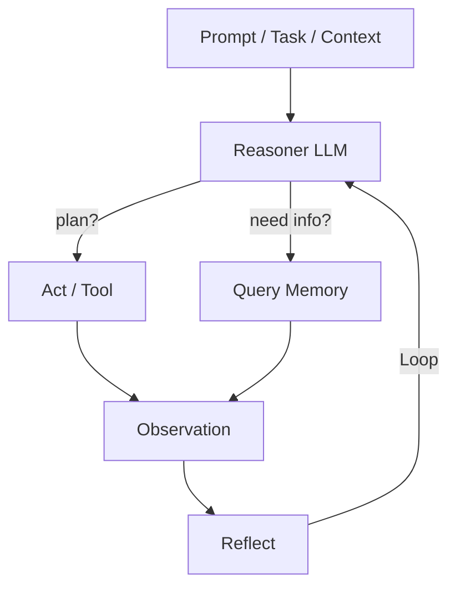

# Agent 开发

> Agent Loop · 上下文管理 · 工具调用 · AI 巡检落地

::: tip 🧠 一句话记忆锚点
**Agent = Prompt + Tools + Memory + Loop + Guardrails + Evaluation，六件缺一都会在生产坏掉。核心闭环 Perception→Plan→Act→Reflect；工具要幂等 + 校验 + 截断 + 可回滚；上下文靠分层记忆(短期原文 / 中期摘要+关键事实 pin 住 / 长期向量库)。Demo 跑通只是 20%，剩下 80% 是评测与护栏。**
:::

## 场景问题

### Agent 的最小闭环：Perception → Plan → Act → Reflect

```text
         ┌────────────────────────────┐
         │  Prompt / Task / Context   │
         └──────────────┬─────────────┘
                        │
              ┌─────────▼─────────┐
              │   Reasoner (LLM)  │
              └─────┬───────┬─────┘
            plan?  │       │  need info?
              ┌────▼─┐   ┌─▼──────┐
              │ Act  │   │ Query  │
              │ Tool │   │ Memory │
              └───┬──┘   └───┬────┘
                  │          │
              ┌───▼──────────▼───┐
              │   Observation    │
              └─────────┬────────┘
                        │
              ┌─────────▼─────────┐
              │   Reflect / Loop  │
              └───────────────────┘
```


### 主流 Agent 架构范式

| 范式 | 思路 | 代表 |
| --- | --- | --- |
| **ReAct** | Thought → Action → Observation 循环，模型自主决定下一步 | LangChain / 多数原型 |
| **Plan-and-Execute** | 先出完整计划再逐步执行，中途可 replan | BabyAGI / MetaGPT / Devin |
| **Reflexion / Self-Correction** | 每步执行完让模型自评，失败则修正 | Reflexion 论文 |
| **ToT (Tree-of-Thought)** | 并行多分支推理，最终打分选优 | Reasoning-heavy 任务 |
| **Multi-Agent 协作** | 角色分工（Planner / Coder / Critic），消息互传 | AutoGen / CrewAI / MetaGPT |

## 实现方案

### Tool Use / Function Calling

**协议本质**：LLM 输出结构化 JSON 声明"我要调用哪个工具、参数是什么"，Runtime 执行、把结果作为 `tool_result` 塞回上下文，模型继续推理。

- **OpenAI**: `tool_calls`（曾用 `function_call`）
- **Anthropic**: `tool_use` / `tool_result` 内容块
- **Gemini**: `function_calls`
- **MCP (Model Context Protocol)**: **跨模型统一的工具协议**，2024 起大厂共建

**关键设计**：
- 工具**幂等**（同参多次调用结果相同）
- 工具**参数校验 + 错误消息友好**（模型能读懂错误自我修正）
- 工具**返回大小截断**（避免打爆 context）
- 工具**副作用可回滚**（危险操作前二次确认）

### 上下文窗口管理：滑动窗口 + 语义压缩

**问题**：一个复杂任务的对话历史 + 工具输出，很快就撑爆 200k context。

**四种主流做法**（可组合使用）：

1. **朴素滑动窗口**：只保留最近 N 轮 → 简单，但**丢关键事实**
2. **摘要压缩 (Summary)**：把旧对话周期性压成摘要塞回 system prompt → 关键但**对细节不友好**
3. **语义分层 (Hierarchical Memory)**：
   - **短期记忆**：最近 N 轮原文
   - **中期记忆**：本任务的摘要 + 关键事实（KV 抽取）
   - **长期记忆**：向量库（历史相似任务）
4. **工具输出截断 + 惰性回读**：工具结果先只返摘要 + 存全文到磁盘，模型需要时再 `read_full(id)`

**关键事实抽取（AI 巡检系统落地经验）**：
- 每 K 步做一次"pinning"——让模型自己列出**必须记住的关键事实**
- 关键事实以 `key: value` 格式压入 system prompt
- 滑动窗口只对"过程日志"生效，不动关键事实

下图：短期记忆是一个**滑动窗口**（紫框右移，划出窗外的旧对话被丢弃/压缩），但被 **pin 的关键事实（绿色 📌）永不滑走**；窗外内容沉淀进中期摘要，更久远的进长期向量库。

<svg viewBox="0 0 660 240" width="100%" style="max-width:660px;height:auto" role="img" aria-label="Agent 分层记忆：短期滑动窗口 + pin 住的关键事实 + 中期摘要 + 长期向量库">
  <text x="12" y="26" font-size="12" fill="currentColor">短期：最近 N 轮原文（滑动窗口）</text>
  <g font-size="10" fill="#e2e8f0">
    <rect x="20"  y="36" width="70" height="30" rx="4" fill="#334155"/><text x="30" y="55">轮1</text>
    <rect x="96"  y="36" width="70" height="30" rx="4" fill="#334155"/><text x="106" y="55">轮2</text>
    <rect x="172" y="36" width="70" height="30" rx="4" fill="#16a34a"/><text x="180" y="55">📌关键事实</text>
    <rect x="248" y="36" width="70" height="30" rx="4" fill="#334155"/><text x="258" y="55">轮4</text>
    <rect x="324" y="36" width="70" height="30" rx="4" fill="#334155"/><text x="334" y="55">轮5</text>
    <rect x="400" y="36" width="70" height="30" rx="4" fill="#334155"/><text x="410" y="55">轮6</text>
    <rect x="476" y="36" width="70" height="30" rx="4" fill="#334155"/><text x="486" y="55">轮7</text>
    <rect x="552" y="36" width="70" height="30" rx="4" fill="#334155"/><text x="562" y="55">轮8</text>
  </g>
  <!-- sliding window frame -->
  <rect y="32" width="236" height="38" rx="6" fill="none" stroke="#a78bfa" stroke-width="2.5">
    <animate attributeName="x" values="16;240;380" dur="6s" repeatCount="indefinite"/>
  </rect>
  <text x="16" y="86" font-size="10" fill="#94a3b8">← 窗外旧轮次被压缩/丢弃，但 📌 关键事实固定保留 →</text>

  <!-- arrows down -->
  <path d="M120 66 L 120 120" stroke="#64748b" stroke-width="1.2" marker-end="url(#ah)"/>
  <path d="M330 66 L 330 176" stroke="#64748b" stroke-width="1.2" marker-end="url(#ah)"/>
  <defs><marker id="ah" markerWidth="8" markerHeight="8" refX="6" refY="3" orient="auto"><path d="M0 0 L6 3 L0 6 z" fill="#64748b"/></marker></defs>

  <text x="12" y="118" font-size="12" fill="currentColor">中期：本任务摘要 + 关键事实（KV 抽取）</text>
  <rect x="20" y="126" width="300" height="34" rx="6" fill="#1e293b" stroke="#475569"/>
  <text x="30" y="147" font-size="11" fill="#cbd5e1">summarize + extract_facts → {service, symptom, action}</text>

  <text x="12" y="186" font-size="12" fill="currentColor">长期：向量库（历史相似任务，按需召回）</text>
  <path d="M360 176 a 40 8 0 0 0 80 0 v 34 a 40 8 0 0 1 -80 0 z" fill="#0ea5e9" fill-opacity="0.25" stroke="#0ea5e9"/>
  <ellipse cx="400" cy="176" rx="40" ry="8" fill="#0ea5e9" fill-opacity="0.4" stroke="#0ea5e9"/>
  <text x="400" y="204" text-anchor="middle" font-size="10" fill="#7dd3fc">vector DB</text>
  <circle r="4" fill="#7dd3fc"><animateMotion path="M470 216 L 430 200" dur="3s" repeatCount="indefinite"/></circle>
  <text x="452" y="230" font-size="10" fill="#94a3b8">相似历史召回（一次 RAG）</text>
</svg>

### Prompt Engineering 的核心杠杆

- **System prompt** 定角色、能力边界、输出格式
- **Few-shot** 只给 3~5 个高质量示例，覆盖典型/边界/失败三类
- **CoT (Chain-of-Thought)**：思考链，先想再答
- **Self-consistency**：多次采样投票
- **Structured output**：JSON Schema / XML tag 强约束
- **XML 分块** (Anthropic 推荐)：`<task>`、`<context>`、`<examples>`——模型解析更稳
## 为什么这么做

### AI 巡检系统的滑动窗口设计（自研经验）

**场景**：巡检系统持续观察线上服务的日志 / 指标 / 告警，用 Agent 判断是否需要人工介入。

**设计要点**：
- **窗口分层**：
  - Layer-1（10 分钟）：原始告警 & 核心指标，全量入 prompt
  - Layer-2（1 小时）：LLM 摘要 + 关键事实（服务名、错误码、责任团队）
  - Layer-3（1 天）：向量化历史事件用于相似性回溯
- **语义分析压缩**：每 5 分钟触发一次压缩——`summarize + extract_facts`；产出 `{time, service, symptom, root_cause_hypothesis, action}`
- **失效恢复**：Agent 每步都要写 `current_focus` 到独立 memory；崩溃后 replay 用 `current_focus` + `Layer-2 摘要` 快速恢复
- **护栏**：涉及重启/回滚的动作**必须走审批工具**，不能自行执行

### 失败恢复三板斧

- **重试**：工具超时/网络抖动，指数退避 + jitter
- **幂等**：所有写操作用 `idempotency_key`；即使模型重试也不重复扣款/发货
- **护栏 (Guardrails)**：白名单工具集、参数域约束、危险操作 human-in-the-loop、tokens/时长/费用三重预算

### Agent 的评测方法

- **Golden Set**（黄金集）：人工构造 100~500 个典型任务，跑回归、看**成功率、步数、成本**
- **红队测试**：对抗性 prompt / 恶意输入 / 边界数据；检查是否越权、是否 leak 敏感信息
- **离线回放**：录制真实用户轨迹，改 prompt/模型后**回放对比**
- **A/B 影子流量**：新 Agent 与旧 Agent 并跑，只对比不生效

## 为什么别的选择不行

### Agent 系统的十大真实坑

1. **无限循环**：模型反复调用同一工具、参数不变 → **同调用去重 + 最大轮数熔断 + 检测参数变化**
2. **工具输出爆炸**：一次 `ls` 输出 100MB 文件列表 → 分页 + 摘要 + `head/tail` 保护
3. **参数幻觉**：模型编造参数名 → JSON Schema 强校验 + 出错时把 schema 塞回 error message
4. **上下文中毒**：早期错误结论一直污染后续推理 → **checkpoint + 重开新窗口**
5. **多 Agent 协作死锁**：A 等 B、B 等 A → 强制超时 + 指定 Coordinator
6. **副作用不可控**：Agent 直接 `rm -rf` → **敏感工具白名单**、危险命令 human-in-the-loop
7. **成本失控**：一个任务打 200 次 API → **token 预算限制** + 提前熔断
8. **latency 过高**：每步 2s，10 步 20s → 工具**本地并行**、**流式输出**
9. **评测失效**：只在 demo 上跑通 → **Golden set 回归 + 红队测试 + 影子流量**
10. **可观测缺失**：出问题不知道哪一步 → **Trace ID + 每步 span** (OpenTelemetry / LangSmith)

### 上下文压缩的边界事故

- **摘要漂移**：多轮摘要后，关键约束（"用 Python 3.10"）在压缩过程丢失
- **滑动窗口误删指令**：user 早期给的"必须遵守 XX"被踢出去后模型开始违反
- **向量检索误召**：语义相近但事实相反的历史被错误召回，模型采用了

### 主流 Agent 框架对比

| 框架 | 语言 | 定位 | 亮点 |
| --- | --- | --- | --- |
| **LangChain / LangGraph** | Python/JS | 通用，State Machine 化 (LangGraph) | 生态最大，模型/工具/存储齐全；LangGraph 引入图编排更适合生产 |
| **AutoGen (MSFT)** | Python | Multi-Agent 对话 | GroupChat 抽象、ConversationalAgent |
| **CrewAI** | Python | Role-based Multi-Agent | 角色/任务/协作模型清晰 |
| **Anthropic Claude Agent SDK** | Python/TS | Anthropic 官方，围绕 Claude 优化 | 内建工具循环、缓存、思考模式；配合 MCP 生态 |
| **Anthropic MCP** | 协议 | 工具/资源统一协议 | 让不同模型都能接同一批工具 |
| **Vercel AI SDK** | TS | 前后端统一，UI 流式 | streaming UI + tool calling 一等公民 |
| **LlamaIndex** | Python | 重 RAG | Retrieval / index 抽象强 |
| **Semantic Kernel (MSFT)** | C#/Py/Java | 企业集成 | Plugin + Planner + Kernel |

## 沉淀结论

### 面试常见问题清单（按主题分类）

**闭环与架构**
- **Q：Agent 的最小闭环是什么？** A：Perception → Plan → Act → Reflect 循环，模型自主决定下一步、观察结果再迭代。
- **Q：ReAct 和 Plan-and-Execute 区别？** A：ReAct 每步现想现做（Thought→Action→Observation）；Plan-and-Execute 先出完整计划再逐步执行、中途可 replan，适合长任务。

**工具调用**
- **Q：Function Calling 的协议本质？** A：LLM 输出结构化 JSON 声明"调哪个工具、参数是什么"，Runtime 执行后把 `tool_result` 塞回上下文继续推理；MCP 是跨模型统一的工具协议。
- **Q：工具设计四原则？** A：幂等（同参多次结果一致）、参数校验 + 友好错误（模型能自我修正）、返回截断（别打爆 context）、副作用可回滚（危险操作二次确认）。

**上下文与记忆**
- **Q：对话历史撑爆 200k context 怎么办？** A：分层记忆——短期留最近 N 轮原文、中期压成摘要 + pin 关键事实、长期进向量库；工具输出先返摘要、需要时再回读全文。
- **Q：滑动窗口/摘要压缩的典型事故？** A：摘要漂移丢关键约束、滑窗误删早期指令、向量误召语义相近但事实相反的历史——所以关键事实要 pin 住不参与滑动。

**可靠性与评测**
- **Q：Agent 生产化最容易坏在哪？** A：无限循环（同调用去重 + 最大轮数熔断）、工具输出爆炸（分页/摘要）、参数幻觉（JSON Schema 强校验）、成本失控（token 预算 + 熔断）、副作用不可控（白名单 + human-in-the-loop）。
- **Q：Agent 怎么评测？** A：Golden Set 回归（成功率/步数/成本）+ 红队对抗测试 + 离线回放 + A/B 影子流量；Demo 跑通只是 20%，评测和护栏是剩下 80%。

::: tip 心法总结
**Agent = Prompt + Tools + Memory + Loop + Guardrails + Evaluation。** 缺任何一样都会在生产坏掉——Demo 跑通只是 20% 的工作，剩下 80% 是评测和护栏。
:::

::: info 本域延伸
- Agent 的「记忆 / 长期检索」本质是一次 [RAG](/ai-llm/rag.md) 调用——向量库召回历史相似任务，同样受 chunking、rerank、"迷失在中间"等问题制约。
- 上下文窗口的 O(n²) 注意力开销、解码采样等底层约束见 [大模型核心原理](/ai-llm/llm-fundamentals.md)；latency / 成本优化（KV Cache、投机解码、量化）见 [推理与微调优化](/ai-llm/llm-inference-optimization.md)。
:::

### 记忆口诀

- **六件套**：Prompt / Tools / Memory / Loop / Guardrails / Evaluation
- **最小闭环**：Perception → Plan → Act → Reflect
- **工具四原则**：幂等 / 校验+友好错误 / 返回截断 / 副作用可回滚
- **分层记忆**：短期原文 / 中期摘要+pin关键事实 / 长期向量库
- **生产铁律**：Demo 20% / 评测护栏 80% / 熔断+预算+白名单+Trace

## 内容来源

迁移自 guide/theme-agent-dev（综合整理）

> 综合整理：Anthropic / OpenAI / LangChain 官方文档、AI 巡检自研经验（2026-07；生态更新快，请以官方文档为准）

## 自测：合上资料能说清楚吗？

1. Agent 的最小闭环由哪四步构成？它和一次普通的 LLM 调用最大的区别在哪？
<details><summary>参考答案</summary>

**Perception → Plan → Act → Reflect** 循环。区别：Agent 能**自主调用工具**获取外部信息、**观察结果**后**迭代**，普通调用是单轮无反馈的一问一答。

</details>

2. 工具（Tool Use）设计的四条原则是什么？分别防的是什么坑？
<details><summary>参考答案</summary>

**幂等**（防重试重复扣款）、**参数校验+友好错误**（防参数幻觉、助自我修正）、**返回截断**（防打爆 context）、**副作用可回滚/二次确认**（防误删误操作）。

</details>

3. 对话历史撑爆 200k context，分层记忆是怎么解决的？关键事实为什么要单独 pin？
<details><summary>参考答案</summary>

**短期**留最近 N 轮原文、**中期**压摘要+关键事实、**长期**进向量库按需召回。pin 是因为**滑动窗口会误删早期指令**、**摘要漂移会丢约束**，关键事实固定不参与滑动才不丢。

</details>

4. 对比 **ReAct** 和 **Plan-and-Execute**：各自思路、适用场景与短板？
<details><summary>参考答案</summary>

**ReAct** 每步现想现做（Thought→Action→Observation），灵活但易跑偏、步数多。**Plan-and-Execute** 先出完整计划再逐步执行、中途可 replan，适合**长任务**，但初始计划可能不准。

</details>

5. 为什么说"Demo 跑通只是 20%"？生产化最容易坏在哪几处，各配什么护栏？
<details><summary>参考答案</summary>

剩 80% 是**评测+护栏**。常坏点：**无限循环**（去重+轮数熔断）、**输出爆炸**（分页摘要）、**参数幻觉**（Schema 校验）、**成本失控**（token 预算+熔断）、**副作用**（白名单+human-in-the-loop）、**可观测缺失**（Trace+span）。

</details>

