# AI 研发工程化：规范、知识库与企业级选型

> 企业级代码仓库维护（含存量）· Spec 驱动 · Skill 库 · 代码知识图谱 · 经验演化 · evomap 解剖 · 企业落地选型

::: tip 📌 本篇主线（怎么读）
全篇围绕一个企业最痛的问题组织——**AI 时代怎么维护一个有百万行存量、多人协作、要长期演进的企业级代码仓库**。四层工程化栈（意图/方法/理解/经验）都是为这个目标服务的手段；其中「理解层」（让 agent 读懂存量代码）是重中之重，「经验层」的代表 evomap/evolver 会被单独解剖并给出生产价值判断。
:::

::: tip 🗺️ 阅读地图 + 选型决策树
**本篇是"企业级 AI 研发工程化落地"专篇**，不重复讲 LLM/Agent/RAG 基础原理——那些见姊妹篇：[LLM 原理](./llm-fundamentals.md) · [Agent 开发](./agent-dev.md) · [RAG](./rag.md) · [成本与延迟](./llm-cost-latency.md) · [应用安全](./llm-security.md) · [评测方法论](./llm-evaluation.md)。

全篇脉络：**四层栈（意图/方法/理解/经验）→ 存量代码怎么建库（三索引）→ 可复用组件选型 → 企业工程规范全景 → evomap 生产价值判断 → 参考架构 + 三面基建 + 可观测方向**。

先用决策树定位你在哪一步：
- 是 **demo 还是生产**？生产才需要私有化 + 审计回滚 + 人工闸门 + 权限隔离 + 度量闭环。
- 要解决**意图漂移**→ OpenSpec；**流程不可复现**→ Skill；**读不懂存量代码**→ CodeGraph；**经验无法沉淀**→ evomap（但先看它的生产价值判断，别盲上）。
- 补知识用 **RAG 还是微调**？高频事实/私域→ RAG；固定风格/能力内化→ 微调（详见 [微调策略](./fine-tuning.md)）。
- 用**现成 Agent 框架还是自研**？先现成、被卡了再自研。
:::

::: tip 🧠 一句话记忆锚点
**「AI 会写代码」≠「AI 能做工程」，中间隔着四层规范化：意图层（OpenSpec 把需求固化成可评审 spec）→ 方法层（Superpowers/Skill 把流程固化成可组合能力）→ 理解层（CodeGraph 把存量代码预建成结构图谱）→ 经验层（evomap/Evolver 把经验演化成可继承资产）。Skill 是「人写的静态说明书」，evomap 是「agent 自动演化的经验基因」，后者把前者当输入蒸馏（skill2gep）。企业级落地的红线不是「接哪个网络」，而是私有化 + 审计回滚 + 人工闸门 + 权限隔离 + 度量闭环。存量代码建库靠「结构图谱 + 语义向量 + 精确引用」三索引混合，可复用组件按「确定性→脚本/工具、判断类→skill、跨系统→MCP、经验→memory/gene」分层选型。基建全景分三面：控制面（spec/skill/MCP 注册 + 护栏 + 租户隔离）、数据面（模型网关 + 知识库 + 经验库 + 语义缓存）、可观测面。可观测正从「请求级 APM」转向「轨迹级 + eval 驱动」，最该追的标准是 OpenTelemetry GenAI 语义约定（`gen_ai.*`，含 agent/tool/mcp span，仍 Development）。**
:::

## 场景问题

### 从「AI 写代码」到「AI 做工程」之间的三个断层

Demo 里让模型写个函数很爽，但一放进真实工程就崩，断层集中在三处：

1. **意图漂移**：需求只存在于聊天记录里，易失、不可评审。改了模型/换个 agent，上下文全丢，产出不可复现。
2. **流程不可复现**：同一个人今天让 agent 先写测试、明天忘了，质量全看当次 prompt 心情，团队无法沉淀「我们就该这么做」。
3. **代码理解靠 grep**：agent 面对百万行存量代码，只能反复 grep + read，既慢又不准，回答不了「改这个函数会炸哪些地方」这种结构性问题。

对应地，业界这两年沉淀出四个**不同抽象层次**的工程化实践——它们不是竞品，是可以叠起来用的一条栈：

| 层次 | 解决的断层 | 代表工具 | 一句话本质 |
| --- | --- | --- | --- |
| **意图层** | 意图漂移 | **OpenSpec** | 写码前把「做什么」固化成可评审的 spec |
| **方法层** | 流程不可复现 | **Superpowers / Agent Skills** | 把「怎么做」固化成可组合的 skill 流水线 |
| **理解层** | 靠 grep 读代码 | **CodeGraph** | 把「代码长什么样」预建成结构化知识图谱 |
| **经验层** | 经验无法沉淀/继承 | **evomap / Evolver** | 把「踩过的坑」演化成可继承的经验资产 |

<svg viewBox="0 0 680 300" width="100%" style="max-width:680px;height:auto" role="img" aria-label="AI 研发工程化四层栈：意图层 / 方法层 / 理解层 / 经验层">
  <defs><marker id="pa" markerWidth="9" markerHeight="9" refX="7" refY="3" orient="auto"><path d="M0 0 L6 3 L0 6 z" fill="#64748b"/></marker></defs>
  <!-- intent -->
  <rect x="30" y="20" width="620" height="48" rx="8" fill="#1e293b" stroke="#a78bfa" stroke-width="1.6"/>
  <text x="46" y="42" font-size="13" fill="#c4b5fd">意图层 · OpenSpec</text>
  <text x="46" y="60" font-size="10" fill="#94a3b8">proposal / specs / design / tasks —— 需求变成可评审、可版本化、可重喂的产物</text>
  <!-- method -->
  <rect x="30" y="80" width="620" height="48" rx="8" fill="#1e293b" stroke="#38bdf8" stroke-width="1.6"/>
  <text x="46" y="102" font-size="13" fill="#7dd3fc">方法层 · Superpowers / Skill</text>
  <text x="46" y="120" font-size="10" fill="#94a3b8">markdown + frontmatter + 脚本，渐进式披露三层，子 agent 组合成流水线</text>
  <!-- understand -->
  <rect x="30" y="140" width="620" height="48" rx="8" fill="#1e293b" stroke="#34d399" stroke-width="1.6"/>
  <text x="46" y="162" font-size="13" fill="#6ee7b7">理解层 · CodeGraph</text>
  <text x="46" y="180" font-size="10" fill="#94a3b8">tree-sitter → 符号/边 → SQLite+FTS5 → MCP 查询（callers / impact / context）</text>
  <!-- experience -->
  <rect x="30" y="200" width="620" height="48" rx="8" fill="#1e293b" stroke="#fbbf24" stroke-width="1.6"/>
  <text x="46" y="222" font-size="13" fill="#fcd34d">经验层 · evomap / Evolver</text>
  <text x="46" y="240" font-size="10" fill="#94a3b8">GEP 协议：把经验编码成 Gene / Capsule，git 回滚 + 可跨 agent 继承</text>
  <!-- flow arrow -->
  <path d="M660 44 C 674 100, 674 168, 660 224" fill="none" stroke="#64748b" stroke-width="1.4" marker-end="url(#pa)"/>
  <text x="632" y="278" font-size="10" fill="#64748b">越往下越「活」：文档→图谱→自我演化</text>
  <circle r="4" fill="#fcd34d"><animateMotion path="M55 44 L 55 224" dur="4s" repeatCount="indefinite"/></circle>
</svg>

## 实现方案

::: tip 核心命题：企业级代码仓库怎么维护（含存量）
下面四层工具（OpenSpec / Skill / CodeGraph / evomap）单独看是散点，**串起来才是答案**。真实企业仓库有三个特征——**存量巨大、多人协作、长期演进**，对应三件必须做对的事，先建立全局观再看细节：

```mermaid
flowchart TB
    subgraph 新增变更["① 新增/变更（增量）"]
        S1[OpenSpec 写 spec<br/>意图固化·评审左移] --> S2[Skill 流水线执行<br/>TDD+子agent评审]
    end
    subgraph 读懂存量["② 读懂存量（核心难点）"]
        L1[CodeGraph 结构图谱<br/>谁调谁·改了炸哪] 
        L2[语义向量<br/>找一段做X的代码]
        L3[SCIP/LSP<br/>跨仓精确跳转]
        L1 & L2 & L3 --> LM[MCP 统一暴露]
    end
    subgraph 长期沉淀["③ 长期沉淀（跨时间）"]
        E1[ADR/事故复盘<br/>为什么这么设计]
        E2[经验资产<br/>踩过的坑]
    end
    新增变更 -->|改动前先查影响面| 读懂存量
    读懂存量 -->|每次踩坑沉淀| 长期沉淀
    长期沉淀 -.喂回.-> 新增变更
    style 读懂存量 fill:#0c2a2a
```

**一句话**：改代码前先用**理解层**看清影响面（不炸），改的时候用**意图层+方法层**保证可评审可复现（不乱），改完把**为什么**沉淀进经验层（不重复踩坑）。存量维护的胜负手在②——这是本篇后面重点展开的部分。
:::

### 一、OpenSpec —— 规格驱动（Spec-Driven Development）

- **出处**：Fission-AI，`github.com/Fission-AI/OpenSpec`。纯文件 + CLI，**不需要 API key / MCP**，本项目 `openspec/` 目录用的就是它。
- **核心思想**：不做「技术沙箱」约束，而是 **用产物约束（constraint by artifact）**——agent 必须先产出并对齐 spec，再照着 spec 执行。

**变更生命周期（三段）**：

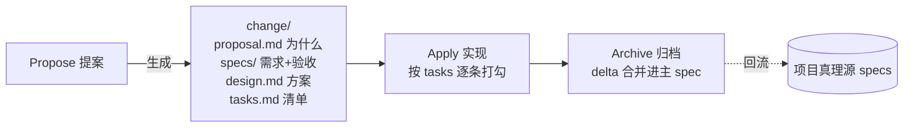

**目录结构与 delta 机制**（关键设计）：

```text
openspec/
├── specs/                 # 项目「真理源」——当前系统应该是什么样
│   └── <capability>/
├── changes/
│   └── <feature-name>/    # 一次变更，只存「相对增量 delta」
│       ├── proposal.md    # 为什么改
│       ├── design.md      # 技术方案
│       ├── tasks.md       # 实现清单（agent 逐条勾）
│       └── specs/         # 本次变更对真理源的 delta
└── changes/archive/
    └── 2026-07-13-<name>/ # 归档：delta 已 sync 进 specs
```

- 每次变更只写 **delta（增量）**，不重写全量 spec；`archive` 时才把 delta 折叠进 `specs/` 真理源，`sync` 可在不归档的情况下先同步。
- 这让 spec 始终是「活文档」：可追溯每次改了什么、为什么改，且能重新喂给任意 agent 复现。
- 对应本项目可用的 skill：`openspec-propose / apply-change / archive-change / sync-specs`（及 `opsx:*` 变体），1:1 映射上面三段。

::: tip 落地要点
OpenSpec 的杀伤力在于**把评审左移**：人只需在 propose 阶段 review 一次 spec，后面 agent 的所有代码都在 spec 约束内，review 成本从「读 800 行 diff」降到「读 1 页 spec」。
:::

### 二、Superpowers —— 方法论即 Skill 库

- **出处**：Jesse Vincent（obra）/ Prime Radiant，`github.com/obra/superpowers`，通过插件市场安装（Claude Code / Cursor / Copilot CLI 等）。
- **定位**：一整套「先想清楚再动手」的软件开发方法论，落在一组**可组合的 skill** 上。

**强制的 7 段流水线**：

```text
① 头脑风暴(校验想法) → ② git worktree(隔离分支) → ③ 计划(拆成 2~5 分钟粒度任务)
→ ④ 实现(子 agent 审查) → ⑤ TDD(强制 RED-GREEN-REFACTOR) → ⑥ 代码评审(对齐 spec) → ⑦ 收尾合并
```

**Skill 的实现机制**（理解后面 evomap 对比的关键，也是 Anthropic Agent Skills 官方规范）：

- 每个 skill = 一个带 YAML frontmatter 的 **`SKILL.md`** + 可选脚本/资源目录：

```markdown
---
name: brainstorming
description: 在动手前把模糊想法收敛成可执行方案；当用户说"我想做…"但需求不清时触发
---
# Brainstorming
（正文：步骤、检查清单、示例……命中后才加载）
```

- **渐进式披露三层（progressive disclosure）**——这是 skill 能规模化而不撑爆上下文的核心：
  1. `name` + `description` **常驻**系统提示，供模型判断「这个 skill 何时该用」；
  2. 命中后才加载 `SKILL.md` **正文**；
  3. 需要时再加载 `reference.md` 等**附件**（因此可捆绑的上下文「近乎无限」）。
- **脚本作为工具执行**：确定性强的部分写成脚本让 Claude *执行*（而非读进上下文），保证可靠性与省 token。
- **组合 + 子 agent**：高阶 skill 调用低阶 skill，用子 agent 委派离散步骤（如「让一个子 agent 专门做代码评审」）。

### 三、CodeGraph —— tree-sitter 代码知识图谱

- **出处**：与本项目 `codegraph_*` 工具签名最吻合的是 `colbymchenry/codegraph`（工具名、`.codegraph/codegraph.db`、"只暴露 explore 保持 MCP 精简" 的设计都对得上）。
- **要解决的问题**：让 agent 回答 grep 回答不了的**结构性问题**——「谁调用了 X」「改 Z 会炸哪些地方」。

**四步流水线**：

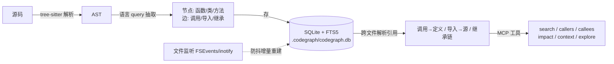

- **解析**：tree-sitter 支持 30+ 语言，用语言特定 query 抽出节点（symbol）和边（edge）。
- **存储**：本地 SQLite + FTS5 全文索引，符号查找**亚毫秒级**，完全离线无外部 API。
- **引用解析**：把 调用→定义、导入→源、继承链连起来（还能识别 web 路由等框架模式）——这是纯文本 grep 做不到的。
- **自动同步**：OS 原生文件监听 + 防抖（~500ms~2s）增量重建，索引始终跟得上代码。

::: warning 使用纪律（本项目 CLAUDE.md 已内化）
结构问题（谁调谁、改了会炸哪）用 CodeGraph；**字面文本**（字符串内容、注释、日志）才用 grep。信任 AST 结果、不要 grep 二次校验，那更慢更不准还费上下文。
:::

### 四、evomap / Evolver 深度解剖 —— 它到底是什么

这是本篇要重点"解剖 + 揭秘"的对象。先给一句最容易被营销话术掩盖的**本质判断**：

::: warning 一句话戳破
**Evolver 不是"能自己改代码进化的 AI"，它本质是一个「提示词生成器 + 经验资产的版本化账本」。** README 原文白纸黑字：*"Evolver is a prompt generator, not a code modifier"*——它扫日志、选一个经验模板、拼出一段受协议约束的提示词打到 stdout，**改不改代码由宿主运行时（如 OpenClaw）或人决定**。理解了这点，后面所有"进化/基因/继承"的比喻都能还原成朴素的工程动作。
:::

- **出处**：EVOMAP PTE. LTD.（新加坡，© 2026）；开源引擎 **Evolver**（`@evomap/evolver`，`github.com/EvoMap/evolver`，早期 MIT→现 GPL-3.0）。背后论文 arXiv:2604.15097。
- **要解决的真问题**：手改 prompt、堆 skill 文档，是**稀疏、不稳定、无法审计、无法跨 agent 继承**的经验载体。改了个 prompt 变好了，说不清好在哪、也没法安全回滚、更没法传给别的 agent。

#### 数据模型：Gene / Capsule / EvolutionEvent（生物学包装下的朴素三件套）

剥掉生物学话术，就是"经验的三张表"：

| 概念 | 生物学包装 | **朴素工程翻译** | 实际内容 |
| --- | --- | --- | --- |
| **Gene（基因）** | 可遗传的策略基因 | **一个带前置条件和校验命令的策略模板** | 五类：repair/optimize/innovate/regulatory/explore；含 preconditions、constraints、`validation` 命令数组 |
| **Capsule（胶囊）** | 完整遗传信息包 | **一次被验证过的具体修复方案** | 触发信号 + 置信度 + blast radius + 环境指纹 + **真实 code diff** + 策略步骤；内容须 ≥50 字符（防空壳） |
| **EvolutionEvent** | 基因突变记录 | **一条不可篡改的审计日志** | intent + 试过的 mutations + outcome，`events.jsonl` 追加写 |

再套一个 **GDI（Genetic Desirability Index）** 给资产排序：内在质量 35% + 使用指标 30% + 社交信号 20% + 新鲜度 15%——**说白了就是个带权重的推荐排序分**。

#### 一个进化周期到底干了什么（4 步，全是确定性动作）

```mermaid
flowchart LR
    A["memory/ 运行日志<br/>错误模式·信号"] -->|① 扫描提取 signals| B[Selector 选择器]
    B -->|② 从本地 GEP 库<br/>匹配最优 Gene/Capsule| C[命中一个策略模板]
    C -->|③ 按协议拼装| D["GEP 提示词<br/>输出到 stdout"]
    D -->|④ 追加审计| E[(EvolutionEvent<br/>events.jsonl)]
    D -.需宿主/人执行.-> F{OpenClaw / --review<br/>才真正改代码}
    F -->|git 可回滚| G[solidify 固化<br/>跑 validation 命令]
    style D fill:#2a1e05
    style F fill:#3a1010
```

**逐步拆解**：
1. **扫日志**：读 `memory/` 里的运行历史，提取错误模式、成功率等 signals（这步就是日志分析）。
2. **选模板**：Selector 从本地 `.evolver/gep/genes.json` / `capsules.json` 里匹配最合适的经验资产，输出可审计的选择决策 JSON。
3. **拼提示词**：按 GEP 协议组装出一段严格约束的提示词，**打到 stdout 就退出**——独立模式下到此为止，什么都没改。
4. **记账**：把这次 intent/mutation/outcome 追加进 `events.jsonl` 审计日志。

#### 三条真正扎实的工程约束（这才是它值得学的地方）

营销词很虚，但底层几个约束确实是好工程：

- **git 强依赖**：必须在 git 仓运行，用 git 做**回滚、算 blast radius、solidify 固化**。非 git 目录直接报错退出——把"经验变更"纳入版本控制，这个直觉很对。
- **validation 命令白名单**（`isValidationCommandAllowed`）：Gene 的校验命令**只允许 `node`/`npm`/`npx` 开头**，禁止反引号/`$(...)`命令替换、禁止 `; & | > <` shell 操作符、单命令 180s 超时、限定仓库根目录为工作目录——**防任意命令执行**，安全模型是认真做的。
- **稳定性优先熔断**：近期错误率高时**强制进入 repair 模式、暂停 innovate**；单进程锁防 fork 炸弹；外部资产（A2A 拉来的 Gene）进隔离候选区，提升前必须人工 `--validated` 审查。

#### 与宿主运行时的关系（"进化"发生在哪）

| 模式 | 行为 | 会改代码吗 |
| --- | --- | --- |
| `evolver`（独立） | 生成提示词 → stdout → 退出 | **否**，纯文本 |
| `evolver --review` | 人工逐步审查、手动应用 | 人决定 |
| 在 OpenClaw 内 | 宿主解释 stdout 里的 `sessions_spawn(...)` 指令 | 宿主决定 |
| `evolver --loop` | 守护进程跑后台自维护（validator/worker/solidify） | 否，且 stdout 被自己消费 |

**关键**：所谓"自我进化"从来不是引擎自己动手，而是**引擎产出指令、宿主/人执行、git 兜底回滚**——它是"进化的编排者与账本"，不是"进化的执行者"。

#### EvoMap Hub 与 A2A：把经验做成网络（争议最大的一层）

- 可选连 **EvoMap Hub**，通过 **A2A（agent-to-agent，HTTP+JSON）协议**跨 agent 发布/拉取/继承 Gene——口号 "one agent learns, a million inherit"。
- 配套 **`skill2gep`**：把任意 Skill *蒸馏*成 Gene/Capsule——即它把 Skill 当**输入原料**（所以下文说 Skill 是 Gene 的低阶形态）。
- 但 Hub 层堆了一大套重机制：Credits 代币经济、AI Council 自治治理（投票/否决）、Arena 竞技评分、Swarm 多 agent 协作、DID 身份 + reputation……**这些离"帮企业维护代码仓库"已经很远，更像一个 to-C 的 agent 社交/激励网络**。

::: warning 可信度提示（务必打折）
star 数（~8.9k）、"CritPt 9.1%→18.57%""45 场景 4590 次对照实验""省 token"等均为**项目方自述/营销口径**，论文（arXiv:2604.15097）正文数字未经独立复核。且项目自曝**抄袭纠纷**（指同赛道 Hermes 系统高度相似）后从完全开源退到 **source-available / 许可证收紧**。以下对「思想」与「具体产品」严格区别对待。
:::

## 为什么这么做

### Skill 与 evomap 的本质区别

先给结论：**二者不在同一抽象层，且 evomap 被明确定位成对 Skill 范式的「替代/超越」来打。**

- **Skill = 静态能力说明书**：人写好的 markdown + 脚本，描述「遇到这类任务按这个流程做」。文档导向、靠人维护、用了也不会变。
- **evomap = 演化式经验资产**：从运行经验里自动提炼、可自我改进、可跨 agent 网络继承。

| 维度 | Skill | evomap（Gene） |
| --- | --- | --- |
| 载体 | 人写的 markdown 文档 | 编译出的紧凑「基因」表示 |
| 谁维护 | 人手工写/改 | agent 从运行经验中自动演化 |
| 是否自我改进 | 否（静态） | 是（test-time evolution） |
| 共享方式 | 复制文件 | 网络继承（Hub / A2A 协议） |
| 与彼此关系 | evomap 的**输入原料** | 用 `skill2gep` 把 Skill 蒸馏成 Gene |
| 论文主张 | 「信号不稳、稀疏」 | 「紧凑表示控制信号更强、效果更好」 |

**一句话记法**：Skill 是「写死的招式」，Gene 是「打完架自己会长本事、还能传给别的 agent 的肌肉记忆」；而 Skill 是 Gene 的低阶形态。

### ⭐ 核心：企业级存量代码仓库怎么维护

企业最大的资产（也是最大的负债）是**百万行存量代码**。「让 AI 维护存量」和「让 AI 写新代码」是两个难度量级——新代码 agent 从零生成即可，**存量代码 agent 首先得"读懂"它，尤其读懂"改一处会牵连哪些地方"**。这一节把它拆成"三步走 + 三索引 + 选型 + 反模式"。

#### 存量维护的三步闭环：定位 → 影响面 → 安全改

真实场景：接到一个"给下单接口加个风控校验"的需求，面对百万行陌生代码，AI（和人）都要走这三步：

```mermaid
flowchart LR
    N[需求/缺陷] --> S1["① 定位<br/>相关代码在哪"]
    S1 -->|语义向量找模糊意图<br/>SCIP 精确跳定义| S2["② 影响面分析<br/>改了会炸哪"]
    S2 -->|CodeGraph callers/impact<br/>逆向调用链| S3["③ 安全改动<br/>改 + 补测试 + 验证"]
    S3 -->|Skill TDD 流水线<br/>CI 回归| S4["④ 沉淀<br/>ADR/经验"]
    S4 -.下次复用.-> S1
    style S2 fill:#2a1e05
```

- **① 定位**：模糊需求（"哪段做鉴权"）走**语义向量**；已知符号名走 **SCIP 精确跳转**。
- **② 影响面分析（最关键）**：改一个函数/字段前，用 **CodeGraph 的 `callers`/`impact`** 逆向查出所有调用方、继承链、跨文件引用——**这是纯 grep 永远做不到的，也是"AI 敢不敢改存量"的分水岭**。
- **③ 安全改动**：在影响面清单约束下改，配合 Skill 的 TDD 流水线补测试、CI 回归。
- **④ 沉淀**：把"为什么这么改"写进 ADR / 经验库，下次同类改动直接复用。

#### 三种互补索引（code 版 GraphRAG）

让 agent 真正「懂」存量，靠**三种互补索引**，实战里混合用：

| 索引类型 | 回答什么 | 技术 | 代表方案 | 精度/成本 |
| --- | --- | --- | --- | --- |
| **结构图谱** | 谁调谁、改了炸哪、继承链 | tree-sitter → 符号/边 → 图/SQLite | **CodeGraph**、Sourcegraph | 高精度、低成本、离线 |
| **精确引用** | 跨仓精确「定义/引用」跳转 | LSP / SCIP / LSIF 索引 | Sourcegraph、`scip-*` 系列 | 最精确、需编译期信息 |
| **语义向量** | 「哪段代码做鉴权」这类模糊意图 | 代码 embedding + 向量库 | LlamaIndex/Chroma、Cody | 召回模糊需求、有幻觉风险 |

**三者各管一段，缺一不可**：向量解决"从自然语言找到代码"（入口模糊），SCIP 解决"精确定位定义/引用"（点对点），结构图谱解决"这个改动的爆炸半径"（面）。**只有结构图谱能回答影响面——所以它是存量维护的主干，另两者是辅助。**

**落地流程（推荐组合）**：

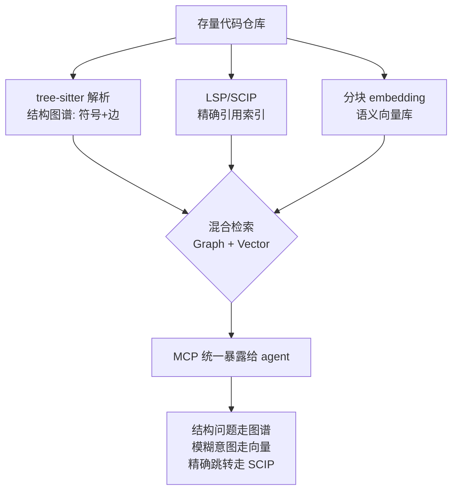

**选型决策**：

- **中小仓 / 单语言 / 要快**：直接上 **CodeGraph**（tree-sitter + SQLite，零基建、离线、亚毫秒）。本项目就是这个档位。
- **大型多仓 / 多语言 / 要精确跨仓跳转**：**Sourcegraph + SCIP/LSIF**，编译期精确引用是它的护城河。
- **需求模糊、要"找一段做 X 的代码"**：加**语义向量层**（code embedding，如 CodeBERT/嵌入模型 + Chroma/pgvector），但务必用结构图谱**校准**幻觉。
- **反模式**：只做「全代码丢进向量库做 RAG」——代码的价值在**结构关系**（调用/依赖），纯向量丢掉了边，agent 会「看得懂片段、算不清影响面」。**结构图谱是主干，向量是补充。**

::: tip 沉淀经验：知识库不只是代码
存量代码知识库 = **代码结构图谱 + 语义向量 + 沉淀文档（ADR/wiki/事故复盘）**。前两者机器建，第三者是人 + agent 持续沉淀的「为什么这么设计」——这部分恰好是 OpenSpec 的 spec 和 evomap 的 Gene 想固化的东西。
:::

#### 代码图谱能做什么：从 CodeGraph 到 Graphify

上面讲的三种索引里，**结构图谱**是存量维护的主干。它到底能做什么？以开源工具 **[Graphify](https://github.com/Graphify-Labs/graphify)**（YC S26，tree-sitter + 知识图谱，非向量）为例，结构图谱的能力边界一目了然：

| 能力 | 做什么 | 为什么 grep/向量做不到 |
| --- | --- | --- |
| **跨文件边解析** | `calls`/`imports`/`inherits`/`mixes_in` 跨 ~40 语言解析 | grep 只匹配字面文本；向量丢结构边 |
| **最短路径查询** | `graphify path "FastAPI" "ModelField"` → 3 hop 路径 | 需要图遍历算法（BFS/Dijkstra），非文本匹配 |
| **God node 检测** | 找最高连接度的节点——系统瓶颈/单点 | 需要图的 degree 统计 |
| **社区发现** | Leiden 算法把图切成子系统 | 需要图聚类，纯文本/向量无社区概念 |
| **边置信度标注** | 每条边标 `EXTRACTED`（源码显式）或 `INFERRED`（推断） | 让 agent 知道哪些关系是确定的、哪些可能幻觉 |
| **设计理由节点** | `# NOTE:`/`# WHY:` 注释、ADR/RFC 引用变成一等节点 | 把"为什么这么设计"和代码结构关联起来 |

**Graphify 相比 CodeGraph 的进阶**：

- **零 LLM 依赖**：代码解析纯 tree-sitter（确定性、离线、零 token 成本），只有 docs/PDF/images 的语义 pass 才调模型——**代码图谱不需要 LLM，这是确定性的胜利**。
- **边置信度**：每条边带 `EXTRACTED`/`INFERRED` 标签，agent 可以区分"源码里写死的"和"推断出来的"——**这对存量维护至关重要：改 `EXTRACTED` 边影响面确定，改 `INFERRED` 边需要人工确认**。
- **社区发现自动切子系统**：不用人手画边界，Leiden 算法自动发现模块聚类——**对应到影响面分析，改一个 God node 波及多个社区 = 高风险改动**。
- **Benchmark**：LOCOMO recall@10 = 0.497（mem0 仅 0.048），LongMemEval QA accuracy = 76%，graph build LLM credits = **0**。

**选型谱系更新**：

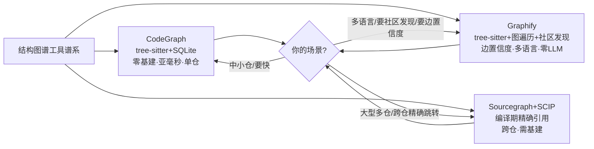

::: tip 心法
**结构图谱的价值不在"存了什么"，在"能查询什么"**——路径查询、社区发现、God node 检测、边置信度，这些都是 grep 和向量**原理上做不到**的。选结构图谱工具时，问自己：它能不能回答"改这个函数炸哪"？能回答的就是合格的图谱，不能的就只是个带索引的 grep。
:::

#### CodeGraph 实战：从"找入口"到"查子图"的范式转变

上面讲的是结构图谱**能做什么**，现在来看**实际怎么用**。核心命题来自一个工程现实：

> **代码 Agent 真正卡住的地方，往往不是模型不会写代码，而是它不知道该先看哪里。**

传统 Agent 面对陌生仓库的链路是：列目录 → 搜关键词 → 打开几个文件 → 猜入口点 → 发现不对 → 重复一轮。这个过程的根本问题是**把结构性问题降级成了文本命中问题**——"登录请求怎么写入数据库"需要的是路由→handler→service→repository→ORM 的关系链，不是 20 个包含 `login` 的文件。

**CodeGraph 的四层建图链路**：

```mermaid
flowchart LR
    subgraph Extraction["① 抽取层"]
        E1[tree-sitter + WASM<br/>多语言并行解析]
        E2[函数/类/路由/组件 → 节点]
        E3[调用/继承/导入 → 边]
        E4[未确定关系 → unresolved_refs]
    end
    subgraph Resolution["② 解析层"]
        R1[框架语义补全]
        R2[Express app.post→handler]
        R3[Spring @Annotation→method]
        R4[React JSX→子组件引用]
        R5[import 标识符→真实定义]
    end
    subgraph Query["③ 图查询层"]
        Q1[search: 符号在哪定义]
        Q2[callers/callees: 调用关系]
        Q3[trace: 执行路径追踪]
        Q4[impact: 影响面分析]
    end
    subgraph Context["④ 上下文构建层"]
        C1[自然语言问题→相关子图]
        C2[入口点+主要链路+关键代码]
        C3[stale 提示: 刚改的文件标记]
    end
    Extraction --> Resolution --> Query --> Context
    style Resolution fill:#0c2a2a
```

**Agent 工具选择表（给模型明确规则，否则它会退回 grep）**：

| 问题类型 | 该用什么工具 | 典型场景 |
| --- | --- | --- |
| "X 在哪里定义" | `codegraph_search` | 查符号、函数、类 |
| "这个功能怎么跑起来" | `codegraph_context` | 围绕自然语言组装相关代码上下文 |
| "请求如何穿过系统" | `codegraph_trace` | 追踪一条执行路径或调用链 |
| "改这里会影响什么" | `codegraph_impact` | 下游影响面分析 |
| "谁调用我 / 我调用谁" | `codegraph_callers` / `codegraph_callees` | 直接/间接调用关系 |
| 已锁定一个符号 | `codegraph_node` → 直接读源码 | 看结构化详情后补细节 |

**核心原则：先结构，后细节**——先用图查询锁定入口和链路，再按需读具体文件。这个顺序能显著减少 Agent 的无效探索（实测：~16% 成本节约、58% 工具调用减少、22% 速度提升）。

**Resolution 层——代码图谱的真正难点**：

AST 能告诉你"这里有个函数调用"，但很多工程语义不写在普通调用里。Resolution 层负责补全这些框架约定关系：

| 框架场景 | 文本搜索看到的 | 图谱应该补出的关系 |
| --- | --- | --- |
| Express / NestJS | URL 字符串、handler 名称 | `POST /login` → `loginHandler` |
| Spring / FastAPI / Django | 注解、装饰器 | Controller/route → action 方法 |
| React / Vue / Svelte | JSX、模板标签 | 父组件 → 子组件 |
| React Native / Expo | NativeModule、Bridge | JS API → Native 实现 |
| 普通模块系统 | 相对路径、别名 | import 标识符 → 真实定义 |

::: warning 边的置信度是工程红线
框架规则覆盖到的关系是精确的；没覆盖到的动态行为（反射、运行时注入、动态加载）只能靠启发式补边。**工程上必须把边的来源和置信度一并保存**——Agent 回答时能区分"精确解析"和"推断结果"，改 `EXTRACTED` 边影响面确定，改 `INFERRED` 边需要人工确认。这也是 Graphify 的 `EXTRACTED`/`INFERRED` 标签设计被借鉴到 CodeGraph 的原因。
:::

**索引保鲜——不要让 Agent 信过期的图**：

CodeGraph 用 FileWatcher + debounce + 增量同步解决这个问题。同步完成前，MCP 工具返回结果时**带上 stale 提示**，告诉 Agent 哪些文件刚改过、相关结论可能过期。这个设计比"假装图永远正确"更诚实——**Agent 可以继续信任未变更文件的结构结论；对刚保存的文件，直接读取源码更稳**。

**MCP 接入的工程要点**：

- **共享后台进程**：Cursor、Claude Desktop、脚本工具连接同一个 `codegraph serve --mcp` 进程，避免每个客户端重复索引。
- **Skill 固化分析流程**：把"检查索引状态 → 必要时初始化 → 调用 `context` → 按结果补查 `callers`/`impact` → 固定结构输出"封成 Skill，让非代码专家也能问结构问题，Agent 也不容易一上来就全文搜索。

**CodeGraph 的局限（不能盲信的边界）**：

| 维度 | grep 路线 | CodeGraph 路线 |
| --- | --- | --- |
| 入口发现 | 多轮猜测，依赖命名和经验 | 直接查符号、路由、组件节点 |
| 调用链 | 人工跨文件追踪 | `trace`/图遍历返回路径 |
| 影响面 | 搜调用点后手动判断 | `impact` 给出下游关系 |
| Token 消耗 | 容易读入大量无关源码 | 只取相关子图和片段 |
| **动态行为覆盖** | 同样弱，靠人继续判断 | **静态分析仍不能完全覆盖** |

::: tip 一句话收口
**CodeGraph 不是给 Agent 更多上下文，而是给它更少、更准、更接近工程结构的上下文。** 它是"结构导航仪"而非"绝对真相源"——影响面分析只能提示风险，不等于证明没有风险；动态行为、反射、运行时配置仍需测试和日志佐证。
:::

### 可复用组件的方法与选型

「可复用组件」在 AI 研发里有一条**从轻到重的谱系**，选型看**确定性**和**复用边界**：

| 组件形态 | 复用粒度 | 何时用 | 载体 |
| --- | --- | --- | --- |
| **Prompt 模板** | 最细 | 固定输出格式/角色 | 字符串 / 模板文件 |
| **Tool / Function** | 单一确定动作 | 确定性强、需精确执行（查库、算数、调 API） | 代码函数 |
| **MCP Server** | 跨 agent/跨模型 | 一批工具要给多个 agent/IDE 复用 | 独立进程 + 协议 |
| **Skill** | 一套判断+流程 | 「遇到这类任务该怎么做」的方法沉淀 | markdown + 脚本 |
| **Subagent** | 一个子任务闭环 | 需要独立上下文/角色的离散步骤（如专职评审） | agent 定义 |
| **经验资产 (Gene/Memory)** | 跨任务经验 | 从历史里自动沉淀、可继承的「教训」 | 演化资产 / 记忆库 |

**选型心法**：

- **确定性动作 → 写成 Tool/脚本**，别让模型「每次重想」（既贵又不稳）。
- **判断 + 流程 → 写成 Skill**，用渐进式披露，`description` 写清「何时触发」。
- **要跨系统/跨模型复用 → 包成 MCP Server**，一次实现处处接（本项目的 CodeGraph、ruflo 都是 MCP）。
- **需要独立上下文的子任务 → 拆成 Subagent**，避免污染主上下文。
- **反复踩同一个坑 → 沉淀成经验资产**（记忆库/Gene），让下次自动规避。
- **黄金法则**：能用确定性代码解决的，绝不留给模型即兴发挥；能沉淀成组件的，绝不散落在 prompt 里。

### 企业级工程规范全景：AI 只是新增的一环

前面几节聚焦"AI 相关"的工程化，但企业级仓库的规范是一整套**在 AI 之前就存在、AI 之后必须适配**的护栏体系。把它们拉齐成一张清单——**这也是"AI 生成的代码凭什么敢合进主干"的答案：因为它和人写的代码走同一套门禁。**

```mermaid
flowchart LR
    subgraph Dev["开发期"]
        C1[编码规范<br/>lint/format]
        C2[类型/静态分析]
        C3[分支策略<br/>trunk/git-flow]
    end
    subgraph PR["提交/评审期"]
        P1[Commit 规范<br/>Conventional Commits]
        P2[Code Review<br/>CODEOWNERS]
        P3[pre-commit hook]
    end
    subgraph CI["CI 门禁"]
        G1[测试+覆盖率门]
        G2[SAST/依赖扫描]
        G3[构建可复现]
    end
    subgraph Rel["发布/运维期"]
        R1[语义化版本<br/>SemVer]
        R2[灰度/回滚]
        R3[可观测+审计]
    end
    Dev --> PR --> CI --> Rel
    Rel -.事故复盘 ADR.-> Dev
    style CI fill:#0c2a2a
```

#### 1. 编码规范与静态门禁（左移的第一道闸）

| 维度 | 做法 | 工具举例 | AI 时代的变化 |
| --- | --- | --- | --- |
| **格式统一** | 自动格式化，杜绝风格 diff | Prettier / gofmt / black / rustfmt | AI 产出直接过 formatter，评审只看逻辑 |
| **Lint 规则** | 强制可维护性/反模式检查 | ESLint / golangci-lint / clippy / ruff | 把团队约定写成 lint 规则，AI 也被约束 |
| **静态分析/类型** | 编译期抓 bug | TypeScript strict / mypy / 静态扫描 | AI 幻觉出的类型错误当场被拦 |
| **复杂度门** | 圈复杂度、函数长度上限 | SonarQube / lizard | 防 AI 生成"能跑但没人能维护"的巨函数 |

**心法**：把"人评审时会说的话"尽量固化成**机器可执行的 lint/类型规则**——AI 生成量大，纯人肉 review 顶不住，必须让机器先过一遍。

#### 2. 分支策略与提交规范

- **分支模型**：`trunk-based`（主干开发 + 短命特性分支 + feature flag，CI/CD 友好，主流推荐）vs `git-flow`（多长期分支，适合有明确发版周期的传统交付）。AI 生成的改动尤其适合 trunk-based——**小步、频繁、快速合并**，避免长命分支累积巨型 diff 难评审。
- **Conventional Commits**：`feat: / fix: / docs: / refactor:` 规范化提交信息 → 自动生成 CHANGELOG、自动推导语义化版本。让 AI 也按这个格式写 commit。
- **CODEOWNERS**：按目录指定负责人，PR 自动请求对应 owner 评审——**AI 改到谁的地盘，谁必须 review**，责任不因 AI 生成而消失。

#### 3. 测试与质量门（AI 代码合入的硬闸）

::: warning AI 生成代码合入的红线
**"AI 写的"不能成为跳过测试的理由——恰恰相反，AI 代码更需要门禁。** 因为 AI 会写出"看起来对、跑起来错"的代码。合入必须过：
:::

| 门禁 | 标准 | 说明 |
| --- | --- | --- |
| **单元测试** | 新增/改动代码必须带测试 | 配合 Superpowers 的 TDD 强制 RED-GREEN |
| **覆盖率门** | diff 覆盖率 ≥ 阈值（如 80%） | 用 diff-cover 只卡新增代码，不为存量还债 |
| **回归测试** | 全量/关键路径 E2E 通过 | 防 AI 改动引发影响面外的连锁故障（呼应上文影响面分析） |
| **契约测试** | 接口变更不破坏消费方 | 微服务/多仓场景 Pact 类工具 |
| **变更影响回归** | CodeGraph impact 圈定的受影响模块重点测 | 把结构图谱的影响面清单接进 CI |

#### 4. 安全与供应链规范（AI 时代放大的风险面）

AI 会"自信地"引入有漏洞的依赖、写出注入风险的代码、甚至幻觉出**不存在的包名**（被攻击者抢注 = "slopsquatting"投毒）。必须补齐：

| 环节 | 规范 | 工具 |
| --- | --- | --- |
| **SAST** | 代码静态安全扫描 | Semgrep / CodeQL / SonarQube |
| **SCA/依赖扫描** | 第三方库 CVE + 许可证合规 | Dependabot / Snyk / OSV-Scanner |
| **密钥扫描** | 阻止密钥进仓 | gitleaks / trufflehog（pre-commit + CI 双卡） |
| **SBOM** | 软件物料清单，供应链可追溯 | Syft / CycloneDX |
| **依赖存在性校验** | 防 AI 幻觉包名被投毒 | 锁定 lockfile + 私有 registry 白名单 |
| **产物签名** | 构建产物可验真 | Sigstore / cosign |

**运行时命令守卫（agent 的最后一道安全网）**

上面都是**静态**安全门（代码合入前），但 agent 在**运行时**执行的命令同样需要护栏——AI 偶尔会跑出 `git reset --hard`、`rm -rf ./src`、`DROP TABLE users` 这类**不可逆**的灾难命令。开源工具 **[dcg](https://github.com/Dicklesworthstone/destructive_command_guard)**（Destructive Command Guard，Rust + SIMD，亚毫秒级）专门解决这个问题：

| 能力 | 做什么 | 为什么需要 |
| --- | --- | --- |
| **Pre-execution hook** | 在命令执行**前**拦截，阻断并给出安全替代建议 | 事后回滚来不及，`rm -rf` 删了就是删了 |
| **50+ 安全 Pack** | 按域分类：`core.git`/`core.filesystem`（默认开）→ `database.*`/`kubernetes.*`/`cloud.*`/`containers.*`/`cicd.*`（按需开） | 精确匹配团队技术栈，不误报不漏报 |
| **上下文感知** | 不拦 `grep "rm -rf"`（数据），拦 `rm -rf /`（执行） | 传统正则会误杀，dcg 区分"引用"与"执行" |
| **heredoc 扫描** | 拦截 `python -c "os.remove(...)"` 等内嵌脚本 | agent 会把破坏性逻辑藏在 `-c`/heredoc 里 |
| **Agent 信任等级** | 按 agent 配置不同策略——`claude-code` trust=high 放宽 allowlist，`unknown` agent trust=low 加严 pack + 禁 allowlist | 不同 agent 可靠性不同，一刀切要么太松要么太紧 |
| **Fail-Open 设计** | 超时/解析错误时不阻断 | 安全工具不能自己变成故障源 |
| **CI scan mode** | pre-commit + CI 集成，在代码审查阶段拦截 | 运行时拦 + CI 静态扫 = 双保险 |

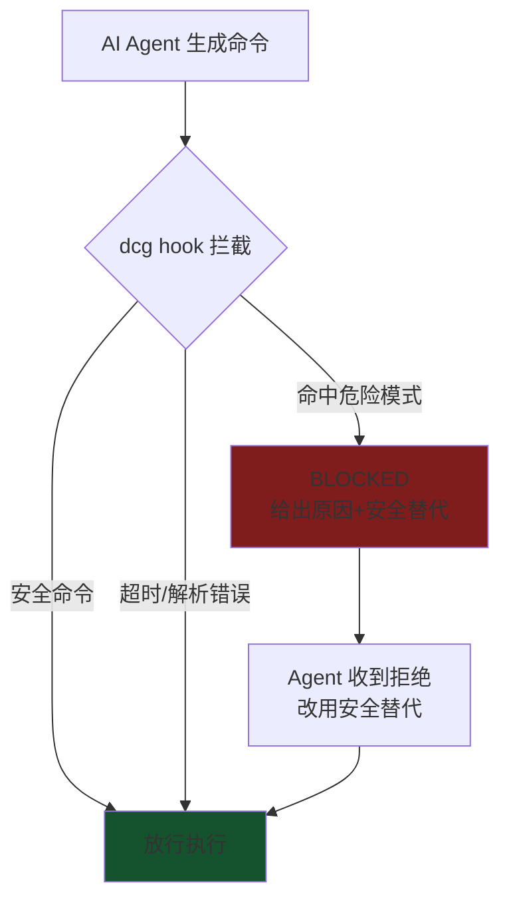

::: tip 静态门 + 运行时门 = 双层防线
**SAST/SCA/密钥扫描管"代码合入前"，dcg 管"命令执行前"**——两者覆盖 agent 生命周期的不同阶段。静态门拦不住运行时即兴生成的 `DROP TABLE`，运行时门也不该替代静态审查。企业级安全 = **左移静态门（合入前）+ 运行时守卫（执行前）+ 审计追溯（执行后）** 三层。
:::

::: tip AI 特有的一条
**AI 生成的代码要走"更严"而非"更松"的安全门**——因为它的错误模式和人不同（幻觉包、复制了带漏洞的训练样本），传统 review 的直觉容易漏掉。
:::

#### 5. 文档与知识规范（把"为什么"沉淀下来）

- **ADR（Architecture Decision Record）**：每个重要技术决策记一条"背景→选项→决定→后果"，让半年后（或接手的 agent）知道**为什么这么设计**。这正是 [OpenSpec 的 spec](#一openspec-规格驱动spec-driven-development) 和存量知识库里"人+agent 沉淀文档"那一层。
- **README/贡献指南/CLAUDE.md**：人看的贡献规范 + **给 agent 看的仓库约定**（本项目的 `CLAUDE.md` 就把"结构问题用 CodeGraph、字面文本才用 grep"这类纪律写进去，让每个进来的 agent 自动遵守）。
- **API/接口文档即代码**：OpenAPI/protobuf 作真理源，文档从代码生成，杜绝文档漂移。

#### 6. 发布与运维规范

- **语义化版本（SemVer）** + 自动化 release（由 Conventional Commits 推导版本、生成 CHANGELOG）。
- **灰度发布 + 快速回滚**：金丝雀/蓝绿，异常自动回滚——AI 改动上线尤其要有"一键退回"的底气。
- **全链路可观测 + 审计**（见下文可观测三面）：AI 参与的每一步都要能追溯、能定责。

::: tip 一句话收口
**企业级工程规范 = 一套从开发到运维的机器可执行护栏，AI 不是特例而是必须适配的新参与者。** 判断一个团队 AI 工程化成不成熟，就看"AI 生成的代码"和"人写的代码"是不是走**同一套、甚至更严的**门禁——如果 AI 代码能绕过 lint/测试/安全扫描直接合入，那不是效率，是定时炸弹。
:::

#### 7. 协调与共识规范（AI 消除的摩擦，恰恰是团队理解的载体）

前面六维都是**技术**护栏，但企业级软件项目真正的瓶颈从来不是"个人写代码的速度"，而是**团队对系统的共享理解能不能保持一致**。Armin Ronacher 在 [The Tower Keeps Rising](https://lucumr.pocoo.org/2026/7/13/the-tower-keeps-rising/) 里用巴别塔做了一个精妙的类比：

> *They use it [brick] for a civilizational project: let us build us a city and a tower, whose top may reach unto heaven. … the people is one, and they have all one language, and now nothing will be restrained from them.*

巴别塔的力量不在于砖头，在于**协调**——共享语言让个体工作能组合成无人独建的东西。上帝没有没收砖头或制砖技术，而是夺走了他们理解彼此的能力，工程随即停滞。

**AI 时代的巴别塔困境**：agent 消除了开发间的摩擦——以前改别人的存储层要读他的代码、问他问题、跟依赖方协调，这个过程慢，但**慢里有一部分不是浪费，而是"你的理解变成我的、双方确认系统仍按共识运作"的过程**。现在每个人都能让 agent 在自己不理解的角落做局部改动，改动合理、测试通过、解释按需生成，**但没有人需要和彼此交流，也没有人被迫学习那部分曾经被迫学习的共享模型**。

::: warning 核心洞察
**塔不会倒，只是不断升高——我们注意不到丢了什么。** 在巴别塔里，语言分裂导致停工；在 AI 辅助工程里，**共享理解已经坍塌，工程仍能继续**。没有即时失败，这恰恰是最危险的地方。
:::

**摩擦被消除后，必须人为补上"共识同步机制"**：

| 被消除的摩擦 | 原来的作用 | AI 时代的替代机制 |
| --- | --- | --- |
| **读别人的代码才能改** | 被迫理解对方模块的边界和不变量 | CodeGraph 影响面分析 + ADR 强制记录"为什么" |
| **跨团队协调才能改接口** | 暴露隐式依赖、消费方否决权 | CODEOWNERS + 契约测试 + OpenSpec spec 评审 |
| **向同事解释改动** | 检验自己是否真理解、暴露盲区 | PR 描述模板 + LLM-as-judge 审查 + 强制 design review |
| **手动跑测试才知道炸没炸** | 迫使改动者关注影响范围 | CI 回归 + CodeGraph impact 圈定模块重点测 |
| **代码评审争论** | 共享理解在辩论中同步 | 保留人审（AI 辅助 review 但不替代决策）+ 架构决策定期对齐会 |

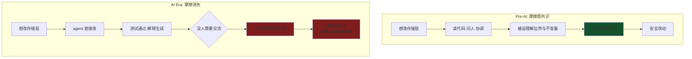

**落地实践**：

- **强制架构决策对齐**：涉及跨模块/跨团队接口改动，即使 agent 能一键完成，也必须走 OpenSpec spec 评审——**不是为了拦改动，是为了让共识在改动落地前同步**。
- **定期"系统漫步"（System Walkthrough）**：团队定期一起走一遍系统架构（CodeGraph 可视化图就是好材料），确认每个人脑子里的模型仍然对齐——**agent 不会替你做这件事，因为 agent 不需要理解整个系统也能改局部**。
- **PR 描述不只是给 reviewer 看的**：写 PR 描述的过程本身是"强迫改动者用共享语言表达改动意图"——如果写不清楚，说明改动者自己也没真理解，**这正是曾经会被摩擦暴露的盲区**。
- **Guardrails 不是效率敌人**：dcg 拦 `git reset --hard`、CodeGraph 圈影响面、契约测试守接口——这些护栏**人为重建了被 agent 消除的摩擦**，而那部分摩擦是共识的载体。

::: tip 最终心法
**企业级工程规范的第七维，是技术之外的维度：协调与共识。** 前 6 维管"代码质量"，第 7 维管"团队对系统的共享理解能不能在 AI 消除摩擦后继续存活"。一个团队 AI 工程化真正成熟的标志，不是 agent 能跑多快，而是**塔升高的时候，所有人仍然说同一种语言**。
:::

## 为什么别的选择不行

### 🔍 揭秘：evomap 在生产环境到底有没有实际价值

这是最该冷静回答的问题。结论先行——**把它拆成三层看，价值从高到低急剧衰减**：

```mermaid
flowchart TD
    Q[evomap 生产价值？] --> L1
    L1["① 范式层<br/>经验→可审计资产→可继承"] -->|✅ 真价值| V1["值得学并自建<br/>方向是对的"]
    L1 --> L2["② 引擎层<br/>Evolver 提示词生成器 + git 审计"]
    L2 -->|🟡 有限价值| V2["单机/团队内可试<br/>但只是 prompt 编排器"]
    L2 --> L3["③ 网络层<br/>Hub/A2A/Credits/Council"]
    L3 -->|❌ 企业红线| V3["数据主权/合规/锁定<br/>生产禁用"]
    style V1 fill:#0c2a0c
    style V2 fill:#2a2405
    style V3 fill:#3a1010
```

**① 范式层：真价值，值得学。** 它踩中的问题是真的——skill/prompt 靠人手写、不自我改进、经验无法跨 agent 沉淀。「把 agent 经验做成**版本化、可审计、可回滚、可继承**的资产」是确定性方向。"经验编译成紧凑表示而非长文档"在信息论上也站得住（文档是稀疏、不稳定的控制信号）。git 当审计/回滚底座的工程直觉扎实。**这一层无论你用不用它的产品，思路都该吸收。**

**② 引擎层：有限价值，看清它只是个 prompt 编排器。** Evolver 本身不神奇——扫日志、选模板、拼提示词、记账，外加一套还算认真的 validation 白名单和稳定性熔断。**它的实际产出是"更结构化的提示词 + 一本经验账本"，不是"自动变强的代码"。** 单机或小团队内，如果你本来就在手动攒 prompt 经验，用它做个规范化账本**边际有用**；但别指望它"自己把系统进化好"——真正的改动还是宿主/人做，它只是把经验组织得更规整。

**③ 网络层：企业红线，生产不能碰。** Hub/A2A/Credits/AI Council/Swarm 这一整套，对企业是**纯负债**：

| 生产环境考量 | evomap 网络层的问题 | 后果 |
| --- | --- | --- |
| **数据主权** | Gene/Capsule 里编码着业务逻辑与内部实现，publish 到公共 Hub = 泄密 | 核心资产外流 |
| **可审计/定责** | "一个学百万继承"意味着来源不可控的经验被自动摄入 | 出事无法定责 |
| **质量闸门** | 自动演化会**放大错误经验**，GDI 排序不是正确性保证 | 错误被规模化传播 |
| **供应链风险** | A2A 拉取外部 Gene 含 validation 命令，虽有白名单仍是可执行入口 | 潜在注入面 |
| **可持续性** | 抄袭纠纷 + 许可证收紧 + 强绑自家协议/代币 | 法律与锁定风险 |

::: tip 最终判断（面试可直接背）
**evomap 的价值是"范式启发"，不是"生产工具"。** 正确姿势：**学它的范式（经验→可演化资产→可审计可继承），自建企业内的"经验资产层"，坚决不接它的公共网络。** 具体产品有数据自述、许可证收紧、生态锁定三面红旗，不值得 all-in；但"经验资产版本化"这个方向，是每个企业 AI 研发平台迟早都要自己做的一块。
:::

### 企业级落地：为什么不能直接接公共网络

evomap 式「连公共 Hub、一个学百万继承」在 to-C 玩得转，**在企业里是红线**。企业级形态应该是**自建「经验资产层」**，而非接入外部网络：

| 企业红线 | 为什么公共方案不行 | 正确做法 |
| --- | --- | --- |
| **数据主权** | 经验/Gene 编码了业务逻辑与内部实现，是核心资产+泄密面 | 私有化部署、走内网、不出域 |
| **可审计** | agent「自己改自己」不可追溯，出事无法定责 | 保留 git-based 回滚 + blast radius + 全链路 Trace |
| **质量闸门** | 自动演化会放大**错误经验** | 资产入库前人工 review（类似 spec archive/sync 闸门） |
| **权限隔离** | 多团队共用一套经验，越权风险 | Skill 的 permissions/allow-deny + worktree 隔离 |
| **度量闭环** | 无法证明「越用越准」 | 用 CodeGraph impact + CI 结果反哺经验层 |

### 各方案不适用场景（避免误用）

- **OpenSpec 不适合**：一次性脚本、探索性 spike——写 spec 的开销 > 收益。它是给「要维护、要多人协作、要复现」的正式变更用的。
- **纯语义向量做代码库不适合**：结构性问题（影响面分析）——丢了调用边，必炸。
- **evomap 自动演化不适合**：强合规/高风险域（金融交易、医疗）——「自我改进」和「可审计冻结」天然冲突。
- **Skill 堆太多不适合**：`description` 写不清「何时触发」时，模型会选错 skill，反而不如不加。

## 沉淀结论

### 企业级 AI 研发平台参考架构

```text
┌─ 意图层  OpenSpec 式 spec 驱动     需求→proposal/specs/design/tasks，评审左移
├─ 方法层  私有 Skill 库             团队标准流程，渐进式披露 + 权限/worktree 隔离
├─ 理解层  CodeGraph + 向量 + SCIP   存量代码三索引混合，MCP 统一暴露
└─ 经验层  自研经验资产（非公共网络）  从 CI/PR/事故沉淀，人工闸门 + git 回滚 + 度量闭环
                    ↑ 全链路 Trace（OpenTelemetry）串起可观测与审计
```

- **今天就能进企业**：OpenSpec / Superpowers-Skill / CodeGraph（成熟、开源、可私有化）。
- **蓝图先学后建**：evomap 提供的「经验演化层」思想值得研究，但企业应**自研而非依赖它的网络**。

### 基建全景视野：控制面 / 数据面 / 可观测面

上面那张四层栈是「用什么」，真正做平台还要回答「底座有哪些」。借用云原生的分面思路，AI 研发基建可拆成**三个面**——这是评估自研平台成熟度的骨架：

<svg viewBox="0 0 680 340" width="100%" style="max-width:680px;height:auto" role="img" aria-label="AI 研发基建三面：控制面 / 数据面 / 可观测面">
  <!-- control plane -->
  <rect x="24" y="18" width="632" height="86" rx="8" fill="#1e1b4b" stroke="#a78bfa" stroke-width="1.6"/>
  <text x="40" y="40" font-size="13" fill="#c4b5fd">控制面 Control Plane —— 「规则与编排」</text>
  <g font-size="10" fill="#e2e8f0">
    <rect x="40"  y="52" width="130" height="40" rx="5" fill="#312e81"/><text x="52" y="70">Spec 仓库</text><text x="52" y="84" font-size="8" fill="#a5b4fc">OpenSpec 真理源</text>
    <rect x="182" y="52" width="130" height="40" rx="5" fill="#312e81"/><text x="194" y="70">Skill 注册中心</text><text x="194" y="84" font-size="8" fill="#a5b4fc">版本/权限/发现</text>
    <rect x="324" y="52" width="150" height="40" rx="5" fill="#312e81"/><text x="336" y="70">MCP 网关/注册</text><text x="336" y="84" font-size="8" fill="#a5b4fc">工具统一接入</text>
    <rect x="486" y="52" width="150" height="40" rx="5" fill="#312e81"/><text x="498" y="70">护栏 + 租户隔离</text><text x="498" y="84" font-size="8" fill="#a5b4fc">policy/权限/worktree</text>
  </g>
  <!-- data plane -->
  <rect x="24" y="116" width="632" height="86" rx="8" fill="#0c2a2a" stroke="#34d399" stroke-width="1.6"/>
  <text x="40" y="138" font-size="13" fill="#6ee7b7">数据面 Data Plane —— 「知识与执行」</text>
  <g font-size="10" fill="#e2e8f0">
    <rect x="40"  y="150" width="150" height="40" rx="5" fill="#134e4a"/><text x="52" y="168">模型网关/路由</text><text x="52" y="182" font-size="8" fill="#6ee7b7">多模型/fallback/限流</text>
    <rect x="202" y="150" width="150" height="40" rx="5" fill="#134e4a"/><text x="214" y="168">代码知识库</text><text x="214" y="182" font-size="8" fill="#6ee7b7">图谱+向量+SCIP</text>
    <rect x="364" y="150" width="140" height="40" rx="5" fill="#134e4a"/><text x="376" y="168">经验资产库</text><text x="376" y="182" font-size="8" fill="#6ee7b7">memory/gene</text>
    <rect x="516" y="150" width="120" height="40" rx="5" fill="#134e4a"/><text x="528" y="168">语义缓存</text><text x="528" y="182" font-size="8" fill="#6ee7b7">省 token/延迟</text>
  </g>
  <!-- obs plane -->
  <rect x="24" y="214" width="632" height="86" rx="8" fill="#2a1e05" stroke="#fbbf24" stroke-width="1.6"/>
  <text x="40" y="236" font-size="13" fill="#fcd34d">可观测面 Observability Plane —— 「度量与反馈」</text>
  <g font-size="10" fill="#e2e8f0">
    <rect x="40"  y="248" width="150" height="40" rx="5" fill="#422006"/><text x="52" y="266">Trace/Metrics</text><text x="52" y="280" font-size="8" fill="#fcd34d">OTel gen_ai.*</text>
    <rect x="202" y="248" width="150" height="40" rx="5" fill="#422006"/><text x="214" y="266">评测 Eval</text><text x="214" y="280" font-size="8" fill="#fcd34d">离线回归+在线 judge</text>
    <rect x="364" y="248" width="140" height="40" rx="5" fill="#422006"/><text x="376" y="266">成本治理</text><text x="376" y="280" font-size="8" fill="#fcd34d">token/费用/预算</text>
    <rect x="516" y="248" width="120" height="40" rx="5" fill="#422006"/><text x="528" y="266">审计/合规</text><text x="528" y="280" font-size="8" fill="#fcd34d">可回滚+定责</text>
  </g>
  <!-- CI/CD crosscut -->
  <rect x="24" y="312" width="632" height="22" rx="6" fill="#0f172a" stroke="#64748b" stroke-dasharray="4 3"/>
  <text x="40" y="327" font-size="10" fill="#94a3b8">横切：CI/CD 集成（spec/skill/eval 纳入流水线闸门） · 全链路 Trace ID 贯穿三面</text>
</svg>

| 面 | 组件 | 作用 | 选型落点 |
| --- | --- | --- | --- |
| **控制面** | Spec 仓库 | 需求真理源，评审左移 | OpenSpec |
| | Skill 注册中心 | 方法沉淀 + 版本/权限/发现 | Agent Skills 规范 + 私有 registry |
| | MCP 网关/注册 | 工具/资源统一接入、鉴权、审计 | MCP + 网关（限流/allow-deny） |
| | 护栏 + 隔离 | 危险动作闸门、多租户隔离 | policy 引擎 + worktree/沙箱 |
| **数据面** | 模型网关/路由 | 多模型、fallback、限流、灰度 | LiteLLM / 自研网关 |
| | 代码知识库 | 让 agent 读懂存量代码 | CodeGraph（图谱）+ 向量 + SCIP |
| | 经验资产库 | 沉淀可复用教训、可继承 | 私有 memory / gene（非公共网络） |
| | 语义缓存 | 省 token 与延迟 | 语义相似命中缓存 |
| **可观测面** | Trace/Metrics/Logs | 轨迹级可观测 | OTel GenAI（见下） |
| | 评测 Eval | 离线回归 + 在线 LLM-as-judge | Langfuse/Phoenix 等 |
| | 成本治理 | token/费用/预算熔断 | 按 span 归集成本 |
| | 审计/合规 | 可回滚、可定责 | git 回滚 + 全链路 Trace |

::: tip 基建视野一句话
**控制面管「规则」、数据面管「知识与执行」、可观测面管「度量与反馈」，CI/CD 把三面串成闭环。** 大多数团队只建了数据面（接个模型、堆点向量库）就上线，控制面（spec/skill/护栏）和可观测面（trace/eval）缺失——这正是「Demo 能跑、生产就崩」的根因。
:::

### 未来可观测方向（值得关注）

AI 可观测和传统 APM 有**两处根本不同**，决定了它是一个正在成形的新品类：

1. **作用域从「请求级」变「轨迹级」**：传统 APM 一个 span 对应一次请求；agent 是多步轨迹（plan→tool→observe→reflect），要观测的是**整条 trajectory + session**，还有子 agent、工具调用、记忆读写的父子关系。
2. **判定从「确定性」变「概率性」**：接口对错是二值的；LLM 输出「对不对」要靠 **eval**（离线回归 + 在线 LLM-as-judge），所以 **eval 与 observability 正在合并成一个东西**——这已是标配而非差异点。

> **打个比方**：AI 工程可复现和可观测像**实验室日志本**——每次实验都记试剂批次、温度、pH、操作步骤和产物光谱（对应 prompt 版本、模型 ID、数据集哈希、随机种子、评测集），隔半年别人拿这本子重跑，产物应能对上；OpenTelemetry GenAI 语义约定就是行业统一的"日志本表格模板"，把 invoke_agent / execute_tool / chat / search_memory 各摊成一列。**类比失效边界**：实验室日志能复现是因为**物理定律稳定**——试剂纯度、水温、重力都不会某天悄悄变；AI 系统里**基座模型/API 会静默升级**（供应商偷偷改权重、路由、tokenizer），同一份 prompt 半年后返回结果可能完全不同、评测分数悄然漂移。所以真要复现，不能只记"输入-输出"，还必须一起版本化**模型精确版本号、温度/种子、system prompt、评测集快照、embedding 模型**，并定期用固定 Golden Set 回归——把"环境"当代码一起提交，才守得住可复现的底线。

#### ① OpenTelemetry GenAI 语义约定（最该追的标准）

这是当前唯一在往「跨框架统一标准」走的努力，OTel 已把它拆到独立仓库 `open-telemetry/semantic-conventions-genai`：

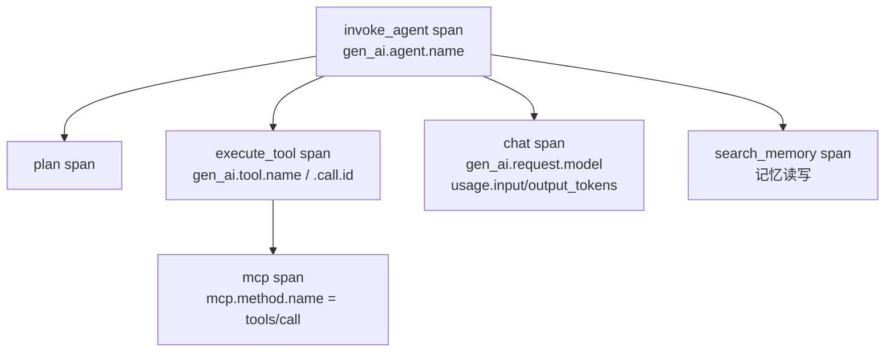

- **span 操作类型**：`chat` / `embeddings` / `execute_tool` / `invoke_agent` / `plan` / `create_memory` / `search_memory`…（覆盖 agent、工具、记忆）。
- **关键属性**：`gen_ai.provider.name`（原 `gen_ai.system`）、`gen_ai.request.model/.temperature`、`gen_ai.usage.input_tokens/.output_tokens/.cache_read.input_tokens/.reasoning.output_tokens`、`gen_ai.tool.name/.call.arguments/.result`。
- **指标**：TTFT(`gen_ai.server.time_to_first_token`)、逐 token 时延、`invoke_agent.duration`、`execute_tool.duration`。
- **已有 MCP 约定**（`mcp.md`）：instrument `tools/call`、client/server span 与 session 指标。

::: warning 可信度提示
OTel GenAI 语义约定**全部仍是 "Development"（实验性）状态，尚无 stable 版本**，命名已经改过一次（`gen_ai.system` → `gen_ai.provider.name`）。落地时按「会变」预期，别硬编码属性名——但方向与骨架已基本确定，值得现在就对齐埋点。
:::

#### ② Agent 专属可观测维度

| 维度 | 观测什么 | 与传统 APM 的差别 |
| --- | --- | --- |
| **轨迹/会话** | 整条 plan→act→reflect + session 回放 | APM 是请求级，这里是任务级 |
| **工具调用 span** | 每次 tool/MCP 调用的参数、结果、耗时 | 工具是 agent 的"副作用面" |
| **Token/成本** | 按 span 归集 token、缓存命中、费用 | APM 不关心 token 经济学 |
| **时延分解** | TTFT、逐 token 时延 | 流式生成特有 |
| **在线 eval** | 生产流量上跑 LLM-as-judge 打分 | APM 无"输出对不对"概念 |
| **护栏/幻觉/PII/漂移** | 越权、幻觉、敏感信息、分布漂移 | 概率系统特有风险 |
| **Prompt/上下文** | prompt 版本、上下文快照、replay | 便于复现与回归 |

#### ③ 工具生态（按开源/OTel 原生/是否 eval+obs 一体）

| 工具 | 开源 | OTel 原生 | eval+obs 一体 | 定位 |
| --- | --- | --- | --- | --- |
| **Langfuse** | ✅ 可自托管 | ✅ 基于 OTel | ✅ | 开源首选，session/agent 图可视化 |
| **Arize Phoenix** | ✅ | ✅ OTel+OpenInference | ✅ | 开源 + 企业版 Arize AX |
| **HoneyHive** | 部分 | ✅ OTLP 原生 | ✅ | trajectory 回放、含 MCP server |
| **LangSmith** | SaaS 为主 | 框架原生埋点 | ✅ | 自动根因、与 LangChain 深绑 |
| **W&B Weave** | SaaS | 自有 SDK | ✅ | session/turn/step/子 agent 一等公民 |
| **Datadog LLM Obs** | SaaS | 支持 OTel | ✅ | 与既有 APM 一体、合规齐全 |

> 选型心法：**要私有化/省钱 → Langfuse 或 Phoenix（开源+OTel 原生）**；已重度用 Datadog → 直接开 LLM Observability 模块；深绑 LangChain → LangSmith。避免自研全套——这个赛道成熟度已够高。

#### ④ 2026 前沿（watch，尚未落定）

1. **「Agent observability」成独立品类** —— OTel 已发布专门的 agent 可观测约定（对齐 Google AI-agent 白皮书），目标是 CrewAI/AutoGen/LangGraph 通用。**追踪它从 Development → stable 的进度，是这块最重要的信号。**
2. **eval 驱动 / 闭环自愈** —— 遥测直接反哺 agent 改进（自动检测→诊断→修复重复出现的 trace 问题）。这与前面 evomap 的「经验演化层」是同一件事的两个入口：**可观测面产出的失败轨迹，正是经验层要沉淀的原料。**（注：营销超前于成熟实践，谨慎。）
3. **MCP 可观测** —— `tools/call` 级埋点已有早期约定，随 MCP 生态铺开会快速演进。
4. **多 agent 与记忆/上下文可观测** —— 多 agent 协调、记忆读写的可观测仍是**公认未解的缺口**，属于「值得盯、还没方案」。

::: tip 落地建议
现在就做的最小动作：**用 OTel GenAI 约定给每次 LLM/工具/agent 调用埋点**（哪怕属性名会变），接一个开源后端（Langfuse/Phoenix），把 token/成本/时延先看见；在线 eval 与闭环自愈作为下一阶段。埋点是把「经验层」喂饱的前提——没有轨迹数据，evomap 式的经验演化就是无米之炊。
:::

### 技术选型 / 面试问答清单

**规范化实践**

- **Q：OpenSpec 靠什么约束 agent？** A：不是技术沙箱，是「产物约束」——必须先产出可评审的 proposal/specs/design/tasks 并对齐，再照 tasks 逐条执行；delta 归档时折叠进真理源 spec，评审左移。
- **Q：Skill 为什么能规模化不撑爆上下文？** A：渐进式披露三层——name+description 常驻判断何时用、命中才加载正文、需要才加载附件；确定性部分写成脚本让模型执行而非读入。
- **Q：CodeGraph 比 grep 强在哪？** A：它是 tree-sitter 全 AST 解析出的符号+边的图谱，能答「谁调谁、改了炸哪」这类结构问题；grep 只能匹配字面文本。

**Skill vs evomap**

- **Q：Skill 和 evomap 本质区别？** A：Skill 是人写的静态说明书（文档导向、不自我改进）；evomap 是 agent 从运行经验自动演化的经验基因（可自我改进、可跨 agent 网络继承），且用 skill2gep 把 Skill 当输入蒸馏成 Gene。
- **Q：evomap/evolver 本质是什么？** A：**是提示词生成器 + 经验资产版本化账本，不是能自己改代码的 AI**。一个周期只做四件确定性动作：扫 memory 日志→从本地 GEP 库选 Gene/Capsule 模板→拼出受协议约束的提示词打到 stdout→追加 EvolutionEvent 审计；改不改代码由宿主运行时或人决定，git 兜底回滚。数据模型 Gene（策略模板）/Capsule（验证过的具体修复含 diff）/EvolutionEvent（审计日志）就是"经验的三张表"。
- **Q：evomap 值得上生产吗？** A：分三层——**范式层**（经验→可审计资产→可继承）真价值值得学并自建；**引擎层**（prompt 编排器 + git 审计）单机/小团队有限有用但别神化；**网络层**（Hub/A2A/Credits/Council）是企业红线（数据主权/审计定责/错误经验放大/许可证与锁定风险）生产禁用。结论：学范式、自建经验资产层、坚决不接公共网络。

**存量代码 & 组件复用**

- **Q：百万行存量代码怎么让 agent 读懂/维护？** A：三步闭环——定位（向量找模糊意图/SCIP 精确跳转）→ 影响面分析（CodeGraph callers/impact 查爆炸半径，这步最关键）→ 安全改动（TDD+CI 回归）→ 沉淀 ADR。索引用三种混合：结构图谱（主干）+ 精确引用 + 语义向量；纯向量丢结构边是反模式。
- **Q：可复用组件怎么选型？** A：按确定性和复用边界分层——确定性动作→Tool/脚本、判断流程→Skill、跨系统→MCP Server、独立子任务→Subagent、跨任务经验→记忆/Gene；能用确定性代码解决的绝不留给模型即兴。

**企业级工程规范**

- **Q：AI 生成的代码凭什么敢合进主干？** A：因为它和人写的代码走**同一套、甚至更严的门禁**——formatter/lint/类型检查左移拦风格与幻觉类型错误、单测+diff 覆盖率门、SAST/SCA/密钥扫描、CODEOWNERS 强制对应 owner 评审、CI 回归覆盖 CodeGraph 圈定的影响面。AI 代码能绕过门禁直接合入不是效率是定时炸弹。
- **Q：AI 时代工程规范有哪些新增/放大的风险点？** A：① 幻觉包名被投毒（slopsquatting）→ lockfile + 私有 registry 白名单 + 依赖存在性校验；② AI 复制带漏洞的训练样本 → SAST 走更严的门；③ 生成量大人肉 review 顶不住 → 尽量把评审意见固化成机器可执行的 lint/类型规则；④ 每步 AI 动作要能追溯定责 → 全链路 Trace + 审计。
- **Q：企业级工程规范全景有哪几段？** A：开发期（lint/format/静态分析/分支策略）→ 提交评审期（Conventional Commits/CODEOWNERS/pre-commit）→ CI 门禁（测试+覆盖率/SAST/SCA/可复现构建）→ 发布运维期（SemVer/灰度回滚/可观测审计），事故复盘 ADR 回流开发期形成闭环。**第 7 维**是协调与共识——AI 消除了开发间摩擦，而那些摩擦恰恰是共享理解的载体。
- **Q：结构图谱（CodeGraph/Graphify）到底能做什么？** A：跨文件边解析（calls/imports/inherits）、最短路径查询（A→B 经几跳）、God node 检测（系统瓶颈）、社区发现（Leiden 自动切子系统）、边置信度标注（EXTRACTED 源码显式 vs INFERRED 推断）。这些全是 grep 和向量**原理上做不到**的——grep 只匹配字面文本，向量丢结构边。Graphify 进一步做到零 LLM 依赖（纯 tree-sitter）+ 边置信度，LOCOMO recall@10 = 0.497 远超 mem0 的 0.048。
- **Q：agent 运行时安全怎么管？** A：静态安全门（SAST/SCA/密钥扫描）管**代码合入前**，运行时命令守卫（dcg）管**命令执行前**——dcg 用 50+ 安全 pack 拦截 `git reset --hard`/`rm -rf`/`DROP TABLE` 等不可逆命令，支持 agent 信任等级（不同 agent 配不同策略）、heredoc 内嵌脚本扫描、上下文感知（不拦 `grep "rm -rf"` 只拦 `rm -rf /`）。企业级安全 = 左移静态门 + 运行时守卫 + 审计追溯三层。
- **Q：AI 消除摩擦后团队共识怎么维持？** A：Armin Ronacher 的巴别塔类比——agent 让每个人都能在自己不理解的角落做局部改动，测试通过、解释按需生成，但没人需要交流，共享理解悄然坍塌而工程仍能继续（塔不倒只是升高）。替代机制：CodeGraph 影响面分析 + ADR 强制记录"为什么" + OpenSpec spec 评审同步共识 + 定期"系统漫步"对齐架构模型 + 保留人审不替代决策。**护栏不是效率敌人，是人为重建被 agent 消除的摩擦——而那部分摩擦是共识的载体。**

**基建与可观测**

- **Q：AI 研发基建有哪几个面？** A：控制面（spec/skill/MCP 注册 + 护栏 + 租户隔离，管规则）、数据面（模型网关 + 知识库 + 经验库 + 语义缓存，管知识与执行）、可观测面（trace/eval/成本/审计，管度量与反馈），CI/CD 横切串成闭环；只建数据面就上线是 Demo 能跑生产就崩的根因。
- **Q：AI 可观测和传统 APM 有什么不同？** A：作用域从请求级变轨迹级（观测整条 plan→act→reflect + session、子 agent、工具调用、记忆读写）；判定从确定性变概率性，靠 eval（离线回归 + 在线 LLM-as-judge），所以 eval 与 observability 正合并。
- **Q：AI 可观测最该追的标准？** A：OpenTelemetry GenAI 语义约定（`gen_ai.*`，含 invoke_agent/execute_tool/mcp span、TTFT/token 指标），已拆到独立仓库但仍是 Development（命名改过 `gen_ai.system`→`gen_ai.provider.name`）；现在就该按它埋点、接开源后端（Langfuse/Phoenix），闭环自愈是下一阶段。

::: tip 心法总结
**AI 工程化的本质是「把易失的东西固化」**：需求固化成 spec、流程固化成 skill、代码理解固化成图谱、踩过的坑固化成经验资产。Skill 是静态说明书，evomap 是会演化的经验基因——但企业级落地的胜负手不在「用哪个网络」，而在**私有化 + 审计回滚 + 人工闸门 + 权限隔离 + 度量闭环**这五道工程护栏。
:::

::: info 本域延伸
- 「经验层」的记忆/检索本质仍是一次 [RAG](/ai-llm/rag.md) 调用，受 chunking、rerank、"迷失在中间" 制约；[上下文剪枝](/ai-llm/rag-context-pruning.md) 同样适用于把长经验压缩进上下文。
- 「怎么造一个 agent」的闭环、工具设计、护栏与评测见 [Agent 开发](/ai-llm/agent-dev.md)；本篇是它的「工程化/企业级选型」上层视角。
- 底层的上下文窗口 O(n²)、解码采样约束见 [大模型核心原理](/ai-llm/llm-fundamentals.md)；latency/成本优化见 [推理与微调优化](/ai-llm/llm-inference-optimization.md)。
:::

### 记忆口诀

- **四层栈**：意图层 OpenSpec（spec 固化需求）/ 方法层 Skill（流程固化+渐进披露）/ 理解层 CodeGraph（结构图谱）/ 经验层 evomap（经验演化）
- **三索引**：结构图谱（主干·影响面）/ 精确引用 SCIP（点对点跳转）/ 语义向量（模糊意图·有幻觉）
- **三基建面**：控制面（规则编排）/ 数据面（知识执行）/ 可观测面（度量反馈）·CI/CD 横切串闭环
- **五道红线**：私有化 / 审计回滚 / 人工闸门 / 权限隔离 / 度量闭环——evomap 学范式、自建资产层、不接公共网络

## 内容来源

> 综合整理自各项目官方仓库/站点（2026-07 核实；生态更新快，请以官方为准）：
> - OpenSpec — `github.com/Fission-AI/OpenSpec` · `openspec.dev`
> - Superpowers — `github.com/obra/superpowers`（Jesse Vincent / Prime Radiant）
> - Anthropic Agent Skills — 官方工程博客《Equipping agents for the real world with Agent Skills》
> - CodeGraph — `colbymchenry/codegraph`（与本项目 `codegraph_*` 工具签名吻合）；实战分析参考 [CodeGraph 代码图谱实战](https://blog.csdn.net/u010592101/article/details/161676163)（2026-06，含四层建图链路/工具选择表/Resolution框架语义补全/索引保鲜/MCP接入工程要点）
> - evomap / Evolver — `github.com/EvoMap/evolver` · `evomap.ai` · arXiv:2604.15097 · `EvoMap/skill2gep`（★ benchmark 与 star 数为项目方自述，未独立复核）
> - Sourcegraph / SCIP / LSIF、LlamaIndex 等选型信息来自各自官方文档
> - Graphify — `github.com/Graphify-Labs/graphify`（YC S26，tree-sitter 知识图谱，benchmark 见 BENCHMARKS.md）
> - dcg (Destructive Command Guard) — `github.com/Dicklesworthstone/destructive_command_guard`（Rust + SIMD，50+ 安全 pack）
> - Armin Ronacher — [The Tower Keeps Rising](https://lucumr.pocoo.org/2026/7/13/the-tower-keeps-rising/)（2026-07-13，AI 时代的巴别塔类比）

## 自测：合上资料能说清楚吗？

1. 「AI 会写代码」和「AI 能做工程」之间隔着哪几层规范化？分别解决什么断层？

<details><summary>参考答案</summary>

四层：**意图层**（OpenSpec 把需求固化成可评审 spec，治意图漂移）→**方法层**（Skill 把流程固化成可组合能力，治流程不可复现）→**理解层**（CodeGraph 把存量代码建成结构图谱，治靠 grep 读代码）→**经验层**（evomap 把经验演化成可继承资产，治经验无法沉淀）。

</details>

2. 让 agent 读懂百万行存量代码靠三种索引混合，各管哪一段？为什么「全代码丢向量库做 RAG」是反模式？

<details><summary>参考答案</summary>

**结构图谱**（主干）答影响面「改了炸哪」、**精确引用 SCIP** 答点对点定义/引用跳转、**语义向量**答「哪段做鉴权」这类模糊意图。纯向量**丢掉了调用/依赖的结构边**，agent 看得懂片段却算不清影响面，故只能当补充不能当主干。

</details>

3. 对比 Skill 与 evomap 的 Gene：二者在抽象层次、维护方式、是否自我改进上有何本质区别？关系是什么？

<details><summary>参考答案</summary>

**Skill = 人写的静态说明书**（markdown+脚本、靠人维护、用了不变）；**Gene = 从运行经验自动演化的资产**（可自我改进 test-time evolution、可跨 agent 网络继承）。关系：Skill 是 Gene 的**低阶形态**，evomap 用 `skill2gep` 把 Skill 当**输入原料**蒸馏成 Gene。

</details>

4. evomap/Evolver 在生产环境到底有没有价值？请分层判断。

<details><summary>参考答案</summary>

分三层且价值急剧衰减：**范式层**（经验→可审计资产→可继承）真价值、值得学并自建；**引擎层**（本质只是 prompt 生成器+git 审计账本，不改代码）单机/小团队有限有用别神化；**网络层**（Hub/A2A/Credits/Council）触数据主权、错误经验放大、许可证锁定等**企业红线，生产禁用**。

</details>

5. 「AI 生成的代码凭什么敢合进主干」？企业级安全为什么是三层防线？

<details><summary>参考答案</summary>

因为它和人写的代码走**同一套甚至更严的门禁**：formatter/lint/类型检查、单测+diff 覆盖率门、SAST/SCA/密钥扫描、CODEOWNERS 强制评审、CI 回归覆盖 CodeGraph 圈定的影响面。安全三层=**左移静态门（合入前）+ 运行时守卫 dcg（执行前）+ 审计追溯（执行后）**。

</details>
