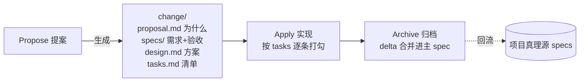
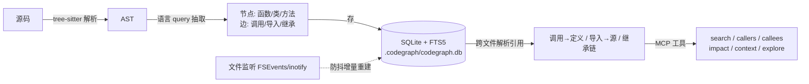
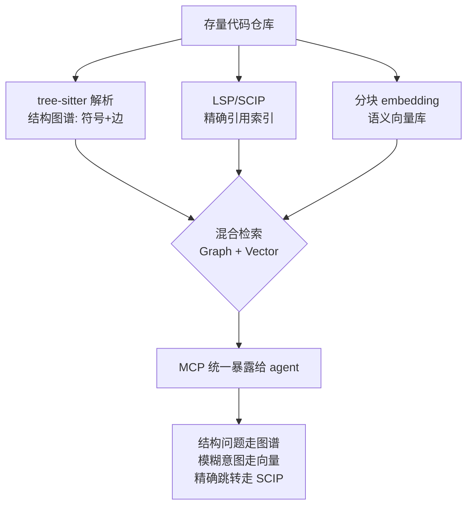
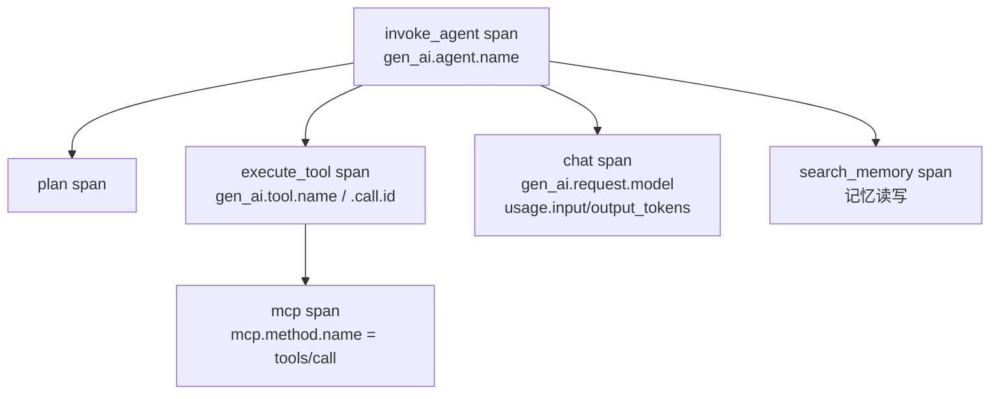

# AI 研发工程化：规范、知识库与企业级选型

> Spec 驱动 · Skill 库 · 代码知识图谱 · 经验演化 · 企业落地选型

::: tip 🧠 一句话记忆锚点
**「AI 会写代码」≠「AI 能做工程」，中间隔着四层规范化：意图层（OpenSpec 把需求固化成可评审 spec）→ 方法层（Superpowers/Skill 把流程固化成可组合能力）→ 理解层（CodeGraph 把存量代码预建成结构图谱）→ 经验层（evomap/Evolver 把经验演化成可继承资产）。Skill 是「人写的静态说明书」，evomap 是「agent 自动演化的经验基因」，后者把前者当输入蒸馏（skill2gep）。企业级落地的红线不是「接哪个网络」，而是私有化 + 审计回滚 + 人工闸门 + 权限隔离 + 度量闭环。存量代码建库靠「结构图谱 + 语义向量 + 精确引用」三索引混合，可复用组件按「确定性→脚本/工具、判断类→skill、跨系统→MCP、经验→memory/gene」分层选型。基建全景分三面：控制面（spec/skill/MCP 注册 + 护栏 + 租户隔离）、数据面（模型网关 + 知识库 + 经验库 + 语义缓存）、可观测面。可观测正从「请求级 APM」转向「轨迹级 + eval 驱动」，最该追的标准是 OpenTelemetry GenAI 语义约定（`gen_ai.*`，含 agent/tool/mcp span，仍 Development）。**
:::

## 场景问题

### 从「AI 写代码」到「AI 做工程」之间的三个断层

Demo 里让模型写个函数很爽，但一放进真实工程就崩，断层集中在三处：

1. **意图漂移**：需求只存在于聊天记录里，易失、不可评审。改了模型/换个 agent，上下文全丢，产出不可复现。
2. **流程不可复现**：同一个人今天让 agent 先写测试、明天忘了，质量全看当次 prompt 心情，团队无法沉淀「我们就该这么做」。
3. **代码理解靠 grep**：agent 面对百万行存量代码，只能反复 grep + read，既慢又不准，回答不了「改这个函数会炸哪些地方」这种结构性问题。

对应地，业界这两年沉淀出四个**不同抽象层次**的工程化实践——它们不是竞品，是可以叠起来用的一条栈：

| 层次 | 解决的断层 | 代表工具 | 一句话本质 |
| --- | --- | --- | --- |
| **意图层** | 意图漂移 | **OpenSpec** | 写码前把「做什么」固化成可评审的 spec |
| **方法层** | 流程不可复现 | **Superpowers / Agent Skills** | 把「怎么做」固化成可组合的 skill 流水线 |
| **理解层** | 靠 grep 读代码 | **CodeGraph** | 把「代码长什么样」预建成结构化知识图谱 |
| **经验层** | 经验无法沉淀/继承 | **evomap / Evolver** | 把「踩过的坑」演化成可继承的经验资产 |

<svg viewBox="0 0 680 300" width="100%" style="max-width:680px;height:auto" role="img" aria-label="AI 研发工程化四层栈：意图层 / 方法层 / 理解层 / 经验层">
  <defs><marker id="pa" markerWidth="9" markerHeight="9" refX="7" refY="3" orient="auto"><path d="M0 0 L6 3 L0 6 z" fill="#64748b"/></marker></defs>
  <!-- intent -->
  <rect x="30" y="20" width="620" height="48" rx="8" fill="#1e293b" stroke="#a78bfa" stroke-width="1.6"/>
  <text x="46" y="42" font-size="13" fill="#c4b5fd">意图层 · OpenSpec</text>
  <text x="46" y="60" font-size="10" fill="#94a3b8">proposal / specs / design / tasks —— 需求变成可评审、可版本化、可重喂的产物</text>
  <!-- method -->
  <rect x="30" y="80" width="620" height="48" rx="8" fill="#1e293b" stroke="#38bdf8" stroke-width="1.6"/>
  <text x="46" y="102" font-size="13" fill="#7dd3fc">方法层 · Superpowers / Skill</text>
  <text x="46" y="120" font-size="10" fill="#94a3b8">markdown + frontmatter + 脚本，渐进式披露三层，子 agent 组合成流水线</text>
  <!-- understand -->
  <rect x="30" y="140" width="620" height="48" rx="8" fill="#1e293b" stroke="#34d399" stroke-width="1.6"/>
  <text x="46" y="162" font-size="13" fill="#6ee7b7">理解层 · CodeGraph</text>
  <text x="46" y="180" font-size="10" fill="#94a3b8">tree-sitter → 符号/边 → SQLite+FTS5 → MCP 查询（callers / impact / context）</text>
  <!-- experience -->
  <rect x="30" y="200" width="620" height="48" rx="8" fill="#1e293b" stroke="#fbbf24" stroke-width="1.6"/>
  <text x="46" y="222" font-size="13" fill="#fcd34d">经验层 · evomap / Evolver</text>
  <text x="46" y="240" font-size="10" fill="#94a3b8">GEP 协议：把经验编码成 Gene / Capsule，git 回滚 + 可跨 agent 继承</text>
  <!-- flow arrow -->
  <path d="M660 44 C 674 100, 674 168, 660 224" fill="none" stroke="#64748b" stroke-width="1.4" marker-end="url(#pa)"/>
  <text x="632" y="278" font-size="10" fill="#64748b">越往下越「活」：文档→图谱→自我演化</text>
  <circle r="4" fill="#fcd34d"><animateMotion path="M55 44 L 55 224" dur="4s" repeatCount="indefinite"/></circle>
</svg>

## 实现方案

### 一、OpenSpec —— 规格驱动（Spec-Driven Development）

- **出处**：Fission-AI，`github.com/Fission-AI/OpenSpec`。纯文件 + CLI，**不需要 API key / MCP**，本项目 `openspec/` 目录用的就是它。
- **核心思想**：不做「技术沙箱」约束，而是 **用产物约束（constraint by artifact）**——agent 必须先产出并对齐 spec，再照着 spec 执行。

**变更生命周期（三段）**：



**目录结构与 delta 机制**（关键设计）：

```text
openspec/
├── specs/                 # 项目「真理源」——当前系统应该是什么样
│   └── <capability>/
├── changes/
│   └── <feature-name>/    # 一次变更，只存「相对增量 delta」
│       ├── proposal.md    # 为什么改
│       ├── design.md      # 技术方案
│       ├── tasks.md       # 实现清单（agent 逐条勾）
│       └── specs/         # 本次变更对真理源的 delta
└── changes/archive/
    └── 2026-07-13-<name>/ # 归档：delta 已 sync 进 specs
```

- 每次变更只写 **delta（增量）**，不重写全量 spec；`archive` 时才把 delta 折叠进 `specs/` 真理源，`sync` 可在不归档的情况下先同步。
- 这让 spec 始终是「活文档」：可追溯每次改了什么、为什么改，且能重新喂给任意 agent 复现。
- 对应本项目可用的 skill：`openspec-propose / apply-change / archive-change / sync-specs`（及 `opsx:*` 变体），1:1 映射上面三段。

::: tip 落地要点
OpenSpec 的杀伤力在于**把评审左移**：人只需在 propose 阶段 review 一次 spec，后面 agent 的所有代码都在 spec 约束内，review 成本从「读 800 行 diff」降到「读 1 页 spec」。
:::

### 二、Superpowers —— 方法论即 Skill 库

- **出处**：Jesse Vincent（obra）/ Prime Radiant，`github.com/obra/superpowers`，通过插件市场安装（Claude Code / Cursor / Copilot CLI 等）。
- **定位**：一整套「先想清楚再动手」的软件开发方法论，落在一组**可组合的 skill** 上。

**强制的 7 段流水线**：

```text
① 头脑风暴(校验想法) → ② git worktree(隔离分支) → ③ 计划(拆成 2~5 分钟粒度任务)
→ ④ 实现(子 agent 审查) → ⑤ TDD(强制 RED-GREEN-REFACTOR) → ⑥ 代码评审(对齐 spec) → ⑦ 收尾合并
```

**Skill 的实现机制**（理解后面 evomap 对比的关键，也是 Anthropic Agent Skills 官方规范）：

- 每个 skill = 一个带 YAML frontmatter 的 **`SKILL.md`** + 可选脚本/资源目录：

```markdown
---
name: brainstorming
description: 在动手前把模糊想法收敛成可执行方案；当用户说"我想做…"但需求不清时触发
---
# Brainstorming
（正文：步骤、检查清单、示例……命中后才加载）
```

- **渐进式披露三层（progressive disclosure）**——这是 skill 能规模化而不撑爆上下文的核心：
  1. `name` + `description` **常驻**系统提示，供模型判断「这个 skill 何时该用」；
  2. 命中后才加载 `SKILL.md` **正文**；
  3. 需要时再加载 `reference.md` 等**附件**（因此可捆绑的上下文「近乎无限」）。
- **脚本作为工具执行**：确定性强的部分写成脚本让 Claude *执行*（而非读进上下文），保证可靠性与省 token。
- **组合 + 子 agent**：高阶 skill 调用低阶 skill，用子 agent 委派离散步骤（如「让一个子 agent 专门做代码评审」）。

### 三、CodeGraph —— tree-sitter 代码知识图谱

- **出处**：与本项目 `codegraph_*` 工具签名最吻合的是 `colbymchenry/codegraph`（工具名、`.codegraph/codegraph.db`、"只暴露 explore 保持 MCP 精简" 的设计都对得上）。
- **要解决的问题**：让 agent 回答 grep 回答不了的**结构性问题**——「谁调用了 X」「改 Z 会炸哪些地方」。

**四步流水线**：



- **解析**：tree-sitter 支持 30+ 语言，用语言特定 query 抽出节点（symbol）和边（edge）。
- **存储**：本地 SQLite + FTS5 全文索引，符号查找**亚毫秒级**，完全离线无外部 API。
- **引用解析**：把 调用→定义、导入→源、继承链连起来（还能识别 web 路由等框架模式）——这是纯文本 grep 做不到的。
- **自动同步**：OS 原生文件监听 + 防抖（~500ms~2s）增量重建，索引始终跟得上代码。

::: warning 使用纪律（本项目 CLAUDE.md 已内化）
结构问题（谁调谁、改了会炸哪）用 CodeGraph；**字面文本**（字符串内容、注释、日志）才用 grep。信任 AST 结果、不要 grep 二次校验，那更慢更不准还费上下文。
:::

### 四、evomap / Evolver —— 经验演化引擎

- **出处**：EVOMAP PTE. LTD.（新加坡，© 2026）；开源引擎 **Evolver**（`@evomap/evolver`，`github.com/EvoMap/evolver`，GPL-3.0）。背后论文 arXiv:2604.15097《From Procedural Skills to Strategy Genes》。
- **核心思想**：ad hoc 改 prompt、堆 skill 文档，是不稳定、稀疏的经验载体。Evolver 改用 **GEP 协议（Gene Evolution Protocol）** 把经验编码成 **Gene / Capsule**，产出**可审计、可复用、版本化**的演化轨迹。

**机制**：

- 必须在 **git 仓库**里运行（git 用于回滚、算 blast radius、"solidify" 固化）——这个工程直觉很扎实。
- CLI 扫描运行时日志/历史 → 选中一个 Gene → 在协议约束下"演化" → git 可回滚。
- 可选连 **EvoMap Hub**，通过 A2A（agent-to-agent）协议**跨 agent 共享/继承 Gene**——口号 "one agent learns, a million inherit"。
- 配套仓库 **`skill2gep`**：把任意 Skill *蒸馏*成 Gene/Capsule——即它把 Skill 当作**输入原料**。

::: warning 可信度提示
star 数（~8.9k）、"CritPt 9.1%→18.57%"、"省 191B token" 等均为**项目方自述/营销口径**，论文正文数字未独立复核。且项目自曝抄袭纠纷后从「完全开源」退到 **source-available**（许可证收紧），企业采用需谨慎。以下分析对「思想」与「具体产品」区别对待。
:::

## 为什么这么做

### Skill 与 evomap 的本质区别

先给结论：**二者不在同一抽象层，且 evomap 被明确定位成对 Skill 范式的「替代/超越」来打。**

- **Skill = 静态能力说明书**：人写好的 markdown + 脚本，描述「遇到这类任务按这个流程做」。文档导向、靠人维护、用了也不会变。
- **evomap = 演化式经验资产**：从运行经验里自动提炼、可自我改进、可跨 agent 网络继承。

| 维度 | Skill | evomap（Gene） |
| --- | --- | --- |
| 载体 | 人写的 markdown 文档 | 编译出的紧凑「基因」表示 |
| 谁维护 | 人手工写/改 | agent 从运行经验中自动演化 |
| 是否自我改进 | 否（静态） | 是（test-time evolution） |
| 共享方式 | 复制文件 | 网络继承（Hub / A2A 协议） |
| 与彼此关系 | evomap 的**输入原料** | 用 `skill2gep` 把 Skill 蒸馏成 Gene |
| 论文主张 | 「信号不稳、稀疏」 | 「紧凑表示控制信号更强、效果更好」 |

**一句话记法**：Skill 是「写死的招式」，Gene 是「打完架自己会长本事、还能传给别的 agent 的肌肉记忆」；而 Skill 是 Gene 的低阶形态。

### 存量代码建立知识库的方法与选型

企业最大的资产（也是最大的负债）是**百万行存量代码**。让 agent 真正「懂」它，靠**三种互补索引**，实战里往往混合用（即 code 版 GraphRAG）：

| 索引类型 | 回答什么 | 技术 | 代表方案 | 精度/成本 |
| --- | --- | --- | --- | --- |
| **结构图谱** | 谁调谁、改了炸哪、继承链 | tree-sitter → 符号/边 → 图/SQLite | **CodeGraph**、Sourcegraph | 高精度、低成本、离线 |
| **精确引用** | 跨仓精确「定义/引用」跳转 | LSP / SCIP / LSIF 索引 | Sourcegraph、`scip-*` 系列 | 最精确、需编译期信息 |
| **语义向量** | 「哪段代码做鉴权」这类模糊意图 | 代码 embedding + 向量库 | LlamaIndex/Chroma、Cody | 召回模糊需求、有幻觉风险 |

**落地流程（推荐组合）**：



**选型决策**：

- **中小仓 / 单语言 / 要快**：直接上 **CodeGraph**（tree-sitter + SQLite，零基建、离线、亚毫秒）。本项目就是这个档位。
- **大型多仓 / 多语言 / 要精确跨仓跳转**：**Sourcegraph + SCIP/LSIF**，编译期精确引用是它的护城河。
- **需求模糊、要"找一段做 X 的代码"**：加**语义向量层**（code embedding，如 CodeBERT/嵌入模型 + Chroma/pgvector），但务必用结构图谱**校准**幻觉。
- **反模式**：只做「全代码丢进向量库做 RAG」——代码的价值在**结构关系**（调用/依赖），纯向量丢掉了边，agent 会「看得懂片段、算不清影响面」。**结构图谱是主干，向量是补充。**

::: tip 沉淀经验：知识库不只是代码
存量代码知识库 = **代码结构图谱 + 语义向量 + 沉淀文档（ADR/wiki/事故复盘）**。前两者机器建，第三者是人 + agent 持续沉淀的「为什么这么设计」——这部分恰好是 OpenSpec 的 spec 和 evomap 的 Gene 想固化的东西。
:::

### 可复用组件的方法与选型

「可复用组件」在 AI 研发里有一条**从轻到重的谱系**，选型看**确定性**和**复用边界**：

| 组件形态 | 复用粒度 | 何时用 | 载体 |
| --- | --- | --- | --- |
| **Prompt 模板** | 最细 | 固定输出格式/角色 | 字符串 / 模板文件 |
| **Tool / Function** | 单一确定动作 | 确定性强、需精确执行（查库、算数、调 API） | 代码函数 |
| **MCP Server** | 跨 agent/跨模型 | 一批工具要给多个 agent/IDE 复用 | 独立进程 + 协议 |
| **Skill** | 一套判断+流程 | 「遇到这类任务该怎么做」的方法沉淀 | markdown + 脚本 |
| **Subagent** | 一个子任务闭环 | 需要独立上下文/角色的离散步骤（如专职评审） | agent 定义 |
| **经验资产 (Gene/Memory)** | 跨任务经验 | 从历史里自动沉淀、可继承的「教训」 | 演化资产 / 记忆库 |

**选型心法**：

- **确定性动作 → 写成 Tool/脚本**，别让模型「每次重想」（既贵又不稳）。
- **判断 + 流程 → 写成 Skill**，用渐进式披露，`description` 写清「何时触发」。
- **要跨系统/跨模型复用 → 包成 MCP Server**，一次实现处处接（本项目的 CodeGraph、ruflo 都是 MCP）。
- **需要独立上下文的子任务 → 拆成 Subagent**，避免污染主上下文。
- **反复踩同一个坑 → 沉淀成经验资产**（记忆库/Gene），让下次自动规避。
- **黄金法则**：能用确定性代码解决的，绝不留给模型即兴发挥；能沉淀成组件的，绝不散落在 prompt 里。

## 为什么别的选择不行

### evomap 值得关注吗？——分开看

**值得关注的是「范式」，需要打折扣的是「具体产品」。**

**值得关注（真趋势）**：

- 踩中真问题：skill/prompt 靠人手写、不自我改进、经验无法跨 agent 沉淀。「agent 经验的版本化、可审计、可继承」是确定性方向。
- 「把经验编译成紧凑表示而非长文档」在信息论上成立——文档是稀疏、不稳定的控制信号。
- git 作演化的审计/回滚底座，工程直觉扎实，值得借鉴。

**要打折扣（红旗）**：

- **数据自述**：star、benchmark 提升、省 token 均为项目方口径，未独立验证。
- **许可证收紧**：抄袭纠纷后从开源退到 source-available，企业依赖有法律/可持续性风险。
- **生态锁定**：强绑自家网络/协议（GEP、Hub、代币激励），有明显「造词」营销痕迹。

**判断**：把它当**思想信号**研究，别现在 all-in。真正该学的是它的**范式**（经验 → 可演化资产 → 可继承），而非它的品牌协议。

### 企业级落地：为什么不能直接接公共网络

evomap 式「连公共 Hub、一个学百万继承」在 to-C 玩得转，**在企业里是红线**。企业级形态应该是**自建「经验资产层」**，而非接入外部网络：

| 企业红线 | 为什么公共方案不行 | 正确做法 |
| --- | --- | --- |
| **数据主权** | 经验/Gene 编码了业务逻辑与内部实现，是核心资产+泄密面 | 私有化部署、走内网、不出域 |
| **可审计** | agent「自己改自己」不可追溯，出事无法定责 | 保留 git-based 回滚 + blast radius + 全链路 Trace |
| **质量闸门** | 自动演化会放大**错误经验** | 资产入库前人工 review（类似 spec archive/sync 闸门） |
| **权限隔离** | 多团队共用一套经验，越权风险 | Skill 的 permissions/allow-deny + worktree 隔离 |
| **度量闭环** | 无法证明「越用越准」 | 用 CodeGraph impact + CI 结果反哺经验层 |

### 各方案不适用场景（避免误用）

- **OpenSpec 不适合**：一次性脚本、探索性 spike——写 spec 的开销 > 收益。它是给「要维护、要多人协作、要复现」的正式变更用的。
- **纯语义向量做代码库不适合**：结构性问题（影响面分析）——丢了调用边，必炸。
- **evomap 自动演化不适合**：强合规/高风险域（金融交易、医疗）——「自我改进」和「可审计冻结」天然冲突。
- **Skill 堆太多不适合**：`description` 写不清「何时触发」时，模型会选错 skill，反而不如不加。

## 沉淀结论

### 企业级 AI 研发平台参考架构

```text
┌─ 意图层  OpenSpec 式 spec 驱动     需求→proposal/specs/design/tasks，评审左移
├─ 方法层  私有 Skill 库             团队标准流程，渐进式披露 + 权限/worktree 隔离
├─ 理解层  CodeGraph + 向量 + SCIP   存量代码三索引混合，MCP 统一暴露
└─ 经验层  自研经验资产（非公共网络）  从 CI/PR/事故沉淀，人工闸门 + git 回滚 + 度量闭环
                    ↑ 全链路 Trace（OpenTelemetry）串起可观测与审计
```

- **今天就能进企业**：OpenSpec / Superpowers-Skill / CodeGraph（成熟、开源、可私有化）。
- **蓝图先学后建**：evomap 提供的「经验演化层」思想值得研究，但企业应**自研而非依赖它的网络**。

### 基建全景视野：控制面 / 数据面 / 可观测面

上面那张四层栈是「用什么」，真正做平台还要回答「底座有哪些」。借用云原生的分面思路，AI 研发基建可拆成**三个面**——这是评估自研平台成熟度的骨架：

<svg viewBox="0 0 680 340" width="100%" style="max-width:680px;height:auto" role="img" aria-label="AI 研发基建三面：控制面 / 数据面 / 可观测面">
  <!-- control plane -->
  <rect x="24" y="18" width="632" height="86" rx="8" fill="#1e1b4b" stroke="#a78bfa" stroke-width="1.6"/>
  <text x="40" y="40" font-size="13" fill="#c4b5fd">控制面 Control Plane —— 「规则与编排」</text>
  <g font-size="10" fill="#e2e8f0">
    <rect x="40"  y="52" width="130" height="40" rx="5" fill="#312e81"/><text x="52" y="70">Spec 仓库</text><text x="52" y="84" font-size="8" fill="#a5b4fc">OpenSpec 真理源</text>
    <rect x="182" y="52" width="130" height="40" rx="5" fill="#312e81"/><text x="194" y="70">Skill 注册中心</text><text x="194" y="84" font-size="8" fill="#a5b4fc">版本/权限/发现</text>
    <rect x="324" y="52" width="150" height="40" rx="5" fill="#312e81"/><text x="336" y="70">MCP 网关/注册</text><text x="336" y="84" font-size="8" fill="#a5b4fc">工具统一接入</text>
    <rect x="486" y="52" width="150" height="40" rx="5" fill="#312e81"/><text x="498" y="70">护栏 + 租户隔离</text><text x="498" y="84" font-size="8" fill="#a5b4fc">policy/权限/worktree</text>
  </g>
  <!-- data plane -->
  <rect x="24" y="116" width="632" height="86" rx="8" fill="#0c2a2a" stroke="#34d399" stroke-width="1.6"/>
  <text x="40" y="138" font-size="13" fill="#6ee7b7">数据面 Data Plane —— 「知识与执行」</text>
  <g font-size="10" fill="#e2e8f0">
    <rect x="40"  y="150" width="150" height="40" rx="5" fill="#134e4a"/><text x="52" y="168">模型网关/路由</text><text x="52" y="182" font-size="8" fill="#6ee7b7">多模型/fallback/限流</text>
    <rect x="202" y="150" width="150" height="40" rx="5" fill="#134e4a"/><text x="214" y="168">代码知识库</text><text x="214" y="182" font-size="8" fill="#6ee7b7">图谱+向量+SCIP</text>
    <rect x="364" y="150" width="140" height="40" rx="5" fill="#134e4a"/><text x="376" y="168">经验资产库</text><text x="376" y="182" font-size="8" fill="#6ee7b7">memory/gene</text>
    <rect x="516" y="150" width="120" height="40" rx="5" fill="#134e4a"/><text x="528" y="168">语义缓存</text><text x="528" y="182" font-size="8" fill="#6ee7b7">省 token/延迟</text>
  </g>
  <!-- obs plane -->
  <rect x="24" y="214" width="632" height="86" rx="8" fill="#2a1e05" stroke="#fbbf24" stroke-width="1.6"/>
  <text x="40" y="236" font-size="13" fill="#fcd34d">可观测面 Observability Plane —— 「度量与反馈」</text>
  <g font-size="10" fill="#e2e8f0">
    <rect x="40"  y="248" width="150" height="40" rx="5" fill="#422006"/><text x="52" y="266">Trace/Metrics</text><text x="52" y="280" font-size="8" fill="#fcd34d">OTel gen_ai.*</text>
    <rect x="202" y="248" width="150" height="40" rx="5" fill="#422006"/><text x="214" y="266">评测 Eval</text><text x="214" y="280" font-size="8" fill="#fcd34d">离线回归+在线 judge</text>
    <rect x="364" y="248" width="140" height="40" rx="5" fill="#422006"/><text x="376" y="266">成本治理</text><text x="376" y="280" font-size="8" fill="#fcd34d">token/费用/预算</text>
    <rect x="516" y="248" width="120" height="40" rx="5" fill="#422006"/><text x="528" y="266">审计/合规</text><text x="528" y="280" font-size="8" fill="#fcd34d">可回滚+定责</text>
  </g>
  <!-- CI/CD crosscut -->
  <rect x="24" y="312" width="632" height="22" rx="6" fill="#0f172a" stroke="#64748b" stroke-dasharray="4 3"/>
  <text x="40" y="327" font-size="10" fill="#94a3b8">横切：CI/CD 集成（spec/skill/eval 纳入流水线闸门） · 全链路 Trace ID 贯穿三面</text>
</svg>

| 面 | 组件 | 作用 | 选型落点 |
| --- | --- | --- | --- |
| **控制面** | Spec 仓库 | 需求真理源，评审左移 | OpenSpec |
| | Skill 注册中心 | 方法沉淀 + 版本/权限/发现 | Agent Skills 规范 + 私有 registry |
| | MCP 网关/注册 | 工具/资源统一接入、鉴权、审计 | MCP + 网关（限流/allow-deny） |
| | 护栏 + 隔离 | 危险动作闸门、多租户隔离 | policy 引擎 + worktree/沙箱 |
| **数据面** | 模型网关/路由 | 多模型、fallback、限流、灰度 | LiteLLM / 自研网关 |
| | 代码知识库 | 让 agent 读懂存量代码 | CodeGraph（图谱）+ 向量 + SCIP |
| | 经验资产库 | 沉淀可复用教训、可继承 | 私有 memory / gene（非公共网络） |
| | 语义缓存 | 省 token 与延迟 | 语义相似命中缓存 |
| **可观测面** | Trace/Metrics/Logs | 轨迹级可观测 | OTel GenAI（见下） |
| | 评测 Eval | 离线回归 + 在线 LLM-as-judge | Langfuse/Phoenix 等 |
| | 成本治理 | token/费用/预算熔断 | 按 span 归集成本 |
| | 审计/合规 | 可回滚、可定责 | git 回滚 + 全链路 Trace |

::: tip 基建视野一句话
**控制面管「规则」、数据面管「知识与执行」、可观测面管「度量与反馈」，CI/CD 把三面串成闭环。** 大多数团队只建了数据面（接个模型、堆点向量库）就上线，控制面（spec/skill/护栏）和可观测面（trace/eval）缺失——这正是「Demo 能跑、生产就崩」的根因。
:::

### 未来可观测方向（值得关注）

AI 可观测和传统 APM 有**两处根本不同**，决定了它是一个正在成形的新品类：

1. **作用域从「请求级」变「轨迹级」**：传统 APM 一个 span 对应一次请求；agent 是多步轨迹（plan→tool→observe→reflect），要观测的是**整条 trajectory + session**，还有子 agent、工具调用、记忆读写的父子关系。
2. **判定从「确定性」变「概率性」**：接口对错是二值的；LLM 输出「对不对」要靠 **eval**（离线回归 + 在线 LLM-as-judge），所以 **eval 与 observability 正在合并成一个东西**——这已是标配而非差异点。

#### ① OpenTelemetry GenAI 语义约定（最该追的标准）

这是当前唯一在往「跨框架统一标准」走的努力，OTel 已把它拆到独立仓库 `open-telemetry/semantic-conventions-genai`：



- **span 操作类型**：`chat` / `embeddings` / `execute_tool` / `invoke_agent` / `plan` / `create_memory` / `search_memory`…（覆盖 agent、工具、记忆）。
- **关键属性**：`gen_ai.provider.name`（原 `gen_ai.system`）、`gen_ai.request.model/.temperature`、`gen_ai.usage.input_tokens/.output_tokens/.cache_read.input_tokens/.reasoning.output_tokens`、`gen_ai.tool.name/.call.arguments/.result`。
- **指标**：TTFT(`gen_ai.server.time_to_first_token`)、逐 token 时延、`invoke_agent.duration`、`execute_tool.duration`。
- **已有 MCP 约定**（`mcp.md`）：instrument `tools/call`、client/server span 与 session 指标。

::: warning 可信度提示
OTel GenAI 语义约定**全部仍是 "Development"（实验性）状态，尚无 stable 版本**，命名已经改过一次（`gen_ai.system` → `gen_ai.provider.name`）。落地时按「会变」预期，别硬编码属性名——但方向与骨架已基本确定，值得现在就对齐埋点。
:::

#### ② Agent 专属可观测维度

| 维度 | 观测什么 | 与传统 APM 的差别 |
| --- | --- | --- |
| **轨迹/会话** | 整条 plan→act→reflect + session 回放 | APM 是请求级，这里是任务级 |
| **工具调用 span** | 每次 tool/MCP 调用的参数、结果、耗时 | 工具是 agent 的"副作用面" |
| **Token/成本** | 按 span 归集 token、缓存命中、费用 | APM 不关心 token 经济学 |
| **时延分解** | TTFT、逐 token 时延 | 流式生成特有 |
| **在线 eval** | 生产流量上跑 LLM-as-judge 打分 | APM 无"输出对不对"概念 |
| **护栏/幻觉/PII/漂移** | 越权、幻觉、敏感信息、分布漂移 | 概率系统特有风险 |
| **Prompt/上下文** | prompt 版本、上下文快照、replay | 便于复现与回归 |

#### ③ 工具生态（按开源/OTel 原生/是否 eval+obs 一体）

| 工具 | 开源 | OTel 原生 | eval+obs 一体 | 定位 |
| --- | --- | --- | --- | --- |
| **Langfuse** | ✅ 可自托管 | ✅ 基于 OTel | ✅ | 开源首选，session/agent 图可视化 |
| **Arize Phoenix** | ✅ | ✅ OTel+OpenInference | ✅ | 开源 + 企业版 Arize AX |
| **HoneyHive** | 部分 | ✅ OTLP 原生 | ✅ | trajectory 回放、含 MCP server |
| **LangSmith** | SaaS 为主 | 框架原生埋点 | ✅ | 自动根因、与 LangChain 深绑 |
| **W&B Weave** | SaaS | 自有 SDK | ✅ | session/turn/step/子 agent 一等公民 |
| **Datadog LLM Obs** | SaaS | 支持 OTel | ✅ | 与既有 APM 一体、合规齐全 |

> 选型心法：**要私有化/省钱 → Langfuse 或 Phoenix（开源+OTel 原生）**；已重度用 Datadog → 直接开 LLM Observability 模块；深绑 LangChain → LangSmith。避免自研全套——这个赛道成熟度已够高。

#### ④ 2026 前沿（watch，尚未落定）

1. **「Agent observability」成独立品类** —— OTel 已发布专门的 agent 可观测约定（对齐 Google AI-agent 白皮书），目标是 CrewAI/AutoGen/LangGraph 通用。**追踪它从 Development → stable 的进度，是这块最重要的信号。**
2. **eval 驱动 / 闭环自愈** —— 遥测直接反哺 agent 改进（自动检测→诊断→修复重复出现的 trace 问题）。这与前面 evomap 的「经验演化层」是同一件事的两个入口：**可观测面产出的失败轨迹，正是经验层要沉淀的原料。**（注：营销超前于成熟实践，谨慎。）
3. **MCP 可观测** —— `tools/call` 级埋点已有早期约定，随 MCP 生态铺开会快速演进。
4. **多 agent 与记忆/上下文可观测** —— 多 agent 协调、记忆读写的可观测仍是**公认未解的缺口**，属于「值得盯、还没方案」。

::: tip 落地建议
现在就做的最小动作：**用 OTel GenAI 约定给每次 LLM/工具/agent 调用埋点**（哪怕属性名会变），接一个开源后端（Langfuse/Phoenix），把 token/成本/时延先看见；在线 eval 与闭环自愈作为下一阶段。埋点是把「经验层」喂饱的前提——没有轨迹数据，evomap 式的经验演化就是无米之炊。
:::

### 技术选型 / 面试问答清单

**规范化实践**

- **Q：OpenSpec 靠什么约束 agent？** A：不是技术沙箱，是「产物约束」——必须先产出可评审的 proposal/specs/design/tasks 并对齐，再照 tasks 逐条执行；delta 归档时折叠进真理源 spec，评审左移。
- **Q：Skill 为什么能规模化不撑爆上下文？** A：渐进式披露三层——name+description 常驻判断何时用、命中才加载正文、需要才加载附件；确定性部分写成脚本让模型执行而非读入。
- **Q：CodeGraph 比 grep 强在哪？** A：它是 tree-sitter 全 AST 解析出的符号+边的图谱，能答「谁调谁、改了炸哪」这类结构问题；grep 只能匹配字面文本。

**Skill vs evomap**

- **Q：Skill 和 evomap 本质区别？** A：Skill 是人写的静态说明书（文档导向、不自我改进）；evomap 是 agent 从运行经验自动演化的经验基因（可自我改进、可跨 agent 网络继承），且用 skill2gep 把 Skill 当输入蒸馏成 Gene。
- **Q：evomap 值得上生产吗？** A：思想（经验→可演化资产→可继承）值得学；具体产品有数据自述、许可证收紧、生态锁定的红旗，企业应自研经验资产层而非接公共网络。

**存量代码 & 组件复用**

- **Q：百万行存量代码怎么让 agent 读懂？** A：三索引混合——结构图谱（tree-sitter，主干）+ 精确引用（LSP/SCIP，跨仓跳转）+ 语义向量（模糊意图，补充），MCP 统一暴露；纯向量丢结构边是反模式。
- **Q：可复用组件怎么选型？** A：按确定性和复用边界分层——确定性动作→Tool/脚本、判断流程→Skill、跨系统→MCP Server、独立子任务→Subagent、跨任务经验→记忆/Gene；能用确定性代码解决的绝不留给模型即兴。

**基建与可观测**

- **Q：AI 研发基建有哪几个面？** A：控制面（spec/skill/MCP 注册 + 护栏 + 租户隔离，管规则）、数据面（模型网关 + 知识库 + 经验库 + 语义缓存，管知识与执行）、可观测面（trace/eval/成本/审计，管度量与反馈），CI/CD 横切串成闭环；只建数据面就上线是 Demo 能跑生产就崩的根因。
- **Q：AI 可观测和传统 APM 有什么不同？** A：作用域从请求级变轨迹级（观测整条 plan→act→reflect + session、子 agent、工具调用、记忆读写）；判定从确定性变概率性，靠 eval（离线回归 + 在线 LLM-as-judge），所以 eval 与 observability 正合并。
- **Q：AI 可观测最该追的标准？** A：OpenTelemetry GenAI 语义约定（`gen_ai.*`，含 invoke_agent/execute_tool/mcp span、TTFT/token 指标），已拆到独立仓库但仍是 Development（命名改过 `gen_ai.system`→`gen_ai.provider.name`）；现在就该按它埋点、接开源后端（Langfuse/Phoenix），闭环自愈是下一阶段。

::: tip 心法总结
**AI 工程化的本质是「把易失的东西固化」**：需求固化成 spec、流程固化成 skill、代码理解固化成图谱、踩过的坑固化成经验资产。Skill 是静态说明书，evomap 是会演化的经验基因——但企业级落地的胜负手不在「用哪个网络」，而在**私有化 + 审计回滚 + 人工闸门 + 权限隔离 + 度量闭环**这五道工程护栏。
:::

::: info 本域延伸
- 「经验层」的记忆/检索本质仍是一次 [RAG](/ai-llm/rag.md) 调用，受 chunking、rerank、"迷失在中间" 制约；[上下文剪枝](/ai-llm/rag-context-pruning.md) 同样适用于把长经验压缩进上下文。
- 「怎么造一个 agent」的闭环、工具设计、护栏与评测见 [Agent 开发](/ai-llm/agent-dev.md)；本篇是它的「工程化/企业级选型」上层视角。
- 底层的上下文窗口 O(n²)、解码采样约束见 [大模型核心原理](/ai-llm/llm-fundamentals.md)；latency/成本优化见 [推理与微调优化](/ai-llm/llm-inference-optimization.md)。
:::

## 内容来源

> 综合整理自各项目官方仓库/站点（2026-07 核实；生态更新快，请以官方为准）：
> - OpenSpec — `github.com/Fission-AI/OpenSpec` · `openspec.dev`
> - Superpowers — `github.com/obra/superpowers`（Jesse Vincent / Prime Radiant）
> - Anthropic Agent Skills — 官方工程博客《Equipping agents for the real world with Agent Skills》
> - CodeGraph — `colbymchenry/codegraph`（与本项目 `codegraph_*` 工具签名吻合）
> - evomap / Evolver — `github.com/EvoMap/evolver` · `evomap.ai` · arXiv:2604.15097 · `EvoMap/skill2gep`（★ benchmark 与 star 数为项目方自述，未独立复核）
> - Sourcegraph / SCIP / LSIF、LlamaIndex 等选型信息来自各自官方文档
