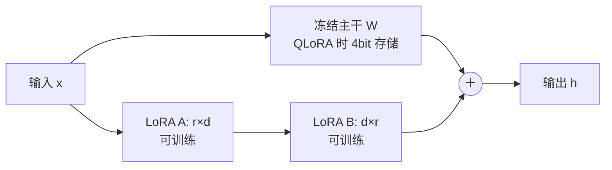
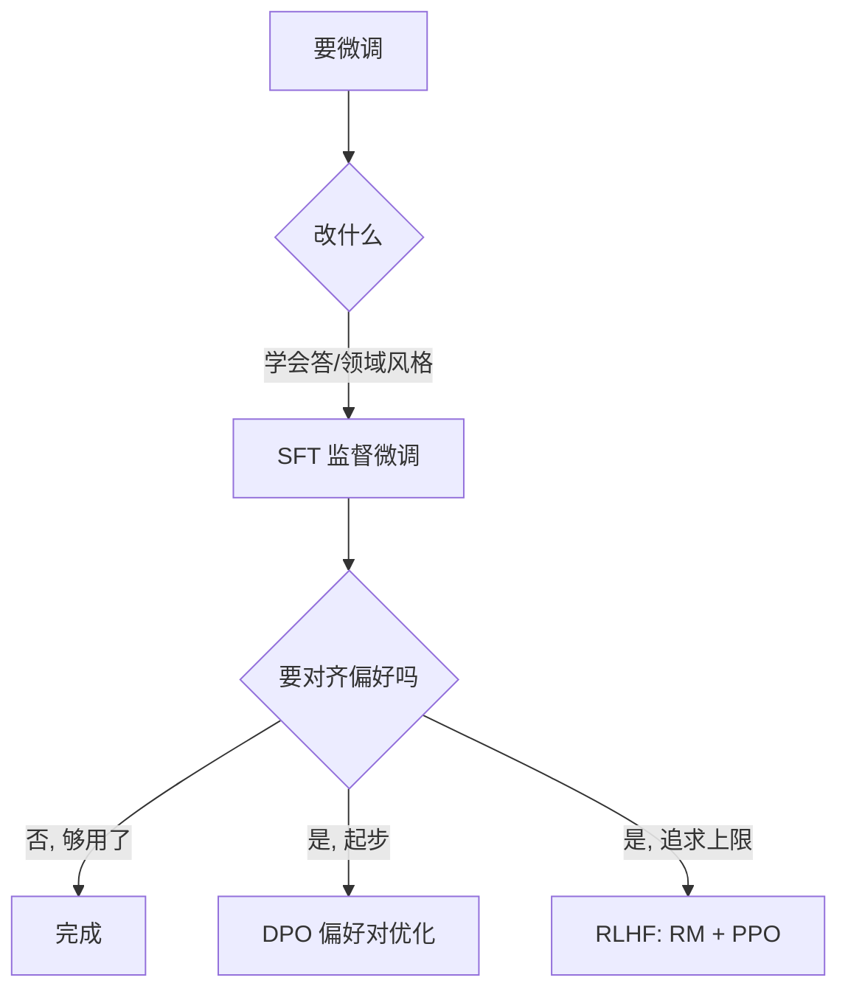

# 微调策略

> 全参微调 vs PEFT · LoRA/QLoRA · SFT vs RLHF vs DPO · 微调 vs RAG vs Prompt · 数据规模与质量 · 灾难性遗忘与评测回归

::: tip 🧠 一句话记忆锚点
**先问"要不要训"再问"怎么训"：加知识/时效性用 RAG、调格式/临时行为用 Prompt、改风格/固有能力才微调。要训优先 PEFT（LoRA/QLoRA，只训 <1% 参数），对齐用 DPO 起步、复杂场景才上 RLHF。全参微调是最后一档，且务必守住"灾难性遗忘"的评测回归底线。**
:::

## 场景问题

### "模型不够好，到底该不该微调？"

这是面试与实战里最容易走偏的一步。很多人一上来就想微调，结果花了几万块算力、掉了通用能力，还不如挂个检索。要先把需求归类到三个正交的维度：

| 需求 | 本质 | 首选手段 |
| --- | --- | --- |
| 让模型"知道"新事实、时效内容、私有文档 | 缺**知识** | [RAG](./rag.md)（检索注入，不改权重） |
| 让模型"这次"按某种格式/角色/步骤输出 | 缺**指令约束** | Prompt Engineering / few-shot |
| 让模型"永久"改变风格、领域语感、固有行为 | 缺**能力/对齐** | 微调（SFT / PEFT / 对齐） |

关键洞察：**微调擅长教"怎么做"（style、format、reasoning pattern），不擅长灌"是什么"（fact）。**灌事实用微调，既贵又易过拟合，还会因知识更新而失效——那是 RAG 的活。

### 真要微调时，选哪条路线？

微调本身又分两层问题：**参数怎么更新**（全参 vs PEFT）和**用什么信号更新**（SFT vs 偏好对齐）。两层独立，先定路线再谈实现。

## 实现方案

### 全参微调 vs PEFT：参数怎么更新

**全参微调（Full Fine-Tuning）**：解冻全部权重跟着梯度更新。效果上限最高，但 70B 模型要存权重 + 梯度 + 优化器状态（Adam 约 2 份动量），显存 ≈ 参数量 ×（2+2+4+4）≈ 十几倍，动辄数百 GB，还每个任务存一份全量权重。

**PEFT（Parameter-Efficient Fine-Tuning）**：冻结主干，只训练极小一部分新增参数。代表就是 **LoRA**——冻结原权重 W，在旁边并联一个低秩增量 `BA`：

```text
h = W·x + ΔW·x = W·x + (B·A)·x
    A ∈ R^{r×d}   B ∈ R^{d×r}   秩 r 远小于 d（常见 r=8/16/64）
    只训练 A、B，可训参数占原模型 <1%；推理时可把 BA 合并回 W，零额外延迟
```

低秩假设的直觉：**微调所需的权重改变量 ΔW 是"低内在秩"的**——适配一个新任务不需要动整个高维空间，一个瘦长的 BA 就够表达。（低秩增量、冻结主干等机制细节，与推理侧共享同一套原理，详见 [推理优化](./llm-inference-optimization.md)。）

**QLoRA** 在 LoRA 上再省一层：主干权重用 **4bit NF4 量化**冻结存储，只有 LoRA 的 A/B 以 bf16 训练，配合双重量化与分页优化器，**单张 24G/48G 卡就能微调 65B**。代价是量化引入的微小误差，对多数任务可忽略，对数学/代码等敏感任务需实测。



### SFT vs RLHF vs DPO：用什么信号更新

参数更新方式定了，还要定"拿什么数据、朝什么目标训"。三种主流范式层层递进：

| 范式 | 目标 | 数据形态 | 训练代价 |
| --- | --- | --- | --- |
| **SFT（监督微调）** | 学会"照着标准答案说" | `(prompt, 理想回答)` 成对 | 低，一次交叉熵 |
| **RLHF** | 对齐人类偏好、上限最高 | 偏好排序 → 训奖励模型 → PPO | 高，多阶段、易训崩 |
| **DPO** | 直接对齐偏好、更稳更省 | `(prompt, chosen, rejected)` 偏好对 | 中，单阶段类分类 |

- **SFT** 是一切的起点：告诉模型"这类问题应该这么答"。但它只会模仿标准答案，无法表达"A 比 B 好一点"这种相对偏好。
- **RLHF** 三段式：先用人工排序数据训一个**奖励模型 RM**，再用 **PPO** 让语言模型在 RM 打分下做强化学习。效果强，但 RM 会被"钻空子"（reward hacking）、PPO 超参敏感、四个模型同时跑显存爆炸。
- **DPO** 的洞察：**偏好优化其实有闭式解，不必显式训奖励模型也不必跑 RL**。直接用偏好对构造一个分类式损失，让 chosen 的概率相对 rejected 上升。省掉 RM 和 PPO，稳定性和成本大幅改善，成为当下对齐的默认起点。



### 数据：规模与质量

微调是"用数据雕刻行为"，数据错则一切错：

- **规模**：SFT 风格/格式类任务，**几百到几千条高质量样本**常已见效（LIMA 等工作表明"少而精"优于"多而杂"）；领域能力增强通常 **数千到数万条**；全参微调才需更大量级。
- **质量 > 数量**：几百条人工精修 > 几万条噪声爬取。脏标注、格式不一、答案风格漂移会被模型忠实学走。
- **多样性与去重**：覆盖真实分布、去掉近重复，防止过拟合到少数模板。
- **对齐数据**：DPO/RLHF 需要**成对偏好**（同一 prompt 的好坏两个回答），标注成本高于 SFT。

## 为什么这么做

### 决策框架：微调 vs RAG vs Prompt

按"改动成本从低到高"依次尝试，能用低档解决就别上高档：

- **先 Prompt**：调 system prompt、加 few-shot、给格式约束。零成本、秒级迭代，能解决相当一部分"输出不对"的问题。
- **再 RAG**：需求是"缺知识/要时效/私有文档/可溯源"→ 挂检索，把事实放进上下文。知识更新只需换库，不动模型。详见 [RAG](./rag.md)。
- **才微调**：需求是"要稳定改变风格、领域语感、固有行为，且 prompt/RAG 都压不住"→ 上 PEFT。要对齐人类偏好 → DPO 起步。
- **组合拳最常见**：`微调（学格式与领域语感）+ RAG（供最新事实）+ Prompt（控本次行为）` 往往优于单点堆微调。

### 为什么优先 PEFT 而非全参

- **成本**：LoRA 可训参数 <1%，显存与存储降一个数量级，单卡可训。
- **可插拔**：一个主干挂多个 LoRA adapter，按任务热切换，无需存多份全量权重。
- **抗遗忘**：主干冻结，通用能力被"锁"住，灾难性遗忘天然更轻。
- **效果够用**：多数风格/领域/指令任务上，LoRA 与全参差距很小。

## 为什么别的选择不行

### 常见坑与反直觉

- **"效果差就微调"**：多数"效果差"其实是**缺知识**或**指令没写好**——该 RAG/prompt 的场景硬微调，既贵又灌不进事实，还破坏通用能力。
- **"微调能让模型记住我的文档"**：不可靠。微调是学"怎么答"不是"背事实"，灌进去的知识会过拟合、会随更新失效、不可溯源——事实类交给 [RAG](./rag.md)。
- **"数据越多越好"**：少而精的高质量数据常胜过海量噪声；脏数据会被忠实学走。
- **"LoRA 一定不如全参"**：多数任务差距极小，且 LoRA 抗遗忘、可插拔、成本低——全参是"最后一档"。
- **灾难性遗忘（Catastrophic Forgetting）**：微调新任务后，模型在**原有通用能力上大幅退化**。全参微调、学习率过大、数据分布太窄时尤甚。缓解：**优先 LoRA（冻主干）**、小学习率、混入通用语料回放（replay）、早停。
- **"训完 loss 降了就算成功"**：必须做**评测回归**——训练前后都在一套**通用基准 + 目标任务 + 安全**评测集上跑，确认目标任务涨的同时通用能力没塌。只看训练 loss 会漏掉遗忘。

### 微调路线速查

| 方案 | 显存/成本 | 适合 | 不适合 |
| --- | --- | --- | --- |
| **全参微调** | 最高（数百 GB） | 算力充足、要最大化效果 | 中小团队、快速迭代 |
| **LoRA** | 低（可训 <1%） | 多任务、快速试验、可插拔、抗遗忘 | 需大幅改底层表征的极端场景 |
| **QLoRA** | 最低（单卡微调 65B） | 显存受限、个人/小团队 | 对量化误差极敏感的任务 |
| **RAG / Prompt（不训）** | 几乎为零 | 加知识、时效内容、频繁变动 | 需永久改变模型固有行为/风格 |

## 沉淀结论

::: tip 速记
**三问定策略：缺知识→RAG，缺指令→Prompt，缺能力/对齐→微调。要训优先 PEFT（LoRA 只训 <1%、QLoRA 4bit 主干单卡训 65B），对齐 DPO 起步、复杂才 RLHF。数据少而精，训完必做评测回归防灾难性遗忘。全参微调是最后一档。**
:::

### 面试高频题清单

- **Q：什么时候该微调、什么时候用 RAG/Prompt？** A：缺知识/时效→RAG；缺指令约束→Prompt；要永久改风格/领域能力/对齐→微调。微调教"怎么做"不擅长灌"是什么"。
- **Q：LoRA 原理是什么，为什么省？** A：冻结主干 W，只训低秩增量 `BA`（h=Wx+BAx），基于 ΔW 低内在秩假设，可训参数 <1%，推理可合并回 W 零延迟。
- **Q：QLoRA 相比 LoRA 多做了什么？** A：主干 4bit NF4 量化冻结存储 + 双重量化 + 分页优化器，单卡即可微调 65B，代价是可忽略的量化误差。
- **Q：SFT / RLHF / DPO 区别？** A：SFT 学标准答案（成对指令数据）；RLHF 训奖励模型 + PPO，上限高但复杂易崩；DPO 直接用偏好对做分类式优化，免 RM 免 RL，更稳更省，成主流起点。
- **Q：微调需要多少数据？** A：风格/格式几百~几千条精修样本常够；领域增强数千~数万；质量与多样性远比数量重要。
- **Q：什么是灾难性遗忘，怎么防？** A：微调后通用能力退化。防法：优先 LoRA 冻主干、小学习率、混通用语料回放、早停，并做训练前后**评测回归**。

### 记忆口诀

- **要不要训**：缺知识 RAG / 缺指令 Prompt / 缺能力才微调
- **参数怎么更新**：全参最贵最强 / LoRA 训 <1% / QLoRA 4bit 单卡训大模型
- **用什么信号**：SFT 学答案 / RLHF 强但崩 / DPO 稳而省
- **数据**：少而精 > 多而杂 / 质量多样性 > 数量
- **底线**：冻主干抗遗忘 / 训完必评测回归

## 内容来源

综合整理：LoRA（Hu 2021）、QLoRA（Dettmers 2023）、InstructGPT/RLHF（Ouyang 2022）、DPO（Rafailov 2023）、LIMA（Zhou 2023）、Hugging Face PEFT/TRL 官方文档（2026-07；领域更新极快，请以最新论文与官方文档为准）。相关机制细节参见 [推理优化](./llm-inference-optimization.md) 与 [RAG](./rag.md)。

## 自测：合上资料能说清楚吗？

1. 面对"模型效果不好"，你会按什么顺序考虑 Prompt / RAG / 微调？各自解决什么？

<details><summary>参考答案</summary>

按改动成本从低到高：先 **Prompt**（调指令/few-shot，解决输出不对）；再 **RAG**（缺知识/时效/私有文档，注入事实、可溯源）；才 **微调**（要永久改风格/领域能力/对齐）。核心：微调教"怎么做"，不擅长灌"是什么"。

</details>

2. 用一行公式说清 LoRA，并解释为什么只训 <1% 参数还能有效。

<details><summary>参考答案</summary>

`h = W·x + (B·A)·x`，冻结 W，只训低秩 A、B。有效性来自 **ΔW 低内在秩假设**——适配新任务所需的权重改变量本就是低秩的，瘦长的 BA 足以表达；推理时 BA 可合并回 W，零额外延迟。

</details>

3. QLoRA 相比 LoRA 多解决了什么问题？代价是什么？

<details><summary>参考答案</summary>

主干权重 **4bit NF4 量化**冻结存储（+ 双重量化、分页优化器），把显存再降一档，**单卡微调 65B**。代价是量化引入的微小误差，多数任务可忽略，数学/代码等敏感任务需实测。

</details>

4. SFT、RLHF、DPO 的目标、数据形态、代价各是什么？为什么 DPO 常作对齐起点？

<details><summary>参考答案</summary>

SFT：学标准答案，`(prompt, 回答)` 成对，代价低。RLHF：对齐偏好，偏好排序训 RM + PPO，上限高但多阶段、易训崩、显存高。DPO：`(prompt, chosen, rejected)` 偏好对做分类式优化，**免 RM 免 RL**，更稳更省——故作起点，追求上限才上 RLHF。

</details>

5. 什么是灾难性遗忘？训练后为什么必须做评测回归，只看 loss 为何不够？

<details><summary>参考答案</summary>

灾难性遗忘：微调新任务后模型**通用能力大幅退化**（全参、大学习率、窄分布时尤甚）。缓解：优先 LoRA 冻主干、小学习率、通用语料回放、早停。必须在**通用基准 + 目标任务 + 安全**评测集上做**训练前后回归**——训练 loss 只反映目标任务，看不到通用能力是否塌，会漏掉遗忘。

</details>
