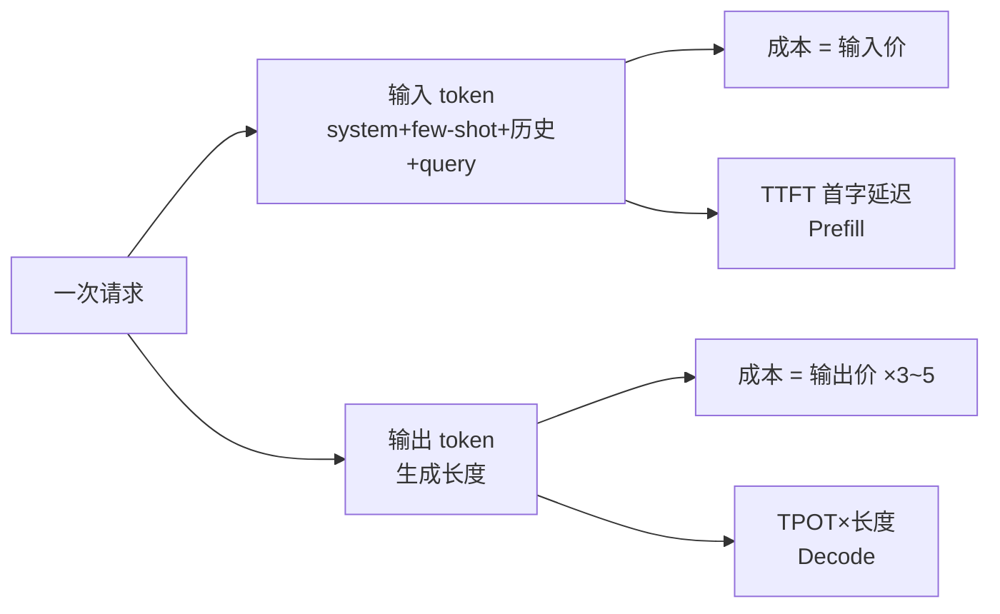
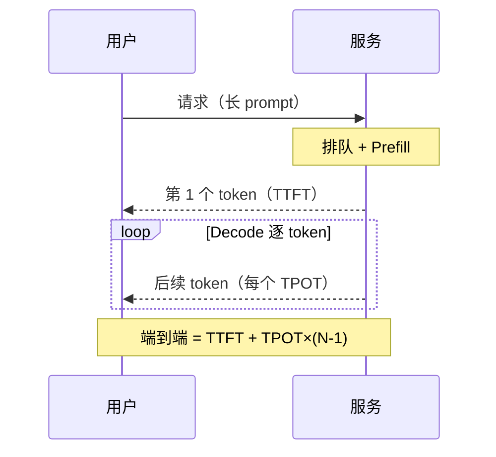
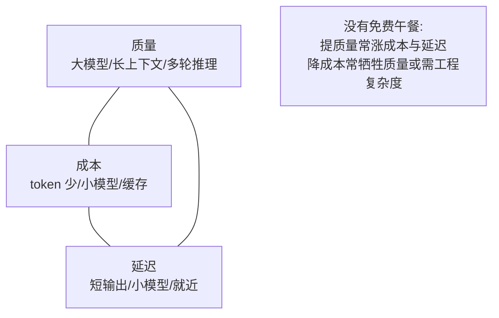
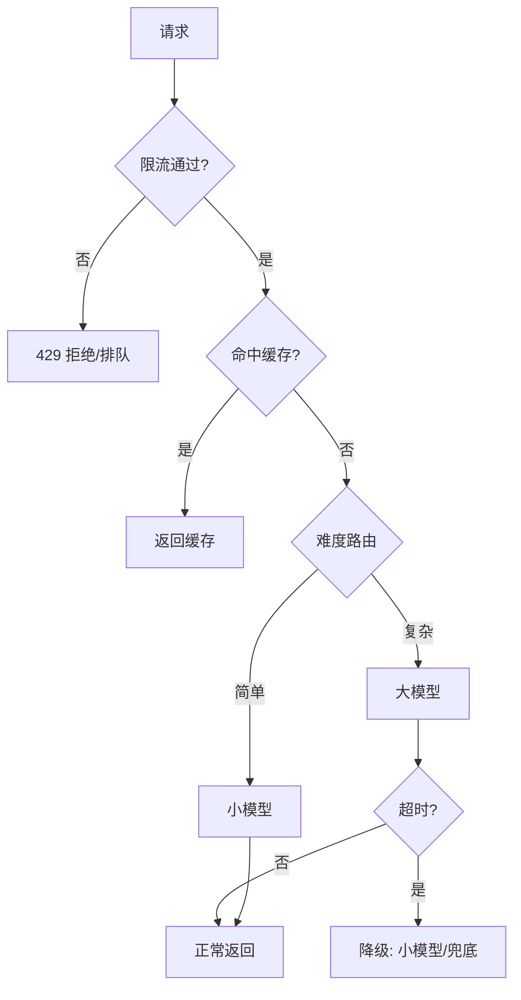

# LLM 成本与延迟

> Token 计价 · 上下文膨胀 · TTFT/TPOT · 成本-质量-延迟三角 · 语义/前缀缓存 · 难度路由 · 批处理 · SLA 与预算护栏

::: tip 🧠 一句话记忆锚点
**成本按 token 算、输出通常比输入贵好几倍，上下文越长越烧钱；延迟拆成 TTFT（首字，对应 Prefill）与 TPOT（每字，对应 Decode）。降本靠缓存复用、按难度路由到小模型、批处理、量化；护栏靠限流/超时/降级。凡是要花钱花时间的地方，先量再省。**
:::

## 场景问题

### 上线后账单爆炸、P99 延迟飘红，从哪下手？

面试高频："你这个 LLM 应用一个月几十万 token 费用、用户抱怨响应慢，怎么同时把钱和延迟压下来？"——先把两个指标各自拆开，别混为一谈：

- **成本**几乎只跟 **token 数量**线性相关，与你等了多久无关；
- **延迟**跟 **生成长度**和 **并发排队**强相关，与花了多少钱不直接挂钩。

二者的公共变量是**上下文长度**：prompt 越长，Prefill 越慢（TTFT 涨）、输入 token 越多（成本涨）。所以优化的第一刀往往落在"**能不能少喂、少吐、复用已算的**"。



## 实现方案

### Token 经济：输入输出分开计价，输出更贵

主流 API 对**输入 token** 和**输出 token** 分别定价，且**输出单价通常是输入的 3~5 倍**（Decode 是逐 token 自回归、占用算力时间长，故贵）。一次请求的成本估算：

```text
cost = P_in × tokens_in + P_out × tokens_out
     其中 tokens_in = system + few-shot 示例 + 对话历史 + 本轮 query
          tokens_out = 本轮生成长度

例：P_in=$3/M, P_out=$15/M（每百万 token）
   单轮：输入 2000 + 输出 500
   = 3×(2000/1e6) + 15×(500/1e6) = $0.006 + $0.0075 = $0.0135 / 次
   日活 10 万次 → 约 $1350/天 ≈ $40k/月
```

关键洞察：**输出虽少但单价高，常是成本大头**；而**上下文膨胀**会悄悄放大输入成本——见下节。

### 上下文膨胀：多轮对话与 few-shot 的隐形账单

两个最常见的"膨胀源"：

| 膨胀源 | 机制 | 成本形态 |
| --- | --- | --- |
| **多轮历史** | 每轮把全部历史重新喂进去 | 第 N 轮输入 ≈ N 倍单轮，**总成本随轮数平方增长** |
| **few-shot 示例** | 每次请求都带 k 个长示例 | 固定加在每次输入上，高频调用被放大 |

多轮对话若不裁剪，第 10 轮的输入可能是第 1 轮的 10 倍。省法：**滑动窗口只留最近 N 轮**、**历史摘要压缩**（用小模型把旧对话压成一段摘要）、**few-shot 改为少而精或换成微调**。

### 延迟拆解：TTFT 对应 Prefill，TPOT 对应 Decode

用户感知的延迟不是一个数，要拆成两段（与 [推理优化](./llm-inference-optimization.md) 的两阶段严格对应）：

| 指标 | 含义 | 对应阶段 | 主要影响因素 |
| --- | --- | --- | --- |
| **TTFT**（Time To First Token，首字时延） | 从请求到吐出第 1 个 token | **Prefill** | prompt 长度、排队等待、Prefill 算力 |
| **TPOT**（Time Per Output Token，每字时延） | 之后平均每个 token 的间隔 | **Decode** | 模型大小、显存带宽、batch 大小 |

端到端延迟公式：

```text
Latency ≈ TTFT + TPOT × (输出 token 数 - 1)

例：TTFT=400ms, TPOT=25ms, 输出 300 token
   ≈ 400 + 25×299 ≈ 400 + 7475 ≈ 7.9s
```

由此得两条工程直觉：**流式输出（streaming）把 TTFT 变成用户唯一等待的"卡顿感"**，后续 token 边生成边显示；**缩短输出长度对总延迟的杠杆最大**（TPOT 乘以长度）。



### 成本-质量-延迟三角：不可能三角的取舍

三个目标互相拉扯，任何方案本质是在三角里选一个点：



- 想要**质量** → 上更大模型、给更长上下文、开思维链 → 成本和延迟都涨；
- 想要**低成本** → 小模型、砍上下文、缓存 → 质量可能降；
- 想要**低延迟** → 小模型、短输出、就近部署 → 可能牺牲质量。

工程上的解法不是"选一个角"，而是**按请求分级**：简单请求走便宜快的一角，难请求才走昂贵高质的一角——这就是下面的路由。

### 降本手段一：语义缓存与前缀缓存

- **前缀缓存（Prefix Caching）**：同一个 system prompt / few-shot 前缀在多次请求间**复用其已算好的 KV**，省掉重复 Prefill → **直接降 TTFT 和输入成本**。许多 API 提供"prompt caching"，命中的输入 token 打大折扣。机制细节见 [推理优化的 PagedAttention/prefix 共享](./llm-inference-optimization.md)。
- **语义缓存（Semantic Cache）**：把"问题→答案"存起来，新请求先做 embedding 相似度检索，**语义相近就直接返回缓存答案**，完全跳过 LLM 调用。适合 FAQ、高重复度场景；注意设相似度阈值和 TTL，避免返回过时或答非所问的内容。

```text
两种缓存对比：
  前缀缓存：命中"输入的前半段"→省 Prefill，仍需生成 →降 TTFT/输入成本
  语义缓存：命中"整个问答"→ 完全不调用 LLM →延迟近乎 0、成本近乎 0
```

### 降本手段二：按难度路由到小模型（Model Routing）

不是所有请求都值得用最贵的模型。**路由器先判断请求难度/类型，简单的走小模型（便宜快），复杂的才升级到大模型**：

```text
router(query):
    if 命中语义缓存:        return cache
    if 简单/结构化/分类任务:  return 小模型（如 8B / Haiku 级）
    if 需推理/长文/高准确:   return 大模型（如 70B+ / Opus 级）
    # 判定可用规则、轻量分类器，或小模型自评难度
```

进阶：**级联（Cascade）**——先用小模型试答并自评置信度，不够好再回退到大模型。实测能把大模型调用量砍掉一半以上，而整体质量几乎不降。

### 降本手段三：批处理与量化

- **批处理（Batching）**：离线/异步场景把多请求拼成一批，摊薄单位成本、打满 GPU。在线场景用 **Continuous Batching** 提吞吐（细节见 [推理优化](./llm-inference-optimization.md)）。很多 API 还提供 **Batch API**：容忍数小时延迟，换**约 50% 折扣**——非实时任务（批量摘要、离线标注）首选。
- **量化**：权重降到 int8/int4，搬得少、算得快，**同时降延迟（TPOT）与成本**（单卡塞更大模型、省实例）。原理与精度取舍详见 [推理优化的量化章节](./llm-inference-optimization.md)。

### 延迟 SLA 设计与预算护栏

光优化还不够，要给系统装"保险丝"——防止个别慢请求或突发流量拖垮整体、烧穿预算：

| 护栏 | 作用 | 常见做法 |
| --- | --- | --- |
| **限流（Rate Limit）** | 保护后端、控成本上限 | 按用户/租户/API key 限 QPS 与 token 配额 |
| **超时（Timeout）** | 防单请求无限等待 | 设 TTFT 超时 + 总超时，超时即中断 |
| **降级（Fallback）** | 主路径失败时保可用 | 大模型超时/超载 → 降到小模型或缓存/兜底话术 |
| **预算护栏** | 防账单失控 | 按天/按用户设 token 预算，超额限流或排队 |

SLA 应对 **TTFT 和端到端各设 P50/P99 目标**（如 TTFT P99 < 800ms），而非只看均值——长尾才是用户体感和事故来源。



## 为什么这么做

### 每一招都对准一个明确的成本/延迟来源

- **输出比输入贵、且乘以生成长度** → 所以"**限制 max_tokens、要求简洁输出、结构化返回**"是性价比最高的一刀，同时降成本和 TPOT×长度。
- **上下文膨胀是隐形账单** → 多轮摘要、滑动窗口、精简 few-shot，直接砍输入 token。
- **TTFT 由 Prefill 决定、可被前缀缓存复用** → system prompt 固定不变的场景，prefix caching 几乎白赚。
- **难度分布不均** → 大部分请求其实简单，路由/级联把它们分流到小模型，省的是"用大炮打蚊子"的浪费。
- **长尾拖垮体感** → SLA 盯 P99、护栏防雪崩，保证个别慢请求不连累全局。

## 为什么别的选择不行

### 常见误区与反直觉

- **"用最强模型准没错"**：错。多数请求不需要，成本和延迟都翻倍；应按难度路由，把强模型留给难题。
- **"延迟就是一个数"**：错。要拆 TTFT 与 TPOT——首字慢是 Prefill/排队问题，逐字慢是 Decode/模型大小问题，药方完全不同。
- **"缓存都一样"**：错。前缀缓存省 Prefill（仍要生成），语义缓存直接跳过整次调用；命中层次和收益不同。
- **"上下文塞满更聪明"**：不一定。长上下文既涨成本又涨 TTFT，还可能触发"中间遗忘（lost in the middle）"降质量——够用即可，配合 [RAG](/ai-llm/rag.md) 只喂相关片段。
- **"批处理适合所有场景"**：错。Batch API 有小时级延迟，只适合离线；在线实时请求要靠 Continuous Batching 提吞吐而非攒批等待。
- **"降本只看单价"**：错。真实成本 = 单价 × token 量 × 调用量，且要算上重试、失败、缓存未命中；便宜模型若准确率低导致大量重试，反而更贵。

### 成本优化手段对比

| 手段 | 主要收益 | 代价/风险 | 适用 |
| --- | --- | --- | --- |
| **前缀缓存** | 降 TTFT + 输入成本 | 前缀需稳定、缓存有 TTL | 固定 system/few-shot |
| **语义缓存** | 近乎零成本零延迟 | 阈值不当会答错/过时 | 高重复 FAQ |
| **难度路由/级联** | 大幅砍大模型调用 | 路由判错、系统复杂度 | 请求难度分布不均 |
| **批处理 (Batch API)** | ~50% 折扣 | 小时级延迟 | 离线/异步任务 |
| **量化 + 小模型** | 降 TPOT + 成本 | 精度回退需评测 | 延迟敏感、自托管 |

## 沉淀结论

::: tip 速记
**成本 = 单价×token×调用量，输出比输入贵、上下文膨胀最烧钱；延迟 = TTFT(Prefill) + TPOT×输出长度。降本四板斧——缓存复用、难度路由、批处理、量化；延迟四板斧——流式输出、缩短生成、前缀缓存、就近小模型；再用限流/超时/降级/预算护栏兜住长尾与雪崩。凡是花钱花时间处，先量瓶颈再选招。**
:::

### 面试高频题清单

- **Q：一次 LLM 请求的成本怎么估？** A：`cost = 输入单价×输入token + 输出单价×输出token`；输出单价通常是输入的 3~5 倍，多轮历史与 few-shot 会让输入 token 膨胀，是隐形大头。
- **Q：TTFT 和 TPOT 分别是什么、对应哪个阶段？** A：TTFT 首字时延对应 Prefill（受 prompt 长度和排队影响）；TPOT 每字时延对应 Decode（受模型大小和显存带宽影响）；端到端 ≈ TTFT + TPOT×(输出长度-1)。
- **Q：成本-质量-延迟三角怎么权衡？** A：三者互相拉扯，没有免费午餐；工程解法是按请求难度分级路由，简单请求走便宜快的小模型，难请求才用昂贵高质的大模型。
- **Q：前缀缓存和语义缓存有什么区别？** A：前缀缓存复用已算的 KV（省 Prefill、降 TTFT 和输入成本，仍需生成）；语义缓存靠相似度命中整个问答直接返回，完全跳过 LLM 调用。
- **Q：怎么给 LLM 服务设延迟 SLA 和护栏？** A：TTFT 和端到端各设 P99 目标（盯长尾非均值）；配限流控配额、超时防挂死、降级保可用、预算护栏防账单失控。
- **Q：怎么优化多轮对话的成本？** A：别每轮全量重喂历史——用滑动窗口留最近 N 轮、旧对话摘要压缩、前缀缓存复用不变的 system prompt。

### 记忆口诀

- **算成本**：输入输出分开算 / 输出贵 3-5 倍 / 上下文膨胀最烧钱
- **拆延迟**：TTFT 卡 Prefill / TPOT 卡 Decode / 端到端 = 首字 + 每字×长度
- **权取舍**：质量-成本-延迟三角 / 没有免费午餐 / 按难度分级路由
- **降成本**：缓存复用 / 难度路由 / 批处理省 / 量化搬得少
- **保稳定**：限流 + 超时 + 降级 + 预算 / 盯 P99 别盯均值

## 内容来源

综合整理：OpenAI / Anthropic / Google 各家 API 定价与 prompt caching、Batch API 文档，vLLM/TensorRT-LLM 官方文档中的 TTFT/TPOT 指标定义，模型路由与级联（FrugalGPT 等）相关工作，及生产实践中的 SLA/限流/降级模式（2026-07；定价与能力更新极快，请以各厂商最新官方文档为准）。

## 自测：合上资料能说清楚吗？

1. 写出单次 LLM 请求的成本估算公式，并说明为什么"输出"往往是成本大头。

<details><summary>参考答案</summary>

`cost = P_in×tokens_in + P_out×tokens_out`。输出单价通常是输入的 **3~5 倍**（Decode 逐 token 自回归、占算力时间长），所以即便输出 token 数少，乘以高单价后常成为成本大头；此外多轮历史与 few-shot 会让 `tokens_in` 悄悄膨胀。

</details>

2. TTFT 与 TPOT 分别对应推理的哪个阶段？端到端延迟怎么算？

<details><summary>参考答案</summary>

**TTFT**（首字时延）对应 **Prefill**，受 prompt 长度和排队影响；**TPOT**（每字时延）对应 **Decode**，受模型大小和显存带宽影响。端到端 ≈ **TTFT + TPOT×(输出token数-1)**，所以缩短输出长度对总延迟杠杆最大，流式输出能把用户等待压到 TTFT。

</details>

3. 成本-质量-延迟三角为什么是"不可能三角"？工程上怎么破？

<details><summary>参考答案</summary>

提质量（大模型、长上下文、多轮推理）通常同时涨成本和延迟；降成本或降延迟常牺牲质量。没有单点全赢。破法是**按请求分级路由**：简单请求走便宜快的小模型，难请求才升级到大模型（级联可先小模型自评置信度再回退），让整体既省又不明显掉质。

</details>

4. 前缀缓存和语义缓存分别命中什么、省什么？

<details><summary>参考答案</summary>

**前缀缓存**命中"输入的前半段"（如固定 system/few-shot），复用其已算 KV，**省 Prefill → 降 TTFT 和输入成本，但仍要生成**。**语义缓存**用 embedding 相似度命中"整个问答"，**直接返回缓存、完全跳过 LLM 调用**，延迟和成本近乎为零；风险是阈值不当会答错或返回过时内容。

</details>

5. 给一个延迟敏感的在线 LLM 服务设计护栏，你会加哪些机制？

<details><summary>参考答案</summary>

**限流**（按用户/租户限 QPS 与 token 配额）、**超时**（TTFT 超时 + 总超时，超时即中断）、**降级**（大模型超载/超时 → 回退小模型或缓存/兜底话术）、**预算护栏**（按天/用户设 token 预算，超额排队或限流）。SLA 盯 **TTFT 与端到端的 P99** 而非均值，因为长尾才是体感和事故来源。

</details>
