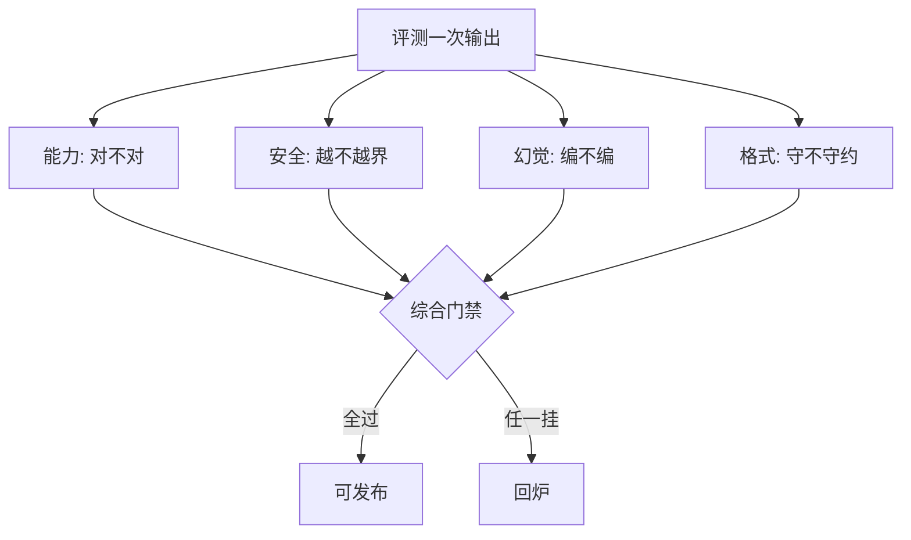
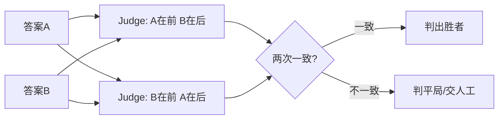
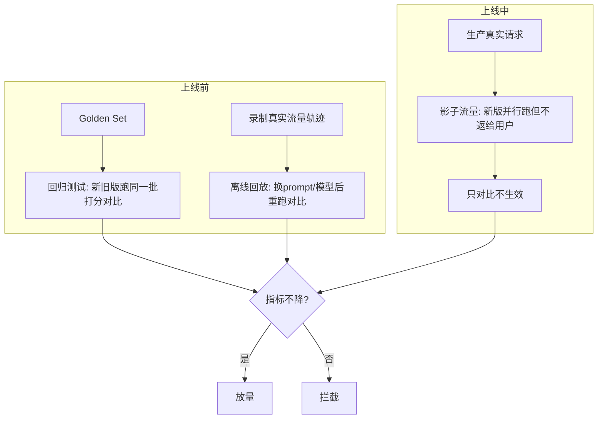

# LLM 评测方法论

> 指标分类 · Benchmark 与数据污染 · LLM-as-judge · 人类在环 · 离线回放与回归

::: tip 🧠 一句话记忆锚点
**评测四象限：能力 / 安全 / 幻觉 / 格式遵从，缺一象限模型上线就翻车。公开 benchmark 分数看看就好——数据污染（train-test contamination）让它虚高；生产靠自建 Golden Set + 离线回放 + 影子流量做回归。LLM-as-judge 便宜快，但有位置偏差/长度偏差/自我偏好三大坑，要靠人类在环校准（Cohen's kappa 量一致性）。RAG 的对错交给 RAGAS 的 faithfulness / answer relevance / context precision-recall。**
:::

## 场景问题

模型迭代了一版，如何证明"新版比旧版好"？这是所有 LLM 落地都绕不开的问题，而它比传统 ML 的评测难得多：

- **输出是开放文本**：没有唯一正确答案，`accuracy` 这种硬指标常常失效。
- **一个 prompt 多个维度**：同一条回答可能"能力对但格式错"、"流畅但幻觉"、"正确但不安全"。
- **公开分数不可信**：模型可能在预训练时"背过"测试集（数据污染）。
- **人工评测贵且慢**：几千条样本靠人打分，成本高、还不稳定。

### 评测指标的四象限

任何一次评测都应把待测能力拆进四类，单看一类都会漏：

| 象限 | 关注 | 典型指标 / 方法 |
| --- | --- | --- |
| **能力 (Capability)** | 任务做得对不对 | 准确率、EM/F1、pass@k（代码）、BLEU/ROUGE（弱信号）、LLM-as-judge 打分 |
| **安全 (Safety)** | 是否越界、有害、可越狱 | 拒答率、越狱成功率、毒性/偏见检测、红队对抗 |
| **幻觉 (Hallucination)** | 是否编造事实 | 事实一致性、引用可溯源、RAGAS faithfulness |
| **格式遵从 (Format)** | 是否守约（JSON/长度/语言） | Schema 校验通过率、字段完整率、指令遵从率 |



> **口诀**：能力对、安全稳、不幻觉、守格式——四关全过才叫"好"，任何一关单独刷高分都是自欺。

## 实现方案

### 指标计算：从硬指标到 LLM-as-judge

不同任务用不同层次的指标，成本与信噪比是权衡的核心：

```python
# 三层评测策略：硬匹配 → 规则校验 → LLM 裁判
def evaluate_sample(pred: str, gold: dict) -> dict:
    scores = {}

    # 1) 硬指标：有唯一答案时最可信、最便宜（分类/抽取/代码）
    if gold["type"] == "exact":
        scores["exact_match"] = int(pred.strip() == gold["answer"])

    # 2) 格式遵从：JSON Schema / 正则强校验，机器判定不需要模型
    if gold.get("schema"):
        scores["format_ok"] = validate_schema(pred, gold["schema"])

    # 3) 开放题：无唯一答案 → LLM-as-judge 按 rubric 打 1~5 分
    if gold["type"] == "open":
        scores["judge"] = llm_judge(
            question=gold["question"],
            answer=pred,
            reference=gold.get("reference"),   # 给参考答案能显著降方差
            rubric="事实正确性/相关性/完整性各1~5分，给出理由再给分",
        )
    return scores
```

**优先级**：能用硬指标绝不用模型；能用规则校验绝不用人工；只有开放题才动用 LLM-as-judge 或人类。

### LLM-as-judge 的偏差与校正

用一个强模型给另一个模型的输出打分，快且便宜，但它**不是中立的**，三大系统性偏差必须校正：

| 偏差 | 现象 | 校正手段 |
| --- | --- | --- |
| **位置偏差 (Position bias)** | 成对比较时偏向排在前面（或后面）的答案 | **两次交换顺序各判一遍**，只有两次结论一致才算数；不一致判平局 |
| **长度偏差 (Length/Verbosity bias)** | 偏爱更长、更啰嗦的回答 | rubric 里显式约束"简洁不扣分"；或控制长度后比较 |
| **自我偏好 (Self-preference)** | 裁判偏爱与自己同源/同风格的输出 | **裁判换用不同家族的模型**；多裁判投票；关键场景人工复核 |



其他稳态手段：**给参考答案**（降主观方差）、**要求先说理由再打分**（CoT 提升一致性）、**固定低温度**、**多裁判取中位数**。

### 人类在环与标注一致性

LLM-as-judge 再好也要用人类校准。核心问题：**多个标注员打分一致吗？** 用 **Cohen's kappa** 衡量——它剔除了"瞎猜也能蒙对"的部分：

```python
# Cohen's kappa: 衡量两个标注员一致性，扣除随机一致的成分
def cohen_kappa(po: float, pe: float) -> float:
    # po = 实际一致比例；pe = 随机情况下期望一致比例
    return (po - pe) / (1 - pe)

# 经验区间：<0.2 极差 | 0.2~0.4 一般 | 0.4~0.6 中等 | 0.6~0.8 好 | >0.8 极好
# 若人类之间 kappa 都上不去 → 说明 rubric 本身有歧义，先修标准再评模型
```

**落地闭环**：先让人类标一批 Golden Set → 算人-人 kappa 确认标准清晰 → 让 LLM-as-judge 判同一批 → 算**机器-人类 kappa**，达标（如 >0.6）才敢用裁判大规模跑，否则继续调 prompt 或回退人工。

### 离线回放 / 影子流量 / 回归测试

生产迭代靠三件套锁住"不退化"：



- **回归测试**：每次改动都在 Golden Set 上跑，任一象限指标掉了就拦住（CI 门禁）。
- **离线回放**：把线上真实请求录下来，改版后原样重放，对比新旧输出差异（diff 审查 + 打分）。
- **影子流量 (Shadow traffic)**：新版和旧版并行处理真实请求，新版结果**不返给用户**只记录对比，零风险验证。

### Golden Set 构建

Golden Set 是一切回归的基石，构建要点：

- **来源真实**：主体来自线上真实 query，而非拍脑袋编造。
- **分层覆盖**：典型 case + 边界 case + 已知失败 case（历史 bug 全部沉淀进来防回归）。
- **规模适中**：100~500 条起步，覆盖各能力象限；宁少而精。
- **带标准答案/rubric**：每条标注期望输出或评分标准，支撑自动打分。
- **版本化 + 定期刷新**：随业务演进补充新场景，剔除失效样本，像代码一样管理。

## 为什么这么做

### 为什么公开 benchmark 分数不能全信：数据污染

MMLU、GSM8K、HumanEval 这些榜单分数常被拿来营销，但存在致命的 **train-test contamination（数据污染）**：

- benchmark 的题目和答案早已散落在互联网上，**很可能进了模型的预训练语料**——模型不是"会做"，而是"背过"。
- 表现为**榜单虚高但换个说法就崩**：改写题目、换数字、换语言，分数断崖式下跌。
- **应对**：用**私有 / 新构造**的评测集；做**改写鲁棒性测试**（同题换表述）；关注**发布日期晚于模型训练截止**的新 benchmark；生产决策以**自建 Golden Set**为准。

### 为什么要分四象限而不是一个总分

一个"综合分"会掩盖致命短板：一个能力 90 分但越狱率 30% 的模型绝不能上线。**安全和幻觉是"一票否决"象限**，不能被能力的高分平均掉。分象限评测才能设"任一象限不达标即拦截"的门禁。

### 为什么 LLM-as-judge 值得用（尽管有偏差）

- **成本/速度**：人工评一条几分钟几块钱，LLM 裁判几秒几厘钱，能把评测规模扩大千倍。
- **可复现**：固定 prompt + 温度后可重复运行，人类会疲劳、会漂移。
- **前提是校准**：只要用 kappa 证明它和人类判断足够一致，就能放心替代大部分人工——把人力省下来盯真正模糊的 case。

## 为什么别的选择不行

### 只用传统文本相似度指标（BLEU / ROUGE）不行

- BLEU/ROUGE 只算 **n-gram 重叠**，跟"意思对不对""有没有幻觉"几乎无关。
- 换个同义表达、调下语序，分数就变，但语义没变——**与人类判断相关性弱**。
- 只适合翻译/摘要做**弱参考信号**，绝不能当开放问答的主指标。

### 只跑公开 benchmark 不行

数据污染 + 分布不匹配（你的业务场景不在 benchmark 里）→ 榜单第一的模型在你的场景可能垫底。**必须自建反映真实业务的评测集**。

### 只靠人工评测不行

贵、慢、不一致（不同人、不同时间打分漂移）、不可复现、无法进 CI。规模一大就崩，只能用于**校准裁判**和**抽查模糊 case**。

### 只靠 LLM-as-judge 不做人类校准不行

不校准就用裁判，等于用一个**有系统性偏差、且可能和你需求不对齐**的黑盒下判决。位置/长度/自我偏好偏差会让结论失真——**必须先用 kappa 证明它靠谱**。

### 与 RAG 评测的边界

**本文讲通用 LLM 输出评测；RAG 系统的对错要用专门指标，见 [RAG](./rag.md)。** RAGAS 三件套针对"检索增强"这一特有环节：

| RAGAS 指标 | 衡量什么 | 归属象限 |
| --- | --- | --- |
| **Faithfulness（忠实度）** | 答案是否**只**基于召回的上下文，没编造 | 幻觉 |
| **Answer Relevance（答案相关性）** | 答案是否切题、不跑偏 | 能力 |
| **Context Precision / Recall（上下文精度/召回）** | 检索到的片段是否**该来的都来了、不该来的别来** | 检索质量（RAG 特有） |

**边界划分**：Context precision-recall 评的是**检索器**，通用 LLM 评测管不着；而 faithfulness、answer relevance 本质是"幻觉"和"能力"象限在 RAG 场景的具体化。做 RAG 就两套一起上，分别定位"是检索的锅还是生成的锅"。

## 沉淀结论

::: tip 速记
**评测 = 四象限（能力/安全/幻觉/格式）× 三层指标（硬匹配→规则→LLM/人类）。公开榜单防污染，生产靠 Golden Set + 离线回放 + 影子流量做回归门禁。LLM-as-judge 校三偏差（位置/长度/自我偏好）、用 kappa 对齐人类。RAG 的对错交给 RAGAS。**
:::

### 面试高频题清单

- **Q：LLM 评测分哪几类指标？** A：能力（对不对）、安全（越不越界）、幻觉（编不编）、格式遵从（守不守约）四象限；安全和幻觉是一票否决，不能被能力高分平均掉。
- **Q：为什么公开 benchmark 分数不能全信？** A：train-test contamination——题目答案早进了预训练语料，模型是"背过"不是"会做"，改写换数就崩；生产要用私有 Golden Set + 改写鲁棒性测试。
- **Q：LLM-as-judge 有哪些偏差？怎么校正？** A：位置偏差（交换顺序两判一致才算）、长度偏差（rubric 约束简洁不扣分）、自我偏好（换不同家族模型/多裁判投票 + 人工复核）；再配给参考答案、先说理由再打分、低温度。
- **Q：Cohen's kappa 是什么？评测里干嘛用？** A：衡量两标注员一致性、扣除随机蒙对的成分，(po-pe)/(1-pe)；>0.6 算好。用来先确认人-人标准清晰，再验证机器-人类一致后才敢大规模用裁判。
- **Q：离线回放、影子流量、回归测试区别？** A：回归测试在 Golden Set 上跑防指标退化（CI 门禁）；离线回放录真实轨迹改版后重放对比；影子流量新旧版并行处理真实请求但新版不返给用户，零风险验证。
- **Q：RAG 怎么评？和通用评测什么关系？** A：用 RAGAS——faithfulness（忠实/幻觉）、answer relevance（相关/能力）、context precision-recall（检索质量，RAG 特有）；前两者是通用象限在 RAG 的具体化，precision-recall 专评检索器，两套一起上定位是检索还是生成的锅。

### 记忆口诀

- **四象限**：能力 / 安全 / 幻觉 / 格式遵从（安全+幻觉一票否决）
- **三层指标**：硬匹配 → 规则校验 → LLM/人类裁判（越往下越贵，能上层别下沉）
- **judge 三偏差**：位置 / 长度 / 自我偏好（交换顺序 + rubric + 换家族模型）
- **回归三件套**：Golden Set 回归 / 离线回放 / 影子流量
- **信不信榜单**：污染让它虚高，改写就崩，生产只信私有集
- **RAGAS 三指标**：faithfulness / answer relevance / context precision-recall

## 内容来源

综合整理自 OpenAI Evals / RAGAS / HELM / MT-Bench / Chatbot Arena 等公开资料与自研评测平台经验

> 综合整理：OpenAI Evals、RAGAS、Stanford HELM、LMSYS Chatbot Arena、Anthropic 评测实践（2026-07；评测生态更新快，请以官方文档为准）

## 自测：合上资料能说清楚吗？

1. LLM 评测的四类指标象限是什么？为什么不能只看一个综合总分？
<details><summary>参考答案</summary>

**能力 / 安全 / 幻觉 / 格式遵从**。不能只看总分是因为**安全和幻觉是一票否决象限**——一个能力 90 分但越狱率 30% 的模型不能上线，总分会把致命短板平均掉。分象限才能设"任一象限不达标即拦截"的门禁。

</details>

2. 什么是 train-test contamination？它如何影响 benchmark 分数，怎么应对？
<details><summary>参考答案</summary>

**数据污染**：benchmark 题目答案早已进了模型预训练语料，模型是"背过"而非"会做"，表现为**榜单虚高但改写换数就崩**。应对：用私有/新构造评测集、做改写鲁棒性测试、关注训练截止后发布的新 benchmark、生产以自建 Golden Set 为准。

</details>

3. LLM-as-judge 有哪三大偏差？各自的校正手段是什么？
<details><summary>参考答案</summary>

**位置偏差**（偏爱某个位置）→ 交换顺序各判一遍、两次一致才算数；**长度偏差**（偏爱啰嗦答案）→ rubric 显式约束简洁不扣分；**自我偏好**（偏爱同源输出）→ 换不同家族模型当裁判、多裁判投票 + 人工复核。此外给参考答案、先说理由再打分、固定低温度也能降方差。

</details>

4. Cohen's kappa 是什么，为什么评测里要用它而不是直接算"一致比例"？
<details><summary>参考答案</summary>

kappa = (po - pe)/(1 - pe)，**扣除了随机蒙对的一致成分**。直接算一致比例会被"瞎猜也能蒙对"虚高，kappa 更真实。用途：先确认人-人 kappa 高（rubric 无歧义），再验证机器-人类 kappa 达标（如 >0.6）才敢大规模用 LLM 裁判。

</details>

5. 离线回放、影子流量、回归测试三者的区别？RAG 系统又该用什么评？
<details><summary>参考答案</summary>

**回归测试**在 Golden Set 上跑防指标退化（CI 门禁）；**离线回放**录真实用户轨迹、改版后原样重放对比；**影子流量**新旧版并行处理真实请求但新版结果不返给用户、只记录对比（零风险）。RAG 用 **RAGAS**：faithfulness（幻觉）、answer relevance（能力）、context precision-recall（检索质量，RAG 特有），定位是检索还是生成的锅。

</details>
