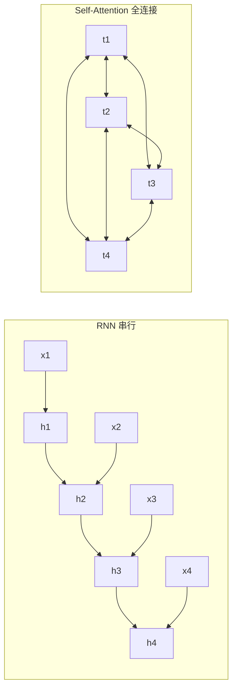
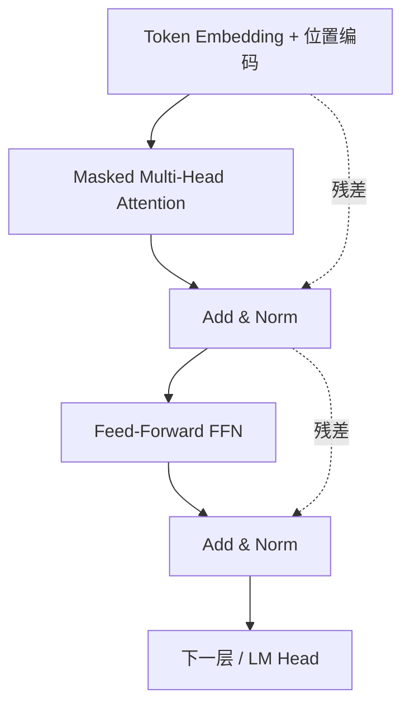
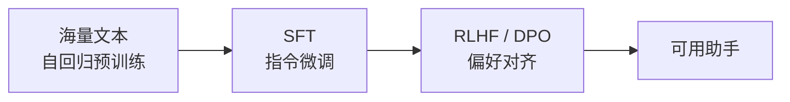

# 大模型核心原理

> Transformer / Self-Attention · 位置编码 · Tokenization · Scaling Law · 解码采样 · 涌现与对齐

## 场景问题

### 为什么是 Transformer，不是 RNN/LSTM？

一个绕不开的面试起点：给定一段文本预测下一个 token，为什么 2017 年后大家全换成了 Transformer？

- **RNN/LSTM 的两个死穴**：① 时序依赖**无法并行**——第 t 步必须等第 t-1 步算完，训练慢；② 长程依赖靠隐状态一路传递，**梯度消失**，隔几十个 token 的信息就丢了。
- **Transformer 的答案**：用 **Self-Attention** 让序列里任意两个位置**直接**建立连接（路径长度 O(1) 而非 O(n)），且整段序列可**一次性并行**计算。代价是注意力的 **O(n²)** 复杂度——这是后面所有"长上下文优化"的根源。



### 主流大模型都是 Decoder-only

原始 Transformer 是 Encoder-Decoder（翻译任务）。今天主流生成式大模型（GPT、LLaMA、Qwen、Claude）几乎都是 **Decoder-only**：

| 结构 | 代表 | 适合 |
| --- | --- | --- |
| **Encoder-only** | BERT | 理解类（分类 / 抽取 / 检索 embedding） |
| **Encoder-Decoder** | T5 / BART | 序列到序列（翻译 / 摘要） |
| **Decoder-only** | GPT / LLaMA / Qwen | 自回归生成，**统一用"预测下一个 token"**做所有任务 |

Decoder-only 胜出的核心原因：**任务大一统**——预训练与推理都是同一个"next-token prediction"，天然适配指令、对话、few-shot；架构简单、易 scale。

## 实现方案

### Self-Attention：缩放点积注意力

一句话：**每个 token 用自己的 Query 去和所有 token 的 Key 做相似度打分，softmax 归一化成权重，再对所有 Value 加权求和**——得到"融合了上下文的新表示"。

```text
Attention(Q, K, V) = softmax( Q·Kᵀ / √d_k ) · V
```

- **Q/K/V** 都是输入 embedding 经三个可学习矩阵 `W_Q / W_K / W_V` 线性变换得到。
- **除以 √d_k**：点积随维度增大而方差变大，不缩放会把 softmax 推入梯度极小的饱和区。
- **多头（Multi-Head）**：把 Q/K/V 切成 h 份并行做注意力，再拼接——每个头学不同的关注模式（语法 / 指代 / 位置…），类似 CNN 的多通道。
- **因果 mask（Causal Mask）**：生成时第 t 个 token 只能看到 ≤ t 的位置，把上三角置为 `-∞`，softmax 后为 0——保证"不偷看未来"。

```python
import numpy as np

def scaled_dot_product_attention(Q, K, V, causal=True):
    # Q,K,V: [seq_len, d_k]
    d_k = Q.shape[-1]
    scores = Q @ K.T / np.sqrt(d_k)          # [seq, seq] 相似度矩阵
    if causal:                                # 因果 mask：屏蔽未来位置
        mask = np.triu(np.ones_like(scores), k=1).astype(bool)
        scores[mask] = -1e9
    scores = scores - scores.max(-1, keepdims=True)   # 数值稳定
    weights = np.exp(scores)
    weights /= weights.sum(-1, keepdims=True)          # softmax
    return weights @ V                        # 对 Value 加权求和
```

一个完整的 Decoder Block = **Masked Multi-Head Attention → 残差 + LayerNorm → FFN(前馈) → 残差 + LayerNorm**，堆叠 N 层。残差连接解决深层网络梯度问题，LayerNorm 稳定训练（现代模型多用 Pre-LN + RMSNorm）。



### 位置编码：注意力本身"看不见顺序"

Self-Attention 是**排列不变**的——打乱输入顺序，输出集合不变。必须显式注入位置信息：

- **正弦绝对编码（原版）**：用不同频率的 sin/cos 给每个位置一个固定向量，加到 embedding 上。简单但外推差。
- **RoPE（旋转位置编码，LLaMA/Qwen 主流）**：把位置信息以**旋转**方式作用到 Q/K 上，天然编码**相对位置**，且有一定长度外推能力（配合 NTK/YaRN 插值可扩窗口）。
- **ALiBi**：直接在注意力分数上按距离加线性偏置，训练短、推理长的外推能力强。

### Tokenization：模型眼里没有"字"，只有 token

文本先切成 token（子词单元）再查 embedding 表。主流是 **BPE / BBPE / SentencePiece**：

- **BPE（Byte-Pair Encoding）**：从字符开始，反复合并"最高频相邻对"，直到词表达到设定大小。高频词整体成 token，低频词拆成子词——平衡词表大小与 OOV。
- **BBPE（Byte-level BPE，GPT 系）**：在**字节**上做 BPE，任何 UTF-8 文本都能编码，**永不 OOV**，对中文/emoji 友好。

工程影响：① 中文一个字常占 1~2+ token，**计费和上下文长度按 token 算**；② prompt 里的空格、换行都是 token；③ 数字/罕见词被拆碎会影响数学能力。

### 预训练目标与 Scaling Law

- **预训练目标**：Decoder-only 用**自回归语言建模**——最大化整段序列的 `∏ₜ P(xₜ | x_<ₜ)`，即"预测下一个 token"。损失是交叉熵（等价于最小化困惑度 Perplexity）。
- **Scaling Law**：模型能力随**参数量 N、数据量 D、算力 C**呈幂律平滑提升。**Chinchilla（DeepMind）**修正了早期"堆参数"的偏见：给定算力预算，**参数与数据应大致等比例增长**（约 20 tokens/参数），此前的大模型多是"参数过大、数据喂不够"。

### 解码采样：同一个模型，输出风格由采样决定

模型每步输出的是**全词表的概率分布**，怎么从中选下一个 token 就是解码策略：

| 策略 | 做法 | 特点 |
| --- | --- | --- |
| **Greedy** | 每步取概率最大 | 确定、易复读、乏味 |
| **Beam Search** | 保留 top-b 条候选序列 | 适合翻译/摘要，开放生成易呆板 |
| **Temperature** | logits 除以 T 再 softmax | T↑ 更随机有创意，T↓ 更保守 |
| **Top-k** | 只在概率前 k 个里采样 | 截断长尾 |
| **Top-p（Nucleus）** | 只在累积概率达 p 的最小集合里采样 | 动态截断，主流默认 |
| **Repetition Penalty** | 对已出现 token 降权 | 抑制复读 |

面试常问："temperature=0 是否完全确定？"——**理论上贪心确定，但受浮点/并行归约顺序、MoE 路由等影响，实际仍可能有微小非确定性。**

## 为什么这么做

### 为什么 O(n²) 是"原罪"也是"取舍"

注意力要算 n×n 的相似度矩阵，序列翻倍则**计算和显存都是 4 倍**。为什么还用它？

- 换来的是**任意位置直连 + 全并行**，这是 RNN 给不了的表达力与训练效率。
- n² 的痛点催生了一整套优化：稀疏/滑窗注意力、FlashAttention（省显存不改结果）、线性注意力、以及推理侧的 KV Cache——详见 [推理与微调优化](/ai-llm/llm-inference-optimization.md)。

### 为什么需要对齐（Alignment）

预训练只学会了"续写互联网文本"，并不天然"听话、有用、无害"。要变成可用的助手需**对齐**三步：

1. **SFT（监督微调）**：用高质量"指令-回答"对，教模型follow instruction。
2. **RLHF / DPO**：用人类偏好数据训练，让输出更符合人类偏好（有用/诚实/无害）。
3. **系统提示 + 护栏**：运行时约束角色与边界。



## 为什么别的选择不行

### 常见误区与澄清

| 误区 | 澄清 |
| --- | --- |
| "参数越多一定越强" | Chinchilla：数据不够时，大参数是浪费；小而喂饱的模型可反超 |
| "上下文窗口越大越好" | 有 O(n²) 开销 + "迷失在中间"（middle 信息利用差）；长窗≠会用长窗 |
| "temperature 越高越聪明" | 只是更随机；推理/代码任务通常要**低温**甚至贪心 |
| "微调就能加知识" | 微调擅长改**风格/格式/能力**，加**事实知识**常更适合 [RAG](/ai-llm/rag.md) |
| "BPE 按词切" | 按**高频子词/字节**切，一个中文字可能是多个 token |
| "Attention 知道词序" | 不知道，全靠**位置编码**注入 |

### 为什么不直接无限堆层/堆窗口

- 层数堆太深收益递减且难训（靠残差 + Norm 缓解，但仍有瓶颈）。
- 窗口靠 O(n²) 硬扩会撞显存墙；工程上靠 RoPE 插值（NTK/YaRN）、稀疏注意力、外部检索（RAG）分摊，而非无脑加长。

## 沉淀结论

::: tip 心法总结
**大模型 = Transformer（Self-Attention 全连接 + 位置编码）× Scale（Chinchilla 最优的参数/数据配比）+ 对齐（SFT→RLHF/DPO）。** 一切生成行为都归结为"预测下一个 token"，而输出风格由**解码采样**控制；O(n²) 注意力是能力之源，也是所有长上下文与推理优化的战场。
:::

延伸阅读：[推理与微调优化](/ai-llm/llm-inference-optimization.md) · [RAG 检索增强生成](/ai-llm/rag.md) · [Agent 开发](/ai-llm/agent-dev.md)

## 内容来源

综合整理：Attention Is All You Need（Vaswani 2017）、GPT/LLaMA/Chinchilla 论文、RoPE/ALiBi 论文、Hugging Face 与各家官方文档（2026-07；领域更新快，请以最新论文与官方文档为准）。
