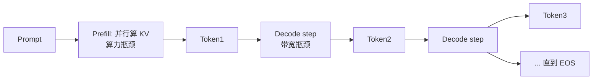
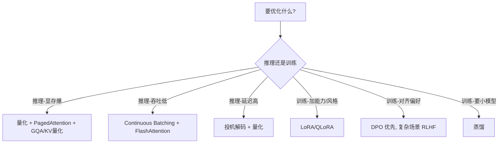

# 推理与微调优化

> Prefill/Decode · KV Cache · FlashAttention · PagedAttention/vLLM · 量化 · 投机解码 · MoE · LoRA/QLoRA · RLHF/DPO · 蒸馏

::: tip 🧠 一句话记忆锚点
**先量瓶颈再选招：Prefill 卡算力、Decode 卡显存带宽。KV Cache 降复杂度、FlashAttention 降访存、PagedAttention + Continuous Batching 提吞吐、量化 + 投机解码降延迟与成本。训练侧——能不训就 RAG/prompt，要训用 LoRA/QLoRA，对齐用 DPO 起步。**
:::

## 场景问题

### 一次生成到底慢在哪、贵在哪？

面试高频："70B 模型部署，QPS 上不去、显存爆、首字慢，怎么优化？"——先把一次推理拆成两个性质完全不同的阶段：

| 阶段 | 做什么 | 瓶颈 | 优化方向 |
| --- | --- | --- | --- |
| **Prefill（预填充）** | 并行处理整个 prompt，算出 KV、吐出第 1 个 token | **算力（compute-bound）** | 大 batch、FlashAttention、张量并行 |
| **Decode（解码）** | 自回归逐个吐 token，每步只算 1 个新 token | **显存带宽（memory-bound）** | KV Cache、量化、投机解码、Continuous Batching |

关键洞察：**Decode 阶段每生成一个 token 都要把整个模型权重从显存搬一遍**，算得少、搬得多，所以是**带宽瓶颈**——这解释了为什么"量化权重"能直接提速（搬的数据变少了）。



## 实现方案

### KV Cache：Decode 提速的基石

自回归每步都要对"之前所有 token"做注意力。若每步都重算全部 K/V，是 O(n²) 的重复劳动。**KV Cache 把已算过的 K、V 缓存下来**，每步只算新 token 的 Q 和它的 K/V，追加进 cache——把每步复杂度从 O(n²) 降到 O(n)。

代价是**显存**。KV Cache 大小估算：

```text
KV_bytes ≈ 2 (K和V) × layers × seq_len × n_kv_heads × head_dim × bytes_per_elem × batch

例：LLaMA-13B, 40 层, head_dim=128, n_kv_heads=40, fp16(2B), seq=2048, batch=1
  ≈ 2 × 40 × 2048 × 40 × 128 × 2 ≈ 3.4 GB   ← 仅一条序列的 KV！
```

所以长上下文 + 大 batch 时，**KV Cache 常比模型权重还吃显存**。省 KV 的招：**GQA/MQA**（多个 Q 头共享一组 K/V 头，直接砍 n_kv_heads）、**KV Cache 量化**（存 int8/int4）、**PagedAttention**（消除碎片）。

### FlashAttention：省显存、不改结果

朴素注意力要显式生成 n×n 的分数矩阵并写回显存（HBM），n 大时既慢又爆显存。**FlashAttention 是 IO-aware 的**：分块（tiling）把 Q/K/V 搬进 SRAM，用 **online softmax** 增量计算，**从不落地完整的 n×n 矩阵**。

- 结果**数学上完全等价**（不是近似），只是省了 HBM 读写。
- 省的是**显存和访存**，FLOPs 不变——但因为访存是瓶颈，实测大幅提速。

### PagedAttention / vLLM：像操作系统管内存一样管 KV

问题：传统实现给每个请求预分配"最大长度"的连续 KV 显存 → **内部碎片 + 无法共享**，利用率常不足 40%。

**PagedAttention（vLLM）**借鉴 OS 虚拟内存分页：KV 切成固定大小的 block，非连续存放、按需分配，逻辑连续、物理分散。收益：

- 显存碎片几乎消除，**吞吐提升数倍**；
- 相同前缀（system prompt、few-shot）的 KV 可**跨请求共享**（prefix caching）。

### Continuous Batching：吞吐的另一半

静态 batching 要等一批里最慢的序列结束才能收下一批 → GPU 空转。**Continuous / In-flight Batching**：谁生成完 EOS 就立刻替换成排队中的新请求，**迭代级动态拼批**，GPU 始终打满。vLLM / TGI / TensorRT-LLM 的核心吞吐来源。

### 量化：用精度换显存和带宽

把权重（有时含激活、KV）从 fp16 降到 int8/int4，**搬得少 → decode 更快，占得少 → 单卡塞更大模型**。

| 方案 | 量化对象 | 特点 |
| --- | --- | --- |
| **INT8 (LLM.int8)** | 权重 | 近乎无损，通用 |
| **GPTQ** | 权重（4bit）| 训练后量化，逐层校准，精度好、社区广 |
| **AWQ** | 权重（4bit）| 保护"重要权重"通道，推理快、精度稳 |
| **KV Cache 量化** | KV（int8/int4）| 直接砍长上下文显存，注意精度回退 |

权重量化通常安全；**激活量化**更难（动态范围大、离群值）。

### 投机解码（Speculative Decoding）：小模型探路，大模型验收

Decode 是带宽瓶颈，大模型每步只吐 1 token 很浪费带宽。**用一个小 draft 模型一次猜 k 个 token，大模型一次并行 verify 这 k 个**——猜中就白赚，猜错回退。结果分布**与只用大模型完全一致**（无损加速），实测 2~3x。变体：Medusa（多头自投机）、EAGLE。

下图：draft 小模型飞快连吐 5 个候选，大模型**一次并行核验**——前 3 个命中（转绿、白赚），第 4 个失配（变红）→ 从失配处回退，后面作废重猜。

<svg viewBox="0 0 660 235" width="100%" style="max-width:660px;height:auto" role="img" aria-label="投机解码：draft 模型连猜 k 个 token，大模型并行核验，命中转绿、失配回退">
  <text x="12" y="30" font-size="12" fill="currentColor">draft 小模型（快）连猜：</text>
  <g font-size="13" fill="#fff">
    <rect x="70" y="44" width="90" height="36" rx="6" fill="#64748b"><animate attributeName="opacity" values="0;1;1;1;1" dur="5s" begin="0s"   repeatCount="indefinite"/></rect><text x="115" y="67" text-anchor="middle">the</text>
    <rect x="170" y="44" width="90" height="36" rx="6" fill="#64748b"><animate attributeName="opacity" values="0;0;1;1;1" dur="5s" begin="0s" repeatCount="indefinite"/></rect><text x="215" y="67" text-anchor="middle">cat</text>
    <rect x="270" y="44" width="90" height="36" rx="6" fill="#64748b"><animate attributeName="opacity" values="0;0;0;1;1" dur="5s" begin="0s" repeatCount="indefinite"/></rect><text x="315" y="67" text-anchor="middle">sat</text>
    <rect x="370" y="44" width="90" height="36" rx="6" fill="#64748b"><animate attributeName="opacity" values="0;0;0;0;1" dur="5s" begin="0s" repeatCount="indefinite"/></rect><text x="415" y="67" text-anchor="middle">on</text>
    <rect x="470" y="44" width="90" height="36" rx="6" fill="#64748b"><animate attributeName="opacity" values="0;0;0;0;1" dur="5s" begin="0s" repeatCount="indefinite"/></rect><text x="515" y="67" text-anchor="middle">sky</text>
  </g>

  <text x="230" y="118" font-size="12" fill="currentColor">↓ 大模型一次并行 verify ↓</text>

  <text x="12" y="160" font-size="12" fill="currentColor">核验结果：</text>
  <g font-size="13" fill="#fff">
    <rect x="70" y="150" width="90" height="36" rx="6" fill="#64748b"><animate attributeName="fill" values="#64748b;#64748b;#16a34a;#16a34a;#16a34a" dur="5s" begin="0s" repeatCount="indefinite"/></rect><text x="115" y="173" text-anchor="middle">the ✓</text>
    <rect x="170" y="150" width="90" height="36" rx="6" fill="#64748b"><animate attributeName="fill" values="#64748b;#64748b;#64748b;#16a34a;#16a34a" dur="5s" begin="0s" repeatCount="indefinite"/></rect><text x="215" y="173" text-anchor="middle">cat ✓</text>
    <rect x="270" y="150" width="90" height="36" rx="6" fill="#64748b"><animate attributeName="fill" values="#64748b;#64748b;#64748b;#64748b;#16a34a" dur="5s" begin="0s" repeatCount="indefinite"/></rect><text x="315" y="173" text-anchor="middle">sat ✓</text>
    <rect x="370" y="150" width="90" height="36" rx="6" fill="#64748b"><animate attributeName="fill" values="#64748b;#64748b;#64748b;#64748b;#dc2626" dur="5s" begin="0s" repeatCount="indefinite"/></rect><text x="415" y="173" text-anchor="middle">on ✗</text>
    <rect x="470" y="150" width="90" height="36" rx="6" fill="#334155" opacity="0.5"><animate attributeName="opacity" values="0.5;0.5;0.5;0.5;0.2" dur="5s" begin="0s" repeatCount="indefinite"/></rect><text x="515" y="173" text-anchor="middle" fill="#94a3b8">作废</text>
  </g>
  <text x="70" y="214" font-size="11" fill="currentColor">命中 3 个 = 一次前向白赚 3 步；第 4 个失配 → 回退到此处，由大模型给出正确 token 后重新起猜。</text>
</svg>

### MoE：稀疏激活，参数多但每次只用一部分

**Mixture-of-Experts**：把 FFN 换成 N 个专家 + 一个路由器，每个 token 只激活 top-k（如 8 选 2）个专家。**总参数量巨大，单次推理算力却只用一小部分**——用显存换算力效率。挑战：路由负载均衡、专家显存占用、通信开销。代表：Mixtral、DeepSeek-MoE。

### 训练/微调侧：LoRA / QLoRA / RLHF / DPO / 蒸馏

**PEFT（参数高效微调）**：全参微调 70B 要几百 GB 显存、成本高。**LoRA** 冻结主干权重 W，只训练一个低秩增量：

```text
h = W·x + (B·A)·x        # A: [r, d]  B: [d, r]，秩 r 远小于 d（如 r=8/16）
                          # 只训练 A、B（占原参数 <1%），推理时可合并回 W
```

- **QLoRA**：主干权重 **4bit 量化（NF4）**存储 + LoRA 微调，**单张 24G/48G 卡就能微调 65B**。
- **对齐**：**RLHF**（训练奖励模型 + PPO 强化学习，效果强但流程复杂、易训崩）vs **DPO**（直接用偏好对做分类式优化，**免奖励模型、免 RL**，更稳更省，成主流）。
- **蒸馏**：用大模型（teacher）的输出/logits 训练小模型（student），把能力压进小模型降本。



## 为什么这么做

### "何时选哪种优化"决策指引

- **首字延迟（TTFT）高** → 优化 Prefill：FlashAttention、张量并行、prefix caching 复用 system prompt 的 KV。
- **吞吐（QPS/throughput）低** → Continuous Batching + PagedAttention，把 GPU 填满。
- **单卡放不下 / 长上下文爆显存** → 权重量化（AWQ/GPTQ）+ GQA + KV Cache 量化。
- **端到端延迟敏感（如实时对话）** → 投机解码（无损）+ 低比特量化。
- **要定制风格/格式/领域能力** → LoRA/QLoRA（而非从头训）；**要加事实知识优先 [RAG](/ai-llm/rag.md)**。
- **要对齐人类偏好** → DPO 起步，数据/资源充足且追求上限再上 RLHF。

## 为什么别的选择不行

### 微调路线对比

| 方案 | 显存/成本 | 适合 | 不适合 |
| --- | --- | --- | --- |
| **全参微调 (SFT)** | 最高（数百 GB） | 有充足算力、要最大化效果 | 中小团队、快速迭代 |
| **LoRA** | 低（原参数 <1% 可训） | 多任务、快速试验、可插拔 | 需要改动底层表征的极端场景 |
| **QLoRA** | 最低（单卡微调 65B） | 显存受限、个人/小团队 | 对量化误差极敏感的任务 |
| **Prompt/RAG（不训）** | 几乎为零 | 加知识、时效性内容、频繁变动 | 需改变模型固有行为/风格 |

**结论**：能不训就不训（RAG/prompt）；要训优先 PEFT；全参微调是"最后一档"。

### 常见坑与反直觉

- **"量化一定掉点"**：权重 int8/4bit 通常近乎无损，但**激活/KV 量化**和**极端 4bit**在数学/代码任务上可能明显回退——要按任务评测，别只看 PPL。
- **"投机解码是近似加速"**：**错**，它是**无损**的（verify 保证输出分布一致），只有速度收益。
- **"batch 越大越好"**：Prefill 是算力瓶颈，batch 大到打满算力后收益消失；Decode 受带宽和 KV 显存约束，batch 大到 KV 爆显存反而 OOM。
- **"KV Cache 越长越好"**：KV 显存随 seq_len 线性涨，长上下文时它才是显存主要占用，不是权重。
- **"MoE = 免费的大模型"**：算力省，但**显存要装下所有专家**，且路由/通信复杂。

## 沉淀结论

::: tip 心法总结
**推理优化 = 认清 Prefill(算力) / Decode(带宽) 两阶段 → KV Cache 降复杂度、FlashAttention 降访存、PagedAttention+Continuous Batching 提吞吐、量化+投机解码降延迟与成本。训练优化 = 能不训就 RAG/prompt，要训就 PEFT(LoRA/QLoRA)，对齐用 DPO 起步。** 每一招都对应一个明确瓶颈——先量瓶颈，再选招。
:::

### 面试常见问题清单（按主题分类）

**两阶段与瓶颈**
- **Q：一次推理慢在哪、贵在哪？** A：拆两阶段——Prefill 并行处理 prompt、算力瓶颈；Decode 自回归逐 token、显存**带宽**瓶颈（每步要把整个模型权重搬一遍）。
- **Q：为什么量化能直接提速？** A：Decode 是带宽瓶颈，权重从 fp16 降到 int8/4bit，搬的数据变少，decode 更快、单卡还能塞更大模型。

**KV Cache 与显存**
- **Q：KV Cache 解决什么、代价是什么？** A：缓存已算的 K/V，每步只算新 token，复杂度 O(n²)→O(n)；代价是显存，长上下文/大 batch 时常比权重还吃显存。
- **Q：怎么省 KV 显存？** A：GQA/MQA（多 Q 头共享一组 KV 头）、KV Cache 量化（int8/int4）、PagedAttention 消碎片。

**吞吐与延迟**
- **Q：FlashAttention 是近似吗？** A：不是，数学上完全等价；它是 IO-aware 分块 + online softmax，不落地 n×n 矩阵，省的是访存。
- **Q：PagedAttention / Continuous Batching 各解决什么？** A：前者像 OS 分页管 KV、消碎片 + 前缀共享；后者迭代级动态拼批、谁完谁换，GPU 始终打满。
- **Q：投机解码是近似加速吗？** A：**不是，无损**——大模型 verify 保证输出分布一致，只有速度收益（2~3x）。

**训练与微调**
- **Q：LoRA / QLoRA / 全参微调怎么选？** A：能不训就 RAG/prompt；要训优先 LoRA（只训 <1% 参数）；显存紧张用 QLoRA（4bit 主干，单卡微调 65B）；全参是最后一档。
- **Q：RLHF 与 DPO 区别？** A：RLHF 需奖励模型 + PPO，效果强但复杂易训崩；DPO 直接用偏好对做分类式优化，免奖励模型免 RL，更稳更省，成主流。
- **Q：MoE = 免费的大模型吗？** A：否，算力省（每 token 只激活 top-k 专家），但**显存要装下所有专家**，且路由/通信复杂。

延伸阅读：[大模型核心原理](/ai-llm/llm-fundamentals.md) · [RAG 检索增强生成](/ai-llm/rag.md) · [Agent 开发](/ai-llm/agent-dev.md)

### 记忆口诀

- **两阶段**：Prefill 卡算力 / Decode 卡带宽 / 先量瓶颈再选招
- **省显存**：KV Cache 降复杂度 / GQA-MQA 砍 KV 头 / 量化搬得少
- **提吞吐**：PagedAttention 消碎片 / Continuous Batching 动态拼批 / prefix 共享
- **降延迟**：投机解码无损 2~3x / 低比特量化 / FlashAttention 省访存
- **训练侧**：能不训就 RAG-prompt / 要训用 LoRA-QLoRA / 对齐 DPO 起步

## 内容来源

综合整理：FlashAttention（Dao 2022）、vLLM/PagedAttention 论文、GPTQ/AWQ/QLoRA/LoRA 论文、Speculative Decoding（Leviathan 2023）、DPO 论文、vLLM/TensorRT-LLM/Hugging Face 官方文档（2026-07；领域更新极快，请以最新论文与官方文档为准）。

## 自测：合上资料能说清楚吗？

1. 一次推理为什么要拆成 Prefill 和 Decode 两个阶段？各自的瓶颈是什么？

<details><summary>参考答案</summary>

Prefill **并行**处理整个 prompt、算 KV，瓶颈是**算力**；Decode **自回归**逐 token，每步要把整个模型权重从显存搬一遍，瓶颈是**显存带宽**。这解释了量化为何直接提速。

</details>

2. KV Cache 解决了什么问题？它的代价是什么，怎么省？

<details><summary>参考答案</summary>

缓存已算的 K/V，每步只算新 token，复杂度 **O(n²)→O(n)**；代价是**显存**（长上下文/大 batch 常比权重还吃显存）。省法：**GQA/MQA**、**KV 量化**、**PagedAttention 消碎片**。

</details>

3. 对比 FlashAttention 与投机解码：它们分别优化什么？都是"近似"加速吗？

<details><summary>参考答案</summary>

都**无损**（数学等价）。FlashAttention 是 **IO-aware 分块 + online softmax**，不落地 n×n 矩阵，省**访存**；投机解码用**小模型猜 k 个 token、大模型并行 verify**，省**带宽**、提 2~3x 速度。

</details>

4. 对比 RLHF 与 DPO：为什么 DPO 逐渐成主流？

<details><summary>参考答案</summary>

RLHF 需**奖励模型 + PPO 强化学习**，效果强但流程复杂、易训崩；DPO 直接用**偏好对做分类式优化**，**免奖励模型、免 RL**，更稳更省，故成主流；追求上限再上 RLHF。

</details>

5. "MoE 是免费的大模型" 这句话错在哪？

<details><summary>参考答案</summary>

错。MoE 每 token 只激活 **top-k 专家**，省的是**算力**；但**显存必须装下所有专家**，且路由**负载均衡**与**通信开销**都是挑战——省算力不省显存。

</details>
