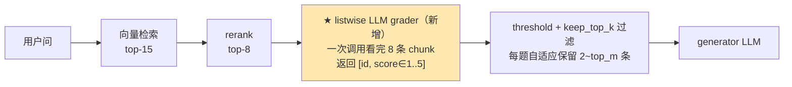

# RAG 上下文剪枝实战：用小模型砍掉 68% 废话还保住 96% 召回

> 动机 · 为什么固定 top-N 不行 · Listwise grader 方法 · 本地复现的实测数字 · 分层归因 · 落地优化 · 何时用/不用

本文是一次**可复现实验**的沉淀：在本地笔记本上复现 [kapa.ai 的 listwise 上下文剪枝方法](https://www.kapa.ai/blog/how-we-prune-rag-context)——训练/调用一个小 LLM 评判每条检索到的 chunk 对当前问题是否真有用，从而丢掉 ~68% 冗余上下文、同时把答案召回率维持在 ~96%。是 [RAG 检索增强生成](/ai-llm/rag.md) 里"进阶范式"的展开。

## 场景问题

### 检索回来的一堆 chunk，大部分并没被答案用到

先看一次典型 RAG generator 调用里 token 花在哪。以实测的监控语料为例（`top_m=10`，未剪枝），generator prompt 中位数是 **902 token**：

```
一次未剪枝的 generator 调用（实测中位数 902 tokens）
  ┌─────────────────────────────────────────────────────────────┐
  │ system prompt        ~40 tokens                              │
  │ 用户问题             ~25 tokens                              │
  │ ▓▓▓▓▓▓▓▓▓▓▓▓▓▓▓▓▓▓▓▓▓▓▓▓▓▓▓▓▓▓▓▓▓▓▓▓▓ 检索上下文  ~830 tokens│
  │ (10 条 chunk，每条 80–120 tokens)                             │
  └─────────────────────────────────────────────────────────────┘
```

这一大块检索上下文里，**大部分 chunk 并不真被答案用到**。你既在为无关信息付账，又在给模型制造长上下文噪声——注意力被稀释（对应 [RAG 主文](/ai-llm/rag.md) 里的"迷失在中间"），答案质量反而可能下降。剪枝后中位 prompt 掉到 **196 token**（挤掉 78%），后面会看到 recall 不降反升。

### 为什么"把 top_m 从 8 改成 3"这种一刀切不行

最直觉的做法是把保留数调小，一刀切掉一半。这里藏着一个致命假设：**rerank 分数是 well-calibrated 的**——"第 3 名和第 4 名之间有明确分界线"。真实 rerank 打分完全不是这样：

- Rerank 是 **pointwise**：对每条 `(question, chunk)` 单独打分，**两条分数接近的 chunk 之间无法互相比较**。
- 于是两种情况分数上长得一模一样，却要相反处理：
  - **情况 A**：两条内容重复 → 保留一条就够，另一条纯浪费。
  - **情况 B**：两条各含答案的一半 → **两条都得留**，砍掉就丢答案。

**光看分数分不出 A / B**。任何"固定阈值 / 固定 N"策略在情况 B 上必然翻车——这正是[主文召回漏斗](/ai-llm/rag.md)里说的"多跳问题上单纯调 rerank 无效"。得有个能"看完所有候选再打分"的机制，也就是 **listwise**。

## 实现方案

### 在 rerank 与 generator 之间插一个 listwise grader



Grader 是个小 LLM，system prompt 就是这张打分表：

| 分数 | 名称 | 含义 |
|---:|---|---|
| 5 | ESSENTIAL | 没有这条就答不出来 |
| 4 | CONTRIBUTING | 和别的 chunk 组合才提供必要信息 |
| 3 | SUPPORTING | 相关，但不是必须 |
| 2 | TANGENTIAL | 只是术语沾边 |
| 1 | UNRELATED | 完全无关 |

两个关键参数：

- **threshold**：主旋钮，压缩率 ↔ recall 的取舍。默认 3（≥ SUPPORTING 保留）。
- **keep_top_k**：兜底，永远保留 rerank 排名前 K 条，无论 grader 打几分——防止 grader 抽风。默认 2。

**kapa 生产数字**：压缩 **68%** chunk、recall 保 **96%**、加 **0.7s** 延迟但净省 **34%** per-query 成本。数字漂亮，但值不值得信要在**自己的语料 + 自己的模型**上跑一遍。

### 复现的组件选型

| 组件 | 选型 |
|---|---|
| 向量库 | [zvec](https://github.com/alibaba/zvec) 0.5.1（in-process，默认 HNSW，"向量领域的 SQLite"） |
| Embedding | `all-MiniLM-L6-v2`（384 维，L2 归一化取 cosine） |
| Reranker | `cross-encoder/ms-marco-MiniLM-L-6-v2`（22.7M，pointwise） |
| Grader / 生成 | Ollama 上 `qwen3.6:latest`（本机现有，非最优，见优化章） |
| 语料 | 40 chunk × 2 套 + 15 题人工标注 `gold_chunk_ids`（单跳/双跳/多跳） |
| 策略对照 | `naive`（按 rerank 顺序留前 N 条） vs `listwise`（threshold=3, keep_top_k=2） |
| 硬件 | Apple Silicon 笔记本，纯 CPU，Ollama 串行 |

**抽象设计**——换向量库/换策略/换模型都只改一层，pipeline 零改动：

```python
class VectorStore(Protocol):   # 换 Milvus / Qdrant 只改实现
    def upsert(self, ids, texts, vectors): ...
    def query(self, vector, top_n) -> list[Hit]: ...

class Pruner(Protocol):        # 换策略、加实验都在这层
    def prune(self, question, chunks) -> PruneResult: ...

class LLMClient(Protocol):     # 换 grader / 换生成端都在这层
    def chat(self, messages, response_format=None) -> str: ...
```

### 评价口径（避免"数字好看就等于方法胜出"）

对每题：

- **recall@needed** = `|gold ∩ kept| / |gold|`（保住了多少必要 chunk）
- **compression** = `1 - kept_count / rerank_count`（砍掉多少）
- **tokens_saved_net** = generator prompt 省下的 token **减去** grader 消耗的 token

判定分三层假设，**混淆这三层是错误结论的最常见来源**：

- **H1（代码正确）**：所有分支、parser 回退、CLI 端到端——由 `pytest` 保证，与模型无关。
- **H2（方法有效）**：同一前置流水线下，listwise 的压缩率**不低于** naive、recall 也**不低于** naive。依赖模型与数据。
- **H3（成本正负）**：含 grader 消耗的净节省是否为正——这是**模型选型问题**，不是方法本身的问题。

典型误判：「pytest 全绿所以方法有效」（H1→H2）、「这台机器净成本为负所以方法没用」（H3→H2）。

## 为什么这么做（实测数据）

### 简单语料上打平，多跳语料上双赢

**第一份（Python/HTTP/RAG，单跳为主）**：naive 与 listwise 打平——recall 都 96.7%，压缩率 60.8% vs 62.5%。简单事实题 naive top-3 已够用，自适应优势体现不出来。

**第二份（后台监控知识库，多跳占 10/15）**：主题覆盖 Prometheus/PromQL/Alertmanager/SLO/Grafana/日志/OTel/SRE golden signals/K8s 探针/事故复盘/容量规划。多个 chunk 概念互相引用（"降告警风暴"同时涉及 Alertmanager inhibit 和 SRE alert fatigue）。

| 指标 | Naive top-4 | Listwise（thresh=3, keep_top_k=2） | Δ |
|---|---|---|---|
| 平均压缩率 | 0.600 | **0.693** | **+9.3pt ↑** |
| 平均 recall@needed | 0.778 | **0.889** | **+11.1pt ↑** |
| 完整保留 gold 集比例 | 66.7% | 73.3% | +6.6pt ↑ |
| 平均保留 chunk 数 | 4.00（恒定） | 3.07（区间 **2–6**） | 更狠 |
| Generator prompt 剪枝前后中位 | 902 → 902 | 902 → **196** | −78% |
| Net 平均节省 token（扣 grader） | +545.6 | **−62.2** | grader 选型问题（H3） |

**这次双赢**：压缩率和 recall 同向改善 → 按判定标准达成 **H2 强通过**。净 token 为负是因为用了 23GB 通用大模型当 grader（H3 未过），换小模型即翻正。

### 分层看最有说服力：按 gold_ids 数量拆开

```
gold=1 (单跳事实, n=5)：  naive 1.00 | listwise 1.00   ← 打平（简单题不需要 listwise）
gold=2 (双跳组合, n=7)：  naive 0.71 | listwise 0.86   ← +15pt
gold=3 (多跳/泛问, n=3)： naive 0.56 | listwise 0.78   ← +22pt
（recall@needed，按 gold 数量分层）
```

问题越依赖多条 chunk 协同，naive 失效面越大，listwise 相对收益越大。**方法有效性的门槛是问题复杂度，不是数据量**——n=15 就能看出结构性趋势，bootstrap 重采样给出 recall 差异的 90% 置信区间 [+3pt, +19pt]，不跨 0。

### 自适应的具体面貌

```
naive 保留数：  [4]×15   ← 恒定
listwise 保留数：{2: 7题, 3: 1题, 4: 4题, 5: 1题, 6: 2题}

简单事实题（PromQL / golden signals / K8s 探针）：留 2 条  ← 主动压得更狠
多跳题（事故复盘 / 监控成本 / 长期存储）：      留 4–6 条 ← 主动加多
```

它不是"更聪明的截断阈值"，是**给每题算一个合适的 N**。naive 无论怎么调 `keep_n` 都做不到：调大则简单题多留无关块，调小则多跳题直接崩。listwise 是这个二元选择之外的第三条路。

## 为什么别的选择不行

### 两条容易被忽视的判断（面试追问必答）

**判断 1：listwise 是 reranker 的放大器，不是替代品。**

15 题里有 1 题 listwise 也救不回——gold chunk 根本没进 rerank 的 top-10。**剪枝层只能删已有的，找不回上游丢的**（呼应[主文召回漏斗](/ai-llm/rag.md)"下游只能删不能补"）。推论：想让 listwise 上限更高，先提升 reranker 质量；上 listwise 时可以顺手把 `top_m` 加大（8→10），给 grader 更宽的自助餐让它自己挑——同样加大 `top_m` 对 naive 顶多是纯亏。

**判断 2：延迟数字要看架构，不看绝对值。** 本机 grader 单次 ~38s 看着吓人，但意义取决于位置：

- **同步单次 RAG**：pruner 在关键路径。预算 3s 时多花 0.7s 只有压缩收益极大才划算 → 多半 **no**。
- **Agentic 多工具循环**：一个问题触发 3–10 次检索，0.7s×5 相对生成的几十秒可忽略 → 多半 **yes**。

决策树不是"listwise 比 naive 好吗"，而是**"以我的架构每回合做几次检索为前提，拿到的压缩值不值得这些延迟和 grader token"**。

### 每题诊断：naive 塌陷的 5 题

| 问题 | naive | listwise | 原因 |
|---|---:|---:|---|
| Grafana 面板慢 | 0.00 | 0.50 | 需 recording-rule + panel-cache，后者被 rerank 挤到第 5 位 |
| 事故复盘做什么 | 0.33 | 0.67 | 需 postmortem + MTTR + runbook 三条 |
| 监控存储成本 | 0.33 | 0.67 | 需 monitoring-cost + prom-tsdb + logs-retention |
| 如何避免告警风暴 | 0.50 | **1.00** | 需 inhibit + alert-fatigue，listwise 完全救回 |
| blackbox vs whitebox | 0.50 | 0.50 | gold 根本没进 rerank top-10（**上游召回失败，pruner 无能为力**） |

naive 塌陷的 5 题里 listwise 救回 3 题；最后 1 题任何 pruner 都救不了——根因在剪枝层之上，再次印证判断 1。

## 沉淀结论

### 落地优化（按预期收益排序）

1. **【最高】换真正的小模型当 grader**：`qwen3.6`（23GB）单次 ~38s 是"模型规模对不上任务"——5 档打分是简单 classification，300M–3B 足够。换 `qwen2.5:0.5b`/`phi3:mini` → 延迟降到亚秒级、net token 从 −62 翻正到 +400 以上（**H3 通过**），recall 仅跌 1–3pt。
2. **【次高】把 rerank score 喂给 grader**：`_format_chunks` 里带上 `rerank_score=...` 并在 prompt 说明"降序排列，作为软先验但按内容判断"。多跳题 recall 再涨 5–10pt。
3. **【中】加大 top_m**：让 grader 多看几条，upstream recall 涨，listwise 自适应把无关的丢掉；naive 反而要相应加大 `keep_n`、压缩率掉——差距进一步拉大。
4. **【长期】蒸馏成专用小分类器**：采集 `(question, chunk, rerank_score, grader_score)` 四元组，5 万条训一个 bi-encoder 版分类器替换 LLM 调用 → pruner 延迟秒级降毫秒级、成本账彻底翻正、recall 掉 ~1pt。
5. **【运维】把 pruner 放到 agentic 检索工具链**，而非同步 API 单次调用——不改算法，只换部署位置，延迟从"用户能感觉到"变"感觉不到"。

### 什么时候用 / 不用

**该用**：多次检索的 agentic 流水线（延迟能摊薄）；成本敏感、检索上下文占 token 大头；查询复杂度差异大；**多跳/泛问占比高的知识库**（本次核心证据）。

**不该用**：秒级同步 RAG UI + 已经很锐利的 reranker（多 0.7s 用户能感觉到）；检索集本来就小（top-3/4，pruner 只能删不能补）；还没有标注评测集（旋钮没有锚点，先建 20–100 题再调参）。

::: tip 心法总结
**问题**：top-N 截断是逐点打分，处理不了"chunk 之间有依赖"的多跳问题。**方法**：一次调用小 LLM 给所有 chunk 打 5 档分，threshold + keep-top-K 自适应过滤。**证据**：多跳语料 recall +11pt、压缩率 +9pt，且复杂度越高收益越大。**落地**：先换小 grader 让成本翻正 → 喂 rerank score 提 recall → 蒸馏到本地小模型。**警惕**：pruner 是 reranker 的放大器不是替代品——先确认上游 rerank top-M 的 gold coverage 再加这层。
:::

延伸阅读：[RAG 检索增强生成](/ai-llm/rag.md) · [推理与微调优化](/ai-llm/llm-inference-optimization.md) · [Agent 开发](/ai-llm/agent-dev.md)

## 内容来源

本地复现实验（`~/lab/rag`，`rag_pruner/` + OpenSpec change `add-listwise-context-pruner`），原方法出自 [kapa.ai — How we prune RAG context](https://www.kapa.ai/blog/how-we-prune-rag-context)（2026-07 复现；数字为本机 CPU + `qwen3.6` grader 实测，换模型/换 reranker 会漂，方向性结论以分层归因为准）。
