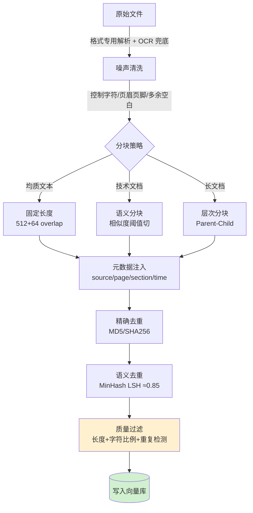

# RAG 数据清理

> **定位**：RAG 质量的天花板在数据，检索再好也救不了噪声文档。本篇聚焦数据清理全链路：从原始文件抽取、分块、元数据注入、去重，到质量过滤，每环节说清楚"是什么 → 怎么做 → 为什么这么做 → 为什么别的不行 → 沉淀结论"。

::: tip 🧠 一句话记忆锚点
**RAG 质量的天花板在数据，不在模型：干净数据能把 Recall@10 从 60% 拉到 85%。链路记五步——格式专用抽取(+OCR 兜底) → 分块(chunk_size + overlap 是最高杠杆超参) → 元数据注入(溯源/权限/时效) → 两阶段去重(精确 MD5 + 语义 MinHash) → 质量门禁(垃圾进垃圾出)。**
:::

---

## 1. 场景问题

**你在做什么**：把企业内部文档（PDF、Word、网页、数据库 FAQ 表）接入 RAG，供 LLM 问答。

**典型痛点**：

| 症状 | 根因 |
|------|------|
| LLM 答非所问 | chunk 里夹杂页眉/水印/乱码，信噪比低 |
| 相同内容被检索两次 | 文档多版本共存，语义重复 |
| 长 chunk 超上下文窗口 | 分块策略粗暴（整段塞进去） |
| 检索命中但 LLM 无法定位 | 缺少元数据（来源、时间、章节） |
| 低质量文档拉低 Recall | 没有质量门禁，垃圾进垃圾出 |

---

## 2. 实现方案

### 2.1 原始文件抽取

不同格式用对应工具，统一输出 `{ text, metadata }` 结构：

```python
# PDF
import fitz  # PyMuPDF
def extract_pdf(path: str) -> list[dict]:
    doc = fitz.open(path)
    pages = []
    for i, page in enumerate(doc):
        text = page.get_text("text")          # 优先 text 层
        if len(text.strip()) < 50:            # 疑似扫描件
            text = page.get_text("blocks")    # fallback 块模式
        pages.append({
            "text": clean_noise(text),
            "meta": {"source": path, "page": i + 1}
        })
    return pages

# HTML（网页）
from trafilatura import extract
def extract_html(html: str, url: str) -> dict:
    text = extract(html, include_tables=True, no_fallback=False)
    return {"text": text or "", "meta": {"source": url}}

# Excel / CSV
import pandas as pd
def extract_table(path: str) -> list[dict]:
    df = pd.read_excel(path)  # 或 read_csv
    rows = []
    for _, row in df.iterrows():
        rows.append({
            "text": " | ".join(f"{k}: {v}" for k, v in row.items() if pd.notna(v)),
            "meta": {"source": path, "row": _}
        })
    return rows
```

**噪声清洗** `clean_noise`：

```python
import re
def clean_noise(text: str) -> str:
    text = re.sub(r'\f', '\n', text)                    # 换页符
    text = re.sub(r'[\x00-\x08\x0b-\x0c\x0e-\x1f]', '', text)  # 控制字符
    text = re.sub(r'第 \d+ 页.*?共 \d+ 页', '', text)   # 页眉/页脚
    text = re.sub(r'[ \t]{3,}', ' ', text)              # 多余空白
    text = re.sub(r'\n{3,}', '\n\n', text)              # 多余空行
    return text.strip()
```

---

### 2.2 分块策略（Chunking）

三种主流策略，按场景选：

下图直观展示**为什么要 overlap**：滑动窗口逐块右移，若无重叠，跨块的实体/数字/句子会被硬切断；相邻块保留一段 overlap（高亮区），就把"骑在边界上"的语义缝合回来。

<svg viewBox="0 0 660 210" width="100%" style="max-width:660px;height:auto" role="img" aria-label="分块 overlap：滑动窗口右移，相邻块保留重叠区避免语义被切断">
  <!-- long document bar -->
  <text x="20" y="28" font-size="11" fill="currentColor">原始长文本</text>
  <rect x="20" y="36" width="620" height="26" rx="4" fill="#1e293b" stroke="#475569"/>
  <text x="30" y="54" font-size="11" fill="#94a3b8">……上下文连续的文本流，实体与数字可能骑在任意边界上……</text>

  <!-- sliding window -->
  <rect y="34" width="200" height="30" rx="4" fill="#7c3aed" fill-opacity="0.35" stroke="#a78bfa">
    <animate attributeName="x" values="20;250;420" dur="6s" repeatCount="indefinite"/>
  </rect>

  <!-- resulting chunks with overlap -->
  <text x="20" y="104" font-size="11" fill="currentColor">切出的块（相邻块 overlap 高亮）</text>
  <g font-size="11" fill="#e2e8f0">
    <rect x="20"  y="116" width="220" height="30" rx="4" fill="#334155"/><text x="30" y="135">chunk A（512 token）</text>
    <rect x="210" y="150" width="220" height="30" rx="4" fill="#334155"/><text x="220" y="169">chunk B</text>
    <rect x="400" y="116" width="220" height="30" rx="4" fill="#334155"/><text x="410" y="135">chunk C</text>
  </g>
  <!-- overlap regions -->
  <rect x="210" y="116" width="30" height="30" fill="#16a34a" fill-opacity="0.6"><animate attributeName="fill-opacity" values="0.2;0.75;0.2" dur="3s" repeatCount="indefinite"/></rect>
  <rect x="400" y="150" width="30" height="30" fill="#16a34a" fill-opacity="0.6"><animate attributeName="fill-opacity" values="0.2;0.75;0.2" dur="3s" begin="1s" repeatCount="indefinite"/></rect>
  <text x="470" y="200" font-size="11" fill="currentColor">绿色 = overlap，缝合被边界切断的语义</text>
</svg>

#### a) 固定长度分块

```python
from langchain.text_splitter import RecursiveCharacterTextSplitter

splitter = RecursiveCharacterTextSplitter(
    chunk_size=512,       # token 数（用 tiktoken 计算）
    chunk_overlap=64,     # 重叠防止语义断裂
    separators=["\n\n", "\n", "。", "；", " "],  # 优先按自然段
)
chunks = splitter.split_text(text)
```

适用：均质文本（新闻、日志）、快速上线。

#### b) 语义分块（Semantic Chunking）

```python
from sentence_transformers import SentenceTransformer
import numpy as np

model = SentenceTransformer("BAAI/bge-small-zh-v1.5")

def semantic_chunk(sentences: list[str], threshold: float = 0.8) -> list[str]:
    embs = model.encode(sentences, normalize_embeddings=True)
    chunks, cur = [], [sentences[0]]
    for i in range(1, len(sentences)):
        sim = float(np.dot(embs[i-1], embs[i]))
        if sim < threshold:       # 语义跳跃 → 切块
            chunks.append("".join(cur))
            cur = []
        cur.append(sentences[i])
    if cur:
        chunks.append("".join(cur))
    return chunks
```

适用：技术文档、长篇论文，语义连贯性要求高。

#### c) 层次分块（Hierarchical / Parent-Child）

```
文档
├── 章节（parent chunk，存入向量库做粗排）
│   ├── 段落（child chunk，存入向量库做精排）
│   └── ...
```

检索时：命中 child → 返回 parent 给 LLM，保留上下文完整性。

```python
# 伪代码
parent_chunks = split_by_heading(doc)  # 按 H2/H3 切
for p in parent_chunks:
    child_chunks = fixed_split(p, size=256, overlap=32)
    for c in child_chunks:
        c["parent_id"] = p["id"]       # 关联回 parent
```

---

### 2.3 元数据注入

每个 chunk 必须带元数据，供过滤和引用：

```python
chunk_doc = {
    "id": sha256(text + source),       # 全局唯一 ID
    "text": chunk_text,
    "metadata": {
        "source": "docs/faq.pdf",
        "page": 3,
        "section": "安装指南",
        "created_at": "2024-06-01",
        "doc_type": "pdf",             # 供检索时 filter
        "language": "zh",
    }
}
```

向量库（Weaviate / Qdrant / Milvus）支持 metadata filter，检索时可以：

```python
results = collection.query(
    vector=query_emb,
    filter={"doc_type": "pdf", "created_at": {"gte": "2024-01-01"}},
    limit=5
)
```

---

### 2.4 去重

#### 精确去重（MD5/SHA256）

```python
import hashlib, redis

r = redis.Redis()
def dedup_exact(text: str) -> bool:
    h = hashlib.md5(text.encode()).hexdigest()
    if r.sismember("seen_hashes", h):
        return True   # 重复
    r.sadd("seen_hashes", h)
    return False
```

#### 语义去重（MinHash LSH）

```python
from datasketch import MinHash, MinHashLSH

lsh = MinHashLSH(threshold=0.85, num_perm=128)

def get_minhash(text: str) -> MinHash:
    m = MinHash(num_perm=128)
    for word in text.split():
        m.update(word.encode())
    return m

def dedup_semantic(doc_id: str, text: str) -> bool:
    m = get_minhash(text)
    result = lsh.query(m)
    if result:
        return True   # 近似重复
    lsh.insert(doc_id, m)
    return False
```

---

### 2.5 质量过滤

```python
def quality_filter(chunk: dict) -> bool:
    text = chunk["text"]
    # 1. 长度过滤
    if len(text) < 50 or len(text) > 2000:
        return False
    # 2. 中文字符比例（防止乱码/纯英文/代码块混入正文）
    zh_ratio = sum(1 for c in text if '\u4e00' <= c <= '\u9fff') / len(text)
    if zh_ratio < 0.1:
        return False
    # 3. 重复字符检测（如 "。。。。。。"）
    if max(text.count(c) for c in set(text)) / len(text) > 0.3:
        return False
    # 4. 困惑度过滤（可选，用小型 LM 打分）
    # ppl = compute_perplexity(text)
    # if ppl > 500: return False
    return True
```

---

## 3. 为什么这么做

| 决策 | 理由 |
|------|------|
| 格式专用抽取器 | 通用正则无法处理 PDF 跨列、表格合并单元格、Word 样式 |
| 512 token + 64 overlap | 主流 Embedding 模型（BGE/OpenAI）训练长度，overlap 防止关键词被截断 |
| 层次分块 | LLM 需要完整上下文；子块提高检索精度，父块保证生成质量 |
| 元数据 filter | 多租户/多版本场景，纯向量检索无法做权限隔离和时效控制 |
| MinHash 语义去重 | 文档改版后旧版本大量相似块会稀释检索结果，导致 LLM 看到"过时答案" |
| 长度+字符质量门 | 极短 chunk 信息量不足，极长 chunk 超上下文；乱码污染 Embedding 空间 |

---

## 4. 为什么别的选择不行

### 4.1 "直接用 pdfplumber 全部提取" → 扫描件全军覆没

pdfplumber 依赖 PDF 文字层，扫描件返回空字符串。需要 OCR（PaddleOCR / Tesseract）兜底。

### 4.2 "固定长度 2048 token 大块" → 检索噪声暴增

大块召回时不相关内容多，LLM 上下文窗口浪费；且 Recall 提升有限（相关句被淹没）。

### 4.3 "不做 overlap" → 实体/数字被截断

"CPU 使用率达到 98%" 如果 "98%" 在上一块末尾而"告警阈值"在下一块开头，两块单独检索都无意义。

### 4.4 "只做精确去重" → 改版文档漏网

文档从"v1.0 支持 MySQL 5.7" 改成 "v2.0 支持 MySQL 8.0"，MD5 完全不同，但 90% 内容重复，两版本同时存在会让 LLM 给出矛盾答案。

### 4.5 "不加元数据" → 无法溯源、无法审计

LLM 生成答案后用户追问"出自哪里"时，无法提供引用；合规场景（金融/医疗）要求文档来源可审计。

---

## 5. 沉淀结论



**核心结论**：

1. **数据质量 > 模型选型**：同样的 Embedding 模型，干净数据 Recall@10 能从 60% 提到 85%。
2. **分块是 RAG 最高杠杆点**：chunk_size 和 overlap 是最值得 A/B 测试的超参数。
3. **元数据是 RAG 的"索引"**：向量检索解决语义相关，元数据 filter 解决权限/时效/来源约束。
4. **去重要两阶段**：精确去重 O(1) 拦截副本，语义去重拦截改版近似文档。
5. **质量门是保险丝**：宁可漏掉 5% 的边界文档，也不让噪声文档污染整个知识库。

## 6. 面试常见问题清单（按主题分类）

**抽取与分块**
- **Q：为什么不能 pdfplumber 一把梭全抽？** A：扫描件是图片、无文本层，会全军覆没；要按格式选解析器 + OCR 兜底。
- **Q：chunk_size 怎么定？为什么要 overlap？** A：太大噪声多、稀释检索；太小语义不完整。overlap（如 64 token）把骑在边界上的实体/数字/句子缝回来，防止被硬切断。
- **Q：固定 / 语义 / 层次分块怎么选？** A：均质文本用固定长度；技术文档用语义分块（相似度阈值切）；长文档用层次分块（Parent-Child，检索子块、喂父块）。

**去重与质量**
- **Q：为什么只做精确去重不够？** A：精确 hash 只拦完全相同的副本；改版/微调文档语义重复但字节不同，要靠语义去重（MinHash LSH / 向量聚类，阈值 ~0.85）。
- **Q：不加元数据会怎样？** A：无法溯源、无法做权限/时效/来源过滤，也无法审计"答案出自哪篇哪页"。
- **Q：质量门禁卡什么？** A：长度下限、可打印字符比例、重复率、语言判定——垃圾进垃圾出，宁缺毋滥。

**总纲**
- **Q：RAG 效果不好，先调模型还是先洗数据？** A：先洗数据——数据质量 > 模型选型，同一 Embedding 下干净数据可把 Recall@10 从 60% 提到 85%；分块是最高杠杆超参。
