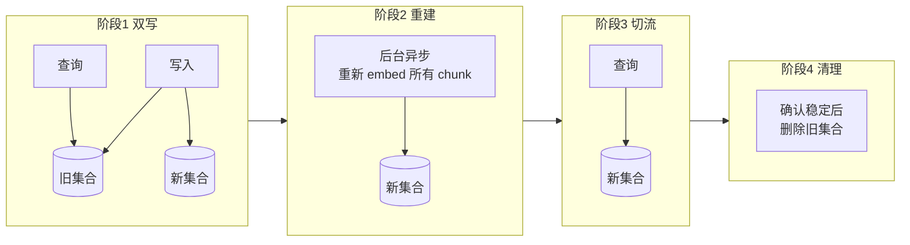
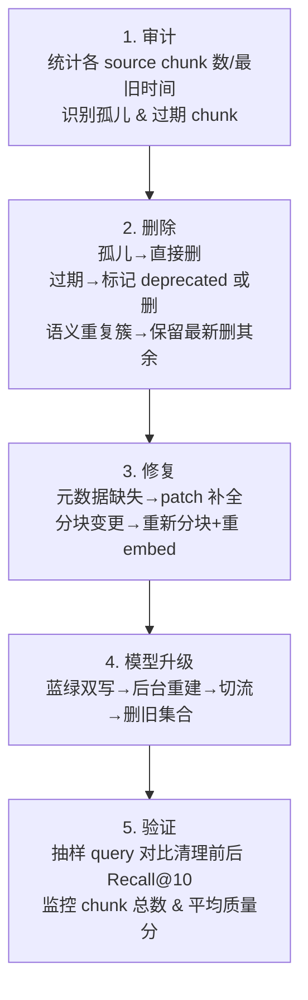

# RAG 存量数据清理

> **定位**：新增数据走"增量清理流水线"，已入库的旧数据才是真正的历史包袱。本篇专注**存量治理**：如何在不停服的前提下，对向量库中已有的 chunk 做审计、修复、淘汰和版本迁移。五段式：场景 → 方案 → 为什么 → 为什么别的不行 → 沉淀结论。

::: tip 🧠 一句话记忆锚点
**存量治理不能停服全量重建，铁律是"审计先行 + 增量操作 + 删前留证 + 用 Recall 度量"。四板斧：审计(scroll 找孤儿/过期) → 去重(DBSCAN 语义聚类保新删旧) → 修复(patch 元数据/重 embed) → 升级(Embedding 换代走蓝绿双写→后台重建→切流→删旧)。**
:::

---

## 1. 场景问题

### 典型触发场景

| 触发事件 | 症状 |
|----------|------|
| 业务文档迭代（产品改版、政策更新） | LLM 给出"过时答案"，新旧版本矛盾 |
| 早期接入时未做清洗直接灌库 | 向量空间被噪声污染，召回质量持续下降 |
| Embedding 模型升级 | 旧向量与新查询向量分布不一致，相似度虚高/虚低 |
| 知识库规模膨胀 | 存储成本飙升，大量无效 chunk 占用索引空间 |
| 数据合规/权限变更 | 部分文档需要下线（隐私、保密级别变化） |

### 核心难点

1. **无法停服全量重建**：业务 7×24 在线，不能直接清空重灌
2. **不知道哪些脏**：没有数据血缘，无法精确定位问题 chunk
3. **向量不可读**：float 向量不像文本，无法人工 review
4. **大规模操作风险**：误删会导致召回率骤降

---

## 2. 实现方案

### 2.1 存量审计：摸清家底

**第一步：元数据统计**

```python
from qdrant_client import QdrantClient

client = QdrantClient(host="localhost", port=6333)

# 统计各来源文档的 chunk 数量和时间分布
def audit_metadata(collection: str):
    result = {}
    offset = None
    while True:
        points, offset = client.scroll(
            collection_name=collection,
            scroll_filter=None,
            limit=1000,
            offset=offset,
            with_payload=True,
            with_vectors=False,   # 只读元数据，省内存
        )
        for p in points:
            src = p.payload.get("source", "unknown")
            ts  = p.payload.get("created_at", "")
            result.setdefault(src, {"count": 0, "oldest": ts})
            result[src]["count"] += 1
            if ts < result[src]["oldest"]:
                result[src]["oldest"] = ts
        if offset is None:
            break
    return result
```

**第二步：识别孤儿 chunk（原文档已删除）**

```python
import os

def find_orphan_chunks(audit: dict, doc_root: str) -> list[str]:
    """返回源文件已不存在的 source 列表"""
    orphans = []
    for src in audit:
        if src.startswith("http"):
            continue  # URL 类另行处理
        if not os.path.exists(os.path.join(doc_root, src)):
            orphans.append(src)
    return orphans
```

**第三步：检测过期文档（超过 TTL 或有新版本）**

```python
from datetime import datetime, timedelta

def find_stale_chunks(audit: dict, ttl_days: int = 180) -> list[str]:
    cutoff = datetime.now() - timedelta(days=ttl_days)
    stale = []
    for src, info in audit.items():
        try:
            ts = datetime.fromisoformat(info["oldest"])
            if ts < cutoff:
                stale.append(src)
        except Exception:
            pass
    return stale
```

---

### 2.2 存量去重：清除语义重复

存量去重比增量去重更复杂：需要在**已有向量**间做近似最近邻（ANN）搜索，聚合相似簇，再决策保留哪一个。

```python
import numpy as np
from sklearn.cluster import DBSCAN

def dedup_by_vector(collection: str, eps: float = 0.08, min_samples: int = 2):
    """
    DBSCAN 聚类：同一簇内的 chunk 语义高度相似 → 保留最新/最长，删其余。
    eps 对应余弦距离阈值（0.08 ≈ 余弦相似度 0.92）
    """
    # 1. 批量拉取所有向量
    points, _ = client.scroll(collection, limit=10000, with_vectors=True)
    ids    = [p.id for p in points]
    vecs   = np.array([p.vector for p in points])
    metas  = [p.payload for p in points]

    # 2. 余弦距离矩阵（大规模用 FAISS 替代）
    norms  = np.linalg.norm(vecs, axis=1, keepdims=True)
    normed = vecs / (norms + 1e-9)
    dist   = 1 - normed @ normed.T   # 余弦距离

    # 3. DBSCAN 聚类
    labels = DBSCAN(eps=eps, min_samples=min_samples, metric="precomputed").fit_predict(dist)

    # 4. 每个簇保留最新的 chunk，其余标记删除
    to_delete = []
    for cluster_id in set(labels):
        if cluster_id == -1:
            continue  # 噪声点（唯一 chunk），保留
        cluster_idx = [i for i, l in enumerate(labels) if l == cluster_id]
        # 按 created_at 降序，保留最新
        cluster_idx.sort(
            key=lambda i: metas[i].get("created_at", ""),
            reverse=True
        )
        to_delete.extend(ids[i] for i in cluster_idx[1:])  # 保留第一个

    return to_delete

# 执行删除（分批，避免大事务）
def batch_delete(collection: str, ids: list, batch_size: int = 200):
    for i in range(0, len(ids), batch_size):
        client.delete(
            collection_name=collection,
            points_selector=ids[i:i+batch_size],
        )
        print(f"deleted {min(i+batch_size, len(ids))}/{len(ids)}")
```

---

### 2.3 版本迁移：Embedding 模型升级

Embedding 模型升级后旧向量必须重建，否则 query 向量与 doc 向量分布不同，相似度失真。

**蓝绿双写策略（不停服）**：



```python
import asyncio
from sentence_transformers import SentenceTransformer

new_model = SentenceTransformer("BAAI/bge-large-zh-v1.5")  # 新模型

async def rebuild_collection(old_col: str, new_col: str, batch_size: int = 64):
    """异步批量重建，后台运行，不影响线上查询"""
    # 先建新集合（新向量维度可能不同）
    client.recreate_collection(
        collection_name=new_col,
        vectors_config={"size": 1024, "distance": "Cosine"},
    )
    offset = None
    total = 0
    while True:
        points, offset = client.scroll(
            collection_name=old_col,
            limit=batch_size,
            offset=offset,
            with_payload=True,
            with_vectors=False,   # 拿文本重 embed，不复用旧向量
        )
        if not points:
            break
        texts  = [p.payload["text"] for p in points]
        new_vecs = new_model.encode(texts, normalize_embeddings=True).tolist()
        client.upsert(
            collection_name=new_col,
            points=[
                {"id": p.id, "vector": v, "payload": p.payload}
                for p, v in zip(points, new_vecs)
            ]
        )
        total += len(points)
        print(f"rebuilt {total} chunks...")
        await asyncio.sleep(0.01)  # 让出 IO，避免打满 CPU
        if offset is None:
            break
    print(f"✅ rebuild done: {total} chunks → {new_col}")
```

---

### 2.4 在线修复：patch 元数据 / 修正文本

有时只需修正 chunk 的元数据或文本内容，不需要重新 embed：

```python
# 批量给某 source 的所有 chunk 打上新字段
def patch_metadata(collection: str, source: str, patch: dict):
    from qdrant_client.models import Filter, FieldCondition, MatchValue, SetPayload

    client.set_payload(
        collection_name=collection,
        payload=patch,
        points=Filter(
            must=[FieldCondition(key="source", match=MatchValue(value=source))]
        ),
    )

# 示例：给旧文档标记为 deprecated
patch_metadata(
    "knowledge_base",
    source="docs/old-api-v1.pdf",
    patch={"status": "deprecated", "deprecated_at": "2025-06-01"},
)
```

---

### 2.5 完整治理流程



---

## 3. 为什么这么做

| 决策 | 理由 |
|------|------|
| 不停服审计（scroll 分页） | 向量库无法像 DB 一样全量 dump，分批 scroll 是唯一安全方式 |
| DBSCAN 做语义去重 | 存量去重无法预知簇边界，DBSCAN 不需要预设 K，自动发现密集簇 |
| 蓝绿双写升级 | 向量维度变化后就地修改不可行；双写保证查询不中断 |
| 保留最新版本 chunk | 相似簇中时间最新的通常是最准确的版本 |
| 分批删除 | 单次大批量删除会触发向量库 compaction 阻塞查询 |

---

## 4. 为什么别的选择不行

### 4.1 "全量清空重建" → 服务中断 + 成本不可接受

对于百万级 chunk，重 embed 需数小时，期间 RAG 完全不可用。业务无法接受。

### 4.2 "只删孤儿，不处理语义重复" → 召回质量持续下降

文档改版不会删旧文件，只会新增文件。不做语义去重，新旧版本同时存在，LLM 会给出矛盾答案。

### 4.3 "直接复制旧向量到新集合（不重 embed）" → 向量分布失真

不同 Embedding 模型的向量空间完全不同，直接复用旧向量做相似度计算结果无意义。

### 4.4 "用精确文本 hash 去重代替 DBSCAN" → 漏掉改版文档

内容从"支持 iOS 14" 改为"支持 iOS 17"，hash 完全不同，但 95% 内容重复，两个版本同时存在会误导 LLM。

### 4.5 "人工审核每个 chunk" → 不可扩展

百万级 chunk，人工审核成本 O(n)，不现实。需要自动化 pipeline + 人工抽样验收。

---

## 5. 沉淀结论

**存量治理四板斧**：

| 阶段 | 动作 | 工具 |
|------|------|------|
| 审计 | scroll 统计 + 孤儿/过期识别 | Qdrant scroll API |
| 去重 | DBSCAN 语义聚类 → 保新删旧 | sklearn + 向量批量拉取 |
| 修复 | patch 元数据 / 重分块重 embed | set_payload + upsert |
| 升级 | 蓝绿双写 → 后台重建 → 切流量 | 双集合 + 异步重建 |

**核心原则**：

1. **审计先行**：不知道脏在哪，不要随意删
2. **增量而非全量**：以 source 为单位操作，最小化影响范围
3. **删前留证**：记录删除的 chunk ID 和原因，方便回溯
4. **用 Recall 度量**：清理效果必须用 query 集合的 Recall@10 验证，而不是靠"感觉"
5. **定期治理**：建立周/月级别的存量审计 cron，而非一次性清理

```
建议治理频率：
  孤儿 chunk → 每次文档删除时实时清理
  过期 chunk → 每月扫描一次
  语义去重   → 季度一次（成本高）
  模型升级   → 按需，蓝绿迁移
```

## 6. 面试常见问题清单（按主题分类）

**为什么不能简单粗暴**
- **Q：为什么不全量清空重建？** A：业务 7×24 在线，清空重灌会服务中断 + 重 embed 百万 chunk 成本不可接受；要不停服、增量治理。
- **Q：向量不可读，怎么知道哪些脏？** A：靠审计——scroll 全量扫元数据统计来源/时间分布，识别孤儿（源文档已删）、过期、异常长度 chunk；没有血缘就先补元数据。

**去重与迁移**
- **Q：存量去重为什么用 DBSCAN 而非文本 hash？** A：文本 hash 只拦字节相同的副本；改版文档语义重复但文本不同，需按向量做密度聚类（DBSCAN，eps≈0.15），同簇保最新删旧。
- **Q：Embedding 模型升级，旧向量能直接复制到新集合吗？** A：不能——新旧模型向量空间不一致，query 与 doc 分布不匹配会相似度失真；必须重新 embed。用**蓝绿双写**：双写→后台异步重建新集合→切查询流量→确认稳定删旧集合，全程不停服。

**安全与度量**
- **Q：大规模删除怎么防误删？** A：以 source 为单位增量操作、分批小事务；删前记录 chunk ID + 原因可回溯；灰度 + 抽样验收。
- **Q：清理效果怎么衡量？** A：用固定 query 集合的 **Recall@10** 前后对比，而不是靠"感觉数字好看"。

延伸阅读：[RAG 数据清理](/ai-llm/rag-data-cleaning.md) · [RAG 检索增强生成](/ai-llm/rag.md) · [RAG 上下文剪枝](/ai-llm/rag-context-pruning.md)
