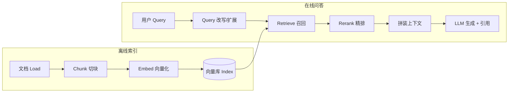
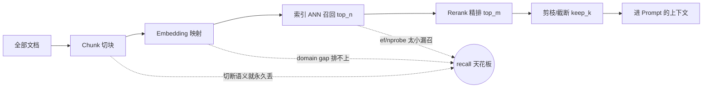

# RAG 检索增强生成

> 动机与取舍 · 标准链路 · Chunking · 向量索引 · 混合检索 · Rerank · Query 改写 · 评测 · 常见坑

## 场景问题

### 为什么需要 RAG，而不是直接问模型 / 直接微调？

场景：给企业内部知识库/产品文档做问答机器人。直接问通用大模型会遇到三座大山：

- **幻觉**：不知道就编，且编得一本正经。
- **知识时效**：模型训练有 cutoff，新文档/最新政策它不知道。
- **私域知识**：内部文档从没进过训练集。

两条路：**微调** vs **RAG**。

| 维度 | 微调 (Fine-tune) | RAG |
| --- | --- | --- |
| 加**事实知识** | 慢、贵、易遗忘、难更新 | ✅ 改库即更新，实时 |
| 改**风格/格式/能力** | ✅ 擅长 | 一般 |
| 知识更新成本 | 重新训练 | 改向量库，秒级 |
| 可解释/可溯源 | 黑盒 | ✅ 能给出引用来源 |
| 数据隐私 | 数据进权重 | 数据留在库里，按需检索 |

**结论**：加知识、要时效、要溯源 → RAG；改行为/风格 → 微调；二者常**组合使用**。

### RAG 标准链路



一句话：**离线把文档切块、向量化、灌进向量库；在线把用户问题向量化去召回最相关的块，塞进 prompt 让模型"看着资料回答"。**

## 实现方案

### Chunking：切块策略决定召回上限

切得太大 → 一个块混多主题，向量语义模糊、召回不准、还占 context；切得太小 → 语义被切断、上下文不完整。主流做法：

- **定长 + 重叠（overlap）**：如每块 512 token、重叠 50，避免在句中硬切、保留跨块连续性。
- **按结构切**：按 Markdown 标题 / 段落 / 代码块 边界，保持语义完整（推荐）。
- **按语义切（Semantic Chunking）**：用 embedding 相似度找"语义断点"再切。
- **父子块 / 小块召回大块（Small-to-Big）**：用小块做精准召回，喂给模型时补上其所在的大块上下文。

```python
def chunk_by_paragraph(text, count, max_tokens=512, overlap=50):
    # count(list)->token 数；优先按段落边界切，超长再定长切，块间保留 overlap 防止语义断裂
    chunks, buf = [], []
    for para in text.split("\n\n"):
        if count(buf) + count([para]) > max_tokens and buf:
            chunks.append("\n\n".join(buf))
            buf = buf[-overlap:] if overlap else []   # 滑动重叠
        buf.append(para)
    if buf:
        chunks.append("\n\n".join(buf))
    return chunks
```

### Embedding 与相似度

- 用 embedding 模型（如 bge、gte、text-embedding-3、Cohere embed）把文本映射到稠密向量。
- 相似度：**cosine**（最常用，对模长不敏感）或 **dot product**（需向量归一化后与 cosine 等价）。
- 关键坑：**query 和 document 要用同一个模型、同一归一化方式**；embedding 与业务语料存在 **domain gap** 时，通用模型召回会明显变差，需选领域模型或微调 embedding。

### 向量索引：精度 / 内存 / 速度的三角

| 索引 | 原理 | 特点 |
| --- | --- | --- |
| **Flat（暴力）** | 逐一算相似度 | 100% 精确，慢，仅适合小库 |
| **HNSW** | 多层近邻图导航 | 高召回、快，内存占用大，主流默认 |
| **IVF-PQ** | 倒排聚类 + 乘积量化压缩 | 省内存、适合超大库，精度略降、需调 nprobe |

面试点："HNSW 和 IVF 怎么选？"——**中小库/重召回精度用 HNSW；亿级向量/省内存用 IVF-PQ**。二者都是 **ANN（近似最近邻）**，用少量召回率换巨大的速度提升。

### 混合检索（Hybrid Search）：稠密 + 稀疏

- **稠密向量**擅长语义（"如何退款" ↔ "退货流程"），但对**专有名词/型号/ID**弱。
- **稀疏检索（BM25 / 关键词）**擅长精确 term 匹配，但不懂同义/语义。
- **混合**：两路各召回一批，用 **RRF（Reciprocal Rank Fusion）** 按排名融合，取长补短。

```python
def rrf_fuse(dense_ranked, sparse_ranked, k=60):
    # RRF：每个文档得分 = Σ 1/(k + rank)，对两路排名做融合，无需分数归一化
    scores = {}
    for ranking in (dense_ranked, sparse_ranked):
        for rank, doc_id in enumerate(ranking):
            scores[doc_id] = scores.get(doc_id, 0) + 1.0 / (k + rank)
    return sorted(scores, key=scores.get, reverse=True)
```

### Rerank：召回要"广"，精排要"准"

召回（Bi-Encoder，query 和 doc 分别编码）为了速度牺牲了精度。**Rerank 用 Cross-Encoder**——把 query+doc 拼起来一起过模型算相关性，精度高但慢，所以只对召回的 top-N（如 50）精排，取 top-k（如 5）进 prompt。**"召回 recall 优先拉多，rerank 精度优先选准"**是 RAG 提效最划算的一步。

### 查询侧优化：问题本身也要"翻译"

用户的问法常和文档表述对不上，只优化索引不够：

- **Query Rewrite**：口语化/多轮指代 → 改写成完整、检索友好的查询。
- **HyDE（假设性文档）**：先让 LLM "假装"生成一段答案，用这段**答案**去检索（答案和文档在同一语义空间，比问题更接近）。
- **Multi-Query / Step-back**：把一个问题扩成多个子查询/更抽象的问题，多路召回后合并，提升覆盖。
- **Query 路由**：先分类问题该查哪个库/该不该查（闲聊就别检索）。

### 系统性提升召回率：把召回当"漏斗"看

面试高频题——"你的 RAG 召回不准，怎么提升召回率？"。零散地答"加 rerank""换 embedding"是扣分的，正确姿势是**先把召回看成一条逐层收窄的漏斗，每一层都在给最终 recall 设天花板**：



**核心心法（也是最容易被追问的一句）：下游只能"删"，不能"补"。** rerank、剪枝、重排位置都只能在**上一层已召回的候选**里做取舍——**gold chunk 一旦没进 `top_n`/`top_m`，后面再强的模型也救不回来**。所以定位召回问题要**自上而下逐层查 gold coverage**（标注集里每题的必要 chunk，在每一层的候选里还在不在），找到第一个丢它的层，只修那一层：

| 漏斗层 | 常见丢召回的原因 | 边际收益最高的动作 |
| --- | --- | --- |
| **Chunk** | 答案被切在两块交界处 | 结构化切 + overlap + **small-to-big**（小块召回、大块喂模型） |
| **Embedding** | 专业语料 domain gap，query/doc 表述错位 | 换领域模型 / **微调 embedding**；查询侧上 **HyDE / Multi-Query** 扩召回 |
| **索引 ANN** | HNSW `ef_search`、IVF `nprobe` 默认值过小，漏掉近邻 | 调大 `ef_search`/`nprobe`（用召回率换延迟）；小库直接 Flat |
| **单路检索** | 稠密漏专名、稀疏漏语义 | **混合检索 BM25 + 稠密，RRF 融合**取并集 |
| **top_n / top_m** | 候选池太窄，gold 排在第 8、9 位被截断 | **先拉大 `top_n`/`top_m`**，把 recall 顶上去，再靠 rerank/剪枝收窄 |

两个关键区分，答出来直接拉开档次：

- **两种 recall 别混**：**检索 recall**（gold 有没有进候选池，检索/rerank 层的事）vs **答案 recall / `recall@needed`**（进 prompt 的上下文够不够答对，剪枝/截断层的事）。掉的是前者 → 往上游查；掉的是后者 → 是截断策略太狠。
- **"先拉多再收窄"是最划算的顺序**：召回阶段 recall 优先（`top_n` 拉大、多路并集），精排/剪枝阶段 precision 优先（rerank + 自适应保留）。**在窄候选池上调 rerank 是本末倒置**——见 [RAG 上下文剪枝实战](/ai-llm/rag-context-pruning.md) 里"pruner 是 reranker 的放大器不是替代品"的实测证据。

::: warning 反直觉的坑
"多跳/组合型问题"上单纯调 rerank 往往无效——rerank 是**逐点打分**，看不到"这几条 chunk 拼在一起才够答"，会把其中一条挤出 `top_m`。这类问题要么**拉大候选池 + 多路召回**，要么上 **listwise 剪枝**让模型一次看完所有候选再决定保留几条。
:::

### 上下文构造：召回到了也可能答不好

- **top-k 选择**：不是越多越好——**"迷失在中间"**：模型对长上下文**首尾**信息利用好、**中间**易忽略，把最相关的放两端。
- **去重 / 压缩**：多路召回有重复，去重并可做上下文压缩，避免稀释和撑爆窗口。
- **prompt 模板**：明确"只依据给定资料回答，无依据就说不知道，并标注引用来源"——直接压制幻觉。

## 为什么这么做

### 评测：RAG 坏了要能定位是"检索"还是"生成"的锅

RAG 是两段式，评测要**分段归因**。**RAGAS** 框架的核心指标：

- **Context Precision / Recall**：召回的上下文相不相关、全不全 → **检索质量**。
- **Faithfulness（忠实度）**：答案是否**严格基于**召回上下文（越低=越幻觉）→ **生成质量**。
- **Answer Relevancy**：答案切不切题。

工程上还看：**检索命中率 / MRR / nDCG**（离线用标注集回归）、端到端人工评分、线上点赞点踩。**先看 Context Recall——检索没召回到，生成再强也白搭。**

## 为什么别的选择不行

### 检索方式对比

| 方式 | 强项 | 弱项 | 用在 |
| --- | --- | --- | --- |
| **稠密向量** | 语义相似、同义改写 | 专名/型号/精确匹配弱 | 语义问答主力 |
| **稀疏 BM25** | 精确关键词、专名、可解释 | 不懂语义/同义 | 补充精确匹配 |
| **混合 + RRF** | 兼顾语义与精确 | 系统更复杂 | 生产推荐默认 |

### RAG 十大常见坑

1. **分块切断语义**：答案跨块被切开 → 结构化切 + overlap + small-to-big。
2. **召回相似但事实相反**："支持 X" 与 "不支持 X" 语义相近被误召 → rerank + 忠实度约束。
3. **上下文过长稀释**：塞太多无关块，模型抓不住重点 → 精排 + 压缩 + 控制 top-k。
4. **迷失在中间**：关键信息放中间被忽略 → 重排位置、最相关放两端。
5. **Embedding domain gap**：通用 embedding 在专业语料召回差 → 换领域模型/微调 embedding。
6. **Query 与 doc 表述错位** → Query Rewrite / HyDE。
7. **只召回不判断该不该召回**：闲聊也硬检索 → Query 路由。
8. **不标引用/无兜底**：无依据仍强答 → prompt 强制"无依据就说不知道 + 标来源"。
9. **索引参数不调**：HNSW 的 ef、IVF 的 nprobe 默认值召回率低 → 按数据调参。
10. **不评测**：上线全靠感觉 → RAGAS + 检索命中率回归。

### 进阶范式（何时超出朴素 RAG）

- **上下文剪枝（Listwise Pruning）**：rerank 之后再插一个小 LLM，一次看完所有候选、给每条打 1–5 分，按 threshold + keep-top-K 自适应保留——比固定 top-N 截断更懂"这题该留几条"，在**多跳问题**上同时提升压缩率和 recall。完整实测见 [RAG 上下文剪枝实战](/ai-llm/rag-context-pruning.md)。
- **GraphRAG**：把知识建成实体-关系图，适合需要**多跳推理/全局归纳**的问题（朴素 top-k 召回覆盖不了"跨文档综合"）。
- **Agentic RAG**：把检索当成 Agent 的一个工具，模型自主决定**要不要查、查几次、怎么改写**，多轮迭代检索——见 [Agent 开发](/ai-llm/agent-dev.md)。

## 沉淀结论

::: tip 心法总结
**RAG = 好切块 + 好 embedding + 混合召回(广) + rerank(准) + 会构造上下文 + 抑制幻觉的 prompt + 分段评测。** 加知识/要时效/要溯源用 RAG，改风格用微调，二者可组合。定位问题先分清是**检索的锅**（Context Recall 低）还是**生成的锅**（Faithfulness 低）。
:::

延伸阅读：[大模型核心原理](/ai-llm/llm-fundamentals.md) · [推理与微调优化](/ai-llm/llm-inference-optimization.md) · [RAG 上下文剪枝实战](/ai-llm/rag-context-pruning.md) · [Agent 开发](/ai-llm/agent-dev.md)

## 内容来源

综合整理：RAG（Lewis 2020）、HyDE、RRF、RAGAS、HNSW/IVF-PQ（FAISS/Milvus 文档）、GraphRAG（微软）、LangChain/LlamaIndex 官方文档（2026-07；领域更新快，请以最新论文与官方文档为准）。
