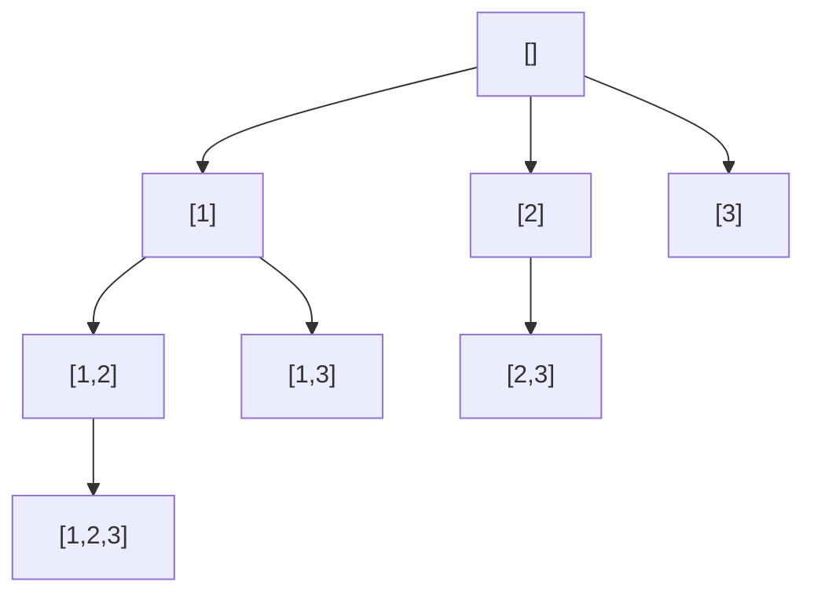

# 回溯算法

> 子集 · 组合 · 排列 · N 皇后 · 括号生成 · 剪枝——统一 C++、含递归决策树

::: tip 🧠 一句话记忆锚点
**回溯 = 在一棵"决策树"上做 DFS：进入分支前"做选择"，递归探索，返回时"撤销选择"（restore）。三件套——路径 path、选择列表、结束条件。模板永远是 `选择→递归→撤销`。剪枝是回溯的灵魂：越早砍掉不可能的分支，越快。排列用 used 数组、组合/子集用 start 下标去重。**
:::

## 场景问题

"列出所有可能的解"——排列、组合、子集、切割、棋盘放置——本质是在一棵**决策树**上穷举，但用递归 + 回退避免真的建出整棵树。复杂度天然是指数级（子集 2ⁿ、排列 n!），所以**数据范围小**（n ≤ ~20）时才用，且**剪枝**决定实际能否跑得动。

回溯 = DFS + 状态回退。和普通 DFS 的区别就在于**递归返回时要撤销本层的选择**，让上层能尝试别的分支。

## 实现方案

### 通用模板

```cpp
void backtrack(路径& path, 选择列表& choices) {
    if (满足结束条件) { 收集(path); return; }
    for (auto& choice : choices) {
        if (需要剪枝(choice)) continue;   // 提前砍掉非法/重复分支
        path.push_back(choice);           // 做选择
        backtrack(path, 更新后的choices);  // 递归进入下一层
        path.pop_back();                  // 撤销选择（回溯）
    }
}
```

### 决策树长什么样（子集 [1,2,3]）

回溯就是遍历这棵树，**每个节点都是一个子集**（收集所有节点即全部子集）；用 `start` 下标保证只往后选、不重复：



### 子集 / 组合（用 start 下标去重）

```cpp
// 全部子集
void subsets(const std::vector<int>& nums, int start,
             std::vector<int>& path, std::vector<std::vector<int>>& res) {
    res.push_back(path);                          // 每个节点都是一个子集
    for (int i = start; i < (int)nums.size(); i++) {
        path.push_back(nums[i]);
        subsets(nums, i + 1, path, res);          // i+1：只往后选，避免 [1,2] 与 [2,1] 重复
        path.pop_back();
    }
}

// 组合总和 k 个数（组合 = 固定长度的子集）：path.size()==k 时收集
```

### 全排列（用 used 标记）

```cpp
void permute(std::vector<int>& nums, std::vector<bool>& used,
             std::vector<int>& path, std::vector<std::vector<int>>& res) {
    if (path.size() == nums.size()) { res.push_back(path); return; }
    for (int i = 0; i < (int)nums.size(); i++) {
        if (used[i]) continue;                    // 排列关心顺序，用 used 而非 start
        used[i] = true;  path.push_back(nums[i]);
        permute(nums, used, path, res);
        path.pop_back(); used[i] = false;         // 撤销
    }
}
// 含重复元素去重：先排序，同层跳过 nums[i]==nums[i-1] && !used[i-1]
```

### 括号生成（用约束剪枝）

```cpp
void genParens(int open, int close, int n, std::string& cur, std::vector<std::string>& res) {
    if ((int)cur.size() == 2 * n) { res.push_back(cur); return; }
    if (open < n)     { cur.push_back('('); genParens(open + 1, close, n, cur, res); cur.pop_back(); }
    if (close < open) { cur.push_back(')'); genParens(open, close + 1, n, cur, res); cur.pop_back(); }
    // 剪枝：右括号数不能超过左括号数；左括号不超过 n
}
```

### N 皇后（经典剪枝）

```cpp
bool ok(std::vector<int>& col, int r, int c) {
    for (int i = 0; i < r; i++)
        if (col[i] == c || abs(col[i] - c) == abs(i - r)) return false;  // 同列 or 同对角线
    return true;
}
void nQueens(int r, int n, std::vector<int>& col, int& count) {
    if (r == n) { count++; return; }              // 每行放一个，放满即一解
    for (int c = 0; c < n; c++) {
        if (!ok(col, r, c)) continue;             // 剪枝：冲突的列直接跳过
        col[r] = c;
        nQueens(r + 1, n, col, count);
        // col[r] 会在下次循环被覆盖，无需显式撤销
    }
}
```

## 为什么这么做

- **为什么要"撤销选择"**：`path` 是所有分支共享的状态，探索完一个分支必须还原，否则会污染兄弟分支。这是回溯区别于普通枚举的核心。
- **组合用 start、排列用 used**：组合/子集不关心顺序，`start` 保证只向后选 → 天然不重复；排列关心顺序，任意未用元素都可选 → 用 `used` 标记。
- **剪枝的价值**：N 皇后不剪枝是 nⁿ，加"同列/同对角线"约束后只探索合法分支，指数底数大幅下降；括号生成靠 `close<open` 直接砍掉非法子树。

## 为什么别的选择不行

- **BFS / 迭代枚举**：状态是"部分解 + 剩余选择"，DFS 递归天然携带路径栈，回退是 O(1) 的 pop；BFS 要显式存每个部分解，空间爆炸。
- **不剪枝的纯枚举**：合法解占比极低时浪费在无效分支上（N 皇后、数独），必须在生成中途剪枝。
- **动态规划**：当子问题**不重叠**、要的是"枚举所有具体解"而非"最优值/计数"时，DP 无从下手，回溯才对口（反之若只要计数/最优且子问题重叠，用 DP）。

## 沉淀结论

::: tip 速记
- 模板：`结束收集 → for 选择 { 剪枝continue; 做选择; 递归; 撤销 }`
- 子集/组合用 `start` 下标；排列用 `used` 数组；含重复先排序 + 同层去重
- 剪枝越早越好；数据范围 n≤~20 才考虑回溯（指数复杂度）
:::

### 面试高频题清单

- **Q：回溯和 DFS 的区别？** A：回溯是"带撤销的 DFS"——递归返回时还原状态，以便复用同一份 path 探索其他分支。
- **Q：子集、组合、排列的模板差异？** A：子集每个节点都收集；组合是固定长度子集；三者去重手段不同（start vs used）。
- **Q：如何对含重复元素去重？** A：先排序，同一层若 `nums[i]==nums[i-1]` 且前一个未被使用则跳过（避免同层重复选相同值）。
- **Q：N 皇后怎么剪枝？** A：逐行放置，检查同列与两条对角线冲突（`abs(col差)==abs(行差)`），冲突分支直接跳过。
- **Q：回溯的时间复杂度怎么估？** A：≈ 决策树节点数 × 每节点工作量；子集 O(n·2ⁿ)、排列 O(n·n!)，剪枝改变实际访问的节点数。
- **Q：什么时候该用记忆化把回溯变 DP？** A：子问题重叠且只求最优/计数时（如"分割回文串最少次数"），给状态加缓存即记忆化搜索。

### 记忆口诀

- **三件套**：路径 path / 选择列表 / 结束条件
- **模板**：做选择 / 递归 / 撤销（`push → backtrack → pop`）
- **去重**：组合子集用 start / 排列用 used / 含重先排序再同层跳过
- **剪枝**：越早越好 / n≤20才用 / 指数复杂度（子集2ⁿ、排列n!）

## 内容来源

综合整理自高频面试题型（LeetCode 回溯标签）与《算法导论》；代码为教学示意的 C++ 实现。

## 自测：合上资料能说清楚吗？

1. 回溯的通用模板由哪几步构成？为什么"撤销选择"是它区别于普通枚举的核心？

<details><summary>参考答案</summary>

结束条件收集 → for 遍历选择 → **剪枝** continue → **做选择** → 递归 → **撤销**。因 path 是所有分支**共享状态**，探索完必须还原，否则**污染兄弟分支**。

</details>

2. 生成子集/组合时用 `start` 下标，生成排列时用 `used` 数组——为什么两者的去重手段不同？

<details><summary>参考答案</summary>

组合/子集**不关心顺序**，start 保证只向后选，天然避免 [1,2] 与 [2,1] 重复；排列**关心顺序**，任意未用元素都可选，故用 **used** 标记已选。

</details>

3. 含重复元素时如何在同一层去重？

<details><summary>参考答案</summary>

先**排序**，同层遍历时若 `nums[i]==nums[i-1]` 且**前一个未被使用**（`!used[i-1]`）则跳过，避免同层重复选相同值。

</details>

4. 括号生成与 N 皇后都靠剪枝，二者剪枝方式有何不同？

<details><summary>参考答案</summary>

括号生成用**约束剪枝**：`open<n` 才加左、`close<open` 才加右，直接砍非法子树。N 皇后用**冲突检测**：同列或 `abs(列差)==abs(行差)`（对角线）冲突则跳过该列。前者是生成规则，后者是状态校验。

</details>

5. 什么情况下该把回溯换成动态规划或记忆化搜索？

<details><summary>参考答案</summary>

当子问题**重叠**且只求**最优值/计数**（非枚举全部具体解）时用 DP；若仍需递归结构但状态重复，给状态**加缓存**即记忆化搜索。子问题不重叠、要列全部解才用纯回溯。

</details>
