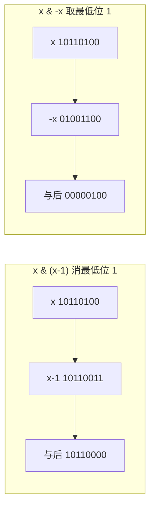

# 位运算

> 与/或/异或/取反/移位 · 消位取位技巧 · 异或消偶 · 状态压缩 · 子集枚举 · 有符号右移坑

::: tip 🧠 一句话记忆锚点
**位运算把整数当成一排开关，直接在二进制上算。六个基本操作——`&`（同 1 才 1）、`|`（有 1 就 1）、`^`（不同才 1）、`~`（逐位取反）、`<<`/`>>`（移位）。三个必背手筋——`x & (x-1)` 消掉最低位的 1、`x & -x` 取出最低位的 1、`a ^ a = 0` 让异或天生"消偶找单"。异或还满足交换律结合律，是位运算面试的最大考点。有符号右移与溢出是坑，能用 `unsigned` 就用 `unsigned`。**
:::

## 场景问题

很多问题的本质是"对一组布尔状态做集合运算"或"在整数的二进制表示上做加减消取"。如果用数组/哈希去存这些状态，既慢又费内存；而一个 32/64 位整数天然就是一排开关，位运算能在**单条 CPU 指令、O(1)** 内完成整组状态的合并、判断、翻转。

典型场景：判断奇偶、判断 2 的幂、统计二进制中 1 的个数、在一堆重复数里找唯一值、用一个 `int` 表示"选了哪些元素"（状态压缩 DP、子集枚举）、权限掩码、颜色/标志位打包。

难点不在"知道有 `&|^~`"，而在于**记住那几个看似神秘的手筋式子**（`x&(x-1)`、`x&-x`），以及**避开有符号数移位/溢出的未定义行为**。

## 实现方案

### 六个基本操作的语义

```cpp
// 设 a = 0b1100 (12), b = 0b1010 (10)
a & b;   // 0b1000 = 8   位与：两位都为 1 才为 1  —— 常用于"取出/清除某些位"（掩码）
a | b;   // 0b1110 = 14  位或：任一位为 1 即为 1  —— 常用于"置位/合并状态"
a ^ b;   // 0b0110 = 6   异或：两位不同才为 1     —— 常用于"翻转/找不同/消偶"
~a;      // 补码逐位取反：~12 == -13（32 位下 0xFFFFFFF3）
a << 2;  // 左移：低位补 0，等价乘 2^k（可能溢出）
a >> 1;  // 右移：见下方"逻辑 vs 算术"
```

**逻辑右移 vs 算术右移**——这是最容易踩的语义分叉：

- **逻辑右移**：高位无脑补 0。C++ 中对 **`unsigned`** 类型的 `>>` 就是逻辑右移。
- **算术右移**：高位补**符号位**（负数补 1，保持负号），使得 `>>` 近似"向下取整的除以 2"。C++ 中对**有符号负数**的 `>>` 通常是算术右移，但**标准直到 C++20 才把它固定为算术右移**，此前是实现定义（implementation-defined）。

```cpp
unsigned u = 0x80000000u; u >> 1;   // 0x40000000  逻辑：高位补 0
int      s = -8;          s >> 1;   // -4          算术：高位补符号位（≈ -8/2）
int      t = -1;          t >> 1;   // 仍是 -1     全 1 右移补 1 还是全 1
```

### 三个必背手筋

```cpp
// 1) x & (x - 1)：消掉"最低位的那个 1"
//    x    = 0b10110100
//    x-1  = 0b10110011   （最低位 1 变 0，其右侧全变 1）
//    x&.. = 0b10110000   （最低位 1 被清掉）
//    → 判断 2 的幂：x>0 && (x & (x-1)) == 0（2 的幂只有一个 1）

// 2) x & -x（== x & (~x + 1)）：取出"最低位的 1"所代表的值（lowbit）
//    x    = 0b10110100
//    -x   = 0b01001100   （补码 = 取反 + 1）
//    x&-x = 0b00000100   （只保留最低位的 1）—— 树状数组的核心

// 3) a ^ a == 0，a ^ 0 == a，且异或满足交换律/结合律
//    → 一堆数里除某个数出现奇数次、其余偶数次，全部异或起来即为答案（偶数次自我抵消）
```



### 位 1 计数（Brian Kernighan）

不断用 `x & (x-1)` 抹掉最低位 1，抹了几次就有几个 1——循环次数 = 1 的个数，而非固定 32 次。

```cpp
int countOnes(unsigned x) {
    int cnt = 0;
    while (x) { x &= (x - 1); cnt++; }   // 每次消掉一个最低位 1
    return cnt;
}
// 也可直接用 __builtin_popcount(x) / std::popcount(x)（C++20）
```

### 只出现一次的数字 I / II / III

```cpp
// I：其余数都出现两次，唯一数出现一次 —— 全体异或，偶次自消
int singleI(std::vector<int>& a) {
    int r = 0;
    for (int x : a) r ^= x;              // a^a=0，剩下的就是那个单身狗
    return r;
}

// II：其余数都出现三次，唯一数出现一次 —— 按位统计模 3
int singleII(std::vector<int>& a) {
    int r = 0;
    for (int b = 0; b < 32; b++) {       // 逐个二进制位
        int sum = 0;
        for (int x : a) sum += (x >> b) & 1;
        if (sum % 3) r |= (1 << b);      // 该位上 1 的总数不是 3 的倍数 → 属于答案
    }
    return r;
}

// III：恰有两个数各出现一次，其余出现两次 —— 异或得 a^b，再用 lowbit 分组
std::pair<int,int> singleIII(std::vector<int>& a) {
    int axorb = 0;
    for (int x : a) axorb ^= x;          // = a ^ b（两个单身狗的异或）
    int low = axorb & -axorb;            // 取 a、b 不同的某一位
    int p = 0, q = 0;
    for (int x : a) (x & low) ? p ^= x : q ^= x;  // 按该位是否为 1 分成两组，各自异或
    return {p, q};
}
```

### 位掩码枚举子集

用一个整数的低 n 位表示"选/不选"，`0 .. 2^n-1` 即枚举全部 2ⁿ 个子集。

```cpp
std::vector<std::vector<int>> subsets(std::vector<int>& nums) {
    int n = nums.size();
    std::vector<std::vector<int>> res;
    for (int mask = 0; mask < (1 << n); mask++) {   // mask 的第 i 位 = 是否选 nums[i]
        std::vector<int> cur;
        for (int i = 0; i < n; i++)
            if (mask & (1 << i)) cur.push_back(nums[i]);
        res.push_back(cur);
    }
    return res;
}

// 枚举某个掩码 mask 的所有"子掩码"（状压 DP 常用），复杂度 O(3^n)：
// for (int sub = mask; sub; sub = (sub - 1) & mask) { ... }  // sub 依次遍历 mask 的非空子集
```

### 格雷码

相邻两个数只差一位。公式 `gray(i) = i ^ (i >> 1)`。

```cpp
std::vector<int> grayCode(int n) {
    std::vector<int> res;
    for (int i = 0; i < (1 << n); i++)
        res.push_back(i ^ (i >> 1));     // 二进制 → 格雷码：异或自身右移一位
    return res;
}
```

### 汉明距离

两数二进制表示中**不同位的个数** = 异或后 1 的个数。

```cpp
int hammingDistance(int x, int y) {
    return countOnes(x ^ y);             // 先 ^ 找出不同位，再数 1
}
```

### 常用位操作片段

```cpp
x & 1;              // 判奇偶（1=奇）
x | (1 << k);       // 把第 k 位置 1
x & ~(1 << k);      // 把第 k 位清 0
x ^ (1 << k);       // 翻转第 k 位
(x >> k) & 1;       // 取第 k 位
x & (x - 1) == 0;   // （x>0 时）判断是否 2 的幂
```

## 为什么这么做

- **为什么 `x&(x-1)` 能消最低位 1**：`x-1` 会把最低位的 1 借位变成 0、并把它右边的所有 0 变成 1，与原数相与后，最低位 1 及右侧都被清掉，更高位不变。
- **为什么 `x&-x` 能取最低位 1**：补码 `-x = ~x + 1`，`~x` 把最低位 1 右侧的 0 全变 1、该 1 变 0，`+1` 又进位回来使最低位 1 处恢复为 1、其右侧回到 0，且更高位与 `x` 互补——相与后只剩最低位那个 1。
- **为什么异或能"消偶找单"**：`a^a=0`、`a^0=a`，且异或可交换可结合，所以出现偶数次的数两两抵消，只留下奇数次的那个，与顺序无关。
- **为什么位运算快**：一条指令并行处理整字的所有位，且无分支；集合的并/交/补映射到 `|`/`&`/`~`，是 O(1) 的。

## 为什么别的选择不行

- **用哈希表/数组统计次数找单身狗**：需要 O(n) 额外空间；异或法只用一个变量 O(1) 空间、一趟扫描，且不怕整数溢出。
- **用 `%`、`/` 代替位运算**：`x/2`、`x%2` 在编译器优化下未必比 `x>>1`、`x&1` 慢，但对**负数**语义不同（`-7/2==-3` 截断向零，`-7>>1==-4` 向下取整），混用会出 bug。
- **对有符号数做移位当作纯逻辑移位**：负数右移在 C++20 前是实现定义，左移到符号位或溢出是**未定义行为（UB）**；需要纯逻辑移位/位模式操作时应改用 `unsigned`。
- **递归回溯枚举子集**：位掩码枚举无递归开销、无栈、便于配合状压 DP 把"选了哪些"直接当数组下标，n≤~20 时远比回溯清爽。

## 沉淀结论

::: tip 速记
- 三手筋：`x&(x-1)` 消最低位 1 / `x&-x` 取最低位 1 / `a^a=0` 异或消偶
- 判 2 的幂：`x>0 && (x&(x-1))==0`；数 1 用 Brian Kernighan 或 `popcount`
- 单身狗：出现两次→全异或；三次→按位模 3；两个单身→异或后按 lowbit 分组
- 移位坑：负数右移=算术（补符号位，C++20 才固定）；纯位操作用 `unsigned`，左移溢出是 UB
:::

### 面试高频题清单

- **Q：怎么判断一个数是不是 2 的幂？** A：`x > 0 && (x & (x - 1)) == 0`——2 的幂二进制只有一个 1，消掉后为 0。
- **Q：`x & -x` 是什么、有什么用？** A：取出最低位的 1（lowbit），基于补码 `-x=~x+1`；树状数组用它定位管辖区间。
- **Q：一堆数里只有一个出现奇数次，怎么 O(1) 空间找出来？** A：全部异或，偶数次自我抵消，结果即答案。
- **Q：其余数出现三次、唯一数出现一次怎么办？** A：异或会失效（三次不消），改为逐位统计 1 的总数、对 3 取模，余 1 的位属于答案。
- **Q：逻辑右移和算术右移的区别？** A：逻辑补 0（`unsigned`），算术补符号位（有符号负数），后者近似向下取整除 2。
- **Q：位运算有哪些 UB/坑？** A：左移越过符号位或溢出是 UB；移位量 ≥ 位宽是 UB；有符号负数右移 C++20 前实现定义；需确定行为就用 `unsigned`。

### 记忆口诀

- **六操作**：与同 1 / 或有 1 / 异不同 / 取反 / 左移乘 2 / 右移看符号
- **三手筋**：`x&(x-1)` 消 / `x&-x` 取 / `a^a=0` 消偶
- **单身狗**：一次→异或 / 三次→模 3 / 两只→lowbit 分组
- **躲坑**：负数右移算术 / 左移溢出 UB / 移位量别越界 / 纯位操作用 unsigned

## 内容来源

综合整理自 LeetCode 位运算标签高频题（只出现一次的数字 I/II/III、位 1 的个数、2 的幂、格雷码、子集、汉明距离）；代码为教学示意的 C++ 实现。

## 自测：合上资料能说清楚吗？

1. 写出六个基本位操作的语义，并说明逻辑右移与算术右移的区别。

<details><summary>参考答案</summary>

`&` 两位都 1 才 1、`|` 有 1 就 1、`^` 不同才 1、`~` 逐位取反、`<<` 左移低位补 0（≈乘 2^k）、`>>` 右移。**逻辑右移**高位补 0（`unsigned`）；**算术右移**高位补**符号位**（有符号负数），近似向下取整除以 2。C++20 前有符号右移是实现定义。

</details>

2. `x & (x-1)` 和 `x & -x` 各做什么？分别用来解决什么问题？

<details><summary>参考答案</summary>

`x&(x-1)` **消掉最低位的 1**——用于判 2 的幂（结果为 0）、Brian Kernighan 数 1。`x&-x`（`-x=~x+1`）**取出最低位的 1**（lowbit）——用于树状数组、只出现一次数字 III 的分组。

</details>

3. 数组中除一个数出现一次外其余都出现两次/三次，分别怎么找那个数？

<details><summary>参考答案</summary>

出现**两次**：全体**异或**，`a^a=0` 偶次自消，剩下即答案。出现**三次**：异或失效，**逐位统计** 1 的总数并**对 3 取模**，余数为 1 的位组成答案（也可用两个变量做位级状态机）。

</details>

4. 如何用位掩码枚举一个集合的全部子集？如何枚举某个掩码的所有子掩码？

<details><summary>参考答案</summary>

全部子集：`for (mask = 0; mask < (1<<n); mask++)`，`mask` 第 i 位表示是否选第 i 个元素，共 2ⁿ 个。子掩码：`for (sub = mask; sub; sub = (sub-1) & mask)` 遍历 `mask` 的所有非空子集，总复杂度 O(3ⁿ)。

</details>

5. 位运算有哪些容易触发未定义行为或平台差异的地方？工程上怎么规避？

<details><summary>参考答案</summary>

**左移**导致溢出或移入/越过符号位是 **UB**；移位量 **≥ 类型位宽**是 UB；**有符号负数右移**在 C++20 前是实现定义。规避：需要纯位模式或逻辑移位时用 **`unsigned`**，注意移位量范围，负数除法/取整用算术运算符别用移位替代。

</details>
