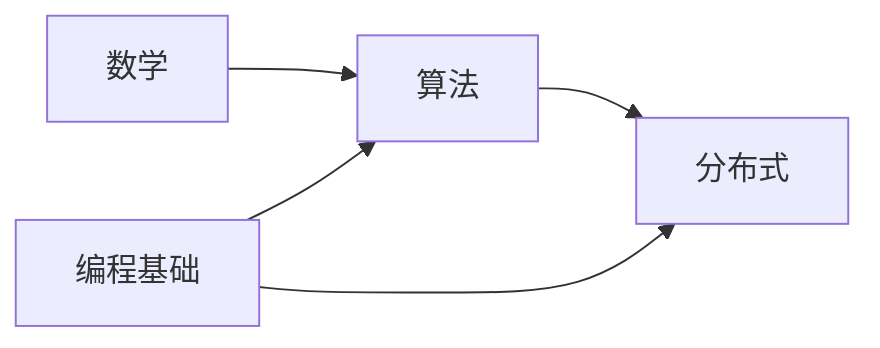

# 图论

> 建图 · BFS/DFS · 拓扑排序 · Dijkstra · 并查集——统一 C++、含遍历动画

::: tip 🧠 一句话记忆锚点
**图论题先认清三件事：有向/无向、带权/不带权、稠密/稀疏。不带权最短路→BFS（逐层扩散）；带非负权最短路→Dijkstra（堆优化）；依赖排序/判环（DAG）→拓扑排序（Kahn 入度法）；连通性/合并集合→并查集（路径压缩 + 按秩合并近 O(1)）；遍历/连通分量/岛屿→DFS/BFS。**
:::

## 场景问题

"节点 + 关系"的问题都可建图：最短路、依赖调度、连通分量、岛屿数量、课程表、社交网络。核心是**选对遍历/最短路算法**，并用合适的**存储**（邻接表省空间、适合稀疏图；邻接矩阵 O(1) 查边、适合稠密图）。

## 实现方案

### 建图（邻接表）

```cpp
int n;                                     // 节点数
std::vector<std::vector<int>> g(n);        // 无权图：g[u] = u 的邻居
std::vector<std::vector<std::pair<int,int>>> wg(n);  // 带权：{邻居, 权}
// 加边（有向 u->v）：g[u].push_back(v);  无向再加 g[v].push_back(u);
```

### BFS：不带权最短路 = 逐层扩散

**BFS 动画**：从源点开始一圈圈向外扩散，**第 k 层的节点到源点距离恰为 k**——这正是不带权图最短路的原理：

<svg viewBox="0 0 480 250" width="100%" style="max-width:480px;height:auto" role="img" aria-label="BFS 逐层扩散：同一层节点到源点距离相同">
  <g stroke="#475569" stroke-width="1.5">
    <line x1="60" y1="125" x2="160" y2="65"/><line x1="60" y1="125" x2="160" y2="185"/>
    <line x1="160" y1="65" x2="280" y2="45"/><line x1="160" y1="65" x2="280" y2="125"/>
    <line x1="160" y1="185" x2="280" y2="125"/><line x1="160" y1="185" x2="280" y2="205"/>
    <line x1="280" y1="45" x2="400" y2="125"/><line x1="280" y1="205" x2="400" y2="125"/>
  </g>
  <g font-size="13" text-anchor="middle" fill="#fff">
    <circle cx="60"  cy="125" r="18" fill="#334155"><animate attributeName="fill" values="#16a34a" begin="0s" dur="0.1s" fill="freeze"/><animate attributeName="fill" values="#16a34a;#334155" begin="4.5s" dur="0.3s" fill="freeze"/></circle><text x="60" y="130">A</text>
    <circle cx="160" cy="65"  r="18" fill="#334155"><animate attributeName="fill" values="#0ea5e9" begin="1.2s" dur="0.1s" fill="freeze"/><animate attributeName="fill" values="#0ea5e9;#334155" begin="4.5s" dur="0.3s" fill="freeze"/></circle><text x="160" y="70">B</text>
    <circle cx="160" cy="185" r="18" fill="#334155"><animate attributeName="fill" values="#0ea5e9" begin="1.2s" dur="0.1s" fill="freeze"/><animate attributeName="fill" values="#0ea5e9;#334155" begin="4.5s" dur="0.3s" fill="freeze"/></circle><text x="160" y="190">C</text>
    <circle cx="280" cy="45"  r="18" fill="#334155"><animate attributeName="fill" values="#f59e0b" begin="2.4s" dur="0.1s" fill="freeze"/><animate attributeName="fill" values="#f59e0b;#334155" begin="4.5s" dur="0.3s" fill="freeze"/></circle><text x="280" y="50">D</text>
    <circle cx="280" cy="125" r="18" fill="#334155"><animate attributeName="fill" values="#f59e0b" begin="2.4s" dur="0.1s" fill="freeze"/><animate attributeName="fill" values="#f59e0b;#334155" begin="4.5s" dur="0.3s" fill="freeze"/></circle><text x="280" y="130">E</text>
    <circle cx="280" cy="205" r="18" fill="#334155"><animate attributeName="fill" values="#f59e0b" begin="2.4s" dur="0.1s" fill="freeze"/><animate attributeName="fill" values="#f59e0b;#334155" begin="4.5s" dur="0.3s" fill="freeze"/></circle><text x="280" y="210">F</text>
    <circle cx="400" cy="125" r="18" fill="#334155"><animate attributeName="fill" values="#a78bfa" begin="3.6s" dur="0.1s" fill="freeze"/><animate attributeName="fill" values="#a78bfa;#334155" begin="4.5s" dur="0.3s" fill="freeze"/></circle><text x="400" y="130">G</text>
  </g>
  <text x="20" y="238" font-size="11" fill="currentColor">A(dist0)→B,C(dist1)→D,E,F(dist2)→G(dist3)。队列先进先出保证按层扩散。</text>
</svg>

```cpp
#include <queue>
std::vector<int> bfsDist(int src, const std::vector<std::vector<int>>& g) {
    std::vector<int> dist(g.size(), -1);
    std::queue<int> q; q.push(src); dist[src] = 0;
    while (!q.empty()) {
        int u = q.front(); q.pop();
        for (int v : g[u])
            if (dist[v] == -1) { dist[v] = dist[u] + 1; q.push(v); }  // 首次访问即最短
    }
    return dist;
}
```

### DFS（递归 / 连通分量 / 岛屿）

```cpp
void dfs(int u, const std::vector<std::vector<int>>& g, std::vector<bool>& vis) {
    vis[u] = true;
    for (int v : g[u]) if (!vis[v]) dfs(v, g, vis);
}
// 连通分量数 = 对每个未访问节点起一次 dfs 的次数；岛屿数量同理（网格四方向 dfs）
```

### 拓扑排序（Kahn 入度法，判环）

有向无环图（DAG）按依赖排序——课程表、编译依赖、任务调度：



```cpp
std::vector<int> topoSort(int n, const std::vector<std::vector<int>>& g) {
    std::vector<int> indeg(n, 0), order;
    for (int u = 0; u < n; u++) for (int v : g[u]) indeg[v]++;
    std::queue<int> q;
    for (int u = 0; u < n; u++) if (indeg[u] == 0) q.push(u);   // 入度 0 先出
    while (!q.empty()) {
        int u = q.front(); q.pop(); order.push_back(u);
        for (int v : g[u]) if (--indeg[v] == 0) q.push(v);       // 删边，新入度 0 入队
    }
    return order.size() == n ? order : std::vector<int>{};       // 长度 <n → 有环
}
```

### Dijkstra（非负权单源最短路，堆优化）

```cpp
#include <queue>
std::vector<long long> dijkstra(int src, const std::vector<std::vector<std::pair<int,int>>>& wg) {
    int n = wg.size();
    std::vector<long long> dist(n, LLONG_MAX);
    std::priority_queue<std::pair<long long,int>,
        std::vector<std::pair<long long,int>>, std::greater<>> pq;   // 小顶堆 {dist, node}
    dist[src] = 0; pq.push({0, src});
    while (!pq.empty()) {
        auto [d, u] = pq.top(); pq.pop();
        if (d > dist[u]) continue;                    // 过期条目跳过
        for (auto [v, w] : wg[u])
            if (dist[u] + w < dist[v]) {              // 松弛
                dist[v] = dist[u] + w;
                pq.push({dist[v], v});
            }
    }
    return dist;                                      // O(E log V)
}
```

> 负权边用 **Bellman-Ford**（O(VE)，可判负环）或 **SPFA**；全源最短路用 **Floyd-Warshall**（O(V³)，三重循环 `dp[i][j]=min(dp[i][j], dp[i][k]+dp[k][j])`）。

### 并查集（Union-Find，连通性 / 判环 / Kruskal）

处理"连通性 / 分组"，两大优化让操作近 O(1)：**路径压缩**（find 时把沿途节点直接挂到根）+ **按秩合并**（矮树挂高树下）。

```cpp
struct DSU {
    std::vector<int> parent, rank_;
    DSU(int n) : parent(n), rank_(n, 0) { for (int i = 0; i < n; i++) parent[i] = i; }
    int find(int x) { return parent[x] == x ? x : parent[x] = find(parent[x]); }  // 路径压缩
    bool unite(int a, int b) {
        a = find(a); b = find(b);
        if (a == b) return false;                     // 已同集（加边成环）
        if (rank_[a] < rank_[b]) std::swap(a, b);     // 按秩合并
        parent[b] = a;
        if (rank_[a] == rank_[b]) rank_[a]++;
        return true;
    }
};
// 复杂度 O(α(n))，α 反阿克曼函数，实际 ≤ 4。用于：朋友圈/岛屿、Kruskal 最小生成树、判环。
```

## 为什么这么做

- **BFS 求不带权最短路**：队列 FIFO 保证按距离逐层访问，节点**首次出队即最短**；DFS 做不到（会先走深再回头）。
- **Dijkstra 要非负权**：它贪心地"确定"当前最近节点不再更新——负权会破坏这个前提（可能后来更短），所以负权必须用 Bellman-Ford。
- **拓扑用入度法**：入度 0 表示无未满足的前置依赖，可安全输出；删它的出边可能让后继入度归零。若最终输出 < n 个节点，说明有环（环内节点入度永远 >0）。
- **并查集两优化缺一不可**：只路径压缩或只按秩都能到 O(log n)，两者合用才近 O(α(n))。

## 为什么别的选择不行

- **不带权最短路用 Dijkstra**：能对但杀鸡用牛刀，BFS O(V+E) 更简单快。
- **带权最短路用 BFS**：错——BFS 按边数而非权和扩散，权不等时得不到最短。
- **判环用 DFS 颜色标记 vs 拓扑**：都行；拓扑同时给出排序，DFS 三色（白/灰/黑）遇灰色回边即有环，按需选。
- **连通性反复遍历图**：每次 O(V+E) 太慢；并查集把"查/合并连通性"降到近 O(1)，是 Kruskal、判环的关键。

## 沉淀结论

::: tip 速记
- 不带权最短路 → BFS；非负权 → Dijkstra（堆）；负权 → Bellman-Ford；全源 → Floyd
- 依赖排序/判环(DAG) → 拓扑（Kahn 入度法）；连通性/合并 → 并查集（路径压缩+按秩）
- 稀疏图用邻接表，稠密图用邻接矩阵
:::

### 面试高频题清单

- **Q：BFS 和 DFS 各适合什么？** A：BFS——最短路（不带权）、按层处理、最近目标；DFS——连通分量、路径枚举、拓扑/判环、回溯类。
- **Q：Dijkstra 为什么不能有负权？如何堆优化？** A：贪心确定最近点的前提被负权破坏；用小顶堆每次取当前最近未确定点松弛邻居，O(E log V)。
- **Q：课程表能否修完 / 输出学习顺序？** A：建依赖图跑拓扑排序，输出节点数 == n 则无环可完成，顺序即拓扑序。
- **Q：岛屿数量？** A：网格视作图，对每个未访问的陆地格 DFS/BFS 淹没整块，计数起点次数；或并查集合并相邻陆地。
- **Q：Kruskal 和 Prim 求最小生成树？** A：Kruskal——边排序 + 并查集避环，适合稀疏；Prim——从点出发用堆扩边，适合稠密。
- **Q：并查集复杂度为什么近 O(1)？** A：路径压缩 + 按秩合并后单次操作摊还 O(α(n))，α 反阿克曼函数实际 ≤4。
- **Q：判断有向图是否有环？** A：拓扑排序输出 <n 个节点，或 DFS 三色标记遇到"灰色"节点（回边）。

## 内容来源

综合整理自《算法》第 4 版图论章节与高频面试题型（LeetCode 图 / 并查集标签）；代码为教学示意的 C++ 实现。并查集原在排序篇，现归入本篇。
