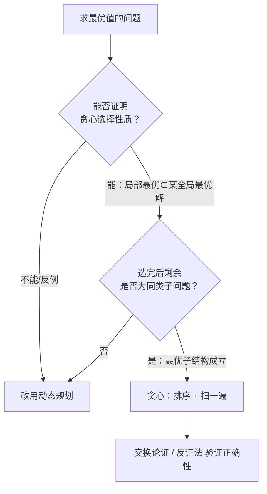

# 贪心算法

> 贪心选择性质 · 最优子结构 · 交换论证 · 区间调度 · Huffman · 跳跃游戏——统一 C++、含判定流程

::: tip 🧠 一句话记忆锚点
**贪心 = 每一步都做"当前看起来最好"的局部选择，且永不反悔。能贪的前提是两条：贪心选择性质（局部最优能拼出全局最优）+ 最优子结构（做完这步后剩下的仍是同类子问题）。判定口诀——"局部最优能否累加成全局最优？"能则贪、不能则 [动态规划](./dynamic-programming.md)。正确性靠交换论证：假设有更优解，把它的选择换成贪心的选择而不变差。经典套路是"先排序，再扫一遍"。**
:::

## 场景问题

要在一堆选择里求**最优值**（最多/最少/最大/最小），且**每步的最优决策不依赖对未来的完整推演**——这类问题优先想贪心。典型信号：

- 求"最多能安排多少活动""最少需要多少个箭/教室""最少加油次数"。
- 直觉上有个"显然该优先选它"的排序准则（最早结束、最短、频率最高……）。
- 数据范围大（n ≥ 10⁵），DP 的 O(n²) 状态转移跑不动，需要 O(n log n) 的贪心。

贪心和 [动态规划](./dynamic-programming.md) 都要求**最优子结构**，区别在于：DP 要枚举/比较子问题的多个方案再取最优（自底向上填表），贪心则**直接断定某个局部选择一定属于某个全局最优解**，一步定终身、不回头。因此贪心比 DP 快，但**适用面窄**，且必须证明其正确性——凭直觉贪往往是错的（最经典的坑：找零钱面额非标准时贪心失败）。

## 实现方案

### 判定流程：这题能贪吗？



### 通用模板（先排序，再扫一遍）

大多数贪心题都是这个骨架：定义一个排序准则，然后线性扫描累积答案。

```cpp
// 通用：按某个准则排序后线性决策
int greedy(std::vector<Item>& items) {
    std::sort(items.begin(), items.end(), [](const Item& a, const Item& b) {
        return a.key < b.key;               // 关键：选对排序准则（贪心的灵魂）
    });
    int ans = 0, state = 初始;
    for (auto& it : items) {
        if (可行(it, state)) {              // 当前局部最优选择
            take(it, state);                // 不反悔地纳入
            ans++;
        }
    }
    return ans;
}
```

### 活动选择 / 区间调度（按结束时间排序）

"最多能安排多少个互不重叠的活动"——**按结束时间升序**排序，每次贪心地选结束最早、且与已选不冲突的活动。同类题：无重叠区间（删最少）、用最少箭引爆气球。

```cpp
int maxActivities(std::vector<std::pair<int,int>>& iv) {  // {start, end}
    std::sort(iv.begin(), iv.end(), [](auto& a, auto& b) {
        return a.second < b.second;         // 按结束时间升序——最早结束者留下最多余量
    });
    int cnt = 0, lastEnd = INT_MIN;
    for (auto& [s, e] : iv) {
        if (s >= lastEnd) {                 // 与上一个已选不重叠
            cnt++; lastEnd = e;             // 选它，更新边界，不回头
        }
    }
    return cnt;
}
```

### 跳跃游戏（维护能到达的最远边界）

`nums[i]` 表示在 i 处最多跳几步。**跳跃游戏 I**：能否到终点——扫描时维护 `reach = max(reach, i + nums[i])`，一旦 `i > reach` 说明卡住。**跳跃游戏 II**：最少跳几次——用"当前层能覆盖的最远处"做 BFS 式贪心。

```cpp
bool canJump(std::vector<int>& nums) {
    int reach = 0;
    for (int i = 0; i < (int)nums.size(); i++) {
        if (i > reach) return false;        // 当前位置已超出可达范围
        reach = std::max(reach, i + nums[i]);
    }
    return true;
}

int jump(std::vector<int>& nums) {          // 最少跳跃次数
    int jumps = 0, curEnd = 0, far = 0;
    for (int i = 0; i + 1 < (int)nums.size(); i++) {
        far = std::max(far, i + nums[i]);
        if (i == curEnd) { jumps++; curEnd = far; }  // 走到本次跳跃的边界，被迫再跳一次
    }
    return jumps;
}
```

### 加油站（一次遍历定起点）

环形路上从某站出发能否跑完一圈。贪心结论：若总油量 ≥ 总消耗则必有解；且**若从 i 出发在 j 处耗尽，则 i..j 之间任何点都当不了起点**，起点必在 j+1。

```cpp
int canCompleteCircuit(std::vector<int>& gas, std::vector<int>& cost) {
    int total = 0, tank = 0, start = 0;
    for (int i = 0; i < (int)gas.size(); i++) {
        int diff = gas[i] - cost[i];
        total += diff; tank += diff;
        if (tank < 0) { start = i + 1; tank = 0; }  // 前面都不行，从下一站重试
    }
    return total >= 0 ? start : -1;
}
```

### 分发糖果（两次扫描）

每个孩子至少 1 颗，评分更高者比相邻邻居多。**从左到右**保证右比左高的情形，**从右到左**保证左比右高的情形，取两遍的最大值。

```cpp
int candy(std::vector<int>& r) {
    int n = r.size();
    std::vector<int> c(n, 1);
    for (int i = 1; i < n; i++)                        // 左→右
        if (r[i] > r[i-1]) c[i] = c[i-1] + 1;
    for (int i = n - 2; i >= 0; i--)                   // 右→左
        if (r[i] > r[i+1]) c[i] = std::max(c[i], c[i+1] + 1);
    return std::accumulate(c.begin(), c.end(), 0);
}
```

### Huffman 编码（最优前缀码，贪心 + 堆）

给定字符频率，构造带权路径长度最小的前缀码。贪心：**每次取频率最小的两个节点合并**为新节点（频率相加），重复到只剩一棵树。用小根堆实现，O(n log n)。

```cpp
int huffmanCost(std::vector<int>& freq) {   // 返回最小总编码长度（WPL）
    std::priority_queue<int, std::vector<int>, std::greater<int>> pq(freq.begin(), freq.end());
    int cost = 0;
    while (pq.size() > 1) {
        int a = pq.top(); pq.pop();
        int b = pq.top(); pq.pop();
        cost += a + b;                      // 合并代价 = 两者频率之和
        pq.push(a + b);                     // 频率最小的两个先合并 → 高频字符深度更浅
    }
    return cost;
}
```

### 任务调度器（贪心排最高频 + 数学公式）

相同任务间需间隔 n 个冷却时段，求最短总时间。贪心思路：**优先安排出现次数最多的任务**填满每个周期。设最高频次 `maxCnt`、有 `maxKind` 个任务达到该频次，则

```cpp
int leastInterval(std::vector<char>& tasks, int n) {
    std::vector<int> cnt(26, 0);
    for (char t : tasks) cnt[t - 'A']++;
    int maxCnt = *std::max_element(cnt.begin(), cnt.end());
    int maxKind = std::count(cnt.begin(), cnt.end(), maxCnt);
    // (maxCnt-1) 个完整周期，每周期长 (n+1)，末尾补上 maxKind 个最高频任务
    long long framed = (long long)(maxCnt - 1) * (n + 1) + maxKind;
    return std::max((long long)tasks.size(), framed);  // 任务多到填满空位时取总数
}
```

## 为什么这么做

- **区间调度为何按"结束时间"而非"开始时间/时长"排**：结束越早，给后续留的时间越多——这一步的局部最优（最早结束）为全局保留了最大可能。交换论证可证它必在某个最优解里。
- **Huffman 为何总合并最小两个**：频率越低的字符应放在越深的叶子（编码越长）。让最小的两个先合并，等于把它们推到最深层，使高频字符路径最短，WPL 最小。
- **加油站为何一次遍历就够**：`tank<0` 时说明这段起点都失败，且失败点之前每个前缀和都非负（否则更早就重置了），所以能安全跳过整段，起点单调右移，O(n)。
- **糖果为何两次扫描**：单次扫描只能满足一个方向的约束；左右各扫一遍再取 max，同时满足"比左邻高"和"比右邻高"两个局部约束。

## 为什么别的选择不行

- **动态规划**：贪心适用时 DP 也对，但 DP 要维护并比较多个子问题状态，通常 O(n²) 或更高；贪心一步定选择、只需 O(n log n)。数据量大时 DP 超时。反过来，**当局部最优不能保证全局最优**（如 0/1 背包按性价比贪会错、非标准面额找零贪会错）时，只能用 [动态规划](./dynamic-programming.md)。
- **回溯 / 暴力枚举**：枚举所有组合是指数级；贪心证明了"最优解一定包含某个局部选择"后，就无需枚举其他分支。但**没证明就贪 = 赌**，容易 WA。
- **纯排序后取前 k 个**：很多贪心题排序只是第一步，还需扫描时维护状态（边界、油箱、堆），单纯排序取头部会漏掉可行性约束。

## 沉淀结论

::: tip 速记
- 能贪两前提：**贪心选择性质**（局部最优∈全局最优）+ **最优子结构**；缺一即转 DP
- 正确性靠**交换论证**：把最优解里的选择换成贪心选择而结果不变差
- 万能骨架：**先排序，再扫一遍**；选对排序准则是灵魂（区间→结束时间、Huffman→最小频率）
- 经典坑：0/1 背包、非标准面额找零**不能贪**，必须 DP
:::

### 面试高频题清单

- **Q：贪心成立需要哪两个前提？** A：贪心选择性质（每步局部最优能构成某个全局最优解）与最优子结构（做完局部选择后，剩余部分仍是同类子问题）。
- **Q：贪心和动态规划怎么区分该用哪个？** A：两者都需最优子结构；若"局部最优可直接确定不必比较其他子方案"用贪心，若需枚举比较多个子问题结果才用 DP。判定：能证明贪心选择性质就贪，否则 DP。
- **Q：怎么证明一个贪心是对的？** A：交换论证——假设存在最优解不含贪心的选择，把它的某个选择替换成贪心选择，证明结果不会变差，从而贪心选择也能达到最优；或用反证法。
- **Q：区间调度为什么按结束时间排序？** A：最早结束的活动给后续留下最多空间，是安全的局部最优；反例上无法用开始时间或时长得到最多活动数。
- **Q：Huffman 编码的贪心策略是什么？** A：每次合并频率最小的两个节点，用小根堆实现；使低频字符编码更长、高频更短，带权路径长度（WPL）最小。
- **Q：举一个贪心失败、必须用 DP 的例子。** A：0/1 背包按"单位价值"贪心会错（物品不可分割）；找零钱面额为 {1,3,4} 凑 6 时贪心得 4+1+1=3 枚，最优是 3+3=2 枚。

### 记忆口诀

- **两前提**：贪心选择性质 / 最优子结构
- **判定**：局部最优能拼全局最优？能则贪 / 不能则 DP
- **证明**：交换论证（换而不变差）/ 反证法
- **套路**：先排序 / 再扫一遍 / 排序准则是灵魂
- **经典准则**：区间→最早结束 / Huffman→最小频率 / 跳跃→最远边界 / 加油站→耗尽即换起点

## 内容来源

综合整理自高频面试题型（LeetCode 贪心标签）与《算法导论》；代码为教学示意的 C++ 实现。

## 自测：合上资料能说清楚吗？

1. 贪心算法成立的两个前提是什么？它们和动态规划的关系如何？

<details><summary>参考答案</summary>

**贪心选择性质**（每步的局部最优选择能构成某个全局最优解）+ **最优子结构**（做完局部选择后剩余仍是同类子问题）。二者都需最优子结构；区别在贪心**直接断定局部最优必属全局最优、不回头**，DP 则要**枚举比较多个子问题**再取最优。

</details>

2. 如何用交换论证证明"活动选择按结束时间排序"的贪心是正确的？

<details><summary>参考答案</summary>

设最优解按结束时间排序后第一个活动为 x，贪心选的是结束最早的活动 g。若 x≠g，因 g 结束不晚于 x，用 g 替换 x **不会与后续活动冲突**（g 留下的余量 ≥ x），得到的解活动数不变仍最优。故贪心选择 g 一定属于某个最优解，归纳即得整体最优。

</details>

3. 跳跃游戏 I（能否到终点）的贪心状态是什么？为什么一次线性扫描就够？

<details><summary>参考答案</summary>

维护 `reach = max(reach, i + nums[i])` 表示当前**能到达的最远下标**；遍历中若 `i > reach` 说明被卡住返回 false。因为只要 i 可达，i 之前的点也都可达，用最远边界即可代表可行性，无需回溯，故 O(n) 一遍即可。

</details>

4. Huffman 编码为什么每次都合并频率最小的两个节点？

<details><summary>参考答案</summary>

带权路径长度 WPL = Σ(频率×编码长度)，频率越低的字符应放在**越深的叶子**（编码越长）。每次让最小的两个先合并，相当于把它们不断推向更深层，使高频字符路径最短，从而 WPL 最小。用小根堆维护，O(n log n)。

</details>

5. 举例说明贪心会失败、必须改用动态规划的场景，并说明原因。

<details><summary>参考答案</summary>

**0/1 背包**：物品不可分割，按单位价值贪心可能选了高性价比小件而放不下真正最优组合。**非标准面额找零**：面额 `{1,3,4}` 凑 6，贪心先取 4 再 1+1 共 **3 枚**，最优是 3+3 共 **2 枚**。原因是这类问题**不满足贪心选择性质**——局部最优无法保证全局最优，只能用 [动态规划](./dynamic-programming.md) 枚举比较。

</details>
