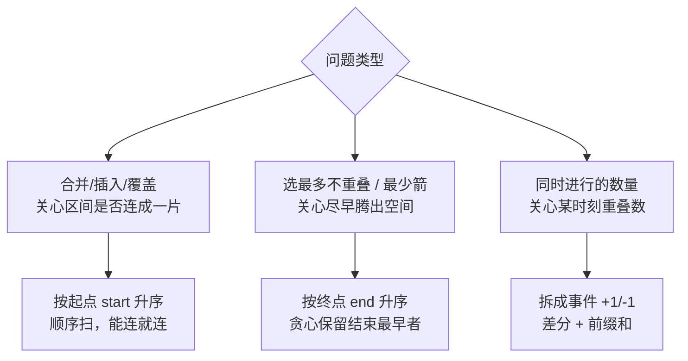

# 区间问题

> 合并 · 插入 · 交集 · 会议室 · 射气球 · 差分数组与扫描线——统一 C++、含流程图

::: tip 🧠 一句话记忆锚点
**区间问题的第一步永远是"排序"，选哪个键排序决定了整道题：要合并/覆盖看"是否重叠"→ 按起点排；要选最多不重叠区间/最少箭 → 按终点排（贪心留出最大空间）。第二大武器是"差分/扫描线"：把区间 [s,e] 拆成 s 处 +1、e 处 -1 两个事件，扫一遍前缀和就得到每个时刻的重叠数——会议室 II、航班预订、日程冲突全是它。记住：区间 = 排序 + 贪心，或者 = 事件差分 + 前缀和。**
:::

## 场景问题

一堆闭区间 `[start, end]`，要么问"合并后剩几段""能否插入新区间"（覆盖类），要么问"最多能安排多少个互不冲突的会议""至少几间会议室""至少几支箭"（调度/贪心类），要么问"某一天有多少航班/会议同时进行"（计数类）。

这三类看似不同，底层只有两把钥匙：

- **排序 + 一次线性扫描**：合并、插入、交集、选区间、射气球。关键是**排序键**选起点还是终点。
- **差分数组 / 扫描线**：把每个区间转成"进入 +1、离开 -1"两个事件，按时间排序后累加前缀和，峰值即最大重叠数。会议室 II、航班预订都是它。

面试里区间题几乎不需要复杂数据结构，难点全在"想清楚按哪个键排、贪心为什么成立"。

## 实现方案

### 排序键的选择依据



- **按起点排**：适合"合并/插入"。起点有序后，只要下一个区间的起点 ≤ 当前已合并区间的终点，就说明重叠，可以直接吞并；否则另起一段。一次线性扫描即可。
- **按终点排**：适合"选最多互不重叠区间 / 最少箭"。贪心思想——**结束越早，给后面留的空间越大**。每次保留结束最早的区间，跳过所有与它重叠的，就能选出最多的不相交区间。
- **按事件排（差分）**：适合"某时刻同时进行的数量 / 最少会议室"。不关心具体是哪些区间，只关心重叠的**峰值**。

### 区间合并（按起点排）

```cpp
// LeetCode 56. 合并区间
std::vector<std::vector<int>> merge(std::vector<std::vector<int>>& iv) {
    std::sort(iv.begin(), iv.end());              // 默认按起点升序（起点相同按终点）
    std::vector<std::vector<int>> res;
    for (auto& cur : iv) {
        // 无重叠：res 为空，或 cur 的起点 > 上一段的终点 → 另起一段
        if (res.empty() || cur[0] > res.back()[1]) {
            res.push_back(cur);
        } else {                                  // 有重叠：延伸上一段的右端点
            res.back()[1] = std::max(res.back()[1], cur[1]);
        }
    }
    return res;
}
```

判定重叠用的是 `cur[0] > res.back()[1]` 才另起段；等号（`cur[0] == 上一段终点`）算不算重叠取决于是否闭区间相接要合并，按题意调整。

### 插入区间（按起点排，三段处理）

```cpp
// LeetCode 57. 插入区间（原区间已按起点有序、互不重叠）
std::vector<std::vector<int>> insert(std::vector<std::vector<int>>& iv,
                                     std::vector<int> ni) {  // ni = 新区间
    std::vector<std::vector<int>> res;
    int n = iv.size(), i = 0;
    // 1) 完全在新区间左侧（无重叠）的，原样加入
    while (i < n && iv[i][1] < ni[0]) res.push_back(iv[i++]);
    // 2) 与新区间重叠的，全部合并到 ni 上
    while (i < n && iv[i][0] <= ni[1]) {
        ni[0] = std::min(ni[0], iv[i][0]);
        ni[1] = std::max(ni[1], iv[i][1]);
        i++;
    }
    res.push_back(ni);
    // 3) 完全在新区间右侧的，原样加入
    while (i < n) res.push_back(iv[i++]);
    return res;
}
```

因为输入已有序，插入退化成"左边不动 → 中间合并 → 右边不动"三段扫描，O(n)，无需重新排序。

### 区间交集（双指针）

```cpp
// LeetCode 986. 两个有序区间列表的交集
std::vector<std::vector<int>> intervalIntersection(
        std::vector<std::vector<int>>& A, std::vector<std::vector<int>>& B) {
    std::vector<std::vector<int>> res;
    int i = 0, j = 0;
    while (i < (int)A.size() && j < (int)B.size()) {
        int lo = std::max(A[i][0], B[j][0]);       // 交集左端 = 两起点较大者
        int hi = std::min(A[i][1], B[j][1]);       // 交集右端 = 两终点较小者
        if (lo <= hi) res.push_back({lo, hi});     // lo<=hi 才真有交集
        // 谁的终点小，谁先走（它不可能再和后面产生新交集）
        if (A[i][1] < B[j][1]) i++;
        else j++;
    }
    return res;
}
```

交集的模板永远是 `[max(起点), min(终点)]`，合法当且仅当 `max起点 <= min终点`。

### 会议室 I（能否全部参加）

```cpp
// LeetCode 252. 判断能否参加所有会议（区间不重叠即可）
bool canAttendMeetings(std::vector<std::vector<int>>& iv) {
    std::sort(iv.begin(), iv.end());               // 按起点排
    for (int i = 1; i < (int)iv.size(); i++)
        if (iv[i][0] < iv[i - 1][1]) return false; // 后一个开始 < 前一个结束 → 冲突
    return true;
}
```

### 会议室 II（最少会议室数 = 最大重叠数）

这是区间题的皇冠，两种主流写法都要会：

**写法 A：最小堆（按终点维护"最晚结束时间"）**

```cpp
// LeetCode 253. 需要的最少会议室数量
int minMeetingRooms(std::vector<std::vector<int>>& iv) {
    std::sort(iv.begin(), iv.end());               // 按起点排
    std::priority_queue<int, std::vector<int>, std::greater<int>> pq;  // 小根堆，存各房间的结束时间
    for (auto& m : iv) {
        // 若最早结束的房间已在本会议开始前空出，复用它（弹出）
        if (!pq.empty() && pq.top() <= m[0]) pq.pop();
        pq.push(m[1]);                             // 占用一个房间（新开或复用后重新入堆）
    }
    return pq.size();                              // 堆内元素数 = 峰值同时占用房间数
}
```

**写法 B：差分 / 扫描线（拆成事件）**

```cpp
int minMeetingRoomsSweep(std::vector<std::vector<int>>& iv) {
    std::vector<int> starts, ends;
    for (auto& m : iv) { starts.push_back(m[0]); ends.push_back(m[1]); }
    std::sort(starts.begin(), starts.end());
    std::sort(ends.begin(), ends.end());
    int rooms = 0, maxRooms = 0, j = 0;
    for (int i = 0; i < (int)starts.size(); i++) {
        // 每来一个开始事件 +1；若有会议已在此前结束则 -1（释放房间）
        while (j < (int)ends.size() && ends[j] <= starts[i]) { rooms--; j++; }
        rooms++;
        maxRooms = std::max(maxRooms, rooms);
    }
    return maxRooms;                               // 重叠峰值 = 最少会议室
}
```

两种写法都在算同一个量：**任意时刻的最大重叠区间数**。堆写法直观（复用房间），扫描线写法揭示本质（+1/-1 峰值）。

### 用最少数量的箭引爆气球（按终点排 + 贪心）

```cpp
// LeetCode 452. 用最少的箭引爆气球（气球即区间，箭是垂直线）
int findMinArrowShots(std::vector<std::vector<int>>& balloons) {
    if (balloons.empty()) return 0;
    std::sort(balloons.begin(), balloons.end(),
              [](auto& a, auto& b){ return a[1] < b[1]; });  // 按右端点升序！
    int arrows = 1, arrowX = balloons[0][1];       // 第一支箭射在第一个气球的右端点
    for (auto& b : balloons) {
        if (b[0] > arrowX) {                       // 当前气球起点越过箭的位置 → 射不到，得补一支
            arrows++;
            arrowX = b[1];                         // 新箭放在这个气球的右端点
        }
    }
    return arrows;
}
```

这题与"最多不重叠区间数（LeetCode 435）"是同一模型：**按终点排序**，能连着射（重叠）的共用一支箭；箭数 = 互不重叠的区间组数。贪心正确性：把箭放在当前组最靠左的右端点，能覆盖最多后续气球。

### 差分数组与扫描线（区间批量加 / 计数）

差分数组是"区间整体 +val"操作的利器：对 `[l, r]` 都加 `val`，只需 `diff[l] += val; diff[r+1] -= val`，最后对 diff 求前缀和还原。

```cpp
// LeetCode 1109. 航班预订统计：bookings[i] = {first, last, seats}（航班号 1..n）
std::vector<int> corpFlightBookings(std::vector<std::vector<int>>& bookings, int n) {
    std::vector<int> diff(n + 2, 0);               // 差分数组，多留一位放 r+1
    for (auto& b : bookings) {
        diff[b[0]] += b[2];                        // 区间左端 +seats
        diff[b[1] + 1] -= b[2];                    // 区间右端+1 处 -seats
    }
    std::vector<int> res(n);
    int running = 0;
    for (int i = 1; i <= n; i++) {                 // 前缀和还原每个航班的总座位
        running += diff[i];
        res[i - 1] = running;
    }
    return res;
}
```

**会议时间点计数 / 拼车问题**（LeetCode 1094 拼车）同样是差分：上车 `+num`、下车 `-num`，扫一遍看是否超过容量。当坐标范围大或非整数时，用"事件排序 + 扫描"代替定长差分数组：

```cpp
// 通用扫描线：给一堆区间，求任意时刻最大重叠数（坐标可稀疏）
int maxOverlap(std::vector<std::vector<int>>& iv) {
    std::vector<std::pair<int,int>> ev;            // {坐标, 类型}，+1 进入 / -1 离开
    for (auto& x : iv) {
        ev.push_back({x[0], 1});
        ev.push_back({x[1], -1});                  // 若为闭区间且端点相接算重叠，用 x[1]+1
    }
    // 同一坐标：先处理 -1（离开）还是 +1（进入）取决于端点是否算重叠，此处离开优先
    std::sort(ev.begin(), ev.end(), [](auto& a, auto& b){
        return a.first != b.first ? a.first < b.first : a.second < b.second;
    });
    int cur = 0, best = 0;
    for (auto& [pos, d] : ev) { cur += d; best = std::max(best, cur); }
    return best;
}
```

差分是"离散小范围"的扫描线，扫描线是"稀疏/大范围"的差分——同一思想的两种落地。

## 为什么这么做

- **为什么合并按起点、选区间按终点**：合并要"顺着数轴把连成片的粘起来"，起点有序才能一次扫过；选最多不重叠区间要"尽早结束以腾空间"，终点有序才能贪心。排错键会让贪心失效——按起点选区间会被一个很长的早开始区间坑掉。
- **为什么会议室 II 用堆或扫描线**：所求是"任意时刻最大同时进行数"，这正是重叠峰值。堆维护"当前占用房间的结束时间"，能复用就复用；扫描线把它化成 +1/-1 的前缀和峰值，本质一致，O(n log n)（排序主导）。
- **为什么差分能 O(1) 完成区间加**：区间加是"一段常量增量"，其差分只在两端点变化。改两个点、最后一次前缀和还原，把 O(区间长度) 的更新降到 O(1) 更新 + O(n) 还原。

## 为什么别的选择不行

- **暴力遍历每个时间点**：会议室 II / 航班预订若对每个时刻遍历所有区间是 O(n·T)，坐标范围大时爆炸；扫描线只在事件点处理，O(n log n)。
- **不排序直接贪心**：区间贪心的正确性完全建立在"按正确的键有序"上，不排序或排错键，贪心选择就没有"局部最优 → 全局最优"的保证。
- **线段树 / 树状数组杀鸡用牛刀**：静态一次性的区间加/查询，差分数组一遍前缀和就够；只有在**多次动态查询区间和**时才需要树状数组/线段树。面试里先想差分。
- **端点相接的歧义**：`[1,2]` 与 `[2,3]` 算不算重叠，取决于闭/开区间语义。合并、射气球、扫描线里排序比较用 `<` 还是 `<=`、事件顺序 +1/-1 谁先，都由这个语义决定，写前必须问清。

## 沉淀结论

::: tip 速记
- 第一步永远排序：**合并/插入按起点**，**选区间/射箭按终点**
- 会议室 II = 最大重叠数：**最小堆**（复用房间）或**扫描线**（+1/-1 峰值）
- 交集模板：`[max(起点), min(终点)]`，合法当且仅当 `max起点 <= min终点`
- 区间批量加：**差分**（改两端点 + 前缀和还原）；坐标稀疏/大则**事件排序扫描**
- 射箭 / 最多不重叠区间是同一题：按终点排，重叠共用一支箭
:::

### 面试高频题清单

- **Q：合并区间和选最多不重叠区间，排序键为什么不同？** A：合并要顺数轴粘连，按**起点**排；选最多不重叠区间要尽早腾空间，按**终点**贪心，结束越早留白越多。
- **Q：会议室 II 怎么求最少会议室？** A：等价于**最大重叠区间数**。最小堆存各房间结束时间，能复用就 pop；或扫描线拆 +1/-1 求前缀和峰值。O(n log n)。
- **Q：区间交集怎么算？** A：交集 = `[max(两起点), min(两终点)]`，当 `max起点 <= min终点` 时有效；两列表有序时用双指针，谁终点小谁前进。
- **Q：用最少箭引爆气球的贪心为什么对？** A：按右端点排序，把箭放在当前组最靠左的右端点，能覆盖最多后续重叠气球；不重叠时补一支。等价于最多不相交区间数。
- **Q：差分数组解决什么问题？复杂度？** A：多次"区间整体加常量"。每次改左端 +val、右端+1 处 -val，O(1)；最后前缀和 O(n) 还原。航班预订、拼车都是它。
- **Q：差分和扫描线的关系？** A：同一思想。差分用于坐标离散且范围小（定长数组）；扫描线把区间拆成事件按坐标排序，用于稀疏/大范围/浮点坐标。

### 记忆口诀

- **排序键**：合并插入按起点 / 选区间射箭按终点
- **重叠判定**：`下一个起点 > 当前终点` 才不重叠（等号看闭开）
- **交集**：左取大、右取小，`maxL <= minR` 才有效
- **会议室 II**：最大重叠数 = 小根堆 or 扫描线峰值
- **差分**：区间加 = 首 +val、尾+1 -val，前缀和还原

## 内容来源

综合整理自 LeetCode 区间/扫描线题型（56/57/435/452/253/986/1094/1109 等）；代码为教学示意的 C++ 实现。

## 自测：合上资料能说清楚吗？

1. 合并区间按起点排、选最多不重叠区间按终点排——为什么两者排序键相反？

<details><summary>参考答案</summary>

合并要**顺着数轴把连成片的区间粘起来**，起点有序才能一次线性扫描、能连就连；选最多不重叠区间是贪心，**结束越早给后面留的空间越大**，故按终点排、每次保留结束最早者并跳过与它重叠的。排错键会让贪心失效。

</details>

2. 会议室 II 求"最少会议室数"，它本质在求什么？给出两种实现思路。

<details><summary>参考答案</summary>

本质是**任意时刻的最大重叠区间数**。思路一：按起点排，用**最小堆**存各房间结束时间，新会议开始时若堆顶（最早结束）已空出则 pop 复用，堆的大小即答案。思路二：**扫描线**——起点 +1、终点 -1，按坐标排序累加前缀和，峰值即最少房间数。

</details>

3. 两个区间求交集的公式是什么？何时无交集？

<details><summary>参考答案</summary>

交集 = `[max(两起点), min(两终点)]`。当 `max(起点) > min(终点)` 时无交集（左端跑到了右端右边）。两个有序区间列表求交集用**双指针**，每步比较后让**终点较小者前进**（它不会再与后面产生新交集）。

</details>

4. 差分数组如何在 O(1) 完成一次"区间 [l,r] 整体加 val"？还原时怎么做？

<details><summary>参考答案</summary>

`diff[l] += val; diff[r+1] -= val`，只改两个点，O(1)。所有操作做完后对 diff 求**前缀和**即还原出每个位置的实际值，O(n)。适用于多次区间加、最后统一查询（如航班预订统计、拼车容量校验）。

</details>

5. 用最少箭引爆气球为什么按右端点排序？它和"最多不重叠区间"是什么关系？

<details><summary>参考答案</summary>

按**右端点升序**后，把箭射在当前重叠组最靠左的右端点，能覆盖尽可能多的后续气球；一旦某气球起点越过箭的位置就补一支新箭。这与**最多不重叠区间数**是同一模型——箭数 = 互不重叠的区间组数，贪心正确性来自"结束最早者留白最大"。

</details>
