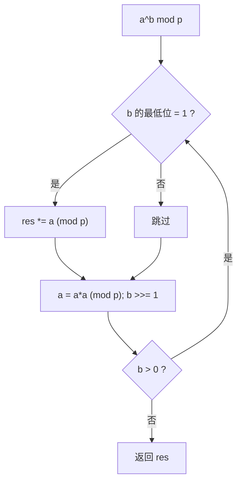

# 数学与数论

> GCD · 快速幂 · 模运算 · 质数筛 · 逆元 · 洗牌——后端高频数学工具箱

::: tip 🧠 一句话记忆锚点
**数论题的核心是"用整数运算的性质把暴力降复杂度"：GCD 用辗转相除 O(log)，幂用快速幂 O(log)，判质数/求质数用筛法把 O(n√n) 降到 O(n)，除法在模意义下要转成乘逆元（费马小定理 `a^(p-2)`）。防溢出的铁律——每步乘完立刻取模，必要时用 `__int128` 或先加后减。**
:::

## 场景问题

后端与算法面试里，"数学题"很少考高深定理，考的是**能不能把朴素做法优化到对数级或线性级**，以及**大数运算不溢出、除法在取模下正确**：

- 求两数最大公约数、判断互质 → 辗转相除，别去枚举因子
- 算 `a^b mod p`（RSA、组合数、哈希） → 快速幂，别循环乘 b 次
- 统计 1~n 的质数个数 → 筛法，别对每个数试除
- 组合数 `C(n,k) mod p` → 逆元，别真的做除法
- 抽奖/洗牌要求等概率 → Fisher-Yates，别用"随机交换 n 次"

这些都属于"知道套路就是几行，不知道就写出 TLE 或溢出"的题。

**打个比方（快速幂）**：算 `a¹³` 用不着老老实实连乘 13 次。把指数看成二进制凑硬币——你手上有面值 1、2、4、8 的硬币（每次把上一枚平方就翻倍得到下一枚），`13 = 8+4+1`，挑这三枚一乘就付清了，一共只动了 `log₂13 ≈ 4` 次手。筛质数同理：不是对每个数去试除，而是像点名一样，把 2 的倍数、3 的倍数一路划掉，剩下没被划的就是质数。**类比失效边界**：快速幂的"平方翻倍"只要求运算满足**结合律**（所以矩阵幂、模幂都能用），但两条铁律不能忘——每步乘完**立刻取模**防溢出，指数为负还得先转成**模逆元**再算。

## 实现方案

### 欧几里得：GCD 与 LCM

```cpp
long long gcd(long long a, long long b) {   // 辗转相除：gcd(a,b)=gcd(b, a%b)
    return b == 0 ? a : gcd(b, a % b);
}
long long lcm(long long a, long long b) {
    return a / gcd(a, b) * b;               // 先除后乘防溢出
}
```

原理：`gcd(a,b) = gcd(b, a mod b)`，每步至少把较大数减半量级，故 O(log(min(a,b)))。

### 快速幂与快速模幂

把指数按二进制拆分，`a^13 = a^8 · a^4 · a^1`，只需 log 次乘法：

```cpp
long long qpow(long long a, long long b, long long mod) {
    long long res = 1 % mod;
    a %= mod;
    while (b > 0) {
        if (b & 1) res = res * a % mod;     // 当前二进制位为 1，累乘
        a = a * a % mod;                    // 底数自乘（对应下一位的权）
        b >>= 1;
    }
    return res;
}
```



### 模运算性质与防溢出

模运算对加、减、乘封闭（除法不封闭，见逆元）：

```
(a + b) % p = ((a%p) + (b%p)) % p
(a * b) % p = ((a%p) * (b%p)) % p
(a - b) % p = ((a%p - b%p) % p + p) % p   // 减法先 +p 再取模，避免负数
```

铁律：**每做一次乘法立刻取模**；两个约 1e9 的数相乘会超 `int`，用 `long long`；两个约 1e18 的数相乘会超 `long long`，用 `__int128` 或龟速乘。

### 质数筛：埃氏筛与线性筛

```cpp
// 埃氏筛 O(n log log n)：每个合数被它的每个质因子各筛一次
std::vector<int> sieve(int n) {
    std::vector<bool> notPrime(n + 1, false);
    std::vector<int> primes;
    for (int i = 2; i <= n; i++) {
        if (!notPrime[i]) primes.push_back(i);
        for (long long j = (long long)i * i; j <= n; j += i) notPrime[j] = true;
    }
    return primes;
}

// 线性筛（欧拉筛）O(n)：保证每个合数只被其"最小质因子"筛一次
std::vector<int> linearSieve(int n) {
    std::vector<bool> notPrime(n + 1, false);
    std::vector<int> primes;
    for (int i = 2; i <= n; i++) {
        if (!notPrime[i]) primes.push_back(i);
        for (int p : primes) {
            if ((long long)i * p > n) break;
            notPrime[i * p] = true;
            if (i % p == 0) break;          // 关键：i 的最小质因子是 p，再乘更大质数会重复
        }
    }
    return primes;
}
```

### 质因数分解

```cpp
// 只需试除到 √n：n 至多有一个大于 √n 的质因子
void factorize(long long n) {
    for (long long d = 2; d * d <= n; d++)
        while (n % d == 0) { /* d 是一个质因子 */ n /= d; }
    if (n > 1) { /* 剩下的 n 是最后一个大质因子 */ }
}
```

### 组合数取模：费马小定理求逆元

模意义下没有除法，`a/b mod p` 要转成 `a · b⁻¹ mod p`。当 p 为质数且 `gcd(b,p)=1`，由费马小定理 `b^(p-1) ≡ 1`，故 `b⁻¹ = b^(p-2) mod p`：

```cpp
long long inv(long long b, long long p) { return qpow(b, p - 2, p); }  // p 为质数

long long C(int n, int k, long long p) {   // 预处理阶乘更佳，这里示意
    long long num = 1, den = 1;
    for (int i = 0; i < k; i++) { num = num * ((n - i) % p) % p; den = den * ((i + 1) % p) % p; }
    return num * inv(den, p) % p;
}
```

### 等概率洗牌：Fisher-Yates

```cpp
// 每一步从 [i, n) 里等概率选一个换到 i，保证 n! 种排列等概率
void shuffle(std::vector<int>& a) {
    for (int i = (int)a.size() - 1; i > 0; i--) {
        int j = rand() % (i + 1);           // 注意闭区间 [0, i]
        std::swap(a[i], a[j]);
    }
}
```

## 为什么这么做

- **为什么快速幂是 O(log b)**：指数二进制有 ⌊log b⌋+1 位，每位一次平方 + 至多一次乘，总乘法次数与位数同阶。
- **为什么线性筛是 O(n)**：每个合数只被它的**最小质因子**筛掉一次（`i % p == 0` 时 break 保证了这点），不像埃氏筛会被多个质因子重复标记。
- **为什么除法要用逆元**：整数取模环里 `/` 无定义，`(a/b) % p ≠ (a%p)/(b%p)`；只有把除法转成乘"模逆元"才正确，且要求 p 为质数（费马）或 b 与 p 互质（扩展欧几里得）。
- **为什么 Fisher-Yates 等概率**：第 i 步选中任一元素概率均为 `1/(i+1)`，逐步归纳可证每种排列出现概率恰为 `1/n!`；而"随机交换 n 次"会让某些排列概率偏高。

## 为什么别的选择不行

- **枚举因子求 GCD**：O(min(a,b)) 甚至更差，辗转相除 O(log) 碾压。
- **循环乘 b 次算幂**：b 可达 1e9~1e18，直接 TLE；且不取模会溢出。
- **对每个数试除判质数**：O(n√n) 统计质数个数，n=1e7 就超时；筛法 O(n)~O(n log log n)。
- **模意义下直接做整数除法**：结果错误（不是精度问题而是代数结构问题），必须逆元。
- **"随机交换若干次"洗牌**：非等概率，出老千式的偏差，工程上要求 Fisher-Yates 或库函数 `std::shuffle`。

## 沉淀结论

::: tip 速记
- GCD 辗转相除 O(log)；LCM = a/gcd·b（先除后乘）
- 快速幂/模幂 O(log b)，每步取模防溢出
- 质数：埃氏筛 O(n log log n) / 线性筛 O(n)；分解只到 √n
- 模下除法 = 乘逆元；p 质数用费马 `b^(p-2)`
- 等概率洗牌只认 Fisher-Yates
:::

### 面试高频题清单

- **Q：`a^b mod p` 怎么算不溢出不超时？** A：快速幂，指数二进制拆分 O(log b)，每次乘法后立刻 `% p`，底数用 `long long`。
- **Q：埃氏筛和线性筛区别？** A：埃氏筛 O(n log log n)，合数被多个质因子重复标记；线性筛 O(n)，靠 `i%p==0 break` 保证每个合数只被最小质因子筛一次。
- **Q：模意义下怎么做除法？** A：转成乘逆元；p 为质数时逆元 = `b^(p-2) mod p`（费马小定理），否则用扩展欧几里得。
- **Q：质因数分解为什么只试除到 √n？** A：n 最多有一个大于 √n 的质因子，试除到 √n 后剩下的若 >1 即那个大质因子。
- **Q：多数元素（出现超过 n/2）怎么 O(1) 空间？** A：Boyer-Moore 投票，维护候选 + 计数，相同 +1 不同 -1 归零换人。
- **Q：怎么等概率打乱数组？** A：Fisher-Yates，从后往前每步在 `[0,i]` 等概率选一个与 i 交换，保证 n! 排列等概率。

### 记忆口诀

- **GCD**：辗转相除 / `gcd(b, a%b)` / O(log)
- **幂**：二进制拆分 / 平方累乘 / 步步取模
- **筛**：埃氏重复标 / 线性最小质因子 / `i%p==0 break`
- **除法**：模下无除法 / 乘逆元 / 费马 `b^(p-2)`
- **洗牌**：Fisher-Yates / 闭区间 [0,i] / 等概率

## 内容来源

综合整理自高频面试题型（LeetCode 数学标签）与《算法导论》数论章节；代码为教学示意的 C++ 实现。

## 自测：合上资料能说清楚吗？

1. 快速幂为什么是 O(log b)？写出核心循环。

<details><summary>参考答案</summary>

指数 b 的二进制有约 `log b` 位，从低位到高位遍历：当前位为 1 就把 `res` 乘上当前底数，每轮底数自乘一次（对应权翻倍），`b >>= 1`。核心：`if(b&1) res=res*a%mod; a=a*a%mod; b>>=1;`。乘法次数与位数同阶，故 O(log b)。

</details>

2. 线性筛（欧拉筛）如何保证每个合数只被筛一次？关键那行是什么？

<details><summary>参考答案</summary>

内层遍历已知质数 `p`，标记 `i*p`；关键是 `if (i % p == 0) break;`。当 `p` 是 `i` 的**最小质因子**时停止，避免用更大的质数去乘 `i` 造成重复标记，从而每个合数只被其**最小质因子**筛一次，总复杂度 O(n)。

</details>

3. 为什么模意义下的除法要用逆元？质数模的逆元怎么求？

<details><summary>参考答案</summary>

取模环里除法无定义，`(a/b)%p ≠ (a%p)/(b%p)`。要把 `a/b mod p` 写成 `a·b⁻¹ mod p`。当 p 为质数且 `gcd(b,p)=1`，由**费马小定理** `b^(p-1)≡1 (mod p)`，得 `b⁻¹ = b^(p-2) mod p`，用快速幂求。

</details>

4. 大数相乘取模如何防溢出？

<details><summary>参考答案</summary>

**每次乘法后立刻取模**。两个约 1e9 的数相乘超 `int`，用 `long long`；两个约 1e18 的数相乘超 `long long`，用 `__int128` 或"龟速乘"（把乘法拆成加法 + 快速幂式倍增）。减法取模要 `((a-b)%p + p) % p` 避免负数。

</details>

5. Fisher-Yates 为什么等概率？"随机交换 n 次"错在哪？

<details><summary>参考答案</summary>

Fisher-Yates 从后往前，第 i 步在闭区间 `[0,i]` 等概率选一个换到 i，归纳可证每种排列概率恰为 `1/n!`。"随机交换 n 次"（每次随机两个下标交换）不是等概率——某些排列被生成的路径更多，分布有偏，属于经典的洗牌 bug。

</details>
