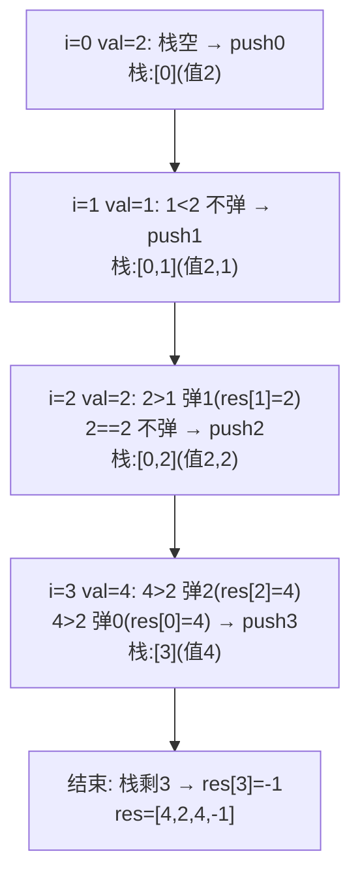
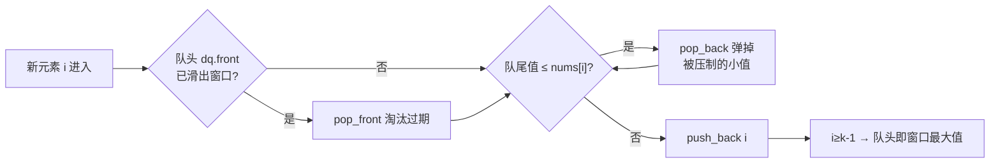

# 单调栈与单调队列

> 下一个更大/更小元素 · 每日温度 · 柱状图最大矩形 · 接雨水 · 股票跨度 · 滑动窗口最大值——统一 C++、含入栈出栈时序图

::: tip 🧠 一句话记忆锚点
**单调栈 = 一个"始终保持单调"的栈，专门回答"离我最近的、比我大/小的元素在哪"。核心不变量：新元素入栈前，把栈里所有"打破单调性"的元素弹出——而弹出的那一刻，正好确定了它们的答案。栈里存下标（而非值），才能算距离、取原值。求"下一个更大"用递减栈、求"下一个更小"用递增栈。单调队列（deque）是它的滑动窗口版：队头是窗口最值，队尾维护单调、队头淘汰过期下标。**
:::

## 场景问题

一类问题反复出现：**对每个元素，找它左边或右边第一个比它大（或小）的元素**。暴力对每个元素向两侧扫是 O(n²)。而"第一个更大/更小"具有强烈的**单调性结构**——如果 A 左边有 B、C 两个候选，B 在 C 左侧且 B ≤ C，那么 B 永远不可能成为任何右侧元素的"最近更大"答案（C 挡在前面且不更小）。这种"被后来者永久淘汰"的特性，正是**单调栈**能把复杂度压到 O(n) 的根源：每个元素**最多入栈一次、出栈一次**。

滑动窗口最值是它的"移动版"：窗口右移时新元素进、左端旧元素出，要 O(1) 拿到窗口内最大值——这就是**单调队列**（双端队列）。

## 实现方案

### 单调栈的不变量（存下标，不存值）

栈里**存下标**而非值，因为我们往往需要计算"距离"（下标之差）或回查原数组。以**单调递减栈**（栈底到栈顶递减）为例，用来求"下一个更大元素"：

- 遍历到 `nums[i]`，当栈非空且 `nums[stk.top()] < nums[i]` 时，**持续弹栈**；
- **弹出的瞬间**：栈顶那个元素找到了它的"下一个更大元素"，就是 `nums[i]`；
- 弹完后把 `i` 入栈。整个过程栈内下标对应的值**始终单调递减**。

```cpp
// 下一个更大元素：res[i] = 右边第一个比 nums[i] 大的值，没有则 -1
std::vector<int> nextGreater(const std::vector<int>& nums) {
    int n = nums.size();
    std::vector<int> res(n, -1);
    std::stack<int> stk;                       // 存"下标"，栈内对应值单调递减
    for (int i = 0; i < n; i++) {
        while (!stk.empty() && nums[stk.top()] < nums[i]) {
            res[stk.top()] = nums[i];          // 栈顶被 nums[i] 弹出 → 它的答案就是 nums[i]
            stk.pop();
        }
        stk.push(i);                           // i 入栈，维持递减
    }
    return res;                                // 留在栈里的没有更大元素，保持 -1
}
```

求"下一个更小元素"只需把弹出条件反向为 `nums[stk.top()] > nums[i]`（此时是**递增栈**）。

### 入栈出栈时序（nums = [2,1,2,4]，求下一个更大）



### 每日温度（模板的直接应用，求距离）

要"等几天才升温"，即"下一个更大元素的**下标距离**"。因为栈存的是下标，减一下即可：

```cpp
std::vector<int> dailyTemperatures(const std::vector<int>& T) {
    int n = T.size();
    std::vector<int> ans(n, 0);
    std::stack<int> stk;                       // 递减栈，存下标
    for (int i = 0; i < n; i++) {
        while (!stk.empty() && T[stk.top()] < T[i]) {
            ans[stk.top()] = i - stk.top();    // 距离 = 更暖那天下标 - 当天下标
            stk.pop();
        }
        stk.push(i);
    }
    return ans;                                // 栈里剩下的后面没有更暖的，保持 0
}
```

### 柱状图中最大的矩形（递增栈 + 哨兵）

对每根柱子，向左右扩展到"第一个比它矮的柱子"，宽度 × 高度即以它为高的最大矩形。用**递增栈**：遇到更矮的柱子就弹栈，弹出时该柱子的右边界确定、栈里新栈顶就是左边界。首尾加**哨兵 0** 免去边界判空：

```cpp
int largestRectangleArea(std::vector<int> h) {
    h.insert(h.begin(), 0);                    // 左哨兵：保证最终能弹空
    h.push_back(0);                            // 右哨兵：结束时清空栈
    std::stack<int> stk;                       // 递增栈，存下标
    int best = 0;
    for (int i = 0; i < (int)h.size(); i++) {
        while (!stk.empty() && h[stk.top()] > h[i]) {
            int top = stk.top(); stk.pop();    // top 遇到更矮的 h[i]，右边界=i
            int left = stk.top();              // 弹出后新栈顶即左边界（第一个更矮）
            int width = i - left - 1;          // 开区间宽度
            best = std::max(best, h[top] * width);
        }
        stk.push(i);
    }
    return best;
}
```

### 接雨水（单调栈"逐层"接水）

用**递减栈**，遇到更高的柱子时，栈顶是"凹槽底"，被弹出后新栈顶是左墙、当前柱是右墙，两墙较矮者减去底高即这一层的水位：

```cpp
int trap(const std::vector<int>& h) {
    std::stack<int> stk;                       // 递减栈，存下标
    int water = 0;
    for (int i = 0; i < (int)h.size(); i++) {
        while (!stk.empty() && h[stk.top()] < h[i]) {
            int bottom = stk.top(); stk.pop(); // 凹槽底
            if (stk.empty()) break;            // 没有左墙，接不住
            int left = stk.top();              // 左墙
            int w = i - left - 1;              // 宽度
            int hgt = std::min(h[left], h[i]) - h[bottom];  // 层高 = 两墙矮者 - 底
            water += w * hgt;
        }
        stk.push(i);
    }
    return water;
}
```

### 股票价格跨度（对"当前值"实时查左侧连续 ≤ 的天数）

跨度 = 从今天往前**连续小于等于今天价格**的天数。用**递减栈**存 `(价格, 该价格对应的跨度)`，新价格来时把 ≤ 它的元素弹出并累加它们的跨度：

```cpp
class StockSpanner {
    std::stack<std::pair<int,int>> stk;        // (price, span)，price 自底向顶递减
public:
    int next(int price) {
        int span = 1;
        while (!stk.empty() && stk.top().first <= price) {
            span += stk.top().second;          // 吞并被它压制的历史跨度
            stk.pop();
        }
        stk.push({price, span});
        return span;
    }
};
```

### 单调队列解滑动窗口最大值（deque）

窗口右移时，用**双端队列存下标**、对应值**单调递减**：队头永远是当前窗口最大值。新元素从队尾入，把队尾所有更小的弹掉（它们被新元素"永久压制"）；队头若已滑出窗口则从队头淘汰：

```cpp
std::vector<int> maxSlidingWindow(const std::vector<int>& nums, int k) {
    std::deque<int> dq;                        // 存下标，对应值单调递减，队头为最大
    std::vector<int> res;
    for (int i = 0; i < (int)nums.size(); i++) {
        if (!dq.empty() && dq.front() <= i - k) dq.pop_front();  // 队头过期（滑出窗口）
        while (!dq.empty() && nums[dq.back()] <= nums[i])
            dq.pop_back();                     // 队尾比新元素小 → 永无翻身之日，弹掉
        dq.push_back(i);
        if (i >= k - 1) res.push_back(nums[dq.front()]);         // 窗口成型后收集队头
    }
    return res;
}
```



## 为什么这么做

- **为什么每个元素最多进出栈一次 → O(n)**：入栈发生一次；一旦被弹出就永不回来。总弹出次数 ≤ 总入栈次数 = n，所以整体线性，尽管内层有 `while`。
- **为什么存下标而非值**：下标能同时反推原值（`nums[i]`）、算距离（每日温度、柱状图宽度）、判断是否过期（滑窗）。存值就丢了位置信息。
- **弹出的瞬间就是答案确定的瞬间**：递减栈里，某元素被弹出当且仅当来了个更大的——那个更大的正是它苦等的"下一个更大元素"。这把"寻找"转化为"被动触发"，是单调栈的精髓。
- **哨兵简化边界**：柱状图首尾补 0，保证左侧永有更矮墙、右侧强制清空栈，省去大量 `empty()` 特判。
- **单调队列 vs 单调栈**：栈只能一端进出，适合"一次遍历定答案"；滑动窗口两端都要操作（尾进、头出过期），故用**双端队列**。

## 为什么别的选择不行

- **暴力双重循环**：对每个元素向两侧找更大/更小是 O(n²)，n 到 1e5 就超时；单调栈用"淘汰"换来 O(n)。
- **优先队列（堆）解滑动窗口**：堆能取最大值但**删除过期元素**是 O(log n) 且需惰性删除，整体 O(n log n)；单调队列 O(n) 且常数更小。
- **前缀/后缀最值数组**：能解静态区间最值，但滑动窗口是**移动区间**，且"下一个更大元素"要的是**位置**而非区间聚合值，前缀数组答不了。
- **线段树/稀疏表**：能查任意区间最值，但为"下一个更大元素"这种**单向最近**问题杀鸡用牛刀，代码复杂、常数大。

## 沉淀结论

::: tip 速记
- 栈里**存下标**；求"下一个更大"用**递减栈**，"下一个更小"用**递增栈**
- 不变量：新元素入栈前，弹出所有打破单调性的栈顶——**弹出即答案确定**
- 每元素最多进出栈一次 → **O(n)**；柱状图/接雨水配**哨兵**免边界判断
- 滑动窗口最值用**单调队列（deque）**：队尾维护单调、队头淘汰过期、队头即最值
:::

### 面试高频题清单

- **Q：单调栈里存下标还是值？为什么？** A：存**下标**。可反查原值、算距离（每日温度、柱宽）、判过期（滑窗），存值就丢了位置。
- **Q：求"下一个更大元素"用递增还是递减栈？** A：**递减栈**（栈底到顶递减）；新元素更大时弹栈，被弹者的答案就是它。求更小则用递增栈、条件取反。
- **Q：为什么单调栈是 O(n) 而不是 O(n²)？** A：每个元素**最多入栈一次、出栈一次**，总操作 ≤ 2n，内层 while 的总次数被摊还。
- **Q：柱状图最大矩形为什么加哨兵？** A：左哨兵 0 保证任意柱都有更矮左界，右哨兵 0 结束时强制清空栈，省去边界判空。
- **Q：滑动窗口最大值为什么用 deque 而不是栈或堆？** A：窗口两端都要变（尾进、头淘汰过期），需**双端**操作；deque 保证 O(n)，堆是 O(n log n)。
- **Q：单调栈和双指针/滑动窗口如何分工？** A：滑窗解"满足某条件的连续子区间/聚合值"；单调栈解"每个位置的**最近更大/更小**"或需要**回溯历史极值**的题。

### 记忆口诀

- **存啥**：栈里存**下标**，回查值、算距离、判过期
- **方向**：更大用**递减**栈 / 更小用**递增**栈（弹出条件取反）
- **时机**：**弹出即答案确定**；每元素进出各一次 → **O(n)**
- **变体**：滑窗最值用**单调队列**——尾进保单调、头出淘过期、头即最值
- **技巧**：柱状图/接雨水补**哨兵 0**，边界不用特判

## 内容来源

综合整理自高频面试题型（LeetCode 单调栈/单调队列标签）；代码为教学示意的 C++ 实现。

## 自测：合上资料能说清楚吗？

1. 单调栈里到底存下标还是值？为什么这个选择很关键？

<details><summary>参考答案</summary>

存**下标**。因为往往要算**距离**（每日温度、柱状图宽度）、**回查原值**（`nums[i]`）、**判断是否过期**（滑动窗口）。只存值会丢失位置信息，这些都做不了。

</details>

2. 为什么单调栈的整体复杂度是 O(n)，尽管代码里有嵌套的 while 循环？

<details><summary>参考答案</summary>

因为每个元素**最多入栈一次、出栈一次**。一旦被弹出就永不回来，所以所有 while 弹出操作的总次数 ≤ 总入栈次数 = n。内层循环被**摊还**到线性，整体 O(n)。

</details>

3. 求"下一个更大元素"用递增栈还是递减栈？弹出的那一刻发生了什么？

<details><summary>参考答案</summary>

用**递减栈**（栈底到栈顶单调递减）。当新元素 `nums[i]` 大于栈顶对应值时弹栈——**弹出的瞬间**，被弹出的那个元素恰好找到了它的"下一个更大元素"，就是 `nums[i]`。求更小则改用递增栈、弹出条件取反。

</details>

4. 柱状图最大矩形为什么要在首尾加哨兵 0？

<details><summary>参考答案</summary>

左哨兵 0 保证任意柱子左侧**永远有一个更矮的墙**，弹出时新栈顶就是左边界，不会栈空；右哨兵 0 保证遍历结束时**强制把栈清空**、结算所有剩余柱子。两者一起**省掉全部边界判空**。

</details>

5. 滑动窗口最大值为什么用单调队列（deque）而不是单调栈或堆？它和单调栈的分工是什么？

<details><summary>参考答案</summary>

窗口两端都要变——新元素从**队尾**进、过期元素从**队头**淘汰——需要**双端**操作，栈只有一端，所以用 **deque**。堆虽能取最大值但删除过期元素是 O(log n)、整体 O(n log n)，单调队列是 O(n)。分工上：**单调栈**解"每个位置的最近更大/更小元素"（一次遍历被动定答案），**滑动窗口/双指针**（见 [双指针与滑动窗口](./two-pointers-sliding-window.md)）解"满足条件的连续子区间"，而**单调队列**是滑窗需要区间最值时的加强版。

</details>