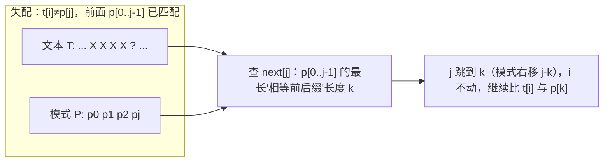
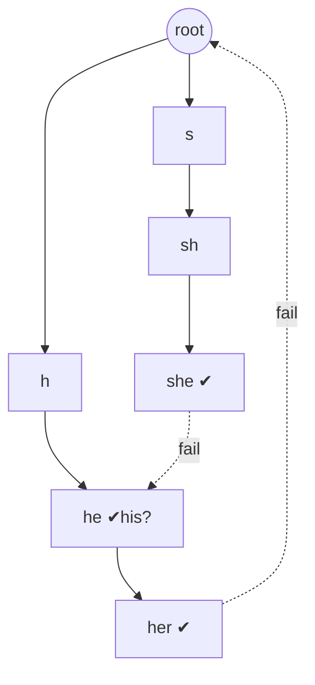

# 字符串匹配

> 暴力 · KMP · Rabin-Karp · Z 函数 · Trie / AC 自动机——统一 C++、含匹配过程图

::: tip 🧠 一句话记忆锚点
**字符串匹配 = 在文本 T（长 n）里找模式 P（长 m）。暴力逐位比 O(nm)，失配从头再来。KMP 靠 next 数组记住"P 自身前后缀的最长匹配"，失配时模式串不回退文本指针、直接跳到 next 处，整体 O(n+m)。Rabin-Karp 用滚动哈希把子串比较降到 O(1)，靠哈希碰撞再二次校验。多模式匹配用 Trie 建字典、AC 自动机在 Trie 上补 fail 指针一次扫完。**
:::

## 场景问题

在长文本 T 中查找模式 P 首次（或全部）出现的位置——`strStr`、敏感词过滤、DNA 序列比对、编辑器查找。核心矛盾是：**暴力法失配后把文本指针也退回重来，做了大量重复比较**。所有优化算法都在回答同一个问题——**失配时，已经比对成功的那段信息能不能复用，从而让文本指针永不回退？**

- 单模式：KMP（确定性 O(n+m)）、Rabin-Karp（哈希，平均 O(n+m)）、Z 函数。
- 多模式（一次找一堆词）：Trie + AC 自动机。

## 实现方案

### 暴力匹配（Brute Force）

对齐文本每个起点 i，逐字符比对 P；一旦失配，i 前进 1、模式指针归零重来。

```cpp
int bruteForce(const std::string& t, const std::string& p) {
    int n = t.size(), m = p.size();
    for (int i = 0; i + m <= n; i++) {          // 枚举每个对齐起点
        int j = 0;
        while (j < m && t[i + j] == p[j]) j++;   // 逐字符比对
        if (j == m) return i;                    // 全部匹配
    }                                            // 失配：i++ 重来，文本指针回退到 i+1
    return -1;
}
```

最坏 O(nm)：如 T=`"aaaa...a"`、P=`"aaa...b"`，每个起点都要比到最后一位才失配。浪费在于——比对 `t[i..i+m-1]` 成功了一大截，失配后这段信息被完全丢弃。

### KMP：为什么文本指针不用回退



关键洞察：`p[0..j-1]` 这段已经和 `t[i-j..i-1]` 完全相等。若 `p[0..j-1]` 有长为 k 的"相等前后缀"（前缀 `p[0..k-1]` == 后缀 `p[j-k..j-1]`），那这个前缀天然也和文本对齐，无需重比——直接令 `j=k`。`next[j]` 就存这个 k。

**next 数组构造**（本质是 P 自己和自己做 KMP；`next[i]` = 前缀 `p[0..i-1]` 的最长相等前后缀长度）：

```cpp
std::vector<int> getNext(const std::string& p) {
    int m = p.size();
    std::vector<int> next(m + 1, 0);
    next[0] = next[1] = 0;
    for (int i = 1; i < m; i++) {
        int k = next[i];                    // 已知 p[0..i-1] 的最长前后缀
        while (k > 0 && p[i] != p[k]) k = next[k];
        next[i + 1] = (p[i] == p[k]) ? k + 1 : 0;
    }
    return next;
}

int kmp(const std::string& t, const std::string& p) {
    if (p.empty()) return 0;
    auto next = getNext(p);
    int n = t.size(), m = p.size(), j = 0;
    for (int i = 0; i < n; i++) {          // i 只增不减：文本指针永不回退
        while (j > 0 && t[i] != p[j]) j = next[j];  // 失配：模式跳到 next[j]
        if (t[i] == p[j]) j++;             // 匹配：模式前进
        if (j == m) return i - m + 1;      // 找到，返回起点
    }
    return -1;
}
```

**为何整体 O(n+m)**：`getNext` 是 O(m)，`kmp` 主循环是 O(n)。看似有内层 while，但用**摊还分析**：`j` 每次 `if` 最多 +1（全程加了不超过 n 次），而 while 里 `j=next[j]` 每次严格减小，减少的总量不超过增加的总量。所以两个指针合计移动 O(n) 步。加上构造，共 O(n+m)。

### Rabin-Karp：滚动哈希

把长度 m 的子串映射成一个数（多项式哈希，进制 base、模 mod）。窗口右移一位时，**去掉最高位、乘 base、加入新低位**，O(1) 更新哈希，只有哈希相等才逐字符校验。

```cpp
int rabinKarp(const std::string& t, const std::string& p) {
    int n = t.size(), m = p.size();
    if (m > n) return -1;
    const long long base = 131, mod = 1000000007LL;
    long long ph = 0, th = 0, power = 1;    // power = base^(m-1) % mod
    for (int i = 0; i < m; i++) {
        ph = (ph * base + p[i]) % mod;      // 模式哈希
        th = (th * base + t[i]) % mod;      // 首窗口哈希
        if (i) power = power * base % mod;
    }
    for (int i = 0; i + m <= n; i++) {
        if (ph == th) {                     // 哈希相等 → 可能匹配
            if (t.compare(i, m, p) == 0)    // 二次校验，排除哈希碰撞
                return i;
        }
        if (i + m < n) {                    // 滚动：滑到下一窗口
            th = (th - t[i] * power % mod + mod) % mod;  // 去掉最高位
            th = (th * base + t[i + m]) % mod;           // 乘 base 加新位
        }
    }
    return -1;
}
```

**哈希碰撞处理**：两不同子串哈希相等的概率约 1/mod。防碰撞三招——① 哈希相等后**逐字符 compare 校验**（必须，保证正确性）；② mod 取大质数、base 取质数；③ 更稳则用**双哈希**（两组 (base,mod)，都相等才校验）。平均 O(n+m)，最坏（大量碰撞或恶意构造）退化到 O(nm)。

### Z 函数 / 扩展 KMP 概览

Z 函数：`z[i]` = 字符串 s 从位置 i 开始的后缀与 s 自身的**最长公共前缀长度**。维护一个当前最靠右的匹配区间 `[l, r]`，i 落在区间内时可用 `z[i-l]` 复用信息，O(1) 初始化再暴力延伸，整体 O(n)。

```cpp
std::vector<int> zFunction(const std::string& s) {
    int n = s.size();
    std::vector<int> z(n, 0);
    z[0] = n;
    int l = 0, r = 0;                       // 当前最右匹配段 [l, r]
    for (int i = 1; i < n; i++) {
        if (i < r) z[i] = std::min(r - i, z[i - l]);  // 复用已算信息
        while (i + z[i] < n && s[z[i]] == s[i + z[i]]) z[i]++;  // 暴力延伸
        if (i + z[i] > r) { l = i; r = i + z[i]; }    // 更新最右段
    }
    return z;
}
// 匹配应用：对 "P + 分隔符 + T" 求 Z，某位置 z 值 == m 即命中，等价于 KMP 的 O(n+m)。
```

扩展 KMP（exkmp）在此基础上求"T 每个后缀与 P 的最长公共前缀"，是 Z 函数的直接推广，用于更复杂的匹配/周期问题。

### Trie / AC 自动机多模式匹配概览

Trie（字典树）把多个模式串按公共前缀合并成一棵树，查询/插入 O(单词长)。AC 自动机 = Trie + 类 KMP 的 **fail 指针**（失配时跳到"当前后缀能匹配的最长其他模式前缀"），一次扫描文本即可找出**所有**模式串的所有出现，复杂度 O(n + 总模式长 + 命中数)。



fail 指针用 BFS 逐层构建（父节点的 fail 已知时推子节点），与 KMP 的 next 是同一思想在"树"上的推广：next 在一条链上跳，fail 在 Trie 上跳。

### 经典题：strStr / 重复子字符串 / 最短回文串

```cpp
// 28. 实现 strStr()：直接 KMP（上面的 kmp 即答案）

// 459. 重复的子字符串：s 能由某子串重复≥2次拼成？
// 结论：设 m=len，最长相等前后缀 k=next[m]，若 m%(m-k)==0 且 k>0 则可。
bool repeatedSubstring(const std::string& s) {
    int m = s.size();
    auto next = getNext(s);
    int k = next[m];                       // 整串的最长相等前后缀长度
    return k > 0 && m % (m - k) == 0;      // (m-k) 是最小循环节长度
}

// 214. 最短回文串：只在 s 前面加字符使其成回文。
// 找 s 的"最长回文前缀"，剩余部分反转补到前面。
// 技巧：构造 str = s + '#' + reverse(s)，求整体 next[len]，
//       其值即最长回文前缀长度（KMP 求最长相等前后缀）。
std::string shortestPalindrome(const std::string& s) {
    std::string rev(s.rbegin(), s.rend());
    std::string comb = s + '#' + rev;
    auto next = getNext(comb);
    int longestPrefix = next[comb.size()]; // s 的最长回文前缀长度
    std::string add(s.begin() + longestPrefix, s.end());
    std::reverse(add.begin(), add.end());
    return add + s;
}
```

## 为什么这么做

- **为什么 KMP 文本指针不回退**：`p[0..j-1]` 已匹配上 `t[i-j..i-1]`，失配时利用 P 自身的"相等前后缀"信息，直接把模式滑到对齐处，`i` 无需回头。文本每个字符至多被"有效比较"常数次，故 O(n)。
- **为什么 Rabin-Karp 用滚动哈希**：把 O(m) 的子串比较压成 O(1) 的整数比较；滑窗时增量更新哈希而非重算，全程 O(n)。碰撞用 compare 兜底保证正确性。
- **为什么 next / fail / z 本质同源**：三者都在"复用已匹配的前缀信息"——KMP 在模式链上、Z 在自身上、AC 在 Trie 树上，都是"失配时跳到最长可复用前缀"。

## 为什么别的选择不行

- **暴力法**：O(nm)，在退化输入（大量重复字符）下极慢；丢弃了已比对成功的信息。
- **只用哈希不校验**：哈希碰撞会误报，必须逐字符 compare；否则正确性不保证。
- **多模式串跑多次 KMP**：k 个模式各扫一遍是 O(k·n)，AC 自动机一次扫描 O(n + Σm)，公共前缀还被合并，明显更优。
- **正则引擎**：通用但常数大、可能回溯爆炸（catastrophic backtracking）；固定模式匹配用 KMP/AC 更可控。

## 沉淀结论

::: tip 速记
- 暴力 O(nm)；KMP/Z O(n+m)；Rabin-Karp 平均 O(n+m)、最坏 O(nm)
- KMP 核心：next[i] = 前缀 `p[0..i-1]` 的最长相等前后缀长度；失配 `j=next[j]`，i 不回退
- 最小循环节 = m - next[m]；若 m 整除它则串由循环节重复而成
- 哈希必须二次校验；多模式用 AC 自动机（Trie + fail）
:::

### 面试高频题清单

- **Q：暴力匹配为什么慢，慢在哪？** A：失配后文本指针回退到 i+1 重来，已成功比对的一段信息被丢弃，最坏 O(nm)。
- **Q：KMP 的 next 数组含义？怎么构造？** A：`next[i]` 是前缀 `p[0..i-1]` 的最长相等前后缀长度；构造是 P 对自身做 KMP，O(m)。
- **Q：为什么 KMP 整体 O(n+m)？** A：摊还分析——`j` 累计自增不超过 n，while 里 `j=next[j]` 累计自减不超过自增量，两指针合计移动 O(n)，加构造 O(m)。
- **Q：Rabin-Karp 如何 O(1) 更新窗口哈希？如何防碰撞？** A：去最高位、乘 base、加新低位；哈希相等后逐字符校验，必要时用双哈希。
- **Q：如何判断字符串由某子串重复构成？** A：`k=next[m]`，若 `k>0 && m%(m-k)==0`，则 `m-k` 是最小循环节，能整除即可。
- **Q：多模式匹配用什么？AC 自动机的 fail 指针类比 KMP 什么？** A：AC 自动机；fail 类比 next——失配时跳到当前后缀能匹配的最长模式前缀，只是从链推广到 Trie。

### 记忆口诀

- **四算法**：暴力 O(nm) / KMP 与 Z 是 O(n+m) / RK 哈希平均 O(n+m)
- **KMP 心法**：next 记前后缀 / 失配跳 next / 文本指针不回退
- **哈希心法**：滚动 O(1) 更新 / 相等必校验 / 防碰撞用双哈希
- **循环节**：最小循环节 = m − next[m] / m 整除它则可重复拼成
- **多模式**：Trie 建字典 / fail 补失配 / 一遍扫全部命中

## 内容来源

综合整理自 LeetCode 字符串标签与《算法导论》；C++ 教学代码。

## 自测：合上资料能说清楚吗？

1. 暴力匹配的最坏复杂度是多少？在什么输入下触发？浪费在哪里？

<details><summary>参考答案</summary>

O(nm)。触发于大量重复字符、如 T=`"aaaa...a"`、P=`"aaa...b"`，每个起点都要比到末位才失配。浪费在于——每次失配后**文本指针回退**、已成功比对的一大段信息被完全丢弃、重复比较。

</details>

2. KMP 的 `next[i]` 是什么含义？为什么失配时令 `j = next[j]` 就能让文本指针不回退？

<details><summary>参考答案</summary>

`next[i]` = 前缀 `p[0..i-1]` 的**最长相等前后缀**长度。失配时 `p[0..j-1]` 已和 `t[i-j..i-1]` 相等，其长为 k 的相等前缀天然也与文本对齐，故 `j=next[j]=k` 直接复用，`i` 无需回退、继续比 `t[i]` 与 `p[k]`。

</details>

3. 为什么 KMP 整体是 O(n+m) 而不是有内层 while 就变 O(nm)？

<details><summary>参考答案</summary>

**摊还分析**：`j` 在 `if` 里每次至多 +1，全程累计自增不超过 n；while 里 `j=next[j]` 每次严格减小，累计自减不超过累计自增量。故两指针合计移动 O(n)，加 next 构造 O(m)，共 O(n+m)。

</details>

4. Rabin-Karp 如何 O(1) 完成窗口哈希更新？哈希相等就一定匹配吗？

<details><summary>参考答案</summary>

滑窗时**减去最高位贡献、整体乘 base、加入新低位**即可增量更新，O(1)。哈希相等**不一定**匹配（哈希碰撞），必须逐字符 `compare` 二次校验；更稳用**双哈希**降低误判概率。

</details>

5. 给定串 s，如何用 next 数组判断它能否由某子串重复≥2 次拼成？最小循环节是多少？

<details><summary>参考答案</summary>

设 `m=len`、`k=next[m]`（整串最长相等前后缀）。**最小循环节长度 = m − k**。若 `k>0 且 m % (m−k) == 0`，则 s 由该循环节重复而成；否则不能。

</details>
