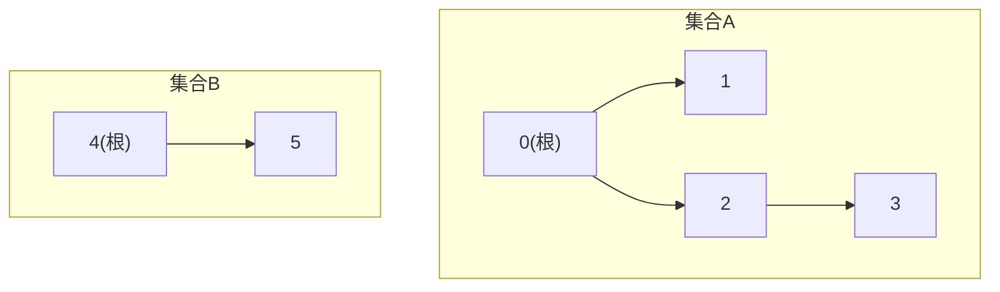
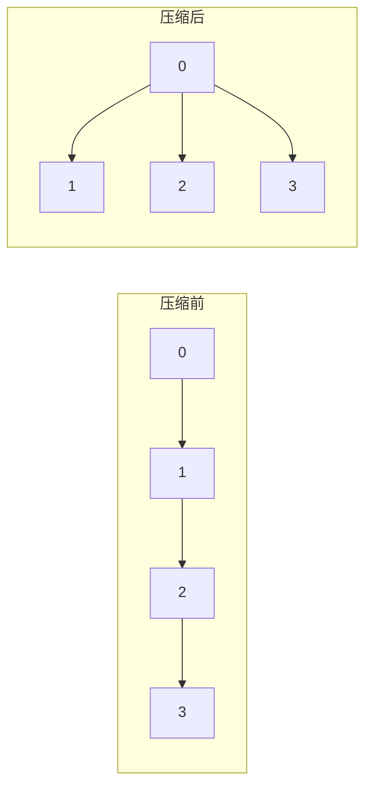

# 并查集

> 按秩/按大小合并 · 路径压缩 · 连通分量计数 · 岛屿/冗余连接/账户合并 · 带权并查集——统一 C++、含 α(n) 复杂度直觉

::: tip 🧠 一句话记忆锚点
**并查集 = 维护"谁和谁在同一组"的森林：每个元素指向父亲，同一棵树 = 同一集合，树根就是集合的代表元。两个核心操作——`find(x)` 找根（顺带路径压缩，把路径上所有点直接挂到根下）、`union(a,b)` 合并（按秩/按大小把矮树挂到高树下）。两招都上，单次操作近似 O(α(n))，α 是阿克曼反函数，n 到宇宙原子数它也 ≤4，等于常数。**
:::

## 场景问题

问题长这样：给一堆元素和若干"这两个是一伙的"关系，反复问"**这两个现在是不是同一组**？"或"**一共有几组**？"——朋友圈、网络连通性、图的连通分量、判断加边是否成环。

朴素做法：用数组标记组号，合并时把一组的组号全改成另一组——单次合并 O(n)，m 次操作 O(nm)，太慢。图论里也能用 BFS/DFS 求连通分量，但那是**静态**一次性遍历；一旦关系**动态增量到来**（边一条条加、边加边查），每来一条边都重跑一遍 DFS 就爆炸了。

并查集专治**动态连通性**：几乎常数时间地"合并两组"和"查询是否同组"，且天然维护连通分量个数。

**打个比方**：并查集就像"认帮派老大"。每个人只记得自己的**直接上级**，要问"咱俩是不是一伙的"，两人各自顺着上级往上问，一直问到最顶头的大哥，比一比大哥是不是同一个——这就是 `find`。**路径压缩**是精髓：问过一次之后，干脆让沿途每个小弟都直接拜顶头大哥当上级，下次再问一步到位。**按秩/按大小合并**则是两帮并伙时，让人少的小帮头子去认人多的大帮头子当大哥（而非反过来），免得队伍越拉越长、辈分树越长越高。**类比失效边界**：现实帮派能分裂、能反水，但标准并查集**只支持"合并"、不支持"拆分"**——删边/降级极难。真要动态删边，得换更重的家伙（离线按时间倒放，或 Link-Cut Tree）。

## 实现方案

### 数据结构：森林

每个集合是一棵树，元素指向父亲，根节点的父亲是自己。判断同组 = 两点的根相同。



### 朴素版本：只有 find + union

```cpp
struct DSU {
    std::vector<int> parent;
    explicit DSU(int n) : parent(n) {
        for (int i = 0; i < n; i++) parent[i] = i;   // 初始各自成组，父亲是自己
    }
    int find(int x) {                                // 一路往上找根
        while (parent[x] != x) x = parent[x];
        return x;
    }
    void unite(int a, int b) {
        parent[find(a)] = find(b);                   // 把 a 的根挂到 b 的根下
    }
    bool same(int a, int b) { return find(a) == find(b); }
};
// 隐患：树可能退化成链，find 变 O(n)
```

### 优化一：路径压缩（find 时把路径压扁）

find 的过程中，把沿途每个节点直接指向根，下次再查就是 O(1)：

```cpp
int find(int x) {
    if (parent[x] != x) parent[x] = find(parent[x]); // 递归回溯时改父指针 = 全挂到根下
    return parent[x];
}
// 迭代 + 路径减半（half-path compression，无递归栈，工程更稳）：
int findIter(int x) {
    while (parent[x] != x) {
        parent[x] = parent[parent[x]];               // 让 x 指向祖父，路径长度减半
        x = parent[x];
    }
    return x;
}
```

压缩前后对比（find(3) 之后，3、2 全被挂到根 0 下）：



### 优化二：按秩 / 按大小合并（矮挂高）

合并两棵树时，别乱挂——把**矮的挂到高的**下面，树高才不会无谓增长：

```cpp
struct DSU {
    std::vector<int> parent, rank_, size_;
    int count;                                       // 当前连通分量个数
    explicit DSU(int n) : parent(n), rank_(n, 0), size_(n, 1), count(n) {
        for (int i = 0; i < n; i++) parent[i] = i;
    }
    int find(int x) {
        if (parent[x] != x) parent[x] = find(parent[x]);
        return parent[x];
    }
    // 按秩合并：rank 近似树高（因路径压缩会变矮，故只当"上界估计"，不严格更新）
    bool unite(int a, int b) {
        int ra = find(a), rb = find(b);
        if (ra == rb) return false;                  // 已同组，返回 false（可用于判环）
        if (rank_[ra] < rank_[rb]) std::swap(ra, rb); // 保证 ra 是较高的树
        parent[rb] = ra;                             // 矮树 rb 挂到高树 ra
        size_[ra] += size_[rb];
        if (rank_[ra] == rank_[rb]) rank_[ra]++;      // 等高合并，高度 +1
        --count;                                      // 每成功合并一次，分量数 -1
        return true;
    }
    bool same(int a, int b) { return find(a) == find(b); }
    int compSize(int x) { return size_[find(x)]; }    // 所在连通分量大小
};
```

> 按秩 vs 按大小二选一即可：**按秩**用估计树高、**按大小**用子树节点数（`if (size_[ra] < size_[rb]) swap`）。两者都能把树高压到 O(log n)，配合路径压缩后达到近似常数。

### 连通分量计数

无需最后扫一遍：初始 `count = n`（各自一组），每成功 `unite` 一次 `--count`。任意时刻 `count` 就是当前组数。若只有 find/union 没维护 count，可最后统计 `find(i)==i` 的根个数。

## 为什么这么做

- **为什么 O(α(n)) 近似常数**：只用路径压缩或只用按秩，单次是 O(log n)；**两者同时用**，均摊复杂度是 O(α(n))，α 是阿克曼函数 A(n,n) 的反函数——它增长极慢，A(4,4) 已是天文数字，所以对任何现实规模 n，α(n) ≤ 4。直觉：路径压缩让树越用越扁，按秩合并让树一开始就长不高，两招叠加使"高树"几乎不可能出现，find 几乎不走弯路。
- **为什么按秩不严格维护真实树高**：路径压缩会偷偷压矮树，精确追踪树高代价高且没必要，rank 作为**高度上界**已足够引导"矮挂高"，均摊分析依然成立。
- **为什么维护 size**：很多题要"最大连通分量"（如岛屿最大面积、账户合并后每组人数），顺手在合并时累加，O(1) 查询。

## 为什么别的选择不行

- **朴素数组标组号**：合并要遍历改组号，单次 O(n)，m 次操作 O(nm)，动态场景下慢到不可用。
- **BFS/DFS 求连通分量**：适合**一次性、静态**求所有分量；但若关系是**流式增量**（边一条条来、边加边查），每次加边重跑遍历是 O(V+E) 每次，总复杂度爆炸。并查集把"合并 + 查询"都摊到近似常数。
- **哈希表存组集合**：合并两组要把小集合元素逐个搬进大集合，仍是 O(小集合大小)，最坏 O(n)；森林结构改一个父指针即可。
- **反过来——什么时候别用并查集**：需要**删边**、需要求**最短路径/具体路径**、需要**二分图判定的详细结构**时，并查集只知"连不连"不知"怎么连"，该用 BFS/DFS 或专门算法。详见 [图论](./graph.md)——**只问连通性、且边只增不删、动态增量** → 并查集；**要遍历路径、求距离、拓扑序、或一次性静态分析** → BFS/DFS。

## 经典题应用

### 岛屿数量（网格连通分量）

把二维网格每个陆地格当节点，编号 `r*cols+c`；相邻陆地 `unite`。答案 = 陆地格构成的连通分量数。

```cpp
int numIslands(std::vector<std::vector<char>>& grid) {
    int rows = grid.size(), cols = grid[0].size();
    DSU dsu(rows * cols);
    int water = 0;
    for (int r = 0; r < rows; r++)
        for (int c = 0; c < cols; c++) {
            if (grid[r][c] == '0') { water++; continue; }
            int id = r * cols + c;
            if (r + 1 < rows && grid[r + 1][c] == '1') dsu.unite(id, id + cols);
            if (c + 1 < cols && grid[r][c + 1] == '1') dsu.unite(id, id + 1);
        }
    return dsu.count - water;   // 总分量减去每个单独成组的水格
}
// 说明：只需向右、向下合并即可覆盖所有相邻对；水格各自成组要从 count 里扣掉
```

### 冗余连接（判断加边成环）

一棵树加一条边成环，找出那条多余的边。`unite` 返回 false 就说明两端已连通，这条边即答案：

```cpp
std::vector<int> findRedundant(std::vector<std::vector<int>>& edges) {
    DSU dsu(edges.size() + 1);              // 节点从 1 编号
    for (auto& e : edges)
        if (!dsu.unite(e[0], e[1])) return e; // 合并失败 = 两端本已同组 = 成环边
    return {};
}
```

### 账户合并（按邮箱归并）

同一人的多个账户靠"共享邮箱"关联。把每个邮箱映射到账户下标，同账户内邮箱互相 union，跨账户共享邮箱时也会被 union 到一起：

```cpp
// 思路：
// 1) 每个账户一个 id（下标）。
// 2) 用 map<邮箱, id> 记录邮箱首次出现的账户；再次出现则 unite(当前id, 已记录id)。
// 3) 遍历所有邮箱，按 find(id) 归组，组内邮箱排序，拼上名字输出。
// 关键：并查集把"通过邮箱间接相连"的账户传递地并成一组（连通性天然传递）。
```

### 被围绕的区域（反向标记 + 虚拟节点）

把所有边界上的 'O' 及其连通的 'O' 与一个**虚拟根**合并；最后凡是没和虚拟根连通的 'O' 都被围绕，翻成 'X'。虚拟节点是并查集处理"是否与边界相连"的常用技巧。

```cpp
// 技巧：设一个 dummy = rows*cols 作为"边界代表"。
// 边界的 'O' 与 dummy 合并；内部相邻的 'O' 互相合并。
// 结束后 same(cell, dummy) 为真 → 该 'O' 通向边界，保留；否则被围，改 'X'。
```

### 最长连续序列（并查集解法）

`[100,4,200,1,3,2]` 最长连续 `[1,2,3,4]` 长度 4。把值放进哈希，若 `x+1` 存在就 `unite(x, x+1)`，答案 = 最大连通分量的 size：

```cpp
int longestConsecutive(std::vector<int>& nums) {
    std::unordered_map<int, int> idx;         // 值 -> 下标
    for (int i = 0; i < (int)nums.size(); i++) idx[nums[i]] = i;
    DSU dsu(nums.size());
    for (int i = 0; i < (int)nums.size(); i++)
        if (idx.count(nums[i] + 1)) dsu.unite(i, idx[nums[i] + 1]); // 与后继连成一片
    int best = 0;
    for (int i = 0; i < (int)nums.size(); i++) best = std::max(best, dsu.compSize(i));
    return best;
}
// 注：本题更经典的是 O(n) 哈希做法（只从"无前驱"的数往后数）；并查集解法胜在直观且能扩展
```

## 带权并查集概览

普通并查集只知"同不同组"，**带权并查集**额外维护每个点**到其父亲的权值**（如差值、比率、奇偶偏移），从而回答"a 与 b 的相对关系是多少"。典型题：食物链（3 类循环捕食）、除法求值（a/b=2、b/c=3 求 a/c）。

```cpp
// 维护 rank_ 换成 diff[x] = "x 相对父亲的偏移"（这里以差值为例）
int find(int x) {
    if (parent[x] == x) return x;
    int root = find(parent[x]);
    diff[x] += diff[parent[x]];      // 路径压缩时同步累加偏移量，改挂到根后偏移仍正确
    parent[x] = root;
    return root;
}
void unite(int a, int b, int w) {    // 约束：val[a] - val[b] = w
    int ra = find(a), rb = find(b);
    if (ra == rb) return;            // 同组时可校验 diff[a]-diff[b]==w 判矛盾
    parent[ra] = rb;
    diff[ra] = diff[b] + w - diff[a]; // 令合并后差值关系自洽
}
```

要点：路径压缩时权值要**沿路径累加**，合并时按向量关系推导根间权值。比率型（除法求值）把加减换成乘除即可。

## 沉淀结论

::: tip 速记
- 两大操作：`find`（找根 + 路径压缩）、`unite`（按秩/按大小 矮挂高）
- 两优化同时上 → 均摊 O(α(n)) ≈ 常数（α 是阿克曼反函数，现实规模 ≤4）
- `count` 初始为 n，每成功 unite 一次 `--count` = 实时连通分量数
- `unite` 返回 false（已同组）→ 天然用来**判环**（冗余连接）
- 网格题把 `(r,c)` 编号成 `r*cols+c`；"是否连边界"用**虚拟节点**
- 要相对关系（差值/比率）→ 带权并查集，路径压缩时累加权值
:::

### 面试高频题清单

- **Q：路径压缩和按秩合并各解决什么？为什么要一起用？** A：按秩合并让树初始就长不高（O(log n)），路径压缩让查过的路径变扁；两者叠加把均摊复杂度压到 O(α(n)) 近似常数，单用其一只是 O(log n)。
- **Q：O(α(n)) 里的 α 是什么，为什么算常数？** A：阿克曼函数 A(n,n) 的反函数，增长极慢；对任何现实 n（乃至天文数字）α(n) ≤ 4，工程上视为常数。
- **Q：并查集怎么判断加一条边是否成环？** A：`unite` 前先 `find` 两端，若已同根说明再连就成环——即冗余连接的答案，也是 Kruskal 最小生成树里去环的手段。
- **Q：并查集 vs BFS/DFS 求连通分量，怎么选？** A：静态一次性求所有分量用 BFS/DFS；**动态增量**（边一条条加、边加边查）用并查集，均摊近似常数，避免每次重跑遍历。
- **Q：能维护"最大连通分量大小"吗？删边呢？** A：合并时累加 `size` 即可 O(1) 查最大分量；但并查集**不支持删边**（拆树代价高），删边场景需别的结构（如离线 + 逆序、LCT）。
- **Q：带权并查集解决什么？关键实现点？** A：维护点到父的相对权值（差值/比率），回答"a、b 相对关系"；关键是路径压缩时**沿途累加权值**、合并时按向量关系推导根间权值（食物链、除法求值）。

### 记忆口诀

- **两操作**：find 找根压路径 / unite 矮树挂高树
- **两优化**：路径压缩 + 按秩(按大小)合并 → 均摊 O(α(n)) ≈ 常数
- **分量数**：count 起于 n / 每合并成功减一
- **判环**：unite 返回 false = 已同组 = 成环
- **网格**：二维压一维 `r*cols+c` / 连边界用虚拟节点
- **进阶**：要相对关系上"带权" / 要删边并查集不行

## 内容来源

综合整理自 LeetCode 并查集标签与《算法导论》（不相交集合，Disjoint-Set Forests）；代码为教学示意的 C++ 实现。

## 自测：合上资料能说清楚吗？

1. 并查集的 `find` 和 `unite` 各做什么？路径压缩具体怎么压？

<details><summary>参考答案</summary>

`find(x)` 沿父指针找到集合的**根**（代表元），判断同组即比较两点的根。`unite(a,b)` 把两点所在树合并。**路径压缩**：在 find 递归回溯时，把路径上**每个节点的父指针直接改指向根**（或迭代版让节点指向祖父，路径减半），使这条路径下次查询接近 O(1)。

</details>

2. 为什么"路径压缩 + 按秩合并"能达到近似 O(α(n))？α(n) 为什么算常数？

<details><summary>参考答案</summary>

**按秩合并**让矮树挂高树，树高天然 O(log n)；**路径压缩**让访问过的路径变扁。两者叠加使高树几乎不出现，均摊复杂度降到 O(α(n))。α 是**阿克曼函数的反函数**，增长极慢——对任何现实规模乃至天文数字的 n，α(n) ≤ 4，故视为常数。单用其一只能到 O(log n)。

</details>

3. 如何用并查集实时维护连通分量个数？如何判断加边是否成环？

<details><summary>参考答案</summary>

`count` 初始化为 n（各自一组），每次 **`unite` 成功合并**（两端不同根）就 `--count`，任意时刻 count 即当前分量数。**判环**：`unite` 前 `find` 两端，若**已同根**（`unite` 返回 false）说明再加这条边就成环——冗余连接的答案、Kruskal 去环的依据。

</details>

4. 岛屿数量、被围绕的区域这类网格题，用并查集要注意哪些技巧？

<details><summary>参考答案</summary>

把二维坐标 `(r,c)` **映射成一维下标** `r*cols+c` 作为并查集元素；只向**右、下**两个方向尝试合并即可覆盖全部相邻对（避免重复）。被围绕的区域用**虚拟节点**技巧：建一个"边界超级节点"，把所有与边界连通的 `O` 都 `unite` 到它，最后没连到该节点的 `O` 才被翻转。网格题并查集常被 BFS/DFS 平替，但**动态加边**（边逐条到来）时并查集更自然。

</details>

5. 什么时候该用并查集，什么时候该用 BFS/DFS？

<details><summary>参考答案</summary>

**并查集**擅长**动态**连通性：边不断加入、反复查询"两点是否连通/有几个分量"，且**不关心具体路径**——近似 O(α(n)) 极快。**BFS/DFS** 擅长**静态**图上要**遍历路径、求最短路、求具体连通分量成员、拓扑序**等。一句话：只问"连没连、几块"用并查集；要"怎么连、走多远"用 BFS/DFS。详见 [图论](./graph.md)。

</details>
