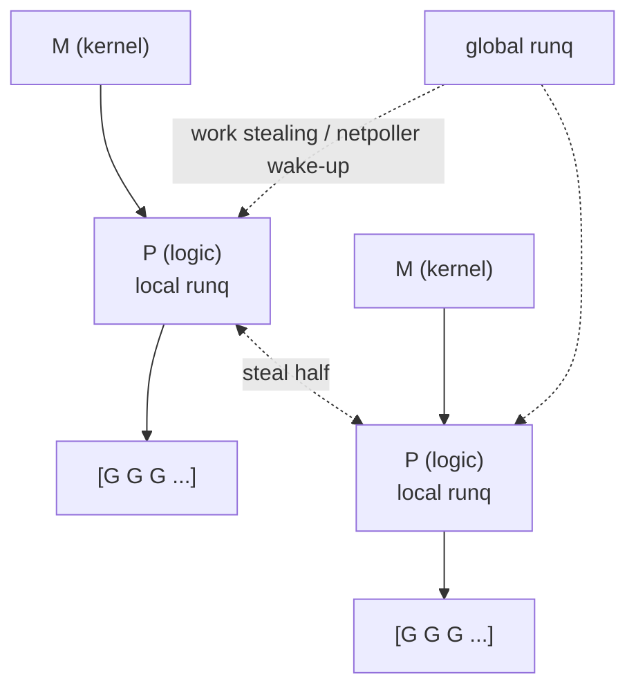

# 并发模型 · 进程 / 线程 / 协程

> 多进程 vs 多线程 vs 协程 · 调度器与内存模型 · 上下文切换成本

::: tip 一句话对比
**进程**：资源隔离最强、切换最贵；**线程**：共享地址空间、切换适中、最容易死锁数据竞争；**协程**：用户态调度、极轻量、天生适合 I/O 密集，需要运行时/语言支持。选型公式：**CPU 密集用进程/线程池 + Pin CPU；I/O 密集用协程；游戏用单线程无锁 + 帧循环**。
:::

## 场景问题

### 三种并发单位对照表

| 维度 | 进程 (Process) | 线程 (Thread) | 协程 (Coroutine) |
| --- | --- | --- | --- |
| **地址空间** | 独立 (fork/CoW) | 同进程内共享 | 同线程内共享 |
| **调度方** | 内核 | 内核 (1:1) 或用户态 (M:N) | **用户态**（语言运行时/库） |
| **切换成本** | ~µs 级：TLB flush + 页表切 | ~百 ns：寄存器+内核栈 | ~十 ns：栈指针 + 少量寄存器 |
| **创建成本** | 重（fork/exec） | 中（默认栈 1~8MB） | 轻（初始栈 2~8KB，Go 可动态增长） |
| **通信方式** | IPC / Pipe / Shm / Socket | 共享内存 + 锁 / 无锁结构 | Channel / async-await / share |
| **故障隔离** | 一个崩不影响别的 | 一个 panic 全进程挂 | 一个 panic 通常也全挂（除非 recover） |
| **代表** | Nginx worker / Redis / PostgreSQL | Java / C++ / MySQL / Envoy | Go goroutine / Python asyncio / Kotlin |

### 内核态 vs 用户态调度

- **1:1 (Kernel Thread)**：Linux `pthread`、Java 线程；每个用户线程对应一个内核线程，切换要陷内核
- **N:1 (User Thread)**：早期 Green Thread；一堆用户线程绑一个内核线程，一个 syscall 阻塞全组
- **M:N (Hybrid)**：**Go GMP**、Erlang、Rust `tokio`；M 个内核线程调度 N 个协程，兼顾并行与轻量
- **Coroutine over syscall**：用户态运行时把阻塞 syscall 换成 `epoll`/`io_uring`，让协程遇到 I/O 时**不阻塞内核线程**
## 实现方案

### Go GMP 调度模型（面试高频）

- **G (Goroutine)**：用户协程，栈 2~8KB 起步，可动态扩展至 1GB
- **M (Machine)**：OS 内核线程，与 G 是 M:N
- **P (Processor)**：逻辑处理器，持有本地 runq (最多 256 G)，个数由 `GOMAXPROCS` 决定

**调度关键机制**：
- **Work Stealing**：某 P 的 runq 空了，从别的 P 偷一半 G 过来跑
- **Handoff**：M 陷入 syscall 时，P 会与 M 解绑并绑到另一个空闲 M，避免 syscall 阻塞其他 G
- **Preemption（抢占）**：Go 1.14 引入**基于信号的异步抢占**——防止死循环 G 独占 P 导致 GC / STW 卡住；此前只在函数调用点检查抢占标志，纯计算循环卡死过
- **网络轮询器 netpoller**：`epoll_wait`/`kqueue`/IOCP 集中处理，把就绪 socket 唤醒对应 G

### GMP 抽象图

```text
  ┌──────────────┐  ┌──────────────┐
  │  M (kernel)  │  │  M (kernel)  │  ...
  └──────┬───────┘  └──────┬───────┘
         │                 │
  ┌──────▼───────┐  ┌──────▼───────┐
  │  P (logic)   │  │  P (logic)   │  个数 = GOMAXPROCS
  │  local runq  │  │  local runq  │
  │  [G G G ...] │  │  [G G G ...] │
  └──────────────┘  └──────────────┘
         │                 │
         └────────┬────────┘
          global runq  ◄── work stealing / netpoller wake-up
```



### 其它主流协程/异步生态

- **Python asyncio**：单线程 event loop + `async/await`；GIL 存在使多线程 CPU 密集无并行；协程适合 I/O
- **Kotlin Coroutine**：CPS 编译期变换，`suspend` 函数不阻塞线程；`Dispatchers.IO/Default/Main` 分池
- **Rust async**：`tokio`/`async-std`，Future 是零成本抽象；`Send/Sync` 编译期保证并发安全
- **Erlang/Elixir Process**：BEAM 虚拟机上"进程"是超轻量协程（几百字节）；每个进程独立堆，无共享，靠消息传递
- **C++20 coroutine**：语言级 `co_await/co_return`，但生态尚不统一
- **微信服务器框架 mmcoroutine / libco**：hook syscall + `ucontext`，让同步风格代码底下跑异步

## 为什么这么做

### 内存模型 & 可见性

- **volatile ≠ 原子**：C/C++ 里 `volatile` 只保证不被优化掉，**不保证跨 CPU 可见性**；要用 `std::atomic` 或 `memory_order_*`
- **Happens-Before**：Java JMM / Go memory model / C++ memory_order 都用这个抽象刻画"A 的写对 B 的读一定可见"
- **CPU Cache Line 64B**：**False Sharing 伪共享**——两个变量在同一 cacheline，两核心分别写会互相 invalidate，性能骤降；解法：**填充到 64B 对齐**（Java `@Contended`、Go 手动 pad）

### 同步原语选型

- **Mutex**：短临界区首选
- **RWMutex**：读多写少；写饥饿风险，写等待时禁止新读者
- **Spin Lock**：临界区极短、SMP 多核；单核纯浪费 CPU
- **信号量 (Semaphore)**：计数型，控制并发度（如连接池 `chan struct{}{}` 版）
- **Condvar**：等-通知语义，配合 mutex 用；一定循环判断谓词，防伪唤醒
- **无锁结构 (Lock-Free)**：CAS + ABA 问题（用带 tag 的 pointer 或 hazard pointer 解决）
- **RCU**：Linux 内核里读多写少的极致方案——**读端零开销**，写端复制修改后原子指针切换
## 为什么别的选择不行

### 并发经典事故

- **死锁四条件**：互斥 + 持有并等待 + 不可抢占 + **循环等待**——破一个即可
- **优先级反转**：低优线程持锁，高优被中优抢占间接卡住 → **优先级继承 (PI)**
- **惊群 (Thundering Herd)**：多个 worker 都 `accept()`，一个连接来全被唤醒；Linux 3.9+ `SO_REUSEPORT` 让内核只唤醒一个
- **协程泄漏**：goroutine 阻塞在无缓冲 channel 上永不返回 → context 超时 + 用 `chan struct{}` 控退出
- **锁粒度过粗**：一把大锁保护整张 map → **分段锁 / `sync.Map`** / 每 shard 一把锁
- **锁粒度过细**：多把锁必须按固定顺序获取，否则互相持有对方锁死锁

### 上下文切换开销的量级

- 进程切换：**~几 µs**（TLB flush、页表、寄存器、cache 冷）
- 线程切换（同进程）：**~百 ns 到 1 µs**（省了地址空间切）
- 协程切换：**~10~100 ns**（纯用户态，只切栈指针 + 关键寄存器）
- **暗成本**：切换后 CPU cache 冷、TLB miss；把相关任务 pin 在同一 CPU 反而快（`taskset` / `sched_setaffinity`）

## 沉淀结论

### 选型决策

| 场景 | 推荐 | 理由 |
| --- | --- | --- |
| CPU 密集计算 | **进程池 / 线程池，个数 = 物理核** | 避免过多切换；**Amdahl 定律**决定收益上限 |
| I/O 密集网络 | **协程 + epoll**（Go/Rust/Python asyncio） | 几万连接一个进程扛得住 |
| 需要强隔离/多语言 | **多进程**（Nginx worker / Redis） | 一个崩不影响别的 |
| 游戏世界服 | **单线程无锁 + 帧循环** | 强状态耦合、加锁反而慢；瓶颈在 CPU 计算 |
| 多任务但共享大内存 | **多线程 + 分段锁 / RCU** | 避免多进程复制大堆 |

### 游戏 vs 互联网后台的并发模式选择

- **游戏后台**：世界状态高度耦合（AOE、扣血、buff），**单线程无锁 tick 循环** 20~60Hz，副本用 sharding 分服 → 关键是"减少跨线程状态同步"
- **互联网后台**：请求彼此独立，DB 是瓶颈 → **协程池 + 连接池 + 异步刷盘**
- **共同点**：**热点数据本地化**（NUMA aware / thread local / per-P cache），减少跨核共享

## 内容来源

迁移自 guide/theme-concurrency（综合整理）

> 综合整理：Go runtime 源码、Java Concurrency in Practice、Linux 内核调度器（2026-07）

