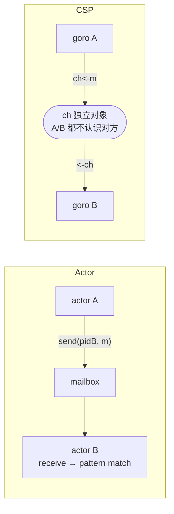
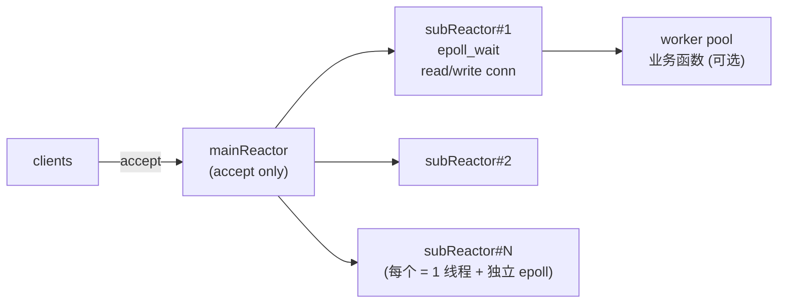

# 设计模型 · Actor / CSP / Reactor / 同步异步

一句话地图：同步/异步 vs 阻塞/非阻塞是「维度」；Reactor/Proactor/Actor/CSP/EventLoop 是「工程模型」，两者组合出真正的架构。

## 场景问题

::: tip 为什么单独一个专题
面试常问「你说 Go 是 CSP，为什么不是 Actor？」「Nginx 是 Reactor 还是 Proactor？」「同步 = 阻塞吗？」——这些不是并发原语（那些在**并发模型**专题），而是**上层的协作/交互模型**。搞清楚模型，才能一句话回答架构选型。
:::

### 两组正交维度：先把词分清楚

很多人把「同步/阻塞」混着说，其实是**两个正交维度**：
- **同步 vs 异步**：调用方**要不要等结果**——同步就地拿返回值；异步先拿一个 future/callback，结果晚点通过回调/轮询/队列送来
- **阻塞 vs 非阻塞**：调用**遇到 IO 未就绪时**做什么——阻塞就把当前线程挂起；非阻塞立刻返回 `EAGAIN`/`EWOULDBLOCK`

**四象限**（以读 socket 为例）：
- 同步阻塞：`read()` 默认；一直等到有数据
- 同步非阻塞：`read()` + `O_NONBLOCK`；没数据立即返回，**要自己轮询**（浪费 CPU）
- 异步阻塞（少见）：`select()`/`epoll_wait` 本身阻塞等**任一 fd 就绪**——严格说是「多路复用」，不是纯异步
- **异步非阻塞**：`io_uring` / Windows IOCP / `aio_read`；提交请求后立刻走人，内核完成后通知/写完成队列——**才是真正的异步 IO**

**Linux 的坑**：`epoll`+`O_NONBLOCK` 从来都**不是**异步 IO，是**同步非阻塞 + 就绪通知**——真正把「读」这个 syscall 交给内核异步做的，只有 `io_uring`（5.1+）和 POSIX AIO（少用）。

```text
                    ┌────────────── 同步 ──────────────┐  ┌────────── 异步 ──────────┐
                    │  调用方等结果                     │  │  调用方拿 future/callback │
                    ├──────────────┬────────────────────┤  ├──────────────────────────┤
    阻塞            │ read() 默认   │ epoll_wait 阻塞等   │  │ (少见, aio 阻塞变种)     │
    (线程挂起)      │ (最普通)      │ 就绪 (多路复用)     │  │                          │
                    ├──────────────┼────────────────────┤  ├──────────────────────────┤
    非阻塞          │ read()+       │ epoll+O_NONBLOCK    │  │ io_uring / IOCP / aio    │
    (立即返回)      │ EAGAIN 轮询   │ (Reactor 常态)      │  │ (真正的异步 IO)          │
                    └──────────────┴────────────────────┘  └──────────────────────────┘
```

## 实现方案

### 主流协作/交互设计模型

| 模型 | 一句话 | 状态所有权 | 通信方式 | 代表 |
|---|---|---|---|---|
| **Reactor** | 同步就绪通知 + 用户态派发 | 共享（同事件循环内） | 事件回调 (readable/writable) | Nginx / Netty / libevent / Redis (单 EL) |
| **Proactor** | 异步完成通知 + 用户态派发 | 共享（同事件循环内） | 完成事件 (read done) | Windows IOCP / Boost.Asio (Windows) |
| **Actor** | 一个 actor = 一个邮箱 + 私有状态 | **每 actor 独占** | **异步消息**（send/receive） | Erlang/Elixir / Akka / Orleans |
| **CSP** | goroutine + channel，通信通过通道而非共享内存 | **每 goroutine 独占** | **同步 channel**（发送方等接收） | Go / Occam / Clojure core.async |
| **Event Loop** | 单线程轮询 + 回调，天生串行 | 共享（单线程内） | 任务队列 + microtask | Node.js / Chrome / Redis 单 EL / GUI 主线程 |
| **SEDA** | Stage 化事件驱动，每级独立线程池 + 队列 | Stage 内共享 | Stage 间**队列** | Cassandra 早期 / Storm / 写死的流水线 |
| **Half-Sync/Half-Async** | 前端异步 IO 收包，后端同步池处理 | 分层 | IO 层→worker 队列 | Envoy 早期版本 / 部分 RPC 框架 |
| **Leader/Follower** | 一个线程当 leader 收包，收到后升为 worker，另一线程接任 leader | 轮流独占 | 角色轮转 + 少量共享队列 | ACE 框架 / 一些高性能 RPC |
| **Master-Worker** | Master 负责 accept + 分发，Workers 干活 | Master 全局，Worker 独占 | Master→Worker 队列 / socket 传递 | Nginx 多 worker / Gunicorn / prefork |
| **Pipeline** | 一条数据经过多阶段依次加工 | Stage 独占 | **背压 channel** | Netty ChannelPipeline / Rust tokio-tower / ETL |
| **Pub/Sub** | 发布者写 topic，订阅者独立消费 | 解耦 | **topic + 订阅关系** | Kafka / Redis Pub/Sub / Lua signal |

### Actor 与 CSP 的核心区别（面试爱问）

别只答「一个用 mailbox 一个用 channel」——**核心是耦合方向**：

| 维度 | Actor | CSP |
|---|---|---|
| **通道所有权** | mailbox 属于**接收方 actor**，每个 actor 一个 | channel 是**独立第一类对象**，可传递、可关闭 |
| **寻址方式** | **发送方要有目标 actor 的引用/PID** | 发送方只认识 channel，**不知道对面是谁** |
| **发送语义** | **异步**：send 立刻返回；邮箱满时策略不同（Akka=丢/Erlang=阻塞） | **同步**（无缓冲）：发送方等接收方就位；带缓冲时才异步 |
| **匹配语义** | 消息类型模式匹配 (`receive do ... end`) | select 多路 case，**同时可读/写多个 channel** |
| **典型单元** | 每 actor 一个 goroutine 级别的进程 | goroutine + channel，channel 是显式对象 |

**一句话**：Actor **知道给谁发**，CSP **知道往哪发**。

**为什么 Go 是 CSP 不是 Actor**：Go 的 goroutine 没有内建 mailbox，也没有 PID；`ch <- msg` 是**面向 channel** 的。虽然可以用 goroutine + 一个专属 chan 模拟 actor，但那是**在 CSP 之上实现 Actor**。



```text
  === Actor ===                          === CSP ===

  ┌────────┐  send(pidB, m)              ┌────────┐   ch<-m
  │ actor A│───────────────►┌───────┐    │ goro A │────────►┌─────┐  <-ch  ┌────────┐
  └────────┘                │mailbox│    └────────┘         │ ch  │───────►│ goro B │
                            │       │                       └─────┘        └────────┘
                            └───┬───┘
                                ▼
                          ┌────────┐
                          │ actor B│  receive → pattern match
                          └────────┘
                                              ↑ ch 是独立对象；A/B 都不认识对方
```

### Reactor 详解 · 三种变体

**Reactor = 事件多路复用（epoll/kqueue）+ 就绪回调派发**——它是**同步**模型（IO 还是自己 read/write，只是内核只在就绪时喊你）。

- **单 Reactor 单线程**（Redis 6 之前的主流）：一个线程跑 event loop + 处理所有回调；简单，但一个慢回调堵住整个进程
- **单 Reactor 多线程**（早期 Netty）：Reactor 只做 accept + read；业务处理丢线程池；缺点是**每个连接的读写还在 Reactor 线程**，读写多时仍打爆
- **主从 Reactor**（Nginx / Netty 主流 / Redis 6+ IO 多线程）：**一个 mainReactor 负责 accept**；分派到多个 subReactor（每个绑一个线程），subReactor 负责各自连接的整个 IO 生命周期；业务再丢 worker 池

**Proactor 与 Reactor 的差别**在**是谁 read**：Reactor 是「就绪 → 你去 read」；Proactor 是「你先说要 read 到某 buffer → 内核搞完 → 通知你 buffer 好了」。Linux 上 **io_uring** 让 Proactor 真正落地。



```text
         accept()                     ┌── subReactor#1 ─┐   ┌── worker pool ─┐
  clients ─────► mainReactor ────────►│ epoll_wait      │──►│ 业务函数 (可选) │
                 (accept only)        │ read/write conn │   └────────────────┘
                       │              └─────────────────┘
                       ├──────────────► subReactor#2
                       ├──────────────► subReactor#3    (每个 subReactor = 1 线程 + 独立 epoll)
                       └──────────────► subReactor#N
```

### Event Loop 与「宏任务/微任务」（前端 & Node）

**Event Loop = 单线程 + 队列 + 事件驱动**，本质是最简单的 Reactor 变体。

**Node.js 阶段（每轮 tick 顺序）**：
1. **Timers**：到期的 `setTimeout`/`setInterval`
2. **Pending callbacks**：延迟到下轮的 IO 回调
3. **Idle/Prepare**：内部
4. **Poll**：`epoll_wait` 收 IO；这里可能阻塞
5. **Check**：`setImmediate` 回调
6. **Close callbacks**：`socket.on('close')` 等

每一步之间**清空 microtask 队列**（`process.nextTick`、Promise then）。

**浏览器**：宏任务（script、setTimeout、MessageChannel、UI 事件）+ 微任务（Promise、MutationObserver、queueMicrotask）；**每次宏任务结束都清空所有微任务**——所以微任务饿死宏任务是常见 bug（无限 `Promise.resolve().then(...)`）。

### SEDA / Pipeline / Half-Sync-Half-Async

- **SEDA (Staged Event-Driven Architecture)**：Matt Welsh 2001 论文；把服务拆成多个 stage，每 stage 独立线程池 + 队列，观察队列长度**自动扩缩容 stage 线程数**——早期 Cassandra 用过。缺点是队列多、上下文切换密
- **Pipeline**：类似 SEDA 但强调**顺序**和**背压**——上游快下游慢时，channel 满会阻塞上游；Netty 的 `ChannelPipeline` 是最经典实现
- **Half-Sync/Half-Async**：ACE 框架总结的模式——**IO 层做异步/事件驱动**（收包），**worker 层做同步阻塞**（业务）。中间用队列解耦。**Envoy** 早期版本本质就是这个：libevent 收包 + worker 线程池处理请求

### Master-Worker / Leader-Follower

- **Master-Worker (Prefork)**：Nginx / Gunicorn / Apache prefork——**Master 只做管理**（信号、配置 reload、worker 存活），**Workers 各自 accept**（Linux 3.9+ `SO_REUSEPORT` 内核负载均衡；老内核靠 `accept` mutex 或惊群）。**故障隔离好**（一个 worker crash 不影响别的），**内存共享靠 fork 时的 CoW**
- **Leader-Follower**：ACE 提出的高性能模式——**只有 leader 线程持锁 `epoll_wait`**；收到事件后**升级为 worker**、把 leader 角色交给一个 follower；处理完事件后回队排 follower。避免了「多个线程同时 `epoll_wait`」的惊群和上下文切换。适合**极短 CPU 处理**的高并发场景

### Pub/Sub · Fan-out

**Pub/Sub 与 Actor/CSP 的差别**在**寻址粒度**：
- Actor 是 **1 → 1 定向**（有 PID）
- CSP channel 是 **N → M 匿名**
- Pub/Sub 是 **1 → N 广播**：发布者只管往 topic 写，订阅者自主拉/推

**关键实现分野**：
- **消息中间件式**（Kafka）：**日志式**——消息按 offset 存磁盘，订阅者独立维护 offset，可**回放**
- **总线式**（Redis Pub/Sub）：**内存瞬时**——订阅前发布的消息**丢失**，无历史
- **总线增强版**（Redis Streams / RabbitMQ）：既有历史又能广播，靠 consumer group 分工消费

## 为什么这么做

### 选型公式：先看状态耦合，再看 IO 密集度

```text
状态强耦合（同一玩家/同一订单多条消息串行）？
  ├─ 是 → Actor / 单线程 event loop（每 actor 独占状态）
  └─ 否 →
        IO 密集？
          ├─ 是 → CSP / Reactor（协程 + 多路复用）
          └─ 否 → 线程池 + 分段锁（CPU 密集）

需要跨节点？（分布式）
  ├─ 是 → Actor（Erlang/Akka Cluster） 或 消息队列 + 无状态服务
  └─ 否 → 单机上述模型即可

要不要背压？
  ├─ 要 → CSP（channel 阻塞）/ Pipeline / Reactive Streams（onBackpressure*）
  └─ 不要 → Actor 邮箱容忍溢出策略 / Pub/Sub 丢消息
```

### 不同后台的默认设计

- **游戏世界服**：Actor + 单 tick 循环——每玩家 = 一个 actor（或每场景 = 一个 actor），私有状态，异步消息驱动，天然串行；跨玩家操作用 send。**这就是我 6 年游戏后台的默认模型**
- **MMO 场景服**：Actor + 分区（Sharding）——每 shard 一 actor，AOI 广播用 pub/sub 表达「这条消息给附近所有人」
- **互联网 API 服务**：主从 Reactor + Half-Sync/Half-Async——Netty/Gin/FastAPI 的默认路数；协程池处理业务；DB 是瓶颈
- **Nginx / 反向代理**：Master-Worker + Reactor（epoll）；每 worker 一个 event loop，处理成千连接
- **Redis**：**Redis 6 之前是单 event loop**（Reactor），Redis 6+ 加了 IO 多线程但**命令执行仍单线程**——串行化保证原子性
- **Kafka Broker**：Reactor（网络层 SocketServer）+ 队列 + 磁盘顺序写；Producer/Consumer 都是 pub/sub 上层协议
- **Erlang / Elixir 服务**：Actor 全套；BEAM VM 每进程独立堆、消息拷贝、抢占式调度、supervisor tree
- **Node.js**：单线程 event loop + libuv 线程池（DNS/文件 IO）；IO 密集完美，CPU 密集要 worker_threads
- **tRPC-Go / gRPC-Go**：CSP——每请求一 goroutine，channel 做请求上下文传递；tRPC-Cpp 用 fiber + Reactor

### 为什么游戏用 Actor / 单线程 tick，不用协程池？

面试高频对答：

**问**：为什么游戏后台不像互联网那样用协程池打 DB？
**答**：
1. **状态强耦合**：一个玩家的血量、buff、背包是**共享可变状态**；协程 + 锁比单线程 tick 慢（锁争用 + cache 冷）；单 tick 天生串行
2. **AOE / 联动**：一次 AOE 可能改 100 个玩家状态，跨协程锁**排列组合就是死锁的温床**
3. **确定性**：同 seed 同输入 → 同结果——录像回放、跨服校验都靠这个；协程调度非确定，无法保证
4. **瓶颈在 CPU 计算**：技能公式、寻路、AI，不是 IO；**协程收益不大**

**Actor 化拆分**：世界服→场景 actor→玩家 actor；跨场景交互（组队邀请、跨服匹配）走消息 + 中央路由。

### Reactor 家族选型

- **单 Reactor 单线程**：连接数 <1w、业务极轻——**Redis 5** 就够；一个 event loop 干完所有
- **单 Reactor 多线程**：**不推荐**——read/write 仍在 event loop 线程，容易撞瓶颈
- **主从 Reactor**：**通用生产选择**——Netty/Nginx/Envoy 都是；连接数几十万无压力
- **Reactor + IO 多线程**（Redis 6）：只把网络 IO 拆多线程，**命令执行仍单线程**——保原子性又提高吞吐
- **Proactor (io_uring)**：**新贵**——Linux 5.1+，把系统调用批量提交、批量收结果，减少 syscall 次数；**ScyllaDB / Redpanda / Envoy 新版**都在用

### 同步 vs 异步 API 设计

- **同步 API**（`String read()`）：调用方好写；但**要么阻塞线程**（浪费），**要么让调用方跑在协程里**（Go 天然做到；Java 靠虚拟线程 Loom 补）
- **异步 API**（`Future<String> readAsync()` / `callback(err, data)`）：不阻塞线程；但要处理 **callback hell**、**取消传播**、**背压**
- **async/await**：语法糖——把异步写成同步风格；底下仍是状态机 + 回调
- **响应式（Reactor Pattern in Reactive Streams / RxJava）**：**Publisher/Subscriber + 背压 request(n)**——比裸 callback 多了操作符和背压协议

## 为什么别的选择不行

### Reactor 事件循环慢回调堵住

- **典型症状**：一个 handler 里跑了 10ms 的 JSON 解析或加密——**整个 event loop 阻塞**，连接超时雪崩
- **根因**：Reactor 的核心假设是「所有回调都很快」；破坏就完蛋
- **填坑**：
  1. CPU 密集操作**扔独立线程池**（Netty 的 `DefaultEventExecutorGroup`、Node 的 `worker_threads`）
  2. **切分大回调**——用 `setImmediate`/`setTimeout(0)` 让 loop 有喘息
  3. 观测 event loop 延迟（Node 的 `perf_hooks.monitorEventLoopDelay`、Netty 的 `DefaultEventLoop` 指标），**慢回调 P99 > 1ms 就是警报**

### Actor 邮箱堆积

- **场景**：一个热点 actor（大主播/公会 boss）每秒收 10w 消息，处理只 1w/s → 邮箱疯长 → 内存 OOM
- **填坑**：
  1. **有界邮箱**：Akka `bounded-mailbox`、Erlang `process_flag(message_queue_data)`——满了走策略：**丢**、**降级**、**背压 (让发送方阻塞)**
  2. **分片**：热点 actor 一拆多——按玩家 ID hash 分 N 个子 actor，前面加路由 actor
  3. **优先队列**：区分「必处理」和「可丢弃」（心跳可丢，交易必处理）
  4. **背压反馈**：让上游看到邮箱长度，主动降速

### CSP channel 泄漏与死锁

- **场景 1（泄漏）**：goroutine 阻塞在无缓冲 channel 上永不返回——因为发送方已崩溃/超时退出，接收方永远等
  - 修复：**永远配 `context.Context`**：`select { case v := <-ch: ... case <-ctx.Done(): return }`
- **场景 2（死锁）**：A 写 `ch1` 等 B 读，B 写 `ch2` 等 A 读，两边**同时无缓冲发送**
  - 修复：**发送方之间约定顺序**，或用**带缓冲 channel**，或用 `select` 加 `default` 兜底
- **场景 3（closed panic）**：往已关闭的 channel 写 → panic
  - 修复：**发送方 close**（唯一发送方原则）；接收方用 `v, ok := <-ch` 检查关闭

### Event Loop starvation（微任务饿死宏任务）

- **场景**：`Promise.resolve().then(loop)` 里递归 `then`——微任务队列永远有活，宏任务（timer / IO）永远等不到
- **表现**：Node 服务响应停滞，但 CPU 100%
- **修复**：**长循环用 `setImmediate` 让出**（进宏任务队列）；或用 `await new Promise(r => setImmediate(r))`
- **通用规则**：微任务只做**极短同步收尾**，别放实际业务

### Master-Worker 惊群与不均衡

- **老内核惊群**：多 worker 共享 listen fd，一个连接来 → **所有 worker 被唤醒**，只有一个成功 `accept`，其它白醒
  - 现代 Linux 3.9+：**`SO_REUSEPORT`** 每 worker 独立 listen，内核层负载均衡；Nginx `reuseport on;`
- **worker 不均衡**：某 worker 卡在慢连接，其它闲——观察 `nginx status` / prometheus 每 worker 的 accept 数
  - 填坑：短连接场景 `SO_REUSEPORT` 天然均衡；长连接得配**主动断连或 conn 均衡**（HAProxy/L4 层）

### Pub/Sub 消息丢失与顺序

- **Redis Pub/Sub 丢消息**：订阅者断连再连，中间发布的**没了**——因为 Redis Pub/Sub 是**内存瞬时广播**，无历史
  - 填坑：换 **Redis Streams**（有 offset）或 **Kafka**
- **Kafka 分区顺序 vs Topic 顺序**：**同一 partition 有序，跨 partition 无序**——按业务 key hash 到同一 partition（同用户订单打一 partition）
- **Consumer group 重复消费**：consumer crash 前没 commit offset → rebalance 后新 consumer 从上次 commit 处重放
  - 填坑：**下游必须幂等**（订单 ID 唯一 + 数据库 upsert）

### SEDA / Pipeline 队列爆掉

- **典型症状**：某个 stage 处理慢 → 前置 stage 队列越堆越长 → 内存 OOM 或超时雪崩
- **填坑**：
  1. **有界队列 + 背压**：Netty `ChannelOption.WRITE_BUFFER_WATER_MARK`、Reactive Streams `request(n)`
  2. **限流**：入口层拒绝新请求（限流器主题里的令牌桶）
  3. **观测**：每 stage 队列深度打指标；P95 队列长度是核心信号
  4. **降级**：非核心 stage 直接丢（按业务优先级）

## 沉淀结论

### 面试话术：把设计模型和实际系统绑一起

**别只答概念**，一定要把模型和你实际做过的系统绑起来讲：

- 「我做过的**游戏世界服是 Actor 模型 + 单 tick 循环**——每玩家一个 actor 独占状态，跨玩家操作走消息，避开锁；瓶颈在 CPU 而不是 IO」
- 「**业务代理 platpxy 是主从 Reactor**——libevent 收包，每连接绑一个 subReactor 线程，业务处理在同线程避免上下文切换」
- 「**NZMesh 是 Half-Sync/Half-Async**——网络层用 epoll 事件驱动收 UDP 包，路由决策和转发在同一 event loop（因为决策极快），跨机通道消息通过 TBUS/共享内存传递给业务进程」
- 「**paypxy 支付回调是 Pipeline + 幂等**——米大师 → 验签 → 幂等四道闸 → RPC 转 mallsvrd 发货，每级失败都能重放」

### 模型组合而非二选一

真实系统**从来不是单一模型**，都是组合：

- **Nginx**：Master-Worker（进程模型）+ 每 worker 内 Reactor（IO 模型）
- **Netty**：主从 Reactor + Pipeline（业务模型）+ 可选 EventExecutor 线程池（Half-Sync/Half-Async）
- **Erlang OTP**：Actor（进程模型）+ Supervisor Tree（监督模型）+ gen_server/gen_statem（行为模式）
- **Kafka Broker**：Reactor（网络层 SocketServer）+ Master-Worker（KafkaRequestHandler 池）+ Pub/Sub（协议层）+ 顺序日志（存储层）
- **Envoy**：主从 Reactor + Filter Chain（Pipeline）+ xDS 事件驱动配置更新（Pub/Sub）

### 一句话面试反应表

- **看到「Nginx 为什么快」→ 想到**：Master-Worker + 每 worker Reactor（epoll）+ SO_REUSEPORT + zero-copy sendfile
- **看到「Erlang 为什么高可用」→ 想到**：Actor + 独立堆消息拷贝 + Supervisor Tree + let-it-crash + 热更代码
- **看到「Go 并发模型」→ 想到**：CSP（不是 Actor）+ GMP 调度 + channel 是一等对象 + `select` 多路
- **看到「Redis 单线程为什么快」→ 想到**：Reactor + 内存 + IO 多路复用 + 单线程串行化免锁
- **看到「Node.js 为什么适合 IO」→ 想到**：单线程 Event Loop + libuv 线程池 + 微任务/宏任务；CPU 密集要 worker_threads
- **看到「同步 vs 异步 vs 阻塞 vs 非阻塞」→ 想到**：两个正交维度 + 四象限 + Linux epoll 是同步非阻塞而非异步
- **看到「消息队列选型」→ 想到**：Kafka（日志式，可回放，分区有序）vs RabbitMQ（AMQP 语义，路由复杂）vs Redis Streams（轻量，consumer group）
- **看到「背压怎么做」→ 想到**：channel 有界 + 阻塞发送 / Reactive Streams request(n) / 限流器 / 有损丢弃

### 一句话总结每个模型的「杀手场景」

- **Reactor**：**单机极高 IO 并发**（Nginx / Redis）——用户态串行化免锁
- **Proactor / io_uring**：**syscall 密集**（数据库、代理、日志系统）——批量提交批量收
- **Actor**：**状态强耦合 + 分布式**（游戏 / 电信 / 金融）——每状态独立 actor 免锁
- **CSP**：**通用后台业务**（Go 生态）——channel 一等公民、易读易组合
- **Event Loop**：**IO 密集单进程**（Node、GUI）——单线程避免锁 + 简单心智模型
- **Master-Worker**：**故障隔离 + 多核利用**（Nginx / Gunicorn）——一个 worker 崩不影响别的
- **Pipeline / SEDA**：**流式加工 + 分级限流**（Netty ChannelPipeline / ETL）——每级独立扩缩
- **Pub/Sub**：**解耦发布方与订阅方**（Kafka / Redis）——事件驱动架构核心

## 内容来源

迁移自 guide/theme-design-model（综合整理：Erlang/Akka/Go 官方文档、Nginx/Netty/Redis 源码、《The Reactive Manifesto》、Doug Lea POSA2、Matt Welsh SEDA 论文，2026-07）

