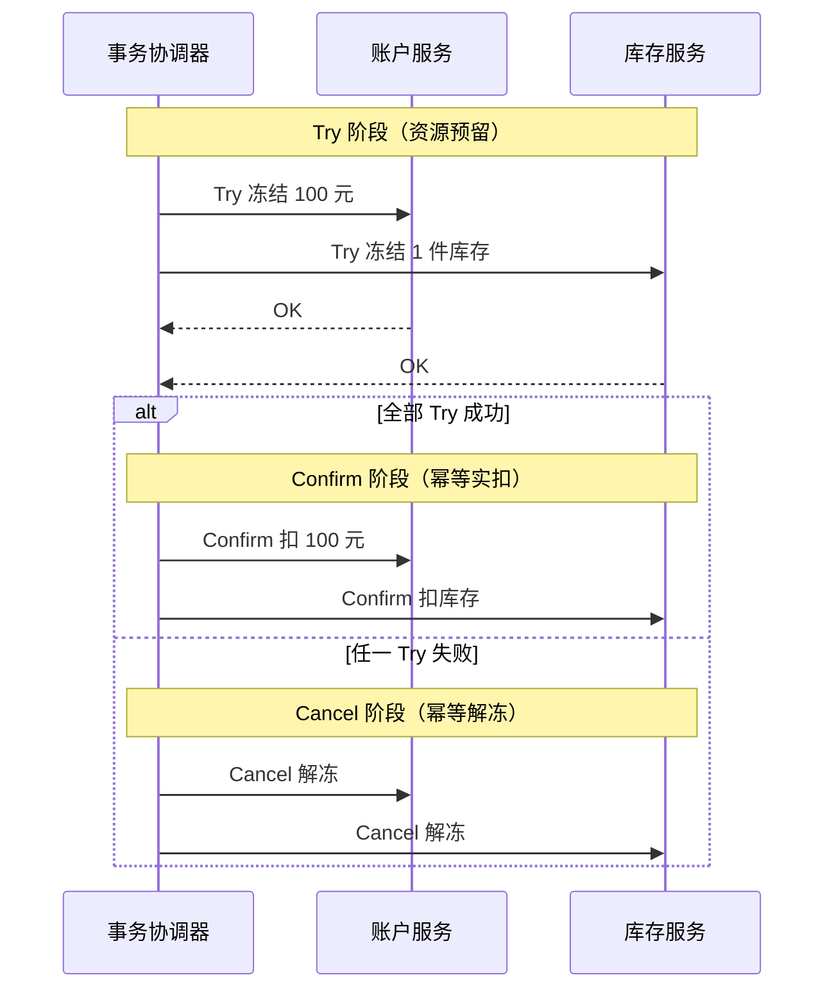
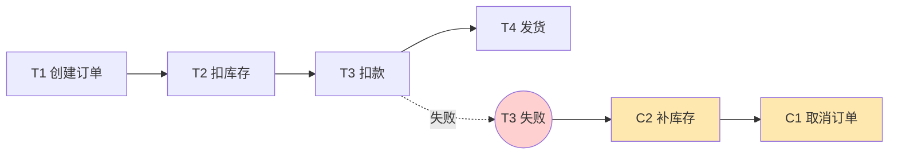

# 分布式事务 · 2PC / TCC / Saga / 最终一致性

> 为什么单机事务失效 · CAP 与 BASE · 2PC/3PC · TCC 三段 · Saga 补偿 · 本地消息表 · 可靠消息最终一致性 · 最大努力通知 · 幂等与空回滚/悬挂

::: tip 一句话抓手
分布式事务的一切方案都在回答一个问题：**多个独立节点的写，如何做到"要么都成功、要么都不影响"**。核心权衡是**强一致（2PC，牺牲可用性和性能）vs 最终一致（TCC/Saga/消息，牺牲实时一致性换可用性和吞吐）**。互联网后台**绝大多数选最终一致**，因为强一致的同步阻塞在高并发下扛不住。记住："**没有银弹，只有幂等 + 补偿/重试 + 对账兜底**"。
:::

## 场景问题

后台面试与系统设计高频题，本质考"跨服务/跨库写的一致性代价"：

| 题目 | 考点 | 直觉答案往往错在 |
| --- | --- | --- |
| 下单扣库存跨了两个服务怎么保证一致 | 分布式事务选型 | 不能直接用本地事务；要 TCC/Saga/消息 |
| 2PC 为什么生产少用 | 同步阻塞 + 协调者单点 | 全程锁资源，协调者挂了参与者卡死 |
| TCC 的 Try 阶段做什么 | 资源预留 | 预留而非真扣（冻结库存），不是直接扣减 |
| Saga 回滚怎么做 | 补偿而非回滚 | 已提交的本地事务无法回滚，靠反向补偿 |
| 消息最终一致怎么保证消息不丢 | 本地消息表 | 业务和"记消息"必须同一本地事务原子 |
| TCC 空回滚 / 悬挂是什么 | 网络乱序 | Cancel 先于 Try 到达、Try 网络超时后又到 |
| 强一致一定比最终一致好吗 | 权衡 | 高并发下强一致的锁和阻塞常常不可接受 |

## 实现方案

### 为什么单机事务失效 + CAP/BASE 底座

单机 DB 的 ACID 靠一个事务管理器 + 一份 WAL/undo 保证。一旦写落在**不同库/不同服务**，没有统一的事务管理器，本地 commit 后无法跨节点回滚。

- **CAP**：网络分区（P）不可避免，只能在**一致性 C** 和**可用性 A** 间取舍。分布式事务本质是在 CP 与 AP 之间选。
- **BASE**：**B**asically **A**vailable（基本可用）+ **S**oft state（软状态/中间态）+ **E**ventually consistent（最终一致）。互联网系统的主流哲学——放弃实时强一致，换高可用与高吞吐，用一段时间后收敛到一致。

### 2PC / 3PC：强一致，同步阻塞

**2PC（两阶段提交）**：协调者驱动，`Prepare`（各参与者执行但不提交、锁资源并回复能否提交）→ `Commit/Abort`（全 yes 才提交）。

::: warning 2PC 的三宗罪
- **同步阻塞**：Prepare 到 Commit 之间所有参与者**锁住资源**等待，高并发下吞吐骤降
- **协调者单点**：协调者在 Commit 阶段宕机，参与者已 Prepare 但不知该提交还是回滚，**资源永久卡死**
- **数据不一致**：Commit 阶段部分参与者收到、部分没收到（网络分区），出现不一致

**3PC** 加了 `CanCommit` 预询问和超时机制缓解阻塞，但增加一轮通信、仍不能根治不一致。生产上 2PC 只用于 DB 内部（XA）等强一致小范围场景，跨服务几乎不用。
:::

### TCC：Try-Confirm-Cancel，业务层两阶段

把 2PC 上移到业务层，用**资源预留**代替资源锁定：

- **Try**：预留资源（冻结库存、冻结金额），不是真正扣减
- **Confirm**：确认执行（把冻结转为实扣），**必须幂等**
- **Cancel**：释放预留（解冻），**必须幂等**

::: warning TCC 三大坑：空回滚、悬挂、幂等
- **空回滚**：Try 因网络超时没执行，但事务管理器发起了 Cancel → Cancel 要能识别"没 Try 过"并直接返回成功（记录事务状态判断）
- **悬挂**：Try 超时后 Cancel 先到并完成，随后迟到的 Try 才到 → 资源被预留后再无人 Confirm/Cancel → Try 要检测"已 Cancel 过则拒绝执行"
- **幂等**：Confirm/Cancel 会重试，必须幂等
:::

TCC 一致性强、无长时间锁，但**每个服务要实现三个接口**，侵入性大、开发成本高。

### Saga：长事务的补偿链

把一个长事务拆成一串**本地事务 T1…Tn**，每个 Ti 配一个**补偿 Ci**。正常顺序执行 T1→Tn；中途 Ti 失败则反向执行 Ci-1→C1 补偿已完成的步骤。

> 正向 T1→T4 顺序执行；若 T3 扣款失败，则反向补偿已完成的 T2、T1（C2 补库存 → C1 取消订单），已提交的本地事务无法回滚只能语义补偿。

- **编排式（Orchestration）**：中央协调器按流程调用各步骤和补偿（清晰、易监控）
- **协同式（Choreography）**：各服务通过事件互相触发（去中心，但流程分散难追踪）

::: warning Saga 是"补偿"不是"回滚"
Ti 一旦本地提交就对外可见（无隔离性），失败时只能用 Ci 做**语义补偿**（如"已发货"不能撤销，只能补一个退货流程）。所以 Saga **不保证隔离性**，可能读到中间态；且补偿本身也可能失败，要重试 + 兜底。适合流程长、可补偿、能容忍中间态的业务（订单、履约）。
:::

### 可靠消息最终一致性（最常用）

用 MQ 把"跨服务写"异步化，核心是保证**"本地事务成功 ⟺ 消息一定发出"**：

- **本地消息表**：业务更新 + 插入"待发消息"记录在**同一个本地事务**里原子提交 → 后台轮询消息表投递 MQ → 下游消费（幂等）→ 投递成功标记/删除。DB 事务保证"改了库就一定记下消息"，MQ 重投 + 消费幂等保证最终送达
- **事务消息（RocketMQ）**：发半消息 → 执行本地事务 → 提交/回滚半消息 → Broker 定时**回查**本地事务状态兜底（解决"本地事务成功但确认消息丢失"）

下游必须**幂等消费**（见 [消息队列](/common/message-queue.md) 与 [幂等设计](/game-biz/idempotency-design.md)）。

### 最大努力通知

发起方尽最大努力（多次重试、退避）通知接收方，接收方需**提供查询接口**让发起方对账。用于对最终一致性要求不高、且接收方可能不可靠的场景（支付结果通知第三方、开放平台回调）。

### 对账兜底

任何最终一致方案都应有**离线对账**：定时扫描两边数据，发现不一致（如库存冻结了但订单没成）就补偿或告警。这是所有异步方案的最后一道防线。

## 为什么这么做

- **为什么互联网偏好最终一致**：高并发场景下，2PC 的同步锁定会让吞吐塌方、可用性受协调者单点拖累。BASE 用"短暂不一致 + 最终收敛"换来高可用和高吞吐，符合大多数业务"能接受几秒内看到中间态"的现实。
- **为什么 TCC 用预留而非直接操作**：Try 阶段冻结资源既避免了 2PC 的长时间数据库锁（冻结是业务状态，不锁行），又保留了 Confirm 前可 Cancel 的两阶段能力——把 2PC 的锁粒度从 DB 行降到业务资源。
- **为什么本地消息表能防丢**：把"发消息"这个动作转化成"往本地库写一行"，从而纳入本地 ACID 事务。业务和消息记录同生共死，再靠异步投递 + 重试保证送达——用一次本地事务的原子性撬动跨服务的最终一致。

## 为什么别的选择不行

- **为什么不全用 2PC 图省事**：同步阻塞 + 协调者单点 + 分区不一致三个硬伤，让它在高并发跨服务场景不可用。它把可用性押给了协调者，与互联网"高可用优先"背道而驰。
- **为什么不无脑上 TCC**：每个参与服务都要额外实现 Try/Confirm/Cancel 三接口并处理空回滚/悬挂/幂等，开发和维护成本高。只有对一致性要求高、且能改造下游的核心链路（资金、库存）才值得。
- **为什么不能只靠重试不做幂等**：重试是最终一致的基石，但重试必然带来重复执行，没有幂等就会重复扣款/重复发货。幂等和重试是一对，缺一不可。

## 沉淀结论

面试速答清单：

- **单机 ACID 跨节点失效；CAP 分区下选 CP/AP，互联网主流走 BASE 最终一致**
- **2PC 强一致但同步阻塞 + 协调者单点 + 可能不一致，跨服务几乎不用**
- **TCC = 业务层两阶段：Try 预留 / Confirm 实扣 / Cancel 解冻；须处理空回滚、悬挂、幂等**
- **Saga = 本地事务链 + 反向补偿；无隔离性，读得到中间态，适合长流程可补偿业务**
- **可靠消息最终一致最常用：本地消息表 / RocketMQ 事务消息 + 回查；下游幂等消费**
- **兜底三件套：幂等 + 重试(退避) + 离线对账**

### 选型速记

| 方案 | 一致性 | 侵入性 | 吞吐 | 适用 |
| --- | --- | --- | --- | --- |
| 2PC/XA | 强 | 低（DB 支持） | 低 | DB 内部、强一致小范围 |
| TCC | 强（准实时） | 高（三接口） | 高 | 资金/库存等核心链路 |
| Saga | 最终 | 中（写补偿） | 高 | 长流程、可补偿（订单履约） |
| 可靠消息 | 最终 | 中 | 高 | 异步解耦、跨服务通知 |
| 最大努力通知 | 最终（弱） | 低 | 高 | 对外回调、容忍不达 |

### 记忆口诀

- **底座**：CAP 分区必选 / CP 强一致 vs AP 高可用 / BASE 最终一致
- **2PC**：同步阻塞 / 协调者单点 / 分区不一致（跨服务不用）
- **TCC**：Try 预留 / Confirm 实扣 / Cancel 解冻（防空回滚·悬挂·须幂等）
- **兜底**：幂等 / 重试退避 / 离线对账

## 内容来源

关键点整理自《Designing Data-Intensive Applications》（Martin Kleppmann，第 7/9 章）、[Seata 官方文档](https://seata.apache.org/docs/overview/what-is-seata/)（AT/TCC/Saga 模型）、RocketMQ 事务消息设计与 CAP/BASE 经典论述重写为五段式。请以官方文档为准。

## 自测：合上资料能说清楚吗？

1. 为什么单机数据库的 ACID 事务一旦写落到不同库/不同服务就失效了？分布式事务本质在解决什么问题？
2. 2PC 生产上跨服务几乎不用，它到底有哪三个硬伤？
3. TCC 的空回滚和悬挂分别是什么场景造成的？各自怎么防？
4. 「本地消息表」凭什么能保证「本地事务成功 ⟺ 消息一定发出」？
5. 对比 TCC 与 Saga：一致性、隔离性、侵入性、适用场景各有什么不同？

参考答案

1. 无统一**事务管理器**与共享 WAL/undo，本地 commit 后无法跨节点回滚。本质：多节点写做到**要么都成功、要么都不影响**。

2. **同步阻塞**（Prepare→Commit 全程锁资源）、**协调者单点**（宕机则参与者卡死）、**分区不一致**（部分收到 Commit）。

3. **空回滚**：Try 因超时没执行却收到 Cancel → Cancel 靠事务状态识别「没 Try 过」直接成功。**悬挂**：Cancel 先到完成后 Try 迟到 → Try 检测「已 Cancel 则拒绝」。

4. 业务更新与「插入待发消息」在**同一本地事务**原子提交，改库就必记消息；再靠**轮询投递 + MQ 重投 + 消费幂等**保证最终送达。

5. **TCC**：准实时强一致、无隔离问题、侵入高（三接口），用于资金/库存核心链路。**Saga**：最终一致、**无隔离性**（读得到中间态）、侵入中（写补偿），用于长流程可补偿业务。

