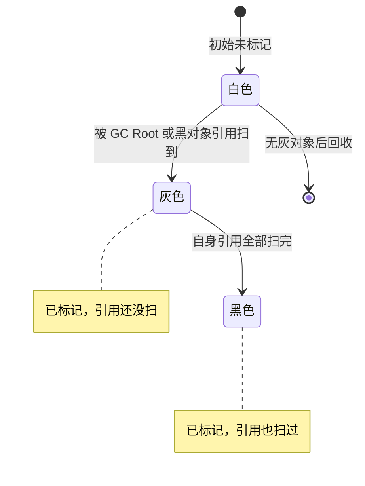

# GC 与 STW · Go / JVM

::: warning Stop-The-World 的本质
STW 不是"暂停一切"——它是**GC 需要与 mutator（业务代码）达成一致**的窗口。要么让所有线程停在**安全点 (safepoint)**，要么用**读/写屏障** + **并发标记**把 STW 挤到毫秒级。**Go 的 STW 几百 µs，JVM ZGC 亚毫秒，都靠这套。**
:::

## 场景问题

### GC 基础算法

- **引用计数 (RC)**：Python / Objective-C；实现简单，**无法处理循环引用**（Python 加了 gc 模块补）
- **标记-清除 (Mark-Sweep)**：从 GC Root 遍标记存活；清除死对象；**产生碎片**
- **标记-整理 (Mark-Compact)**：标记后把存活对象滑到一端，无碎片；停顿更长
- **复制 (Copying)**：分 From/To 两半，存活对象复制到 To → From 全清；**无碎片但内存利用率减半**（新生代常用）
- **分代 (Generational)**：多数对象 "朝生夕死" → 新生代频繁小 GC (Minor GC)；老年代少 GC 但停顿长 (Full GC)。**JVM 经典模型**

### 三色标记 (Tri-Color Marking)

- **白色**：未标记，最终被回收
- **灰色**：已标记，但**引用还没扫**
- **黑色**：已标记，**引用也扫过**

**过程**：GC Root 全部染灰 → 循环取一个灰对象染黑 + 把它引用的白对象染灰 → 直到没有灰对象 → 剩余白色回收。

**并发标记的问题**：mutator 可能把黑对象指向白对象，然后删除灰→白的引用 → 白对象被误回收。**必须靠屏障维持"三色不变式"**。



## 实现方案

### 两种不变式 & 屏障

- **强三色不变式**：**黑对象不能直接指向白对象** → **插入屏障 (Insertion Barrier)**：黑→白 写入时把白改灰
- **弱三色不变式**：黑→白可存在，但白必须**被灰对象可达**（有"灰路径"兜底）→ **删除屏障 (Deletion Barrier)**：删掉指向白的引用时把白改灰

**实际实现**：
- **Yuasa (删除屏障)**：**Go 1.7 前**
- **Dijkstra (插入屏障)**
- **Hybrid (混合屏障)**：**Go 1.8+** 引入——**栈上不用屏障 (标记栈时 STW 即可)**，**堆上插入 + 删除都开**；效果是**栈标记完之后，goroutine 不需要再次扫栈** → 显著减少 STW

### Go GC 完整流程

```text
1. Sweep Termination     STW ~几十 µs   清理上轮残留
2. Mark (并发)            与业务并发     从 root 三色标记 + 混合屏障
3. Mark Termination       STW ~几百 µs   完成灰色队列 / 更新统计
4. Sweep (并发/懒惰)       与业务并发     真正回收白色对象
```

**两次 STW 都是短暂的**——1.14 之后典型值 100~500 µs，堆几 GB 也不飙。

## 为什么这么做

### Go GC 演进（面试高频）

- **1.3**：Mark-Sweep，STW 全程，几百 ms
- **1.5**：**并发标记**引入，STW 降到 10 ms
- **1.8**：**混合写屏障 (Hybrid Barrier)**，栈免扫描，STW 降到 100 µs
- **1.14**：**基于信号的异步抢占**，纯计算循环也能被 STW
- **1.19**：软内存限制 `GOMEMLIMIT`——防 OOM 优于 `GOGC`
- **1.21+**：持续优化 pacer；**GC Pacer** 目标：让 GC CPU 占用 ≤ 25%，堆增长到上次 `heap * (1 + GOGC/100)` 时触发

### JVM GC 演进

- **Serial**：单线程 STW，客户端应用
- **Parallel Scavenge / Parallel Old**：多线程并行 STW，**吞吐优先**（Java 8 默认）
- **CMS (Concurrent Mark Sweep)**：并发标记 + 清除，**最早的低延迟 GC**；碎片问题大，**Java 14 移除**
- **G1 (Garbage First)**：**Region 分区**（每 Region 1~32MB），可预测停顿；**Java 9 默认**
- **ZGC**：**Colored Pointer + Load Barrier**，STW 与堆大小无关（TB 级也 <10 ms，Java 15 生产可用；21 分代版进一步降）
- **Shenandoah**（Red Hat）：与 ZGC 类似目标，**Brooks Pointer** 转发指针实现并发 compact
- **Epsilon**：不 GC——用于压测

### ZGC 亚毫秒 STW 的诀窍

- **染色指针 (Colored Pointer)**：把标记状态藏在指针**未使用的高位**（Marked0 / Marked1 / Remapped 等）
- **Load Barrier**：**读**指针时检查颜色，需要修正就现场修（把并发迁移的成本摊到读上）
- **并发迁移 (Relocate)**：即使搬对象也不 STW；旧位置留转发指针
- **代价**：需要 64 位系统、CPU 略贵；**不再受堆大小影响** → 从此 GC 停顿与堆容量脱钩

### 逃逸分析 (Escape Analysis)

- 编译期判断变量是否可能"逃出"当前函数（返回、写入全局、被闭包捕获）
- **不逃逸 → 分配到栈**（无 GC 压力）；逃逸 → 堆
- Go：`go build -gcflags "-m"` 看逃逸决策
- 常见"逃逸导致 GC 压力大"：
  - 返回局部变量指针
  - `interface{}` 装箱（非指针小对象也逃）
  - `map[string]interface{}` 频繁写
  - 闭包捕获局部变量

## 为什么别的选择不行

### GC 生产事故清单

- **Go 内存"退不回操作系统"**：runtime 保留内存做后续分配；`GOMEMLIMIT` + `debug.FreeOSMemory()` 强制归还
- **JVM Full GC 循环**：老年代快满了，Full 后释放不多——排查大 map / 缓存穿透 / 类加载器泄漏
- **GC 突刺打爆 P99**：解法用 **`GOGC` 调低触发频率但每次量小** / 迁 ZGC / 加内存降触发密度
- **Metadata 泄漏**：JVM 反射 / 动态代理生成大量 Class 塞满 Metaspace → OOM MetaSpace
- **Direct ByteBuffer 泄漏**：堆外内存 GC 不友好；靠 `Cleaner`，忘记回收会慢慢涨

### 选型建议

- **要极低延迟 (P99 < 10 ms)**：Go / **JVM ZGC / Shenandoah**
- **要极高吞吐 (批处理)**：JVM Parallel GC
- **堆巨大 (>32GB)**：ZGC / Shenandoah（G1 也行但 STW 会随堆涨）
- **不能容忍 GC 抖动的游戏世界服**：**C++ 手动内存管理** 或**对象池 + arena**（Go / Rust 都用 `sync.Pool`）

## 沉淀结论

### 排查工具箱

**Go**：
- `GODEBUG=gctrace=1`：每次 GC 打一行统计（heap / STW / CPU%）
- `runtime/pprof` heap profile → `go tool pprof`
- `runtime.MemStats`

**JVM**：
- `-Xlog:gc*` (Java 9+) / `-XX:+PrintGCDetails`
- `jcmd <pid> GC.heap_dump`；MAT / VisualVM 分析
- `jstat -gc <pid> 1s`
- **JFR (Flight Recorder)** + JMC：生产可开的低损耗采样

## 内容来源

迁移自 guide/theme-gc-stw（综合整理）。原始参考：Go 官方 blog、JVM Handbook、ZGC/Shenandoah 论文（2026-07）。
