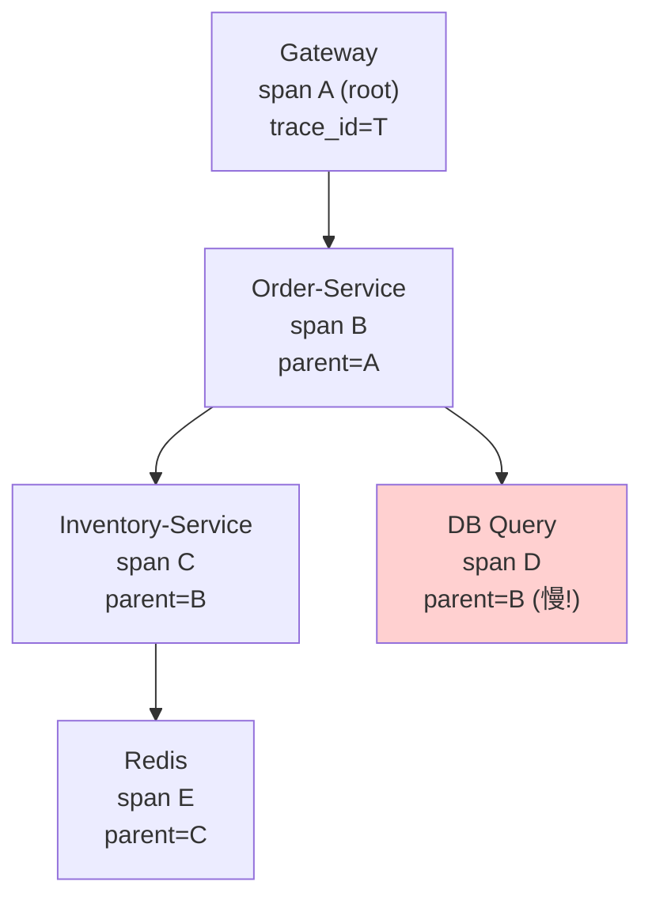
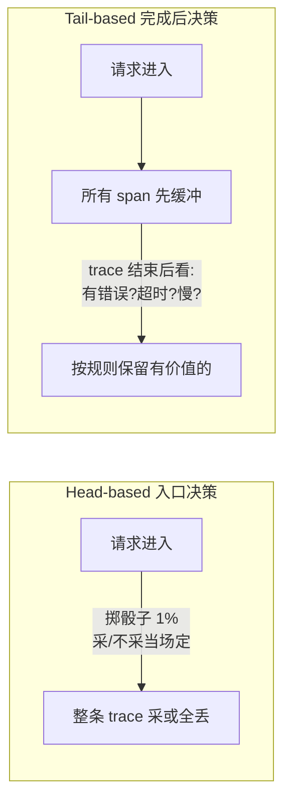
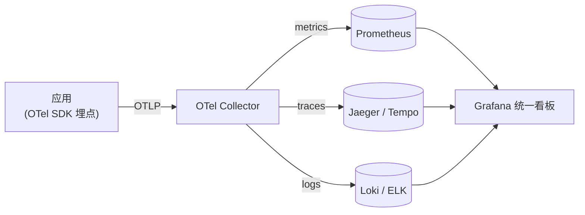
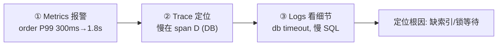

# 可观测性

> 三支柱 Metrics/Logs/Traces · 分布式链路追踪与上下文传播 · RED/USE 方法论 · P99 与分位数陷阱 · 结构化日志关联 · OpenTelemetry 标准 · 线上延迟突刺排障

::: tip 🧠 一句话记忆锚点
可观测性的核心是**用三支柱互补地回答"系统现在怎么了、为什么"**：**Metrics 便宜且全局，告诉你"出没出问题、哪个指标坏了"；Traces 中等成本，告诉你"一次请求慢在哪个 span、跨了哪几个服务"；Logs 最贵最细，告诉你"那一刻到底发生了什么"**。三者靠 **trace_id** 串起来，排障永远是"**metrics 报警 → trace 定位慢 span → logs 看细节**"这条链路往下钻。记住两条铁律：**分位数（P99）不能求平均、必须靠直方图聚合**；**采样要么在入口全采后端 head-based，要么等 trace 完成再按错误/慢来选 tail-based**。
:::

## 场景问题

> **打个比方（三支柱）**：排查线上问题就像看病。**Metrics** 是体检报告上的各项读数（体温、血压——便宜、全局，一眼看出"哪项不正常、出没出事"）；**Traces** 是拍片子做造影（看清"这次难受到底堵在哪条血管、途经了哪几个器官"，对应一次请求慢在哪个 span、跨了哪几个服务）；**Logs** 是医生手写的详细病历（那一刻具体发生了什么，最细、也最贵）。老练的医生看病顺序也固定：先看体检读数报警 → 再拍片定位 → 最后翻病历抠细节，靠病历号（trace_id）把三者串成一条线。**类比失效边界**：体检读数里最坑的是 **P99 不能像体温那样求平均**——十个服务各自 P99 都是 100ms，合起来的 P99 绝不是 100ms（一次请求跨多个服务，任一个踩中长尾就整体慢），更不能把两台机器的 P99 相加除以二。分位数不是可加的量，必须回到原始直方图重新聚合，否则你算出来的"平均 P99"是个没有意义的数。

后端面试与系统设计高频题，本质考"**你能不能在系统出问题时快速定位、且知道每种信号的代价**"：

| 题目 | 考点 | 直觉答案往往错在 |
| --- | --- | --- |
| Metrics / Logs / Traces 有什么区别 | 三支柱定位 | 不是三选一，是互补，各自成本量级差很大 |
| 一个请求跨 5 个服务，怎么知道慢在哪 | 分布式追踪 | 光看单服务日志串不起来，要 trace_id 贯穿 |
| trace 上下文怎么跨进程传递 | W3C traceparent | 不是全局变量，是随请求头显式透传 |
| 全量采集 trace 行不行 | 采样策略 | 全采成本爆炸，要 head/tail 采样取舍 |
| 监控该盯哪些指标 | RED / USE | 盯 CPU 不如盯请求的 Rate/Errors/Duration |
| 多台机器的 P99 怎么汇总 | 分位数陷阱 | P99 不能相加求平均，必须用直方图桶合并 |
| 线上突然变慢怎么查 | 排障链路 | 直接翻日志大海捞针，应先 metrics→trace→logs |

## 实现方案

### 三支柱：Metrics / Logs / Traces 及其代价

| 支柱 | 回答什么 | 数据形态 | 成本 | 典型后端 |
| --- | --- | --- | --- | --- |
| **Metrics 指标** | 出没出问题、趋势如何 | 数值时间序列（可聚合） | 最低（预聚合、定长） | Prometheus |
| **Traces 追踪** | 一次请求慢/错在哪一环 | 有因果关系的 span 树 | 中（随请求量增长，靠采样） | Jaeger / Tempo |
| **Logs 日志** | 那一刻具体发生了什么 | 离散事件文本/结构化 | 最高（体量大、检索贵） | Loki / ELK |

三者的关系：**Metrics 发现问题（告警） → Traces 定位问题（哪个服务哪个 span） → Logs 解释问题（具体参数、堆栈、错误）**。它们不是替代关系，而是"由粗到细、由全局到局部"的漏斗。

::: warning 三支柱的代价必须心里有数
- **Metrics 便宜是因为它"有损"**：只保留聚合后的数值，丢掉了单次请求的个体信息。基数（cardinality）失控是最大杀手——给指标打上 `user_id`、`request_id` 这种高基数标签，时间序列会指数爆炸，直接压垮 Prometheus。
- **Logs 最贵**：全量结构化日志的存储和检索成本随流量线性增长，高 QPS 服务的日志费用常常是大头，必须采样/分级。
- **Traces 成本随请求量增长**：所以几乎没人全量采集，靠采样把量压下来（见下文）。
:::

### 分布式链路追踪：trace / span 模型与上下文传播

一次分布式请求 = 一棵 **span 树**：
- **Trace**：一次完整请求的全局标识（`trace_id`），贯穿所有服务。
- **Span**：一个工作单元（一次 RPC、一次 DB 查询），有自己的 `span_id`、`parent_span_id`、开始/结束时间戳、标签（tags）与事件（events）。父子 span 通过 `parent_span_id` 形成因果树。



**上下文传播（W3C Trace Context）**：跨进程时，trace 上下文不是靠全局变量，而是随请求（HTTP header / MQ 消息头）**显式透传**。W3C 标准头 `traceparent` 格式：

```
traceparent: 00-4bf92f3577b34da6a3ce929d0e0e4736-00f067aa0ba902b7-01
             │  └──────── trace-id (16B) ──────┘ └── span-id ──┘ └flags(01=采样)
           version
```

下游收到后，用其中的 `trace-id` 续接同一条 trace，并把自己的 `span-id` 作为新 span 的 parent。**关联 ID（correlation id）** 通常就复用 `trace_id`——只要日志、指标 exemplar、trace 都带上它，三支柱就串成一条线。

### 采样策略：head-based vs tail-based



| 策略 | 决策时机 | 优点 | 缺点 |
| --- | --- | --- | --- |
| **Head-based** | 请求入口就决定采不采 | 简单、无需缓冲、开销低 | 可能恰好丢掉出错/慢的那条 |
| **Tail-based** | trace 全部完成后再决定 | 能"专挑"错误/慢请求保留，价值密度高 | 要缓冲全部 span、内存与架构复杂 |

实践常组合：入口 head 采一个基础比例保证全局分布，Collector 端再用 tail 兜底"错误和慢请求 100% 留下"。

### 指标方法论：RED 与 USE

- **RED（面向请求/服务，用户视角）**：**R**ate 每秒请求数、**E**rrors 错误率、**D**uration 延迟分布。适合微服务、API。
- **USE（面向资源，机器视角）**：**U**tilization 使用率、**S**aturation 饱和度（排队程度）、**E**rrors 错误数。适合 CPU、内存、磁盘、连接池这类资源。

```promql
# RED - Rate：每秒请求数
sum(rate(http_requests_total[1m])) by (service)

# RED - Errors：错误率
sum(rate(http_requests_total{code=~"5.."}[1m])) by (service)
  / sum(rate(http_requests_total[1m])) by (service)

# RED - Duration：P99 延迟，必须从直方图桶聚合而来
histogram_quantile(0.99,
  sum(rate(http_request_duration_seconds_bucket[5m])) by (le, service))
```

::: warning P99 与分位数陷阱：为什么不能对分位数求平均
**分位数不可加、不可平均。** 三台机器各自 P99 = 100ms，整体 P99 **绝不等于** `(100+100+100)/3 = 100ms`——因为你不知道每台各自的请求量分布和长尾形状。同理，两个 5 分钟窗口的 P99 求平均得到 10 分钟 P99 也是错的。

正确做法：Prometheus 的 `histogram` 指标把延迟分到一组**桶（bucket）**里，存的是"≤某边界的累计计数"。跨机器/跨时间聚合时，**先把各来源同一个桶的计数相加**（`sum(rate(..._bucket[5m])) by (le)`），再对合并后的直方图用 `histogram_quantile()` 算分位数。这才是数学上正确的分位数合并。

代价：桶边界固定，分位数是**近似值**（落在某桶内线性插值），桶设得不合理会失真。这也是新型 **native histogram / DDSketch** 想解决的问题。
:::

### 结构化日志与跨服务关联

把日志写成结构化的键值（JSON）而非纯文本，每条日志强制带上 `trace_id` / `span_id`，就能把散落在各服务的日志按一次请求串起来：

```json
{"ts":"2026-07-23T10:00:01Z","level":"ERROR","service":"order",
 "trace_id":"4bf92f3577b34da6a3ce929d0e0e4736","span_id":"00f067aa0ba902b7",
 "msg":"create order failed","order_id":"X123","err":"db timeout","cost_ms":1830}
```

有了 `trace_id`：在 trace 界面点开慢 span → 一键跳到该 span 时间窗内、同 `trace_id` 的全部日志；反过来从一条报错日志也能回跳完整调用链。这就是**三支柱互相关联的粘合剂**。

### OpenTelemetry 标准与主流后端

**OpenTelemetry（OTel）** 是 CNCF 的统一可观测性标准：一套 **API + SDK + 协议（OTLP）+ Collector**，统一 Metrics/Logs/Traces 的采集与传输，把"埋点"和"后端存储"解耦——换后端不用改业务代码。



- **Metrics 后端**：Prometheus（拉模型、PromQL、时序数据库）。
- **Traces 后端**：Jaeger 或 Grafana Tempo（Tempo 只靠 trace_id 索引，存储极省）。
- **Logs 后端**：Grafana Loki（只索引标签、日志体不建全文索引，省）或 ELK（Elasticsearch 全文检索，强但重）。
- **Collector**：接收、处理（批量、tail 采样、脱敏）、导出到各后端的中枢。

### 排障叙述：线上延迟突刺如何定位



1. **Metrics 报警（发现）**：Grafana 告警触发——`order` 服务 P99 从 300ms 飙到 1.8s，错误率同步上涨。此时只知道"哪个服务、哪个指标坏了"，不知道为什么。
2. **Trace 定位（收敛）**：从慢请求的 exemplar 或按 `duration > 1s` 过滤，打开一条 tail 采样保留下来的慢 trace，看 span 树——发现耗时几乎全落在 `Order-Service` 里的一个 `DB Query` span（span D），下游 Inventory/Redis 都正常。问题收敛到"某条 DB 查询慢"。
3. **Logs 看细节（定因）**：用该 span 的 `trace_id` 跳到对应日志，看到 `db timeout`、慢 SQL 语句和参数，结合 DB 侧监控发现是某查询缺索引 + 突发大流量导致锁等待。根因锁定，止血（加索引/限流）。

**三步各司其职：metrics 说"坏了"，trace 说"坏在哪一环"，logs 说"为什么坏"**——这就是可观测性存在的意义。

## 为什么这么做

- **为什么要三支柱而非只留日志**：只有日志时，"系统整体健康吗"要靠捞海量日志聚合，慢且贵；"一次请求跨服务慢在哪"更是无从串联。Metrics 用极低成本回答全局趋势与告警，Traces 用因果树回答定位，Logs 才下钻细节——三者是成本与信息密度的分工，缺一层要么瞎要么破产。
- **为什么上下文要显式透传而非隐式**：分布式请求跨进程、跨线程、跨机器，没有共享内存。只有把 `traceparent` 随请求头一路传下去，下游才能把自己的 span 挂到同一棵树上。用 W3C 标准头是为了跨语言、跨厂商互通。
- **为什么分位数要靠直方图**：延迟分布是长尾的，均值会被少数极端值带偏或掩盖，用户体验由长尾（P99）决定。而分位数不可跨来源平均，唯一数学正确的聚合方式就是先合并直方图桶再算分位数。
- **为什么用 OpenTelemetry**：历史上各家 agent/协议割裂，埋点和后端强绑定。OTel 统一标准让埋点一次、后端随意换，避免供应商锁定。

## 为什么别的选择不行

- **为什么不把 P99 直接求平均汇总**：分位数不可加。三台各 P99=100ms 不代表整体 P99=100ms，跨时间窗同理。这么算出的"P99"没有任何统计意义，会让你对长尾一无所知。必须合并直方图桶。
- **为什么不给指标打高基数标签（user_id/trace_id）**：Prometheus 每个标签值组合都是一条独立时间序列，高基数标签会让序列数爆炸，内存和查询直接拖垮。个体维度的信息应该放进 traces/logs，而不是 metrics。
- **为什么不全量采集 trace**：trace 数据量随请求量线性甚至更快增长，全采存储和网络成本不可承受，且 99% 的正常 trace 没有排障价值。所以必须采样，用 tail-based 专挑错误/慢的留。
- **为什么不用纯文本日志**：非结构化日志无法可靠地按字段过滤、无法跨服务用 trace_id 关联，机器解析要靠脆弱的正则。结构化日志（JSON/kv）才能被高效检索和串联。

## 沉淀结论

::: tip 速记
- **三支柱漏斗**：Metrics 发现（便宜/全局/可聚合）→ Traces 定位（中等/因果树/靠采样）→ Logs 定因（最贵/最细/结构化）。
- **串联靠 trace_id**：logs 带 trace_id/span_id、metrics 带 exemplar，三支柱才连成线。
- **传播用 W3C traceparent**：`version-traceid-spanid-flags`，随请求头显式透传。
- **采样**：head-based 入口定（简单、可能漏错误）；tail-based 完成后定（专留错误/慢、要缓冲）。
- **方法论**：请求看 RED（Rate/Errors/Duration）、资源看 USE（Utilization/Saturation/Errors）。
- **分位数铁律**：P99 不能求平均，必须合并直方图桶再 `histogram_quantile`。
- **排障链路**：metrics 报警 → trace 定位慢 span → logs 看细节。
:::

### 面试高频题清单

**Q：** Metrics、Logs、Traces 三者区别与关系？
A：Metrics 便宜可聚合、回答"出没出问题"；Traces 中等成本、回答"跨服务慢在哪个 span"；Logs 最贵最细、回答"具体发生了什么"。关系是由粗到细的漏斗：发现→定位→定因，靠 trace_id 串联，互补而非替代。

**Q：** 分布式追踪的上下文怎么跨服务传递？
A：靠 W3C `traceparent` 请求头显式透传（`版本-trace_id-span_id-采样标志`），下游用其中 trace_id 续接同一条 trace，把自己的 span 挂为子 span。不是全局变量，而是随请求/消息头传播。

**Q：** head-based 和 tail-based 采样区别？
A：head 在请求入口就决定采不采，简单低开销但可能恰好丢掉出错的那条；tail 缓冲全部 span、等 trace 完成后按"是否错误/慢"决定保留，价值密度高但要缓冲、架构复杂。实践常组合。

**Q：** 为什么不能对多台机器的 P99 求平均？正确做法？
A：分位数不可加不可平均，你不知道各来源的量与长尾形状。正确做法是用直方图指标，把各来源同一 `le` 桶的计数先相加，再对合并直方图用 `histogram_quantile()` 计算，结果是近似但数学正确。

**Q：** RED 和 USE 分别监控什么，用在哪？
A：RED = Rate/Errors/Duration，从请求/用户视角看服务，适合微服务和 API；USE = Utilization/Saturation/Errors，从资源视角看机器（CPU/内存/连接池），适合定位资源瓶颈。两者互补。

**Q：** OpenTelemetry 解决了什么问题？
A：统一了 Metrics/Logs/Traces 的 API/SDK/协议（OTLP）和 Collector，把埋点与后端存储解耦。埋点一次即可导出到 Prometheus/Jaeger/Loki 等任意后端，避免各家 agent 割裂和供应商锁定。

### 记忆口诀

- **三支柱**：Metrics 发现（便宜全局）· Traces 定位（因果树采样）· Logs 定因（最贵最细）
- **串联**：一根 trace_id 穿三支柱 · logs 带 span_id · metrics 带 exemplar
- **传播**：W3C traceparent 随头走 · 版本-traceid-spanid-flags
- **采样**：head 入口定（简单漏错）· tail 完成定（专留错慢）
- **方法论**：请求看 RED · 资源看 USE
- **分位数**：P99 不求平均 · 合桶再算分位数
- **排障**：报警看 metrics → 定位看 trace → 细节看 logs

## 内容来源

综合整理自 [OpenTelemetry 官方文档](https://opentelemetry.io/docs/)、[Google SRE Book](https://sre.google/books/)（第 6 章 Monitoring、"Four Golden Signals"）、[Prometheus 官方文档](https://prometheus.io/docs/)（Histograms and summaries、Instrumentation），以及 W3C Trace Context 规范、Brendan Gregg 的 USE Method 与 Tom Wilkie 的 RED Method。请以各官方文档为准。

## 自测：合上资料能说清楚吗？

1. Metrics、Logs、Traces 三支柱各自回答什么问题、成本量级如何、如何串联？

<details><summary>参考答案</summary>

**Metrics** 便宜、可聚合，回答"出没出问题、趋势如何"；**Traces** 中等成本、随请求量增长靠采样，回答"一次请求跨服务慢/错在哪个 span"；**Logs** 最贵最细，回答"那一刻具体发生了什么"。三者是"发现→定位→定因"的漏斗，靠 **trace_id**（日志带 trace_id/span_id、指标带 exemplar）串成一条线。

</details>

2. 分布式追踪里 trace 上下文如何跨进程传递？W3C traceparent 里有什么？

<details><summary>参考答案</summary>

靠随请求头（HTTP header / MQ 消息头）**显式透传**，不是全局变量。W3C `traceparent` 格式为 `version-trace_id-span_id-flags`（如 `00-<16字节traceid>-<8字节spanid>-01`，flags=01 表示已采样）。下游用其中 trace_id 续接同一条 trace，把自己的 span 挂为子 span（parent_span_id 指向上游）。

</details>

3. head-based 与 tail-based 采样各自的时机、优缺点？为什么不全量采集？

<details><summary>参考答案</summary>

**head-based** 在请求入口当场决定采不采，简单、无需缓冲、开销低，但可能恰好丢掉出错/慢的那条。**tail-based** 把所有 span 先缓冲，等 trace 完成后按"是否错误/是否慢"决定保留，能专挑高价值 trace，但要缓冲全部 span、内存和架构复杂。不全量是因为 trace 量随请求线性增长、存储成本不可承受，且绝大多数正常 trace 无排障价值。

</details>

4. 为什么三台机器各自 P99=100ms，整体 P99 不等于 100ms？正确的聚合方式是什么？

<details><summary>参考答案</summary>

因为**分位数不可加、不可平均**——你不知道每台的请求量与长尾分布形状，简单平均没有统计意义。正确做法：用**直方图**指标（按 `le` 边界存累计计数），跨来源聚合时**先把各来源同一个桶的计数相加**（`sum(rate(..._bucket[5m])) by (le)`），再对合并后的直方图用 `histogram_quantile(0.99, ...)` 计算。结果是近似值（桶内插值）但数学正确。

</details>

5. 线上某服务延迟突然从 300ms 涨到 1.8s，用三支柱怎么一步步定位？

<details><summary>参考答案</summary>

**① Metrics 发现**：告警触发，看到该服务 P99 飙升、错误率上涨，知道"哪个服务坏了"但不知为什么。**② Trace 定位**：打开一条 tail 采样留下的慢 trace，看 span 树，发现耗时集中在某个 DB Query span，下游其他服务正常，问题收敛到某条查询。**③ Logs 定因**：用该 span 的 trace_id 跳到对应日志，看到 db timeout、慢 SQL 与参数，结合 DB 监控确认是缺索引+锁等待。metrics 说"坏了"、trace 说"坏在哪环"、logs 说"为什么坏"。

</details>
