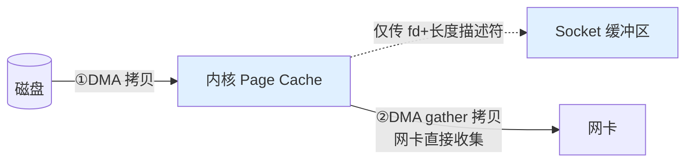

# 操作系统核心与零拷贝

> 虚拟内存与分页 · 缺页中断 · Page Cache · 用户态/内核态与系统调用 · 上下文切换成本 · 零拷贝（mmap / sendfile / splice）· DMA · 中断与软中断

::: tip 一句话抓手
后台 OS 面试题几乎都落在两条主线：**虚拟内存把"每个进程独占连续地址空间"这个假象，用页表+MMU+缺页中断+Page Cache 一层层兑现**；**零拷贝的本质是"减少数据在用户态和内核态之间的来回拷贝以及 CPU 参与的次数"——传统 read+write 要 4 次拷贝 + 4 次上下文切换，sendfile 能砍到 2 次拷贝（且都由 DMA 做）、2 次切换**。抓住"为什么要切态""数据拷了几次谁在拷"，零拷贝题当场破。
:::

## 场景问题

后台面试高频题，本质考"用户态/内核态边界 + 数据搬运成本"：

| 题目 | 考点 | 直觉答案往往错在 |
| --- | --- | --- |
| 传统文件下发要拷贝几次 | read+write 数据路径 | 4 次拷贝 + 4 次上下文切换，不是 2 次 |
| sendfile 快在哪 | 零拷贝 | 数据不进用户态，DMA 直接搬，CPU 不参与拷贝 |
| mmap 读文件为什么快 | 映射 + Page Cache | 省掉内核→用户拷贝，但有缺页和 TLB 成本 |
| Page Cache 是什么，写了立刻落盘吗 | 页缓存 + 回写 | 默认异步回写，掉电可能丢，需 fsync |
| 为什么系统调用"贵" | 切态 + 上下文 | 特权级切换 + 可能的调度/缓存失效 |
| malloc 一大块内存立刻占物理内存吗 | 惰性分配 | 不，缺页时才真正分配物理页 |
| Kafka 为什么快 | 顺序写 + Page Cache + sendfile | 不是因为它不落盘，而是顺序 IO + 零拷贝 |

## 实现方案

### 虚拟内存与分页

每个进程看到的是**独立、连续**的虚拟地址空间；MMU 通过**多级页表**把虚拟地址翻译成物理地址，**TLB** 缓存最近的翻译加速。好处：进程隔离（互相看不到对方内存）、地址空间比物理内存大（靠 swap）、便于共享（同一物理页映射到多个进程）。

- **惰性分配（demand paging）**：`malloc`/`mmap` 只分配虚拟地址，不立刻给物理页。首次访问触发**缺页中断（page fault）**，内核才分配物理页并填页表 → 这就是"申请了大内存但 RSS 没涨"的原因
- **缺页类型**：minor fault（页在内存中，如 Page Cache 命中或写时复制）、major fault（需从磁盘/swap 读入，慢）
- **写时复制（COW）**：`fork` 后父子共享物理页且标只读，任一方写才复制一份 → `fork` 很快，`fork+exec` 几乎不浪费拷贝

### 用户态 / 内核态与系统调用成本

CPU 有特权级（x86 ring0 内核 / ring3 用户）。应用要访问硬件、文件、网络必须通过**系统调用**陷入内核态。为什么"贵"：

- 特权级切换 + 保存/恢复寄存器上下文
- 可能引发**上下文切换**（阻塞式系统调用让出 CPU）
- CPU 缓存、TLB 可能被污染/刷新

所以高性能服务追求**减少系统调用次数和切态次数**——这正是零拷贝、`io_uring`、批量提交、用户态协议栈的动机。

### Page Cache 与回写

内核用空闲内存缓存磁盘文件页（Page Cache）。读命中则不碰磁盘；写默认**只写到 Page Cache 就返回（write-back）**，由内核后台线程异步刷盘（脏页达阈值或周期性）。

::: warning 写了不等于落盘
`write()` 返回成功只代表进了 Page Cache，**掉电/宕机会丢**。要持久必须 `fsync()`/`fdatasync()` 强制刷盘（DB 的 WAL、MQ 的持久化都靠它）。`fsync` 是昂贵操作，是很多存储系统的性能瓶颈点。
:::

### 零拷贝：从 4 次拷贝到 2 次

**传统 `read() + write()` 下发文件到 socket（4 次拷贝 + 4 次上下文切换）：**

> ②③ 两次是 **CPU 拷贝**（红色为用户态），数据"进用户态又原样出去"毫无处理，纯浪费；每次 `read`/`write` 各一次用户↔内核切换 → 共 **4 次上下文切换**。

**优化路径：**

- **`mmap` + `write`**：把文件映射到用户空间，省掉 ②（内核→用户）的拷贝，变 3 次拷贝、4 次切换。但引入缺页、TLB、映射开销，且多进程改文件有一致性坑
- **`sendfile`**：数据全程在内核，不进用户态。**2 次上下文切换**；早期仍 3 拷贝
- **`sendfile` + DMA gather（SG-DMA，需网卡支持）**：内核只把"文件描述符+长度"给 socket 缓冲区，网卡 DMA 直接从 Page Cache 收集数据 → **2 次拷贝（都是 DMA，CPU 零参与）、2 次上下文切换**。这是真正的"零（CPU）拷贝"
- **`splice`**：在两个 fd 间通过内核管道移动数据，不要求文件（更通用），同样避免用户态拷贝

**`sendfile` + SG-DMA 的数据路径（2 次 DMA 拷贝、CPU 零参与、2 次切换）：**

> 数据全程不进用户态，两次拷贝都由 DMA 完成，CPU 不搬一个字节——这才是"零（CPU）拷贝"。

::: warning "零拷贝"零的是什么
零拷贝**不是一次都不拷**，而是**消除 CPU 参与的、用户态与内核态之间的冗余拷贝**。DMA 拷贝（磁盘→内存、内存→网卡）依然存在但不占用 CPU。适用前提：**数据不需要在用户态被加工**（原样转发，如静态文件服务、Kafka 消费者拉取）。若要压缩/加密/改写，就必须进用户态，零拷贝失效。
:::

### DMA、中断与软中断

- **DMA（直接内存访问）**：外设（磁盘、网卡）不经 CPU 直接与内存搬数据，搬完发中断通知 CPU。零拷贝依赖它
- **中断上半部/下半部**：网卡收包发硬中断，上半部（硬中断）只做最紧急的事并尽快返回，繁重处理丢给**软中断/ksoftirqd（下半部）**，避免长时间关中断丢包。高网络负载下 `si`（软中断）CPU 占用高就是这里
- 现代高性能网络还有 **NAPI**（中断+轮询混合）、**RSS/RPS**（多队列分散软中断到多核）、`io_uring`（异步、批量、减少切态）

## 为什么这么做

- **为什么要虚拟内存**：没有它，进程直接操作物理地址 → 无隔离（一个进程能踩别人内存）、无法超额使用内存、难以共享和重定位。分页 + MMU 用一层间接换来隔离、超卖、共享、按需分配。
- **为什么要区分用户态/内核态**：保护硬件和内核数据结构不被应用直接破坏，越权操作必须走受控的系统调用入口。代价是切态开销，于是催生了各种"少切态"的优化。
- **为什么 Page Cache 默认异步回写**：磁盘慢，每次写都同步刷盘会让写延迟高到不可用。攒批异步刷把随机写合并、顺序化，大幅提升吞吐——代价是崩溃可能丢未刷的脏页，需要 `fsync` 在关键点兜底。

## 为什么别的选择不行

- **为什么不总用 mmap 代替 read**：mmap 省一次拷贝，但缺页中断、TLB 抖动、映射/解映射开销在小文件或随机访问下反而更慢；且文件被截断时访问映射区会 `SIGBUS`。大文件顺序/随机读、需要多进程共享才划算。
- **为什么零拷贝不能到处用**：它要求数据原样转发。任何用户态加工（加密、压缩、协议转换）都要求数据进用户态，零拷贝立即失效。所以它是"静态转发"专用优化，不是万能加速。
- **为什么不用同步刷盘保证不丢**：每次 `write` 都 `fsync` 会把吞吐打到地板。正确做法是异步回写 + 关键节点（事务提交、消息持久化）显式 `fsync`，在性能和持久性间取平衡。

## 沉淀结论

面试速答清单：

- **虚拟内存：页表+MMU+TLB 兑现"独占连续地址"；malloc 惰性分配，缺页中断才给物理页；fork 用 COW**
- **系统调用贵在切态 + 可能的上下文切换 + 缓存/TLB 污染 → 高性能追求少切态**
- **Page Cache 默认异步回写，write 成功≠落盘，持久要 fsync（DB/MQ 靠它）**
- **传统 read+write = 4 拷贝 + 4 切换；mmap 省 1 拷贝；sendfile = 2 切换；sendfile+SG-DMA = 2 次 DMA 拷贝、CPU 零参与**
- **零拷贝零的是"CPU 参与的用户↔内核冗余拷贝"，前提是数据原样转发（加密/压缩则失效）**
- **DMA 让外设不占 CPU 搬数据；网卡收包硬中断(上半部)+软中断(下半部)，高负载看 si**
- **Kafka 快 = 顺序写磁盘 + Page Cache + sendfile 零拷贝，而非不落盘**

### 记忆口诀

- **虚拟内存**：页表+MMU / TLB 加速 / 缺页才给物理页（惰性）/ fork 靠 COW
- **切态贵**：特权级切换 / 上下文保存 / 缓存 TLB 污染 → 少切态
- **拷贝次数**：传统 4拷4切 / mmap 省1拷 / sendfile 2切 / SG-DMA 2次DMA·CPU零参与
- **零拷贝**：零的是"CPU 参与的用户↔内核冗余拷贝" / 前提是原样转发 / 加密压缩即失效

## 内容来源

关键点整理自《Understanding the Linux Kernel》、Linux `man` 手册（`mmap(2)`/`sendfile(2)`/`splice(2)`/`fsync(2)`）、IBM DeveloperWorks 经典零拷贝文章与 Kafka 高性能设计文档重写为五段式。请以内核文档与 man page 为准。

> 相关专题：**零拷贝**（sendfile/splice/mmap/SG-DMA）以本篇为唯一详解；**epoll/IO 多路复用**详见 [LVS + epoll](../internet/lvs-epoll.md)，**TCP 协议与 socket 编程**详见 [TCP 网络](../internet/tcp-net.md)。

## 自测：合上资料能说清楚吗？

1. 传统 `read()+write()` 下发文件到 socket 一共发生几次拷贝、几次上下文切换？哪几次是 CPU 拷贝？

参考答案

**4 次拷贝 + 4 次上下文切换**。DMA：磁盘→PageCache、Socket缓冲→网卡；**CPU：PageCache→用户缓冲、用户缓冲→Socket缓冲**（这两次纯浪费）。read/write 各引起 2 次切态。

2. "零拷贝"到底零掉了什么？为什么说它不是"一次都不拷"？

参考答案

零掉的是**CPU 参与的、用户态↔内核态之间的冗余拷贝**。**DMA 拷贝**（磁盘→内存、内存→网卡）依然存在，只是不占 CPU。前提是**数据原样转发**，需加密/压缩就失效。

3. 对比 `mmap+write` 与 `sendfile`：各省了什么、代价是什么、分别适合什么场景？

参考答案

**mmap+write**：省内核→用户那次拷贝（3拷4切），但有**缺页/TLB/映射开销**、多进程一致性坑，适合需在用户态访问数据。**sendfile**：数据全程不进用户态（2切），配 **SG-DMA** 达 CPU 零参与，适合**原样转发**（静态文件、Kafka）。

4. `write()` 返回成功是否等于数据已落盘？存储系统怎么兜底？

参考答案

**不等于**。write 成功只代表进了 **Page Cache**（write-back），掉电会丢。持久化必须调 **`fsync()`/`fdatasync()`** 强制刷盘（DB 的 WAL、MQ 持久化靠它），但 fsync 昂贵，常是**性能瓶颈**。

5. `malloc` 一大块内存后 RSS 却没涨，为什么？首次访问时发生了什么？

参考答案

**惰性分配（demand paging）**：malloc 只给虚拟地址，不立即分配物理页。首次访问触发**缺页中断**，内核才分配物理页并填页表，此时 RSS 才增长。fork 后的共享页则靠 **COW**，写时才复制。

