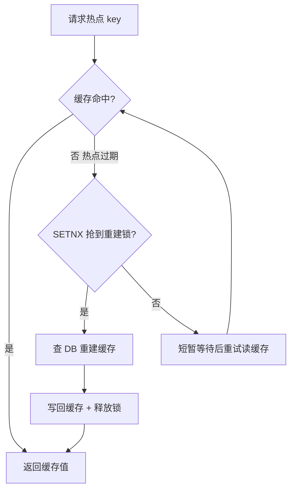

# Redis 版本演进 & 分布式

> 3.x → 8.x · 分布式锁 · Cluster · 缓存三板斧

::: tip 一句话结论
单线程原子性是根，版本演进围绕并发与分布式，锁和缓存三板斧靠它兜底。
:::

## 场景问题

> **打个比方（单线程为何又快又稳）**：把 Redis 主线程想成只开一个窗口、但办事快如闪电的银行柜台。所有人排成一条队，一次只服务一个——绝不会出现"两个柜员同时改你账户余额"的乱子，所以每条命令天生原子、压根不用加锁。它不慢，是因为柜员干的全是内存里的活（纳秒级），瓶颈从来不在"算"而在"网络上的你来我往"；于是 Redis 6 干脆多开了几个"收发件窗口"（多线程 I/O）专门分担网络收发，但**真正动账本的仍只有那一个人**，原子性纹丝不动。**类比失效边界**：单窗口的死穴是"怕慢客户"——谁要是丢给柜台一个巨慢的活（`KEYS *`、超大 `HGETALL`、Lua 死循环），整条队当场全卡死（阻塞），所以生产环境严禁慢命令。而且"单线程原子"只在单实例内成立：一上 Cluster 分片，跨 slot 的多 key 操作就不再是一个人经手，原子性也就没了。

Redis 是分布式议题的常客，面试里几乎绕不开版本演进与分布式协调。先看版本演进时间线（面试常问的每一版关键变化）。

### Redis 3.x → 8.x

| 版本 | 时间 | 关键新特性 | 破坏性/注意点 |
| --- | --- | --- | --- |
| **3.0** | 2015 | **Redis Cluster GA**（16384 slot、gossip 元数据） | multi-key 事务受限（同 Slot） |
| **3.2** | 2016 | **GEO** 地理坐标、**BITFIELD**、**SDS 优化** | |
| **4.0** | 2017 | **Module 系统**、**PSYNC2**（部分同步升级）、**LFU**、**内存碎片整理 activedefrag**、**Lazy free**（异步删除大 key） | RDB-AOF 混合持久化默认关，需开启 |
| **5.0** | 2018 | **Stream**（真正的消息队列，替代 List/Pub-Sub 的很多场景）、**RDB-AOF 混合持久化默认开启**、**Sorted Set 新增 ZPOPMIN/ZPOPMAX**、**LOLWUT** | |
| **6.0** | 2020 | **多线程 IO**（读写 socket 多线程、命令执行仍单线程）、**ACL** 用户权限、**RESP3** 协议、**Client-Side Caching**、**SSL/TLS 内建** | ACL 默认 `default` 用户无密码，需显式配置 |
| **6.2** | 2021 | **COPY / RESET / SMISMEMBER**、大量小改进、**geosearch** 优化 | |
| **7.0** | 2022 | **Function**（替代/增强 Lua Script）、**Sharded Pub/Sub**（Cluster 下 pub/sub 不再全网广播）、**AOF Multi-Part**（多文件切分）、**Client-eviction**、**ACL v2 键级权限** | |
| **7.2** | 2023 | **RESP3 完善**、**新数据类型 hyperloglog 改进**、**Auto-Failover 更快** | |
| **7.4** | 2024 | **Hash Field TTL**（Hash 内字段级过期）、**加速持久化**、Cluster 更高扩展性 | |
| **8.0** | 2025 | **吞吐大幅提升**（IO 与命令执行进一步并行）、**JSON / Time Series / Bloom / Search 内建**（原 Modules 合并进核心）、**7 项新数据结构**、**去除 Redis Stack 拆分** | 许可证变化：**RSALv2 + SSPLv1**（BSD 时代结束） |

## 实现方案

### 为什么 Redis 是分布式议题的常客

- **单线程命令模型** → 天然的原子性，是分布式锁/计数器/幂等的最佳场地
- **持久化 + 主从 + Cluster** → 一套体系解决"存不丢、读扩展、写分片"
- **数据结构丰富** → String/Hash/List/Set/ZSet/Stream/Bitmap/HyperLogLog/Geo
- **性能** → 单节点 10w+ QPS 起步；6.0 多线程后网络吞吐再翻倍

### 分布式锁：SETNX → Lua 释放 → Redlock → 看门狗

**基础版（正确姿势）**：

```lua
SET lock:key uuid NX PX 30000       -- 原子的"存在则不设"+过期
-- 释放时用 Lua 校验 uuid 再删，避免释放别人的锁
if redis.call("get", KEYS[1]) == ARGV[1] then
  return redis.call("del", KEYS[1])
else return 0 end
```

**Redlock（Antirez 提出，Kleppmann 反对）**：

- 向 5 个独立主节点发 SET NX PX；获取到 **N/2+1** 视为成功；关键是**时钟不能回拨、请求耗时 < 锁 TTL**
- Kleppmann 论文批评：任何依赖 fencing token 都比 Redlock 更安全
- 结论：**普通业务用单主 + 看门狗足够**，强一致选 ZK/etcd

**看门狗（Redisson）**：

- 客户端后台线程每 `lockLeaseTime/3` 续期一次
- 业务未完成锁不会被 Redis 强制过期
- **故障切换时锁可能丢**——业务需幂等兜底

### Cluster：Slot / gossip / 多 key 事务

- **16384 slot**（`CRC16(key) mod 16384`），每个主节点持有一段 slot 范围
- **gossip 元数据**：节点间通过 `ping/pong` 交换 slot 归属、故障状态；心跳周期 `cluster-node-timeout`（默认 15s）
- **多 key 命令必须同 Slot**：`MSET`/`MGET`/`SUNION`/事务/Lua 都受限
- **Hash Tag**：`{userid:1000}:profile`、`{userid:1000}:orders` 强制同 slot
- **重定向**：`MOVED`（永久归属变化）vs `ASK`（迁移中一次性重定向）
- **Slot 迁移**：`MIGRATE` 命令 + `CLUSTER SETSLOT IMPORTING/MIGRATING`；单 key 拆分数据源和目的端两边打标

### 主从复制：**异步**的代价

- **PSYNC**：全量 RDB + 部分同步（backlog buffer）；`replid`+`offset` 双坐标
- **异步复制** → 主故障时 slave 未追上的数据**丢失**（"最后 N 秒"）
- **min-replicas-to-write / min-replicas-max-lag** 保底：写要求至少 K 个 slave 落后不超过 N 秒；否则拒写
- **Sentinel** 或 **Cluster** 做故障转移；哨兵至少 3 台奇数以避免脑裂投票

### 缓存三板斧

- **穿透**（查一个 DB 都没有的 key）：**布隆过滤器**前置 + **空值缓存 5 分钟**
- **击穿**（热点 key 恰好过期，大量请求打 DB）：**互斥重建**（`SETNX` 争用重建权）+ **逻辑过期**（永不物理过期，异步刷新）
- **雪崩**（同时大量 key 过期）：**随机 TTL**（±10%）+ 多级缓存 + 熔断降级

缓存击穿的互斥重建流程：



### 缓存与 DB 一致性

- **Cache-aside**：读 miss → 查 DB → 回填缓存；写 → 先写 DB → 删缓存（**推荐**）
- **Write-through**：写请求同时更新缓存与 DB（一致性好，写路径重）
- **Write-behind (Write-back)**：写只更缓存，异步刷 DB（性能极高，**丢数据风险**）
- **双写不一致三大坑**：
  1. 更新 DB 后删缓存前的读命中旧值 → **延时双删**（先删 → 更新 DB → sleep → 再删）
  2. 主从延迟导致读到旧数据 → 关键读走主库
  3. **binlog 订阅（Canal / Debezium）**异步失效缓存，最终一致

## 为什么这么做

选型清单（面试可背）：

- **需要强一致锁** → ZK / etcd（不选 Redis）
- **需要"够用就行"锁** → Redis 单主 + Redisson 看门狗
- **需要秒杀库存扣减** → **Lua 原子脚本** + DB 乐观锁双保险
- **需要延时任务** → **Redis Stream + Consumer Group** 或 `ZSET` + 定时轮询
- **需要消息队列** → 5.x 起用 **Stream**，别再用 List/Pub-Sub
- **需要跨 slot 多 key** → **Hash Tag** 收敛
- **需要跨机房低延迟** → **就近读 + 异地异步复制**（最终一致）
- **需要 3.x → 8.x 升级** → 灰度切流 + 主从并行 + `MIGRATE` 分批 + **回滚预案**

## 为什么别的选择不行

经典生产事故清单：

- **大 key 阻塞**：单 key 500MB，删除耗时 3s，导致集群心跳超时被误判下线 → **拆分 + `UNLINK` 异步删除**
- **热 key 打爆单实例**：明星八卦 key 全流量打到一个 slot → **本地 EhCache 一层 + 客户端预取 + 打散 sub-key**
- **Cluster 脑裂**：网络分区期间少数派仍在写 → **min-replicas + 客户端读多数派**
- **看门狗续期死锁**：业务代码 `Thread.sleep` 而后台守护线程被卡 → 用异步续期或独立线程池
- **Lua 慢脚本**：单 Lua 阻塞主线程 200ms，全服卡 → `lua-time-limit` + 拆分脚本

## 沉淀结论

性能与容量心法：

- **单实例经验值**：10w QPS（简单命令）；6.0 多线程后网络吞吐 2x
- **持久化**：AOF `everysec` 是性价比最优；RDB 用于备份；混合持久化默认开
- **过期策略**：**惰性删除 + 定期抽样删除**；批量过期靠**随机 TTL**避免同时爆炸
- **淘汰策略**：`allkeys-lru`（缓存场景）、`volatile-ttl`（有明确 TTL 数据）、`allkeys-lfu`（热点稳定）
- **内存优化**：`ziplist`/`listpack` 阈值调优；小 hash/小 list 会自动压缩

### 记忆口诀

- **版本主线**：3.0 Cluster / 5.0 Stream / 6.0 多线程IO+ACL / 7.0 Function+分片Pub-Sub / 8.0 Modules内建
- **分布式锁**：SETNX+PX / Lua校验UUID释放 / 看门狗续期 / 强一致走ZK-etcd
- **缓存三板斧**：穿透→布隆+空值 / 击穿→互斥重建+逻辑过期 / 雪崩→随机TTL+多级+熔断
- **一致性**：Cache-aside删缓存 / 延时双删 / Canal订阅binlog兜底

## 内容来源

迁移自 guide/theme-redis（综合整理）。原始出处：综合整理 Redis 官方 release notes、Antirez 博客、redis.io/docs（2026-07；请以官方文档为准）。

## 自测：合上资料能说清楚吗？

1. 为什么 Redis 天然适合做分布式锁/计数器？它的原子性从何而来？

<details><summary>参考答案</summary>

**单线程命令模型**——命令串行执行，无并发竞态，单条命令天然原子。配合 `SET NX PX` 一步完成"**不存在则设置+过期**"，是分布式锁/计数器/幂等的最佳场地。

</details>

2. 缓存穿透、击穿、雪崩分别是什么？各自的应对手段？

<details><summary>参考答案</summary>

**穿透**：查不存在的 key，用**布隆过滤器**+**空值缓存**。**击穿**：热点 key 过期后大量请求打 DB，用**互斥重建**+**逻辑过期**。**雪崩**：大量 key 同时过期，用**随机 TTL**+多级缓存+熔断降级。

</details>

3. 对比 Redlock 与「单主+看门狗」两种分布式锁方案，各自适用场景？

<details><summary>参考答案</summary>

**Redlock**：向 5 独立主节点取锁，得 N/2+1 成功；依赖时钟不回拨，Kleppmann 批评其不如 **fencing token** 安全。**单主+看门狗**：Redisson 后台每 TTL/3 续期，故障切换可能丢锁需幂等兜底。普通业务用后者足够；**强一致选 ZK/etcd**。

</details>

4. Cache-aside 写操作为什么是"先写 DB 再删缓存"而非"更新缓存"？如何应对由此产生的不一致？

<details><summary>参考答案</summary>

删缓存比更新缓存**避免并发写覆盖**、且惰性回填省资源。不一致坑用**延时双删**（删→写DB→sleep→再删）、关键读走**主库**、**Canal/Debezium 订阅 binlog** 异步失效缓存实现最终一致。

</details>

5. Cluster 为什么多 key 命令必须同 slot？如何强制多个 key 落到同一 slot？

<details><summary>参考答案</summary>

Cluster 按 `CRC16(key) mod 16384` 分片，不同 slot 可能在不同节点，跨节点无法保证原子事务，故 `MSET`/`MGET`/事务/Lua 受限。用 **Hash Tag**（如 `{userid:1000}:profile`）——只对 `{}` 内内容做哈希，强制同 slot。

</details>
