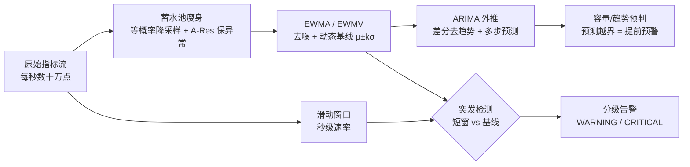

# 时序异常检测（EWMA / ARIMA / 滑动窗口）

> 多时间尺度分层：滑动窗口抓秒级突发 · EWMA 做分钟级动态基线 · ARIMA 抢小时天级趋势外推

::: tip 🧠 一句话记忆锚点
**监控/预判的核心矛盾是"海量指标存不下、看不过来，却要既抓秒级突发又能提前预判"。答案不是某个银弹，而是按时间尺度分层：滑动窗口（秒·突发）→ EWMA（分·去噪+动态基线 μ±kσ）→ ARIMA（时天·趋势/季节外推抢提前量）。报警阈值绝不用固定线，用 EWMA 的 μ±kσ 随业务节律自动升降；突发检测靠"短窗 vs 长期基线"双尺度对比，既灵敏又少误报。**
:::

## 场景问题

线上服务的指标流（QPS、错误率、延迟、内存）有三个共存的诉求，单一手段都满足不了：

- **抓突发**：秒级的流量尖刺 / 错误暴涨要**立刻**报警——长期基线会把它平滑掉。
- **少误报**：白天高峰和半夜低峰的"正常值"差一个数量级，**固定阈值**要么白天误报要么半夜漏报。
- **抢提前量**：磁盘写满、内存缓慢泄漏、容量将耗尽——要在**真正爆炸前**预警，而不是炸了才告警。

再叠加"指标点海量到存不下"的现实约束（每秒数十万点），就需要一条**多时间尺度流水线**：谁负责"现在炸没炸"、谁负责"平时多少"、谁负责"接下来往哪走"，各司其职。数据"存什么"（降采样且保异常）由蓄水池负责，见 [蓄水池抽样](../game-infra/reservoir-sampling.md)。

## 实现方案



三个手段本质是**不同时间尺度的分层防御**：

| 手段 | 时间尺度 | 内存/算力 | 能力 | 典型用途 |
|---|---|---|---|---|
| 滑动窗口 | 秒级 | O(窗口桶数) | 即时突发速率/计数 | 突发高警、限流 |
| EWMA / EWMV | 分钟级 | O(1) 每流 | 去噪、动态基线、异常度打分 | 实时基线、3σ 报警 |
| ARIMA / SARIMA | 小时~天 | O(n) 拟合 | 趋势/季节外推、提前量 | 容量预判、周期性预测 |

### 1）EWMA：去噪 + 动态基线（分钟级）

原始曲线抖动大，静态阈值不是误报就是漏报。**EWMA（指数加权移动平均）**用一行递推得到平滑基线，且 **O(1) 内存、O(1) 每点**，天然适合海量实时流：

$$
s_t = \alpha\, x_t + (1-\alpha)\, s_{t-1}
$$

`α` 越大越"跟手"（对突变敏感、噪声大），越小越平滑（滞后大）。工程上常用**半衰期**反推 `α`：希望旧值经过 `H` 个点权重衰减一半，则 `(1-α)^H = 0.5`，即 `α = 1 - 0.5^(1/H)`。同时用 **EWMV（指数加权方差）** 得到动态的 `σ`，报警阈值就是随基线漂移的 `μ ± kσ`，而不是拍脑袋的固定线。

```go
package tsdetect

import "math"

// EWMA 同时维护指数加权均值(mean)与方差(varc, EWMV)。
type EWMA struct {
	alpha float64
	mean  float64 // s_t
	varc  float64 // EWMV：方差估计
	init  bool
}

// NewEWMA 用半衰期 H（多少个点后旧权重减半）构造，比直接调 alpha 更直观。
func NewEWMA(halfLife float64) *EWMA {
	alpha := 1 - math.Pow(0.5, 1.0/halfLife) // (1-α)^H = 0.5
	return &EWMA{alpha: alpha}
}

func (e *EWMA) Update(x float64) {
	if !e.init {
		e.mean, e.init = x, true
		return
	}
	diff := x - e.mean
	incr := e.alpha * diff
	e.mean += incr
	// 指数加权方差（West 增量式）：var = (1-α)(var + diff·incr)
	e.varc = (1 - e.alpha) * (e.varc + diff*incr)
}

// UpperBound 动态 kσ 上界，作为随基线漂移的报警线。
func (e *EWMA) UpperBound(k float64) float64 {
	return e.mean + k*math.Sqrt(e.varc)
}
```

::: tip
EWMA 只描述"当前水平 + 波动"，**不外推未来**。它是"实时基线 + 异常度打分"的主力，也是下面滑动窗口突发检测的"长期参照系"。要真正**预判未来趋势/季节**，得上 ARIMA。
:::

### 2）ARIMA：趋势/季节外推，抢提前量（小时~天级）

`ARIMA(p, d, q)` 把一条序列拆成三块：

- **I（差分，`d` 阶）**：做 `d` 次差分把带趋势的非平稳序列变平稳（`y_t = x_t - x_{t-1}`）。平稳性可用 ADF 检验定 `d`。
- **AR（自回归，`p` 阶）**：`X_t = c + \sum_{i=1}^{p}\varphi_i X_{t-i} + \varepsilon_t`，用过去 `p` 个值线性预测当前。
- **MA（移动平均，`q` 阶）**：`+ \sum_{j=1}^{q}\theta_j \varepsilon_{t-j}`，用过去 `q` 个残差修正。

定阶经验：**PACF 在 `p` 阶后截尾 → 定 AR(p)；ACF 在 `q` 阶后截尾 → 定 MA(q)**。监控里的价值在**提前量**：对分钟级聚合序列拟合 ARIMA，预测未来 `N` 步及其置信区间，**实际值一旦越界就在真正爆炸前预警**（容量预判、慢性泄漏预判）。日/周周期强的指标改用 **SARIMA**（带季节项）或 Holt-Winters。

下面给出**可独立运行的 AR 核心**——`ARIMA(p,1,0)`（一阶差分 + AR(p) 最小二乘拟合 + 递推外推 + 逆差分还原）。完整 ARIMA 的 MA(q) 项需极大似然/迭代估计，工程上多交给 `statsmodels` 等库；但 AR 核心已能覆盖"去趋势 + 短期外推"的多数预判需求。

```go
package tsdetect

import "math"

// ARIMA(p,1,0)：一阶差分去趋势 + AR(p) 自回归。
type ARIMA struct {
	p   int
	phi []float64 // AR 系数
}

func diff(x []float64) []float64 {
	d := make([]float64, len(x)-1)
	for i := 1; i < len(x); i++ {
		d[i-1] = x[i] - x[i-1]
	}
	return d
}

// Fit 对序列做一阶差分后，用最小二乘（正规方程）拟合 d[t] ≈ Σ φ_i·d[t-i]。
func Fit(series []float64, p int) *ARIMA {
	d := diff(series)
	n := len(d)
	A := make([][]float64, p) // 正规方程 A = XᵀX
	b := make([]float64, p)   //          b = Xᵀy
	for i := range A {
		A[i] = make([]float64, p)
	}
	for t := p; t < n; t++ {
		y := d[t]
		for i := 0; i < p; i++ {
			xi := d[t-1-i]
			b[i] += xi * y
			for j := 0; j < p; j++ {
				A[i][j] += xi * d[t-1-j]
			}
		}
	}
	return &ARIMA{p: p, phi: solve(A, b)}
}

// Forecast 外推 h 步：AR 递推预测差分，再逐步逆差分还原到原尺度。
func (m *ARIMA) Forecast(series []float64, h int) []float64 {
	hist := append([]float64{}, diff(series)...)
	last := series[len(series)-1]
	out := make([]float64, h)
	for step := 0; step < h; step++ {
		yhat := 0.0
		for i := 0; i < m.p; i++ {
			yhat += m.phi[i] * hist[len(hist)-1-i]
		}
		hist = append(hist, yhat) // 预测值当作已知，继续递推
		last += yhat              // 逆差分：累加回原尺度
		out[step] = last
	}
	return out
}

// solve 高斯消元（带主元）解 A x = b。
func solve(A [][]float64, b []float64) []float64 {
	n := len(b)
	for c := 0; c < n; c++ {
		piv := c
		for r := c + 1; r < n; r++ {
			if math.Abs(A[r][c]) > math.Abs(A[piv][c]) {
				piv = r
			}
		}
		A[c], A[piv] = A[piv], A[c]
		b[c], b[piv] = b[piv], b[c]
		for r := c + 1; r < n; r++ {
			f := A[r][c] / A[c][c]
			for k := c; k < n; k++ {
				A[r][k] -= f * A[c][k]
			}
			b[r] -= f * b[c]
		}
	}
	x := make([]float64, n)
	for r := n - 1; r >= 0; r-- {
		s := b[r]
		for k := r + 1; k < n; k++ {
			s -= A[r][k] * x[k]
		}
		x[r] = s / A[r][r]
	}
	return x
}
```

::: warning
EWMA vs ARIMA 不是二选一：**EWMA 是 ARIMA 的特例**（`ARIMA(0,1,1)` 在特定 `θ` 下等价于 EWMA 预测）。海量流的实时基线用 EWMA（O(1)、无需拟合）；需要**多步趋势/季节外推**才上 ARIMA（要攒历史、周期性重拟合，算力更重，通常准实时/离线跑）。
:::

### 3）滑动窗口：秒级突发高警

EWMA/ARIMA 的时间尺度偏长，**秒级突刺会被长期基线稀释而漏报**。突发检测必须有一个**秒级短窗**独立盯着瞬时速率，再拿它和 EWMA 长期基线对比分级。滑动窗口用**按秒分桶的环形缓冲**实现，时间推进时把跨过的旧桶清零即可 O(1) 滑动：

```go
package tsdetect

import (
	"math"
	"time"
)

// SlidingWindow 按秒分桶的滑动窗口速率统计（环形缓冲）。
type SlidingWindow struct {
	buckets []float64
	size    int
	last    int64 // 当前 head 对应的秒时间戳
	head    int
}

func NewSlidingWindow(seconds int) *SlidingWindow {
	return &SlidingWindow{buckets: make([]float64, seconds), size: seconds}
}

func (w *SlidingWindow) Add(ts time.Time, v float64) {
	sec := ts.Unix()
	if w.last == 0 {
		w.last = sec
	}
	for w.last < sec { // 时间推进：跨过的桶清零，实现窗口滑动
		w.head = (w.head + 1) % w.size
		w.buckets[w.head] = 0
		w.last++
	}
	w.buckets[w.head] += v
}

func (w *SlidingWindow) Sum() float64 {
	s := 0.0
	for _, b := range w.buckets {
		s += b
	}
	return s
}

// Grade 突发分级：短窗速率对比 EWMA 长期基线 μ±kσ。
// 短窗把秒级突刺放大，EWMA 提供随时间漂移的动态阈值，两者结合既灵敏又少误报。
func Grade(shortRate float64, base *EWMA) string {
	mu, sigma := base.mean, math.Sqrt(base.varc)
	switch {
	case shortRate > mu+3*sigma:
		return "CRITICAL" // 远超基线，突发
	case shortRate > mu+2*sigma:
		return "WARNING"
	default:
		return "OK"
	}
}
```

::: tip
突发检测的关键是**双尺度对比**：短窗（秒级、抓突刺）给"现在多少"，EWMA（分钟级、抓漂移）给"平时多少"，`μ+kσ` 就是随业务节律自动升降的阈值。比"固定阈值"少误报（半夜低峰不会把正常波动当突发），比"只看瞬时值"少漏报（白天高峰的真突发照样抓得住）。更抗噪的变体是 **CUSUM / EWMA 控制图**，对缓慢累积的漂移比单点 3σ 更敏感。
:::

## 为什么这么做

- **为什么要多时间尺度分层**：突发（秒）、基线漂移（分钟）、趋势/季节（小时天）是本质不同的信号，一个尺度的手段必然对其它尺度失明。分层后各司其职、能力互补。
- **为什么报警用 μ±kσ 而非固定阈值**：业务量本身随时段起伏，固定线在高峰误报、低峰漏报；EWMA 动态基线让阈值随节律自动升降。
- **为什么突发检测要双尺度**：只看短窗无法判断"多少算异常"，只看长基线又会平滑掉尖刺；短窗给"现在"，长基线给"平时"，对比才有意义。
- **为什么 EWMA 用增量式方差**：海量流不能存历史点重算方差，West 的增量公式 O(1) 更新即可维护动态 σ。

## 为什么别的选择不行

- **只用一个手段（如只 EWMA）**：秒级突刺被分钟级基线平滑漏报；只滑动窗口又无"平时多少"的参照。必须分层。
- **报警只用固定阈值**：白天高峰误报、半夜低峰漏报。要用 EWMA 动态基线 `μ±kσ`。
- **只用瞬时值判突发**：噪声大、误报高，且无法区分"高峰的正常高"与"真突发"。
- **上来就全套 ARIMA/深度学习**：算力重、需攒历史与周期性重拟合；实时基线用 O(1) 的 EWMA 就够，ARIMA 只在需要多步外推抢提前量时才上。
- **原始指标全量落库**：又贵又无必要，绝大多数点是正常无聊的。用[蓄水池 A-Res](../game-infra/reservoir-sampling.md)降采样且保异常。

## 沉淀结论

::: tip 速记
- 三尺度：滑动窗口(秒·突发) / EWMA(分·基线) / ARIMA(时天·外推)
- 报警阈值用 EWMA 动态 μ±kσ，绝不用固定线
- 突发检测 = 短窗 vs 长期基线双尺度对比
- EWMA 是 ARIMA 的特例；实时基线用 EWMA，多步外推才上 ARIMA
- "存什么"交给蓄水池 A-Res 保异常
:::

### 面试高频题清单

- **Q：为什么监控要多时间尺度分层？** A：突发(秒)、基线漂移(分)、趋势(时天)是不同信号，单尺度必对其它失明；分层各司其职、互补而非替代。
- **Q：报警为什么不用固定阈值？** A：业务量随时段起伏，固定线高峰误报低峰漏报；用 EWMA 动态 μ±kσ 随节律升降。
- **Q：EWMA 的 α 怎么定？** A：常用半衰期 H 反推，`α = 1 - 0.5^(1/H)`，H 越大越平滑滞后越大。
- **Q：EWMA 和 ARIMA 什么关系？怎么选？** A：EWMA 是 ARIMA 的特例（ARIMA(0,1,1)）；实时基线 O(1) 用 EWMA，需多步趋势/季节外推才上 ARIMA（算力重、需拟合）。
- **Q：怎么抓秒级突发不误报？** A：秒级短窗抓瞬时速率，对比 EWMA 长期基线 μ+kσ 分级，双尺度既灵敏又少误报。
- **Q：比单点 3σ 更抗缓慢漂移的手段？** A：CUSUM / EWMA 控制图，对累积微小漂移更敏感。

### 记忆口诀

- **三尺度**：滑窗秒突发 / EWMA 分基线 / ARIMA 时天外推
- **EWMA**：一行递推 / O(1) / 半衰期定 α / EWMV 出动态 σ
- **ARIMA**：差分去趋势 / AR 自回归 / MA 修残差 / 抢提前量
- **报警**：μ±kσ 动态线 / 短窗 vs 长基线双尺度 / CUSUM 抓漂移

## 内容来源

综合整理。参考资料：Box & Jenkins《Time Series Analysis: Forecasting and Control》（ARIMA/SARIMA 建模与定阶）、Roberts "Control Chart Tests Based on Geometric Moving Averages"（1959，EWMA 控制图）、Page "Continuous Inspection Schemes"（1954，CUSUM），以及监控异常检测、分布式 Trace 采样与容量预判的工程实践。数据降采样/保异常见 [蓄水池抽样](../game-infra/reservoir-sampling.md)。

## 自测：合上资料能说清楚吗？

1. 监控预判为什么要"多时间尺度分层"而不是只用一个手段？

<details><summary>参考答案</summary>

单一手段有盲区：**滑动窗口**(秒级)抓突刺但无长期视角；**EWMA**(分钟级)给动态基线 μ±kσ 但不外推未来；**ARIMA**(小时~天)能趋势/季节外推抢提前量但算力重需拟合。时间尺度递增、能力互补，是**分层防御**而非替代。

</details>

2. EWMA 的递推公式是什么？半衰期 H 如何反推 α？

<details><summary>参考答案</summary>

`s_t = α·x_t + (1-α)·s_{t-1}`。希望旧值经过 H 个点权重减半，即 `(1-α)^H = 0.5`，故 `α = 1 - 0.5^(1/H)`。H 越大 α 越小、越平滑、滞后越大；H 越小越"跟手"、对突变敏感但噪声大。

</details>

3. 为什么报警阈值要用 EWMA 的 μ±kσ 而不是固定阈值？

<details><summary>参考答案</summary>

业务量随时段起伏（白天高峰、半夜低峰差一个量级）。固定阈值会在高峰**误报**、低峰**漏报**。EWMA 维护动态均值 μ 与动态方差 σ（EWMV），阈值 `μ±kσ` 随业务节律自动升降，既少误报又少漏报。

</details>

4. 秒级突发检测为什么要"双尺度对比"？只看短窗或只看长基线各差在哪？

<details><summary>参考答案</summary>

只看**短窗**无法判断"多少算异常"（缺参照，且高峰的正常高会误报）；只看**长基线**会把秒级尖刺平滑掉而漏报。双尺度：短窗给"现在多少"、EWMA 长基线给"平时多少 + 动态阈值 μ+kσ"，对比才既灵敏又少误报。

</details>

5. EWMA 和 ARIMA 是什么关系？各自适合什么场景？

<details><summary>参考答案</summary>

**EWMA 是 ARIMA 的特例**（`ARIMA(0,1,1)` 在特定 θ 下等价于 EWMA 预测）。EWMA **O(1)、无需拟合**，适合海量流的实时基线与异常度打分，但**不外推未来**；ARIMA 能做**多步趋势/季节外推**抢提前量（容量/泄漏预判），但需攒历史、周期性重拟合、算力更重，通常准实时/离线跑。

</details>
