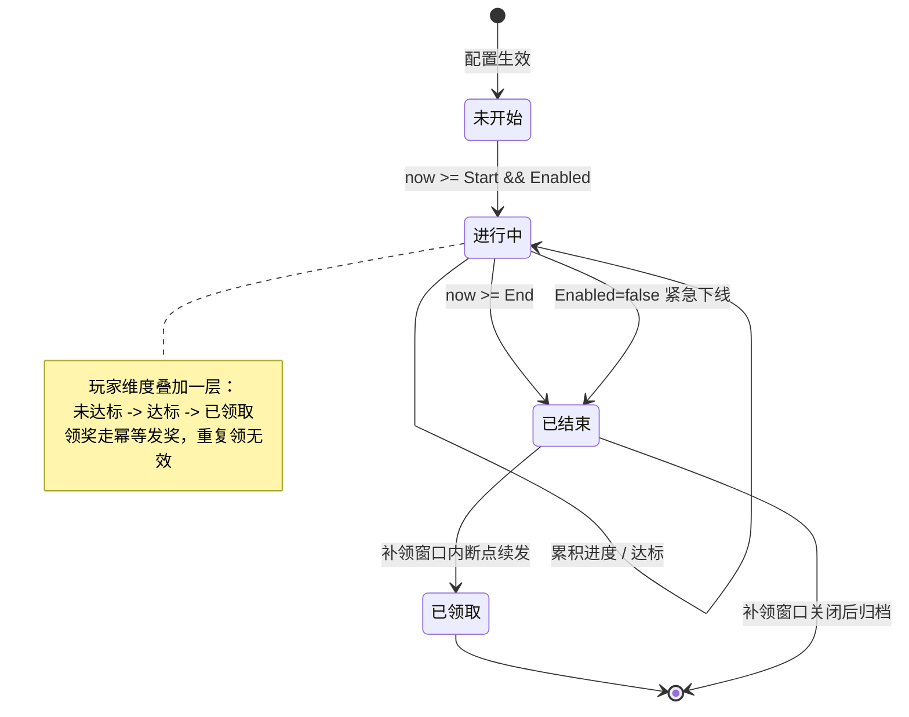

# 多模板游戏活动框架

签到 / 累充 / 兑换 / 排行 / 任务——用一套框架把同质活动配置化上线。

::: tip 一句话结论
条件-进度-奖励三段抽象 + 模板配置分离，通用能力下沉防资损，新玩法插件注册零改核心。
:::

## 场景问题

运营节奏一起来，活动就是流水线：这周上"7 日签到送皮肤"，下周上"累计充值 648 送限定"，节日再叠一个"积分兑换商城"。它们的**玩法外壳**千差万别，但**骨架高度雷同**：

- 都有一个**参与条件**（等级 ≥ 10、绑定手机、指定渠道）；
- 都在**累积进度**（登录天数、累充金额、消耗积分、击杀数）；
- 都在**发奖**（到点/达标后给道具，可能分档、可能多次领取）；
- 都有**时间窗与开关**（预热、开始、结束、可延长、可紧急下线）。

如果每个活动都从零写一遍，会撞上两类事故：

::: warning 两类真实事故
1. **重复发奖 / 少发奖**：进度累积、领奖状态、断线补发这些逻辑每个活动各写各的，某个活动漏了幂等判断，回调重投一次就多发一份道具，直接对应线上资损。
2. **上线慢 + 改核心**：策划想加个新玩法（比如"邀请好友返利"），开发就得改主流程、走全量回归，一个活动排期两周，运营等不起。
:::

所以我们要的不是"再写一个活动"，而是一套**多模板活动框架**：策划配表就能上线，通用能力（进度/发奖/防重/续发）下沉复用，新玩法通过扩展点接入而不动核心。

## 实现方案

### 三段抽象：条件 - 进度 - 奖励

一个活动无论玩法如何，都能拆成正交的三段。框架把这三段定义成接口，玩法只实现自己关心的那段：

```go
// Condition：能否参与 / 单次行为是否计入
type Condition interface {
    // 校验玩家是否满足准入条件（等级、渠道、白名单……）
    Check(ctx *ActCtx, uid uint64) bool
}

// Progress：把一次业务事件转成进度增量并累积
type Progress interface {
    // 收到业务事件（登录/充值/击杀）时被调用，返回累积后的最新进度
    Accumulate(ctx *ActCtx, uid uint64, ev *Event) (cur int64, err error)
    // 查询当前进度（用于展示与领奖判定）
    Query(ctx *ActCtx, uid uint64) (cur int64, err error)
}

// Reward：按进度/档位计算并发放奖励
type Reward interface {
    // 校验某个奖励档位是否可领（达标 && 未领过）
    CanClaim(ctx *ActCtx, uid uint64, tier int32) (bool, error)
    // 幂等发放：内部走通用发奖能力，重复调用效果一致
    Grant(ctx *ActCtx, uid uint64, tier int32) (*GrantResult, error)
}
```

`ActCtx` 携带活动实例的运行期上下文（实例 ID、配置快照、时间窗、存储句柄）。三段之间只通过进度值和档位耦合，因此"签到活动"复用累计型 `Progress`、"累充活动"复用金额型 `Progress`，而 `Reward` 大多能共用同一套分档发奖实现。

### 模板 / 实例分离 + 配置驱动

**模板（Template）** 是玩法代码，只写一次；**实例（Instance）** 是策划的一份配置，决定"这次这个活动长什么样"。

```go
// 模板：注册进框架的玩法定义，全局仅一份
type Template struct {
    Name      string                       // "sign_in" / "cumulative_pay" / "exchange"
    NewCond   func(cfg *ActConfig) Condition
    NewProg   func(cfg *ActConfig) Progress
    NewReward func(cfg *ActConfig) Reward
}

// 实例：一份可热刷的活动配置（来自配置中心 / 配表）
type ActConfig struct {
    ActID    uint64         // 活动实例唯一 ID
    Template string         // 引用哪个模板
    Start    int64          // 开始时间（unix）
    End      int64          // 结束时间
    Enabled  bool           // 紧急开关，可热关
    Params   map[string]any // 玩法参数：档位表、准入条件、渠道白名单……
    Tiers    []RewardTier   // 奖励档位：{需要进度, 奖励包}
}
```

配置从配置中心拉取，监听变更做**热刷**（reload），不重启进程即可上新活动、改档位、紧急关停：

```go
func (m *Manager) OnConfigReload(cfgs []*ActConfig) {
    next := make(map[uint64]*ActInstance, len(cfgs))
    for _, cfg := range cfgs {
        tpl, ok := m.templates[cfg.Template]
        if !ok {
            log.Errorf("act %d 引用了未注册模板 %s，跳过", cfg.ActID, cfg.Template)
            continue // 坏配置隔离：不让一份错配拖垮整个框架
        }
        inst := &ActInstance{
            cfg:    cfg,
            cond:   tpl.NewCond(cfg),
            prog:   tpl.NewProg(cfg),
            reward: tpl.NewReward(cfg),
        }
        next[cfg.ActID] = inst
    }
    m.instances.Store(next) // 原子替换，读侧无锁
}
```

### 活动状态机

每个活动实例在生命周期里只允许合法流转。**时间窗**驱动 未开始→进行中→已结束，玩家侧再叠一层 达标→已领取：



状态机是**领奖合法性的唯一判据**：只有"进行中 / 补领窗口内 + 已达标 + 未领过"才放行 `Grant`。

### 通用能力下沉

进度累积、幂等发奖、防重复领取、断点续发这四件事，是所有活动的公共分母，必须由框架统一提供，玩法不得各写各的：

```go
// 通用发奖：以 (actID, uid, tier) 为幂等键，去重键 + 唯一索引 + 事务三重保证只发一次
func (g *CommonGranter) Grant(ctx *ActCtx, uid uint64, tier int32) (*GrantResult, error) {
    key := fmt.Sprintf("act:grant:%d:%d:%d", ctx.ActID, uid, tier)

    // 1) 防重复领取：SETNX 抢去重令牌，抢不到说明已发过，回放上次结果
    if !g.store.SetNXWithTTL(key, "1", ctx.grantTTL) {
        return g.loadGrantRecord(ctx.ActID, uid, tier) // 幂等：回放
    }

    // 2) 事务内写发奖流水 + 调发货，任一失败整体回滚
    res, err := g.store.Tx(func(tx Tx) (*GrantResult, error) {
        if exist, _ := tx.GetGrantRecord(ctx.ActID, uid, tier); exist != nil {
            return exist, nil // 双重保险：唯一索引兜住并发窗口
        }
        r, err := g.deposit.Send(ctx, uid, ctx.Tiers[tier].Pack) // 原子发货
        if err != nil {
            return nil, err
        }
        tx.SaveGrantRecord(ctx.ActID, uid, tier, r)
        return r, nil
    })
    if err != nil {
        g.store.Del(key) // 失败释放去重键，允许重试
        return nil, err
    }
    return res, nil
}
```

- **进度累积**：统一 `INCRBY` / DB 事务累加，带上限截断（不让累充溢出）；
- **幂等发奖**：如上，去重键 + 唯一索引 + 事务三重，重复调用效果一致；
- **防重复领取**：领取状态即去重键，抢不到即视为已领；
- **断点续发**：活动结束后保留补领窗口，玩家上线扫"已达标未领取"的档位补发，不因当时离线而丢奖。

### 多模板扩展点：策略 + 插件注册

新玩法通过在框架**注册**一个模板接入，不改主流程。这就是策略模式（三段接口即策略）+ 插件注册：

```go
// 各玩法在 init 时把自己注册进框架，主流程零改动
func init() {
    RegisterTemplate(&Template{
        Name:      "invite_rebate", // 全新玩法：邀请返利
        NewCond:   func(c *ActConfig) Condition { return &channelCond{c} },
        NewProg:   func(c *ActConfig) Progress { return &inviteProg{c} }, // 只写"邀请计数"
        NewReward: func(c *ActConfig) Reward { return NewCommonReward(c) }, // 复用通用发奖
    })
}
```

新增一个玩法 = 新建一个文件 + 一次 `RegisterTemplate` + 一份配置。核心的状态机、时间窗、发奖幂等、断点续发全部复用。

## 为什么这么做

**为什么用框架而非每个活动单写？**
同质活动的公共分母（进度/发奖/防重/续发）如果各写各的，一是重复造轮子，二是**发奖事故**——只要有一个活动漏判幂等，回调重投就资损。把这些能力下沉到框架一处、测透一处，所有活动共享同一份经过验证的安全逻辑。

**为什么用配置 + 模板而非硬编码？**
活动的"变"在参数（时间、档位、准入、奖励包），"不变"在骨架（三段流程、状态机）。把变的部分抽成可热刷配置，策划配表即可上线、改档、紧急下线，开发不必为每次运营需求排期发版。硬编码则把"变"焊死在代码里，每改一次都要走全量发布。

**为什么用策略 + 插件注册做扩展？**
玩法的差异只落在"条件/进度/奖励"三段的某一段，用接口 + 注册表让新玩法**开闭**接入：对扩展开放（注册新模板），对修改关闭（不动核心状态机与发奖）。核心越稳定，全量回归的面越小。

## 为什么别的选择不行

**方案一：每个活动一个独立服务 / 独立代码。** 上线快感是假象——发奖、防重、补发的坑每个活动重踩一遍，且监控/对账无法统一。任何一个活动的幂等疏漏都是独立资损点，横向铺开后维护面爆炸。

**方案二：一个巨型 if-else 活动服务，玩法写死在主流程。** 加玩法就要改主流程、动核心分支，回归成本随玩法数线性上升；且"变"与"不变"耦合，策划一个小调整也要发版。

**方案三：纯配置无代码（规则引擎 DSL）。** 看似极致灵活，实则把复杂度转嫁到 DSL，策划学习成本高、调试困难，复杂玩法（跨活动联动、异步结算）表达不出来。模板 + 配置是折中：**常见玩法配表即得，特殊玩法写模板**，既有配置的敏捷也有代码的表达力。

## 沉淀结论

- **三段抽象（条件-进度-奖励）** 是活动框架的最小正交切分，让玩法只写差异段、复用公共段。
- **模板 / 实例分离 + 配置热刷** 把"变"关进配置、"不变"沉进代码，策划配表即上线。
- **状态机是领奖合法性的唯一判据**，时间窗 + 玩家达标状态双层收口。
- **四大通用能力（进度累积 / 幂等发奖 / 防重复领取 / 断点续发）必须下沉框架一处**，这是防资损的核心。
- **扩展走策略 + 插件注册**，新玩法开闭接入、核心零改动。

::: tip 落地检查清单
- 坏配置要隔离（引用未注册模板时跳过该实例，别拖垮全框架）；
- 发奖幂等键选 `(actID, uid, tier)`，去重键 + 唯一索引 + 事务三重兜底；
- 断点续发要有明确的**补领窗口**，窗口关闭后归档，避免无限扫描；
- 进度累积记得**上限截断**，防止累充 / 计数溢出。
:::

### 记忆口诀

- **三段抽象**：条件（准入）/ 进度（累积）/ 奖励（分档发放）
- **模板实例**：模板写一次（玩法代码）/ 实例配一份（可热刷）/ 坏配置隔离
- **防资损四件套**：进度累积（上限截断）/ 幂等发奖（去重键+唯一索引+事务）/ 防重复领取 / 断点续发（补领窗口）
- **扩展开闭**：策略接口 + 插件注册，新玩法零改核心

## 内容来源

综合整理自多模板活动框架的通用设计实践与游戏后台活动系统落地经验；发奖幂等部分与本域《业务幂等性设计》专题相互呼应。

## 自测：合上资料能说清楚吗？

1. 一个活动无论玩法如何都能拆成哪三段正交抽象？各自负责什么？

<details><summary>参考答案</summary>

**条件**（能否参与/单次是否计入）、**进度**（业务事件转增量并累积）、**奖励**（按进度分档校验与发放）。三段只通过**进度值和档位**耦合，玩法只实现差异段、复用公共段。

</details>

2. "模板"和"实例"分别是什么？为什么要分离？

<details><summary>参考答案</summary>

**模板**是玩法代码（全局一份，写一次）；**实例**是策划的一份配置（时间窗、档位、准入等，可热刷）。分离让"**变**"进配置、"**不变**"沉代码，策划配表即上线，开发不必每次运营需求发版。

</details>

3. 框架必须下沉的四大通用能力是什么？为什么是防资损核心？

<details><summary>参考答案</summary>

**进度累积**（上限截断）、**幂等发奖**、**防重复领取**、**断点续发**（补领窗口）。若各活动各写各的，只要一个漏判幂等，回调重投就多发道具直接资损；下沉一处、测透一处，所有活动共享同一份安全逻辑。

</details>

4. 领奖合法性的唯一判据是什么？幂等发奖如何三重兜底？

<details><summary>参考答案</summary>

判据是**状态机**："进行中/补领窗口内 + 已达标 + 未领过"才放行。幂等发奖以 **(actID, uid, tier)** 为键：**去重键 SETNX** + **唯一索引** + **事务**三重保证只发一次，重复调用回放上次结果。

</details>

5. 对比"每个活动独立服务"与"模板+配置框架"两种方案，各自的代价与收益？

<details><summary>参考答案</summary>

**独立服务**：上线快是假象，发奖/防重/补发的坑每个活动重踩，监控对账无法统一，每处幂等疏漏都是独立资损点。**模板+配置**：公共能力测透一处复用，策划配表上线、策略+插件注册开闭扩展，核心零改动、回归面小。

</details>
