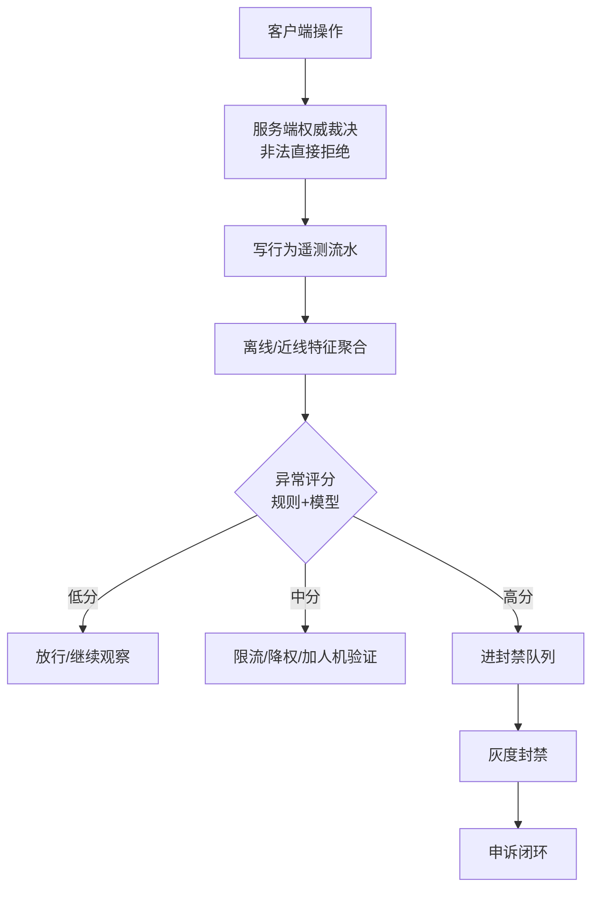
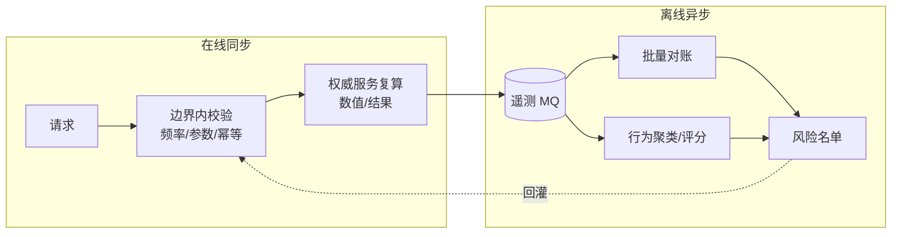
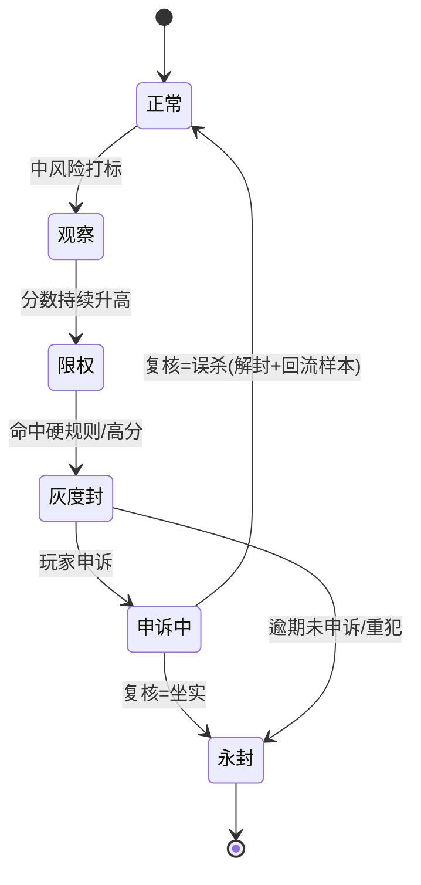

# 游戏反作弊

服务端权威 · 永不信任客户端 · 遥测评分 + 服务端复算 · 灰度封禁 + 申诉闭环——把"客户端只是输入设备"这条线守死。

::: tip 🧠 一句话记忆锚点
**客户端只负责表达意图、渲染画面，一切影响结果的判定都在服务端算。** 反作弊不是"抓外挂"，而是让作弊在架构上无从生效：关键数值服务端复算，异常靠遥测评分兜住漏网，处置走灰度封禁 + 申诉闭环防误杀。
:::

## 场景问题

作弊的本质是**玩家能篡改一个本该由系统裁决的结果**。一旦客户端上报的数据被无条件采信，作弊就成立：

- **内存修改 / 数值篡改**：用 CE（Cheat Engine）改本地金币、血量、坐标，客户端上报"我有 999999 钻石"，服务端照单全收；
- **加速外挂**：篡改客户端帧率 / 时间步长，让角色移动、攻击、采集速度翻数倍，同样时间产出翻倍；
- **自动化脚本 / 连点**：模拟点击刷副本、挂机打怪、抢购限量道具，用机器速度碾压真人；
- **协议重放与封包篡改**：抓包后重放"发奖"请求领十份奖励，或篡改请求参数把"买 1 个"改成"买 0 元 100 个"。

::: warning 一个真实的作弊画面
移动同步用的是"客户端上报新坐标，服务端存下"。外挂把坐标瞬移到 Boss 背后、或每帧位移拉满，服务端毫无判断地写库并广播——**瞬移穿墙、无敌风筝**全成立。根因：**服务端把客户端上报当成了事实，而不是当成一个待验证的请求。**
:::

所以每一个"影响余额 / 排名 / 战斗结果 / 库存"的操作都要问一句：**这个结果是客户端算的，还是服务端算的？** 只要是客户端算的，就等于把作弊权交给了玩家。

## 实现方案

### 服务端权威：信任边界与"永不信任客户端"

核心原则是 **server-authoritative（服务端权威）**：客户端上报的是**意图**（我想往这个方向走、我想用这个技能打这个目标），服务端负责**裁决结果**（能不能走、伤害多少、掉不掉血）。信任边界划在网络接口处——**边界之内（服务端）可信，边界之外（客户端）一律不可信**。

```go
// 反面：直接采信客户端上报的坐标 —— 瞬移外挂天堂
func OnMove(p *Player, req MoveReq) {
    p.Pos = req.NewPos          // 客户端说在哪就在哪
    broadcast(p.ID, p.Pos)
}

// 正面：客户端只报"意图方向 + 本地时间"，服务端复算是否合法
func OnMove(p *Player, req MoveReq) error {
    now := ServerNow()
    dt := now - p.LastMoveAt                    // 用服务端时钟算时间差，不信客户端时间戳
    maxDist := p.Speed * dt.Seconds() * TOLERANCE // 允许一点网络抖动余量
    want := p.Pos.Add(req.Dir.Scale(req.Step))
    if p.Pos.DistanceTo(want) > maxDist || !walkable(want) {
        return kickBack(p)  // 超过物理上限或穿墙：拉回上一个合法位置
    }
    p.Pos, p.LastMoveAt = want, now
    broadcast(p.ID, p.Pos)
    return nil
}
```

一句判据：**凡是能换成钱、道具、排名、胜负的数值，其最终值必须由服务端计算或复算得出，客户端给的只能是输入。**

> **打个比方**：反作弊像**竞技赛场的药检 + 场馆摄像头**——不管选手怎么自称"我干净"，**每场必须抽血尿检（服务端权威复算）**；场馆里还有几十个摄像头**从各角度录像**（行为遥测流水），赛后有可疑动作可以调录像回看；同时**入场要刷身份证 + 指纹**（硬件指纹/设备识别）挡住冒名顶替。选手的"自我陈述"永远只是**待验证的证词**，不是判决依据。**类比失效边界**：药检也有**漏检率**（新型兴奋剂、掩蔽剂），反外挂**同样不可能 100% 判定**——尤其行为特征处于人类与脚本之间的"灰色地带"。所以一刀切的**永封处罚会产生假阳性误伤**（高手被误认为脚本），必须搭配"**分层处置**（观察 / 限流 / 加验证码 / 灰度封）+ **申诉闭环**"，把"高置信度的重罚"和"低置信度的软性干预"分开，不能让一条评分线直接决定玩家账号生死。

### 作弊类型与检测信号

不同作弊在服务端留下的痕迹不同，检测信号要对症下药：

| 作弊类型 | 服务端可见信号 | 检测手段 |
| --- | --- | --- |
| 内存修改 / 数值篡改 | 数值超出业务上限、与来源流水对不上 | 服务端复算 + 账实对账（拥有量 = Σ获得 − Σ消耗） |
| 加速外挂 | 单位时间产出/操作次数超物理上限 | 服务端时钟算速率、频率阈值 |
| 自动化脚本 / 连点 | 操作间隔过于规律、24h 无休、点击热区固定 | 行为特征统计、间隔方差、人机验证 |
| 协议重放 | 同一请求重复到达、幂等键/nonce 重复 | 幂等去重 + nonce 单调递增校验 |
| 封包篡改 | 参数越界、签名不匹配 | 请求签名 + 参数服务端重新校验 |

::: warning 客户端反外挂只是"提高门槛"，不是"保证"
客户端加固（内存加密、反调试、完整性校验、驱动级检测）能挡住小白和批量脚本，但**运行在玩家机器上的东西终究可被绕过**。它的价值是抬高作弊成本、给服务端争取遥测时间，**绝不能替代服务端权威**。
:::

### 遥测与异常评分：规则 + 模型

不是所有作弊都能被单次请求当场判死（比如"手速略快"可能是高手也可能是脚本）。这类靠**遥测（telemetry）**采集行为流水，做**异常评分**：

```go
// 分层评分：硬规则一票否决 + 统计阈值 + 模型打分，加权汇总成风险分
func RiskScore(f Features) float64 {
    // 1) 硬规则：物理上不可能，直接顶格
    if f.ProdPerMin > PHYS_MAX { return 1.0 }
    // 2) 统计阈值：操作间隔方差极小 => 机器般规律
    ruleScore := 0.0
    if f.ClickIntervalStdDev < 5*time.Millisecond { ruleScore += 0.4 }
    if f.OnlineHours24h > 22 { ruleScore += 0.3 }          // 几乎不下线
    if f.WinRate > 0.98 && f.Samples > 200 { ruleScore += 0.3 }
    // 3) 模型分：用历史黑样本训练的分类器给概率
    modelScore := model.Predict(f)
    return 0.5*clamp01(ruleScore) + 0.5*modelScore          // 加权融合
}
```

规则负责**可解释、能立刻上线的硬红线**；模型负责**捕捉规则写不出来的组合特征**。两者融合后按分数分档处置（观察 / 限流 / 灰度封）。



### 分布式校验：不逐服务查询

大流量下不可能每个操作都同步去查所有服务、跑全量校验。分层把校验成本压下来：

- **边界内校验（同步、廉价）**：单次请求内能判定的（参数越界、频率超限、幂等重复），在入口处**本地/单服**判掉，绝不外呼。
- **关键操作服务端复算（同步、精确）**：涉及金币/道具/排名的写，复算落在**持有该数据的权威服务**内完成，一次事务搞定，不跨服拉数据比对。
- **批量 / 异步校验（离线、全局）**：跨服、跨时段的关联分析（对账、行为聚类、风险评分）走**异步管道**——遥测流水投 MQ，离线任务批量算，出黑名单再回灌。**检测与在线请求解耦**，不拖慢玩家操作。



**防重放**这一环直接复用[幂等设计](./idempotency-design.md)：给发奖/购买请求加**幂等键 + nonce**，服务端去重表 + 唯一索引拦住重复到达的同一请求；订单类走状态机 CAS，重复回调 CAS 失败即幂等返回，天然抗重放。商城/支付链路的**防重复发货**则由[业务代理](./business-proxy.md)的支付代理"幂等四道闸"兜底——抓包重放"发货"请求，会因幂等键已存在而被回放既有结果，不会多发。

### 封禁与申诉闭环

检测有假阳性，处置必须**可回滚、可申诉**，否则误杀会赶走真玩家：

- **灰度封禁**：不一刀切永封。按风险分分档——观察期打标、限制交易/组队、临时禁赛、限时封、永封逐级升级；高分账号先进人工复核队列而非自动永封。
- **误杀申诉**：保留判定证据（触发规则、命中特征、时间线），玩家申诉时可复盘；申诉通过则解封 + 把该样本回灌训练集降低同类误杀。
- **闭环**：封禁 → 申诉 → 复核 → 解封/维持 → 样本回流，形成持续迭代，检测模型越用越准。



## 为什么这么做

**为什么服务端权威是地基而不是可选项？** 因为客户端运行在玩家完全掌控的机器上，内存、网络、二进制都能被改。任何"信任客户端上报值"的设计，都等于把最终裁决权交给了可能是攻击者的人。只有把裁决收进服务端，作弊才失去生效的土壤——外挂顶多改本地显示，改不了服务端账本。

**为什么要"复算"而不是"校验上报值"？** 校验上报（比如判断上报伤害是否 < 上限）只能挡住越界的笨作弊，挡不住"在合理区间内持续偏高"的巧作弊。**服务端拿输入自己算一遍结果**，客户端报什么结果根本不参与，才是彻底的。校验是补丁，复算是根治。

**为什么规则和模型都要，还要异步评分？** 单次请求的信息量有限，很多作弊（脚本、工作室）要靠跨时间、跨账号的行为模式才暴露。硬规则给出可解释的即时红线，模型捕捉复杂组合，离线异步管道让重计算不拖累在线链路——三者分工，既准又不影响体验。

## 为什么别的选择不行

**纯客户端反外挂（加固/反调试）扛不住。** 它运行在敌方地盘，再强的加固也能被逆向、被虚拟机绕过。它只提高门槛、争取时间，一旦被当作正确性保证，破解那天所有防线一起崩。

**"上报值直接采信 + 事后对账"代价太大且太晚。** 等对账发现异常，钻石已经刷出来、排行榜已经污染、限量道具已被脚本抢空，资损和体验损失已经发生。对账是审计手段，不能替代实时的服务端权威裁决。

**"每个操作同步跑全量分布式校验"扛不住量。** 逐服务查询、跨服比对会把延迟和耦合拉满，热点服务被校验流量打垮。正确姿势是**边界内能判的同步判掉、关键值权威服务内复算、全局关联走异步**，把成本分层。

**"一律自动永封"会赶走真玩家。** 检测必有假阳性，硬核处置遇到误杀就是不可逆的口碑灾难。必须灰度分档 + 申诉闭环，给系统留纠错余地，也让检测持续进化。

## 沉淀结论

::: tip 速记
反作弊三支柱：**服务端权威（结果只在服务端算）+ 遥测评分（规则+模型兜漏网）+ 灰度封禁申诉闭环（可回滚防误杀）**。防重放直接复用幂等键/nonce。校验分层：边界内同步判、权威服务复算、全局异步算。
:::

- **永不信任客户端**：上报只是意图，凡能换钱/道具/排名/胜负的数值必须服务端计算或复算。
- **信任边界划在网络接口**：界内可信、界外不可信，客户端反外挂只是抬门槛不是保证。
- **检测信号对症**：数值篡改靠复算+对账、加速靠服务端时钟算速率、脚本靠行为特征、重放靠幂等+nonce、封包靠签名+参数复算。
- **规则 + 模型 + 异步评分**：硬规则可解释即时上线，模型抓组合特征，离线管道不拖累在线。
- **校验分层不逐服查**：边界内同步判、关键操作权威服务内复算、跨服全局走批量异步回灌。
- **处置要闭环**：灰度封禁分档、保留证据、误杀可申诉、样本回流让模型越用越准。

### 面试高频题清单

1. 什么是服务端权威（server-authoritative）？为什么它是反作弊的地基？
2. 客户端上报坐标/伤害为什么不能直接采信？该怎么改成服务端复算？
3. 内存修改、加速外挂、脚本、协议重放，服务端各能看到什么信号、怎么检测？
4. 遥测异常评分里，规则和模型各负责什么？为什么要融合、为什么走异步？
5. 大流量下如何做分布式校验而不逐服务查询？（边界内/权威复算/异步三层）
6. 防重放和幂等设计什么关系？封禁为什么要灰度 + 申诉闭环？

### 记忆口诀

- **权威**：客户端报意图 / 服务端算结果 / 界外全不信
- **信号**：篡改靠复算对账 / 加速靠时钟速率 / 脚本靠行为特征 / 重放靠幂等 nonce
- **评分**：硬规则即时红线 / 模型抓组合 / 离线异步不拖在线
- **分层**：边界内同步判 / 权威服务复算 / 全局批量异步
- **处置**：灰度分档 / 留证据 / 可申诉 / 样本回流

## 内容来源

综合整理自服务端权威架构的通用实践、游戏遥测与风控评分的落地经验；防重放/防重复发货部分呼应本域《业务幂等性设计》的幂等键 + 唯一索引 + 状态机 CAS 范式，与《业务代理 · 支付 · 商城》支付代理"幂等四道闸"的实战总结。

## 自测：合上资料能说清楚吗？

1. 什么是"服务端权威"？信任边界划在哪里，为什么客户端上报的值一律不可信？

<details><summary>参考答案</summary>

服务端权威指**一切影响结果的判定都在服务端计算/复算**，客户端只上报**意图**（方向、目标、想买什么），不上报最终结果。信任边界划在**网络接口**：界内（服务端）可信、界外（客户端）不可信。因为客户端运行在玩家完全掌控的机器上，内存/网络/二进制都能被篡改，采信上报值等于把裁决权交给潜在攻击者。

</details>

2. 客户端上报移动坐标为什么危险？服务端复算应该怎么做？

<details><summary>参考答案</summary>

直接写入上报坐标，外挂就能瞬移穿墙、无敌风筝。正确做法：客户端只报**方向和步长意图**，服务端用**自己的时钟**算时间差 `dt`，算出速度允许的最大位移 `speed*dt`，判断目标点是否超上限、是否可行走；超了就拉回上一个合法位置。结果由服务端算，客户端报什么都不直接采信。

</details>

3. 加速外挂和自动化脚本在服务端各留下什么信号？怎么区分脚本和高手？

<details><summary>参考答案</summary>

加速外挂表现为**单位时间产出/操作次数超过物理上限**，用服务端时钟算速率即可判定。脚本表现为**操作间隔过于规律（方差极小）、24h 几乎不下线、点击热区固定**。区分脚本和高手不能靠单次请求，要靠**遥测聚合的行为特征 + 统计阈值 + 模型评分**，必要时加人机验证——单点难判的交给跨时间的行为模式。

</details>

4. 大流量下如何做分布式校验又不逐服务同步查询？

<details><summary>参考答案</summary>

分三层：**边界内校验**——单请求能判的（参数越界、频率、幂等重复）在入口本地判掉，不外呼；**权威服务复算**——涉及金币/道具/排名的写，复算在持有该数据的服务内一次事务完成，不跨服拉数据；**批量异步校验**——跨服、跨时段的对账和行为评分走 MQ + 离线任务，出风险名单再回灌。检测与在线请求解耦，不拖慢操作。

</details>

5. 防重放为什么能直接复用幂等设计？封禁处置为什么要灰度 + 申诉闭环？

<details><summary>参考答案</summary>

协议重放的本质是**同一请求被重复投递**，正是幂等要解决的问题：给发奖/购买加**幂等键 + nonce**，服务端去重表 + 唯一索引拦住重复到达，订单类走状态机 CAS，重复回调 CAS 失败即幂等返回——抓包重放"发货"也只回放既有结果，不多发。封禁必须**灰度 + 申诉闭环**是因为检测有假阳性：一律自动永封会误杀真玩家造成不可逆口碑损失，所以分档处置（观察/限权/限时/永封）、保留判定证据、误杀可申诉解封，且样本回流训练集让模型越用越准。

</details>
