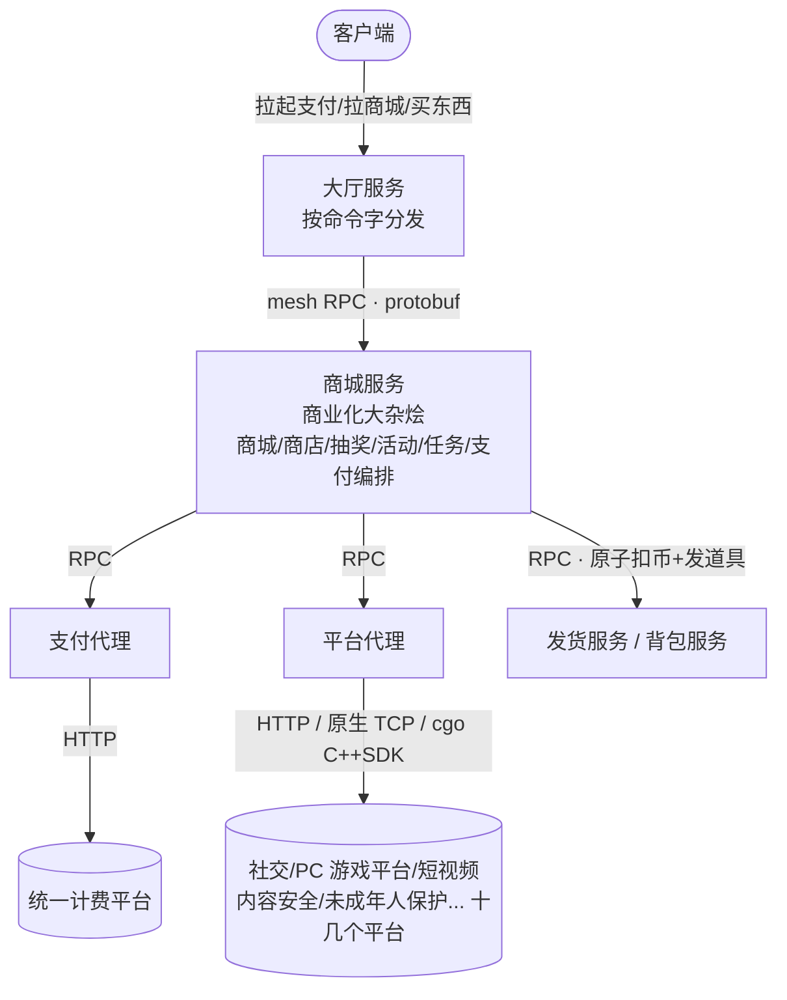
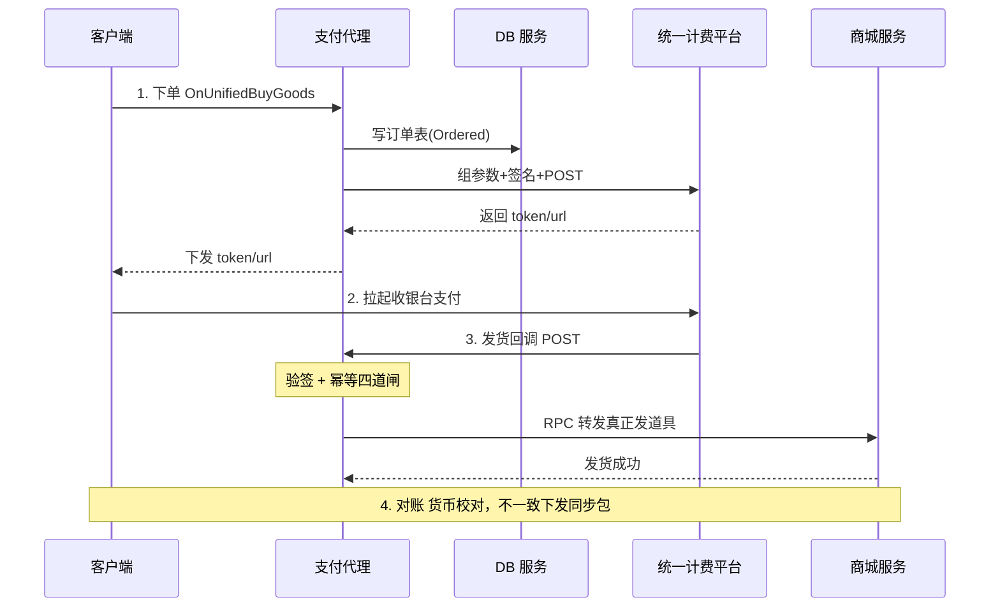

# 业务代理 · 支付 · 商城

平台代理 / 支付代理 / 商城服务 三模块技术演进

::: tip 一句话结论
平台代理管出口、支付代理管钱、商城管编排，三模块各司其职分层解耦。
:::

## 场景问题

商业化链路要同时对接十几个外部平台、把"钱"收准、把道具发对，并且让多人并行开发不互相踩踏。三个模块各司其职：

**三模块关系图**



**一句话定位**

- **平台代理**：对接"各种平台"的**统一出口**，一个平台能力一个文件，横向铺
- **支付代理**：只对接**统一计费平台**，围绕"钱"做重试、幂等、对账
- **商城服务**：商业化业务编排层，自己不碰外部平台，靠支付代理收钱、靠发货服务发货

## 实现方案

**平台代理**

统一对接内外平台的**代理出口**，同时是 RPC 服务端（收游戏服请求）+ HTTP 服务端（收平台回调）。初始化时注册约 30 个 RPC handler。

**接的平台清单**：内容安全服务（敏感词/反外挂/票据）、未成年人保护平台、PC 游戏平台鉴权、高校/网吧特权、信誉分、社交平台订阅、小游戏平台支付、短视频直播上车、语音服务、企业 IM 机器人、LLM、AI 对局机器人、对象存储上传、投诉/Bug 上报……**十几个**。

**支付代理**

**只对接统一计费平台**，RPC + HTTP 双服务。RPC 收游戏侧下单/查询/扣币；HTTP 收计费平台**发货回调**。渠道：平台币、社交支付、平台钱包、储值卡、iap 苹果内购、社交电商、统一账户、营销发券、游戏内代币。

**商城服务 —— "商业化大杂烩"**

入口极简，核心是 `MallContext`。早已超出"商城"——**商城/商店/抽奖/商业化活动/任务监听/计费支付编排**都在同一进程，靠 `EQueueID` 队列分流做隔离。典型的**业务聚合服务**：减少跨服 RPC，代价是单进程巨大（核心工具文件动辄数十 KB）。

## 为什么这么做

**平台代理：为什么不做通用 HTTP 代理？**

对接平台的复杂度不在"发个 HTTP"，而在下面这一堆：

```text
URL: protocol://IP:PORT/path?parms
protocol - http/https
ip:port  - 域名/IP/服务发现 → 需二次请求（先服务发现再拼URL）
path     - 固定/拼接
parms    - 各种签名计算规则
DATA     - json/xml 生成复杂度、签名嵌套
```

- **方案一**（否）：通用 HTTP 代理（gamesvr ⇄ httppxy ⇄ plat）——签名/寻址/数据组装各家不同，扛不下来
- **方案二**（选中）：**平台代理** —— 每个平台的寻址、签名、数据组装各自封装

**扩展方式**：新增能力 = 新建 `service_xxx.go` + 注册一行 + 加一段 toml。**一接口一文件**让多人并行不干扰。

**平台代理三种出向通道**

| 通道 | 用途 | 实现要点 |
| --- | --- | --- |
| **HTTP (JSON/GET)** | 大部分平台 | 命名连接池；多种 `HTTPClientType_*` 分池复用 |
| **原生 TCP 私有协议** | AI 对局机器人 | 自研 `tcppool/`；4 字节大端长度头+包体；连接复用时**校验 req_type/seq_id 防串包** |
| **cgo C++ SDK** | 内容安全服务 | cgo 链接一个大体积 C++ 动态库（~130MB） |

**支付代理：完整支付链路**



**幂等四道闸**：未找到订单 / 已终止订单 / **重复发货 → 返回成功** / 正常。

> "重复发货**返回成功**"是关键——避免计费平台以为失败而无限重试。

> 幂等的**通用模式**（幂等键、去重表、CAS、状态机）详见 [幂等设计](./idempotency-design.md)；此处只保留**支付场景的特化**：四道闸的分支语义与"重复发货返成功"这条支付独有的坑。

**支付代理：核心机制**

- **寻址（服务发现）**：service 名形如 `"64128513:196608"`（`fmt.Sprintf("%d:%d", Mod, Cmd)`）；每次请求后把成败/延时**回灌注册中心**做熔断负载。
- **计费签名 `ComputeSig`**：

```text
HMAC-SHA1( method & urlencode(path) & urlencode(sorted参数),
           offerKey+"&" ) 再 base64
```

自定义 `UrlEncode` 把 `~`→`%7E`、`+`→`%20`——**签名最易踩坑处**。

**商城服务：两套并行的商品体系**

- **商店 Shop**（10000–19999）：走发货服务直接兑换，**无 RMB 链路**；`DBPlayerBuyRecords`
- **商城 Mall**（30000–39999）：含 RMB/游戏点券/小游戏平台支付、折扣券、赛季 BP、VIP 特权，**业务最重**；`DBPlayerBuyRecordsByMall`

靠 `buy_factory.h` 按 `shop_id` 区段分流到 `MallBuy`/`ShopBuy`，走 `BuyBase::Buy()` 模板方法：`PreBuildItem → PreRecords → PreCheck → OnBuy`。

## 为什么别的选择不行

**平台代理的坑**

- **PC 游戏平台硬性 3s 超时**：整套 HTTP 超时压到 3s，**注释写清了原因**
- **故障时 ERROR 日志反噬**：异常时暴打 ERROR 会把服务彻底压垮
- **TCP 连接池复用串包**：残留响应错回给别人

**支付代理 README 上那串 TODO 背后的坑**

| TODO 项 | 坑是什么 | 代码里怎么填的 |
| --- | --- | --- |
| url 解析校验 | 拼出来的 URL 可能非法 | 下单前先校验 URL |
| http transport 链接复用 | 每次新建连接**打满端口** | `sync.Map` 按业务名缓存 `MonitoredHttpClient`；`MaxIdleConns=12000`；`MaxIdleConnsPerHost=总数/实例数`；用 `httptrace` 统计**复用 vs 新建**验证池子真生效 |
| **重试时再获取一下实例** | 重试反复打**同一台**挂掉的实例 | 把 `getServiceInstance` 放进**重试 for 循环体内部**，每次重试重新向注册中心要实例；退避用**指数退避封顶 + 20% 随机抖动**防重试风暴 |
| **监控不要直接上报字符串** | 把可变字符串（错误详情/ID）拼进监控**维度 key**，导致维度爆炸打爆监控系统 | 维度名收敛成**固定枚举常量**，可变信息只进日志；错误码用 `int` 映射；`Alert` 只在初始化失败等致命场景用 |

**支付代理考古级坑**

- **metadata 脏数据**：计费 metadata 偶尔混入非数字字符，`ParseMetadata` 逐字符只取数字
- **云游戏 metadata 嵌套 JSON**：手写括号配对解析器 `extractFirstJSONObject`
- **签名嵌套（小游戏平台）**：需两层签名（`paySig=HMAC-SHA256(uri&body, appKey)` + `signature=HMAC-SHA256(body, sessionKey)`），sessionKey 还要先用 `js_code` 换。支付代理组 JSON、**RPC 调平台代理算签名**，跨进程协作
- **补发货策略**：社交支付 24h 内 15 次、平台钱包 2h 9 次、平台币储值卡 5 分钟退款、iap 每次拉起补发

**商城服务的坑**

| 坑 | 后果 | 填法 |
| --- | --- | --- |
| **uint32 下溢少付钱** | 折扣可用次数 `max(0u, discount_count - used)`，配置缩量后 `used>count` 下溢成超大值 → 全部按折扣价，**玩家少付钱** | 先判 `used >= count ? 0 : count-used` |
| **游戏点券直购超时** | 跨 RPC 中断，玩家扣款成功但商品未发 | PLAN A/B/C 三套演进；最终选 C：**单次 RPC** 让支付代理完成下单+扣款；直购超时**不返错给客户端**，靠 5 次重试补偿 |
| **计费重复发货** | 跨请求丢上下文、重复发道具 | 发货前查 `received_list` 幂等，已收当正常处理不报错；订单优先读 cache，miss 再回查 DB |
| 跨服 RPC 抖动 | 赛季 BP/折扣券校验偶发超时 | `CheckSeasonBPBuyItem` 做 N 次重试循环 |

## 沉淀结论

**平台代理三大填法**

- PC 游戏平台 3s 超时：**注释写死原因**，避免后人调回默认导致回归
- 错误日志限流：`errLogCnt` 限流 ERROR 输出
- TCP 连接池串包：**校验 req_type/seq_id + 50ms 探活 `isHealthy`**

**支付代理：连接复用 & 重试策略**

**连接复用哲学**：
- 用长连接/http2 把 socket 数摁住
- 分桶 + 全局 12000 上限：控规模、分散热点
- **90s 空闲回收 + 多层超时兜底**
- **复用率埋点**：一眼看出是否逼近 socket 上限

**重试白黑名单** `shouldRetry`：
- 余额不足 / 账户不存在**不重试**
- 其余因"计费错误码未完整收录"，为保稳定**默认重试**（防御性）

**商城服务：职责下沉与"薄发货层"演进**

代码里留有大量注释的"考古层"，方向都指向：

> **组装/过滤职责从服务端迁到配置 Hub 预构建 + 客户端**，本服趋于"薄发货层"。

- `GetMallUnits` 直接 `CopyFrom` 远端**预构建好的列表**
- 商品条件过滤全注释掉，改为**无差别全量下发**，过滤挪到取商品时点或客户端
- **组限购**被注释禁用（`set_group_id(...)` 都注掉）
- **热路径优化**：`FastDatetimeStr2Sec` 手写字符串缓存，避免每次购买重复解析

**货币扣减：不自己做，走发货服务原子兑换**

统一通过 `RPC::Deposit::ExchangeProps`：把消费货币放 `del_prop_list`、商品/赠品放 `add_prop_list`，**一次兑换原子完成扣减+发货**。游戏点券特殊（由支付代理扣），在 `add_del_prop` 里直接 `return` 跳过。

**周期刷新时间对齐（最精巧的一段）**

`GetPeriodStartSec`：日/周/月/季/年都先对齐到配置的**"每日刷新点"**（线上 06:00）。
- **周**：+7 天回退到周一（处理 `localtime` 周日=0 vs ISO 周一=1）
- **季**：`tm_mon += 3; tm_mon -= tm_mon%3` 对齐季度首月
- **赛季类周期**：不用时间戳，靠**比对赛季 ID** 判过期

**依赖关系（按 RPC 调用频次）**

- **DB 服务**：97（数据）
- **支付代理**：19（收钱）
- **发货 / 背包服务**：19（原子扣币+发货）
- **大厅**：11
- **GlobalHook**：8（购买广播给任务/成就）
- **其他**：mission / lottery / vip / season / mail / 配置中心

::: tip 共用技术底座
- **框架**：`common/framework/svrcontext`（协程 Context）；RPC 走 `svrcontext.Register / s.Request / s.Respond`，底层是自研 Mesh
- **服务发现**：`common/service_discovery`（注册中心封装）
- **监控**：`common/observability`——**数值属性**走 `Sum/Avg/Max/SetAttr`；**字符串告警**走 `Alert`；**两者严格分开**
:::

### 记忆口诀

- **平台代理**：统一出口 / 一接口一文件 / 三通道（HTTP·TCP·cgo）/ 各家签名寻址各自封
- **支付代理**：只对计费平台 / 幂等四道闸（重复发货返成功）/ 重试重取实例+指数退避抖动 / 监控维度收敛成枚举
- **商城服务**：业务大杂烩 / Shop无RMB·Mall重RMB / 货币不自扣走发货服务原子兑换 / 职责下沉薄发货层

## 内容来源

综合整理自商业化后台（平台代理 / 支付代理 / 商城服务）的工程实践：签名与幂等、连接池复用、重试退避、监控维度收敛、周期刷新对齐等通用经验。

## 自测：合上资料能说清楚吗？

1. 平台代理为什么不做成一个通用 HTTP 代理，而是"一接口一文件"？

<details><summary>参考答案</summary>

对接复杂度不在"发HTTP"，而在**寻址（服务发现二次请求）、签名（各家规则不同）、数据组装（JSON/XML嵌套）**。通用代理扛不下差异；一接口一文件让每家能力**各自封装**，且**多人并行开发不互相踩踏**，新增只需建 `service_xxx.go`+注册一行+加 toml。

</details>

2. 支付代理的"幂等四道闸"是哪四道？为什么"重复发货要返回成功"？

<details><summary>参考答案</summary>

四道：**未找到订单 / 已终止订单 / 重复发货 / 正常**。重复发货**返回成功**是为了避免计费平台**误判失败而无限重试**，形成重试风暴。

</details>

3. 重试为什么必须"在循环体内重新获取实例"？退避怎么做？

<details><summary>参考答案</summary>

若固定实例重试，会**反复打同一台挂掉的机器**。把 `getServiceInstance` 放进**重试 for 循环内**，每次重新向注册中心要实例；退避用**指数退避封顶 + 20% 随机抖动**防重试风暴。

</details>

4. 监控上报为什么不能直接把字符串当维度 key？怎么填？

<details><summary>参考答案</summary>

可变字符串（错误详情/ID）进维度会导致**维度爆炸打爆监控系统**。维度名收敛成**固定枚举常量**，错误码用 `int` 映射，可变信息只进日志；数值走 `Sum/Avg/Max`，字符串告警走 `Alert`，**两者严格分开**。

</details>

5. 对比商城的"商店 Shop"与"商城 Mall"两套商品体系，差异在哪？

<details><summary>参考答案</summary>

**Shop（10000-19999）**：走发货服务直接兑换，**无 RMB 链路**，记录 `DBPlayerBuyRecords`。**Mall（30000-39999）**：含 **RMB/点券/平台支付、折扣券、赛季BP、VIP**，业务最重，记录 `DBPlayerBuyRecordsByMall`。靠 `buy_factory` 按 `shop_id` 区段分流。

</details>
