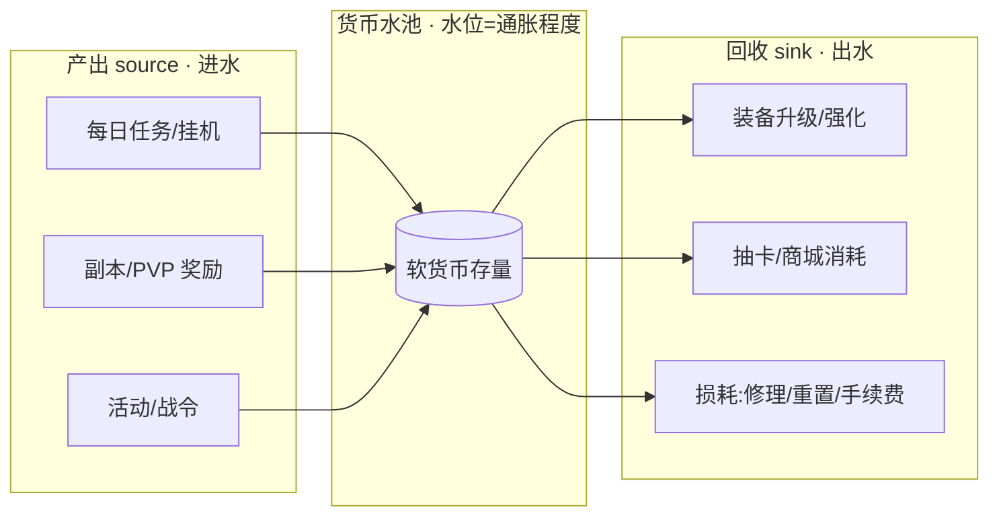
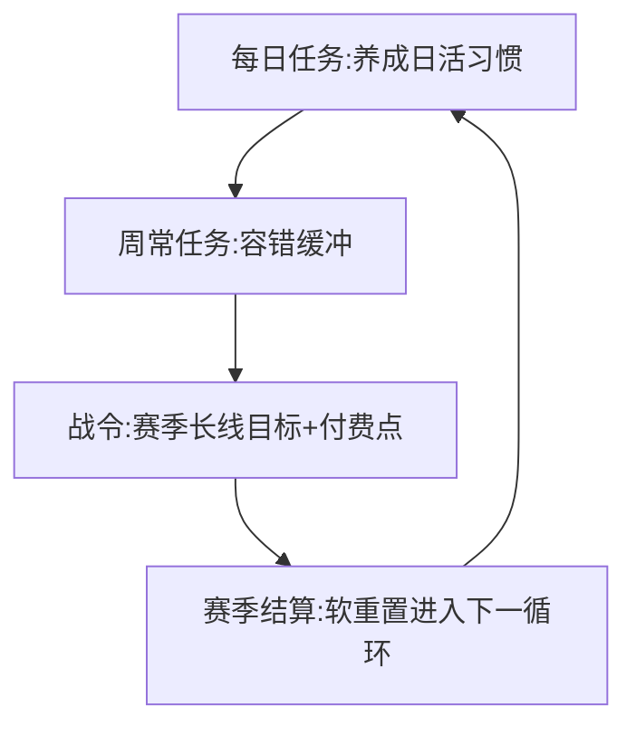
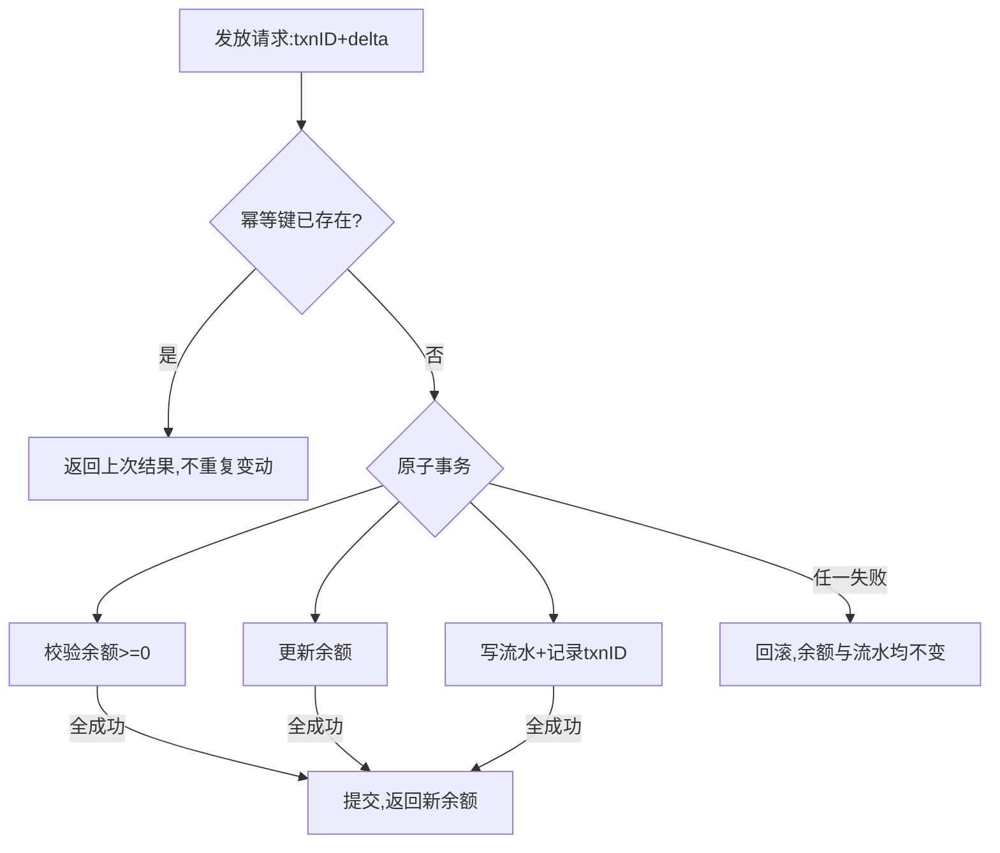

# 游戏经济与成长

> 用软/硬货币双轨、产出与回收的动态平衡、可控的成长曲线，把玩家从新手一路"托举"到付费，同时守住不通胀、不资损、f2p 也玩得下去的底线。

::: tip 🧠 一句话记忆锚点
**经济系统的本质是"水池模型"：产出(source)是进水、回收(sink)是出水，通胀就是进水快于出水；成长曲线决定玩家在池里待多久，货币账户的一致性与幂等发放决定这池水不会凭空多也不会凭空少。**
:::

## 场景问题

游戏经济与成长是运营型游戏的"骨架"，它同时承担三个互相拉扯的目标，任何一个失衡都会拖垮长期留存与营收：

- **要有成长感，又不能崩坏平衡**：玩家需要持续变强的正反馈，但战力膨胀太快会让老内容瞬间贬值、新老玩家断层。
- **要能赚钱，又不能吓跑白嫖玩家**：付费点必须存在，但一旦越过 p2w 边界，f2p 玩家感到"打不过、追不上"就会流失，而 f2p 恰恰是付费玩家的"内容"（对手、观众、社交对象）。
- **经济要长期稳定，又要不断投放新内容**：每个版本都在产出新货币、新道具（进水），如果没有等量的回收(sink)，软货币必然通胀——金币变废纸，定价体系崩塌。
- **账目一分不能错**：货币是玩家资产，发多了是资损公司、发少了是投诉资损玩家，且发放接口一定会被重试、被并发、被断线，必须幂等。

核心矛盾：**经济系统要同时"给得爽"（成长/付费体验）和"收得住"（防通胀/防资损）**。设计的精髓就是用双轨货币隔离风险、用 source/sink 平衡控制水位、用成长曲线与赛季重置调节节奏，最后靠服务端的强一致账户把这一切落到不出错的账上。

## 实现方案

### 一：双轨货币 —— 软货币 vs 硬货币

绝大多数运营游戏都采用"双轨制"，把可通胀的和不可通胀的严格分开：

| 维度 | 软货币(soft) | 硬货币(hard) |
| --- | --- | --- |
| 例子 | 金币、经验、体力 | 钻石、点券（充值获得） |
| 来源 | 玩法产出，大量、廉价 | 主要靠付费，少量、昂贵 |
| 是否可通胀 | 会（产出多、易堆积） | 严格不通胀，锚定真实货币 |
| 主要用途 | 日常养成、升级、消耗 | 抽卡、稀缺道具、加速 |
| 设计目标 | 用 sink 把水位压住 | 保值，绝不能有"白嫖大量产出"的口子 |

```text
铁律：硬货币的产出必须极度克制且可审计。
任何"免费大量发放硬货币"的活动，本质等于印钞——
会直接击穿付费定价体系（玩家不再花钱买钻石）。
```

::: warning 双轨的隔离价值
把"可通胀的日常货币"和"锚定真钱的稀缺货币"分开，是为了**让通胀被隔离在软货币里**：软货币就算贬值，也只影响日常养成手感，可以靠加 sink 慢慢回收；而硬货币一旦通胀，直接等于资损公司、破坏定价。两条轨绝不能有廉价兑换通道互通。
:::

### 二：产出(source)与回收(sink)的水池平衡

把经济想象成一个水池：所有产出货币的途径是**进水口(source)**，所有消耗货币的途径是**出水口(sink)**。



- **通胀成因**：进水 > 出水，货币越堆越多 → 玩家"什么都买得起" → 数值与稀缺性失效 → 定价崩塌、新内容失去吸引力。
- **常见 sink 设计**：升级/突破消耗、随等级递增的成本曲线、装备强化的失败损耗、交易税/手续费、限时兑换、"钱多了没处花"时投放的高价外观。
- **监控指标**：人均货币存量、产出/回收比、货币存量分布（是否头部玩家囤积）。这些应做成运营看板持续观测。

```text
健康经济的经验法则：
  中后期 sink 增速 ≥ source 增速，
  让玩家永远"差一点点"，保持消耗动机；
  存量曲线平稳或缓升，而非指数暴涨。
```

### 三：成长曲线与节奏（等级/经验、战令、日常任务）

成长曲线控制"玩家在池子里待多久、以什么节奏变强"：

```go
// 等级所需经验：常用二次/指数曲线，让后期变慢，拉长生命周期
func expToNext(level int) int64 {
    base := int64(100)
    // 二次增长：前期快速升级给爽感，后期放缓控节奏
    return base * int64(level) * int64(level)
}
```

- **等级/经验**：前期快（新手爽感、快速解锁系统），后期慢（拉长在线时长、控制内容消耗速度）。
- **战令(Battle Pass)**：一条按赛季推进的任务/经验轨道，免费轨给基础奖励、付费轨给增强奖励。它是**"低价高频"的付费点**，用"已经买了要回本"的心理绑定日常活跃。
- **日常/周常任务**：把大目标切成"每天来一下就有收获"的小节奏，是**留存的节拍器**；周常给缓冲，避免漏一天就掉队的焦虑。三者配合形成"日活—周活—赛季"的多层节奏。



### 四：赛季软重置 vs 硬重置

赛季末如何处理玩家进度，直接决定"老玩家优势"与"新玩家追赶"的平衡：

| 类型 | 做法 | 优点 | 代价 |
| --- | --- | --- | --- |
| **软重置** | 分数/段位向中位回落（如白金→黄金），养成资产保留 | 老玩家不清空、有安全感；每赛季重新有目标 | 老玩家长期累积优势，新人仍难追 |
| **硬重置** | 排名/部分数值清零，重新开始 | 公平、新老同起跑线、拉动回流 | 老玩家"心血白费"，处理不好会流失 |

工程上通常**"排位/竞技用软重置，养成资产（等级、装备）几乎从不硬重置"**。真要硬重置某类资源，必须提前公示、给足补偿或转化通道，否则等于剥夺玩家资产。

### 五：定价、锚定与限时

硬货币和虚拟物品的定价是一门心理学工程：

- **锚定(anchoring)**：先摆一个高价"至尊礼包"，让旁边的"超值月卡"显得便宜——高价档的作用往往不是卖，而是当参照物。
- **阶梯定价**：充值档位设计成"再加一点点就到下一档送更多"，推动客单价上移。
- **限时/稀缺**：限时上架 + 倒计时，用 FOMO（错过焦虑）压缩决策时间。这与 [活动框架](./activity-framework.md) 的限时机制天然耦合。
- **首充/月卡**：低门槛、高性价比的"付费习惯培养点"，把玩家从 f2p 转化成小额付费者，是转化漏斗的关键一环。

### 六：f2p 与 p2w 的边界

免费与付费玩家的平衡是运营游戏的生死线：

```text
可接受(pay-to-progress/pay-for-convenience):
  付费 = 更快、更方便、更好看（外观/加速/免体力）
  → f2p 肝一肝也能拿到，只是慢
不可接受(pay-to-win):
  付费 = 直接买到 f2p 无论如何都追不上的战力碾压
  → f2p 感到绝望 → 流失 → 付费玩家失去对手 → 一起崩
```

- **健康边界**：卖"节省时间"和"个性表达"，不卖"无法逾越的战力鸿沟"。
- **为什么留住 f2p 很重要**：f2p 玩家是付费玩家的对手、观众和社交对象——是付费体验的"内容"。清空 f2p，付费玩家也会走。

### 七：服务端实现要点 —— 账户一致性、流水审计、幂等发放

货币是玩家资产，服务端必须做到"每一笔都对得上、发一次只发一次"：

```go
// 一切货币变动走统一入口:原子扣减/增加 + 写流水 + 幂等键
func (a *Account) Apply(txnID string, delta int64, reason string) error {
    if a.seen(txnID) {           // 幂等:同一 txnID 只生效一次
        return nil               // 重试直接返回上次结果,不重复变动
    }
    return a.tx(func() error {   // 余额变更与流水在同一事务
        if a.Balance+delta < 0 {
            return ErrInsufficient    // 扣减前校验,禁止负余额
        }
        a.Balance += delta
        a.writeLedger(txnID, delta, reason, a.Balance) // 流水:留存变更后余额快照
        a.markSeen(txnID)
        return nil
    })
}
```

- **账户一致性**：所有货币变动走**唯一原子入口**，余额更新与流水写入在同一事务，杜绝"加了余额没记账"或"记了账没到余额"。禁止负余额（扣减前校验）。
- **流水审计(ledger)**：每一笔变动都留档（来源、金额、变更后余额快照、时间、txnID），做到**任意时刻可对账、可回溯、可排查资损**。余额本质应能由流水累加还原。
- **幂等发放**：发放/扣减接口一定会被重试、并发、断线重连，必须挂**幂等键**（同一 txnID 只生效一次）。这与抽卡发货、支付到账是同一套底层保证，详见 [幂等设计](./idempotency-design.md)。



## 为什么这么做

**为什么要软/硬货币双轨？**
因为通胀风险必须被隔离。日常玩法必然大量产出货币，这部分"注定会通胀"的压力全部承载在软货币上，可以用 sink 慢慢回收；而锚定真钱的硬货币严格控产、绝不白发，从而保住定价体系。混成一种货币，通胀会直接烧到付费营收。

**为什么盯着 source/sink 平衡？**
经济系统的稳定就是水池水位的稳定。只要产出持续大于回收，货币必然堆积、贬值，数值与稀缺性同步失效，最终新内容卖不动、老内容没意义。持续调节 sink 让水位平稳，是经济长期健康的唯一办法。

**为什么成长曲线要"前快后慢"？**
前期快给新手即时正反馈、快速解锁系统、留下来；后期慢拉长生命周期、控制内容消耗速度，避免玩家几天就通关"没得玩了"。配合战令和日常任务，把节奏切成日活/周活/赛季多层循环。

**为什么货币变动必须原子 + 幂等 + 流水？**
货币是玩家真金白银换来的资产，也是公司的营收账目。原子保证不出现"半成功"的坏账，幂等保证重试/并发不会多发漏发，流水保证任何争议都能对账追责。三者缺一，都会演变成资损或投诉事故。

## 为什么别的选择不行

| 方案 | 为什么不行 |
| --- | --- |
| **单一货币（不分软硬）** | 日常产出的通胀会直接烧到付费货币，击穿定价、掏空营收 |
| **只加产出不设 sink** | 货币无限堆积 → 通胀 → 数值/稀缺性失效 → 新内容卖不动、经济崩盘 |
| **免费大量发硬货币做活动** | 等于印钞，玩家不再充值买钻石，付费体系瞬间崩塌 |
| **成长曲线一路线性/过快** | 玩家几天通关"没得玩"，或后期毫无成长感，双向流失 |
| **赛季硬重置养成资产且无补偿** | 剥夺玩家心血 → 老玩家愤怒流失 |
| **越过 p2w 边界卖碾压战力** | f2p 绝望流失 → 付费玩家失去对手/观众 → 生态一起崩 |
| **货币发放不幂等/无流水** | 重试并发导致多发漏发（资损），出争议无法对账追责 |
| **余额与流水分两次写（非事务）** | 出现加了余额没记账或记了账没到余额的坏账，无法审计 |

::: warning 经济改动必须先在灰度/模拟里验证
调整产出/回收/定价前，先用**历史数据或经济模拟**评估对水位和付费漏斗的影响，小范围灰度观察人均存量、产出回收比、付费转化，再全量。经济参数一旦发出去很难收回——发多了收回会激怒玩家，发少了要补偿，都比上线前算准代价高得多。
:::

## 沉淀结论

::: tip 速记
- **双轨货币**：软货币可通胀、靠 sink 压水位；硬货币锚定真钱、严格控产不白发。
- **水池模型**：source 进水、sink 出水，通胀 = 进水 > 出水；健康经济让中后期 sink 增速 ≥ source。
- **成长曲线**：前快后慢；战令+日常/周常构成日活—周活—赛季的多层节奏。
- **赛季重置**：竞技分数软重置（保资产），养成资产几乎不硬重置；真要重置须公示+补偿。
- **定价**：锚定、阶梯、限时(FOMO)、首充月卡培养付费习惯；与活动框架耦合。
- **f2p/p2w 边界**：卖时间与个性，不卖无法逾越的战力；f2p 是付费玩家的"内容"。
- **服务端底线**：货币变动原子入口 + 同事务流水审计 + 幂等键，杜绝资损与坏账。
:::

### 面试高频题清单

1. 软货币和硬货币为什么要分开？分别怎么防通胀？
2. 用"水池模型"解释通胀成因，举几个典型的 sink 设计。
3. 成长曲线为什么"前快后慢"？战令和日常任务在节奏上各起什么作用？
4. 赛季软重置和硬重置怎么取舍？养成资产该不该硬重置？
5. p2w 和 pay-to-progress 的边界在哪？为什么必须留住 f2p 玩家？
6. 货币发放的服务端如何保证一致性？为什么要幂等和流水，两者各解决什么问题？

### 记忆口诀

- **双轨**：软货币可胀靠 sink 收 / 硬货币锚真钱不白发
- **水池**：进水 source / 出水 sink / 进大于出即通胀 / 中后期 sink 提速
- **成长**：前快留人 / 后慢续命 / 日常周常战令三层节拍
- **重置**：竞技软重置 / 养成不硬砍 / 要砍先公示给补偿
- **边界**：卖时间卖个性 / 不卖碾压 / f2p 是付费玩家的内容
- **账户**：原子入口 / 同事务流水 / 幂等键防重 / 禁负余额

## 内容来源

综合整理自运营型游戏的经济与养成系统设计经验；双轨货币、source/sink 平衡与通胀治理为业界通行模型；战令(Battle Pass)、赛季重置、锚定/限时定价参考主流长线运营手游实践；货币账户一致性、流水审计与幂等发放呼应本域 [幂等设计](./idempotency-design.md)，并与 [抽卡系统](./gacha.md) 的发货扣费、[活动框架](./activity-framework.md) 的限时投放交叉印证。

## 自测：合上资料能说清楚吗？

1. 为什么大多数游戏用软/硬货币双轨？如果只用一种货币会发生什么？

<details><summary>参考答案</summary>

日常玩法必然大量产出货币，这部分"注定通胀"的压力承载在**软货币**上，可用 sink 慢慢回收；**硬货币**锚定真钱、严格控产不白发，保住定价体系。分开是为了**把通胀隔离在软货币里**。若只用一种货币，日常产出的通胀会直接烧到付费货币，击穿定价、掏空营收。

</details>

2. 用"水池模型"解释通胀是怎么产生的，列举几种 sink。

<details><summary>参考答案</summary>

产出(source)是进水、回收(sink)是出水，货币存量是水位。**进水持续大于出水**，货币越堆越多 → 玩家什么都买得起 → 数值和稀缺性失效 → 定价崩塌，这就是通胀。常见 sink：升级/突破消耗、随等级递增的成本、强化失败损耗、交易税/手续费、限时兑换、高价外观。健康经济让中后期 sink 增速 ≥ source。

</details>

3. 成长曲线为什么设计成"前快后慢"？战令和日常/周常任务各解决什么？

<details><summary>参考答案</summary>

**前快**给新手即时正反馈、快速解锁系统、留住人；**后慢**拉长生命周期、控制内容消耗速度，避免几天通关。**战令**是赛季长线目标 + "低价高频"付费点，用回本心理绑定活跃；**日常任务**是留存节拍器（每天来一下有收获），**周常**给容错缓冲。三者构成日活—周活—赛季的多层节奏。

</details>

4. 赛季软重置和硬重置怎么选？养成资产该不该硬重置？

<details><summary>参考答案</summary>

**软重置**：分数/段位向中位回落、养成资产保留，老玩家有安全感、每赛季重新有目标，代价是老玩家长期优势。**硬重置**：清零重来，公平、拉回流，但老玩家"心血白费"易流失。通行做法是**竞技分数软重置，养成资产（等级/装备）几乎从不硬重置**；真要硬重置必须提前公示 + 足额补偿，否则等于剥夺玩家资产。

</details>

5. 货币发放的服务端要保证哪些点？幂等和流水分别解决什么问题？

<details><summary>参考答案</summary>

所有货币变动走**唯一原子入口**，余额更新与流水写入在**同一事务**，禁止负余额。**幂等键**（同一 txnID 只生效一次）解决重试/并发/断线重连导致的**多发漏发**；**流水审计**（记来源、金额、变更后余额快照、时间）解决**可对账、可回溯、可追责**——余额本质应能由流水累加还原。二者一个防重复变动、一个保证账目可查，缺一都会演变成资损或无法追责的争议。

</details>
