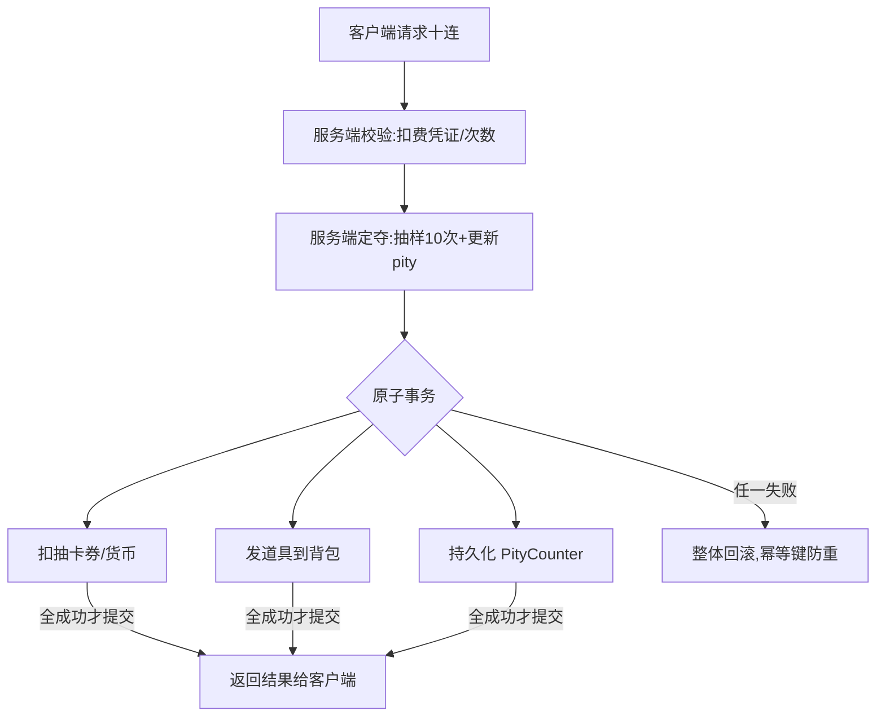

# 抽卡 / 掉落与保底

带权抽样 + 保底(pity) + 伪随机分布(PRD)——让概率既符合公示、又不让玩家被"真随机"的连续不出逼疯。

## 场景问题

抽卡是商业化核心，也是最容易出**资损、合规、口碑**三重事故的地方：

- **概率要准且可公示**：法规要求概率公示，实际掉率必须和公示一致，差一点点就是虚假宣传。
- **真随机反人性**：独立同分布的"真随机"下，5% 的东西连抽 80 次不出是完全正常的数学结果——但玩家会认定你"暗改概率"，直接炸。
- **保底要能兜底**：90 抽必出金是承诺，计数器的**累加、清零、跨版本迁移**任何一步错都是大事故。
- **多池叠加**：常驻池 + UP 池 + 新手池 + 软保底(概率递增) + 硬保底，规则叠起来极易算错。
- **发货幂等**：抽到的道具要原子发到背包，抽卡扣费和发货不能一半成功一半失败，重试不能重复发。
- **防刷**：客户端算概率 = 送人头，必须服务端定夺，且防并发多抽。

核心矛盾：**数学上的"公平随机"和玩家心理上的"感觉公平"是两回事**。抽卡系统的精髓就是用保底和 PRD 去弥合这条鸿沟，同时守住概率合规和资损底线。

## 实现方案

### 一：带权抽样（别名法 / 前缀和）

给每个奖励一个权重，按权重抽。两种主流实现：

```go
// 前缀和 + 二分：建表 O(n)，单次抽样 O(log n)，适合权重常变
func (t *PrefixTable) Draw(r uint64) int {
    x := r % t.total
    // 在前缀和数组里二分找第一个 > x 的位置
    return sort.Search(len(t.prefix), func(i int) bool { return t.prefix[i] > x })
}
```

- **别名法(Alias Method)**：预处理 O(n)，**单次抽样 O(1)**，适合权重固定、抽样海量的池。
- **前缀和 + 二分**：单次 O(log n)，建表简单、权重变动时重建便宜，工程上最常用。

::: warning 随机源必须服务端且不可预测
抽样用的随机数必须由**服务端**生成（`crypto/rand` 或经过充分播种的 PRNG），绝不能让客户端传随机种子或让客户端自己算——否则玩家能预测/构造出货序列。掉率配置也只在服务端，客户端只做表现。
:::

### 二：保底(pity)计数器

保底是"距离上次出金的抽数"计数器，通常存玩家档：

```go
type GachaState struct {
    PityCounter  int  // 距上次出 SSR 的抽数
    IsUpGuaranteed bool // 大保底：上次歪了，这次必 UP
}

func (g *GachaState) Draw(cfg *PoolCfg, rng *rand.Rand) *Item {
    g.PityCounter++
    hit := false
    switch {
    case g.PityCounter >= cfg.HardPity:      // 硬保底：90 抽必出
        hit = true
    case g.PityCounter > cfg.SoftPityStart:  // 软保底：75 抽后概率递增
        hit = rng.Float64() < softProb(cfg, g.PityCounter)
    default:
        hit = rng.Float64() < cfg.BaseProb   // 基础概率 0.6%
    }
    if !hit { return g.drawNonSSR(cfg, rng) }

    g.PityCounter = 0                        // 出金清零
    if g.IsUpGuaranteed || rng.Float64() < cfg.UpRate {
        g.IsUpGuaranteed = false             // 抽到 UP，大保底重置
        return cfg.UpItem
    }
    g.IsUpGuaranteed = true                  // 歪了，下次大保底
    return g.drawStdSSR(cfg, rng)
}
```

- **硬保底**：`PityCounter >= 90` 直接必出，兜底承诺。
- **软保底**：75 抽后概率线性/阶梯递增，让"综合出货率"贴近公示的 ~1.6%（基础 0.6% 靠软保底拉高）。
- **大保底**：出金但歪了（非 UP），标记 `IsUpGuaranteed`，下次出金必 UP。

::: warning 保底计数器是玩家资产，比金币还敏感
`PityCounter` 丢一次 = 玩家白抽几十次的愤怒。它必须**和抽卡结果在同一事务里持久化**：不能出现"发了道具但计数器没清零"（玩家投诉重复保底）或"计数器加了但抽卡回滚"（白扣抽数）。跨版本/跨池迁移计数器时要写明规则并公示。
:::

### 三：伪随机分布(PRD) —— 另一种"不那么随机"

除了保底，还有一种让概率"感觉更均匀"的经典做法（源自 DOTA/War3 暴击设计）：**每次不中，下次概率线性递增 C；一旦中了，概率重置为 C**。

```text
第 n 次未中后的实际概率 P(n) = C * n
调参使"期望出货间隔"= 公示概率对应的间隔
效果：几乎不会出现"连续很多次不出"或"连续爆出"的极端串
```

PRD 适合**暴击、小额掉落**这类"要感觉稳定"的场景；保底 pity 适合**大额抽卡**这类"承诺上限"的场景。两者可叠加。

### 四：抽卡事务（扣费 + 发货 + 计数器）



扣费、发货、计数器更新必须**要么全成功要么全回滚**，并挂幂等键（十连一个 `draw_id`）防止客户端重试导致重复发。货币扣减走统一的原子兑换接口（参考 [业务代理 · 支付 · 商城](/game-biz/business-proxy.md) 里的 `Deposit::ExchangeProps`：消费放 `del_prop_list`、奖励放 `add_prop_list`，一次原子完成）。

## 为什么这么做

**为什么要保底/PRD，不用纯随机？**
纯随机（独立同分布）下的"连续不出"在数学上完全正常，但玩家不接受概率论——他们只体验到"我氪了 500 块一个都没出"。保底把最坏体验**封了顶**（90 抽必出），PRD 把方差**压小**（几乎不会连续爆或连续空）。这不是改概率骗人，而是在**综合出货率仍等于公示值**的前提下，重新分配概率的方差，让体验可控。

**为什么随机和掉率必须在服务端？**
只要客户端能参与随机数生成或知道掉率表，玩家就能预测甚至构造出货，商业化直接崩盘。服务端定夺是**反作弊的底线**，客户端只负责抽卡动画等表现层。

**为什么保底计数器要和结果同事务？**
保底是玩家用真金白银积累的"资产"。计数器和抽卡结果不同步，就会出现白扣或重复保底，两者都是直接的资损/投诉。原子性是它作为"资产"的必然要求。

## 为什么别的选择不行

| 方案 | 为什么不行 |
| --- | --- |
| **纯真随机、无保底** | 长尾玩家连续不出 → 认定暗改概率 → 口碑崩 + 投诉 + 可能被指虚假宣传 |
| **客户端算概率/传随机种子** | 玩家可预测或构造出货，商业化归零 |
| **保底计数器异步/延迟落库** | 崩溃丢计数器 = 玩家白抽，或重复保底，直接资损投诉 |
| **扣费与发货分两个事务** | 扣了没发（资损玩家）或发了没扣（资损公司），且重试重复发 |
| **软保底不校准综合概率** | 公示 1.6% 实际算出来 3%（多送）或 0.8%（虚假宣传），两头都是事故 |
| **实际掉率与公示不符** | 合规红线，可能面临下架/罚款 |

::: warning 概率公示合规
公示的必须是**玩家实际能体验到的综合概率**（含保底、软保底后的等效出货率），不是那个 0.6% 的基础概率。上线前用蒙特卡洛模拟跑几百万次抽卡，验证"模拟出货率 ≈ 公示值"，并把模拟脚本和结论留档备查。
:::

## 沉淀结论

- **带权抽样**：别名法 O(1) 抽样（权重固定）或前缀和二分 O(log n)（权重常变，工程首选）。
- **保底 pity**：硬保底封顶承诺、软保底校准综合概率、大保底管 UP；计数器是玩家资产，**必须与抽卡结果同事务持久化**。
- **PRD**：另一种降方差手段，适合暴击/小额掉落这类"要感觉稳定"的场景，可与保底叠加。
- **随机源与掉率表只在服务端**，客户端只做表现——反作弊底线。
- **抽卡事务**：扣费 + 发货 + 计数器更新原子完成，挂幂等键防重试重复发。
- **概率合规**：公示综合出货率（含保底），上线前蒙特卡洛验证并留档。

::: tip 与其他专题的关系
- 发货与扣费的原子性、防重试重复发 → [业务幂等性设计](/game-biz/idempotency-design.md)、[业务代理 · 支付 · 商城](/game-biz/business-proxy.md)。
- 抽样底层的均匀随机与无放回抽样思想，可对照 [game-infra 蓄水池抽样](/game-infra/reservoir-sampling.md)。
:::

## 内容来源

综合整理自卡池 / 掉落 / 商业化抽奖系统的实现经验；PRD 伪随机分布借鉴 Warcraft III / DOTA 暴击设计；发货幂等与原子兑换呼应本域 [业务幂等性设计](/game-biz/idempotency-design.md) 与 [业务代理 · 支付 · 商城](/game-biz/business-proxy.md)。
