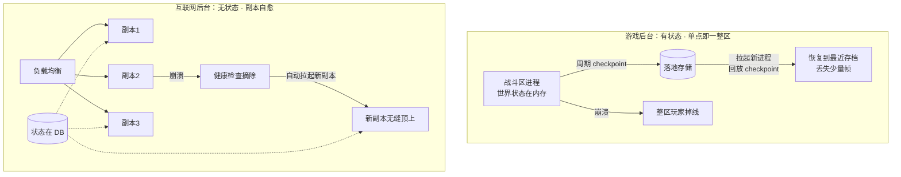

# 游戏与互联网后台的本质差异

强状态 vs 无状态、Tick 驱动 vs 请求驱动——为什么两套技术栈难以直接复用。

::: tip 一句话结论
游戏被"共享世界+帧级实时"逼成有状态单线程，互联网被"海量请求+弹性"塑成无状态水平扩。
:::

## 场景问题

从互联网后台转到游戏后台（或反过来），最容易犯的错是**把另一套的银弹直接搬过来**：

- 用互联网的思路做游戏——"加机器不就行了？"，结果发现一个战斗区是**单进程有状态**，加不了机器；
- 用游戏的思路做互联网——为无状态的下单接口设计一套复杂的 checkpoint 恢复，纯属过度设计。

这两套后台服务的用户体感相似（都是"客户端连服务器"），但**底层的状态模型、并发模型、计算特征、容错方式**是两条不同的物种演化路线。看不清这层差异，架构选型就会南辕北辙。

## 实现方案

### 多维对比表

| 维度 | 游戏后台 | 互联网后台 |
| --- | --- | --- |
| **状态模型** | 强状态：长连接，进程内维护"世界状态"（玩家位置、战斗、场景实体），状态即内存 | 多为无状态：短请求，状态外置到 DB/缓存，进程本身不留状态 |
| **连接模型** | 长连接（TCP/UDP/KCP），会话贯穿整局，服务端主动推送 | 短连接 / 无状态请求（HTTP），一问一答，可随时断开 |
| **并发模型** | 单线程无锁，按 **Tick** 逻辑帧驱动；单区单进程串行处理，避免锁与竞态 | 多线程 / 多协程，无共享或少共享，横向铺开、并行处理请求 |
| **计算特征** | 计算密集 + 强实时：每帧要算 AABB 碰撞、AOI、技能结算，帧预算固定（如 66ms/15fps） | I/O 密集：大部分时间在等 DB / RPC / 网络，CPU 常常空闲 |
| **扩缩容** | 有状态迁移难，按**区 / 世界 / 房间**切分容量，扩容=开新区，缩容要迁移或等清场 | 无状态可自动弹性，按流量增删副本，负载均衡随意打散 |
| **一致性与容错** | 内存态易失，靠周期 **checkpoint / 落地**恢复；单点故障影响**一整区**玩家 | 无状态副本自愈，挂一个 LB 摘掉即可；状态在 DB，进程可随意重启 |
| **限流与发布** | 按**区 / UID 灰度**，DS（Dedicated Server）滚动要 `preStop` 等待清场，不能硬杀 | 按**流量权重**灰度（1% → 10% → 全量），副本滚动更新、随时可重启 |
| **数据一致性** | 局内以内存为准、局末结算落库；强调"这一局的世界视图统一" | 以 DB 为准，读写围绕存储，强调请求间的数据一致 |
| **典型延迟要求** | 毫秒级、帧级实时，抖动敏感（卡顿即穿模/回滚） | 百毫秒级可接受，重吞吐与可用性 |

### 状态模型：世界状态 vs 无状态

游戏进程内跑着一个**世界**——所有玩家、NPC、投射物的位置和状态都活在内存里，每帧演进：

```go
// 游戏：世界状态活在进程内存里，Tick 驱动演进
type World struct {
    players map[uint64]*Player  // 全区玩家状态，纯内存
    npcs    map[uint64]*NPC
    frame   int64               // 当前逻辑帧
}

// 每个 Tick（如 66ms）推进整个世界一步，单线程串行，无需加锁
func (w *World) Tick(dt time.Duration) {
    w.frame++
    w.handleInputs()   // 消费本帧输入
    w.stepPhysics(dt)  // 碰撞、移动
    w.resolveCombat()  // 技能/伤害结算
    w.syncAOI()        // 按视野推送状态给客户端
}
```

互联网服务则相反——进程不留状态，每个请求自带上下文，状态外置：

```go
// 互联网：无状态处理，状态在 DB/缓存，进程可随意水平扩
func CreateOrderHandler(w http.ResponseWriter, r *http.Request) {
    req := parse(r)
    order := buildOrder(req)
    db.Save(order)      // 状态落 DB，进程本身不留任何东西
    w.Write(ok(order))  // 处理完即忘，下一个请求可落到任意副本
}
```

> **打个比方**：游戏后台像**KTV 包厢**——你一进门就得**一直坐在里面**，灯光、点歌单、麦克风音量都要**为你这几个人持续在线维护**，中途换个包厢代价极高（要搬歌单、搬饮料、搬所有人）；互联网后台像**便利店结账**——你走到收银台**扫码付钱就走**，下一位顾客换哪个收银员都行，收银机本身不记住"你上一次买了什么"，全靠会员卡（外置数据库）查历史。**类比失效边界**：这只是"**连接生命期与状态归属**"维度的对比，不代表两边工程栈全不同——冷启动、镜像构建、CDN 分发、监控告警、CI/CD 这些**基础设施层**两边其实高度相通，甚至可以直接复用同一套 K8s、Prometheus、日志采集，别因为"游戏很特殊"就把成熟组件全推翻重造。

### 并发模型：单线程 Tick vs 多协程无共享

- **游戏**：单区单进程、单线程按 Tick 串行推进。因为世界状态高度耦合（一次技能结算要读写几十个实体），加锁会锁到崩溃，索性**不共享、不加锁**，用单线程消除竞态。多核靠**多开进程/多开区**利用。
- **互联网**：请求之间天然独立，多协程各处理各的，共享状态推给 DB/缓存去做并发控制。加机器就能线性提吞吐。

### 容错：checkpoint 恢复 vs 副本自愈



游戏进程崩溃，内存里的世界状态就没了，只能回放最近的 checkpoint（丢失两次存档之间的帧），且**一个进程挂 = 一整区玩家受影响**；互联网副本挂了，健康检查摘除、拉起新副本，状态在 DB 里毫发无损，用户几乎无感。

### 发布：preStop 等清场 vs 权重灰度

```yaml
# 游戏 DS 不能硬杀——要等本局结束/玩家撤离，否则整局数据丢失
lifecycle:
  preStop:
    exec:
      command: ["/bin/drain.sh"]  # 停止接新局 → 等待在局玩家自然结束 → 再退出
terminationGracePeriodSeconds: 1800   # 给足清场时间（可能长达 30 分钟）
```

互联网副本则可随时替换：滚动更新按权重把流量从旧副本切到新副本，旧副本处理完在途请求即退出，无需"等清场"。

## 为什么这么做

**为什么游戏要强状态 + 单线程 Tick？**
游戏的核心是**一个所有人共享、每帧演进的世界**。世界状态之间高度耦合、读写频繁且有实时性要求（帧预算固定），把状态外置到 DB 会让每帧几十次 DB 往返直接爆延迟；多线程加锁则会因锁竞争把帧率打崩。所以状态留内存、单线程串行推进 Tick，是被实时性和状态耦合度**逼出来**的最优解。

**为什么互联网要无状态 + 水平扩？**
互联网服务面对的是海量、独立、无实时耦合的短请求，瓶颈在 I/O 和吞吐而非单请求的帧级实时。把状态外置、进程做成无状态，就能用"加副本"这个最简单的手段线性扩容、故障自愈、随意发布。这是被**规模和弹性需求**塑造的形态。

## 为什么别的选择不行

**为什么两套技术栈难以直接复用？** 因为它们的第一性约束相反：

- 把互联网的"无状态水平扩"套到游戏战斗区——世界状态没法拆到 DB，也没法把一局的实时演进打散到多副本，加机器加不动单区容量；
- 把游戏的"单进程有状态 + checkpoint"套到互联网下单——无谓地引入单点、放弃了副本自愈和弹性伸缩，纯属自缚手脚；
- 把游戏的"单线程 Tick"套到 I/O 密集服务——CPU 大量空转等 I/O，单线程反而成了吞吐瓶颈；
- 把互联网的"多线程共享 + 加锁"套到游戏世界演进——锁竞争把帧率打崩，实时性完全崩坏。

所以不是谁比谁先进，而是**不同的约束逼出不同的最优形态**。硬搬只会把对方的优势变成自己的负债。

## 沉淀结论

- 游戏后台是**强状态 · 长连接 · 单线程 Tick · 计算密集 · 按区切分 · checkpoint 恢复**；互联网后台是**无状态 · 短请求 · 多协程 · I/O 密集 · 水平弹性 · 副本自愈**。
- 差异的根源是**第一性约束不同**：游戏被"共享世界 + 帧级实时"逼成有状态单线程；互联网被"海量独立请求 + 规模弹性"塑成无状态水平扩。
- 架构选型的指导意义：**先判断你的服务是"有世界状态的实时循环"还是"无状态的请求处理"**，再选状态模型、并发模型、扩缩容与发布策略，不要跨界硬搬银弹。
- 两者并非全无交集——游戏的**大厅 / 商城 / 支付 / 活动**这类外围业务，本质就是互联网式无状态服务，可以且应该用互联网那套（无状态、水平扩、DB 为准）；真正特殊的是**对局/战斗**这条实时有状态的核心链路。

::: tip 混合架构才是常态
现代游戏后台并非纯游戏形态：**对局服（DS）** 用游戏范式（有状态 Tick），而 **登录 / 大厅 / 商城 / 支付 / 活动 / 好友** 大多是互联网范式（无状态、可水平扩）。分清哪条链路属于哪种范式，才能各用其长——这也是本域《业务代理 · 支付 · 商城》里那些代理/编排服务能按互联网思路水平扩的原因。
:::

::: warning 常见误区
"游戏后台就是高性能 C++ 单线程" 是片面认知——那只描述了**对局核心**。游戏后台里大量的商业化、社交、运营系统其实是标准的互联网后台，用 Go/多协程/无状态/水平扩，和电商后台没有本质区别。
:::

### 记忆口诀

- **游戏后台**：强状态 / 长连接 / 单线程 Tick / 计算密集 / 按区切分 / checkpoint 恢复
- **互联网后台**：无状态 / 短请求 / 多协程 / I/O 密集 / 水平弹性 / 副本自愈
- **差异根源**：第一性约束相反 / 共享世界+帧级实时 逼出有状态单线程 / 海量独立请求+规模弹性 塑成无状态水平扩
- **选型第一问**：是「有世界状态的实时循环」还是「无状态的请求处理」/ 先判范式 / 再选状态·并发·扩缩·发布 / 别跨界搬银弹

## 内容来源

综合整理自游戏后台与互联网后台架构范式的对比实践；混合架构与外围业务水平扩部分呼应本站 intro 与本域《业务代理 · 支付 · 商城》实战笔记中商业化服务的无状态水平扩经验。

## 自测：合上资料能说清楚吗？

1. 为什么游戏战斗区不能靠"加机器"扩容，而互联网下单服务可以？

<details><summary>参考答案</summary>

战斗区是**单进程有状态**，一局的世界状态在**内存**里且高度耦合，无法拆到多副本；扩容只能**开新区**。下单是**无状态**，状态在 DB，加副本即可线性扩、随流量弹性。

</details>

2. 游戏为什么用单线程 Tick，而不用多线程加锁？

<details><summary>参考答案</summary>

世界状态高度耦合（一次结算读写几十个实体），加锁会因**锁竞争把帧率打崩**；索性**不共享、不加锁**，单线程串行推进 Tick 消除竞态，多核靠**多开进程/多开区**利用。

</details>

3. 对比游戏与互联网后台的容错方式，各自单点故障的影响范围有何不同？

<details><summary>参考答案</summary>

游戏靠周期 **checkpoint** 恢复，进程崩溃丢失两次存档间的帧，且**一进程挂=一整区玩家**受影响。互联网**无状态副本自愈**，健康检查摘除后拉起新副本，状态在 DB **毫发无损**，用户几乎无感。

</details>

4. 为什么游戏 DS 发布不能"硬杀"，互联网副本却可随时替换？

<details><summary>参考答案</summary>

DS 内存里有**在局世界状态**，硬杀会丢整局数据，须 `preStop` **等清场**（停接新局→等玩家自然结束），可长达 30 分钟。互联网副本无状态，滚动更新按**权重灰度**切流量，在途请求处理完即退。

</details>

5. 一款现代游戏的"大厅/商城/支付"应该按哪套范式做？为什么？

<details><summary>参考答案</summary>

按**互联网范式**（无状态、水平扩、DB 为准）。它们本质是标准请求处理，无帧级实时的共享世界状态；只有**对局/战斗**核心链路才需要有状态单线程 Tick。这正是**混合架构**的常态。

</details>
