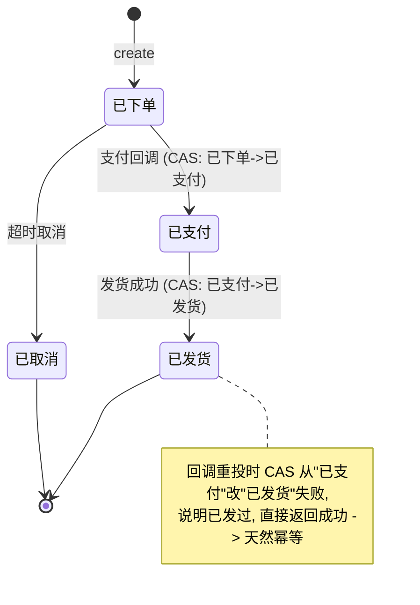
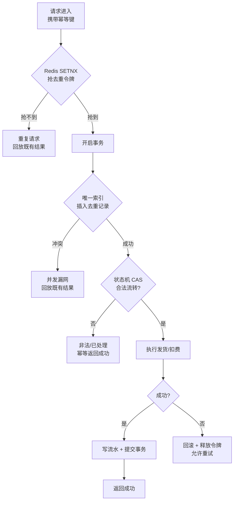

# 业务幂等性设计

幂等键 + 去重 / CAS / 状态机——让"发奖、扣费、支付回调"重复来多少次，效果都只算一次。

## 场景问题

只要链路里有钱、有道具，"同一个请求被处理两次"就是资损。而重复请求在分布式系统里不是异常，是**常态**：

- **网络重试**：客户端超时了，但服务端其实已经处理，客户端重发；
- **消息重投**：MQ 保证的是"至少一次"（at-least-once），消费者收到重复消息很正常；
- **用户重复点击**：领奖按钮连点三下，或断网后刷新页面重提；
- **超时补偿**：支付回调 5 分钟没收到 ack，支付平台按退避策略重推 15 次。

::: warning 一个真实的资损画面
支付回调进来发道具，代码是"先查订单没发过 → 发货 → 标记已发"。回调重投两次几乎同时到达，两个协程都查到"没发过"，于是**各发一份**。玩家白嫖一份限定皮肤，对账时才发现少收了钱。根因：**先查后写之间有并发窗口**，查和写不是原子的。
:::

所以每一个"改变余额 / 库存 / 道具"的写操作，都必须问一句：**它被调两次，结果一样吗？** 若不一样，就要给它加幂等。

## 实现方案

### 第一步：设计幂等键

幂等的前提是能识别"这是同一个请求"。幂等键要满足**同一业务操作稳定唯一、不同操作必然不同**：

| 场景 | 幂等键 | 来源 |
| --- | --- | --- |
| 支付回调发货 | 订单号 `order_id` | 下单时生成，回调透传 |
| 活动领奖 | `(actID, uid, tier)` 业务唯一键 | 业务维度天然唯一 |
| 通用写接口 | 请求 ID `request_id` | 客户端生成 UUID，重试时保持不变 |
| 扣费 | 交易流水号 `txn_id` | 下单时下发，全链路透传 |

::: warning 幂等键必须由发起方生成并在重试中保持不变
如果幂等键是服务端每次收到请求才现生成的，那重试就成了"新请求"，幂等失效。客户端重试必须带上**同一个** `request_id`。
:::

### 方案一：唯一索引防重（最硬的底线）

给去重表的幂等键加数据库**唯一索引**，插入冲突即代表重复。这是并发窗口的最终兜底——因为唯一约束由数据库在存储层原子保证：

```sql
CREATE TABLE grant_dedup (
    idem_key    VARCHAR(128) NOT NULL,
    uid         BIGINT       NOT NULL,
    result      JSON,
    created_at  BIGINT       NOT NULL,
    UNIQUE KEY uk_idem (idem_key)   -- 幂等键唯一约束，重复插入直接报错
);
```

```go
func GrantOnce(db *sql.DB, idemKey string, uid uint64, pack *Pack) (*Result, error) {
    tx, _ := db.Begin()
    defer tx.Rollback()

    // 唯一索引：并发下只有一个事务插入成功，其余拿到 Duplicate 错误
    _, err := tx.Exec(
        "INSERT INTO grant_dedup(idem_key, uid, created_at) VALUES(?,?,?)",
        idemKey, uid, time.Now().Unix())
    if isDuplicateKey(err) {
        // 已处理过：回放既有结果，不重复发货
        return loadResult(db, idemKey)
    }
    if err != nil {
        return nil, err
    }

    res, err := sendGoods(tx, uid, pack) // 与去重记录同一事务，一起提交
    if err != nil {
        return nil, err // 回滚：去重记录也一并撤销，允许重试
    }
    _, _ = tx.Exec("UPDATE grant_dedup SET result=? WHERE idem_key=?", res.JSON(), idemKey)
    return res, tx.Commit()
}
```

### 方案二：Redis SETNX 去重令牌（快速拦截）

在打到 DB 前，用 Redis `SET key val NX EX` 抢一个去重令牌，抢不到就是重复请求，直接短路。这是高并发下的**第一道快门**，减轻 DB 压力：

```go
// SET idem:{key} 1 NX EX 600 —— 只有第一个请求能设置成功
ok, err := rdb.SetNX(ctx, "idem:"+idemKey, "1", 10*time.Minute).Result()
if err != nil {
    return handleWithDB(idemKey) // Redis 故障降级到 DB 唯一索引兜底
}
if !ok {
    return ErrDuplicate // 已有令牌，重复请求，直接拦
}
```

::: warning SETNX 不能单独用
Redis 令牌可能因超时、宕机、TTL 到期而"漏放"，它只是**性能优化的快门**，不是正确性保证。正确性最终要靠 DB 唯一索引兜底。**两者叠加**：Redis 挡住大部分重复，唯一索引兜住漏网的并发。
:::

### 方案三：状态机 + CAS 只允许合法流转

对"订单"这类有生命周期的实体，用状态机约束，配合 **CAS（compare-and-swap）** 保证状态流转的原子性——只有满足"当前是旧状态"才能改成新状态：



```sql
-- CAS：带上预期旧状态做条件更新，affected_rows=0 即流转失败（已被改过）
UPDATE orders SET status='shipped', ship_at=?
 WHERE order_id=? AND status='paid';
```

```go
aff, _ := res.RowsAffected()
if aff == 0 {
    // 状态不是 'paid'：要么已发货（重复回调），要么已取消（非法流转）
    cur := queryStatus(orderID)
    if cur == "shipped" {
        return OK // 重复回调，幂等返回成功，避免上游无限重试
    }
    return ErrIllegalTransition // 已取消等非法流转，拒绝
}
```

CAS 把"查 + 改"压成一条原子语句，彻底消除了先查后写的并发窗口。

### 令牌桶式幂等：先申请 token 再提交

对表单/下单类操作，可以让客户端先向服务端**申请一个一次性 token**，提交时带上，服务端校验并消费 token（消费也是 CAS/SETNX）。token 只能消费一次，重复提交因 token 已消费而被拒。这把"防重"前置到提交之前，比事后去重体验更好。

### 发奖 / 扣费 / 支付回调的统一范式

三者本质相同，都是"带幂等键的写"。把上面几招组合成一条防线：



## 为什么这么做

**为什么至少一次 + 幂等 = 恰好一次？**
分布式系统里，"精确一次投递"（exactly-once delivery）在网络层几乎做不到——你无法区分"对方没收到"和"对方收到了但 ack 丢了"。工程上的解法是退而求其次：投递层做**至少一次**（重试直到成功），处理层做**幂等**（重复处理无副作用）。两者叠加，最终**效果**上等价于恰好一次（effectively-once）。幂等是把"投递的不确定性"在业务侧收口的关键。

**为什么要多层叠加，不能只用一招？**
- 只用 Redis SETNX：Redis 故障 / TTL 过期会漏，不保证正确性；
- 只用唯一索引：每个重复请求都打到 DB，高并发下压力大；
- 只用状态机 CAS：需要实体本身有状态，纯"新增型"操作（如发一次性奖励）没有可流转的旧状态。

所以：**SETNX 做性能快门，唯一索引做正确性底线，状态机 CAS 做流转约束**，各司其职、互相兜底。

## 为什么别的选择不行

**只靠前端防重（按钮置灰 / 防抖）不行。** 前端能挡住"用户手抖连点"，但挡不住网络重试、消息重投、超时补偿这些**服务端侧**的重复来源。前端防重是体验优化，绝不是正确性保证——攻击者甚至可以绕过前端直接打接口。

**"先查后写"不加原子保证不行。** `if 没处理过 { 处理 }` 在并发下，两个请求可能同时通过判断，各处理一次。查和写之间的窗口是资损的温床。必须靠唯一索引/CAS/分布式锁把这个窗口消除。

**给整个接口加分布式锁"图省事"代价太大。** 锁能保证串行，但把并发能力压没了，锁本身还要处理超时、误删、续期。有唯一索引 / CAS 这种存储层原子能力时，优先用它们——它们既保证正确性又不牺牲并发。锁只在没有天然唯一键、又必须串行的复杂场景才用。

## 沉淀结论

- 每个改变余额/库存/道具的写，都要先自问"调两次结果一样吗"，不一样就加幂等。
- **幂等键由发起方生成、重试中保持不变**，这是一切的前提。
- 组合防线：**Redis SETNX 快门 + DB 唯一索引底线 + 状态机 CAS 流转**，三者互补。
- **重复请求要幂等返回成功**（回放既有结果），别返回失败——否则上游会无限重试放大压力。
- **至少一次投递 + 处理幂等 = 效果恰好一次**，这是分布式一致性的工程正解。
- 前端防重只是体验层，正确性必须落在服务端存储层的原子约束上。

::: tip 与商城支付实战的呼应
本域《业务代理 · 支付 · 商城》里 paypxy 的"幂等四道闸"（未找到订单 / 已终止 / **重复发货返回成功** / 正常）正是这套范式的落地：**重复发货返回成功**对应本文"重复请求幂等返回成功、避免上游无限重试"；mallsvrd 发货前查 `received_list`、订单优先读 cache miss 再回查 DB，对应"去重表 + 先查快路径"。
:::

## 内容来源

综合整理自分布式幂等性设计的通用实践与游戏支付/发奖链路的落地经验；具体案例呼应本域《业务代理 · 支付 · 商城》中 paypxy 幂等四道闸与 mallsvrd 重复发货处理的实战总结。
