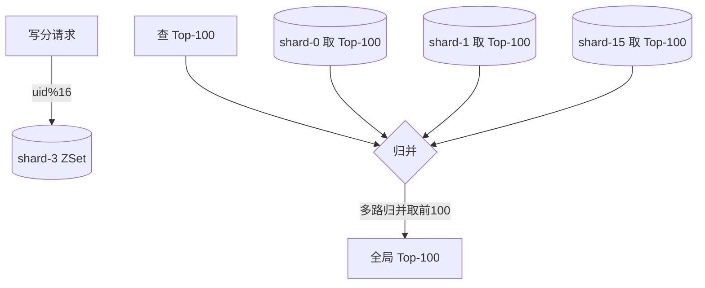

# 排行榜 / 榜单

Redis ZSet + 分数编码 + 分片——让"实时排名、我的名次、同分先到先排、亿级用户"同时成立。

::: tip 一句话结论
排行榜=Redis ZSet 底座，score 编码解同分，分片扛亿级，DB 只做归档发奖。
:::

## 场景问题

排行榜看着简单（"不就 `ORDER BY score DESC LIMIT 100` 吗"），但一到量级和玩法上就全是坑：

- **实时性**：战力/积分每局都变，玩家打完一局立刻想看到自己爬没爬。用 DB `ORDER BY` 拉全表排序，几十万人榜就把库拖垮。
- **我的名次**：Top 100 好办，但玩家更关心"我第几名、我前后是谁"。排在 50 万名，不可能把前 50 万都排出来数。
- **同分排序**：两个人都是 3000 分，谁在前？纯按分数排，名次会**随机跳动**——玩家分没变名次却变了，直接投诉。
- **周期与赛季**：日榜零点清零、赛季榜结束发奖，榜要能**原子切换**且旧榜要留档发奖。
- **量级**：全服战力榜可能上千万甚至亿级 key，单个 ZSet 扛不住内存和写热点。

核心矛盾：**排名是个全局有序问题，而全局有序的实时维护很贵**。排行榜的所有设计都是在"实时性 / 精确性 / 成本"之间找平衡。

## 实现方案

### 底座：Redis ZSet

ZSet（跳表 + 哈希）天生就是排行榜结构：`ZADD` 写分 O(log N)，`ZREVRANK` 查名次 O(log N)，`ZREVRANGE` 拉区间 O(log N + M)。

```bash
ZADD rank:pvp:daily 3000 uid_1001        # 写/更新分数
ZREVRANK rank:pvp:daily uid_1001         # 我第几名（0-based）
ZREVRANGE rank:pvp:daily 0 99 WITHSCORES # Top 100
ZREVRANGE rank:pvp:daily 49 51 WITHSCORES # 我(50名)的上下邻居
```

### 关键一：同分排序编码（score 里塞时间戳）

ZSet 同分时按 member 字典序排，这不是业务想要的。业务规则通常是**同分先达成者排前**。做法是把"分数"和"时间因子"编码进一个 float64 的 score：

```text
最终score = 主分 * 10^k  -  (时间戳的低若干位)
                                └── 越早达成，减得越少，排越前
```

```go
// 主分 22 位以内(<4.19e6)，时间戳取秒级偏移量塞进低位
// float64 有 52 位尾数，精度足够
func encodeScore(mainScore uint32, achieveTs int64) float64 {
    const base = 1e11 // 时间因子的量级
    // 越早达成 achieveTs 越小，(now-ts) 越大 → 用 (maxTs - ts) 让"早"得高位
    tieBreak := float64(TS_2100 - achieveTs) // 达成越早，该值越大
    return float64(mainScore)*base + tieBreak
}
```

::: warning float64 精度红线
score 是双精度浮点，尾数 52 位 ≈ 15~16 位十进制有效数字。主分和时间因子**加起来不能超过这个位数**，否则低位时间戳被抹掉、同分排序又失效。主分范围大时（如累计充值），改用 `member` 编码或降低时间精度（秒→分钟）。
:::

### 关键二：我的名次 + 邻居榜

```go
func (r *Rank) MyRank(ctx context.Context, key, uid string) (rank int64, neighbors []Entry) {
    // ZREVRANK 直接拿全局名次，O(log N)，不需要拉全表
    rk, _ := r.redis.ZRevRank(ctx, key, uid).Result()
    rank = rk + 1 // 转 1-based
    // 上下各取 2 名做"邻居榜"
    lo := max(rk-2, 0)
    neighbors = r.rangeWithScore(ctx, key, lo, rk+2)
    return
}
```

亿级名次也是一次 `ZREVRANK`，这是 ZSet 相对 DB 排序的**核心价值**。

### 关键三：周期榜 / 赛季榜的原子切换

榜的 key 带**周期标识**，切换即换 key，靠过期或异步归档清理旧榜：

```go
func dailyKey(base string) string   { return base + ":" + today() }   // rank:pvp:20260713
func seasonKey(base string, s int) string { return fmt.Sprintf("%s:s%d", base, s) }
```

- **日榜**：`EXPIRE` 设到次日刷新点自动清，或零点定时归档 Top-N 落库后 `DEL`。
- **赛季榜**：赛季结束时，先把 Top-N 快照落 DB（发奖依据），再切到新赛季 key。**切换与发奖必须先落库再清榜**，顺序反了就发不出奖。

> **打个比方**：排行榜像**便利店每天打烊结账的收银机**——白天营业时，**当天的销售明细挂在收银机里**（Redis ZSet 常驻热数据），店员随时能查"**目前谁买得最多**"、"**这位顾客排第几**"（`ZREVRANK` 一次 O(log N) 拿到名次）；晚上打烊后，店长把**日报表打印出来存进后台账本**（Top-N 归档进 MySQL 做发奖依据），再把收银机**清零迎接明天**。**类比失效边界**：便利店只有一台收银机，看一眼就是全店排名；亿级用户榜必须**分片跨多机**（`uid % N` 分桶），**任何一台机器都只掌握自己那部分销售**——想要全局 TopN 就得**每桶各取本地前 N 名再做堆归并**，再也不能"看一台就知道谁第一"；而"我的全局名次"在分片架构下**没法 O(log N) 精确得到**，只能用桶内名次估算或改成"Top-N 精确、长尾近似"，别想当然套单机 ZSet 的心智。

### 关键四：亿级分片（分桶榜 + 归并 Top-N）

单 ZSet 扛不住时，按 `uid % N` 分成 N 个桶（分散写热点和内存）。**每个桶内精确排名**，全局 Top-N 靠归并：



- **全局 Top-N**：每桶取本地 Top-N，做 N 路归并（各桶已有序，堆归并即可）。取 Top-100 就每桶取 100 条归并。
- **我的精确名次**：分片后**无法 O(log N) 拿全局名次**——只能拿到桶内名次。要全局名次得估算（桶内名次 × 桶数，或用分数分布直方图估位），或退而只保证 Top-N 精确、长尾名次近似。

::: tip 什么时候才需要分片
先算清楚：一个 ZSet 存 1000 万个 `member`（20 字节 uid + 8 字节 score）内存约几百 MB，`ZREVRANK` 仍是微秒级。**多数榜根本到不了需要分片的量级**，别过早分片——分片换来的"全局精确名次丢失"代价很高。
:::

## 为什么这么做

**为什么用 ZSet 而不是 DB 排序？**
排行榜是"高频写 + 高频查名次"的场景。DB `ORDER BY` 每次都要对全表排序（或维护昂贵的排序索引 + 深分页），几十万行就到瓶颈；ZSet 用跳表把写和查名次都摊到 O(log N)，且全内存，实时性天然满足。DB 的角色退化为**归档和发奖依据**，不参与实时排名。

**为什么把时间戳编码进 score，而不是加个排序字段？**
Redis ZSet 只认一个 float64 score，没有"第二排序键"。要在**一次 `ZREVRANK` O(log N)** 内解决同分先后，唯一办法就是把 tie-break 因子编码进那个 float64。若拆成两个字段，就得拉出所有同分的人再二次排序，退化成 O(同分人数)。

**为什么先落库再清榜？**
榜在 Redis 是易失内存态。赛季奖依据的是"结算那一刻的名次快照"。如果先清榜再落库，中间进程崩溃，快照就永久丢失、奖发不出、且无法复现。**快照落地是发奖的事务前提**。

## 为什么别的选择不行

| 方案 | 为什么不行 |
| --- | --- |
| **DB `ORDER BY LIMIT`** | 全表排序 + 深分页，大榜直接拖垮库；实时性差（要读从库有延迟） |
| **每次查询现算名次（COUNT 比我大的）** | `SELECT count(*) WHERE score > mine` 每次全表扫，QPS 一高就崩 |
| **纯按 score 排、不做 tie-break** | 同分名次随机跳动，玩家"分没变名次掉了"直接投诉 |
| **把主分和时间戳拼成字符串放 member** | member 是字典序，负数/变长/精度都难处理，且失去 `ZINCRBY` 增量更新能力 |
| **一上来就分片** | 丢失全局精确名次（分片后 `ZREVRANK` 只有桶内名次），得不偿失——多数榜单 ZSet 足够 |
| **实时刷 DB 落每次分数变化** | 写放大严重；正确做法是 Redis 为准，异步/周期批量落库 |

::: warning 榜单写热点
头部大 R 玩家或活动期间，热门榜 key 的 `ZADD` QPS 可能极高，打爆单个 Redis 分片。缓解：① 写合并（本地聚合 N 秒内多次变化，只写最终值）；② 按榜 key 做 Redis 分片路由；③ 榜太大时按 `uid%N` 分桶。**先压测确认真有热点再优化**。
:::

## 沉淀结论

- **ZSet 是排行榜的默认底座**：写分、查名次、拉区间全是 O(log N)，DB 退化为归档/发奖依据。
- **同分排序靠 score 编码**：`主分 × 量级 - 时间因子`，在一次 `ZREVRANK` 内解决"先到先排"，注意 float64 15~16 位有效数字红线。
- **我的名次 = 一次 `ZREVRANK`**：这是 ZSet 相对 DB 的杀手锏；邻居榜再取上下区间。
- **周期/赛季榜靠 key 带周期标识切换**：切换前**先落库快照再清榜**，快照是发奖事务前提。
- **分片是最后手段**：只在单 ZSet 真扛不住时按 `uid%N` 分桶 + 归并 Top-N，代价是全局精确名次退化为近似。
- **热点靠写合并 + 分片**：先压测确认热点存在，再动手，别过早优化。

::: tip 与幂等的关系
榜单本身多是"覆盖写最新分"（`ZADD` 天然幂等），但**发奖环节**（赛季结算给 Top-N 发道具）必须走 [业务幂等性设计](/game-biz/idempotency-design.md) 那一套——发奖任务重跑、消息重投都不能重复发奖。
:::

### 记忆口诀

- **底座**：Redis ZSet / 跳表+哈希 / 写分·查名次·拉区间全 O(log N)
- **同分**：score 编码 / 主分×量级−时间因子 / float64 15~16 位红线
- **我的名次**：一次 ZREVRANK / 邻居榜取上下区间 / ZSet 杀手锏
- **周期赛季**：key 带周期标识 / 先落库快照再清榜 / 快照是发奖前提
- **分片**：最后手段 / uid%N 分桶+归并 Top-N / 代价是全局名次退化为近似

## 内容来源

综合整理自游戏榜单（战力榜 / 竞技段位榜 / 活动积分榜 / 赛季榜）的实现经验；ZSet score 编码、周期榜切换与发奖快照呼应本域 [业务幂等性设计](/game-biz/idempotency-design.md) 与 [Redis 房间推荐列表](/game-biz/redis-room-recommend.md) 的 Redis 实战。

## 自测：合上资料能说清楚吗？

1. 排行榜为什么用 Redis ZSet 而不是数据库 `ORDER BY LIMIT`？DB 在这套里还扮演什么角色？

<details><summary>参考答案</summary>

ZSet 跳表让**写分**、**查名次**、**拉区间**都 O(log N) 且全内存，满足高频写+高频查名次的**实时性**；DB `ORDER BY` 每次全表排序，大榜即崩。DB 退化为**归档与发奖依据**，不参与实时排名。

</details>

2. 两个玩家同为 3000 分，如何保证"先达成者排前"且名次不随机跳动？

<details><summary>参考答案</summary>

把时间因子编码进 float64 的 score：**主分×量级 − 时间因子**，越早达成扣得越少、排越前。一次 `ZREVRANK` 即解决 tie-break。注意 float64 只有 **15~16 位有效数字**，主分+时间因子不能超位。

</details>

3. 玩家排在 50 万名，如何拿到"我的名次"和前后邻居？为什么这是 ZSet 的杀手锏？

<details><summary>参考答案</summary>

一次 `ZREVRANK` 拿全局名次（O(log N)，即使亿级），再 `ZREVRANGE` 取上下区间做**邻居榜**。DB 要 `COUNT 比我大的`，每次全表扫，QPS 一高就崩——ZSet 无需拉全表即得精确名次。

</details>

4. 对比「单 ZSet」与「uid%N 分片」两种方案，各自的代价是什么？何时才该分片？

<details><summary>参考答案</summary>

**单 ZSet**：`ZREVRANK` 拿**全局精确名次**，但单 key 有内存与写热点上限。**分片**：分散热点/内存，但只剩桶内名次，全局名次退化为**近似估算**。1000 万 member 才几百 MB、仍微秒级，**多数榜到不了该分片的量级**，别过早分片。

</details>

5. 赛季结算发奖时，为什么必须"先落库快照再清榜"？顺序反了会怎样？

<details><summary>参考答案</summary>

榜在 Redis 是**易失内存态**，赛季奖依据结算那一刻的名次快照。若先清榜再落库，中途进程崩溃则快照**永久丢失、奖发不出且无法复现**。快照落地是**发奖的事务前提**。

</details>
