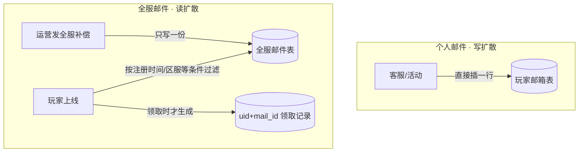

# 邮件 / 发奖补偿

个人邮件 vs 全服邮件 + 附件领取幂等 + 发货补偿——游戏里"发奖"的统一收口，也是补偿一切异常的最后一道兜底。

::: tip 一句话结论
全服读扩散省写入，附件领取靠 CAS 幂等防重领，邮件是发奖兜底的最终落点。
:::

## 场景问题

邮件是游戏里最不起眼却最关键的基础设施：**几乎所有异步发奖都走邮件**——活动奖励、赛季结算、客服补偿、版本补偿、离线奖励。它的难点全在"发奖"这两个字：

- **全服邮件的量级**：给全服 500 万人发一封"停机补偿邮件"，如果给每人插一行，就是 500 万行写入 + 500 万份附件——写爆库。
- **附件领取幂等**：邮件附件（道具）只能领一次。玩家狂点领取、断线重连重领、多端同时领，都不能领出两份。
- **发货可能失败**：领取时背包满了、道具服超时——附件不能就这么没了，要能安全重试补领。
- **过期清理**：邮件无限堆积会拖垮存储和拉取性能，要有过期策略，但**带未领附件的邮件不能随便删**。
- **补偿场景本身**：当某次发奖流程失败（如抽卡发货挂了），最终的兜底往往就是"补发一封邮件"——邮件系统是补偿链路的终点。

核心矛盾：**全服邮件要省写入（不能人手一份），个人附件又要精确到人地防重领**。这两个诉求把邮件拆成了两套模型。

## 实现方案

### 一：个人邮件 vs 全服邮件（写扩散 vs 读扩散）

| 维度 | 个人邮件 | 全服/多人邮件 |
| --- | --- | --- |
| 典型来源 | 客服补偿、定向发奖、好友赠送 | 停机补偿、版本福利、活动全服奖 |
| 存储模型 | **写扩散**：直接写到该玩家邮箱 | **读扩散**：只存一份"公告邮件"，玩家上线时按条件生成个人领取记录 |
| 写入量 | O(收件人数)，但收件人少 | **O(1)** 写一份，避免 500 万行 |
| 领取状态 | 存在个人邮件行上 | 存在**玩家侧的领取记录**（`uid + mail_id` 唯一） |



全服邮件带**领取条件**（如"2026-07-01 前注册"），玩家拉邮件时动态判断可见性，**领取动作才落一行个人记录**——把 500 万次写摊薄到"只有真来领的人才写"。

> **打个比方**：游戏邮件像**小区信箱 + 到付快递**——信箱里的信**放着不会消失**，你什么时候有空回家开箱都行（离线消息可堆积、拉取幂等）；如果邮件带**到付快递**（附件道具），必须"**签收 + 输入取件码**"才算真正拿到手（CAS 领取幂等），任何时候中途出错快递照旧存在快递柜、可以安全重签。**群发**通知（全服停机补偿）像贴在电梯口的**公告 + 广播地址**，看到公告的人各自决定来不来领；而**发奖领取**是点对点的"**签收凭证**"，每人一张、绝不重复。**类比失效边界**：现实信箱**只往里塞、不往外撤**，发出去的信不可能收回；游戏邮件常常要**运营主动撤回错发**（配置写错、道具发多），需要额外的补偿逻辑："**未读才可撤**"（还没被玩家看到就整体撤销）、"**已领取的不可撤**"（防止把玩家已入袋的道具追回来引发纠纷），以及针对"**已读未领**"的中间态给出统一处置策略——这三个状态是纸质信箱完全没有的补丁面。

### 二：附件领取的幂等状态机

领取是"改变道具"的写操作，必须幂等。用状态机 + 领取记录唯一键：

```text
未读(UNREAD) ──读──▶ 已读(READ) ──领取──▶ 已领(CLAIMED) ──▶ 可删除
                                  │
                     领取失败(发货异常) ──▶ 停在 READ,可安全重试
```

```go
func ClaimAttachment(ctx context.Context, uid, mailID uint64) error {
    // 1. CAS 抢占领取权：只有从"未领"翻到"领取中"成功的那个请求能继续
    ok, err := repo.CAS(ctx, uid, mailID, StateUnclaimed, StateClaiming)
    if err != nil { return err }
    if !ok { return ErrAlreadyClaimedOrClaiming } // 重复领取直接挡在这里

    // 2. 原子发货到背包(自身也带幂等键 mailID)
    if err := bag.AddItems(ctx, uid, mail.Attachments, idemKey(uid, mailID)); err != nil {
        // 3. 发货失败：回滚到 Unclaimed，附件还在,可重试补领
        repo.CAS(ctx, uid, mailID, StateClaiming, StateUnclaimed)
        return err
    }
    // 4. 发货成功才落终态
    return repo.Set(ctx, uid, mailID, StateClaimed)
}
```

- **CAS 抢占**：`Unclaimed → Claiming` 的 CAS 保证并发/重复领取只有一个能过，其余被挡。
- **发货失败回滚**：失败退回 `Unclaimed`，**附件不丢**，玩家可重试——这就是"补偿"的本质。
- **发货本身带幂等键**：`idemKey(uid, mailID)`，即使"发货成功但状态没落终态"（中间崩溃），重试也不会重复发（背包侧幂等挡住）。

### 三：发奖补偿——邮件作为兜底终点

游戏里发奖有两条路：**直接发到背包**（在线、背包有位）和**发邮件**（离线、背包满、跨服异步）。当直接发货失败或不确定，统一降级为发邮件：

```go
func GrantReward(ctx context.Context, uid uint64, items []Item, idem string) error {
    if err := bag.AddItems(ctx, uid, items, idem); err != nil {
        if isRetryable(err) || errors.Is(err, ErrBagFull) {
            // 背包满/在线发货失败 → 降级发邮件,附件挂邮件上,玩家自己来领
            return mail.SendWithAttachment(ctx, uid, items, idem) // 同一 idem 防重
        }
        return err
    }
    return nil
}
```

::: tip 邮件是发奖链路的"最终一致性"落点
在线直发追求即时体验，但只要有任何不确定（离线、背包满、跨服超时），就落邮件——**邮件把"必须送达"和"即时送达"解耦**。玩家总能在邮箱找到该得的奖，这是发奖不丢的最终保证。补偿邮件复用发奖的同一幂等键，避免"直发失败又发邮件"变成发两份。
:::

### 四：过期与清理

- **已领 / 已读无附件**：过期（如 30 天）直接物理删除或归档。
- **带未领附件**：**延长保留期**或到期前推送提醒，绝不能连附件一起删——那是资损。
- **拉取分页**：邮箱按时间倒序分页拉，避免一次性拉几百封；未读数单独用计数器维护，不必拉全量。

## 为什么这么做

**为什么全服邮件用读扩散？**
写扩散给全服每人插一行，500 万行写入会瞬间打爆 DB，且绝大多数玩家可能根本不上线来领——白写。读扩散只存一份公告 + 领取条件，把写入从"O(全服人数)"降到"O(实际领取人数)"，且发送动作 O(1) 瞬间完成。**代价是拉取时要动态判可见性**，但读可以靠缓存扛。

**为什么领取要 CAS + 状态机，而不是"查一下领没领"？**
"先查未领 → 发货 → 标记已领"之间有并发窗口，两个并发请求都查到未领就各发一份（和 [幂等性](/game-biz/idempotency-design.md) 里那个资损画面同源）。CAS 把"判断 + 占位"合成一个原子操作，从存储层杜绝并发双领。

**为什么发货失败要回滚到 Unclaimed 而不是标记失败？**
邮件的核心承诺是"附件迟早领得到"。发货失败若标记成终态，附件就永久卡死；退回 `Unclaimed`，附件还挂在邮件上，玩家下次能重领——这让邮件天然具备**补偿/重试**能力，成为发奖兜底。

## 为什么别的选择不行

| 方案 | 为什么不行 |
| --- | --- |
| **全服邮件写扩散(人手一份)** | 500 万行写入打爆库，且多数人不领 = 白写 |
| **领取用"查了再改"** | 查改非原子，并发/重复领取发出多份附件，资损 |
| **发货失败标记终态** | 附件永久卡死领不出，玩家投诉资损 |
| **不带幂等键补发邮件** | 直发失败又发邮件 → 玩家领两份 |
| **过期一刀切物理删** | 删掉带未领附件的邮件 = 直接吞掉玩家的奖，资损 |
| **拉邮件不分页** | 老玩家几百封邮件一次拉爆，拉取慢、包体大 |

::: warning 全服邮件的可见性坑
读扩散靠"领取条件"过滤可见性，条件写错（如时区、注册时间边界、区服 ID）会导致**该发的人看不到、不该发的人领到奖**。上线前务必用几个边界账号验证可见性规则；补偿邮件尤其敏感，多发/漏发都是运营事故。
:::

## 沉淀结论

- **两套模型**：个人邮件写扩散（收件人少、直接落行）；全服邮件读扩散（只存一份 + 领取条件，领取才落个人记录），把写入摊薄到实际领取人数。
- **领取幂等靠 CAS + 状态机**：`Unclaimed → Claiming` 原子抢占防并发双领；发货失败回滚到 `Unclaimed` 保证附件不丢、可补领。
- **发货带幂等键**：即使状态没落终态，重试也不重复发（背包侧幂等兜底）。
- **邮件是发奖的最终一致性落点**：任何不确定（离线/背包满/跨服超时）都降级为邮件，用同一幂等键避免发两份。
- **过期清理**：无附件邮件可删；**带未领附件的绝不能删**；拉取分页 + 未读计数器。

::: tip 与其他专题的关系
- 领取/发货的幂等与状态机 → [业务幂等性设计](/game-biz/idempotency-design.md)（同源的"先查后写"资损画面）。
- 原子发货/扣减 → [业务代理 · 支付 · 商城](/game-biz/business-proxy.md) 的 `Deposit::ExchangeProps`。
- 抽卡、活动、赛季榜发奖失败时，兜底出口都是邮件补发 → [抽卡/掉落与保底](/game-biz/gacha.md)、[排行榜/榜单](/game-biz/leaderboard.md)、[多模板游戏活动框架](/game-biz/activity-framework.md)。
:::

### 记忆口诀

- **两套模型**：个人写扩散（收件人少/直接落行） / 全服读扩散（只存一份/带领取条件/领取才落记录）
- **领取幂等**：CAS 抢占 / `Unclaimed→Claiming` / 失败回滚保附件不丢
- **发奖兜底**：离线·背包满·跨服超时 → 降级发邮件 / 同一幂等键防两份
- **过期清理**：无附件可删 / 带未领附件绝不删 / 分页 + 未读计数器

## 内容来源

综合整理自游戏邮件系统与发奖补偿链路的实现经验；读扩散/写扩散取舍、附件领取状态机与"邮件作为发奖最终一致性落点"呼应本域 [业务幂等性设计](/game-biz/idempotency-design.md) 与 [业务代理 · 支付 · 商城](/game-biz/business-proxy.md)。

## 自测：合上资料能说清楚吗？

**Q1：全服停机补偿要发给 500 万人，为什么不给每人插一行？该怎么发？**

<details><summary>参考答案</summary>

写扩散给全服每人插一行会产生 **500 万行写入**打爆 DB，且多数人不上线领 = 白写。改用**读扩散**：只存**一份公告 + 领取条件**（发送 O(1)），玩家上线时动态判可见性，**领取才落一行个人记录**，写入摊薄到实际领取人数。

</details>

**Q2：玩家狂点/断线重连/多端同时领同一封附件，如何保证只领一份？**

<details><summary>参考答案</summary>

用 **CAS + 状态机**。领取时对 `Unclaimed → Claiming` 做 **CAS 原子抢占**，只有一个请求能翻状态成功，其余被挡。把"判断+占位"合成一个原子操作，从存储层杜绝并发双领；发货本身再带 `idemKey(uid,mailID)` 二次兜底。

</details>

**Q3：领取时背包满/道具服超时导致发货失败，附件该怎么办？**

<details><summary>参考答案</summary>

**回滚到 `Unclaimed`**，而非标记失败终态。附件仍挂在邮件上，玩家可**重试补领**——这就是邮件的"补偿"本质。若标记成终态，附件会**永久卡死**领不出，造成资损投诉。

</details>

**Q4：对比"个人邮件写扩散"与"全服邮件读扩散"，各自的写入量、领取状态存哪、适用场景？**

<details><summary>参考答案</summary>

**写扩散**（个人邮件）：直接写玩家邮箱，写入 O(收件人数)，领取状态存**邮件行上**，适合客服补偿/定向发奖等**收件人少**场景。**读扩散**（全服邮件）：只存一份 + 领取条件，发送 **O(1)**，领取状态存 **`uid+mail_id` 个人记录**，适合停机/版本福利等**全服海量**场景。

</details>

**Q5：邮件过期清理为什么不能"一刀切物理删"？**

<details><summary>参考答案</summary>

无附件的已读/已领邮件可按期（如 30 天）删除，但**带未领附件的邮件绝不能删**——删掉等于**直接吞掉玩家的奖**，是资损。应延长保留期或到期前推送提醒。

</details>
