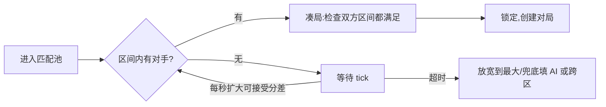

# 匹配 / 段位（MMR）

匹配队列 + 隐藏分(MMR) + 扩圈搜索——在"匹配质量"和"等待时长"之间动态权衡，把水平相近的人凑成一局。

::: tip 一句话结论
用隐藏 MMR 扩圈搜索，在匹配质量、等待时长、池内人数的三角里动态取舍。
:::

## 场景问题

匹配系统的目标一句话说清："**尽快**把**水平相近**的人凑成一局"，但这两个目标天生打架：

- **公平 vs 快**：要匹配质量高（双方实力接近），就得等更多人进池、挑更合适的对手 → 等待变长；要秒进对局，就得放宽实力差 → 局内碾压、体验崩。
- **段位分 ≠ 真实力**：玩家看到的段位（黄金、钻石）是激励用的展示分，用它匹配会不准。真正驱动匹配的是**隐藏分 MMR**。
- **组队匹配**：5 人车队，怎么算车队整体实力？按平均分匹配会被"一个高分带四个低分"钻空子。
- **匹配后的更新**：一局打完，赢了加多少、输了扣多少？加太多分数膨胀，加太少玩家没成长感。
- **人数稀薄**：冷门模式/深夜/高分段，池子里根本没几个人，硬等就是无限转圈。

核心矛盾：**匹配质量、等待时长、池子人数三者不可能同时最优**。所有匹配算法都是在这个三角里做动态取舍。

## 实现方案

### 一：隐藏分 MMR（ELO / Glicko）

匹配用的是隐藏分，不是展示段位。经典 **ELO**：按双方分差算期望胜率，赛后按"实际结果 - 期望"调分。

```go
// ELO：预期胜率 + 赛后调分
func expectedWin(myMMR, oppMMR float64) float64 {
    return 1.0 / (1.0 + math.Pow(10, (oppMMR-myMMR)/400.0)) // 分差 400 → 约 91% 胜率
}

func updateMMR(myMMR float64, win bool, expected float64, K float64) float64 {
    actual := 0.0
    if win { actual = 1.0 }
    return myMMR + K*(actual-expected) // 赢强敌加得多，赢弱敌加得少
}
```

- **K 因子**：控制调分幅度。新手用大 K（快速定级），老手用小 K（分数稳定）。
- **Glicko/Glicko-2**：在 ELO 上加了 **RD（分数可信度）** 和波动率——长期不玩的人 RD 变大，回归后一场定级更快、调分更猛。比 ELO 更贴合"很久没打的人分数不可信"的现实。

::: tip 展示段位与隐藏分解耦
玩家看到的是"钻石 II 星"，系统用的是隐藏 MMR。段位只负责**激励和防掉分焦虑**（连胜升星、有保护局），MMR 负责**真实匹配**。两者可以有偏差——高手小号的段位低但 MMR 高，靠 MMR 匹配才不会去虐菜。
:::

### 二：匹配队列 + 扩圈搜索

玩家进入匹配池，系统按 MMR 找区间内的对手；**等得越久，可接受的分差区间越宽**（扩圈）：

```go
type Ticket struct {
    UID       uint64
    MMR       float64
    EnqueueAt int64
}

// 可接受分差随等待时间线性放宽：等得越久越"不挑"
func acceptRange(waited time.Duration) float64 {
    base := 50.0
    return base + float64(waited/time.Second)*10.0 // 每秒放宽 10 分
}

func (m *Matcher) tryMatch(t *Ticket, now int64) *Ticket {
    r := acceptRange(time.Duration(now-t.EnqueueAt) * time.Second)
    // 在 [MMR-r, MMR+r] 区间找池内最接近的对手
    return m.pool.FindClosest(t.MMR, r)
}
```



- **扩圈**：`base + 时间×斜率`，前期严格保质量、后期放宽保等待。
- **超时兜底**：等太久还没人 → 放宽到最大区间、跨区匹配、或填 AI 机器人（PVE 化保证不空等）。
- **双向满足**：A 接受 B 不代表 B 接受 A（B 刚进池区间还窄）——凑局要**双方区间都覆盖对方**。

### 三：组队匹配

车队要折算成一个"队伍实力值"，且防止"大腿带妹"钻空子：

| 折算方式 | 问题 | 适用 |
| --- | --- | --- |
| 队内**平均** MMR | 一个高分带四个低分 → 均值被拉低,虐菜 | 不单独用 |
| 队内**最高** MMR | 过于保守,车队总匹配到强敌 | 偏保守场景 |
| **平均 + 分差惩罚** | 队内分差越大额外加权,抵消带飞 | 常用 |

实践里常用"平均分 + 组队惩罚项"：队内实力差距越大、队伍规模越大，额外上调匹配实力（让带飞车队去碰更强的对手），压制 carry 收益。

### 四：连败保护与体验平滑

纯 MMR 匹配数学上公平，但体验未必好。常见修正：

- **连败保护**：连输 N 局，临时下调匹配到的对手强度（或降低掉分），避免玩家被劝退。
- **新手保护期**：前若干局只匹新手/AI，且大 K 快速定级。
- **胜率收敛**：系统隐含目标是让每个人长期胜率趋近 50%——这既是"匹配准"的标志，也是留存的关键。

## 为什么这么做

**为什么匹配用隐藏 MMR 而不是展示段位？**
展示段位是为了激励设计的（连胜多升、有保护局、不轻易掉段），它被人为"扭曲"过，不反映真实力。用它匹配会让高手小号去虐菜、让运气上分的人被吊打。MMR 是纯粹的实力估计，**匹配准不准全看它**，所以两套分必须解耦。

**为什么要扩圈而不是固定区间？**
固定窄区间保证质量但人少时永远匹配不到（无限转圈）；固定宽区间秒匹配但经常被碾压。扩圈让系统**先按高标准找、找不到再逐步妥协**，在"质量"和"等待"之间沿时间轴动态滑动——这是三角取舍的工程解。

**为什么组队要惩罚项？**
按平均分匹配时，"1 个大腿 + 4 个鱼"的均值不高，却能靠大腿一个人打崩对面——这是对匹配公平性的套利。加分差/规模惩罚，让这种车队去匹配更强的对手，把 carry 的收益还回去，堵住套利。

## 为什么别的选择不行

| 方案 | 为什么不行 |
| --- | --- |
| **用展示段位匹配** | 段位被激励规则扭曲，高手小号虐菜、运气分被吊打 |
| **固定分差区间** | 太窄→人少时无限转圈；太宽→经常被碾压，体验崩 |
| **组队按纯平均分** | "大腿带鱼"套利，均值不高却单方面碾压 |
| **只用 ELO 不管不活跃** | 长期不玩的人分数早已失真，回归后乱杀或被杀；Glicko 的 RD 才能快速重定级 |
| **K 因子全程固定** | 大 K 老手分数抖动、小 K 新手定级慢；要分阶段 |
| **匹配不到就无限等** | 冷门模式/深夜/高分段直接卡死;必须超时兜底(扩圈到底/跨区/填 AI) |

::: warning 池子稀薄是最现实的敌人
高分段、冷门模式、深夜时段，池子里可能就几个人。此时"匹配质量"是奢望，保证**不无限转圈**才是第一位：设超时上限，到点就跨区、跨模式、或填 AI 机器人。匹配算法在纸面上再漂亮，也架不住池子里没人——**先保证有得匹，再谈匹得好**。
:::

## 沉淀结论

- **匹配的三角**：匹配质量、等待时长、池内人数不可能同时最优，所有设计都是这三者的动态取舍。
- **隐藏分驱动匹配**：ELO/Glicko 算 MMR，展示段位只管激励，两者解耦；Glicko 的 RD 解决"不活跃玩家分数失真"。
- **扩圈搜索**：可接受分差随等待时间放宽，前期保质量、后期保等待，超时有兜底（跨区/填 AI）。
- **组队折算**：平均分 + 分差/规模惩罚，堵"大腿带鱼"的套利。
- **体验修正**：连败保护、新手保护期、胜率向 50% 收敛——数学公平之外还要体感公平。
- **池子稀薄优先保"有得匹"**：设超时上限兜底，别让玩家无限转圈。

::: tip 与 game-infra 的衔接
匹配成功后要把这一队人分配到一个**对局服（DS）**上开局——DS 是有状态单进程，涉及开区/选服/清场，属于 [game-infra](/game-infra/README.md) 的有状态服务范畴。匹配（局外、可水平扩的互联网式服务）与对局（局内、有状态实时）的分界，正是 [游戏与互联网后台的本质差异](/game-biz/game-vs-internet.md) 讲的那条线。
:::

### 记忆口诀

- **核心三角**：匹配质量 / 等待时长 / 池内人数（不可能同时最优）
- **两套分**：隐藏 MMR（真匹配·ELO/Glicko）/ 展示段位（纯激励）/ 必须解耦
- **扩圈**：分差随时间放宽 / 前期保质量后期保等待 / 超时兜底（跨区·填 AI）
- **组队防套利**：平均分 + 分差/规模惩罚 / 堵"大腿带鱼"

## 内容来源

综合整理自竞技匹配 / 段位系统的实现经验；ELO/Glicko 评分、扩圈搜索与组队折算为业界通用做法；匹配与对局服的分界呼应本域 [游戏与互联网后台的本质差异](/game-biz/game-vs-internet.md)。

## 自测：合上资料能说清楚吗？

1. 匹配系统的"不可能三角"是哪三者？为什么它们无法同时最优？

<details><summary>参考答案</summary>

**匹配质量**（双方实力接近）、**等待时长**、**池内人数**。要质量高就得等更多人进池挑对手，等待变长；要秒进就得放宽分差，被碾压。**池子人数**决定前两者的天花板——人少时质量和速度都保不住。所有算法都在这三角里动态取舍。

</details>

2. 为什么匹配要用隐藏 MMR，而不是玩家看到的展示段位？两者关系如何？

<details><summary>参考答案</summary>

展示段位为**激励**设计（连胜升星、有保护局、不轻易掉段），被人为扭曲，不反映真实力；用它匹配会让**高手小号虐菜**、运气分被吊打。MMR 是纯实力估计，负责**真匹配**。两者**解耦**：段位管体感，MMR 管公平。

</details>

3. "扩圈搜索"是什么？相比"固定分差区间"好在哪？

<details><summary>参考答案</summary>

可接受分差随**等待时间线性放宽**（`base+时间×斜率`），前期严格保质量、后期放宽保等待，超时有兜底。**固定窄区间**人少时无限转圈，**固定宽区间**经常被碾压；扩圈让系统先按高标准找、找不到再逐步妥协，沿时间轴动态滑动。

</details>

4. 对比组队折算的三种方式（纯平均 / 纯最高 / 平均+惩罚），为什么最终用第三种？

<details><summary>参考答案</summary>

**纯平均**会被"1 大腿带 4 鱼"套利——均值不高却单方面碾压；**纯最高**过于保守，车队总碰强敌。**平均+分差/规模惩罚**：队内实力差越大、规模越大就额外上调匹配实力，让带飞车队碰更强对手，把 carry 收益还回去，堵住套利。

</details>

5. Glicko 相比经典 ELO 多解决了什么问题？

<details><summary>参考答案</summary>

ELO 只有单一分值，无法表达"分数可信度"。Glicko 加了 **RD（分数偏差/可信度）** 和波动率：长期不玩的人 RD 变大，回归后**一场定级更快、调分更猛**，解决"很久没打的人分数已失真"的问题——比 ELO 更贴合活跃度现实。

</details>
