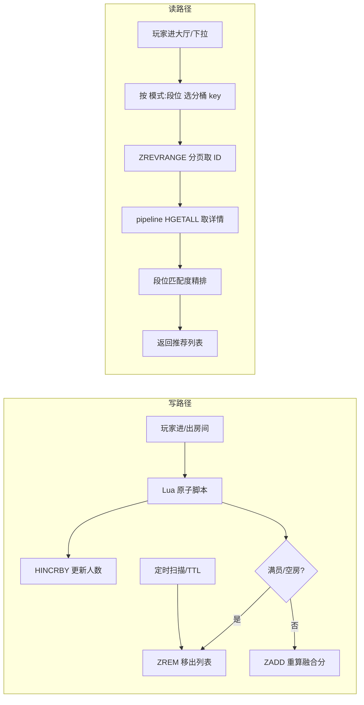

# Redis 房间推荐列表

用 ZSet 做分值融合排序 + 实时更新 + 分页，撑起"可加入房间"的高频读写。

## 场景问题

对局大厅要实时展示"你现在能加入的房间"，需求听起来简单，落地全是硬约束：

- **实时性**：房间秒级增删，人数每次进出都在变，列表不能是几分钟前的快照；
- **排序要"聪明"**：不是简单按创建时间倒序，而要融合**热度**（人多的靠前）、**新鲜度**（老房间降权）、**匹配度**（段位/模式贴近玩家的靠前）；
- **高频读**：大厅是流量入口，每次进大厅、每次下拉刷新都在读，QPS 极高；
- **高频写**：每次有人进出房间就要更新该房间的排序权重；
- **要翻页**：一屏放不下，得能"加载更多"。

::: warning 用 MySQL `ORDER BY` 硬扛会怎样
`SELECT * FROM rooms WHERE status='open' ORDER BY score DESC LIMIT ?,?` ——排序字段 `score` 每次人数变动都要更新，写放大严重；高并发读全压在这张表上，`ORDER BY ... LIMIT` 还要每次现算排序，深翻页 `LIMIT 10000,20` 更是灾难。房间还有秒级增删，DB 索引维护成本高。这条路撑不住大厅的读写量级。
:::

## 实现方案

### 数据结构选型：ZSet 排序 + Hash 存详情

- **ZSet（有序集合）** 存"房间 ID → 融合分值 score"，负责排序与分页；
- **Hash** 存每个房间的详情（人数、模式、房主、段位等），列表页拿到 ID 后批量取详情。

```
# ZSet：一个分区/模式一个 key，member=房间ID，score=融合分值
ZADD room:rank:{mode:rank}  1699999812.35  room:10086

# Hash：房间详情，单独存，TTL 兜底过期清理
HSET room:info:10086 owner 42 players 3 cap 5 mode rank rank_tier gold created 1699999000
EXPIRE room:info:10086 1800
```

### 分值融合：热度 × 时间衰减 × 匹配度

score 不是单一维度，而是几个信号的加权融合。**时间衰减**用创建时间（或最近活跃时间）参与计算，让新房间天然靠前、老房间自然沉底：

```
score = w1 * heat            # 热度：当前人数 / 满员比例
      + w2 * freshness       # 新鲜度：随时间衰减
      + w3 * match_affinity  # 匹配度：与请求玩家段位/模式的贴近程度
```

热度与新鲜度是房间自身属性，可直接写进 ZSet 的 score；**匹配度依赖"谁在看"**，无法预先固化进全局 ZSet。工程上常见做法：ZSet 里存"热度 + 新鲜度"的基础分做粗排，取出候选后在应用层用玩家段位做**精排**微调。下面的写入是基础分：

```go
// 房间状态变化时重算基础分并更新 ZSet
func (r *RoomRank) UpdateScore(ctx context.Context, room *Room) error {
    now := float64(time.Now().Unix())
    heat := float64(room.Players) / float64(room.Cap)        // 满员比例 [0,1]
    // 时间衰减：越晚创建 freshness 越大 → 越靠前；半衰期 300s
    freshness := now / 300.0
    decayHeat := heat * math.Exp(-(now-float64(room.Created))/600.0) // 老房热度再打折

    score := 100*decayHeat + freshness
    key := "room:rank:" + room.Bucket() // 按 模式:段位 分桶
    return r.rdb.ZAdd(ctx, key, redis.Z{Score: score, Member: room.IDStr()}).Err()
}
```

### 分页：ZREVRANGE 按 rank 翻页

按分值从高到低取，`ZREVRANGE key start stop` 天然支持分页（O(log N + M)）：

```
# 第一页：前 20 个（带分值方便调试）
ZREVRANGE room:rank:rank_gold 0 19 WITHSCORES
# 第二页：20~39
ZREVRANGE room:rank:rank_gold 20 39
```

```go
func (r *RoomRank) Page(ctx context.Context, bucket string, page, size int64) ([]*Room, error) {
    key := "room:rank:" + bucket
    start, stop := page*size, page*size+size-1
    ids, err := r.rdb.ZRevRange(ctx, key, start, stop).Result() // 分值倒序分页
    if err != nil {
        return nil, err
    }
    // 拿 ID 批量取详情（pipeline 一次往返）
    pipe := r.rdb.Pipeline()
    cmds := make([]*redis.MapStringStringCmd, len(ids))
    for i, id := range ids {
        cmds[i] = pipe.HGetAll(ctx, "room:info:"+id)
    }
    _, _ = pipe.Exec(ctx)

    rooms := make([]*Room, 0, len(ids))
    for i, c := range cmds {
        m, _ := c.Result()
        if len(m) == 0 { // 详情已过期但 ZSet 里残留 → 顺手清理脏 member
            r.rdb.ZRem(ctx, key, ids[i])
            continue
        }
        rooms = append(rooms, parseRoom(ids[i], m))
    }
    return rooms, nil
}
```

::: warning 深翻页与"翻页一致性"
基于 rank 偏移的分页（`ZREVRANGE start stop`）在数据实时变动时会有漂移：翻到第二页时，第一页的房间可能已因人数变化重排，导致重复或漏项。可接受的场景直接用 offset 分页；要求稳定翻页时，改用 **score 游标**（`ZREVRANGEBYSCORE key (lastScore -inf LIMIT 0 size`），以"上一页最后一个分值"为游标续翻，避免偏移漂移。
:::

### 实时更新与过期清理

- **人数变化 → 更新 score**：每次进/出房间调 `UpdateScore` 重算并 `ZADD`（member 相同即覆盖分值）；
- **满员 / 关闭 → 即删**：`ZREM` 出 ZSet + `DEL` 房间详情，不让不可加入的房间出现在列表；
- **过期清理**：房间详情 Hash 设 `EXPIRE` TTL 兜底；再配一个**定时扫描**（`ZRANGEBYSCORE` 按最后活跃时间取出僵尸房间）批量 `ZREM`，防止 ZSet 里堆积详情已过期的脏 member（读路径也顺手清理，见上面代码）。

```lua
-- 原子更新：人数变化时用 Lua 保证"改人数 + 重算分 + 满员即删"不被打断
-- KEYS[1]=room:info:{id}  KEYS[2]=room:rank:{bucket}
-- ARGV[1]=delta(±1)  ARGV[2]=roomId  ARGV[3]=newScore
local players = tonumber(redis.call('HINCRBY', KEYS[1], 'players', ARGV[1]))
local cap = tonumber(redis.call('HGET', KEYS[1], 'cap'))
if players >= cap or players <= 0 then
    -- 满员或空房：从推荐列表移除
    redis.call('ZREM', KEYS[2], ARGV[2])
else
    redis.call('ZADD', KEYS[2], ARGV[3], ARGV[2])
end
return players
```

### 读写全景



### 避免大 key 与热点：分桶

单个 ZSet 装下全服所有房间会变成**大 key**（几十万 member，单 key 操作阻塞、迁移困难、内存热点）。按**分区 / 模式 / 段位**分桶，把一个巨 key 打散成多个小 key：

```
room:rank:{rank:gold}      # 排位·黄金段
room:rank:{casual:eu}      # 休闲·欧服
room:rank:{rank:diamond}   # 排位·钻石段
```

分桶天然贴合"玩家只看自己模式/段位的房间"的查询习惯——匹配度已隐含在桶里，读放大也小。`{}` 内是 hash tag，保证同桶的 rank 与 info key 落到同一 slot，便于 Lua/pipeline 原子操作。

## 为什么这么做

**为什么用 ZSet 而非 DB `ORDER BY`？**
- **写**：ZSet 更新一个 member 分值是 O(log N) 的内存跳表操作，比 DB 更新索引列 + 刷盘轻得多，扛得住人数频繁变动；
- **读**：`ZREVRANGE` 直接从已排好序的跳表取一段，O(log N + M)，无需每次现算排序，抗高并发读；
- **实时**：内存态，秒级增删房间不涉及磁盘 IO 与索引重建。DB 的 `ORDER BY ... LIMIT` 每次查询都要排序、深翻页恶化，且排序列高频更新会拖垮整表。

**为什么要做分值衰减？**
不衰减的话，早创建、一度很热的老房间会**永远霸榜**——即便它已经冷清或即将解散。时间衰减让分值随时间自然回落，把展示机会让给新鲜、活跃的房间，列表始终反映"当下值得加入的房间"。这和资讯流的时间衰减是同一个道理。

## 为什么别的选择不行

**MySQL `ORDER BY score DESC LIMIT`：** 高频写放大、高并发读排序、深翻页恶化、秒级增删的索引维护成本，四座大山，撑不住大厅量级。（见开头场景警告。）

**List / 普通 Set 存房间：** List 无法按分值排序，Set 无序，都拿不到"按融合分排序 + 分页"的能力。ZSet 是唯一同时满足"排序 + 范围分页 + O(log N) 更新"的原生结构。

**全局单个大 ZSet：** 会形成大 key 与访问热点，单 key 阻塞、集群迁移困难、内存不均。必须按分区/模式分桶打散。

**把详情也塞进 ZSet 的 member：** member 存 JSON 会让 key 膨胀、更新详情要 `ZREM`+`ZADD` 两步且改变排序语义。详情用 Hash 独立存、ZSet 只存 ID 是清晰的职责分离。

## 沉淀结论

- **ZSet 排序 + Hash 存详情** 是房间推荐列表的标准组合：一个管序，一个管料。
- **融合分 = 热度 × 时间衰减 × 匹配度**；基础分（热度+新鲜度）入 ZSet 粗排，匹配度在应用层精排。
- **人数变化即重算 score、满员/关闭即 `ZREM`**，用 **Lua 保证原子**；TTL + 定时扫 + 读路径顺手清，三管齐下清脏 member。
- **分页用 `ZREVRANGE`**；要稳定翻页改用 **score 游标**避免偏移漂移。
- **按模式/段位分桶**避免大 key 与热点，分桶还天然贴合查询习惯、隐含匹配度。
- ZSet 相对 DB `ORDER BY` 的核心优势：**O(log N) 写 + 免排序读 + 内存实时**。

::: tip 落地要点
- 分桶 key 用 `{}` hash tag 把同桶的 rank 与 info 固定到同一 slot，Lua/pipeline 才能原子；
- 读路径遇到"ZSet 有 ID 但 Hash 详情已过期"要顺手 `ZREM`，自愈脏数据；
- 精排只在候选集（一两页）上做，别把全量拉出来在应用层排序。
:::

## 内容来源

综合整理自 Redis 有序集合在游戏大厅/房间推荐场景的落地实践，涵盖分值融合、实时更新、分桶与翻页一致性等工程要点。
