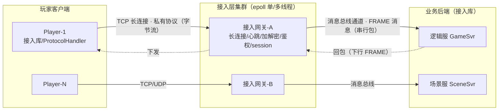
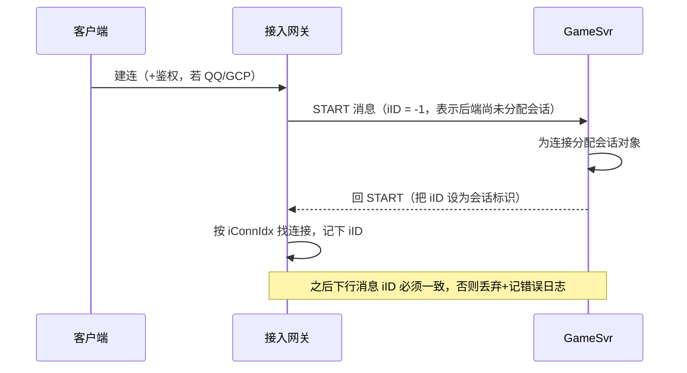
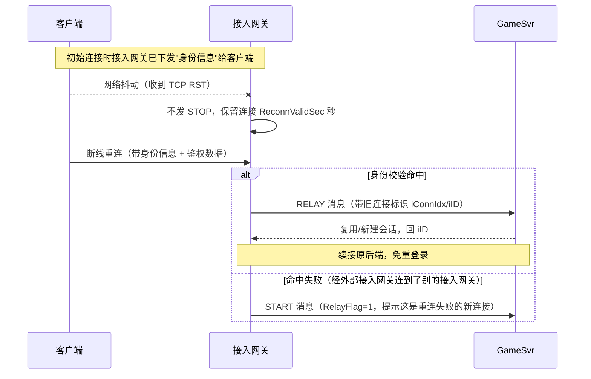
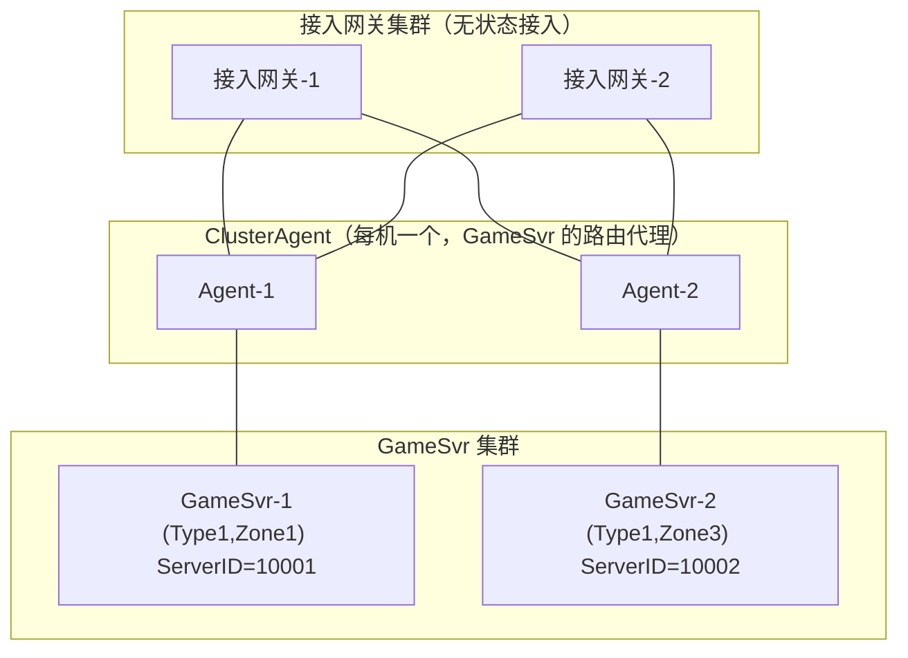

# 接入网关（长连接接入层）

游戏长连接接入网关 · 有状态长连接 · 私有协议 · FRAME/消息总线 · 低延迟收发

> ::: tip 说明
> 本文描述的是某游戏后台框架中的**接入服务组件**（长连接接入网关）。内容按**公开手册中的设计原理**（FRAME 协议、五大接入模式、鉴权体系、断线重连、集群化）描述架构思想与取舍，帮助从"知道有这么个网关"到"讲清楚它每个机制为什么这么设计"。不涉及内部未公开的实现细节。
> :::

::: tip 一句话结论
接入网关把"字节流↔消息包"的收发与连接管理从 GameSvr 剥离，让逻辑帧率稳、后端可弹性伸缩。
:::

## 场景问题

一款 MMO / 竞技类游戏，成百上千万玩家同时在线，每个玩家一条 **TCP/UDP 长连接**贴着接入层不放。业务后端（逻辑服 GameSvr、场景服、匹配服）是无数个进程，散在不同机器上。直接让业务进程去 `accept()` 海量连接会带来一堆麻烦：

- **连接与逻辑耦合**：业务进程既要处理游戏逻辑（帧驱动、战斗计算），又要处理 socket 读写、TLS 握手、心跳，CPU 被 I/O 抢占，逻辑帧率抖动。
- **有状态**：连接不是无状态 HTTP，一条连接对应一个玩家会话（session），断线要能重连回原逻辑上下文，不能随便打到任意后端。
- **私有协议**：游戏包是自定义二进制协议（省带宽、防抓包/外挂），不是 HTTP，通用网关（Nginx / API Gateway）识别不了。
- **安全**：外网直连业务进程 = 把逻辑服暴露给公网攻击面，DDoS 一打就穿。

框架的解法就是一句话：**把"与游戏业务无关的数据收发与连接管理"从 GameSvr 里剥离出来，交给接入网关。** 用手册原话说——接入网关最基本的功能就是实现**"（基于 TCP/IP 的）字节流"与"（消息总线通道中的）消息包序列"之间的转换**。



### 框架组件全景（先认清接入网关的邻居）

接入网关从来不是单打独斗，理解它必须先认清一圈组件：

| 组件 | 职责 | 类比 |
| --- | --- | --- |
| **接入网关** | 接入服务：TCP/UDP 并发字节流 ↔ 消息总线串行消息包，管连接、鉴权、加解密、排队 | 门卫兼话务台 |
| **消息总线** | 进程/线程间通信中间件，走**共享内存**通道（channel），双工收发 | 内部专线 |
| **GCIM** | Global Channel Information Map，全局通道信息表，存所有 channel 配置（两端总线地址、队列大小），放共享内存，一台机器一份 | 电话簿 |
| **TDR** | 数据表示组件，用**元数据（meta）**描述数据结构，接入网关靠它做协议分包与打解包 | 报文的"字典" |
| **客户端接入库** | 分别对应 TDR / QQ / GCP 模式的客户端库，封装协议处理与连接管理 | 客户端 SDK |
| **后端接入库** | GameSvr 侧接入库，封装 FRAME 协议编解码 + 消息总线收发 | 后端 SDK |
| **ProtocolHandler** | Windows 下对客户端库的封装 DLL，独立线程收发 | 端游客户端封装 |
| **APS / ClusterAgent** | 鉴权代理服务 / 集群化路由代理（下文详述） | 认证中心 / 调度中心 |

一句话串起来：**客户端用接入库连接入网关，接入网关用消息总线（查 GCIM 找通道）把 FRAME 消息投给 GameSvr，GameSvr 用后端接入库收发。**

## 实现方案

接入网关的核心职责可拆成六块：**① 长连接维持**（epoll 管十万级 fd）**② 收发包与分包**（把字节流切成完整业务包）**③ 心跳保活**（空闲探测 MaxIdle）**④ 鉴权 + 加解密**（QQ/CTLogin/PTLogin/第三方/APS）**⑤ 会话状态与排队**（session + FIFO 排队保护后端）**⑥ 路由到消息总线**（投给对应 GameSvr）。下面挑面试最能深挖的几块展开。

### 五大接入模式（PDU）

接入网关用 **PDU（Protocol Data Unit）** 抽象不同接入 + 分包方式，每种 PDU 有独立业务处理逻辑。这是理解其演进史的主线：

| 模式 | 分包方式 | 定位 | 能力 |
| --- | --- | --- | --- |
| **TDR** | `BY_TDR`（按 TDR 元数据算包长）| 纯透传中间件，**不鉴权** | 最裸，客户端用 TDR 接入库 |
| **QQ** | `BY_QQ`（预定义 QQ 协议）| 端游主力 | QQ 登录鉴权、加解密、断线重连、跨服跳转 |
| **WEB** | `BY_WEB`（二进制 or HTTP）| 页游 | 穿透 HTTP 代理/防火墙、Flash 策略文件、Ptlogin 鉴权 |
| **UDP** | 无分包（一次 recv 一个包）| 弱网/实时 | 转发时带客户端 IP+PORT，回包按此路由 |
| **GCP** | `BY_GCP`（通用传输协议）| **手游主力** | QQ 模式全特性 + 灵活账号（u32/u64/字符串）+ 多鉴权平台 + 账号映射 + 压缩 + 新组播 |

::: tip 为什么手游要新造 GCP 模式？
QQ 模式把账号写死成 `uint32` 的 uin，绑死即通 KEY 鉴权——不适应手游（主流社交/海外账号大多是字符串）。**GCP = General Communication Protocol**，继承 QQ 模式的排队/加密/断线重连，再补三刀：**灵活账号类型、多鉴权平台（委托 APS 快速接入新平台，接入网关侧零改动）、字符串账号→uint64 映射**（方便 GameSvr 用整型做索引）。这就是"抽象层收口，把易变的鉴权外包出去"的经典设计。
:::

### FRAME 协议：接入网关 ↔ GameSvr 的内部契约

客户端和接入网关之间跑的是**业务私有协议**（接入网关不理解），而接入网关和 GameSvr 之间跑的是 **FRAME 协议**。关键点：

- **FRAME 头不含 body 长度**——因为消息总线保证消息完整性（收到的就是整包），所以接入网关从总线拿到消息后，解出 `TFRAMEHEAD` 头，剩下的全是业务数据。**这是"分包责任下沉给传输层"的巧思**：外网 TCP 字节流才需要自己切帧，内网消息总线天然按消息投递。
- **`chCmd` 决定一切**：命令字段区分 `START / STOP / RELAY / INPROC` 等，`stCmdData` 是个 union，`chCmd` 选中哪个成员有效。
- **两个回调索引把连接和会话绑起来**：

```c
// FRAME 头的核心字段（据公开手册整理，非内部真实布局）
struct TFRAMEHEAD {
    uint8_t  chCmd;      // START/STOP/RELAY/INPROC... union 选择子
    int32_t  iConnIdx;   // 接入网关分配的"连接索引"，GameSvr 只读
    int32_t  iID;        // GameSvr 分配的"会话标识"，接入网关只读，初值 -1
    uint64_t ullExtend;  // GameSvr 预留扩展位，接入网关只回填不理解
    // ... stCmdData (union, 依 chCmd 而定)
};
```

  - **上行**（客户端→GameSvr）：GameSvr 用 `iID` 找到处理该消息的会话。
  - **下行**（GameSvr→客户端）：接入网关用 `iConnIdx` 找到对应连接。
  - GameSvr 回包原则：**应答复制上行头再改字段；主动发则 memset 清零后填 `chCmd/iConnIdx/iID`。**

### START 握手 与 长短连接（iID 校验）

连接建立的本质是一次 **START 握手**：



**长短连接的判定就藏在这个回复的 iID 里**（不是指 TCP 长短连接）：

| | 长连接（iID ≠ -1）| 短连接（iID = -1）|
| --- | --- | --- |
| 源 IP+PORT | 仅 START 携带 | 每个上行包都带 |
| 连接关闭 | 发 STOP 消息 | 不发 STOP |
| 下行校验 | 校验 iID 一致，不一致丢弃 | 不校验 iID，校验 IP+PORT |

### 断线重连：连接可断，会话不断

QQ/GCP 登录握手很重（要传签名、协商密钥），网络一抖就重来代价太大。接入网关的解法：**网络异常时不立刻发 STOP，而是保留会话一个 TTL（配置项 `ReconnValidSec`）**，等客户端凭身份信息重连。



**几个魔鬼细节（面试深挖点）：**
- **只有收到 TCP RST（网络异常）才等重连**；客户端主动 close 或 GameSvr 发 STOP，接入网关直接释放，不等。
- **经外部接入网关（L4）后重连可能落到别的接入网关**，找不到旧连接 → 重连请求里额外带鉴权数据，失败就走新建连接，用 `RelayFlag=1` 告诉 GameSvr。
- **手机锁屏坑**：锁屏时系统主动关 socket，接入网关会误判为"客户端主动退出"立即释放。解法是配 `EnlargeReconnScopeFlag`——收到 socket 关闭时先看有没有收到 GCP 协议层的关闭包，没有就仍保留等重连。

### 鉴权体系：从写死 KEY 到委托 APS

接入网关支持多种连接鉴权，`AuthType` 取值 `NONE/QQV1/QQV2/QQUNIFIED/AP/PT`：

- **CTLogin**（即通 KEY 鉴权）：QQ 模式主力，端游常用。客户端经登录态服务从即通拉签名 → 传给接入网关 → 接入网关调验签接口验签。
- **PTLogin**：Web 模式主力。页游登录拿 skey → 接入网关 UDP 请求 ptlogin 验证。skey 有效期 50 分钟，配 `SessionRenewInterval` 定期续期保活。
- **第三方鉴权（AP）/ APS**：海外/外部账号系统用字符串账号，框架造了 **AuthProxy / APS（鉴权代理服务）** 模拟即通环境。**GCP 模式把鉴权彻底外包给 APS**——接新平台只改 APS，接入网关零改动。APS 内含 AuthSvr（鉴权）、DHSvr（DH 密钥协商）、IDSvr（账号映射）。

**通信加密**：QQ/GCP 支持 TEA/QQ/AES/AES2 对称加密。密钥协商方式 `KeyMethod`：`DH`（不传密钥、交换计算因子最安全，需配置中心支持）/ `Server`（接入网关直接下发随机 KEY，简单）/ `Auth`（从鉴权票据取 KEY，如 CTLogin ST 票据）/ `None`。聊天等非敏感包可用 FRAME 的 `NoEnc=1` 跳过加密省 CPU——**因为接入网关的性能热点就是加解密**（见性能章节）。

### 排队机制：保护后端不被瞬间打爆

开服瞬间几十万人涌入，GameSvr 顶不住。接入网关内置 **FIFO 排队队列**，鉴权通过后不立刻发 START：

- **`Permit`**：在线连接总数上限，满了新连接排队，有人断开才放行（保护后端处理能力，0=不限）。
- **`Speed`**：每秒放行连接数（削平开服洪峰，无论 Permit 是否设置都生效）。
- **动态调整**：GameSvr 可发 `TFRAMEHEAD_CMD_SET_WAITCTR` 命令临时收紧放行数，接入网关在静态配置与动态值间**取最小**，默认 1 分钟后失效。
- QQ/GCP 模式排队集成在握手里，会定期给客户端推排队进度；VIP 账号可免排队；**断线重连/跨服跳转不受排队限制**。

### 流量控制 / 空闲关闭 / 包合并（三个运维旋钮）

- **流量控制** `TransLimit`：限每连接每秒包数（`PkgSpeed`）和字节数（`ByteSpeed`），超限按 `LimitAction` 断连或丢包。实现上是**每 10 秒查 10 秒窗口是否超 10 倍配置**（不是逐秒判断，降开销）。
- **空闲连接关闭** `MaxIdle`：一段时间无上行包就断，推荐 5 分钟或心跳间隔的 2~3 倍。
- **消息包合并**：GameSvr 下发小包时，IP+TCP 头就占 40+ 字节，有效载荷占比低。接入网关攒够 `MergeSize` 或超 `MergeTimeout` 再一次性发，多消息共用一个 IP/TCP 头，还减少 TCP ACK 数。急包可标 `chSendImmediately` 立即发。

## 为什么这么做

**为什么把接入独立成接入网关，而不是业务进程自己 accept？**

- **职责分离**：GameSvr 跑帧循环，最怕被 I/O 阻塞。接入层扛 epoll 收发与加解密，GameSvr 只收到干净的 FRAME 消息，帧率稳定。手册原话——**"把开发人员从与业务无关的数据收发与连接管理中解放出来"**。
- **连接收敛**：几百个业务进程若各自监听公网 = 几百个攻击面、几百套协议栈。收敛到接入层，安全/限流/防刷/加密统一做。
- **弹性解耦**：GameSvr 可扩缩容、迁移、重启，玩家连接挂在接入网关上（配合 session 保持）只需重路由。
- **有状态就近**：一条连接 = 一个玩家会话，接入网关记住"这个玩家路由到哪台 GameSvr"，实现连接与后端的稳定亲和。

**为什么接入网关 ↔ GameSvr 走消息总线而非 TCP？**

消息总线是**共享内存**通道，同机进程间零拷贝、无内核态 socket 开销，且**保证消息完整性**（所以 FRAME 头才敢不带长度字段）。跨机才退化到 TCP。这正是"内网通信榨性能、外网通信保通用"的分层。

**为什么用私有二进制协议而非 HTTP/JSON？**

包更小（省移动网络带宽、省电），解析更快（无文本解析），且不自描述 = 抓包/外挂逆向门槛更高。

## 集群化：从"一对一绑死"到"网状路由"

早期接入网关和 GameSvr **一对一部署**。接入外部接入网关（L4）后，客户端被随机分到某个接入网关 → 随机落到某个 GameSvr，**无法指定登录哪台、断线重连也回不到原 GameSvr**（除非开 L4 会话保持，但伤性能）。

**集群化方案**把它改成**交叉网状**：



**核心机制：**
- **路由信息三元组 `TypeID + ZoneID + ServerID`**：Type/Zone 从两个维度分组（全区全服可退化成一个值），ServerID 全局唯一标识一台 GameSvr。GameSvr 通过 ClusterAgent 把路由注册到每个接入网关。
- **两种登录**：① 指定区服（Type+Zone）→ 接入网关在该组内按账号**一致性哈希 / CRC 求模**选一台；② 定点登录（直接指 ServerID）。
- **路由跳转 / 定向发送**：GameSvr 发 `TFRAMEHEAD_CMD_CLUSTER_SETROUTING` 让某连接后续发包改投另一台；客户端也能用带路由的发送接口把消息发给指定 GameSvr（跨图/跨服）。
- **断线重连**：接入网关建连时把登录点路由下发给客户端（客户端库存内存），重连带上路由 → **不管连到哪台接入网关都能回到原 GameSvr**，无需 L4 会话保持。

**容灾（四道防线）：**
1. **ClusterAgent → GameSvr 心跳**：超时（默认 `HeartBeatAliveTime=30s`）标记 GameSvr 不可用，上报接入网关剔除。
2. **接入网关 → ClusterAgent 靠 TCP 连接状态**：连接异常则把该 Agent 注册的 GameSvr 全置不可用。
3. **GameSvr 不可用后**：新连接不再分配过去（定点登录直接关连接）；已有连接若无上行包则保留，GameSvr 恢复后仍可通信；有上行包默认关连接（除非客户端标了"数据可丢失"）。
4. **ClusterAgent → 接入网关链路异常**：定期重连，其间 GameSvr 有下行则回 STOP（reason=`GATEWAY_UNREACHABLE`）。
5. **排队后移**：一对一时接入网关直接为 GameSvr 排队；集群化下一台 GameSvr 被多个接入网关接入，单个网关无法独立限流，**排队功能上移到 ClusterAgent**（它是 GameSvr 的唯一入口代理）。

> 集群化目前支持 **GCP 与 WebSocket** 模式。

## 为什么别的选择不行

::: warning 通用网关 / Service Mesh Ingress 顶不上
| 方案 | 为什么不适合游戏接入 |
|---|---|
| **Nginx / API Gateway** | 面向无状态短连接 HTTP，不懂私有二进制帧，不做游戏 session 保持，长连接管理与心跳非其所长 |
| **gRPC / HTTP2 网关** | 强 schema、HTTP2 帧开销；移动弱网下头部与握手成本偏高；难塞自研加密与反外挂 |
| **让逻辑服直连** | I/O 抢占逻辑帧、公网攻击面爆炸、扩缩容时连接全断 |
| **无状态负载均衡** | 长连接 + 玩家亲和要求"同一玩家稳定打到同一后端"，纯轮询/最少连接会打散会话 |
| **纯靠 L4 会话保持做亲和** | 伤 L4 性能；且随机分配无法定点登录、跨服跳转、精细路由 |
:::

游戏接入的硬约束——**有状态长连接、私有低延迟协议、会话保持、玩家↔后端稳定亲和**——决定了通用网关不能直接替代，必须自研接入层，并在规模变大后演进出集群化路由。

## 沉淀结论

### 性能数据（记几个数量级，面试够用）

基于公开性能报告（接入网关 3.x，8 核 8G 老机器），**记结论不记精确值**：

| 模式 | 量级参考 | 关键结论 |
| --- | --- | --- |
| **QQ/GCP（TCP+加密）** | 单进程数万包/秒；单连接内存 ~0.1M | 加密是性能热点 |
| **TDR（纯透传）** | 10w 在线仍稳定；单连接内存 ~0.6M | 无鉴权无加密，最快 |
| **UDP** | 20w+ 包/秒 | 无连接管理开销，吞吐最高 |
| **WebSocket** | CPU 90% 时 7w 上行+7w 下行（关 SSL）；开 SSL 降到 4.5w | SSL 砍一半 |

**几条一致规律：**
- 在线数固定时，**包大小↑ → 处理包数↓、总吞吐↑**（大包摊薄每包固定开销）。
- 包大小固定时，处理包数与在线数**非线性**，往往几百~千余连接时单位时间处理包数最多（连接太多调度开销上升）。
- 内存模型：**总内存 = 基础内存 + 连接数 × 单连接内存**，单连接内存主要由 `UpSize`/`DownSize` 缓冲区决定。
- **压缩（LZ4）**：某格斗类业务实测压缩率 40~45%。**开压缩反而可能省 CPU**——因为压缩后数据变短，加密的字节更少，加密才是大头。合包场景下行包量可压 16 倍、CPU 从 38% 降到 10%。

::: tip 结论
- 接入网关 = 框架的**有状态接入网关**：epoll 长连接 + FRAME/消息总线分包 + 心跳 + 鉴权加解密 + session + 排队 + 路由，把 I/O 与逻辑解耦，GameSvr 帧率稳定、后端可弹性伸缩。
- **五模式**沿"账号与鉴权的灵活性"演进：TDR（裸透传）→ QQ（端游写死 uin）→ WEB（页游穿透 HTTP）→ UDP → **GCP（手游主力：灵活账号 + 委托 APS 鉴权 + 账号映射 + 压缩）**。
- **FRAME 协议**靠 `iConnIdx`（接入网关分配，标识连接）与 `iID`（GameSvr 分配，标识会话）双索引绑定连接与会话；头不带长度是因为 **消息总线保证消息完整性**。
- **连接可断，会话不断**：`ReconnValidSec` 保留 TTL，凭身份信息重连复用后端会话；经外部接入网关后靠"重连带鉴权数据 + RelayFlag"兜底，锁屏靠 `EnlargeReconnScopeFlag` 兜底。
- **集群化**用 `Type/Zone/ServerID` 三元组 + ClusterAgent 把随机分配升级成可定点、可跳转、可回原点的网状路由，排队上移到 Agent，四道容灾防线保命。
- **性能热点是加解密**，所以有 NoEnc 免加密、LZ4 压缩省加密字节、包合并省包头——三招都在绕开这个热点。
:::

**相关专题**：[消息总线（共享内存 IPC）](/game-infra/message-bus.md) · [一致性哈希实现](/game-infra/consistent-hash-impl.md) · [自研 Mesh 服务网格 × K8s](/game-infra/self-mesh-k8s.md) · [限流与熔断](/game-infra/ratelimit-circuitbreak.md)

### 记忆口诀

- **一句话定位**：字节流 ↔ 消息包 / I/O 与逻辑解耦 / 有状态接入网关
- **五模式演进**：TDR裸透传 / QQ端游写死uin / WEB页游穿HTTP / UDP弱网 / GCP手游主力
- **FRAME 双索引**：iConnIdx网关分配认连接 / iID后端分配认会话 / 头不带长度靠总线保完整
- **重连与集群**：连接可断会话不断（ReconnValidSec）/ Type-Zone-ServerID三元组 / ClusterAgent回原点
- **性能三绕**：加解密是热点 / NoEnc免加密 · LZ4省字节 · 包合并省包头

## 内容来源

综合整理自某游戏接入网关的系列公开手册（开发指导手册、集群化开发指导手册、手游接入指引、运维指导手册、性能测试报告）中的**设计原理与架构取舍**，配合 Reactor/epoll、TCP 粘包/半包、length-prefixed 帧等行业通行做法。性能数字仅取数量级用于面试表达，不代表当前版本精确指标；内部实现细节未公开，本文仅从设计思想层面描述。

## 自测：合上资料能说清楚吗？

1. 接入网关最基本的功能是什么？为什么要把它从 GameSvr 里独立出来？

<details><summary>参考答案</summary>

本质是**字节流 ↔ 消息包序列的转换**。独立出来是为了**职责分离**（GameSvr 跑帧循环怕被 I/O 阻塞）、**连接收敛**（统一做安全/限流/加密，减少攻击面）、**弹性解耦**（后端可扩缩容而连接不断）。

</details>

2. FRAME 头里的 `iConnIdx` 和 `iID` 分别由谁分配、用来干什么？为什么 FRAME 头不带 body 长度？

<details><summary>参考答案</summary>

**iConnIdx** 由接入网关分配、标识连接，下行时网关据此找连接；**iID** 由 GameSvr 分配、标识会话，上行时后端据此找会话。头不带长度是因为**消息总线保证消息完整性**（收到即整包），分包责任下沉给传输层。

</details>

3. "连接可断、会话不断"是怎么实现的？经外部 L4 重连落到别的网关时如何兜底？

<details><summary>参考答案</summary>

网络异常（收到 **RST**）时不立刻发 STOP，保留会话 `ReconnValidSec` 秒等重连；客户端凭身份信息重连走 **RELAY** 复用后端会话。落到别的网关找不到旧连接时，重连请求额外带**鉴权数据**，失败则用 `RelayFlag=1` 走新建连接。

</details>

4. 集群化前后，接入网关到 GameSvr 的路由有什么区别？靠什么机制让断线重连能回到原 GameSvr？

<details><summary>参考答案</summary>

集群化前**一对一绑死**，随机分配无法定点登录/回原点。集群化用 **TypeID+ZoneID+ServerID** 三元组 + **ClusterAgent** 做网状路由；建连时把登录点路由下发客户端，重连带上路由即可回到原 GameSvr，**无需 L4 会话保持**。

</details>

5. QQ 模式和 GCP 模式的核心差异是什么？为什么手游要新造 GCP？

<details><summary>参考答案</summary>

QQ 模式把账号**写死为 uint32 的 uin**、绑死即通 KEY 鉴权，不适应手游的字符串/海外账号。**GCP** 继承 QQ 的排队/加密/断线重连，再补：**灵活账号类型、多鉴权平台（委托 APS，网关零改动）、字符串账号→uint64 映射**，把易变的鉴权外包出去。

</details>
