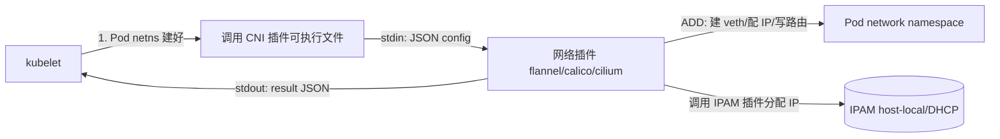
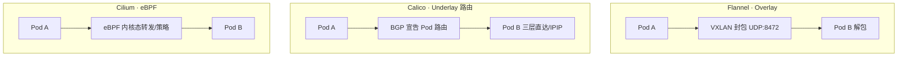

# CNI 与 K8s 网络插件

CNI 规范 · Flannel / Calico / Cilium 三大流派 · Overlay vs Underlay · 多网卡

## 场景问题

K8s 里每个 Pod 都要有一个 IP，且要满足 K8s 的网络模型铁律：**所有 Pod 无需 NAT 即可互通**、**Pod 看到的自己的 IP 与别人看到它的 IP 一致**。可是 kubelet 自己不管网络——它创建完 Pod 的 network namespace 后，就把"给这个 netns 配网卡、分 IP、通路由"这件事**外包**出去。

问题来了：不同环境网络差异巨大——公有云 VPC、裸金属 BGP、跨可用区、Overlay 隧道……不可能有一个内置实现通吃。于是 K8s 定义了 **CNI（Container Network Interface）规范**：只约定"kubelet 怎么调你、传什么参数、你返回什么"，具体怎么组网由插件自由实现。

对游戏战斗集群还有额外诉求：**低延迟、一机一 Pod（独占机器减少干扰）、有时需要多网卡**（业务网 + 管理网分离）。这直接影响 CNI 选型。



## 实现方案

### CNI 规范：ADD / DEL / 可执行 + JSON

CNI 插件就是一个**可执行文件**，kubelet 通过环境变量传操作类型（`CNI_COMMAND=ADD|DEL|CHECK`）、netns 路径、容器 ID，通过 **stdin 传 JSON 配置**，插件通过 **stdout 返回 JSON 结果**。IPAM（IP 地址管理）是一个**子职责**，通常委托给独立的 IPAM 插件。

```json
// kubelet 通过 stdin 传给 CNI 插件的配置（ADD 时）
{
  "cniVersion": "1.0.0",
  "name": "mynet",
  "type": "bridge",              // 主插件类型
  "bridge": "cni0",
  "isGateway": true,
  "ipam": {                       // IPAM 子职责：谁来分配 IP
    "type": "host-local",
    "subnet": "10.244.1.0/24",
    "routes": [{ "dst": "0.0.0.0/0" }]
  }
}
```

```json
// 插件 ADD 成功后通过 stdout 返回的结果
{
  "cniVersion": "1.0.0",
  "interfaces": [{ "name": "eth0", "sandbox": "/var/run/netns/cni-xxxx" }],
  "ips": [{
    "address": "10.244.1.7/24",
    "gateway": "10.244.1.1",
    "interface": 0
  }]
}
```

`DEL` 时同样传 netns 与容器 ID，插件负责**回收 IP、删 veth、清路由**（幂等，Pod 已删也要能安全返回）。

### 三大流派原理对比



| 插件 | 数据面原理 | 类型 | 特点 |
|---|---|---|---|
| **Flannel** | VXLAN 把二层帧封进 UDP 隧道，跨节点 overlay | Overlay | 简单通用、任意底层网络能跑；但**封包开销 + MTU 减少 50 字节** |
| **Calico** | 每节点跑 BGP，把 Pod 网段路由**宣告**给对端，三层直达；跨子网用 IPIP 兜底 | Underlay(路由) | 无封包、性能好、支持 NetworkPolicy；依赖底层可跑 BGP |
| **Cilium** | **eBPF** 在内核态挂载点直接转发与执行 L3-L7 策略，可替代 kube-proxy | eBPF | 高性能、O(1) 策略、丰富可观测（见 [eBPF](/game-infra/ebpf.md)）；需较新内核 |

### 多插件链与多网卡

- **CNI chaining**：主插件（组网）+ 链式插件（如 `portmap` 做端口映射、`bandwidth` 限速、`tuning` 调 sysctl），按顺序执行。
- **Multus**：给一个 Pod 挂**多张网卡**——比如战斗服 `eth0` 走业务 overlay、`net1` 直连高性能 underlay/SR-IOV 做玩家流量。游戏"一机一 Pod + 业务/管理网分离"常用。

## 为什么这么做

- **为什么 K8s 把网络外包给 CNI**：网络环境千差万别，内置死一种实现会限制所有人。可执行 + JSON 的极简契约让插件生态百花齐放，谁都能实现。
- **为什么大规模/低延迟倾向 BGP/eBPF 而非 VXLAN**：VXLAN 每个包都要**封装外层 UDP/IP 头**，CPU 花在封解包上，且 MTU 变小易触发分片/性能悬崖。BGP 路由是**原生三层转发无封包**；eBPF 在内核态直接查 map 转发，两者都省掉 overlay 税，延迟与吞吐更好。游戏战斗流量对延迟敏感，优先它们。

::: tip 一机一 Pod 的诉求
游戏战斗服常要**独占物理机**（避免邻居 Pod 抢 CPU/网络导致帧抖动），此时 overlay 的多租户隔离价值下降，而**低延迟直连**价值上升，进一步推向 Calico BGP / Cilium eBPF，甚至 hostNetwork。
:::

## 为什么别的选择不行

::: warning 各流派的不适用场景
| 想用… | 但是… |
|---|---|
| **Flannel VXLAN** 通吃 | 封包开销 + MTU 缩水，大规模高吞吐/低延迟战斗集群性能不划算；早期无 NetworkPolicy |
| **Calico BGP** 到处跑 | 依赖底层网络允许 BGP/路由宣告；公有云 VPC 常禁自定义路由，被迫回退 IPIP（又变相 overlay） |
| **纯 hostNetwork** 图省事 | Pod 直接用宿主 IP，端口冲突、隔离全无、可移植性差，只适合极特殊独占场景 |
| **不用 IPAM 手工分 IP** | 规模一大必冲突、泄漏，无法回收；IPAM 是 CNI 明确的子职责，交给它 |
:::

## 沉淀结论

::: tip 结论
- **CNI = 极简契约**：可执行文件 + `ADD/DEL/CHECK` + stdin/stdout JSON，IPAM 是其子职责。kubelet 只管调用，组网自由实现。
- **三流派**：Flannel(VXLAN overlay，简单但有封包税) / Calico(BGP underlay 路由，快但依赖底层) / Cilium([eBPF](/game-infra/ebpf.md) 内核态，高性能可替代 kube-proxy)。
- **Overlay vs Underlay** 本质是"通用性"换"性能"：能跑三层路由/eBPF 就别付 overlay 的封包与 MTU 税。
- 游戏低延迟 + 一机一 Pod + 多网卡（Multus）诉求，把选型推向 **BGP / eBPF**。
:::

**相关专题**：[eBPF 原理与落地](/game-infra/ebpf.md) · [Istio 与 Cilium 服务网格](/game-infra/mesh-istio-cilium.md) · [K8s 网络](/game-infra/k8s-network.md)

## 内容来源

综合整理。参考方向：CNI 官方规范（containernetworking/cni SPEC，ADD/DEL/CHECK、IPAM 约定）、Flannel / Calico / Cilium 官方文档与数据面原理、VXLAN(RFC 7348) 与 BGP 路由基础、Multus / CNI chaining 文档、K8s 网络模型（Pod 无 NAT 互通）官方说明。
