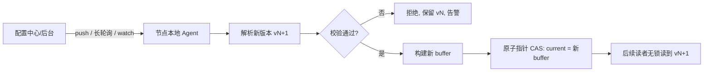

# 内存配置热刷新与更新机制

> 游戏的数值、活动、开关要**不停服更新**,而配置在热路径上被高频读取(每帧、每次请求)。热刷的工程核心是:**双 buffer + 原子指针切换**,让读端完全无锁、绝不读到半更新的撕裂状态。本篇给出明确代码示例,并讲清为什么不用加锁改。

::: tip 一句话结论
配置热刷靠"不可变对象 + 原子换指针"实现读端无锁、绝不撕裂的不停服更新。
:::

## 场景问题

线上一个活动要临时改掉爆率、开个限时开关、调个数值平衡,不能停服(停服 = 玩家流失 + 收入损失)。诉求:

- **读极高频**:战斗每帧、每次逻辑判定都要读配置(伤害系数、掉落表、开关),读 QPS 可达百万级。
- **写极低频**:配置一天可能才改几次,由运营/策划推。
- **不能撕裂**:一份配置往往是一组关联字段(如"活动 A 的开始时间 + 爆率 + 奖励表")。读端**绝不能读到"新爆率 + 旧奖励表"的半更新混合态**,否则逻辑错乱甚至发错奖励。
- **reload 要能校验回滚**:推来的新配置若格式非法/数值越界,必须拒绝并保留旧配置,不能让服务带着坏配置跑。

矛盾:**读多写少 + 不能撕裂 + 读端不能被写阻塞。**

## 实现方案

### 配置分发链路



版本号 + 灰度:配置带 `version`,支持按世界/分区**分批灰度**生效,先小流量验证再全量。

### 双 buffer + 原子指针切换(读无锁)

核心思想:**永不原地修改正在被读的配置**。写端构建一份**全新的**配置对象,准备好后用一次**原子指针写(CAS/store)**把"当前配置指针"切过去。读端只做一次原子读拿到指针,之后整段读操作都在这份**不可变的**快照上进行——不加锁、不会被写阻塞、不会读到半成品。

> **打个比方**:热刷配置就像**餐厅换菜单**。厨房把新菜单**整本印好**后,一次性把柜台那份**换成新的**(原子换指针),正在照着旧菜单点单的客人继续用旧的——绝不会出现"前半页新价、后半页旧价"的撕裂状态。**类比失效边界**:真实菜单可以物理收回旧的立即销毁,但内存里的旧配置**必须靠引用计数或 GC 归零才能释放**——热路径上先前 `Load` 到旧指针的读者,可能还捧着这份"过时快照"跑几毫秒。所以热刷从来不是**瞬时全局生效**,业务侧要接受"短暂的新旧并存":不要在 `Reload` 返回的下一行就断言"所有节点、所有 goroutine 都已经看到新值"。

#### Go 实现(`atomic.Pointer`)

```go
type Config struct {   // 不可变: 构建后只读, 从不原地改字段
    Version   int64
    DropRate  float64
    Rewards   map[int]int
    Switches  map[string]bool
}

type ConfigHolder struct {
    cur atomic.Pointer[Config]   // 原子指针, 指向"当前生效"的不可变配置
}

// —— 读端: 完全无锁, 热路径调用 ——
func (h *ConfigHolder) Get() *Config {
    return h.cur.Load()          // 一次原子读, 拿到一份自洽快照
}

// —— 写端: 低频, 由 reload 触发 ——
func (h *ConfigHolder) Reload(raw []byte) error {
    next, err := parseAndValidate(raw)   // 校验: 格式/数值范围/引用完整性
    if err != nil {
        return fmt.Errorf("reject reload: %w", err)  // 校验失败 -> 保留旧配置, 回滚
    }
    h.cur.Store(next)            // 原子切换! 之前 Load 到旧指针的读者仍安全读旧快照
    return nil                   // 旧 Config 无人引用后被 GC 回收
}
```

读端 `Get()` 拿到的是某一时刻的完整快照:即使切换发生在读的中途,已经 `Load` 到旧指针的读者继续读旧的那份完整配置,新读者读新的完整配置——**任一读者看到的都是自洽的一份,永不撕裂**。

#### C++ 实现(`shared_ptr` + 原子操作 / RCU 思想)

```cpp
struct Config {                 // 不可变快照
    int64_t version;
    double drop_rate;
    std::unordered_map<int,int> rewards;
};

class ConfigHolder {
    std::atomic<std::shared_ptr<Config>> cur_;   // C++20: 原子 shared_ptr
public:
    // 读端: 无锁, 引用计数保证读期间对象不被释放
    std::shared_ptr<const Config> Get() const {
        return cur_.load(std::memory_order_acquire);
    }
    // 写端: 构建新对象, 原子替换指针
    bool Reload(const std::string& raw) {
        auto next = ParseAndValidate(raw);        // 失败返回 nullptr
        if (!next) return false;                  // 校验失败, 保留旧配置
        cur_.store(next, std::memory_order_release);
        return true;                              // 旧对象引用归零后自动析构
    }
};
```

`shared_ptr` 的引用计数确保:即使写端已切换指针,仍持有旧快照的读者在用完前对象不会被销毁(RCU / grace period 的效果由引用计数天然提供)。

::: tip
关键在于 **Config 对象不可变(immutable)**:构建完成后绝不原地改字段。所有"更新"都是"造一个新对象 + 原子换指针"。这样读端无需任何同步原语,只要一次原子读。
:::

## 为什么这么做

- **为什么双 buffer 原子切换而不是加锁原地改**:读多写少的场景下,若给配置加读写锁,百万级读 QPS 每次都要抢读锁,写时还要阻塞所有读——读端延迟抖动、吞吐塌陷。双 buffer 让读端**零同步开销**(一次原子 load),写端**不阻塞任何读者**(只换指针)。
- **为什么必须不可变 + 换指针**:直接原地改字段会产生**半更新撕裂**——读端可能读到"改了一半"的配置(新字段 A + 旧字段 B),逻辑错乱。整体换指针保证读到的永远是一份**完整自洽的快照**。
- **为什么 reload 要先校验**:热刷是线上高危操作,坏配置一旦生效会污染所有读端。先校验(格式/数值范围/引用完整性)、失败即拒绝并保留旧配置,是热刷的安全阀。
- **为什么带版本 + 灰度**:多节点/多进程不可能瞬时同时切换,带 version 可观测哪些节点已生效;按世界/分区分批灰度,把坏配置的爆炸半径限制在小范围。

## 为什么别的选择不行

- **读写锁(RWMutex)原地改**:写时阻塞全部读,读时互斥写,热路径百万读被锁拖垮;且原地改仍有撕裂窗口。
- **每次读时加互斥锁拷贝一份**:读端每次都上锁 + 深拷贝,开销巨大,违背"读无锁"目标。
- **直接原地逐字段赋值(无锁也无双 buffer)**:读端会读到字段间不一致的中间态(撕裂),这是最典型的 bug 来源。
- **重启进程加载新配置**:等于停服,违背"不停服更新"的初衷,也丢掉内存态(见 `stateful-recovery`)。
- **不校验直接生效**:坏配置(如爆率填成 100 或负数、奖励表缺项)瞬间污染全服,可能引发发错奖励等事故。

::: warning
双 buffer 只解决"单对象自洽切换"。若一次热刷涉及**多个独立 Holder**(配置 A 和配置 B 有关联约束),分别切换会有中间态不一致——此时应把关联配置**打包进同一个不可变对象**一起切换,而不是切两次。
:::

::: danger
**热刷 ≠ 代码热更。** 配置热刷只换数据(数值/开关/表),逻辑代码不变,风险可控;代码热更(替换函数/动态库/脚本)会改变行为,涉及 ABI/状态兼容、正在执行的旧逻辑如何收尾等,风险高得多。二者要严格区分,别把代码逻辑塞进"配置"里绕过发布流程。
:::

## 沉淀结论

- 热刷诉求本质是**读多写少 + 不撕裂 + 读不被写阻塞**。
- 答案是 **双 buffer + 原子指针切换 + 配置对象不可变**:读端一次原子 load 拿自洽快照,零同步开销;写端造新对象 + 原子换指针,不阻塞读。
- reload 必须 **先校验、失败回滚(保留旧配置)**;带 **version + 按世界/分区灰度**,控爆炸半径。
- 多关联配置要**打包进同一对象**一起切,避免多次切换的中间态不一致。
- 严格区分**配置热刷(换数据)与代码热更(换逻辑)**。

### 记忆口诀

**读端**:一次原子 load / 拿自洽快照 / 零同步开销
**写端**:造新对象 / 原子换指针 / 不阻塞读
**安全阀**:先校验 / 失败回滚 / version 灰度
**铁律**:对象不可变 / 关联配置打包切 / 热刷≠热更

## 内容来源

综合整理。参考方向:RCU(Read-Copy-Update)与无锁读的内核/并发编程资料、Go `sync/atomic`(`atomic.Pointer`)与 C++ `std::atomic<std::shared_ptr>` 文档、配置中心(如 Nacos/Apollo/etcd watch)推送与长轮询机制,以及游戏后台数值/活动不停服更新的通用工程实践。

## 自测:合上资料能说清楚吗?

配置读 QPS 百万级、写一天几次,为什么不能给配置加读写锁?

<details><summary>参考答案</summary>

读写锁下每次读都要**抢读锁**,百万级读端争抢导致延迟抖动、吞吐塌陷;写时还要**阻塞全部读**。双 buffer 让读端只做**一次原子 load**、零同步开销,写端**只换指针不阻塞任何读者**。

</details>

什么是"配置撕裂"?为什么"对象不可变 + 换指针"能杜绝它?

<details><summary>参考答案</summary>

撕裂 = 读端读到"改了一半"的配置,如**新爆率 + 旧奖励表**,导致逻辑错乱。原地逐字段改会有中间态;而**不可变对象**构建完再**整体原子换指针**,任一读者拿到的都是一份**完整自洽快照**,永不撕裂。

</details>

写端已经 Store 了新指针,那些还持有旧指针的读者会不会读到被释放的内存?

<details><summary>参考答案</summary>

不会。Go 靠 **GC**:旧 Config 无人引用后才回收。C++ 靠 **shared_ptr 引用计数**:仍持有旧快照的读者用完前对象不析构(等价 RCU 的 **grace period**)。读者始终安全读旧那份完整快照。

</details>

对比"读写锁原地改" vs "双 buffer 原子切换",各自的撕裂风险与读端开销?

<details><summary>参考答案</summary>

**读写锁原地改**:读端每次抢锁(高开销),且原地改仍有**撕裂窗口**;写阻塞全读。**双 buffer**:读端一次原子 load(**零同步**),整体换指针**无撕裂**、写不阻塞读。读多写少场景后者完胜。

</details>

一次热刷要同时改配置 A 和有关联约束的配置 B,分别放两个 Holder 各自切换有什么问题?怎么办?

<details><summary>参考答案</summary>

分别切换会出现**中间态不一致**:A 已切新、B 还是旧,违反关联约束。应把**关联配置打包进同一个不可变对象**,一次原子切换保证同时生效。此外 reload 前要**先校验**,失败保留旧配置。

</details>

