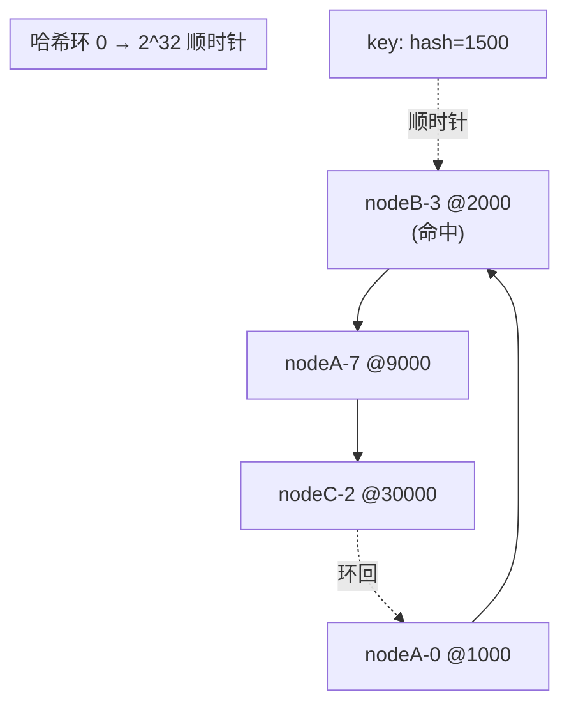
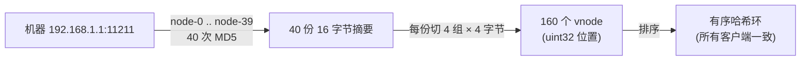
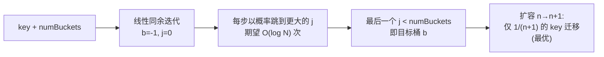

# 一致性哈希四算法实现（Ring Hash / Ketama / Maglev / Jump Hash）

> 一致性哈希不是一个算法，而是一族解法。Ring Hash 用哈希环 + 虚拟节点换来"任意加减节点"的灵活；Ketama 把 Ring Hash 固化成一套标准配方（MD5 × 40 × 4 = 160 个 vnode），让不同语言/客户端算出完全相同的环；Maglev 用固定查找表换来 O(1) 查表 + 近乎均匀；Jump Hash 用纯算术换来零内存 + 最优迁移，代价是只能尾部增删桶。选型的本质是在"查找成本 / 内存 / 均衡度 / 增删自由度 / 重映射比例"五个维度上做权衡。

::: tip 一句话结论
一致性哈希按"查找成本/内存/均衡/增删自由/迁移比例"五维取舍：热路径选 Maglev、尾部伸缩选 Jump、通用任意增删选 Ring、多客户端要算出同一个环选 Ketama。
:::

## 场景问题

游戏后台里"把 key 映射到一批后端节点"是反复出现的需求：

- **玩家路由**：`playerId` 要稳定落到某个战斗服/DB 分片，扩缩容时**尽量少的玩家被重新分配**（重映射比例要接近理论下界 1/N）。
- **LB 数据面选后端**：接入层每个包都要选一个 upstream，查表在**数据面热路径**上，O(log N) 的二分对每包都做会累积成尾延迟；且后端集合抖动时不希望大面积重连。
- **多客户端共享缓存**：一组 memcached 被 PHP / Go / C++ 等多个客户端访问，各客户端必须**各自独立算出完全一致的 key→节点映射**，否则同一个 key 在不同客户端落到不同机器，缓存命中率崩塌、数据被重复缓存。
- **内存受限**：自研网格里每个节点都要在本地维护"全量节点→分片"的映射，节点数上万时，vnode 表可能吃掉几十 MB。

最朴素的 `hash(key) % N` 有致命缺陷：N 变化时几乎所有 key 都要重映射（`% N` → `% N+1` 全乱）。一致性哈希就是为把"节点数变化时的重映射比例"压到 O(1/N) 而生。但四种主流实现各自的取舍差别很大，下面逐一给出**可运行代码**。

> **打个比方（为什么要 Ketama）**：多客户端共享一组缓存，就像 PHP、Go、C++ 三家快递公司送同一片小区的包裹。要是每家各画各的"分区地图"，同一个包裹（key）在不同公司手里会被派到不同网点（节点）——同一份数据被重复存三遍，缓存命中率当场崩盘。**Ketama** 干的事就是发一张"国标分区地图"：把生成规则钉死成一套配方（`MD5 × 40 × 4 = 160` 个 vnode），逼所有客户端照着同一张图算，于是谁算都得到**一模一样的环**。**类比失效边界**：这份跨语言一致性全靠"每家都用**完全相同**的哈希函数和 vnode 生成规则"撑着——只要有一家偷偷把 MD5 换成 xxhash、或把 vnode 数量配得不一样，画出的地图立刻对不上，一致性瞬间瓦解。所以 Ketama 的价值不在"更均匀"，而在"可被逐字复刻"。

## 实现方案

### 算法一：Ring Hash（哈希环 + 虚拟节点）

把节点和 key 都哈希到一个环形空间（`[0, 2^32)`）上，key 顺时针找到第一个节点。为解决"节点少时分布不均"，每个物理节点在环上放 `replicas` 个**虚拟节点（vnode）**，`replicas` 越大越均衡。查找是在有序 vnode 数组上做二分，O(log(N·V))。删节点时把它的所有 vnode 一起摘掉，剩下的天然有序、无需重排。

```go
package ringhash

import (
	"crypto/md5"
	"encoding/binary"
	"sort"
	"strconv"
)

// ConsistentHash 一致性哈希主结构体
type ConsistentHash struct {
	replicas int               // 每台真实机器派生出的虚拟节点（分身）数量
	ring     []uint32          // 哈希环：所有分身的数字位置，从小到大排序
	hashMap  map[uint32]string // 分身数字 → 真实机器名
}

func New(replicas int) *ConsistentHash {
	return &ConsistentHash{
		replicas: replicas,
		hashMap:  make(map[uint32]string),
	}
}

// hashText 把任意文字算成一个 0~42 亿之间的固定数字
func (ch *ConsistentHash) hashText(text string) uint32 {
	sum := md5.Sum([]byte(text))
	return binary.BigEndian.Uint32(sum[:4])
}

// AddNode 往环里添加一台机器（扩容）
func (ch *ConsistentHash) AddNode(node string) {
	for i := 0; i < ch.replicas; i++ {
		// 分身命名："机器A-0", "机器A-1" ...
		hash := ch.hashText(node + "-" + strconv.Itoa(i))
		ch.ring = append(ch.ring, hash)
		ch.hashMap[hash] = node
	}
	// 环上的数字必须始终从小到大有序，像钟表刻度
	sort.Slice(ch.ring, func(i, j int) bool { return ch.ring[i] < ch.ring[j] })
}

// GetNode 替数据顺时针找机器
func (ch *ConsistentHash) GetNode(key string) string {
	if len(ch.ring) == 0 {
		return ""
	}
	hash := ch.hashText(key)
	// 二分找第一个 >= hash 的分身
	idx := sort.Search(len(ch.ring), func(i int) bool { return ch.ring[i] >= hash })
	if idx == len(ch.ring) {
		idx = 0 // 走完一圈没找到就环回起点
	}
	return ch.hashMap[ch.ring[idx]]
}

// RemoveNode 从环里移除一台机器（缩容/宕机）
func (ch *ConsistentHash) RemoveNode(node string) {
	// 1. 先把这台机器所有分身从映射表删掉
	for i := 0; i < ch.replicas; i++ {
		delete(ch.hashMap, ch.hashText(node+"-"+strconv.Itoa(i)))
	}
	// 2. 再把已经查不到归属的分身从环里剔除；原本有序，剔除后依然有序，无需重排
	kept := ch.ring[:0]
	for _, hash := range ch.ring {
		if _, ok := ch.hashMap[hash]; ok {
			kept = append(kept, hash)
		}
	}
	ch.ring = kept
}
```



::: tip
`sort.Search` 是标准库二分，返回第一个满足条件的下标。vnode 数越多，key 在环上分布越接近均匀；实测 100 个/节点时负载方差已很小。加节点时只有"新 vnode 逆时针到前一个 vnode 之间"的 key 会迁移，平均约 1/N。
:::

### 算法二：Ketama（Ring Hash 的标准化配方）

Ketama 是 Ring Hash 的一套**标准化实现**（起源于 last.fm，memcached 生态广泛采用）。它把"怎么造环"固化成一套确定配方：对每台机器取 `node-0 .. node-39` 共 **40** 个字符串各算一次 MD5，每个 16 字节摘要按 4 字节一组切成 **4** 个 `uint32`，于是一台机器稳定产出 40×4 = **160** 个 vnode。配方固定带来的关键收益：**不同语言、不同客户端只要遵循同一 recipe，就会算出完全相同的环**，对同一个 key 得到完全一致的节点——这正是多客户端共享一组 memcached 时缓存命中率的前提。查找和 Ring Hash 一样是二分顺时针。

```go
package ketama

import (
	"crypto/md5"
	"sort"
	"strconv"
)

// KetamaNode 哈希环上的一个虚拟节点刻度
type KetamaNode struct {
	HashVal  uint32 // 在环上的数字位置
	RealNode string // 对应的真实机器名
}

type KetamaRing struct {
	ring []KetamaNode // 严格有序的虚拟节点环
}

func New(nodes []string) *KetamaRing {
	kr := &KetamaRing{}
	for _, node := range nodes {
		kr.AddNode(node)
	}
	return kr
}

// AddNode 严格按 Ketama 标准配方添加机器：40 轮 × 每轮 4 个分身 = 160 个 vnode
func (kr *KetamaRing) AddNode(node string) {
	for i := 0; i < 40; i++ {
		// 固定命名规则：机器名-轮次
		sum := md5.Sum([]byte(node + "-" + strconv.Itoa(i)))
		// 一份 16 字节 MD5 切成 4 组，每组 4 字节小端拼成一个 uint32 → 一次产 4 个分身
		for k := 0; k < 4; k++ {
			hashVal := uint32(sum[k*4+3])<<24 |
				uint32(sum[k*4+2])<<16 |
				uint32(sum[k*4+1])<<8 |
				uint32(sum[k*4])
			kr.ring = append(kr.ring, KetamaNode{HashVal: hashVal, RealNode: node})
		}
	}
	// 严格按数字从小到大排序
	sort.Slice(kr.ring, func(i, j int) bool { return kr.ring[i].HashVal < kr.ring[j].HashVal })
}

// GetNode 数据同样用 MD5 定位，二分顺时针撞机器
func (kr *KetamaRing) GetNode(key string) string {
	if len(kr.ring) == 0 {
		return ""
	}
	sum := md5.Sum([]byte(key))
	hashVal := uint32(sum[3])<<24 | uint32(sum[2])<<16 | uint32(sum[1])<<8 | uint32(sum[0])
	idx := sort.Search(len(kr.ring), func(i int) bool { return kr.ring[i].HashVal >= hashVal })
	if idx == len(kr.ring) {
		idx = 0 // 环回起点
	}
	return kr.ring[idx].RealNode
}
```



::: tip
Ketama 的价值不在"更快"，而在**确定性**：命名规则（`node-i`）、哈希（MD5）、切分（4 字节一组）、每节点份数（160）全部写死，任何遵循此 recipe 的客户端都会重建出**逐字节相同的环**。160 是经验值，兼顾均衡度与内存。要换哈希函数或 vnode 数就不再是 Ketama，跨客户端一致性也随之失去。
:::

### 算法三：Maglev（固定查找表 + 偏好序列填充）

Google Maglev（NSDI 2016）为**软件 LB 数据面**设计：预先构建一张大小为素数 `m` 的查找表 `table[m] → backend`，查表就是 `table[hash(key) % m]`，**O(1)**。构建时每个后端生成一个"偏好排列（permutation）"，轮流往表的空槽里填，保证每个后端占到的槽数近乎均等（`m/N`），且后端增删时**表扰动最小**。表大小取素数（测试用 7，Google 生产用 65537）以减少碰撞聚集。

```go
package maglev

import (
	"crypto/md5"
	"encoding/binary"
)

type Maglev struct {
	nodes       []string // 真实机器列表
	m           int      // 查找表大小，必须是质数（测试用 7，Google 生产用 65537）
	lookupTable []int    // 核心查找表：table[i] = 机器在 nodes 里的下标
}

func New(nodes []string, m int) *Maglev {
	mag := &Maglev{nodes: nodes, m: m, lookupTable: make([]int, m)}
	mag.populate()
	return mag
}

// hashText 把文字切成两个不同的 64 位大整数，决定它的"抓阄偏好"
func (mag *Maglev) hashText(text string) (uint64, uint64) {
	sum := md5.Sum([]byte(text))
	return binary.BigEndian.Uint64(sum[:8]), binary.BigEndian.Uint64(sum[8:])
}

// populate 核心：让每台机器轮流"抓阄"，填满整张查找表
func (mag *Maglev) populate() {
	n := len(mag.nodes)
	if n == 0 {
		return
	}
	// 1. 全部座位先置空（-1）
	for i := range mag.lookupTable {
		mag.lookupTable[i] = -1
	}
	// 2. 为每台机器算出它的"选座偏好序列"（长度 m 的一个排列）
	permutation := make([][]int, n)
	for i, node := range mag.nodes {
		h1, h2 := mag.hashText(node)
		offset := int(h1 % uint64(mag.m))
		skip := int(h2%uint64(mag.m-1)) + 1 // ∈ [1, m-1]，与素数 m 互素
		permutation[i] = make([]int, mag.m)
		for j := 0; j < mag.m; j++ {
			permutation[i][j] = (offset + j*skip) % mag.m
		}
	}
	// 3. 轮流抓阄：机器 0、1、2… 各占一个空座，直到 m 个座位全满
	next := make([]int, n) // 每台机器看到自己偏好序列的第几个了
	count := 0
	for {
		for i := 0; i < n; i++ {
			// 顺着偏好序列找它此刻最想要且还空着的座
			bucket := permutation[i][next[i]]
			for mag.lookupTable[bucket] != -1 {
				next[i]++
				bucket = permutation[i][next[i]]
			}
			mag.lookupTable[bucket] = i
			next[i]++
			count++
			if count == mag.m {
				return
			}
		}
	}
}

// Lookup 一次取模 + 数组访问，O(1)
func (mag *Maglev) Lookup(key string) string {
	if len(mag.nodes) == 0 {
		return ""
	}
	h1, _ := mag.hashText(key)
	return mag.nodes[mag.lookupTable[h1%uint64(mag.m)]]
}
```


::: warning
Maglev 的均衡是"近乎均匀"而非完美：每个后端槽数在 `m/N` 上下浮动。它优化的是**最小扰动**——后端集合小变化时，绝大多数 key 的映射不变（对 LB 意味着大多数连接不被打断），但代价是单个后端可能承担略多/略少的流量，且**不是 1/N 的最优迁移**。上面为直观起见预生成了完整 `permutation[i][j]`（内存 O(N·m)）；生产实现可像论文那样在填表时按 `(offset + j·skip) mod m` **即时计算**，省去这块内存。
:::

### 算法四：Jump Consistent Hash（零内存纯算术）

Lamping & Veach（Google, 2014）的 Jump Hash：给定 `key` 和桶数 `numBuckets`，用一段确定性伪随机跳跃算法直接算出落在哪个桶，**不需要任何表、零内存**，时间 O(log N)。它有**最优的 1/N 迁移**（桶数从 n→n+1 时，恰好 1/(n+1) 的 key 迁移到新桶，其余不动），且**完美均衡**。代价是桶必须是 `0..numBuckets-1` 连续编号——**只能在尾部增删桶，无法删中间的桶**。

```go
package jumphash

import (
	"crypto/md5"
	"encoding/binary"
)

// HashKey 把任意文字变成一个 64 位大整数，喂给 Jump Hash
func HashKey(text string) uint64 {
	sum := md5.Sum([]byte(text))
	return binary.BigEndian.Uint64(sum[:8])
}

// JumpHash 跳跃一致性哈希：给定 key 和桶数，纯算术直接算出桶号 [0, numBuckets)
// 论文核心逻辑仅几行，零内存、无任何表
func JumpHash(key uint64, numBuckets int) int {
	if numBuckets <= 1 {
		return 0 // 只有 1 个或没有桶，只能落到第 0 个
	}
	var b, j int64 = -1, 0 // b=上一次成功跳到的桶；j=尝试跳向的新桶
	for j < int64(numBuckets) {
		b = j
		// 线性同余，用 key 自身推出下一个伪随机数
		key = key*2862933555777941757 + 1
		// 桶越多（j 越大）跳过去的概率越小（严格符合 1/j），期望 O(log N) 次
		j = int64(float64(b+1) * (float64(int64(1)<<31) / float64((key>>33)+1)))
	}
	// j 越界说明这次没跳过去，返回最后一次成功跳到的桶 b
	return int(b)
}
```



::: tip
Jump Hash 的数学保证：桶数从 `n` 增到 `n+1` 时，每个 key 以恰好 `1/(n+1)` 的概率跳到新桶 `n`，否则保持不变。这是理论下界，任何一致性哈希都无法做得更好。适合"分片数只在尾部伸缩"的存储/计算分片。
:::

## 为什么这么做

四种算法的取舍可以一张表说清（Ketama 是 Ring Hash 的标准化特例，取舍相近，差别在"跨客户端一致"）：

| 维度 | Ring Hash | Ketama | Maglev | Jump Hash |
|---|---|---|---|---|
| 查找成本 | O(log(N·V)) 二分 | O(log(N·160)) 二分 | **O(1)** 查表 | O(log N) 算术 |
| 内存 | 高（N·V vnode） | 高（N·160 vnode） | 中（固定表 m，如 65537） | **零** |
| 均衡度 | 好（V 大方差小） | 好（固定 160/节点） | 近乎均匀（非最优） | **完美均衡** |
| 任意增删节点 | **支持**（含删中间节点） | **支持**（含删中间节点） | 支持（重建表） | 仅尾部增删桶 |
| 跨客户端一致 | 取决于实现 | **标准配方，同 recipe 同环** | 取决于实现 | 算法确定 |
| 重映射比例 | ~1/N | ~1/N | 最小扰动（非 1/N 最优） | **最优 1/N** |
| 典型场景 | 通用带 vnode 的环 | 多客户端共享 memcached | LB 数据面热路径 | 尾部伸缩的分片 |

- **LB 数据面选 Maglev**：每个包都要查表，O(1) 是刚需；后端 pool 抖动时最小扰动意味着最少的连接被打断。Google/Cloudflare 的软件 LB 都走这条路。
- **尾部分片选 Jump Hash**：分片存储扩容通常是"再加一台，桶数 +1"，Jump Hash 零内存 + 最优迁移，完美契合；每个节点本地算一下就行，无需同步 vnode 表。
- **多客户端共享一组缓存选 Ketama**：多个不同语言的客户端要对同一个 key 命中同一台 memcached，**标准配方保证各自算出逐字节相同的环**，缺了这份确定性缓存命中率就崩。
- **通用任意增删选 Ring Hash**：要随时上下线任意节点、要自由调 vnode 数或换哈希函数——Ring Hash 最灵活。Redis Cluster、Cassandra、Dubbo 负载均衡多用它。

## 为什么别的选择不行

- **朴素取模 `hash(key)%N`**：N 变化时几乎全量重映射，缓存全失效、玩家全漂移，绝对不能用于会变化的节点集合。
- **用 Ring Hash / Ketama 做 LB 数据面**：每包一次 O(log(N·V)) 二分，在几百万 QPS 的数据面上累积成可观的 CPU 和尾延迟；且 vnode 表在节点上万时吃内存。Maglev 的 O(1) 查表更合适。
- **用 Maglev 做频繁任意增删**：删中间某个后端要**重建整张表**（虽然扰动小），表大小固定，桶数远超 m 时均衡度下降。
- **用 Jump Hash 做删中间节点**：它只认连续桶号，删中间桶做不到（后面的桶号会全部平移，等于重映射），不适合任意上下线。
- **多客户端却各写各的 Ring Hash**：不同客户端若用了不同哈希函数、不同 vnode 数或不同排序，就会造出**不一样的环**，同一个 key 落到不同节点，缓存命中率崩塌、数据被重复缓存——这正是 Ketama 用固定配方要消除的坑。
- **一致性哈希统一用一种**：没有银弹。上面四行"典型场景"就是分界线——按热路径成本、增删模式、是否要跨客户端一致来选。

## 沉淀结论

- 一致性哈希的目标：**节点变化时把重映射压到 O(1/N)**，取代朴素取模的全量重映射。
- **Ring Hash**：哈希环 + vnode，O(log N) 查找、内存高、支持任意加减节点，通用之选。
- **Ketama**：Ring Hash 的标准化配方（MD5 × 40 × 4 = 160 vnode），取舍同 Ring，额外保证**跨客户端算出同一个环**，多客户端共享缓存首选。
- **Maglev**：固定素数表 + 偏好序列填充，O(1) 查表、近乎均匀、最小扰动，**LB 数据面**首选。
- **Jump Hash**：零内存纯算术，O(log N)、完美均衡、最优 1/N 迁移，但**只能尾部增删桶**，尾部伸缩分片首选。
- 选型口诀：**数据面热路径 → Maglev；尾部伸缩分片 → Jump；多客户端同环 → Ketama；通用任意增删 → Ring。**

### 记忆口诀

**Ring Hash**：哈希环 / vnode / 二分 O(log) / 内存高 / 任意增删
**Ketama**：Ring 的标准配方 / MD5×40×4=160 vnode / 跨客户端同环 / memcached 生态
**Maglev**：素数表 / 偏好排列填槽 / O(1) 查表 / 近乎均匀 / 最小扰动
**Jump Hash**：零内存 / 纯算术 / 完美均衡 / 最优 1/N / 仅尾部增删
**五维权衡**：查找成本 / 内存 / 均衡度 / 增删自由 / 重映射比例

## 内容来源

综合整理。参考论文与资料：Maglev: A Fast and Reliable Software Network Load Balancer（NSDI 2016）、A Fast, Minimal Memory, Consistent Hash Algorithm（Lamping & Veach, Google 2014，即 Jump Consistent Hash）、Ketama consistent hashing（last.fm）、Karger et al. Consistent Hashing and Random Trees（STOC 1997），以及 Redis Cluster / Cassandra / Envoy 的一致性哈希 LB 实现文档。

## 自测：合上资料能说清楚吗？

朴素 `hash(key) % N` 有什么致命缺陷？一致性哈希把重映射比例压到多少？

<details><summary>参考答案</summary>

`% N` 在 N 变化时几乎**全量重映射**（缓存全失效、玩家全漂移）。一致性哈希把节点变化时的重映射压到 **O(1/N)**，只有落在受影响区间的 key 才迁移。

</details>

Ring Hash 里"虚拟节点（vnode）"是用来解决什么问题的？V 越大有什么影响？

<details><summary>参考答案</summary>

解决**节点少时环上分布不均**。每个物理节点放 V 个 vnode，V 越大负载**方差越小、越均衡**（Ketama 固定 160 个/节点），代价是 vnode 数组内存和二分深度上升。

</details>

Maglev 为什么适合 LB 数据面，而 Ring Hash 不适合？请对比这两个方案。

<details><summary>参考答案</summary>

数据面**每包都要查表**：Maglev 是 `table[hash%m]` 的 **O(1)** 查表，Ring Hash 是 **O(log(N·V))** 二分，百万 QPS 下累积成 CPU 与尾延迟。且 Maglev 后端抖动时**最小扰动**，连接少被打断；Ring 的 vnode 表在节点上万时更吃内存。

</details>

Jump Hash 的迁移为什么被称为"最优"？它的硬限制是什么？

<details><summary>参考答案</summary>

桶数 `n→n+1` 时，每个 key 以恰好 **1/(n+1)** 概率跳到新桶，其余不动，正是**理论下界**。硬限制：桶必须是 `0..n-1` **连续编号**，只能**尾部增删桶**、删不了中间桶。

</details>

多个不同语言的客户端要共享同一组 memcached，为什么必须用 Ketama，而不能各自实现一个哈希环？

<details><summary>参考答案</summary>

Ketama 把命名规则、哈希函数（MD5）、切分方式、每节点份数（160）全部**写死成标准配方**，任何客户端都会重建出**逐字节相同的环**，对同一 key 命中同一节点。各自造环若用了不同哈希/vnode 数/排序，同一个 key 会落到不同节点，**缓存命中率崩塌、数据被重复缓存**。

</details>
