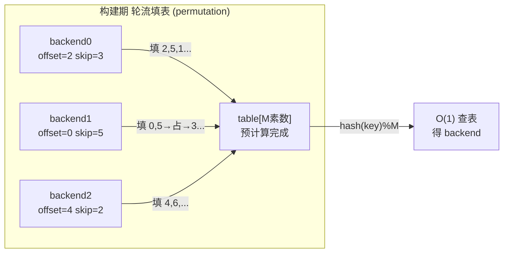
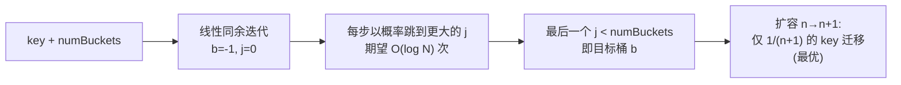

# 一致性哈希三算法实现（Ring Hash / Maglev / Jump Hash）

> 一致性哈希不是一个算法，而是一族解法。Ring Hash 用哈希环 + 虚拟节点换来"任意加减带权节点"的灵活；Maglev 用固定查找表换来 O(1) 查表 + 近乎均匀；Jump Hash 用纯算术换来零内存 + 最优迁移，代价是只能尾部增删桶。选型的本质是在"查找成本 / 内存 / 均衡度 / 增删自由度 / 重映射比例"五个维度上做权衡。

::: tip 一句话结论
一致性哈希按"查找成本/内存/均衡/增删自由/迁移比例"五维取舍：热路径选 Maglev、尾部伸缩选 Jump、带权任意增删选 Ring。
:::

## 场景问题

游戏后台里"把 key 映射到一批后端节点"是反复出现的需求：

- **玩家路由**：`playerId` 要稳定落到某个战斗服/DB 分片，扩缩容时**尽量少的玩家被重新分配**（重映射比例要接近理论下界 1/N）。
- **LB 数据面选后端**：接入层每个包都要选一个 upstream，查表在**数据面热路径**上，O(log N) 的二分对每包都做会累积成尾延迟；且后端集合抖动时不希望大面积重连。
- **异构带权**：机器配置不一，8 核机要比 4 核机分到两倍流量，映射必须支持**按权重分配**。
- **内存受限**：自研网格里每个节点都要在本地维护"全量节点→分片"的映射，节点数上万时，vnode 表可能吃掉几十 MB。

最朴素的 `hash(key) % N` 有致命缺陷：N 变化时几乎所有 key 都要重映射（`% N` → `% N+1` 全乱）。一致性哈希就是为把"节点数变化时的重映射比例"压到 O(1/N) 而生。但三种主流实现各自的取舍差别很大，下面逐一给出**可运行代码**。

## 实现方案

### 算法一：Ring Hash（哈希环 + 虚拟节点 + Ketama）

把节点和 key 都哈希到一个环形空间（`[0, 2^32)`）上，key 顺时针找到第一个节点。为解决"节点少时分布不均"，每个物理节点在环上放 `V` 个**虚拟节点（vnode）**，`V` 越大越均衡（Ketama 风格通常 100~160 个/节点）。查找是在有序 vnode 数组上做二分，O(log(N·V))。带权只需按权重分配 vnode 数量。

```go
package ringhash

import (
	"hash/crc32"
	"sort"
	"strconv"
)

type RingHash struct {
	vnodes   []uint32          // 有序的 vnode 哈希值
	hashToNode map[uint32]string // vnode 哈希 → 物理节点
	replicas int               // 每个权重单位对应的 vnode 数
}

func New(replicas int) *RingHash {
	return &RingHash{hashToNode: make(map[uint32]string), replicas: replicas}
}

// AddWeighted 加入一个权重为 weight 的节点，vnode 数 = replicas * weight
func (r *RingHash) AddWeighted(node string, weight int) {
	for i := 0; i < r.replicas*weight; i++ {
		h := crc32.ChecksumIEEE([]byte(node + "#" + strconv.Itoa(i)))
		r.vnodes = append(r.vnodes, h)
		r.hashToNode[h] = node
	}
	sort.Slice(r.vnodes, func(i, j int) bool { return r.vnodes[i] < r.vnodes[j] })
}

// Remove 支持删除任意节点（连它所有 vnode 一起删）
func (r *RingHash) Remove(node string) {
	kept := r.vnodes[:0]
	for _, h := range r.vnodes {
		if r.hashToNode[h] == node {
			delete(r.hashToNode, h)
			continue
		}
		kept = append(kept, h)
	}
	r.vnodes = kept
}

// Get 顺时针二分找第一个 >= hash(key) 的 vnode，环回到 0
func (r *RingHash) Get(key string) string {
	if len(r.vnodes) == 0 {
		return ""
	}
	h := crc32.ChecksumIEEE([]byte(key))
	idx := sort.Search(len(r.vnodes), func(i int) bool { return r.vnodes[i] >= h })
	if idx == len(r.vnodes) {
		idx = 0 // 环回
	}
	return r.hashToNode[r.vnodes[idx]]
}
```


::: tip
`sort.Search` 是标准库二分，返回第一个满足条件的下标。vnode 数越多，key 在环上分布越接近均匀；实测 100 个/节点时负载方差已很小。加节点时只有"新 vnode 逆时针到前一个 vnode 之间"的 key 会迁移，平均约 1/N。
:::

### 算法二：Maglev（固定查找表 + 偏好序列填充）

Google Maglev（NSDI 2016）为**软件 LB 数据面**设计：预先构建一张大小为素数 `M` 的查找表 `table[M] → backend`，查表就是 `table[hash(key) % M]`，**O(1)**。构建时每个后端生成一个"偏好排列（permutation）"，轮流往表的空槽里填，保证每个后端占到的槽数近乎均等（`M/N`），且后端增删时**表扰动最小**。表大小取素数（如 65537）以减少哈希碰撞聚集。

```go
package maglev

import "hash/fnv"

const M = 65537 // 素数表大小；M 越大越均匀，M >> N

type Maglev struct {
	table    []int    // table[i] = 后端下标
	backends []string
}

func hash1(s string) uint64 { h := fnv.New64a(); h.Write([]byte(s)); return h.Sum64() }
func hash2(s string) uint64 { h := fnv.New64(); h.Write([]byte(s)); return h.Sum64() }

func Build(backends []string) *Maglev {
	n := len(backends)
	// 每个后端的 (offset, skip) 决定它的偏好排列
	offset := make([]uint64, n)
	skip := make([]uint64, n)
	for i, b := range backends {
		offset[i] = hash1(b) % M
		skip[i] = hash2(b)%(M-1) + 1 // skip ∈ [1, M-1]，与 M 互素
	}
	next := make([]uint64, n) // 每个后端当前排列走到第几步
	table := make([]int, M)
	for i := range table {
		table[i] = -1
	}
	filled := 0
	for filled < M {
		for i := 0; i < n; i++ { // 轮流让每个后端填一个它偏好的空槽
			c := (offset[i] + next[i]*skip[i]) % M
			for table[c] != -1 { // 该槽被占则走排列的下一个
				next[i]++
				c = (offset[i] + next[i]*skip[i]) % M
			}
			table[c] = i
			next[i]++
			filled++
			if filled == M {
				break
			}
		}
	}
	return &Maglev{table: table, backends: backends}
}

// Lookup 就是一次取模 + 数组访问，O(1)
func (m *Maglev) Lookup(key string) string {
	return m.backends[m.table[hash1(key)%M]]
}
```



::: warning
Maglev 的均衡是"近乎均匀"而非完美：每个后端槽数在 `M/N` 上下浮动。它优化的是**最小扰动**——后端集合小变化时，绝大多数 key 的映射不变（对 LB 意味着大多数连接不被打断），但代价是单个后端可能承担略多/略少的流量，且**不是 1/N 的最优迁移**。
:::

### 算法三：Jump Consistent Hash（零内存纯算术）

Lamping & Veach（Google, 2014）的 Jump Hash：给定 `key` 和桶数 `numBuckets`，用一段确定性伪随机跳跃算法直接算出落在哪个桶，**不需要任何表、零内存**，时间 O(log N)。它有**最优的 1/N 迁移**（桶数从 n→n+1 时，恰好 1/(n+1) 的 key 迁移到新桶，其余不动），且**完美均衡**。代价是桶必须是 `0..numBuckets-1` 连续编号——**只能在尾部增删桶，无法删中间的桶，也不支持权重**。

```go
package jumphash

// JumpHash 返回 key 应落到的桶号 [0, numBuckets)
// 论文原文仅 5 行核心逻辑，无循环之外的内存分配
func JumpHash(key uint64, numBuckets int) int32 {
	var b, j int64 = -1, 0
	for j < int64(numBuckets) {
		b = j
		// 线性同余生成下一个伪随机数
		key = key*2862933555777941757 + 1
		// 计算下一次"跳跃"的目标桶：j 单调增，期望 O(log N) 次
		j = int64(float64(b+1) * (float64(int64(1)<<31) / float64((key>>33)+1)))
	}
	return int32(b)
}
```



::: tip
Jump Hash 的数学保证：桶数从 `n` 增到 `n+1` 时，每个 key 以恰好 `1/(n+1)` 的概率跳到新桶 `n`，否则保持不变。这是理论下界，任何一致性哈希都无法做得更好。适合"分片数只在尾部伸缩"的存储/计算分片。
:::

## 为什么这么做

三种算法的取舍可以一张表说清：

| 维度 | Ring Hash (Ketama) | Maglev | Jump Hash |
|---|---|---|---|
| 查找成本 | O(log(N·V)) 二分 | **O(1)** 查表 | O(log N) 算术 |
| 内存 | 高（vnode 数组，N·V 项） | 中（固定表 M，如 65537） | **零** |
| 均衡度 | 好（V 大时方差小） | 近乎均匀（非最优） | **完美均衡** |
| 任意增删节点 | **支持**（含删中间节点） | 支持（重建表） | 仅尾部增删桶 |
| 权重 | **原生支持**（按权分 vnode） | 支持（按权分排列） | **不支持** |
| 重映射比例 | ~1/N（略有抖动） | 最小扰动（非 1/N 最优） | **最优 1/N** |
| 典型场景 | 异构带权、频繁增删 | LB 数据面热路径 | 尾部伸缩的分片 |

- **LB 数据面选 Maglev**：每个包都要查表，O(1) 是刚需；后端 pool 抖动时最小扰动意味着最少的连接被打断。Google/Cloudflare 的软件 LB 都走这条路。
- **尾部分片选 Jump Hash**：分片存储扩容通常是"再加一台，桶数 +1"，Jump Hash 零内存 + 最优迁移，完美契合；每个节点本地算一下就行，无需同步 vnode 表。
- **异构带权、频繁增删选 Ring Hash**：机器配置不一、要随时上下线任意节点、要按权重分流量——只有 Ring Hash 三者都原生支持。Redis Cluster、Cassandra、Dubbo 负载均衡多用它。

## 为什么别的选择不行

- **朴素取模 `hash(key)%N`**：N 变化时几乎全量重映射，缓存全失效、玩家全漂移，绝对不能用于会变化的节点集合。
- **用 Ring Hash 做 LB 数据面**：每包一次 O(log(N·V)) 二分，在几百万 QPS 的数据面上累积成可观的 CPU 和尾延迟；且 vnode 表在节点上万时吃内存。Maglev 的 O(1) 查表更合适。
- **用 Maglev 做频繁任意增删**：删中间某个后端要**重建整张表**（虽然扰动小），加权也不如 Ring 直接；表大小固定，桶数远超 M 时均衡度下降。
- **用 Jump Hash 做异构/删中间节点**：它只认连续桶号，删中间桶做不到（后面的桶号会全部平移，等于重映射），也无法表达权重。带权异构场景直接出局。
- **一致性哈希统一用一种**：没有银弹。上面三行"典型场景"就是分界线——按热路径成本、增删模式、是否带权来选。

## 沉淀结论

- 一致性哈希的目标：**节点变化时把重映射压到 O(1/N)**，取代朴素取模的全量重映射。
- **Ring Hash**：哈希环 + vnode，O(log N) 查找、内存高、支持任意加减带权节点，通用之选。
- **Maglev**：固定素数表 + 偏好序列填充，O(1) 查表、近乎均匀、最小扰动，**LB 数据面**首选。
- **Jump Hash**：零内存纯算术，O(log N)、完美均衡、最优 1/N 迁移，但**只能尾部增删桶、不支持权重**，尾部伸缩分片首选。
- 选型口诀：**数据面热路径 → Maglev；尾部伸缩分片 → Jump；异构带权 / 任意增删 → Ring。**

### 记忆口诀

**Ring Hash**：哈希环 / vnode / 二分 O(log) / 内存高 / 带权任意增删
**Maglev**：素数表 / 偏好排列填槽 / O(1) 查表 / 近乎均匀 / 最小扰动
**Jump Hash**：零内存 / 纯算术 / 完美均衡 / 最优 1/N / 仅尾部增删
**五维权衡**：查找成本 / 内存 / 均衡度 / 增删自由 / 重映射比例

## 内容来源

综合整理。参考论文与资料：Maglev: A Fast and Reliable Software Network Load Balancer（NSDI 2016）、A Fast, Minimal Memory, Consistent Hash Algorithm（Lamping & Veach, Google 2014，即 Jump Consistent Hash）、Ketama consistent hashing（last.fm）、Karger et al. Consistent Hashing and Random Trees（STOC 1997），以及 Redis Cluster / Cassandra / Envoy 的一致性哈希 LB 实现文档。

## 自测：合上资料能说清楚吗？

朴素 `hash(key) % N` 有什么致命缺陷？一致性哈希把重映射比例压到多少？

<details><summary>参考答案</summary>

`% N` 在 N 变化时几乎**全量重映射**（缓存全失效、玩家全漂移）。一致性哈希把节点变化时的重映射压到 **O(1/N)**，只有落在受影响区间的 key 才迁移。

</details>

Ring Hash 里"虚拟节点（vnode）"是用来解决什么问题的？V 越大有什么影响？

<details><summary>参考答案</summary>

解决**节点少时环上分布不均**。每个物理节点放 V 个 vnode，V 越大负载**方差越小、越均衡**（Ketama 常用 100~160 个/节点），代价是 vnode 数组内存和二分深度上升。带权只需**按权分配 vnode 数**。

</details>

Maglev 为什么适合 LB 数据面，而 Ring Hash 不适合？请对比这两个方案。

<details><summary>参考答案</summary>

数据面**每包都要查表**：Maglev 是 `table[hash%M]` 的 **O(1)** 查表，Ring Hash 是 **O(log(N·V))** 二分，百万 QPS 下累积成 CPU 与尾延迟。且 Maglev 后端抖动时**最小扰动**，连接少被打断；Ring 的 vnode 表在节点上万时更吃内存。

</details>

Jump Hash 的迁移为什么被称为"最优"？它的硬限制是什么？

<details><summary>参考答案</summary>

桶数 `n→n+1` 时，每个 key 以恰好 **1/(n+1)** 概率跳到新桶，其余不动，正是**理论下界**。硬限制：桶必须是 `0..n-1` **连续编号**，只能**尾部增删桶**、删不了中间桶、**不支持权重**。

</details>

一个需要"按机器配置带权、且随时任意上下线节点"的场景，该选哪种？为什么另外两种不行？

<details><summary>参考答案</summary>

选 **Ring Hash**：原生支持**带权（按权分 vnode）+ 删任意中间节点**。Maglev 删中间后端要**重建整表**、加权不如 Ring 直接；Jump Hash 只认连续桶、**不支持权重也删不了中间桶**，直接出局。

</details>
