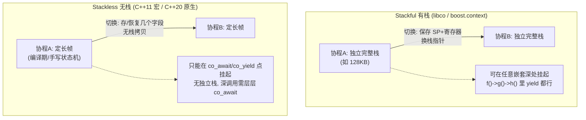
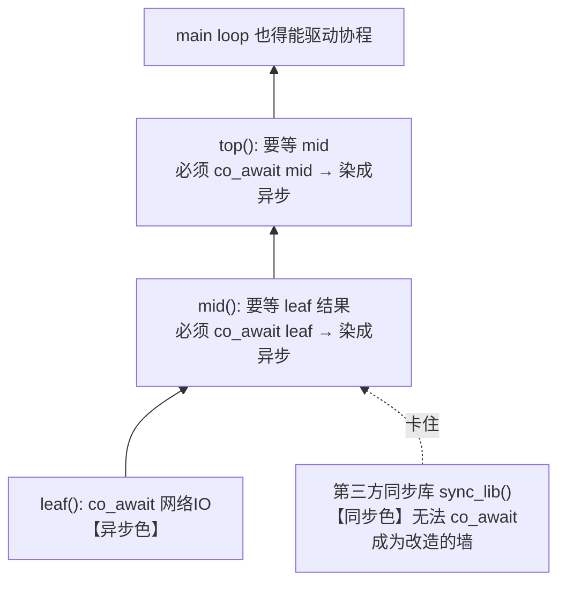

# C++ 协程：有栈 vs 无栈 vs C++20 原生（函数染色与 libco）

> 协程的所有分歧都归结到一个问题：**挂起时，那个"执行现场"存在哪里。** 有栈协程给每个协程一整条独立栈，任意深处都能挂起、老代码一行不改；无栈协程把现场编译成一个定长帧，省内存、切换廉价、能撑百万并发，代价是 `co_await` 病毒式传染函数签名——这就是"函数染色（function coloring）"。无栈并非 C++20 独有：C++11 就能用 Duff's device 宏手写状态机（Protothreads / Boost.Asio），C++20 只是把这套状态机交给编译器自动、安全地生成。

::: tip 一句话结论
协程分歧在挂起现场存哪：有栈存独立栈可零改造，无栈存定长帧省内存但函数染色。
:::

## 场景问题

游戏后台是**海量长连接 + 大量 I/O 等待**的典型：一台接入服要维持几万到几十万条连接，每条连接的逻辑（读包、查 DB、调后端、回包）里塞满了阻塞等待。两条路都走不通：

- **一连接一线程**：几万线程，光栈内存（默认 8MB/线程）和调度切换就压垮机器。
- **纯回调/事件驱动**：`epoll` + 回调把一段顺序逻辑撕成几十个回调函数，"回调地狱"，业务代码没法读、没法维护，状态全靠手动在堆上存。

协程的价值就是：**用同步的写法（顺序代码）跑出异步的性能（遇到 I/O 就让出，不占线程）**。但 C++ 在 C++20 之前没有语言级协程，各家（尤其游戏公司）自研；C++20 才有了原生协程。这两条路的取舍，以及历史上为什么这么选，是本文的核心。而横在中间的关键概念是**函数染色**——一个函数一旦"异步化"，是否会强迫调用它的所有函数也跟着异步化。

## 实现方案

### 本质区别：现场存哪里



- **有栈协程（Stackful）**：每个协程分配一条**独立完整的调用栈**（如 libco 默认 128KB）。挂起 = 保存当前 CPU 寄存器（含栈指针 SP、指令指针）到协程结构，切到另一条栈。因为有自己的栈，**可以在任意嵌套函数的深处挂起**（`f()→g()→h()` 里 `h` 想 yield 直接 yield）。代表：libco、boost.context、ucontext、fcontext。
- **无栈协程（Stackless）**：把协程函数**改写成一个状态机**，局部变量和"当前执行到哪一步"打包成一个**定长帧（coroutine frame）**，大小固定。挂起 = 记住状态机走到第几步、保存几个字段，**没有独立栈**。因此**只能在显式挂起点挂起**，深调用栈里的挂起必须靠层层传递上来。这个"状态机 + 无独立栈"的思路**并非 C++20 才有**——早在 C++11/C++03 就能用 **Duff's device 宏技巧**手写（Protothreads、Boost.Asio 的 `asio::coroutine`）；C++20 只是让**编译器自动、类型安全地**生成这套状态机。代表：C++11 宏状态机（手写）、C++20 原生协程（编译器生成）。

### 有栈协程：libco 风格（C++11 时代自研）

libco 的杀手锏是 **hook 系统调用**：把 `read`/`write`/`connect`/`sleep` 等阻塞系统调用替换成协程感知的版本——调用时若会阻塞，就**自动把 fd 注册到 epoll 并让出协程**，数据就绪后再切回来。这样**老的同步阻塞代码一行不改**，链接进 libco 就自动变成协程化的非阻塞代码。

```cpp
// libco 风格用法：业务代码看起来完全是同步阻塞的
#include "co_routine.h"
#include <unistd.h>

void* worker(void* arg) {
    co_enable_hook_sys(); // 开启系统调用 hook：下面的 read/write 会自动 yield
    int fd = *(int*)arg;
    char buf[1024];
    // 看起来是阻塞 read，实则：无数据时自动注册 epoll + 让出协程，
    // 数据就绪后调度器再切回来继续。业务代码毫无异步痕迹。
    ssize_t n = read(fd, buf, sizeof(buf));
    write(fd, buf, n); // 同理，写不下时自动让出
    return nullptr;
}

int main() {
    int fd = /* accept 得到的连接 */ 0;
    stCoRoutine_t* co;
    co_create(&co, nullptr, worker, &fd); // 创建协程（分配独立栈）
    co_resume(co);                        // 启动
    co_eventloop(co_get_epoll_ct(), nullptr, nullptr); // 事件循环驱动
    return 0;
}
```

::: tip
libco 的价值不在"协程"本身，而在 **hook + 独立栈 = 存量同步代码零改造异步化**。微信当年有海量用 `read`/`write` 写的同步阻塞服务，无法逐个重写成回调；libco 让它们直接跑成高并发协程服务。这是"规避函数染色"的经典工程手段。
:::

### 无栈协程的前身：C++11 宏 + Duff's device

无栈协程不是 C++20 的发明。早在没有语言支持的 C++11/C++03 时代，就能用 **Duff's device**（`switch`/`case` 穿透）手写无栈协程：用**一个整数记住"上次执行到第几行"**，`switch(state)` 跳回该处继续。挂起就是"记住行号 + `return`"，没有独立栈——这正是无栈的本质。Simon Tatham 的 *Coroutines in C*、嵌入式界的 **Protothreads**（Adam Dunkels）、以及 **Boost.Asio 的 `asio::coroutine`**（`reenter`/`yield`/`fork` 宏）都是这一套，在 C++20 之前的异步网络代码里大量使用。

```cpp
// C++11 无栈协程：一个 int 记住"执行到第几行"，靠 switch 跳回该点继续
#define CO_BEGIN(s)  switch (s) { case 0:
#define CO_YIELD(s)  do { (s) = __LINE__; return; case __LINE__:; } while (0)
#define CO_END       }

struct Reader {                 // 跨挂起点存活的局部变量必须手动提成成员——无栈的代价
    int state = 0;              // 状态：记录上次挂起的行号
    int i = 0;
    void resume() {
        CO_BEGIN(state);        // 展开成 switch(state){ case 0:
        for (i = 0; i < 3; ++i) {
            do_read(i);
            CO_YIELD(state);    // 挂起：state=__LINE__; return; 下次 switch 跳回 case __LINE__
        }
        CO_END;                 // 展开成 }
    }
};
// 外层循环：while 反复 r.resume()，每次从上次 yield 处继续，直到跑完
```

`CO_YIELD` 展开后是 `state = __LINE__; return; case __LINE__:;`——`return` 让出，下次进来 `switch(state)` 直接跳到那个 `case __LINE__` 标号，接着往下执行。整个"现场"就是 `state` 这一个 int，没有栈拷贝、没有寄存器保存，切换极廉价。

::: warning Duff's device 无栈协程的三条硬约束
这套手写方案暴露了无栈协程的全部代价，也解释了 C++20 为什么要交给编译器：
- **局部变量不跨挂起点存活**：宏不保存局部变量，任何要跨 `CO_YIELD` 存活的变量都得手动提成成员（如上面的 `i`）。C++20 编译器会自动把这些局部搬进协程帧。
- **不能在嵌套函数里挂起**：`CO_YIELD` 只能出现在 `resume()` 本体，调用的普通函数内部无法让出——和 C++20 无栈一样，这是无栈的通病，也是**函数染色**的源头。
- **不能把 `yield` 放进自己的 `switch`**：技巧本身占用了 `switch`，再嵌一层 `switch`（含 `case`）会和 Duff's device 的 `case __LINE__` 冲突。C++20 原生协程没有这个限制。
:::

C++20 相对这套手写方案的进步：编译器**自动生成状态机**（局部变量自动入帧、类型安全、可放进任意控制流），把宏的三条约束基本消除，只留下"深调用需层层 `co_await`"这一无栈固有特性。所以 C++11 宏协程和 C++20 原生协程**是同一种东西的手写版与编译器版**，不是两类协程。

### 无栈协程：C++20 原生

C++20 引入 `co_await`/`co_yield`/`co_return` 三个关键字。带任一关键字的函数即为协程，编译器为它生成 `promise_type` 驱动的状态机，帧在堆上分配（可被优化消除）。

```cpp
#include <coroutine>
#include <optional>

// 一个最小的惰性生成器：无栈协程，帧在堆上，只在 co_yield 处挂起
template <typename T>
struct Generator {
    struct promise_type {
        T current;
        Generator get_return_object() {
            return Generator{std::coroutine_handle<promise_type>::from_promise(*this)};
        }
        std::suspend_always initial_suspend() { return {}; }
        std::suspend_always final_suspend() noexcept { return {}; }
        std::suspend_always yield_value(T v) { current = v; return {}; } // co_yield 落到这
        void return_void() {}
        void unhandled_exception() { std::terminate(); }
    };

    std::coroutine_handle<promise_type> h;
    explicit Generator(std::coroutine_handle<promise_type> handle) : h(handle) {}
    ~Generator() { if (h) h.destroy(); }

    // 恢复协程执行到下一个 co_yield，取出值
    std::optional<T> next() {
        if (!h || h.done()) return std::nullopt;
        h.resume();                     // 恢复：状态机跳到上次挂起点继续
        if (h.done()) return std::nullopt;
        return h.promise().current;
    }
};

Generator<int> fib() {
    int a = 0, b = 1;
    while (true) {
        co_yield a;         // 挂起点：只有这里能挂起，无独立栈
        int t = a; a = b; b = t + b;
    }
}

// 用法：for (auto g = fib(); auto v = g.next(); ) 打印斐波那契
```

::: warning
无栈协程**只能在 `co_await`/`co_yield` 处挂起**。如果 `fib()` 里调用了一个普通函数 `helper()`，`helper` 内部想挂起是做不到的——它没有 `co_await`，也不在协程帧里。要让深处能挂起，整条调用链都得是协程、层层 `co_await`。这就是函数染色的根源。
:::

### 函数染色（Function Coloring）

一旦某函数用了 `co_await`（"异步色"），**调用它并想拿到其结果的函数也必须 `co_await` 它，于是自己也变成协程（染上异步色）**。这种传染沿调用链一路向上蔓延：



同步函数（"同步色"）和异步函数（"异步色"）不能自由互调：异步函数里可以调同步函数，但同步函数**无法 `co_await`** 一个异步函数（拿不到结果、又不能挂起自己）。深调用栈里某处要异步，就得把整条链染成异步；碰到无法改的第三方同步库，就撞墙。

## 为什么这么做

**为什么 C++11 时代要自研有栈协程？**

- 语言没有协程支持，只能自己用 `ucontext`/汇编（`boost.context`）保存恢复寄存器与栈。
- 存量是**海量同步阻塞老代码**，重写成回调不现实。有栈协程 + hook 系统调用能让这些代码**签名不变、逻辑不动**就跑成协程——**规避了函数染色**（因为挂起发生在被 hook 的系统调用里，业务函数看不见 `co_await`，不需要改签名）。
- 有栈的"任意深处可挂起"正好匹配"老代码在深调用栈里阻塞"的现实。

**为什么 C++20 原生协程选无栈？** 三个词：**省内存、切换廉价、百万并发**。

| 维度 | 有栈协程（libco 等） | 无栈协程（C++20） |
|---|---|---|
| 每协程内存 | 一整条栈（如 128KB，需预留深调用栈空间） | 一个定长帧（几十~几百字节，编译期算） |
| 切换成本 | 保存/恢复全部寄存器 + 换栈指针 | 存/恢复几个字段，无栈拷贝，更廉价 |
| 挂起位置 | **任意嵌套深处** | **仅 co_await/co_yield 点** |
| 并发规模 | 受栈内存限制（几万~几十万） | **百万级**（帧小） |
| 存量代码改造 | **零改造**（hook + 不改签名） | 需引入 co_await，**函数染色传染** |
| 语言支持 | 需库/汇编 | 语言原生 |

无栈帧小到能开百万协程，切换只动几个字段——这是撑起 C10M 的关键。代价是把"现场存哪"从运行时（独立栈）搬到了编译期（定长帧），于是**只能在编译器能生成状态机的显式点挂起**，从而带来函数染色。

## 为什么别的选择不行

- **一连接一线程**：栈内存 + 内核调度成本，几万连接就崩。协程是用户态调度，栈/帧远小于线程栈。
- **纯回调事件驱动**：性能够，但业务逻辑被撕成回调地狱，不可维护；状态要手动堆上管理。协程用同步写法解决可读性。
- **无栈协程去改造存量同步阻塞代码**：函数染色会逼你把整条调用链改成 `co_await`，碰到第三方同步库（无法加 `co_await`）就撞墙，改造成本极高。这正是 C++11 时代宁可自研有栈协程的原因。
- **有栈协程追求百万并发**：每协程一整条栈，内存吃不消；且要为深调用栈预留栈空间，浪费大。极致高并发场景无栈更省。
- **两者混用不加设计**：有栈协程里调无栈协程、或反之，调度器/挂起语义不兼容，容易踩坑。选一套体系贯彻到底。

## 沉淀结论

- 协程的本质分歧是**挂起现场存哪**：有栈 = 独立完整栈（运行时）；无栈 = 定长帧（状态机）。
- **有栈（libco/boost.context/ucontext）**：任意深处可挂起、老代码零改造（hook + 不改签名，规避函数染色），代价是栈内存大、并发受限。
- **无栈不是 C++20 才有**：C++11/C++03 就能用 **Duff's device 宏**（Protothreads、Boost.Asio `asio::coroutine`）手写状态机；C++20 只是让**编译器自动、类型安全地生成**这套状态机。二者是同一种东西的手写版与编译器版。
- **无栈（C++11 宏 / C++20 原生）**：省内存、切换廉价、百万并发，代价是**只能在挂起点挂起**、跨挂起点的局部变量要进帧（手写版需手动提成成员），且 `co_await` **病毒式传染函数签名 = 函数染色**，深调用栈/第三方同步代码难改造。
- **函数染色**：异步色沿调用链向上传染，同步函数无法 `co_await` 异步函数——这是无栈协程改造存量代码的最大阻力。
- 选型口诀：**存量同步阻塞代码要平滑异步化 → 有栈（libco）；新写、追求百万并发与低内存 → C++20 无栈，但要接受函数染色。**

### 记忆口诀

**有栈**：独立栈 / 任意深处挂起 / 老代码零改造 / 栈大并发受限
**无栈**：定长帧 / 仅挂起点挂起 / 省内存百万并发 / 函数染色
**函数染色**：异步色沿调用链上传 / 同步函数不能 co_await 异步 / 撞第三方同步库
**选型**：改存量→有栈libco / 新写高并发→C++20无栈

## 内容来源

综合整理。参考资料：微信 libco 开源项目及其 hook 系统调用设计文档、boost.context / boost.coroutine2 文档、Linux `ucontext(3)` 手册、Simon Tatham *Coroutines in C*（Duff's device 无栈协程）、Adam Dunkels 的 Protothreads、Boost.Asio `coroutine`（`reenter`/`yield`/`fork` 宏）、C++20 标准 `[coroutine]` 章节与 cppreference `std::coroutine_handle`/`promise_type`、Lewis Baker 的 C++ Coroutines 系列文章，以及 "What Color is Your Function?"（Bob Nystrom）关于函数染色的经典论述。

## 自测：合上资料能说清楚吗？

协程的所有分歧都归结到哪一个问题？有栈和无栈分别把"执行现场"存在哪里？

<details><summary>参考答案</summary>

归结到**挂起时执行现场存哪**。**有栈**给每个协程一整条**独立完整栈**，现场在运行时的栈里；**无栈**把函数编译成**状态机**，局部变量和执行位置打包成一个**定长帧**，现场在编译期确定的帧里。

</details>

什么是"函数染色"？为什么无栈协程会有，而有栈协程能规避？

<details><summary>参考答案</summary>

一个函数用了 `co_await`（**异步色**）后，想拿其结果的调用者也必须 `co_await`、于是也变协程，沿调用链**向上传染**。无栈只能在挂起点挂起，深处异步就得整链染色；有栈靠 **hook 系统调用 + 独立栈**，挂起藏在系统调用里，业务函数签名不变，故**规避染色**。

</details>

libco 为什么在 C++11 时代大受欢迎？它的杀手锏是什么？

<details><summary>参考答案</summary>

杀手锏是 **hook 系统调用**：把 `read`/`write`/`connect` 等替换成协程感知版，会阻塞时**自动注册 epoll + 让出协程**。配合独立栈，让**海量存量同步阻塞代码一行不改**就跑成高并发协程，无需重写成回调地狱。

</details>

无栈协程是 C++20 才发明的吗？C++20 相比 C++11 手写方案进步在哪？

<details><summary>参考答案</summary>

**不是**。C++11/C++03 就能用 **Duff's device 宏**（Protothreads、Boost.Asio `asio::coroutine`）手写状态机，用一个 int 记行号 `switch` 跳回。C++20 只是让**编译器自动、类型安全地生成**状态机：局部变量**自动入帧**、可放进任意控制流，消除了手写版的三条约束。

</details>

存量同步阻塞代码要异步化，选有栈还是无栈？新写百万并发服务呢？为什么？

<details><summary>参考答案</summary>

存量改造选**有栈（libco）**：hook + 不改签名、**零改造**、任意深处可挂起，规避函数染色。新写高并发选 **C++20 无栈**：定长帧几十~几百字节、切换只动几个字段，能撑**百万并发**，代价是接受 `co_await` **函数染色**。

</details>
