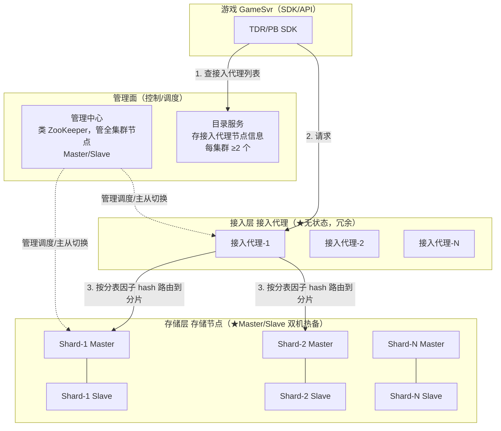

# 分布式游戏存储（分布式 KV）

自研分布式 NoSQL · 缓存+落地融合 · 无状态接入层 · 主备存储层 · 不停服扩缩容

> ::: tip 说明
> 本文描述的是一款**存储与调度全自研**的分布式 NoSQL 数据库（专为游戏设计，也覆盖互联网/政务/金融/物联网）。内容结合其**公开用户手册与云文档**，从"数据模型 → 架构分层 → 为什么能扛住海量并发"三层讲清楚。数字（单机 10w QPS、<10ms、99.999%）取自官方公开口径，仅用于表达数量级。
> :::

## 场景问题

游戏后台对存储的诉求，和典型互联网 CRUD 完全不是一个物种：

- **海量并发 + 极低时延**：一次战斗结算、一次背包变更都要毫秒级落库，MMO/竞技类峰值动辄百万在线，QPS 极高。传统"MySQL 扛写"很快被单机写瓶颈打爆。
- **数据量爆炸且冷热分明**：全服玩家数据 PB 级，但活跃的只是当前在线那批。**全内存（Redis）太贵，全磁盘（MySQL）太慢**。
- **对象化数据结构**：玩家存档是嵌套的结构体（背包、任务、装备……），关系型的行列拆分既别扭又慢。
- **运营特有动作**：开新区（分服）、合并低活区（合服）、回档（版本事故回滚到某时间点）、不停服扩缩容——这些是游戏运营的日常，通用数据库根本没有原生支持。
- **强一致的关键写**：抽卡扣钻、交易扣道具，绝不能因为并发写出现"超卖"。

一句话：游戏需要一个**"像 Redis 一样快、像 MySQL 一样能落地、按游戏运营动作定制、还能水平无损扩展"**的存储。这类自研分布式存储就是答案（大量端手游在用）。

## 实现方案

### 数据模型：App → Zone → Table → Record

它的概念和 MySQL/MongoDB 有清晰映射：

| MySQL | MongoDB | 本存储 | 说明 |
| --- | --- | --- | --- |
| database | database | **Zone（表格组）** | 一个游戏区/表集群 |
| table | collection | **Table** | 相同 Schema 的记录集合 |
| row | document | **Record** | 一条玩家数据，单记录最大 10MB、嵌套最多 32 层 |
| column | field | **Field** | 主键最多 8 个，普通字段最多 256 个 |

- **App（业务）**：逻辑概念（如"某头部手游"），一个业务可跨集群建多个 Zone，但一个 Zone 只用一个集群资源。
- **两种表定义方式**：**TDR 表**（TDR 序列化协议，支持 MySQL 协议兼容 / Java SDK / TopN 索引）vs **PB 表**（Protobuf，支持 Schema Free / RESTful API）。二者无本质区别，按团队熟悉度选。
- **两种记录类型**：**Generic 表**（一 Key 一记录，Key 唯一）vs **List 表**（同 Key 多条以列表存，如邮件、日志）。

### ⭐ 分表因子（Splittable Key）：分布式能力的命门

这是本存储最关键、也最容易踩坑的概念——**它决定数据怎么散到集群各节点**：

- 分表因子必须是主键的**子集**，其字段参与 **hash 计算**，hash 值决定记录落到哪个存储节点。
- **反例**：主键 `uid, role_id, zone_id`，若拿 `zone_id` 当分表因子——但全服只有几百个 zone_id 值 → 数据最多散到几百个节点，且某个热门区记录暴多会**把单节点打爆甚至撑爆磁盘**。
- **正解**：取**离散度高**的字段（如 `uid`），数据才均匀。极端反例是拿"性别"当分表因子 → 数据最多分 2 个节点，分布式能力被锁死在 2 台机器的性能上。

::: warning 一句话
分表因子选错 = 分布式白做。面试被问"你怎么保证数据均衡"，答案就是**分表因子取高离散度字段做 hash 分片**。
:::

### ⭐⭐ 架构分层：无状态接入 + 主备存储 + 管理面

这是"为什么能扛海量并发"的核心。本存储是**存算分离**的三层架构：



| 组件 | 角色 | 关键特性 |
| --- | --- | --- |
| **管理中心** | 管理调度节点 | 类 ZooKeeper 管全集群，处理 Web 请求，**主从切换的决策者**；自身 Master/Slave |
| **目录服务** | 目录服务 | 存接入代理节点信息，SDK 靠它发现接入层；每集群 ≥2 个，一个挂了 SDK 自动切另一个 |
| **接入代理** | 接入层 | **⭐无状态、冗余部署**，收 SDK 请求→路由到存储层→回包；单节点故障不影响请求 |
| **存储节点-Master** | 存储主节点 | 存数据分片（Shard），响应接入代理读写 |
| **存储节点-Slave** | 存储备节点 | 实时备份 Master，**主从切换无损** |

**存储原理**：一张表按分表因子 hash，对**路由数组长度（默认 10k）取模分片（Mod Sharding）**，所以一张表最多分 10000 个 Shard，分散到不同存储节点。

### 缓存+落地融合：热数据在内存，冷数据在 SSD

传统方案是 **Redis（缓存）+ MySQL（落地）** 两套系统拼起来，业务要自己维护一致性、处理缓存穿透/击穿。本存储把这两层**融进一个进程**：

- 进程内数据在**内存与磁盘之间按 LRU 冷热交换**：活跃数据常驻内存（Redis 级速度），非活跃数据落 SSD（MySQL 级容量）。
- 官方口径：比全内存存储**省约 70% 成本**，比 Redis+MySQL 方案**省约 40%**，同时单机 QPS 达 10w、时延 <10ms。
- 业务视角只有**一套 API、一套一致性语义**，不用再手写缓存旁路逻辑。

### 数据淘汰：表级 + 记录级 TTL

- **表级淘汰**：按"记录最后修改时间"配规则（如"30天前的邮件"），仅靠主动淘汰（后台扫表），过期删除可能延迟到天级。
- **记录级 TTL**（仅 Generic 表）：每条记录可设独立过期时间，主动+被动淘汰结合，秒/毫秒级精确。
- **被动淘汰**：访问时实时判断过期→立即清除返回不存在；**主动淘汰**：后台遍历表删过期记录，消耗大，DBA 安排在低峰扫。

### 索引：本地索引 + 全局（分布式）索引

- **本地索引**：基于主键字段，建表时随表建，支持用部分主键查询。
- **全局索引**：独立索引系统，**异步准实时同步**（更新到可查询秒级、多数 <1s）。支持对任意一级字段做**范围/模糊/聚合/分页查询**（`>, <, between, like, sum, count, avg...`），用 SQL 查询。限制也明确：仅 Generic 表、单查询最多返回 3000 条、`limit+offset ≤ 10000`、不支持 join/union/order by/group by/子查询。

### 乐观锁：靠记录版本号防并发覆盖

抢票/抢限量道具的经典场景，本存储用**记录版本号**做乐观锁：

```
1. 100 人同时 get 同一记录，拿到的版本号都是 v10
2. 都拿 v10 去写；存储节点对单 key 的写是排队串行的
3. 第一个写成功 → 版本号变 v11
4. 剩余 99 个请求带的还是 v10，与服务端 v11 不一致 → 全部报错
   => N 个并发写只有第一个成功，其余 N-1 失败（版本保护）
```

**本质**：单 key 写在存储节点工作线程内排队 + CAS 版本校验，天然防超卖，无需分布式锁。

## 为什么这么做

### 🌟 为什么它能支撑海量并发（核心答案）

把前面的机制串成一条逻辑链——**这就是面试要背的"为什么"**：

**1. 接入层无状态 → 水平扩展无上限、故障无感知**
接入代理不存任何数据/会话，纯路由转发。所以可以**灵活水平扩缩容、对业务无感知**；单节点挂了，SDK 从目录服务拿到的冗余列表里换一个继续用。海量并发靠"堆接入代理"线性顶上去。

**2. 数据 hash 分片 → 写压力打散到 N 台机器**
按分表因子 Mod Sharding（默认最多 10k 分片），把单表的读写均摊到多个存储节点。**单机 10w QPS × N 分片 = 集群百万级 QPS**。这是突破单机写瓶颈的根本——只要分表因子够离散。

**3. 缓存+落地融合 → 用内存的速度扛并发，用 SSD 的容量扛数据量**
热数据 LRU 常驻内存，读写走内存路径拿到 <10ms 时延；冷数据沉 SSD 不占内存。既不像全内存那么烧钱，也不像纯磁盘那么慢——**在"快"和"省"之间取到游戏最需要的平衡点**。

**4. 主备双机热备 → 高并发下仍 99.999% 可用**
存储节点 Master/Slave 实时同步，Master 挂了接入代理很快感知（一定时间无响应）→ 通知管理中心决策 → Slave 切主 + 改路由表，**主从切换无损**。管理面（管理中心/目录服务）自身也是多副本。优先同城跨机房部署。

**5. 单 key 串行 + 版本号乐观锁 → 高并发写不乱**
不用重的分布式锁，靠存储节点工作线程对单 key 排队 + 版本 CAS，抗住抽卡/交易类高并发写的一致性。

**6. 不停服扩缩容 / 分服合服 / 回档 → 撑住游戏全生命周期的运营洪峰**
存储层和接入层都能在线扩缩容不停服；开服洪峰前提前加分片，长尾期合服省成本。这让它在"业务规模剧烈波动"的游戏场景下始终扛得住。

### 全区全服 vs 分区分服

它原生支持两种游戏架构：
- **分区分服**：每个区一套数据（传统页游/端游），用 Zone 隔离；低活时**合服**（`MergeTablesData`）把多个区数据合并。
- **全区全服**：所有玩家一个大池（现代手游主流），靠分表因子把海量玩家均匀打散到全集群。

配套的**分服（开新区）、合服、回档（`RollbackTables` 回滚到某时间点）、备份快照**都是控制台/API 一键操作，这是通用 NoSQL 完全不具备的游戏定制能力。

## 为什么别的选择不行

::: warning 为什么不直接用现成方案
| 方案 | 为什么游戏后台顶不上 |
|---|---|
| **纯 MySQL** | 关系模型拆玩家存档别扭；单机写瓶颈；分库分表要业务自己搞；无冷热分层，全放磁盘时延高；没有分服/合服/回档等游戏运营原生能力 |
| **纯 Redis** | 全内存，PB 级数据成本爆炸；持久化（RDB/AOF）不是为强落地设计；集群分片与主从切换要自己运维；单 key 复杂对象 + 版本乐观锁支持弱 |
| **Redis + MySQL 拼装** | 两套系统两套一致性，业务要手写缓存旁路、处理穿透/击穿/雪崩；运维两份；成本仍比融合方案高约 40% |
| **MongoDB** | 文档模型贴近，但同样缺游戏运营语义（分服/合服/回档）、缺 TDR/PB 与游戏 SDK 深度集成、时延与成本模型不为游戏优化 |
| **自建分库分表中间件** | 相当于重造接入代理+存储节点+调度，研发运维成本极高，还不如用成熟自研件 |
:::

关键差异是：这类存储不是"通用数据库调参给游戏用"，而是**从数据模型（TDR/PB、分表因子）、存储引擎（缓存落地融合）、到运营动作（分服合服回档、不停服扩缩容）全链路为游戏定制**，这是通用组件补不齐的。

## 沉淀结论

::: tip 结论
- **分布式游戏存储 = 游戏定制的分布式 NoSQL**：缓存+落地融合、PB 级容量、毫秒时延、单机 10w QPS、99.999% 可用。
- **架构三层**：管理面（管理中心调度 + 目录服务）/ **无状态接入层 接入代理（冗余、水平扩展）** / **主备存储层 存储节点（Master/Slave 双机热备、无损切换）**。
- **扛海量并发的六根支柱**：① 接入代理无状态水平扩展 ② 分表因子 hash 分片把写压力打散到 N 机 ③ 内存/SSD 冷热 LRU 融合兼顾快与省 ④ 主备热备保高可用 ⑤ 单 key 串行 + 版本号乐观锁保写一致 ⑥ 不停服扩缩容/分服合服/回档撑住运营洪峰。
- **最易踩坑点**：分表因子必须取**高离散度字段**，选错（如性别、zone_id）会把分布式能力锁死甚至打爆单节点。
- **和接入网关的关系**：接入网关管"连接接入"，本存储管"数据落地"，一头一尾撑起游戏后台的高并发链路。
:::

**相关专题**：[接入网关（长连接接入层）](/game-infra/access-gateway.md) · [一致性哈希实现](/game-infra/consistent-hash-impl.md) · [有状态服务迁移](/game-infra/stateful-migration.md) · [Redis 深入](/common/redis.md)

## 内容来源

综合整理自该存储的官方公开用户手册（"是什么"、基本概念、数据淘汰、全局索引、典型应用场景）与云产品/操作文档，以及公开技术文章中的架构组件说明（管理中心/目录服务/接入代理/存储节点、Mod Sharding、主从切换、乐观锁原理）。性能与可用性数字取自官方公开口径，仅用于表达数量级。
