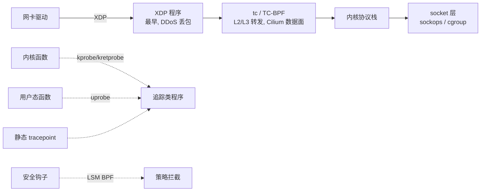
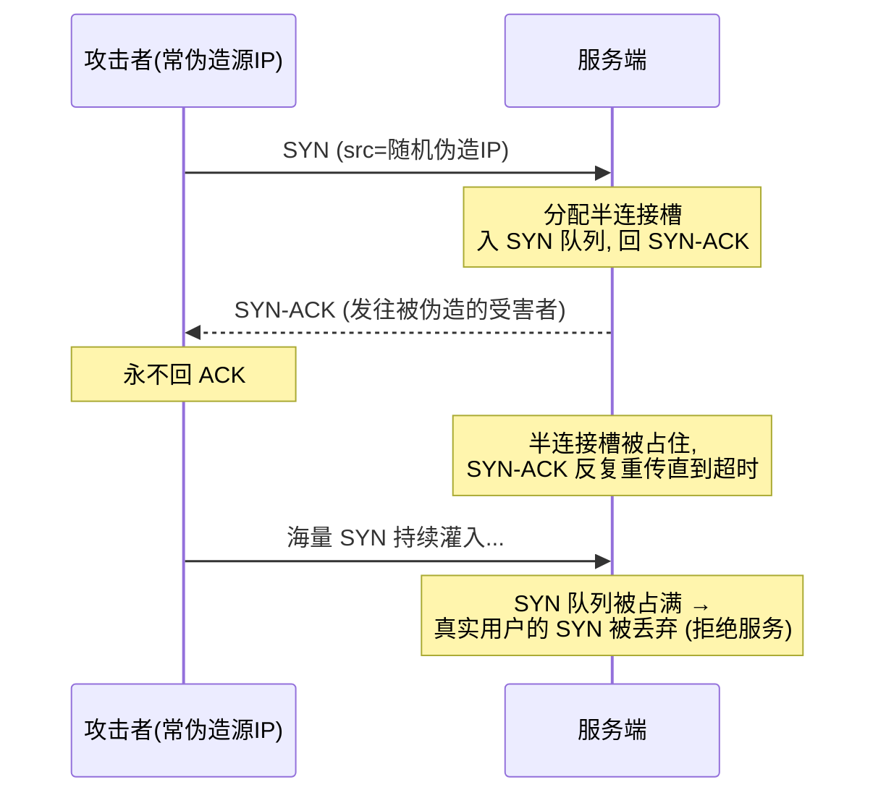
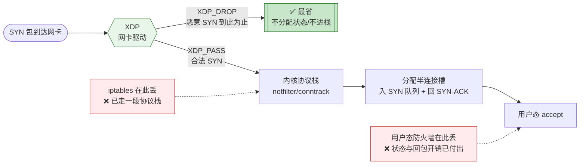
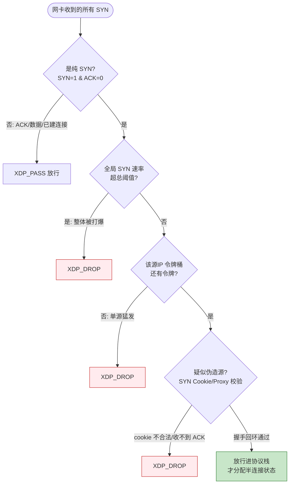
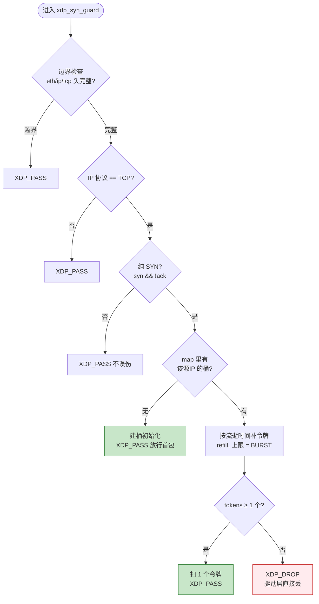

# eBPF 原理与在网络/可观测/安全的落地

> eBPF 把"在内核里安全地跑一段用户提供的代码"变成了工程现实：verifier 保证不崩内核、JIT 保证接近原生速度、Map 打通用户态与内核态。它是 Cilium 数据面、bpftrace 可观测、DDoS 早期丢包等一系列现代基础设施的共同底座。

::: tip 一句话结论
eBPF=内核态安全沙箱，不改内核就能拿到内核态的性能与可见性。
:::

## 场景问题

游戏后台的网络/可观测有几个反复出现的痛点：

- **kube-proxy 的 iptables 规则线性膨胀**：Service 数量到几千个后,`iptables` 的 KUBE-SERVICES 链是线性匹配,每个包在内核里走 O(N) 规则链,尾延迟抖动明显,规则下发也慢(全量刷表)。
- **抓不到内核态真相**：战斗服偶发 RTT 毛刺,想知道是 TCP 重传、还是 `qdisc` 排队、还是 socket buffer 满,传统 `tcpdump` 只看得到包、看不到内核路径上的状态。
- **DDoS 早期丢包**：SYN Flood 打进来,等包走完协议栈到达用户态再丢,CPU 已经被打爆了,需要在网卡驱动这一层就丢。
- **改内核代价太大**：以上都能用改内核/写内核模块解决,但内核模块一崩就是整机宕机,且发布要重启,运维不可接受。

核心矛盾:**既要在内核态拿到性能和可见性,又不能承担"改内核 = 可能崩机 + 重启发布"的风险。** eBPF 就是为解决这个矛盾而生的。

## 实现方案

### eBPF 是什么

eBPF(extended Berkeley Packet Filter)是内核里的一个**安全沙箱虚拟机**:

1. **verifier(校验器)**:加载 bytecode 前,内核静态分析——检查无越界内存访问、无未初始化寄存器、所有分支可终止(有界循环)、指令数上限。校验不通过直接拒绝加载。这是"不会崩内核"的根本保证。
2. **JIT 编译**:通过校验后,bytecode 被 JIT 成本机机器码,执行速度接近原生 C,而非解释执行。
3. **Map**:内核态 eBPF 程序与用户态进程共享数据的通道(hash / array / LRU / per-CPU / ringbuf 等类型)。这是"无需改内核就能配置/取数据"的关键。
4. **无需改内核 / 加载模块**:程序在运行时动态挂载/卸载,不重启、不编译内核。

### 挂载点(attach point)



- **网络**:`XDP`(网卡驱动最早,可直接 DROP/REDIRECT,DDoS 首选)、`tc/TC-BPF`(进协议栈前后,Cilium 用它做 L3-L7 转发)。
- **追踪**:`kprobe/kretprobe`(任意内核函数入口/返回)、`uprobe`(用户态函数)、`tracepoint`(内核预埋静态点,稳定 ABI)。
- **安全**:`LSM BPF`(在 Linux Security Module 钩子上做策略拦截,如禁止某容器 mount)。

### 一段 XDP 程序:统计并丢弃指定源 IP 的包

```c
// xdp_ddos.c —— 挂在 XDP,统计每个源 IP 的包数,超阈值直接丢
#include <linux/bpf.h>
#include <linux/if_ether.h>
#include <linux/ip.h>
#include <bpf/bpf_helpers.h>

// eBPF Map: key=源IP(u32), value=包计数(u64), 用户态可读可写阈值
struct {
    __uint(type, BPF_MAP_TYPE_LRU_HASH);
    __uint(max_entries, 1000000);
    __type(key, __u32);
    __type(value, __u64);
} pkt_count SEC(".maps");

#define THRESHOLD 100000ULL

SEC("xdp")
int xdp_ddos_filter(struct xdp_md *ctx) {
    void *data     = (void *)(long)ctx->data;
    void *data_end = (void *)(long)ctx->data_end;

    struct ethhdr *eth = data;
    // verifier 要求: 每次解引用前必须显式做边界检查
    if ((void *)(eth + 1) > data_end)
        return XDP_PASS;
    if (eth->h_proto != __constant_htons(ETH_P_IP))
        return XDP_PASS;

    struct iphdr *ip = (void *)(eth + 1);
    if ((void *)(ip + 1) > data_end)
        return XDP_PASS;

    __u32 src = ip->saddr;
    __u64 *cnt = bpf_map_lookup_elem(&pkt_count, &src);
    if (cnt) {
        __sync_fetch_and_add(cnt, 1);          // per-key 原子自增
        if (*cnt > THRESHOLD)
            return XDP_DROP;                     // 驱动层直接丢, 不进协议栈
    } else {
        __u64 init = 1;
        bpf_map_update_elem(&pkt_count, &src, &init, BPF_ANY);
    }
    return XDP_PASS;
}

char _license[] SEC("license") = "GPL";
```

用户态侧(Go/C/Python via libbpf/cilium-ebpf)只需 `open→load→attach` 到某网卡,再周期性从 `pkt_count` map 读数据做监控——**内核态负责高速数据面,用户态负责慢速控制面**,两者靠 Map 解耦。

::: tip
`SEC(".maps")` 声明的是 BTF 风格 map,配合 CO-RE(Compile Once – Run Everywhere)+ libbpf,同一份编译产物可在不同内核版本上运行,免去为每个内核头文件重编译。
:::

### 实战:用 XDP 在驱动层防御 SYN Flood

#### SYN Flood 原理:打爆半连接队列

TCP 三次握手里,服务端收到第一个 `SYN` 后就要**分配一个"半连接"状态**(放进 SYN 队列 / `syn_backlog`),回 `SYN-ACK`,然后**等客户端的 `ACK`**。攻击者正是钻这个空子:



- **要害是"半开连接"**:每个 SYN 只需攻击者发一个小包,却让服务端**分配状态 + 回包 + 计时重传**,是典型的**放大型资源耗尽**。
- **常配合源 IP 伪造**:源 IP 是随机伪造的,所以 (1) 按源 IP 封禁没用——每个 IP 只来几个包;(2) `SYN-ACK` 发给了无辜的第三方(反射)。
- **结果**:SYN 队列(backlog)被半连接占满,合法用户的 SYN 无槽可分,握手失败——服务对外"假死"。传统内核缓解手段是 **SYN Cookie**(不占队列、用加密序号编码状态)、调大 backlog、减少 `SYN-ACK` 重试次数。

#### XDP 防御:在协议栈之前就拦 SYN

XDP 挂在**网卡驱动**,是包进入内核的**最早一站**——比 conntrack、比分配半连接槽都早。在这里丢掉恶意 SYN,服务端**根本不会为它分配任何状态**,CPU 也不用走完协议栈。下图对比"恶意 SYN 在哪一层被丢",越靠左丢、已浪费的资源越少:



三层组合拳:

1. **只对"纯 SYN"生效**(`SYN=1 且 ACK=0`,握手第一个包),正常 ACK/数据包直接放行,不误伤已建连接。
2. **per-源IP 令牌桶动态限速**:每个源 IP 一个令牌桶(存 BPF map),按时间自动补充令牌;某源 IP 的 SYN 速率超过阈值就 `XDP_DROP`。"动态"体现在阈值和桶参数可由用户态随时改 map、按攻击态势调整。
3. **应对伪造源 IP**:per-IP 限速对"每个伪造 IP 只发几个包"的分散攻击无效,所以再叠加**全局 SYN 速率上限** + **XDP SYN Cookie / SYN Proxy**——在 XDP 直接用加密 cookie 回 `SYN-ACK`,只有回来的 `ACK` 带对合法 cookie 才放行进栈。伪造源收不到 `SYN-ACK`(发给了受害者)也就无法完成握手,天然过滤掉伪造流量。Cloudflare、Cilium 的 DDoS 数据面就是这套。

三层过滤叠起来就是一条"由粗到细"的漏斗,恶意流量层层被削,只有真正合法的握手才进协议栈:



下面是核心的 **per-源IP SYN 令牌桶限速** XDP 程序(对应上图第 2 层),其内部决策流程如下:



```c
// xdp_synflood.c —— 只对 TCP 纯 SYN 做 per-源IP 令牌桶限速, 超速在驱动层丢
#include <linux/bpf.h>
#include <linux/if_ether.h>
#include <linux/ip.h>
#include <linux/tcp.h>
#include <linux/in.h>
#include <bpf/bpf_helpers.h>

struct bucket {
    __u64 tokens;    // 剩余令牌(定点数, ×SCALE 避免浮点, verifier 也不允许浮点)
    __u64 last_ns;   // 上次补充令牌的时间戳
};

struct {
    __uint(type, BPF_MAP_TYPE_LRU_HASH);     // LRU: 表满自动淘汰最久未见的源IP
    __uint(max_entries, 1000000);
    __type(key, __u32);                       // 源 IP
    __type(value, struct bucket);
} syn_bucket SEC(".maps");

#define RATE  50ULL          // 每源IP 每秒允许的 SYN 数
#define BURST 100ULL         // 桶容量(允许的突发)
#define SCALE 1000ULL        // 定点放大倍数

SEC("xdp")
int xdp_syn_guard(struct xdp_md *ctx) {
    void *data = (void *)(long)ctx->data, *end = (void *)(long)ctx->data_end;

    struct ethhdr *eth = data;
    if ((void *)(eth + 1) > end) return XDP_PASS;
    if (eth->h_proto != __constant_htons(ETH_P_IP)) return XDP_PASS;

    struct iphdr *ip = (void *)(eth + 1);
    if ((void *)(ip + 1) > end) return XDP_PASS;
    if (ip->protocol != IPPROTO_TCP) return XDP_PASS;

    // IP 头长度可变(ihl 以 4 字节为单位), verifier 要求解引用前做边界检查
    __u32 ihl = ip->ihl * 4;
    if (ihl < sizeof(*ip)) return XDP_PASS;
    struct tcphdr *tcp = (void *)ip + ihl;
    if ((void *)(tcp + 1) > end) return XDP_PASS;

    // 只拦"纯 SYN"(握手第一个包); 其余(ACK/数据/已建连接)一律放行, 不误伤
    if (!(tcp->syn && !tcp->ack)) return XDP_PASS;

    __u32 src = ip->saddr;
    __u64 now = bpf_ktime_get_ns();
    struct bucket *b = bpf_map_lookup_elem(&syn_bucket, &src);
    if (!b) {                                    // 首次见到该源IP: 建桶并放行
        struct bucket nb = { .tokens = (BURST - 1) * SCALE, .last_ns = now };
        bpf_map_update_elem(&syn_bucket, &src, &nb, BPF_ANY);
        return XDP_PASS;
    }

    // 按流逝时间补充令牌(每秒 RATE 个), 直接改 map 里的值(lookup 返回的是内核态指针)
    __u64 refill = (now - b->last_ns) * RATE * SCALE / 1000000000ULL;
    __u64 tok = b->tokens + refill;
    if (tok > BURST * SCALE) tok = BURST * SCALE;   // 不超过桶容量
    b->last_ns = now;

    if (tok >= SCALE) {          // 有一个整令牌 → 扣减并放行
        b->tokens = tok - SCALE;
        return XDP_PASS;
    }
    b->tokens = tok;
    return XDP_DROP;             // 令牌耗尽 → 驱动层直接丢, 服务端不分配任何半连接状态
}

char _license[] SEC("license") = "GPL";
```

::: tip
用户态可随时改写 `RATE`/`BURST`(做成 map 里的可配置项)或读 `syn_bucket` 观察哪些源 IP 在猛发 SYN——这就是"**内核态高速丢包 + 用户态动态调参/观测**"的分工。真正生产级方案会再叠加 XDP SYN Proxy 来抵御伪造源,单纯 per-IP 限速只挡得住"少数真实 IP 的高频 SYN"。
:::

## 为什么这么做

**为什么 eBPF 能替代 iptables/kube-proxy?**

| 维度 | iptables (kube-proxy) | eBPF (Cilium) |
|---|---|---|
| Service 查找复杂度 | O(N) 线性遍历规则链 | O(1) hash map 查表 |
| 规则更新 | 全量/大段重刷,慢且有窗口 | 更新 map entry,增量、原子 |
| 数据路径 | 走完 netfilter 各 hook | XDP/tc 早期处理,可绕过大段协议栈 |
| 拷贝 | 常规内核路径 | 可零拷贝 REDIRECT/直转 |

Service 数以千计时,iptables 的线性链是硬伤;eBPF 用 map 查表把 Service→Backend 变成 O(1),更新只改一个 entry。这是 Cilium 能"替掉 kube-proxy"的技术根因。

**为什么可观测/安全也选它?** kprobe/uprobe 让你在**不改被观测程序、不停服**的前提下,把探针挂到任意内核/用户函数上取现场数据(如 `bpftrace -e 'kprobe:tcp_retransmit_skb {...}'` 直接统计重传);LSM BPF 让安全策略在内核态的钩子上生效,绕不过去。共同点都是:**内核态执行(快、全)+ 动态加载(不重启)+ verifier 兜底(不崩)**。

**为什么防 SYN Flood 要用 XDP 而不是内核 SYN Cookie 或用户态防火墙?** 位置决定成本。SYN Flood 的杀伤力在于"让服务端为每个恶意 SYN 分配半连接状态 + 回包重传",越晚拦截、已经浪费的资源越多:走到用户态才丢,协议栈和半连接槽的开销已经付出;内核 SYN Cookie 虽不占队列,但仍要为每个 SYN 计算并回包。XDP 挂在**网卡驱动最前端**,恶意 SYN 在这里 `XDP_DROP`,服务端**连状态都不分配、包都不进协议栈**,是能做到的最省的丢弃点;配合 map 令牌桶还能**动态按源 IP / 按态势限速**,这是静态 iptables 规则做不到的。

## 为什么别的选择不行

- **改内核 / 内核模块**:能拿到同样的位置和性能,但 (1) 模块 bug 直接 panic 整机;(2) 发布要重启;(3) 维护多内核版本的模块矩阵极痛。eBPF 用 verifier 把"崩机"这条路堵死,用动态加载把"重启"这条路省掉。
- **纯用户态方案(DPDK/用户态协议栈)**:能极致低延迟,但要独占网卡、绕开内核生态(K8s Service、netfilter、TCP 栈全得自己实现),运维和兼容成本高。eBPF 留在内核里,复用内核生态。
- **iptables/纯 tcpdump**:如上,前者线性膨胀,后者只看得到包看不到内核状态。
- **sidecar 代理做 L7(Envoy)**:每个请求要"内核↔用户态 sidecar"来回横跳,eBPF 数据面可在内核态直接转发,省掉这次上下文切换(见 `mesh-istio-cilium` 专题)。

::: warning
eBPF 不是银弹,verifier 的约束很硬:早期内核不支持无界循环(需 `#pragma unroll` 或有界 `bpf_loop`);单程序指令数有上限(旧内核 4096,新内核放宽到百万级但仍有栈 512B 限制);栈只有 512 字节,大状态必须放 Map。
:::

::: danger
**内核版本依赖是最大落地阻力。** XDP、BTF/CO-RE、`bpf_loop`、ringbuf 等特性各有最低内核版本要求。生产上线前务必核对目标节点内核版本与所需特性矩阵,否则 attach 直接失败或功能降级。老旧内核(如 3.x)基本无法用 eBPF 数据面。
:::

## 沉淀结论

- eBPF = **内核态安全沙箱 VM**:verifier(不崩)+ JIT(够快)+ Map(通用户态)+ 动态加载(不重启)。记住这四点就抓住了本质。
- 挂载点分三类:**网络**(XDP/tc)、**追踪**(kprobe/uprobe/tracepoint)、**安全**(LSM)。按"在哪拦"选点。
- 替代 iptables 的根因是 **O(1) map 查找 vs O(N) 规则链**;可观测/安全的价值是**不改程序、不停服地拿到内核态真相**。
- **防 SYN Flood**:SYN Flood 靠"半开连接"耗尽 backlog + 常伪造源 IP。XDP 在**驱动层最早拦纯 SYN**,恶意包不进协议栈、不分配半连接状态;用 map 令牌桶做 **per-源IP 动态限速**,再叠加 **SYN Cookie/Proxy** 抵御伪造源。核心是"越早拦越省"。
- 代价是 **verifier 约束 + 内核版本依赖**,上线前先对齐内核特性矩阵。
- 一句话选型:**要内核态性能与可见性、又不能承担改内核的崩机与重启风险时,用 eBPF。**

### 记忆口诀

**四要素**：verifier不崩 / JIT够快 / Map通用户态 / 动态加载不重启
**挂载点**：网络XDP·tc / 追踪kprobe·uprobe·tracepoint / 安全LSM
**替iptables**：O(1)map查表 / vs O(N)规则链 / 增量原子更新
**防SYN Flood**：越早拦越省 / 驱动层拦纯SYN / 令牌桶per-IP限速 / SYN Cookie抗伪造

## 内容来源

综合整理。参考方向:Linux 内核 eBPF/BPF 官方文档(`Documentation/bpf/`)、Cilium 与 Hubble 官方文档、`bpftrace`/BCC 项目文档、libbpf + CO-RE 相关资料,以及《BPF Performance Tools》(Brendan Gregg)等分布式/系统工程书籍的原理章节。

> 相关专题：eBPF 取代 kube-proxy 的 **iptables O(N) → eBPF O(1) 演进对比**详见 [K8s 网络](./k8s-network.md)（本篇聚焦 eBPF 引擎本身：verifier/JIT/Map/XDP），不重复展开 kube-proxy 模式对比。

## 自测：合上资料能说清楚吗？

eBPF 靠哪几个机制做到"在内核里跑用户代码却不会崩内核"？

<details><summary>参考答案</summary>

核心是 **verifier**：加载前静态校验无越界访问、无未初始化寄存器、分支可终止、指令数有上限，不过则拒绝加载。再配 **JIT** 编译到本机码保证速度、**Map** 通用户态、**动态加载**免重启。verifier 是不崩的根本保证。

</details>

为什么 Cilium 用 eBPF 能替掉 kube-proxy 的 iptables？两者查 Service 的复杂度差在哪？

<details><summary>参考答案</summary>

iptables 的 KUBE-SERVICES 是**线性规则链**，查 Service 是 **O(N)**，规则更新要全量重刷、慢且有窗口。eBPF 用 **hash map 查表做到 O(1)**，更新只改一个 **map entry**（增量、原子）。Service 数上千时线性链是硬伤，这是替换的技术根因。

</details>

为什么防 SYN Flood 要用 XDP，而不是内核 SYN Cookie 或用户态防火墙？

<details><summary>参考答案</summary>

**位置决定成本，越早拦越省**。XDP 挂在**网卡驱动最前端**，恶意 SYN 在此 `XDP_DROP`，服务端**连半连接状态都不分配、包都不进协议栈**。用户态才丢则协议栈+半连接槽开销已付出；SYN Cookie 虽不占队列但仍要为每个 SYN 计算并回包。

</details>

XDP 令牌桶限速在代码里为什么用定点数（×SCALE）而不用浮点？IP 头解引用前为什么必须做边界检查？

<details><summary>参考答案</summary>

**verifier 不允许浮点运算**，所以用 `×SCALE` 的定点数表示令牌。IP 头长度可变（`ihl` 以 4 字节为单位），且 verifier 要求**每次解引用前显式做边界检查**（`(void*)(hdr+1) > data_end`），否则可能越界读、校验直接拒绝加载。

</details>

eBPF 落地最大的阻力是什么？上线前要核对什么？

<details><summary>参考答案</summary>

最大阻力是**内核版本依赖**。XDP、**BTF/CO-RE**、`bpf_loop`、ringbuf 等特性各有最低内核版本要求，不满足则 attach 失败或降级。上线前须核对**目标节点内核版本与所需特性矩阵**，老旧内核（如 3.x）基本无法用 eBPF 数据面。另有 verifier 约束：栈仅 512B、大状态须放 Map。

</details>
