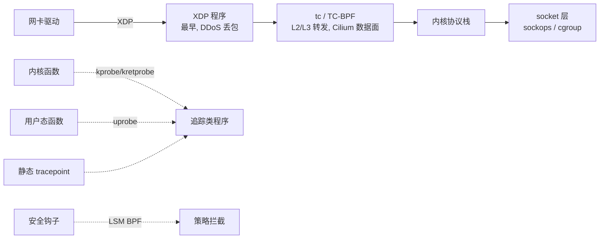

# eBPF 原理与在网络/可观测/安全的落地

> eBPF 把"在内核里安全地跑一段用户提供的代码"变成了工程现实：verifier 保证不崩内核、JIT 保证接近原生速度、Map 打通用户态与内核态。它是 Cilium 数据面、bpftrace 可观测、DDoS 早期丢包等一系列现代基础设施的共同底座。

## 场景问题

游戏后台的网络/可观测有几个反复出现的痛点：

- **kube-proxy 的 iptables 规则线性膨胀**：Service 数量到几千个后,`iptables` 的 KUBE-SERVICES 链是线性匹配,每个包在内核里走 O(N) 规则链,尾延迟抖动明显,规则下发也慢(全量刷表)。
- **抓不到内核态真相**：战斗服偶发 RTT 毛刺,想知道是 TCP 重传、还是 `qdisc` 排队、还是 socket buffer 满,传统 `tcpdump` 只看得到包、看不到内核路径上的状态。
- **DDoS 早期丢包**：SYN Flood 打进来,等包走完协议栈到达用户态再丢,CPU 已经被打爆了,需要在网卡驱动这一层就丢。
- **改内核代价太大**：以上都能用改内核/写内核模块解决,但内核模块一崩就是整机宕机,且发布要重启,运维不可接受。

核心矛盾:**既要在内核态拿到性能和可见性,又不能承担"改内核 = 可能崩机 + 重启发布"的风险。** eBPF 就是为解决这个矛盾而生的。

## 实现方案

### eBPF 是什么

eBPF(extended Berkeley Packet Filter)是内核里的一个**安全沙箱虚拟机**:

1. **verifier(校验器)**:加载 bytecode 前,内核静态分析——检查无越界内存访问、无未初始化寄存器、所有分支可终止(有界循环)、指令数上限。校验不通过直接拒绝加载。这是"不会崩内核"的根本保证。
2. **JIT 编译**:通过校验后,bytecode 被 JIT 成本机机器码,执行速度接近原生 C,而非解释执行。
3. **Map**:内核态 eBPF 程序与用户态进程共享数据的通道(hash / array / LRU / per-CPU / ringbuf 等类型)。这是"无需改内核就能配置/取数据"的关键。
4. **无需改内核 / 加载模块**:程序在运行时动态挂载/卸载,不重启、不编译内核。

### 挂载点(attach point)



- **网络**:`XDP`(网卡驱动最早,可直接 DROP/REDIRECT,DDoS 首选)、`tc/TC-BPF`(进协议栈前后,Cilium 用它做 L3-L7 转发)。
- **追踪**:`kprobe/kretprobe`(任意内核函数入口/返回)、`uprobe`(用户态函数)、`tracepoint`(内核预埋静态点,稳定 ABI)。
- **安全**:`LSM BPF`(在 Linux Security Module 钩子上做策略拦截,如禁止某容器 mount)。

### 一段 XDP 程序:统计并丢弃指定源 IP 的包

```c
// xdp_ddos.c —— 挂在 XDP,统计每个源 IP 的包数,超阈值直接丢
#include <linux/bpf.h>
#include <linux/if_ether.h>
#include <linux/ip.h>
#include <bpf/bpf_helpers.h>

// eBPF Map: key=源IP(u32), value=包计数(u64), 用户态可读可写阈值
struct {
    __uint(type, BPF_MAP_TYPE_LRU_HASH);
    __uint(max_entries, 1000000);
    __type(key, __u32);
    __type(value, __u64);
} pkt_count SEC(".maps");

#define THRESHOLD 100000ULL

SEC("xdp")
int xdp_ddos_filter(struct xdp_md *ctx) {
    void *data     = (void *)(long)ctx->data;
    void *data_end = (void *)(long)ctx->data_end;

    struct ethhdr *eth = data;
    // verifier 要求: 每次解引用前必须显式做边界检查
    if ((void *)(eth + 1) > data_end)
        return XDP_PASS;
    if (eth->h_proto != __constant_htons(ETH_P_IP))
        return XDP_PASS;

    struct iphdr *ip = (void *)(eth + 1);
    if ((void *)(ip + 1) > data_end)
        return XDP_PASS;

    __u32 src = ip->saddr;
    __u64 *cnt = bpf_map_lookup_elem(&pkt_count, &src);
    if (cnt) {
        __sync_fetch_and_add(cnt, 1);          // per-key 原子自增
        if (*cnt > THRESHOLD)
            return XDP_DROP;                     // 驱动层直接丢, 不进协议栈
    } else {
        __u64 init = 1;
        bpf_map_update_elem(&pkt_count, &src, &init, BPF_ANY);
    }
    return XDP_PASS;
}

char _license[] SEC("license") = "GPL";
```

用户态侧(Go/C/Python via libbpf/cilium-ebpf)只需 `open→load→attach` 到某网卡,再周期性从 `pkt_count` map 读数据做监控——**内核态负责高速数据面,用户态负责慢速控制面**,两者靠 Map 解耦。

::: tip
`SEC(".maps")` 声明的是 BTF 风格 map,配合 CO-RE(Compile Once – Run Everywhere)+ libbpf,同一份编译产物可在不同内核版本上运行,免去为每个内核头文件重编译。
:::

## 为什么这么做

**为什么 eBPF 能替代 iptables/kube-proxy?**

| 维度 | iptables (kube-proxy) | eBPF (Cilium) |
|---|---|---|
| Service 查找复杂度 | O(N) 线性遍历规则链 | O(1) hash map 查表 |
| 规则更新 | 全量/大段重刷,慢且有窗口 | 更新 map entry,增量、原子 |
| 数据路径 | 走完 netfilter 各 hook | XDP/tc 早期处理,可绕过大段协议栈 |
| 拷贝 | 常规内核路径 | 可零拷贝 REDIRECT/直转 |

Service 数以千计时,iptables 的线性链是硬伤;eBPF 用 map 查表把 Service→Backend 变成 O(1),更新只改一个 entry。这是 Cilium 能"替掉 kube-proxy"的技术根因。

**为什么可观测/安全也选它?** kprobe/uprobe 让你在**不改被观测程序、不停服**的前提下,把探针挂到任意内核/用户函数上取现场数据(如 `bpftrace -e 'kprobe:tcp_retransmit_skb {...}'` 直接统计重传);LSM BPF 让安全策略在内核态的钩子上生效,绕不过去。共同点都是:**内核态执行(快、全)+ 动态加载(不重启)+ verifier 兜底(不崩)**。

## 为什么别的选择不行

- **改内核 / 内核模块**:能拿到同样的位置和性能,但 (1) 模块 bug 直接 panic 整机;(2) 发布要重启;(3) 维护多内核版本的模块矩阵极痛。eBPF 用 verifier 把"崩机"这条路堵死,用动态加载把"重启"这条路省掉。
- **纯用户态方案(DPDK/用户态协议栈)**:能极致低延迟,但要独占网卡、绕开内核生态(K8s Service、netfilter、TCP 栈全得自己实现),运维和兼容成本高。eBPF 留在内核里,复用内核生态。
- **iptables/纯 tcpdump**:如上,前者线性膨胀,后者只看得到包看不到内核状态。
- **sidecar 代理做 L7(Envoy)**:每个请求要"内核↔用户态 sidecar"来回横跳,eBPF 数据面可在内核态直接转发,省掉这次上下文切换(见 `mesh-istio-cilium` 专题)。

::: warning
eBPF 不是银弹,verifier 的约束很硬:早期内核不支持无界循环(需 `#pragma unroll` 或有界 `bpf_loop`);单程序指令数有上限(旧内核 4096,新内核放宽到百万级但仍有栈 512B 限制);栈只有 512 字节,大状态必须放 Map。
:::

::: danger
**内核版本依赖是最大落地阻力。** XDP、BTF/CO-RE、`bpf_loop`、ringbuf 等特性各有最低内核版本要求。生产上线前务必核对目标节点内核版本与所需特性矩阵,否则 attach 直接失败或功能降级。老旧内核(如 3.x)基本无法用 eBPF 数据面。
:::

## 沉淀结论

- eBPF = **内核态安全沙箱 VM**:verifier(不崩)+ JIT(够快)+ Map(通用户态)+ 动态加载(不重启)。记住这四点就抓住了本质。
- 挂载点分三类:**网络**(XDP/tc)、**追踪**(kprobe/uprobe/tracepoint)、**安全**(LSM)。按"在哪拦"选点。
- 替代 iptables 的根因是 **O(1) map 查找 vs O(N) 规则链**;可观测/安全的价值是**不改程序、不停服地拿到内核态真相**。
- 代价是 **verifier 约束 + 内核版本依赖**,上线前先对齐内核特性矩阵。
- 一句话选型:**要内核态性能与可见性、又不能承担改内核的崩机与重启风险时,用 eBPF。**

## 内容来源

综合整理。参考方向:Linux 内核 eBPF/BPF 官方文档(`Documentation/bpf/`)、Cilium 与 Hubble 官方文档、`bpftrace`/BCC 项目文档、libbpf + CO-RE 相关资料,以及《BPF Performance Tools》(Brendan Gregg)等分布式/系统工程书籍的原理章节。
