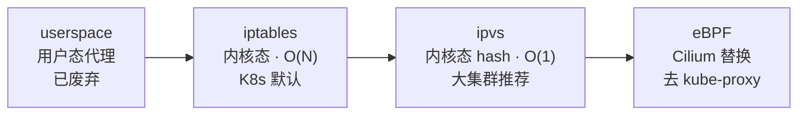

# K8s 异构 & 网络插件

异构混部 · CNI 三大流派 · 从 Overlay 到 hostNetwork

::: tip 一句话结论
异构靠标签+调度四把刀，CNI 按规模选（Flannel/Calico/Cilium），游戏后台跳出 Overlay 用 hostNetwork 直连。
:::

## 场景问题

### 异构混部：一群"不一样"的机器混在一起

- **CPU 异构**：x86 (Intel/AMD) + ARM (鲲鹏/飞腾/Graviton) + 国产化（龙芯/申威）
- **加速器异构**：GPU (A100/H100/T4) + NPU (Ascend) + FPGA + DPU
- **调度目标**：让 Pod 落到匹配的节点，避免 x86 镜像跑到 ARM 节点上崩
- **典型场景**：训练用 GPU 节点池，推理用 CPU 节点池，前端 Web 用普通节点池；游戏 DS 战斗集群一机一 Pod（本项目就是）

### 异构调度的四把刀

- **Node Label**：`kubectl label node n1 node_type=ds arch=arm64 gpu=a100`
- **NodeSelector**：Pod 声明 `nodeSelector: {node_type: ds}`——**硬约束**
- **Taint / Toleration**：节点打 taint `gpu=true:NoSchedule`，Pod 显式容忍才能调度上——防止普通 Pod 抢 GPU 节点
- **Affinity / AntiAffinity**：
  - `nodeAffinity`：软/硬亲和 (更强表达力)
  - `podAntiAffinity`：DS 战斗进程用 `topologyKey: kubernetes.io/hostname` 强制**一机一 Pod**
- **多 Runtime**：`containerd`（默认）+ `kata-containers`（虚拟化隔离）+ `runc`；通过 `RuntimeClass` 让 Pod 选运行时

## 实现方案

### 异构落地清单

- 每类节点打 label（`arch=`, `gpu=`, `node_type=`）
- 每个工作负载**明确 nodeSelector/Affinity**，别赖默认调度器
- 关键机器加 taint 防止普通 Pod 抢占
- 多架构镜像用 **Docker Manifest / `docker buildx`** 构建 arm64+amd64 双平台，Pull 时自动匹配
- 通过 `topologySpreadConstraints` 打散跨可用区/机架

### CNI 选型决策

- **中小集群、快速起步** → Flannel VXLAN
- **需要 NetworkPolicy、跨机房** → Calico BGP（BGP 通）或 IPIP（BGP 不通）
- **大集群、性能极致、L7 策略** → Cilium (eBPF)
- **游戏后台、跨集群直连需求** → **hostNetwork DaemonSet**（本项目）+ 一层业务级 Mesh 做路由

### Sidecar 精简与 XDS 下发爆炸的应对

- **Sidecar CR** 声明依赖：只下发本 Pod 真正调用的服务，**避免全量**
- **命名空间级隔离**：`Sidecar.workloadSelector` + `egress.hosts`
- **eBPF Cilium**：完全去 Sidecar，控制面成本降到近零
- **DPU 卸载**：把 Envoy 或 eBPF 数据面卸载到 SmartNIC/DPU（未来趋势）

### 本项目具体落地

- `hostNetwork: true` DaemonSet，宿主机 `0.0.0.0:8000`
- 业务 Pod 通过 Downward API 注入 `HOST_IP`，参数 `--mesh=$HOST_IP:8000`
- 跨集群：多地域各一份 kubeconfig，运维面板读多集群 `Nodes().List()` 组网
- 接入层：托管 K8s 直连 CLB（`isDirectConnect: true`），按运营商 `-dx/-yd/-wt` 拆 CLB

## 为什么这么做

### K8s 网络四大原则

1. 每个 Pod 都有**独立 IP**（Pod IP 平面）
2. Pod 与 Pod 之间**直接互通**，无需 NAT
3. 节点上的 Agent（kubelet/kube-proxy）能与本节点所有 Pod 通信
4. Pod 看到的自己 IP == 别的 Pod 看到的它的 IP（**IP 一致性**）

### Service / kube-proxy 的演进史（面试高频）

kube-proxy 的核心工作只有一件：把发往 **Service ClusterIP（虚拟 IP，无实体）** 的流量，负载均衡到后端一组真实 Pod IP（Endpoints）。它 watch API-Server 的 Service/Endpoints 变化，把规则同步到内核。四个模式一条主线：**转发从用户态搬回内核态、规则匹配从 O(N) 优化到 O(1)、最后连 kube-proxy 本身都被 eBPF 干掉。**

- **① userspace（远古，已废弃）**：kube-proxy 自己在**用户态**监听端口做代理转发。每个包都要 **内核态 ↔ 用户态来回拷贝一次**，上下文切换开销巨大；且 kube-proxy 进程挂了转发就断。慢到没法用，早废弃。
- **② iptables（K8s 默认）**：kube-proxy 只当"规则搬运工"——把转发规则写进内核 **netfilter/iptables**，转发全在内核态完成，不再拷贝到用户态，性能大幅提升。**痛点是规则匹配是线性链表 O(N)**：每个 Service 生成一串 `KUBE-SERVICES → KUBE-SVC-xxx → KUBE-SEP-xxx` 规则，5000+ Service 时匹配一个包要顺着链表往下扫，且**每次 Endpoint 变化要全量 rewrite 规则**，sync 耗时飙到秒级甚至分钟级，规则刷新时还可能丢包。负载均衡靠 `statistic` 模块的概率跳转，本质是随机，**不支持真正的算法**。
- **③ ipvs（大集群推荐）**：底层换成内核的 **IPVS（IP Virtual Server，本就是 LVS 的内核模块）**，用 **hash 表存规则，查找 O(1)**，规则再多匹配耗时也恒定；增量更新 Endpoint 无需全量 rewrite。支持丰富的负载均衡算法：**rr（轮询）/ wrr（加权轮询）/ lc（最少连接）/ dh（目标哈希）/ sh（源哈希）**。注意：ipvs 只管 LB，**NetworkPolicy / SNAT 这些仍需要少量 iptables 规则兜底**，是"ipvs + 少量 iptables"混合模式。大集群务必从 iptables 切到 ipvs。
- **④ eBPF（Cilium kube-proxy replacement）**：更激进——**完全不装 kube-proxy**。Service → Endpoint 的转发表直接做进 **eBPF map**，在 socket / tc 挂载点做转发（`socket-LB` 甚至在建连时就把 ClusterIP 改写成 Pod IP，省掉每包 DNAT）。绕过整条 iptables/ipvs 链路，**O(1) 查 map + 内核态直连**，5000+ Service 规模优势碾压，同时天然支持 L3-L7 策略与超强可观测。代价是内核版本要求高（≥4.19，强推荐 ≥5.10）。

::: tip 一句话记忆
userspace 慢在**用户态拷贝**；iptables 快了但**规则 O(N)**；ipvs 用 **hash 做到 O(1)** 且支持真正的 LB 算法；eBPF 干脆**把 kube-proxy 整个删掉**，转发做进内核 map。
:::

### Ingress vs Gateway API

- **Ingress**：K8s 早期方案，抽象度低（只 host/path），能力靠 `annotations` 各家自定义 → **不可移植**
- **Gateway API**（新一代）：三层资源模型 `GatewayClass` / `Gateway` / `HTTPRoute|TCPRoute|GRPCRoute`，**类型安全、跨实现可移植**
- 生产落地：Nginx-Ingress、APISIX、Envoy Gateway、Cilium Gateway、某云厂商托管 K8s 直连 Ingress（自定义 Ingress，非标准 nginx）

### Service Mesh：数据面演进

- **Sidecar (Istio + Envoy)**：每 Pod 一个 Envoy——**协议栈反复横跳** + **XDS 全量下发**（500 服务 × 10 Pod = 每 Envoy 5000 实例）
- **Node-level (Cilium Service Mesh / Ambient Istio)**：一节点一代理，**去 Sidecar**，共享数据面
- **eBPF 干掉反复横跳**：Cilium eBPF 数据面**内核态直连**，绕过用户态 socket 拷贝

## 为什么别的选择不行

### CNI 三大流派原理对比

| 插件 | 数据面原理 | 控制面 | 优点 | 缺点 |
| --- | --- | --- | --- | --- |
| **Flannel (VXLAN)** | Overlay：Pod 报文封装成 UDP，节点间走 VXLAN 隧道 (VNI) | 简单，etcd 存 subnet 划分 | **极简**，装完就能跑；跨节点无需路由配合 | **双封装**性能损耗 ~10-15%；不支持 NetworkPolicy |
| **Calico (BGP)** | BGP 直路：节点间用 BGP 广告 Pod CIDR，走宿主机路由表**不封装** | BGP RR (Route Reflector) + Felix Agent | **性能接近裸金属**；支持 NetworkPolicy；跨机房友好 | 需要网络设备支持 BGP 或用 IPIP 模式回退 |
| **Calico (IPIP)** | 轻量隧道：IP-in-IP 单封装 | 同上 | BGP 不通时的兜底 | 仍有一层封装 |
| **Cilium (eBPF)** | **内核 eBPF 数据面**：绕过 iptables/kube-proxy，直接在 socket/tc 层转发 | 基于 eBPF map，控制面 daemon | **性能最强、可观测最强**；L7 策略、mTLS 都能做 | 内核版本要求 (≥4.19 强推荐≥5.10)；学习曲线陡 |

### 生产踩坑清单

- **VXLAN 上 MTU 未减 50 字节**：包分片导致跨节点 gRPC 超时 → 显式设置 `mtu: 1450`
- **iptables 规则过万导致 kube-proxy sync 分钟级**：Service 5000+ → 切 ipvs 或 eBPF
- **NodeLocal DNSCache 未启**：CoreDNS 打爆 → 每节点部署 DNSCache Pod
- **CNI IP 池耗尽**：Pod 疯狂重启回收 IP 慢 → 加大子网 / 用 Calico IPPool 分层
- **NetworkPolicy 与 Ingress Controller 冲突**：Ingress 拦截被 NetworkPolicy 阻掉 → **命名空间级白名单** + 显式放行 `ingress-nginx`
- **Cilium 升级踩内核 bug**：eBPF map 冲突 → 升前灰度节点，滚动升级

### Overlay 依赖 vs 主机网络直连（本项目实战对比）

**Overlay 依赖（业界主流）**：
- 跨集群靠 Submariner / Skupper / KubeVirt-CNI 之类构建二层
- 好处是抽象干净；坏处是**多一层封装 + 依赖 K8s 网络组件稳定性**

**主机网络直连（自研 Mesh 采用）**：
- `hostNetwork: true` 的 DaemonSet；跨集群走公司内网直接连宿主机 IP
- **规避 K8s 网络组件频繁异常**（Sidecar 时代真实痛点）
- 缺点：占用宿主机端口；调度需要 `hostPort` 冲突检测

## 沉淀结论

- **异构混部**靠 label + nodeSelector/affinity + taint + 多架构镜像四把刀落地，别赖默认调度器。
- **CNI 选型**按规模走：小集群 Flannel VXLAN 图省事；要 NetworkPolicy/跨机房上 Calico BGP（不通回退 IPIP）；大集群、L7、极致性能上 Cilium eBPF。
- **Service 转发 / kube-proxy 演进**：userspace（用户态拷贝，废弃）→ iptables（内核态但规则 O(N)，K8s 默认）→ ipvs（hash 表 O(1)+ 真 LB 算法，大集群推荐）→ eBPF（Cilium 直接替换掉 kube-proxy，转发进 eBPF map）。主线是**转发搬回内核态 + 匹配从 O(N) 到 O(1) + 最终去 kube-proxy**。大集群务必从 iptables 切 ipvs 或 eBPF，否则 5000+ Service 时 sync 分钟级还可能刷新丢包。
- **游戏后台**的结论是跳出 Overlay：`hostNetwork` DaemonSet + 业务级 Mesh 做路由，用宿主机 IP 直连规避 K8s 网络组件频繁异常，代价是占端口、需 `hostPort` 冲突检测。

### 记忆口诀

**异构四把刀**：Label / NodeSelector / Taint-Toleration / Affinity
**CNI 三流派**：Flannel-VXLAN封装 / Calico-BGP直路 / Cilium-eBPF内核
**kube-proxy 演进**：userspace用户态 / iptables-O(N) / ipvs-O(1) / eBPF去proxy
**游戏后台**：hostNetwork / 宿主机IP直连 / 避开Overlay / 占端口

## 自测：合上资料能说清楚吗？

kube-proxy 从 iptables 到 ipvs 再到 eBPF，核心解决的是什么问题？

参考答案

主线是**转发搬回内核态 + 匹配从 O(N) 到 O(1) + 最终去 kube-proxy**。iptables 规则是**线性链表 O(N)**，5000+ Service 时 sync 分钟级还可能丢包；ipvs 用 **hash 表 O(1)** 且支持真 LB 算法；eBPF 把转发做进 **map**，直接删掉 kube-proxy。

Flannel VXLAN 和 Calico BGP 数据面原理有何本质区别？各适合什么场景？

参考答案

**Flannel VXLAN** 是 **Overlay 双封装**（报文封成 UDP 走隧道），极简但性能损耗 ~10-15%、不支持 NetworkPolicy，适合中小集群快速起步。**Calico BGP** 用 **BGP 广告 Pod CIDR 走宿主机路由表不封装**，性能接近裸金属、支持 NetworkPolicy、跨机房友好，但需网络支持 BGP（不通则回退 IPIP）。

为什么游戏 DS 战斗集群选 hostNetwork 直连而不是业界主流的 Overlay？

参考答案

用 `hostNetwork: true` DaemonSet 让业务走**宿主机 IP 直连**，**规避 K8s 网络组件频繁异常**（Sidecar 时代真实痛点），跨集群走公司内网直连即可。代价是**占用宿主机端口**、调度需 `hostPort` **冲突检测**。战斗进程还用 `podAntiAffinity` 强制**一机一 Pod**。

异构混部要让 Pod 精准落到匹配节点，靠哪几个机制？

参考答案

四把刀：**Node Label** 打标（arch/gpu/node_type）→ **NodeSelector** 硬约束 → **Taint/Toleration** 防普通 Pod 抢 GPU 节点 → **Affinity/AntiAffinity** 更强表达力。镜像用 `docker buildx` 构建**多架构 manifest**，Pull 时自动匹配 arm64/amd64。关键：别赖默认调度器。

Sidecar Mesh 的 XDS 全量下发为什么会爆炸？怎么应对？

参考答案

500 服务 × 10 Pod = 每个 Envoy 要下发 **5000 个实例**，控制面成本爆炸。应对：用 **Sidecar CR** 声明依赖只下发真正调用的服务、**命名空间级隔离**（workloadSelector+egress.hosts）、上 **eBPF Cilium 去 Sidecar** 把控制面成本降到近零、或把数据面 **卸载到 DPU**。

## 内容来源

迁移自 guide/theme-k8s-network（综合整理）
